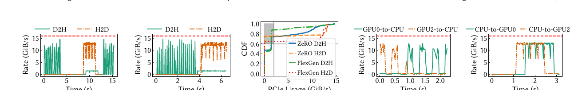
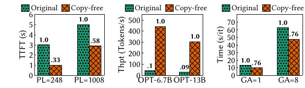
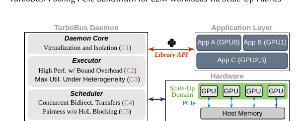
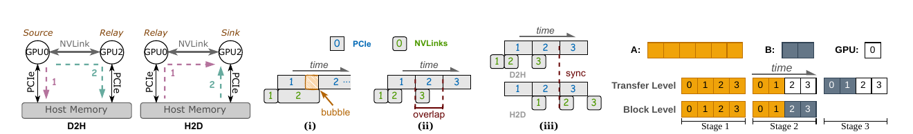
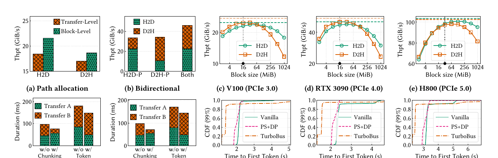
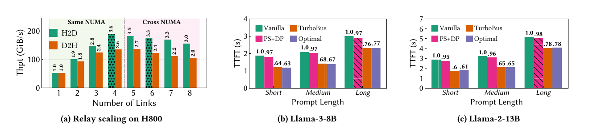
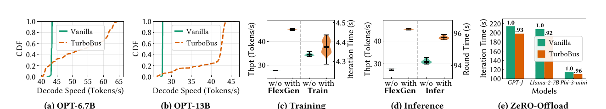

# TurboBus（SIGCOMM 2026）：借助单机高速互连池化 PCIe 带宽的论文解构、项目启示与验证建议

> 论文原文：[同目录 PDF](<[SIGCOMM 2026] TurboBus Pooling PCIe Bandwidth for LLM Workloads via Scale-Up Fabrics.pdf>)  
> 证据口径：本文把论文陈述、实测数据、分析模型、本文推断和项目建议分开标注。页码均指 PDF 页码。图像由原论文页面本地裁取，未重绘数据。  
> 阅读目标：判断 TurboBus 解决了什么瓶颈、四项核心优化如何起作用、论文证据能够支持哪些项目判断，以及哪些结论仍需在面向国产 AI 硬件的统一异构大模型注意力键值缓存存储底座上重新验证。

| 项目 | 信息 |
|---|---|
| 论文题目 | *TurboBus: Pooling PCIe Bandwidth for LLM Workloads via Scale-Up Fabrics* |
| 作者 | Xinyu Yang、Kaiqiang Xu、Kai Chen |
| 机构 | Hong Kong University of Science and Technology，iSING Lab |
| 会议 | ACM SIGCOMM 2026 |
| DOI | 10.1145/3789240.3829130 |
| 原文篇幅 | 14 页 |

## 1. 一页读懂论文

### 1.1 论文解决什么问题

KVCache（大模型注意力键值缓存，即自回归生成过程中保存历史 Key/Value 激活、避免后续 Token 重算注意力的张量）卸载、按需模型加载和显存受限训练都会把大量数据放到 Host 内存。这样能降低 GPU 显存占用，却把瓶颈转移到 CPU 与 GPU 之间的 PCIe 传输。

表面现象是单张 GPU 的 PCIe 链路不够快。论文指出，更准确的根因是链路所有权过于僵硬：每张 GPU 通常只能使用自己的 PCIe 路径。一个作业把本地链路打满时，同机其他 GPU 的链路可能仍处于空闲状态，但前者无法借用。结果是“局部饱和、整体空闲”同时出现。

TurboBus 的目标不是减少数据量，也不是改变 KVCache 的语义，而是把同一 Scale-Up Fabric（单机内 GPU 之间的高带宽互连，如 NVLink/NVSwitch）域内可到达的 PCIe 链路组成共享资源池。源 GPU 可以经邻居 GPU 中继，再使用邻居的 PCIe 链路访问 Host 内存。

### 1.2 根因：单链路所有权与阶段性流量错峰

论文测得 ZeRO-Offload 和 FlexGen 的 PCIe 流量都带有明显的阶段性。ZeRO-Offload 在梯度回传、CPU 优化器计算和权重加载之间交替；FlexGen 在 Prefill 与 Decode 阶段产生不同方向、不同强度的数据流。不同 GPU、不同作业的传输窗口往往错开。

H2D（Host-to-Device，从主机内存传入 GPU）与 D2H（Device-to-Host，从 GPU 写回主机内存）分别代表 PCIe 的两个传输方向。论文 Table 1 显示，在 16 GB/s 的 PCIe 3.0 x16 链路上，ZeRO-Offload 的 H2D/D2H 平均利用率分别为 19.22%/17.82%，FlexGen 为 26.78%/8.39%。Fig. 2(c) 进一步显示，超过 60% 的时间里，链路带宽不超过 2 GB/s。这里的矛盾不是“服务器没有 PCIe 带宽”，而是“空闲带宽不能跨 GPU 被调度”。

*图 1：ZeRO-Offload 与 FlexGen 的 PCIe 流量具有突发、分阶段和跨 Rank 错峰特征；利用率 CDF 显示大量时间处于低带宽状态。来源：论文 Fig. 2，PDF p.3；证据类型：MEASURED DATA。*

### 1.3 核心洞察

现代多 GPU 服务器同时存在两类链路：GPU 访问 Host 内存主要经过 PCIe，GPU 之间则通过带宽更高的 NVLink、NVSwitch、Infinity Fabric 或 UALink 互连。论文在 V100 平台给出的典型值是 NVLink 每方向 50 GB/s，PCIe 每方向 16 GB/s。

只要 GPU 间互连明显快于 PCIe，源 GPU 就可以先把数据交给邻居 GPU，再由邻居走自己的 PCIe 链路。额外的 GPU 间中继跳不会成为新瓶颈，多个 PCIe 路径反而可以并行工作。TurboBus 将“某张 GPU 的 PCIe 链路”改造成“同一高速互连域内可借用的 PCIe 路径集合”。

### 1.4 核心抽象

TurboBus 的核心抽象是“可池化传输路径”。一条请求可以同时使用：

- 源 GPU 自己的直接 PCIe 路径；
- 经单跳 GPU 间互连到邻居 GPU、再走邻居 PCIe 的中继路径。

直接路径并不是与池化系统并列的特殊快路径，而是路径池中的一条普通路径。节点级特权守护进程统一接收跨作业请求、维护拓扑、分配路径并提交 CUDA 传输。应用进程不直接访问其他租户的 GPU，因此跨作业中继不需要破坏进程隔离。

### 1.5 四项关键优化方法速览

#### 方法一：固定块流水式中继

- **问题**：整条传输采用“收完整包再转发”的存储转发方式，会在中继 GPU 上缓存整个 Payload，并把 NVLink 与 PCIe 两个阶段串行起来。
- **方法**：把传输切成固定大小的块。中继 GPU 一边经 PCIe 转发当前块，一边通过 GPU 间互连接收下一块。
- **效果**：中继显存开销与传输总大小解耦；GPU 间中继跳可被 PCIe 传输时间掩盖。V100 上选用 16 MiB 块时，双向流水仅需 64 MiB 固定缓冲。

#### 方法二：跨传输的块级路径动态分配

- **问题**：按整条传输锁定路径时，最后一轮通常只剩少量尾块，其他路径空闲；后续请求即使已经就绪也不能填空。
- **方法**：每轮按块而不是按完整传输分配直接路径和中继路径，从所有活跃请求中选择可发送块。
- **效果**：不同大小请求可以共同填满路径尾部空洞。论文的 100 条、30–256 MiB 随机传输微基准中，吞吐最高提高 20%。

#### 方法三：利用高速互连余量并发双向传输

- **问题**：H2D（Host-to-Device，从主机内存到 GPU）与 D2H（Device-to-Host，从 GPU 到主机内存）可能共享同一条 NVLink。串行化会让部分 PCIe 路径空闲，直接由两个线程分别同步又会触发 CUDA 运行时干扰。
- **方法**：限制中继为单跳、每个 PCIe 方向同时只服务一个请求，让 H2D 与 D2H 同时共享 NVLink；由单控制线程按固定时隙统一同步活跃流。
- **效果**：当 GPU 间互连带宽至少约为 PCIe 的两倍时，两个方向都能维持 PCIe 速率，聚合吞吐高于任一方向优先的串行策略。

#### 方法四：大传输分块与令牌准入

- **问题**：按整条请求先进先出时，多 GB 传输会阻塞小型 KVCache 块；只优先小请求又可能让大传输长期饥饿。多个大请求同时均分路径，也会拉长平均完成时间。
- **方法**：把大传输切成 Chunk，每个大请求最多保留一个待执行 Chunk；大请求按到达顺序获得令牌，小请求绕过令牌插入执行。
- **效果**：小请求最多等待一个 Chunk 的时间；大请求避免彼此长期均分带宽。论文微基准中，分块使小请求完成时间降低 27%，令牌准入使两个大请求的完成时间降低 15%。

### 1.6 最重要的实验结果

TTFT（Time To First Token，首字生成延迟）用于衡量请求从到达到产生首个 Token 的时间。

| 论文主张 | 实验条件 | 结果 | 证据性质 |
|---|---|---:|---|
| 按需模型加载接近两链路分析上界 | 单 GPU 应用 + 单 GPU 专用中继；Llama-3-8B/Llama-2-13B | TTFT 降低 22%–40%，距分析上界 5% 以内 | MEASURED DATA + MODEL COMPARISON |
| 多租户突发负载改善中位响应 | 四 GPU 各自独立请求流；每 GPU 100 请求；泊松到达 | P50 TTFT 降低 17%–25%，但 P99 最多恶化 10% | MEASURED DATA |
| 两个 KVCache 卸载作业可相互中继 | 两个 FlexGen 实例；OPT-6.7B/13B；100 轮离线推理 | 超过 80% 轮次更快，吞吐最高提高 50%；其余轮次最多慢 3 tokens/s | MEASURED DATA |
| 异构共置可借用邻居空闲链路 | FlexGen 与训练或推理任务共置 | FlexGen 最高 1.6×；邻居任务开销低于 1% | MEASURED DATA |
| 传输占比较低时端到端收益受限 | ZeRO-Offload，DP=4，三种模型 | 训练迭代加速 4%–7% | MEASURED DATA |

TTFT 只在按需模型加载实验中被直接测量。FlexGen 的 KVCache 卸载实验测的是 Decode 吞吐，不应把 1.6× 吞吐写成 TTFT 改善。

### 1.7 最大局限

TurboBus 的收益依赖两个物理条件：可借用路径必须真正暴露新增的 Host 侧带宽；GPU 间互连还要足够快，不能在中继后成为新瓶颈。只有 PCIe Peer-to-Peer 的平台通常不满足第二个条件。跨 NUMA（Non-Uniform Memory Access，非一致内存访问）域时，UPI、内存控制器或 PCIe Switch 上行又可能先饱和。

论文的在线多租户结果还有一个不能回避的代价：P50 变好不代表尾部时延变好。Serverless 实验中，TurboBus 的 P99 TTFT 相比 PipeSwitch+DeepPlan 最多增加 10%。对于本项目强调 P99 TPOT（Time Per Output Token，每个输出 Token 的生成耗时）稳定性的在线推理场景，这不是小问题，而是必须继续补齐的调度与 QoS（Quality of Service，服务质量）缺口。

### 1.8 为什么与本项目相关

TurboBus 对面向国产 AI 硬件的统一异构 KVCache 存储与调度底座提供三类外部证据：

- **必要性证据**：卸载路径可能一边成为关键瓶颈，一边存在大量分散空闲带宽。只看单链路峰值或平均利用率不足以指导数据路径选择。
- **可行性证据**：拓扑感知、路径池化、固定块流水和跨请求细粒度分配能够把闲置物理链路转换成端到端收益。
- **差异化证据**：论文没有处理跨节点 KVCache 目录、语义一致性、租约、Direct-View（远端直读，即跨节点直接读取远端显存中的 KV 数据）与 Copy-to-HBM（拷贝到本地显存，即通过 DMA 将远端 KV 数据搬入本地 HBM）决策、分层介质、张量并行（Tensor Parallelism，TP）多卡协同流组以及 P99 QoS。这些仍是本项目必须独立解决的问题。

论文不能替项目证明 UBMEM（统一总线内存直通共享协议，支持跨节点与异构设备直接共享内存地址空间）、URMA（通用远程直接内存访问，即用户态高性能 RDMA 驱动接口与通信协议）、国产 NPU 片间互连或 NVMe SSD 直达路径可用。它提供的是“为什么要做拓扑与能力驱动调度”的外部依据，不是项目硬件上的验收结果。

## 2. 为什么这个问题值得解决

### 2.1 卸载把容量问题改写成数据移动问题

论文覆盖三类工作负载：

1. 按需模型加载：模型权重常驻 Host 内存，请求到达时再搬入 GPU；
2. KVCache 卸载推理：Prefill 产生的 KVCache 写回 Host，Decode 按需加载历史 KV；
3. 显存受限训练：梯度、优化器状态或权重在 GPU 与 Host 之间往返。

三者都用 Host 容量换取 GPU 显存空间。代价是大规模、方向交替的 PCIe 传输。Fig. 3 使用“把内存拷贝替换为空操作”的 What-if 对照，把传输成本从其他计算中剥离出来。该 Copy-free 条件不是可部署系统，只是归因基线。

*图 2：将数据拷贝替换为空操作后，PipeSwitch 的 TTFT、FlexGen 的解码吞吐和 ZeRO-Offload 的迭代时间明显改善。来源：论文 Fig. 3，PDF p.3；证据类型：MEASURED DATA；边界：Copy-free 是反事实归因基线。*

在论文评测条件下，PipeSwitch 的真实 TTFT 是 Copy-free 的 1.7–3.0 倍；FlexGen 的 KVCache 卸载吞吐约为 Copy-free 的十分之一；移除 ZeRO-Offload 的数据搬运后，迭代时间最多缩短 24%。这些数字说明传输已进入关键路径，但并不意味着把 PCIe 带宽翻倍就能获得同等比例的端到端加速。

### 2.2 “低平均利用率”不等于“没有瓶颈”

平均利用率会掩盖阶段性饱和。一个 Decode Step 可能短时间内把 H2D 打满，随后进入 GPU 计算；另一个作业恰好处于 D2H 或空闲阶段。对单个请求来说，传输窗口内仍受单链路限制。对整台服务器来说，又有多条链路在其他时段闲置。

因此，TurboBus 针对的是时间和空间上的资源错配：

    单请求关键窗口：本地 PCIe 饱和
             +
    同机其他 GPU：PCIe 链路空闲
             ↓
    通过高速 GPU 互连借用邻居 PCIe
             ↓
    单请求可使用多条物理 PCIe 路径

### 2.3 现有方案为何不够

DeepPlan、Torpor 一类方案可以在同一作业内借助邻居 GPU 加速 H2D 模型加载，但不处理跨作业借用，也不覆盖通用双向卸载。memHarvester 面向具有复用局部性的页迁移，依赖缺页触发和多级存储，和大块直接 CPU–GPU 搬运的执行模型不同。

论文认为，已有方案还普遍采用整包存储转发：完整接收一跳后再启动下一跳。这会增加中继显存，拉长流水预热，并难以在不同大小请求之间填满所有路径。TurboBus 因而把问题从“能不能中继”推进到“跨作业中继如何隔离、如何流水、如何处理双向共享、如何避免大小流相互拖累”。

## 3. 核心抽象与系统设计

### 3.1 节点级守护进程：用受控代理解决跨作业访问

不同作业具有独立地址空间，应用 A 不能直接打开应用 B 所占 GPU 的显存和链路。TurboBus 在每个节点部署一个有权访问所有 GPU 的守护进程，应用通过轻量 Client Library 提交传输请求。

Host Tensor 通过共享内存映射给守护进程；Device Tensor 通过 CUDA IPC 句柄共享。UNIX Domain Socket 只承载控制消息，不复制 Payload。守护进程代替应用执行跨 GPU 中继，应用仍看不到其他作业的设备地址。

*图 3：TurboBus 由守护进程核心、执行器和调度器组成。应用通过 Library API 提交请求，执行器在 GPU 高速互连域内使用直接与中继 PCIe 路径。来源：论文 Fig. 5，PDF p.5；证据类型：PAPER FACT / ARCHITECTURE.*

守护进程承担三类职责：

| 组件 | 所有状态与决策 | 是否在数据路径上 |
|---|---|---|
| 守护进程核心 | 跨进程连接、共享内存与 CUDA IPC 句柄、隔离边界 | 参与请求接收，不搬运 Payload |
| 执行器 | 固定块流水、直接/中继路径、块级分配 | 是 |
| 调度器 | H2D/D2H 并发、大小流分类、分块与令牌 | 是 |

### 3.2 拓扑抽象：路径必须对应真实独立带宽

TurboBus 启动时解析硬件拓扑，并形成三类结构：

- Link Group：可以共同提供新增 PCIe 带宽的链路集合；
- GPU-to-Link Mapping：每张 GPU 的直接 PCIe 路径；
- Relay Capability List：哪些 GPU 能经高速互连到达某条 PCIe 链路。

如果两个 GPU 只通过同一个 PCIe Switch 上行访问 Host，那么中继不一定带来新增带宽。论文把这类 GPU 放到不同 Link Group，避免把共享上行误判成两条独立路径。这条约束很重要：路径数量不是逻辑连接数，而是可并行兑现的物理带宽数。

### 3.3 请求执行生命周期

一次传输按以下顺序执行：

1. 应用建立会话，创建 Host/Device Tensor，并绑定为一对可传输对象；
2. 应用提交 H2D 或 D2H 请求，CUDA Stream 依赖通过异步回调保留；
3. 调度器按方向和大小分类，决定准入顺序；
4. 执行器把请求拆成固定块；
5. 每轮从活跃请求中取就绪块，分配直接 PCIe 或单跳中继路径；
6. 中继 GPU 使用双缓冲重叠 NVLink 与 PCIe；
7. 所有相关流在固定时隙边界统一同步；
8. 守护进程不可用时，请求退回本 GPU 自有链路上的原生 cudaMemcpy。

回退保留正确性，但不保留池化性能。这是论文明确给出的故障语义。

### 3.4 “零拷贝”概念不能混用

TurboBus 的 Zero-copy Memory Sharing 指 Client 与守护进程映射同一片 Host/Device 内存，避免跨进程额外复制。数据本身仍要在 Host 内存与 GPU 之间通过 PCIe 搬运。

本项目所说的 Host CPU 零数据拷贝，是 CPU 仅负责下发控制指令，不参与正文数据搬运，Host Payload Touch Bytes 为 0；而 Payload Bypass DDR（绕过主机内存，即数据直接在 NVMe SSD、远端设备与 NPU HBM 之间流转）进一步要求绕过 Host DDR。TurboBus 能支持前一类“CPU 不执行 memcpy”的思路，但不等于后一类“绕过 Host DDR”的设备直达路径。两者不能互相替代。

## 4. 关键技术实现与作用机理

*图 4：D2H 与 H2D 的直接/中继路径互为镜像；固定块流水将 NVLink 与 PCIe 重叠；块级分配用其他请求填补尾部空洞。来源：论文 Fig. 6，PDF p.6；证据类型：PAPER FACT / ARCHITECTURE.*

### 4.1 固定块流水式中继

#### 解决的问题

整包存储转发要求中继 GPU 先接收完整传输，再向下一跳发送。对于多 GB 模型权重或优化器状态，这会占用大量中继显存；两个链路依次工作，完成时间包含 NVLink 与 PCIe 两段串行成本。

#### 核心方法

TurboBus 把大传输切成固定大小块，使用双缓冲让“接收下一块”和“转发当前块”重叠。D2H 先经 NVLink 到中继，再经中继 PCIe 写入 Host；H2D 则先从 Host 经中继 PCIe 读入，再通过 NVLink 送到目标 GPU。

#### 实现路径

1. 执行器从请求中生成固定块；
2. 中继缓冲 A 经 NVLink 接收块 n；
3. 块 n 就绪后，缓冲 A 经 PCIe 转发；
4. 同时，缓冲 B 经 NVLink 接收块 n+1；
5. 两个缓冲交替，直到请求完成。

论文在 V100 上通过离线 Profiling 选择 16 MiB。每个方向需要两个缓冲，双向共四个缓冲，因此中继显存固定为 4 × 16 MiB = 64 MiB。小于半个块的请求直接绕过中继，因为调度与流水成本可能超过收益。

#### 为什么有效

优化前：

    完整 Payload 驻留中继显存
    → NVLink 完成
    → PCIe 开始

优化后：

    固定块双缓冲
    → NVLink 接收与 PCIe 转发重叠
    → 总时长接近较慢的 PCIe 阶段

关键前提是 GPU 间互连比 PCIe 快。若中继链路本身更慢，或与 PCIe 共享同一物理瓶颈，流水只会增加一跳，不会产生带宽收益。

#### 论文证据与效果

Fig. 8(c–e) 在 V100、RTX 3090 和 H800 上扫描块大小。块太小会放大 Kernel Launch 与同步成本；块太大又增加流水预热、排空和中继缓冲。Profiler 选中的块大小为 V100/RTX 3090 的 16 MiB、H800 的 32 MiB。对应点的中继吞吐距离两链路理想值约在 5%（H2D）和 6%（D2H）以内。

#### 代价与局限

- 块大小与硬件相关，不能直接照搬 16 MiB 或 32 MiB；
- 统一块大小可能与上层 KVCache Layer/Block 布局不一致；
- 小请求旁路会形成调度器不可控的背景流量，论文只以“小流量扰动有限”作为工程折中；
- 固定缓冲降低显存占用，但没有消除 Host 内存端点。

#### 对项目的意义：ADAPT

本项目可以吸收“硬件实测选择块大小 + 双缓冲重叠 + 小请求旁路需纳入干扰预算”的原则。实现上不能直接复制 CUDA 双缓冲。应由硬件能力矩阵记录 NPU 片间互连、PCIe、URMA 与 SSD DMA 的最佳块大小、同步成本和并发能力，再由描述符编译与异步流水执行器选择具体分段。

### 4.2 跨传输的块级路径动态分配

#### 解决的问题

一个请求的总块数通常不是路径数的整数倍。如果整条传输独占路径，最后一轮可能只有一两个尾块，其余路径闲置。后续请求即使已有就绪块，也要等前一条传输完全结束。

#### 核心方法

调度器每轮按块分配路径，允许请求 B 的就绪块填入请求 A 的尾部空洞。路径所有权从“整条传输持有”缩短为“一个块传输时隙持有”。

#### 实现路径

1. 为每条活跃传输维护待发送块队列；
2. 读取本轮空闲的直接/中继路径位图；
3. 从多个请求中挑选已就绪块；
4. 把块映射到空闲路径；
5. 一个时隙完成后释放路径并重新决策。

#### 为什么有效

优化前：

    传输级路径锁定
    → 尾块不足以填满所有路径
    → PCIe 空闲

优化后：

    块级路径复用
    → 其他请求填补尾部空洞
    → 聚合链路利用率提高

#### 论文证据与效果

Fig. 8(a) 使用 100 条、大小为 30–256 MiB 的生成传输。相对传输级路径分配，块级分配吞吐最高提高 20%。这项结果证明块级复用可以减少特定大小分布下的尾部浪费，但没有证明所有线上分布都能获得 20%。

#### 代价与局限

- 调度频率提高到每块一次，控制开销随块率增长；
- 多请求混排会改变单请求完成顺序，可能恶化尾部时延；
- 论文以简单位图和单跳中继避免路由搜索，没有给出大规模 NVL72 类交换域中的控制面复杂度；
- 论文未量化守护进程调度时延 P99、CPU 利用率和请求队列长度。

#### 对项目的意义：ADAPT

本项目的连续数据块区间清单描述符与硬件 Scatter-Gather 提交可以借鉴块级复用，但要保留 Layer、请求截止时间、TP 多卡协同流组和消费顺序语义。不能仅按“块是否就绪”做全局填空，否则可能把吞吐提高建立在 TTFT/TPOT 尾部抖动之上。

### 4.3 利用高速互连余量并发 H2D/D2H

#### 解决的问题

同一对 GPU 互相中继时，一个方向的 D2H 与另一个方向的 H2D 可能经过同一条 NVLink。把两个方向串行化，会迫使可用 PCIe 链路等待；由两个控制线程分别同步 CUDA Stream，又可能触发运行时内部锁。论文在测试平台上观察到这种同步干扰可使吞吐最多下降 40%。

#### 核心方法

TurboBus 利用“NVLink 带宽大于两倍 PCIe 带宽”的余量，让两个方向同时穿过同一 NVLink。单控制线程把执行划分为固定时隙，并在块边界统一同步所有活跃流，减少独立同步造成的运行时竞争。

#### 实现路径

1. 限制每条中继只走一个 GPU 间互连跳；
2. 每个 PCIe 方向同时只承载一个请求；
3. H2D 与 D2H 同时提交；
4. 两个方向分别由独立 Copy Engine 执行；
5. 单控制线程在统一时隙边界批量同步。

在这些限制下，同一条 NVLink 最多同时承载两个 PCIe 速率的数据流。若 NVLink 每方向带宽大于两倍 PCIe，两个方向即使共享仍不会被 NVLink 限速。

#### 论文证据与效果

Fig. 8(b) 比较 H2D 优先、D2H 优先和双向并发。双向并发的聚合吞吐更高。图和正文提供的是定性及柱状数据，不应编造一个统一百分比。

#### 代价与局限

- “两倍带宽”只覆盖 TurboBus 所约束的两条 PCIe-rate 流，不覆盖任意并发；
- 应用自己的 NCCL（NVIDIA Collective Communications Library，用于多 GPU 集合通信）/D2D 集合通信不受 TurboBus 调度；
- 如果集合通信已占满 NVLink，或其本身位于 TPOT 关键路径，中继会与前台通信竞争；
- CUDA 单线程统一同步是平台特定修复，不是可直接迁移的通用协议。

#### 对项目的意义：VALIDATE

这项方法与本项目的前后台 QoS、TP 多卡状态同步关系最紧密，也最容易被误用。需要在国产 NPU 上实测片间互连的单/双向带宽、Copy Engine 并发、集合通信共存和同步原语开销。只有在前台 TPOT P99 不被破坏时，后台 KVCache 中继才可进入主路径。

### 4.4 大传输分块与令牌准入

#### 解决的问题

统一路径池里同时存在多 GB 模型/优化器状态和数十 MiB KVCache 块。整传输 FCFS 会产生队头阻塞；最短任务优先又可能饿死大请求。两个大请求若同时均分所有路径，二者都更晚完成。

#### 核心方法

TurboBus 把大传输进一步切成可调度 Chunk，每个大请求最多提交一个未完成 Chunk。大请求必须获得按到达顺序分配的令牌；小请求无需令牌，可以在 Chunk 边界插入。

#### 实现路径

1. 请求进入时按阈值分为大、小两类；
2. 小请求直接进入块级队列；
3. 大请求排队获取令牌；
4. 获得令牌的大请求只提交一个 Chunk；
5. Chunk 完成后再提交下一个；
6. 请求完成后释放令牌给下一条大请求。

#### 为什么有效

分块把小请求的最坏等待从“一条完整大传输”收敛到“一个 Chunk”。令牌则避免多个大请求长期均分路径，降低平均完成时间。

#### 论文证据与效果

Fig. 8(f–g) 给出两组对照：

- 1 GiB 大请求与 32 MiB 小请求并发时，分块使完成时间降低 27%；
- 两个 1 GiB 大请求并发时，令牌准入使完成时间降低 15%。

#### 代价与局限

- 论文未给出长期到达流下的公平性、饥饿概率和 P99 等待；
- 单令牌会降低大请求并发度，不一定最大化吞吐；
- 大小阈值和 Chunk 大小需要随硬件、负载和 SLO 调整；
- 该策略不知道 KVCache 的 Layer 顺序、请求截止时间和 TP 多卡共同完成语义。

#### 对项目的意义：ADAPT

可迁移的是“把无限阻塞改造成有界阻塞”的原则。项目实现应把请求语义放进调度：Layer 0、在线 Decode、TP 多卡协同流组和临近 Deadline 的请求不能与普通后台换出共用一个简单 FCFS 令牌。

## 5. 实验到底证明了什么

*图 5：Fig. 8(a–g) 分别验证块级路径分配、双向并发、块大小和大小流调度；Fig. 8(h–j) 给出 Serverless TTFT 分布，同时暴露 P50 改善与 P99 退化。来源：论文 Fig. 8，PDF p.9；证据类型：MEASURED DATA。*

### 5.1 实验平台

主平台是 4 张 32 GB V100 的 DGX V100，通过 NVSwitch 互连，并暴露两条可池化的 PCIe 3.0 x16 链路，每条每方向约 16 GB/s。跨代微基准还使用 RTX 3090（PCIe 4.0）和 8-GPU H800（PCIe 5.0）。

实验全部启用 NVIDIA MPS（Multi-Process Service，允许多个进程共享 GPU 执行资源的运行时服务）。三类端到端工作负载均采用 TP=1。论文明确指出：同步 TP 组内部通常难以从 TurboBus 获得明显收益，但不同 TP 组、DP 副本或共置作业之间仍可能池化链路。

### 5.2 论文分析模型

论文把总时间分为计算时间 T_c 和不可重叠的数据传输时间 T_d：

    T = T_c + T_d
    T_opt = T_c + T_d / N
    Speedup = 1 / (1 - f + f / N),  f = T_d / T

N 是可用 PCIe 链路数。按论文估计，FlexGen 的 f 约为 90%，四链路分析上界约 3.0×；ZeRO-Offload 的 f 约为 24%，上界约 1.2×。

这是 MODEL OUTPUT，不是实测吞吐。模型还忽略了可与计算重叠的传输，只适合解释“数据传输占比越高，带宽池化越值得做”，不能替代线上 SLO 评测。

### 5.3 按主张组织证据

| Claim | 实验与基线 | 结果 | 证明了什么 | 没有证明什么 |
|---|---|---|---|---|
| 固定块流水可把中继开销压低 | 2/8 GiB 传输；V100、RTX 3090、H800；扫描 4–1024 MiB 块 | 选定块大小处，距双链路理想约 5%–6% | 合适块大小能掩盖单跳中继并摊薄固定开销 | 任意平台都适合相同块大小 |
| 块级分配减少路径尾部空洞 | 100 条 30–256 MiB 生成传输；传输级分配为基线 | 吞吐最高 +20% | 跨请求填空有效 | 线上 KVCache 分布必然 +20% |
| 双向并发优于串行 | 同一路径上同时运行 1 GiB H2D/D2H；方向优先为基线 | 聚合吞吐更高 | NVLink 余量可承载两个 PCIe-rate 流 | 集合通信满载时仍无干扰 |
| 分块与令牌改善大小流完成时间 | 1 GiB + 32 MiB；两个 1 GiB | -27%；-15% | 队头阻塞与大流互扰可被抑制 | 长期公平和 P99 已解决 |
| Serverless 多租户多数请求更快 | 每 GPU 100 请求；泊松到达；Vanilla、PS+DP | P50 -17%～-25%；P99 最多 +10% | 共享空闲链路改善中位 TTFT | 尾部时延全面改善 |
| 隔离条件下接近分析上界 | 单应用 GPU + 单专用中继；两链路 | TTFT -22%～-40%；距模型上界 5% 内 | 单跳流水额外成本较小 | 多租户竞争下仍接近上界 |
| 两个 PCIe-heavy 作业可互借 | 双 FlexGen，100 轮 | >80% 轮次更快；最高 +50% | 错峰流量提供相互借用窗口 | 长期生产流量下平均 +50% |
| 异构邻居受影响较小 | FlexGen + 训练/推理邻居 | FlexGen 最高 1.6×；邻居 <1% | 某些非 PCIe-bound 邻居可安全出借 | 任意共置任务都 <1% |
| 训练收益受 Amdahl 上限约束 | ZeRO-Offload DP=4，三种模型 | 迭代加速 4%–7% | 传输占比较低时端到端收益有限 | 其他训练阶段都能获得同等收益 |

### 5.4 扩展性与 NUMA 边界

*图 6：在 H800 上，同一 NUMA 域内增加链路接近线性扩展；跨 NUMA 后需要经过 UPI，聚合吞吐反而下降。右侧两组 TTFT 柱状图同时包含实测系统与分析模型上界。来源：论文 Fig. 9，PDF p.10；证据类型：MEASURED DATA + MODEL COMPARISON。*

H800 实验从 1 条链路扩展到 8 条。4 条本地 NUMA 链路时，H2D 达到单链路约 3.6×，D2H 约 2.6×。继续把远端 NUMA 链路等比例加入后，H2D 在 8 条链路时回落到约 3.0×，D2H 约 2.0×。

这组结果给出一个比“多链路越多越快”更可靠的判断：池化收益取决于整条 Host 侧路径是否增加净带宽。若 UPI、内存控制器或 PCIe Switch 上行先饱和，平均条带化会让快路径等待慢路径。

### 5.5 KVCache 卸载与共置实验

*图 7：两个 FlexGen 作业互相中继、FlexGen 与训练/推理邻居共置，以及 ZeRO-Offload 训练的端到端结果。来源：论文 Fig. 10，PDF p.11；证据类型：MEASURED DATA。*

FlexGen 配置为 Batch Size 32、输入 512 Token、输出 32 Token，模型权重留在 GPU，90% KVCache 卸载到 Host。两个同质 FlexGen 作业互相中继时，TurboBus 在超过 80% 的迭代中优于原生 FlexGen，最高提高 50%；较差轮次最多慢 3 tokens/s。

异构共置时，邻居运行训练或推理任务并提供中继 PCIe。FlexGen 最高获得 1.6× 吞吐，邻居端开销低于 1%。这只能说明论文选择的两类邻居在该负载下有足够余量，不能据此推出任何计算/内存密集型邻居都适合作为中继。

ZeRO-Offload 的 DP=4 实验覆盖 GPT-J、Llama-2-7B 和 Phi-3-mini。TurboBus 的训练加速为 4%–7%。论文 Profiling 显示 PCIe 只占迭代时间的 22%–30%，即使传输吞吐翻倍，端到端分析上界也只有约 12%–17%。实测捕获了该上界的 33%–41%。

## 6. 论文亮点与局限

### 6.1 把“链路所有权”识别为瓶颈，而不是只要求升级 PCIe

亮点在于资源建模。TurboBus 没有把每张 GPU 的 PCIe 当作不可拆分的私有属性，而是把 GPU 间可达性转换为多路径访问能力。这种抽象对拓扑感知调度很有价值。

局限是路径池仍限定在单节点。大型交换式 Scale-Up 域中的中继目标选择、故障域和控制面复杂度留作后续工作。

### 6.2 用固定块同时解决中继显存与流水空洞

固定块让中继缓冲有界，也给路径调度提供统一时间单位。块流水与块级分配是两个独立动作：前者重叠两跳，后者填补并发请求之间的路径空洞。论文把这两条因果链区分清楚，微基准也分别验证。

局限是统一块粒度与业务语义脱钩。KVCache 的 Layer 顺序、前缀范围、TP Rank 和 Deadline 不在块调度输入中。

### 6.3 双向并发建立在可检查的带宽不等式上

论文没有只写“并发更快”，而是给出可验证前提：单跳、每方向一条 PCIe-rate 流、GPU 间互连带宽至少为 PCIe 的两倍。这个条件可以进入硬件能力矩阵。

局限是论文调度不到应用自身的 D2D/NCCL 流量。当集合通信处于关键路径时，后台中继可能侵蚀 TPOT；论文只在 ZeRO-Offload 中给出 4%–7% 净收益，不能替代干扰隔离实验。

### 6.4 跨作业共享同时展示收益与尾部代价

跨作业守护进程解决了传统单作业中继无法借用其他租户链路的问题。Fallback 到原生 cudaMemcpy 也给出了清晰的降级路径。

P99 退化需要单独看待。论文选择接受中位数收益，以支持吞吐优先的 Serverless 场景。本项目若以在线 SLO 为主，不能复制这个优先级。

### 6.5 评测覆盖三类卸载，但 KVCache 场景仍偏窄

论文同时评测权重加载、KVCache 卸载和训练，能说明系统对大块双向传输有一定通用性。

KVCache 评测只使用 FlexGen、TP=1、固定输入输出长度和 90% Host 卸载。它没有覆盖 PD 分离（Prefill 与 Decode 计算生成解耦架构，即两个阶段部署到不同节点并经高速网络传输 KVCache）、跨节点远端缓存复用、Prefix Hit、不同 KV 布局、TP=8 多卡协同或真实线上长尾流量。

## 7. 论文没有解决什么

### 7.1 没有做 KVCache 语义一致性

TurboBus 接受一对 Host/Device Tensor 并搬运字节，不判断模型架构、Tokenizer、Prompt 模板、LoRA、对象版本、Ready 状态和租约。论文保证的是传输 API 语义，不是 KVCache 可消费语义。

### 7.2 没有做 Load-vs-Recompute 或 View-vs-Copy 决策

TurboBus 假设应用已经决定要搬运。它不比较加载总开销与本地重算，也不判断 Direct-View（远端直读）和 Copy-to-HBM（拷贝到本地显存）哪个更合适。项目的查询与放置计划决策仍需独立完成。

### 7.3 没有覆盖跨节点和分层介质

数据端点是 Host 内存与 GPU 显存，范围是节点内 PCIe。论文没有处理 URMA、远端 HBM、RoCE、NVMe SSD、GDS（GPUDirect Storage，显存直读存储技术，即 NVMe SSD 与显存之间绕过 CPU 和系统内存的 PCIe DMA 传输）、对象存储或跨节点故障恢复。

### 7.4 没有处理协同流组完成语义

TP=8 场景的计算启动取决于最慢 Rank。TurboBus 的调度单位是独立请求/块，没有 Coflow（服务于同一分布式步骤的一组相关子流，整体完成时间由最慢子流决定）抽象。论文还明确说同步 TP 组内部收益有限。

### 7.5 没有给出生产级尾部隔离

论文的分块只把单次阻塞限制到一个 Chunk，并未证明 P99/P99.9 达标。Serverless P99 退化最多 10% 已经说明共享路径竞争会进入尾部。硬件 QoS 队列、前后台优先级、动态退避和拥塞反馈不在设计内。

### 7.6 没有解决 Host 侧放置

H800 跨 NUMA 结果暴露了 Host 内存放置的重要性，但当前执行器仍等比例条带化，没有 NUMA-aware Allocator。论文讨论了这一改进方向，没有实现。

## 8. 对本项目的启发

### 8.1 可直接采用的原则

#### 路径能力必须绑定物理拓扑

硬件能力矩阵不能只记录标称带宽。至少应包含：

- 设备到 PCIe Root/Socket/NUMA 的映射；
- 多路径是否共享上行；
- 片间互连的单向、双向和并发带宽；
- Host 内存控制器与跨 Socket 链路容量；
- 不同块大小、队列深度和方向下的实测值；
- 与集合通信、SSD DMA、网卡 DMA 共存时的干扰数据。

#### 直接路径和中继路径使用同一可执行计划

TurboBus 把直接链路视为路径池成员，而不是固定优先的例外。项目的查询与放置计划也应统一表达本地直达、远端直达、中继、SSD 加载和回退路径，并记录实际执行路径与计划是否一致。

#### 故障时保留正确性回退

TurboBus 守护进程失效后回退到原生 cudaMemcpy。项目也应把性能优化路径设计成可撤销：中继、远端直读或多路径聚合失败时，必须能回到 Copy-to-HBM、本地重算或其他已验证路径。

### 8.2 需要改造后采用的原则

#### 固定块流水需要升级为语义感知流水

项目不能只追求总线填满。Layer 0、临近 Deadline 的在线请求、TP 多卡协同流组和后台换出需要不同优先级。描述符编译器应在保持连续 DMA 的同时，保留 Layer、请求、Rank、租约和完成依赖。

#### 块级路径分配需要接入成本模型

TurboBus 每轮用位图重分配路径，适合小规模单跳域。项目还需考虑远端 RTT、队列状态、HBM 水位、复制/直读边界和重算成本。只有预计拉取与加载总开销低于本地重算，才应进入传输。

#### 双向并发需要接入前后台服务质量保障

SemanticQoS（前后台服务质量保障策略，即通过硬件优先级队列和应用层动态退避限制后台搬运对前台 TPOT 的影响）应监控片间互连、PCIe、网卡和内存控制器的共同占用。不能仅凭标称 NVLink/UB 带宽判断“还有余量”。

#### 跨作业守护进程需要扩展安全与配额

论文主要依靠进程隔离和特权代理。项目还要加入租户授权、内存注册凭证、对象语义校验、带宽配额、审计、撤销和故障恢复。节点级守护进程不能成为无配额的全局旁路。

### 8.3 不应照搬的实现

- 不应固定采用 16 MiB/32 MiB 块或 8 MiB 旁路阈值；
- 不应对跨 NUMA 路径做无差别平均条带化；
- 不应把单个全局令牌当作所有大流的最终调度策略；
- 不应把 CUDA IPC、NVIDIA MPS 或 cudaLaunchHostFunc 视为国产 NPU 的直接实现方案；
- 不应把 P50 改善、P99 退化的策略用于要求尾部稳定的在线主路径；
- 不应把 Host 内存中继解释为绕过 Host DDR 的设备直达；
- 不应把“借用多条 PCIe 链路”混同于 1-to-N 热点 KVCache 分发。TurboBus 是多路径汇聚，不是多接收端广播。

## 9. 对项目立项的证据价值

### 9.1 Problem Validation：论文独立确认了哪些问题

TurboBus 独立确认了三项与本项目相关的工程事实：

1. 数据卸载可能占据推理或训练关键路径；
2. 高峰期单链路饱和与整机平均低利用率可以同时存在；
3. 不理解拓扑和并发时序的静态传输路径会浪费可用硬件能力。

这支持项目建设统一硬件能力矩阵、拓扑感知路径选择和异步数据流编排的必要性。

### 9.2 Mechanism Validation：哪些方向获得了外部技术支持

论文实测支持以下底层原则：

- 把物理独立链路组成路径池，可以提高单请求可用带宽；
- 固定块双缓冲可以隐藏更快中继跳；
- 细粒度路径分配可以填补异构大小传输造成的空洞；
- 大小流需要不同的准入与抢占策略；
- 端到端收益受不可重叠传输占比约束，必须用 Amdahl 模型先判断上限。

这些原则能为项目的硬件能力探测、描述符编译、异步流水和动态路径调度提供参考。

### 9.3 Research-Gap Validation：哪些未解问题构成项目继续投入的依据

TurboBus 的边界与本项目范围有明显交集：

- 论文只搬运字节，本项目还要判断 KVCache 是否可安全消费；
- 论文只看节点内 Host–GPU，本项目还要处理远端 HBM、SSD 和跨节点网络；
- 论文接受 P99 退化，本项目要求前台 TPOT 尾部稳定；
- 论文以独立请求调度，本项目还要处理 TP 多卡状态同步和协同流组；
- 论文没有 Load-vs-Recompute、Direct-View 与 Copy-to-HBM 的动态决策。

这些差距说明 TurboBus 不能替代统一异构 KVCache 存储与调度底座。它更像底层单机路径池化的参考实现。

### 9.4 Unsupported Project Claims：论文不能替项目证明什么

TurboBus 不能证明：

- UBMEM（统一总线内存直通共享协议，即跨节点与异构设备间共享内存地址空间的底层能力）在目标硬件上的带宽、时延和故障语义；
- URMA 路径能够做到 Host CPU 零数据拷贝；
- NVMe SSD 与 NPU HBM 的设备直达可用；
- Direct-View 在目标工作负载上优于 Copy-to-HBM 或本地重算；
- 语义一致性与租约校验能够避免陈旧 KVCache 被消费；
- TP=8 多卡状态同步耗时或 Coflow 偏斜达到项目目标；
- 前后台混压下 TTFT、QPS 和 TPOT P99 达到 E3 目标；
- 热点前缀的树状中继优于硬件多播或单源发送。

### 9.5 立项判断

| 判断维度 | TurboBus 提供的证据 | 仍需项目承担的证明责任 |
|---|---|---|
| 必要性 | 单链路瓶颈、整机空闲和错峰流量并存 | 在目标 NPU/服务器上复现同类资源错配 |
| 可行性 | 单跳高速互连中继与块级路径池化可接近两链路上界 | 验证 UBMEM/URMA/片间互连是否暴露独立新增带宽 |
| 差异化 | 论文未处理语义、跨节点、分层介质、TP 协同和尾部 QoS | 完成这些系统闭环并给出实测 |
| 风险 | P99 退化、NUMA 反向扩展、D2D 干扰 | 建立成本准入、拓扑选择、QoS 和安全回退 |

结论应保持克制：论文支持“拓扑感知的带宽池化值得验证”，不支持“在目标项目上必然得到 1.6× 或 40% 改善”。

## 10. 建议验证

以下实验只保留会改变架构选择或路径准入的项目。所有结果必须绑定硬件型号、固件/驱动、拓扑指纹、代码版本、块大小、队列深度和实际完成字节。

### 10.1 单链路与中继路径能力扫描

- **假设**：目标 NPU 的片间互连可以让一个设备借用邻居的独立 PCIe/Host 侧路径，并提供净新增带宽。
- **变量**：H2D/D2H、直接/单跳中继、1–N 条路径、4 KiB–1 GiB Payload、队列深度、同/跨 NUMA。
- **基线**：本设备直接路径。
- **指标**：有效带宽 P50/P99、完成时延、片间互连/PCIe/内存控制器计数、Host CPU 占用与 Host Payload Touch Bytes。
- **判定**：若中继未暴露独立上行或新增带宽低于同步与缓冲成本，禁用该拓扑。

### 10.2 块大小与描述符粒度联合标定

- **假设**：存在能够同时摊薄提交成本、控制缓冲并维持流水重叠的块大小区间。
- **变量**：块大小、连续区间数量、Scatter-Gather 段数、请求大小分布、单/双向传输。
- **基线**：整传输存储转发和固定小块提交。
- **指标**：聚合吞吐、首块到达、流水预热/排空、描述符编译耗时、缓冲占用、路径空闲率。
- **判定**：能力矩阵记录“平台 + 拓扑 + 方向 + 队列深度”的最优区间，不固化论文阈值。

### 10.3 块级复用的控制面上限

- **假设**：块级重新分配带来的链路收益大于每块调度开销。
- **变量**：活跃请求数、块率、路径数、大小流比例、守护进程 CPU 绑定。
- **基线**：传输级路径锁定。
- **指标**：调度耗时 P50/P99、CPU 利用率、路径利用率、单请求 P50/P99 完成时间。
- **判定**：若控制面 P99 或队列竞争吞噬收益，应放大时隙、批量编译或改为分层调度。

### 10.4 前台集合通信与后台中继混压

- **假设**：在硬件 QoS 与应用层退避配合下，后台中继可利用余量而不破坏前台 TPOT。
- **变量**：前台 Decode/AllReduce 负载、后台 H2D/D2H 强度、优先级队列、退避阈值、双向并发开关。
- **基线**：纯前台；前后台混压但无 QoS。
- **指标**：TPOT P50/P99/P99.9、TTFT、QPS、片间互连拥塞、PCIe 队列、后台有效带宽。
- **判定**：若前台 P99 TPOT 干扰率不能控制在项目门限内，后台中继只能作为条件路径。

### 10.5 TP 多卡协同流组

- **假设**：独立块级分配会造成 Rank 间到达偏斜，协同流组调度可以降低最慢 Rank 完成时间。
- **变量**：TP=4/8、每 Rank 数据量、路径异构、优先 Layer、背景流。
- **基线**：TurboBus 式独立请求/块调度。
- **指标**：Coflow Completion Time、最慢 Rank、偏斜系数、首层点火时间、集合通信等待。
- **判定**：若独立路径最优不能转化为协同流组最优，应在 QueryPlan（查询与放置计划决策引擎，即根据链路状态、算力与上下文长度选择加载或重算路径）与执行器中保留 Rank/Layer 关联。

### 10.6 负收益回退与故障注入

- **假设**：拓扑变化、守护进程故障或中继拥塞时，系统能在错误消费前回到已验证路径。
- **变量**：守护进程崩溃、中继 GPU 重置、链路降速、NUMA 迁移、句柄撤销、超时。
- **基线**：稳定直接路径。
- **指标**：错误码、回退时延、数据完整性、重复提交、资源泄漏、实际路径对账。
- **判定**：任何数据错误、悬挂或静默超时都应阻止中继进入生产主路径。

## 附录 A：证据索引

| 结论 | 原文位置 | 证据类别 | 条件与边界 |
|---|---|---|---|
| PCIe 传输最高占推理/训练关键路径的大部分 | Abstract；§2.1；Fig. 3，p.1–3 | PAPER FACT / MEASURED DATA | 三类指定参考系统 |
| 超过 60% 时间带宽不超过 2 GB/s | Fig. 2(c)，p.3 | MEASURED DATA | V100、指定 ZeRO/FlexGen 配置 |
| 平均链路利用率低于 27% | Table 1，p.3 | MEASURED DATA | PCIe 3.0 x16，16 GB/s |
| 跨作业守护进程代理中继 | §3.1；Fig. 5，p.5 | PAPER FACT | 单节点、特权守护进程 |
| 固定块流水与 64 MiB 中继缓冲 | §3.2.1，p.5 | PAPER FACT | V100 16 MiB 块 |
| 块级路径分配最高 +20% | Fig. 8(a)，p.9 | MEASURED DATA | 100 条、30–256 MiB 生成传输 |
| 双向并发优于串行 | §3.3.1；Fig. 8(b)，p.6、9 | MEASURED DATA | 单跳、NVLink > 2× PCIe |
| 分块 -27%，令牌 -15% | Fig. 8(f–g)，p.9 | MEASURED DATA | 指定 1 GiB/32 MiB 组合 |
| P50 TTFT -17%～-25%，P99 最多 +10% | Fig. 8(h–j)；§5.3.1，p.9–10 | MEASURED DATA | Serverless 仿真，泊松到达 |
| 隔离 TTFT -22%～-40% | Fig. 9(b–c)，p.10–11 | MEASURED DATA | 单应用 + 专用中继 |
| 距分析上界 5% 内 | Fig. 9(b–c)；式 (1)，p.8、10–11 | MODEL COMPARISON | 两条 PCIe 链路 |
| H800 跨 NUMA 后扩展回落 | Fig. 9(a)，p.10 | MEASURED DATA | Host 内存固定在本地 NUMA |
| 双 FlexGen 最高 +50% | Fig. 10(a–b)，p.11 | MEASURED DATA | 两作业互相中继、100 轮 |
| 异构共置最高 1.6×、邻居 <1% | Fig. 10(c–d)，p.11 | MEASURED DATA | 训练/推理邻居 |
| ZeRO-Offload 训练 +4%～+7% | Fig. 10(e)，p.11 | MEASURED DATA | DP=4，三种模型 |
| 仅 PCIe P2P 或集成 CPU–GPU 平台不适用 | §7，p.12 | PAPER FACT / LIMITATION | 硬件架构边界 |

## 附录 B：术语表

| 术语 | 本文含义 |
|---|---|
| PCIe | Peripheral Component Interconnect Express，CPU、GPU、网卡、SSD 等设备之间的高速 I/O 总线 |
| Scale-Up Fabric | 单机或机架内加速器之间的高带宽互连，如 NVLink、NVSwitch、Infinity Fabric、UALink |
| H2D / D2H | Host-to-Device / Device-to-Host，主机内存到设备、设备到主机内存的数据传输方向 |
| Relay | 中继；数据经邻居 GPU 的高速互连和 PCIe 路径转发 |
| NUMA | Non-Uniform Memory Access，CPU 到不同内存域的访问带宽和时延不一致 |
| MPS | NVIDIA Multi-Process Service，允许多个进程共享 GPU 执行资源的运行时服务 |
| TTFT | Time To First Token，首字生成延迟 |
| TPOT | Time Per Output Token，每个输出 Token 的生成耗时 |
| KVCache | 大模型注意力键值缓存，用于避免自回归生成时重复计算历史注意力 |

---

**最终判断**：TurboBus 最有价值的贡献，不是某个 CUDA API 或 16 MiB 参数，而是把“单卡私有 PCIe 链路”重新建模成“可由高速互连到达、可按块调度、可故障回退的路径池”。论文用微基准和三类端到端负载证明这套思路能够兑现收益，也用 P99 退化和跨 NUMA 反向扩展暴露了边界。对本项目而言，值得吸收的是拓扑与能力驱动的路径池化、细粒度异步流水和有界阻塞；仍需自行完成的是 KVCache 语义、跨节点与分层介质、TP 多卡协同以及前台尾部时延保护。
