# Beluga（SIGMOD 2026）：基于 CXL 交换内存池的 KVCache 管理架构、作用机理与项目启示

> 论文：*Beluga: A CXL-Based Memory Architecture for Scalable and Efficient LLM KVCache Management*  
> 作者：Xinjun Yang、Qingda Hu、Junru Li 等，Alibaba Cloud Computing  
> 出版：*Proceedings of the ACM on Management of Data*, Vol. 4, No. 1, Article 13，SIGMOD 2026，29 页  
> DOI：[10.1145/3786627](https://doi.org/10.1145/3786627)  
> 原文：[同目录 PDF](<[SIGMOD 2026] Beluga A cxl-based memory architecture for scalable and efficient llm kvcache management.pdf>)  
> 图像说明：文中原图均由本地 Poppler 渲染后裁切，仅去除无关页边与正文，没有改写图内数据。

## 阅读口径与证据分类

本文围绕一个工程决策来读 Beluga：论文有哪些证据支持 CXL 交换内存池承担 KVCache 数据路径，哪些设计可以迁移到面向国产 AI 硬件的统一异构 KVCache 存储与调度底座，哪些结论仍需重新验证。

为避免把论文结果、分析判断和项目目标混在一起，后文使用以下口径：

| 标记 | 含义 |
|---|---|
| 论文事实 | 论文明确描述的架构、接口、流程或实验条件 |
| 实测数据 | 论文在指定软硬件、负载和基线下报告的测量结果 |
| 分析判断 | 根据论文跨章节证据得出的解释；不等同于作者直接测得的结果 |
| 项目解释 | 论文原理与本项目的对应关系 |
| 项目建议 | 面向本项目的采用、改造或验证建议 |
| 开放问题 | 论文没有给出足够证据、定义或故障语义的问题 |

本文中的页码均指 PDF 页码。KVCache（大模型注意力键值缓存，即自回归生成过程中保存历史 Key/Value 激活状态、避免后续 Token 重算的张量）在首次出现后简称 KVCache。CXL（Compute Express Link，连接 CPU、加速器和扩展内存的低时延一致性互连标准）与 RDMA（Remote Direct Memory Access，绕过远端 CPU 内核直接访问远端内存的网络通信技术）也只在首次出现时解释。HBM（High Bandwidth Memory，高带宽显存）是 GPU 本地的高速存储；DSA（Data Streaming Accelerator，Intel CPU 上用于内存搬运的 DMA 引擎）承担 CPU 侧大块数据传输。TTFT（Time To First Token，首 Token 响应时间）、TPOT（Time Per Output Token，每个输出 Token 的生成耗时）和 QPS（Queries Per Second，每秒完成的请求数）用于描述端到端推理表现。

---

## 1. 一页读懂论文

### 1.1 论文解决什么问题

Beluga 解决的是机架内大规模共享 KVCache 的“容量够了，但访问方式仍像网络 I/O”问题。

现有 RDMA 内存池可以把多台服务器的 DRAM 聚合起来，却没有把远端内存变成真正的内存语义。CPU 驱动路径要经过 GPU、Host DRAM 暂存缓冲区、网卡和远端内存；GPU 驱动的 GPUDirect RDMA 路径则需要通信核函数轮询完成队列，再与计算流同步。对于 KVCache 这种高频、细粒度、布局离散的数据，控制路径、同步和请求拆分成本会吃掉远端复用节省下来的 Prefill 计算时间。[论文事实，§3，p.5–7]

### 1.2 根因是什么

表面症状是远端 KVCache 读写慢、调度复杂、GPU 等待时间长。根因有三层：

1. RDMA 提供的是网络协议语义，应用必须显式准备请求、提交队列、轮询完成并协调 CPU、GPU 和 NIC；
2. KVCache 在 GPU 中按层、Key/Value 和 Token 块分散存放，天然需要 Gather Write 与 Scatter Read，细粒度请求会放大 RDMA 控制开销；
3. 远端访问与本地访问差距较大，调度器被迫追踪 KVCache 局部性，计算负载均衡和缓存亲和性互相牵制。

论文给出的一个直接测量很能说明问题：H20 上一次 16 KB GPU 读操作总耗时 10.55 μs，真正的数据传输只有 2.68 μs，接近 75% 的时间落在内核启动或同步上。[实测数据，§3.2、§5.2，p.6、13]

### 1.3 核心洞察

如果在单机架范围内用 CXL 2.0 交换机把扩展内存映射成多个主机和 GPU 都能访问的地址空间，那么 KVCache 远端访问可以从“发送网络请求”改为“对共享地址执行 load/store 或设备拷贝”。数据面可以绕开 Host DRAM 暂存，控制面也可以进入原生 CUDA stream。

但 CXL 2.0 并没有自动解决所有问题。跨主机硬件缓存一致性缺失，GPU 到 CXL 的路径还受 CPU Root Complex 和单内存设备带宽限制。Beluga 的实际价值来自“内存语义直达 + 软件一致性 + 细粒度设备核函数 + 多设备交错”，而不只是换了一种互连硬件。

### 1.4 核心抽象

Beluga 把机架内 CXL 内存池抽象成全局统一地址空间：各主机以 DAX（Direct Access，绕过页缓存直接映射持久或扩展内存）模式暴露 CXL 内存块设备，用户态通过 `mmap()` 将内存区域映射到进程地址空间；不同主机可以映射不同偏移实现逻辑分区，也可以映射同一区域实现共享。[论文事实，§4.2，p.8]

Beluga-KVCache 在此基础上增加三类能力：

- 全局索引将 KVCache 块哈希映射到 CXL 全局地址；
- GPU 使用拷贝核函数在离散 HBM 布局与连续 CXL 块之间搬运数据；
- 元数据服务通过 CXL 共享内存槽完成请求与应答。

这个抽象削弱了“缓存在哪台计算节点”的意义。作者据此提出不感知 KVCache 局部性的计算调度，即请求优先按计算负载分发。[论文事实与作者分析，§6，p.16–18]

### 1.5 关键优化方法速览

#### 方法一：用 CXL 内存语义替换 RDMA 分段数据路径

- **问题**：CPU 驱动 RDMA 要经过 Host DRAM 暂存；GPU 驱动 GDR（GPUDirect RDMA，GPU 显存与网卡之间直接搬运数据）虽然不经过 Host DRAM，却要提交网络请求、占用 SM 轮询完成，并与计算流同步。
- **方法**：CPU 直接 load/store 或使用 Intel DSA，GPU 通过 `cudaMemcpy` 或自定义核函数访问映射后的 CXL 内存。
- **效果**：相对 CPU 驱动 RDMA，正文不再经过 Host DRAM 暂存；相对 GPU 驱动 GDR，数据操作可以作为普通设备访存留在 GPU 原生执行流中。两条基线的开销来源不同。
- **关键证据**：QD=1、64 KB 时，CXL→GPU 为 11.73 μs，本地 CPU→GPU 为 10.32 μs。[实测数据，Fig. 4，p.12]

#### 方法二：按访问发起者选择软件一致性动作

- **问题**：CXL 2.0 交换机不提供跨主机 CPU 缓存一致性，读者可能看到写者私有缓存里的旧副本。
- **方法**：CPU 写使用 non-temporal store，CPU 读前执行 `CLFLUSH`；DSA 访问不可缓存内存；GPU 访问把区域设为不可缓存并禁用 DDIO（Data Direct I/O，允许 PCIe 设备把入站数据写入 CPU 末级缓存的机制）。
- **效果**：作者用显式缓存绕过或失效实现一写多读场景的跨主机可见性，同时避免对所有路径统一采用高成本的不可缓存 CPU load。
- **关键证据**：16 KB CPU 写中，non-temporal store 为 2.41 μs，不可缓存普通 store 为 281.56 μs；CPU 读前刷新为 5.98 μs，不可缓存 load 为 166.49 μs。Table 4 只比较这些动作的时延，没有验证陈旧读取、发布顺序或故障情况下的正确性。[实测数据与证据边界，Table 4，p.11]

#### 方法三：单个 GPU 核函数完成细粒度 Gather/Scatter

- **问题**：Qwen-32B 的一个 16-token KVCache 块需要 128 个非连续 20 KB 片段；稀疏读取还会产生上千个 160 B 小片段，超过网卡 Scatter-Gather List 条目能力。
- **方法**：让一个自定义 CUDA 拷贝核函数直接解引用 CXL 地址，完成不限条目的 Gather Write 或 Scatter Read。
- **效果**：把“多次 RDMA 请求和完成处理”改为“一次核函数启动内的细粒度访存”，离散程度越高，收益越明显。
- **关键证据**：Qwen3-32B 稀疏读取 16 个 Token 时，RDMA 为 5,260 μs，CXL 为 211 μs，时延降低 95.9%。[实测数据，Table 6，p.22]

#### 方法四：以 2 MB 粒度跨内存设备交错

- **问题**：单个 CXL 内存设备带宽约为 22.5 GB/s；分配器把热点地址集中到少数设备时，排队会抵消交换机的聚合能力。
- **方法**：以 2 MB 粒度将逻辑地址交错分布到 32 个内存设备。
- **效果**：把单设备热点分散到多个设备控制器并行处理。
- **关键证据**：在固定的两适配器、32 个内存设备配置下，仅开启软件交错后，cache-hit QPS 从 8.49 提升到 11.32，增幅 33.2%。[实测数据，§7.2，p.21]

#### 方法五：用共享内存槽实现 CXL 元数据 RPC

- **问题**：集中式 KVCache 索引查询频繁，TCP/IP 或 RDMA RPC（Remote Procedure Call，远程过程调用）都要承担协议和完成队列开销。
- **方法**：客户端与服务端在 CXL 内存中预分配请求/应答槽，通过 `REQ_READY`、`RESP_READY` 状态位通信，并使用 non-temporal store、读前刷新、批量 `mfence` 和缓存行对齐。
- **效果**：RPC 全程留在用户态，以共享内存读写替代网络消息。
- **关键证据**：64 B 请求/应答的共享内存 ping-pong 微基准中，QD=1 往返时延为 2.11 μs，RDMA-RC/UD 分别为 8.39/8.83 μs；QD=128、单服务线程时吞吐为 12.13 Mops。这不是完整 KVCache 索引查询结果。[实测数据与证据边界，Fig. 14，p.22–23]

### 1.6 最重要的实验结果

端到端结果必须分场景看，不能只引用摘要中的最大倍数。

| LV-Eval 场景 | MoonCake | Beluga | 直接比较 |
|---|---:|---:|---:|
| 首次运行、平均 TTFT | 19.66 s | 17.22 s | 降低 12.4% |
| 首次运行、P99 TTFT | 41.65 s | 44.60 s | Beluga 反而高 7.1% |
| 首次运行、QPS | 1.02 | 1.24 | 提升 21.5% |
| 全缓存命中、平均 TTFT | 13.00 s | 1.36 s | 降低 89.6% |
| 全缓存命中、P99 TTFT | 39.91 s | 5.02 s | 降低 87.4% |
| 全缓存命中、QPS | 1.54 | 11.32 | 提升 7.35× |

数据来自 Table 5，实验采用两台服务器、16 张 H20、Qwen-32B、LV-Eval 和 closed-loop client。[实测数据，p.18–19]

Table 5 没有报告样本量、重复次数、置信区间或误差条。表中的 P99 只能描述该次 closed-loop 运行；它同时包含服务时间与排队效应，不能单独作为尾部稳定性已经得到证明的依据。[证据边界]

摘要中的“TTFT 降低 89.6%、吞吐提升 7.35×”对应全缓存命中第二次运行。它不代表首次写入缓存、低命中率或开放环到达下都能达到同样收益。贡献列表又写成“相对 MoonCake 最高 4.79×”，与摘要和 Table 5 的 7.35× 不一致；论文没有解释两个数字的分母差异。[开放问题，p.1、3、19]

### 1.7 最大局限

Beluga 的结果成立在一个范围很明确的环境中：单机架、两台双路服务器、商用 CXL 2.0 交换机、H20 GPU、Qwen-32B、集中式索引服务和一写多读缓存共享。当前证据没有覆盖跨机架、多租户强隔离、GPU/NPU 混部、设备故障、写者崩溃、租约失效或大规模多写并发。HBM（High Bandwidth Memory，高带宽显存）仍由每张 GPU 本地使用。

更值得警惕的是，论文提出“cache-oblivious scheduling”，但自己的实验又表明路径并不完全对称：GPU→CXL 约 33 GB/s，CXL→GPU 约 26 GB/s；同向后台流量还会推高 P99。由此可以推出的稳妥结论是“CXL 缩小了局部性差距”，尚不能推出“调度器可以永久忽略拓扑、排队和介质状态”。

### 1.8 为什么与本项目相关

Beluga 为本项目提供了三类外部证据：

- **必要性**：远端 KVCache 的瓶颈不只在链路带宽，还在 Host 缓冲、跨组件同步、细粒度描述符和缓存局部性调度。
- **可行性**：共享地址空间、设备直达、细粒度核函数、软件一致性和多设备交错可以共同支撑大容量 KVCache 池。
- **差异化空间**：Beluga 没有解决异构 NPU、跨网络远端直读、多介质分层、语义一致性、租约故障、多卡状态同步和前后台 QoS（Quality of Service，服务质量，即为在线请求保留优先级和带宽、控制后台搬运干扰）。那些问题仍由本项目承担。

论文不能替本项目证明 E3（全链路前后台混压总门禁，即真实双节点在线推理与后台满载 I/O 并发条件下验证 TTFT、QPS 和 TPOT 干扰）的目标已达成，也不能证明 Host CPU 零数据拷贝（CPU 仅下发控制指令，Host Payload Touch Bytes 严格为 0）。Beluga 的 GPU 路径绕开了 Host DRAM 正文缓冲，但 CPU 一致性、元数据 RPC 和内存映射仍参与系统运行，论文没有测量 Host Payload Touch Bytes。

```text
RDMA 网络语义与细粒度 KVCache 不匹配
        ↓
CXL 共享地址空间把远端访问改为内存操作
        ↓
直达数据路径 + 软件一致性 + GPU Gather/Scatter + 多设备交错
        ↓
降低 KVCache 读写、64 B 控制消息往返和缓存命中请求的等待时间
        ↓
仍受非一致 CXL、Root Complex、热点、可靠性与单机架范围约束
        ↓
本项目可迁移原则，但需重做异构链路决策、故障语义与混压门禁
```

---

## 2. 为什么这个问题值得解决

### 2.1 容量压力已经超过单机 DRAM 扩展范围

KVCache 容量随上下文长度和并发请求数近似线性增加。论文引用 Kimi 的数据：若为 5,000 万 Token 保持较高缓存命中率，约需 20 TB DRAM。单个 CPU socket 的内存通道数量限制了本地 DRAM 的容量和带宽，继续靠堆单机内存无法形成可弹性共享的池。[论文事实，§1，p.2]

论文把 KVCache 内存池需求归纳为四项：容量可扩展、跨服务器共享、读取时间显著小于重算时间、多 GPU 并发下有足够聚合吞吐。[论文事实，§2.1，p.4] 这四项互相制约。容量扩得很大却访问太慢，缓存命中会变成负收益；访问够快但只能绑定到固定计算节点，又会损害集群负载均衡。

### 2.2 RDMA 的问题不等于“网络不够快”

RDMA 可以绕过远端 CPU 和内核，也能提供高带宽。Beluga 批评的是 RDMA 与 KVCache 访问形态之间的语义错配：

- CPU 驱动路径写入时执行 `GPU → Host DRAM → RDMA MemPool`，读取走反向路径；
- GPU 驱动路径依赖 GPUDirect RDMA，通信核函数提交请求并轮询 Work Completion，再与计算流同步；
- Qwen-32B 的一个 KVCache 块跨 64 层、Key/Value 两类张量，形成 128 个离散片段，而 ConnectX-7 的 Scatter-Gather List 最多 30 个条目，需要拆成多次请求；
- 当稀疏注意力按每层、每头选择 Token 时，一个 Token 可被拆成 1,024 个 160 B 片段，控制路径会先碰到 IOPS 上限。

所以，Beluga 的问题陈述不是“RDMA 带宽低”，而是“网络请求抽象让每个离散片段都承担请求准备、提交、完成和同步成本”。这一点也解释了为什么扩大 RDMA 批次能降低控制开销，却会迫使缓存索引采用更粗粒度，伤害细粒度复用。

### 2.3 Beluga 改变了物理拓扑

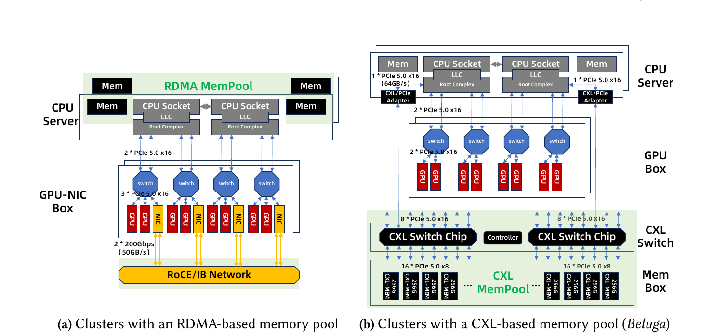

*图 1：RDMA 内存池与 Beluga CXL 内存池的服务器、GPU、适配器、交换机和内存盒连接方式。摘自原文 Fig. 2，PDF p.4。*

RDMA 方案中，每台 8-GPU 服务器使用 4 张专用 RDMA NIC，经 RoCE/IB 网络访问远端 DRAM。Beluga 用两张 PCIe 5.0 x16 CXL/PCIe 适配器接入 CXL 交换机；实验交换机由两颗 Marvell XConn XC50256 构成，连接最多 16 台服务器与 8 TB 内存池，论文给出的总带宽为 1 TB/s。[论文事实，§4.1，p.7]

这不是“把 NIC 换成 CXL 卡”这么简单。CXL 内存由 BIOS 枚举，主机以 DAX 方式映射，CPU/GPU 后续使用内存访问接口。应用不再为每次访问构造远端网络操作。

---

## 3. 核心抽象与系统设计

### 3.1 硬件数据路径

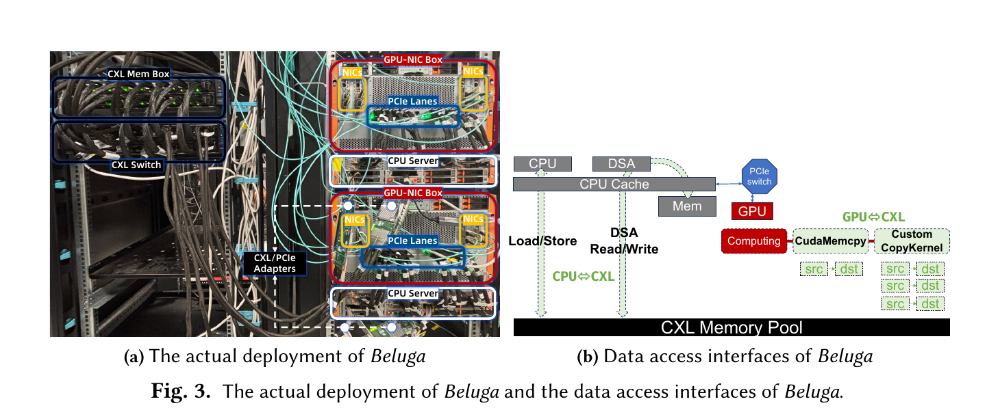

*图 2：Beluga 实际部署和数据接口。CPU 使用 load/store 或 Intel DSA，GPU 使用 cudaMemcpy 或自定义 CopyKernel。摘自原文 Fig. 3，PDF p.7。*

Beluga 暴露四类基础访问方式：

| 发起者 | 访问方式 | 适合的操作 | 主要约束 |
|---|---|---|---|
| CPU | load/store | 小 I/O、标志位、元数据 | 不可缓存 load 会阻塞流水线 |
| CPU | Intel DSA | 较大连续块搬运 | 有启动成本；依赖特定 CPU |
| GPU | `cudaMemcpy` | 较大连续 P2P 数据搬运 | 不可缓存源上的小于 24 KB H2D 有异常慢路径 |
| GPU | 自定义 CopyKernel | 细粒度、非连续 Gather/Scatter | 需要按 GPU 架构实现与调优 |

DSA（Data Streaming Accelerator，Intel CPU 上用于内存搬运的 DMA 引擎）在 4 KB 以下并不占优，论文给出的交叉区间在 4–16 KB；对于不可缓存 CXL 内存到 GPU 的小于 24 KB 传输，标准 `cudaMemcpy` 约需 1.23 ms，必须改用自定义核函数。[实测数据，§5.2，p.12–13]

这些阈值是 H20、Sapphire Rapids 和该 CXL 交换机上的实测分界，不应硬编码成跨平台规则。

### 3.2 Beluga-KVCache 的控制面与数据面

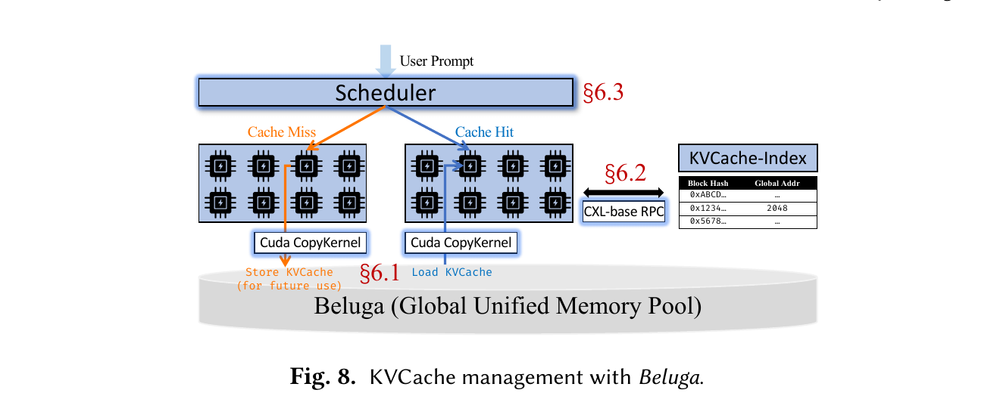

*图 3：Beluga-KVCache 的调度、全局索引、CXL-RPC 与 KVCache 读写路径。摘自原文 Fig. 8，PDF p.16。*

系统有三类状态：

1. GPU HBM 中的计算布局，按层保存模型运行所需的 KVCache；
2. CXL 内存池中的连续缓存块，由全局地址标识；
3. 全局索引中的“块哈希 → CXL 地址”映射。

缓存未命中时，vLLM 执行 Prefill，生成 KVCache 后由 GPU 拷贝核函数写入 CXL 内存，供后续请求复用；缓存命中时，调度器查全局索引，得到地址，再由拷贝核函数把数据散布到 GPU 的离散布局。索引查询使用 CXL 共享内存 RPC。[论文事实，§6，p.16–18]

论文没有完整定义“正文写完、索引发布、读者可见”之间的版本和提交协议。CXL-RPC 使用状态位保证一次请求/应答的生产者与消费者协作，但这不等于已经定义 KVCache 对象的原子发布、租约、取消、写者崩溃恢复或旧版本回收。[开放问题]

### 3.3 扁平内存层次与调度简化

作者认为 CXL 访问时延接近本地内存，因此调度器可以忽略 KVCache 位于哪台计算节点，直接按计算负载分发请求。这样，增删推理节点时不必迁移或重平衡缓存分区。[作者分析，§6.3，p.18]

这项结论更适合称为“局部性权重下降”，而不是“局部性消失”。论文自己的路径测试表明读写带宽不对称，后台同向流量会抬高 P99，单设备热点也会排队。生产调度器仍需观察链路、NUMA、适配器、内存设备和队列状态，只是可以少依赖“缓存必须在本节点”这一条硬约束。

---

## 4. 关键技术实现、收益与边界

### 4.1 CXL 内存语义直达

#### 解决的问题

CPU 驱动 RDMA 的正文数据要落入 Host DRAM 暂存区，再由 NIC 发送；读取时反向执行。GPU 驱动 RDMA 虽然能绕过 Host CPU 正文搬运，却要用专门 SM 轮询完成，并承担通信流与计算流同步。两种路径都把 KVCache 访问拆成网络操作。

#### 核心方法

把 CXL 内存池映射到进程地址空间，CPU 直接 load/store 或让 DSA 搬运；GPU 通过 P2P `cudaMemcpy` 或自定义核函数直接访问 CXL 地址。

#### 实现路径

写路径：

1. Prefill 在 GPU HBM 中生成分层 KVCache；
2. GPU 拷贝核函数读取多个离散 HBM 片段；
3. 核函数把片段聚合写入一个连续 CXL 块；
4. 后续由索引服务发布地址。

读路径：

1. 索引返回命中块的 CXL 地址；
2. GPU 拷贝核函数从连续 CXL 块读取数据；
3. 数据直接写到各层、Key/Value 对应的 HBM 位置；
4. 同一 CUDA stream 中的后续计算按顺序使用这些数据。

#### 为什么有效

资源变化是：

```text
CPU 驱动 RDMA：GPU ↔ Host DRAM 暂存 ↔ NIC ↔ 远端 DRAM
                                 ↓ 去掉 Host 正文暂存
                         GPU ↔ CXL 共享内存

GPU 驱动 GDR：GPU ↔ NIC；verbs 提交 + 完成轮询核函数 + 跨流同步
                                 ↓ 改变控制语义
                         GPU 原生流中的 CXL load/store
```

对 CPU 驱动 RDMA，收益来自正文少经过一层 Host DRAM；对 GPU 驱动 GDR，收益来自移除网络 Work Request、完成轮询核函数和跨流同步。两条路径不能共用“去掉 Host bounce”这一解释。论文分别给出了 CXL/GDR 基础时延，但没有报告把 GDR 控制步骤逐项移除的端到端消融。

#### 论文证据

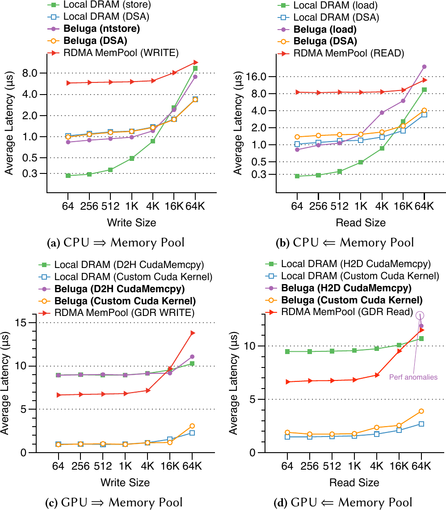

*图 4：不同访问大小下 CPU/GPU 到内存池的时延。默认 QD=1。摘自原文 Fig. 4，PDF p.12。*

- 64 KB CXL→GPU 拷贝为 11.73 μs，本地 CPU→GPU 为 10.32 μs；
- 16 KB GPU H2D 总耗时 10.55 μs，实际数据传输 2.68 μs。[实测数据，§5.2，p.12–13]

#### 代价与局限

- 当前 GPU 仍通过 CPU Root Complex 到达 CXL 交换机，不是真正的 GPU 直连 CXL fabric；
- CXL 2.0 跨主机不一致，直达并不等于无需同步；
- 标准 `cudaMemcpy` 在不可缓存小块上会进入异常慢路径；
- 只验证了机架内两服务器，不能外推到跨机架或多级 CXL 交换结构。

#### 对本项目的意义

分类：**改造采用**。本项目需要把两类路径分开：UBMEM（统一总线内存直通共享协议，即跨节点和异构设备直接共享内存地址空间的底层通信协议）可验证共享内存式地址访问与设备队列执行；URMA（通用远程直接内存访问，即用户态高性能 RDMA 驱动接口）仍是网络远端访问，需要单独测量请求提交、完成通知、轮询与同步。两类路径都要审计 Host Payload Touch Bytes，不能把 CXL 的内存语义、绝对时延和一致性策略直接移植到 URMA。

### 4.2 发起者感知的软件一致性

#### 解决的问题

CXL 2.0 只在单主机与设备范围提供协议能力，不维护多个主机 CPU 私有缓存之间的一致性。写者的数据可能停留在本地 LLC，读者也可能命中旧缓存行。KVCache 正文一旦混用新旧版本，模型输出会失真。

#### 核心方法

不追求一个统一的缓存策略，而是按 CPU load/store、DSA 和 GPU 三类发起者选择最低成本的缓存绕过或失效动作。

#### 实现路径

1. CPU 写：使用 non-temporal store，绕过 CPU cache，直接落到 CXL 内存；
2. CPU 读：读前对目标缓存行执行 `CLFLUSH`，使随后 load 从 CXL 取新数据；
3. DSA 读写：将区域配置为不可缓存；
4. GPU 写：禁用 DDIO，避免设备写流量落入 CPU LLC；
5. GPU 读：使用不可缓存内存映射，避免读取 CPU cache 中的旧副本。

#### 为什么有效

论文利用 KVCache“一次写入、多个读者复用”的访问模式，意图把一致性问题收敛为发布可见性，而不是实现通用多写缓存一致协议，因此采用 cache bypass/flush 操作。这个因果链在体系结构上成立，但论文只测了操作时延，没有通过跨主机并发、内存序 litmus 或故障注入验证发布正确性。

#### 论文证据

| 16 KB 操作 | 低成本方法 | 时延 | 对照方法 | 时延 |
|---|---|---:|---|---:|
| CPU 写 | non-temporal store | 2.41 μs | 不可缓存 store | 281.56 μs |
| CPU 读 | 读前 `CLFLUSH` | 5.98 μs | 不可缓存 load | 166.49 μs |
| DSA 写 | 不可缓存内存 | 1.69 μs | bypass 标志 | 1.76 μs |
| DSA 读 | 不可缓存内存 | 2.12 μs | 读前刷新 | 4.84 μs |
| GPU 写 | 禁用 DDIO | 9.14 μs | 写后 CPU 刷新 | 11.06 μs |
| GPU 读 | 不可缓存内存 | 10.55 μs | 读前 CPU 刷新 | 16.81 μs |

数据来自 Table 4。[实测数据，p.11]

这些数字回答的是“各一致性动作有多慢”，不是“读者一定不会读到陈旧或半写数据”。正文写入、写屏障、索引发布、读者失效和对象回收之间的顺序仍需独立正确性实验。[证据边界]

#### 代价与局限

论文假设单写者、多读者，没有覆盖并发写同一块、写者崩溃、写后索引发布乱序、ABA、版本回收或租约失效。逐缓存行刷新成本会随数据大小线性增加。DDIO、MTRR、CLFLUSH 和 DSA 也与 x86/Intel 平台深度绑定。

#### 对本项目的意义

分类：**直接采用原则，重做协议**。可以直接采用“按发起者选择一致性动作”和“正文写入与可见性发布分离”的原则；项目实现仍需由视图租约安全守卫机制管理版本、Ready 状态、租约和故障回退，并用多维度语义一致性校验验证模型、Tokenizer、Prompt 模板、LoRA 和数据就绪条件。Beluga 的 cache flush 只处理物理可见性，不处理语义有效性。

### 4.3 单核函数细粒度 Gather/Scatter

#### 解决的问题

GPU 中的 KVCache 按 Transformer 层保存。同一个 Token 块在各层的 Key、Value 地址并不连续；内存池为了索引和共享，通常又希望把一个逻辑块存成连续区域。RDMA Scatter-Gather List 有固定条目上限，离散片段多时要拆成多次请求。

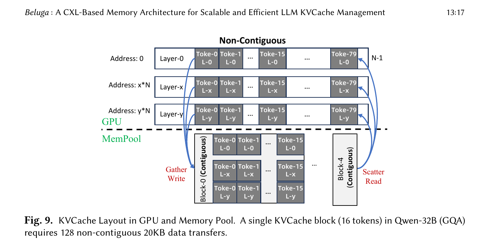

*图 5：GPU HBM 中的非连续分层布局与 CXL 内存池中的连续块，以及 Gather Write/Scatter Read。摘自原文 Fig. 9，PDF p.17。*

#### 核心方法

让一个自定义 GPU CopyKernel 接收源、目标地址列表，在一次核函数执行中完成任意数量的离散片段搬运。

#### 实现路径

密集 KVCache 写时，核函数跨层读取 128 个片段并聚合到一个 CXL 块；读取时执行逆向散布。稀疏 KVCache 读取时，核函数根据选出的 Token 地址直接读取大量 160 B 片段，无需为每个片段提交 RDMA 请求。

#### 为什么有效

```text
N 个离散片段 → 多个 RDMA Work Request + 多次完成处理
              ↓
N 个离散片段 → 一个 GPU 核函数内部的并行 load/store
```

数据量没有凭空减少；组合路径同时减少了逐片段网络请求、完成处理和 CPU 驱动基线中的 Host 暂存。片段越小、越离散，固定开销占比越高，这与稀疏场景收益远大于密集场景的结果一致，但论文没有用消融拆出各因素的独立贡献。

#### 论文证据

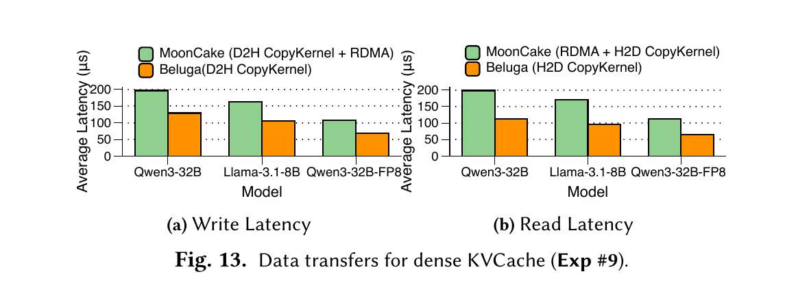

*图 6：Qwen3-32B、Llama-3.1-8B 与 Qwen3-32B-FP8 的密集 KVCache 写、读完整路径时延；Beluga 与 MoonCake 的数据路径和请求组织同时变化。摘自原文 Fig. 13，PDF p.21。*

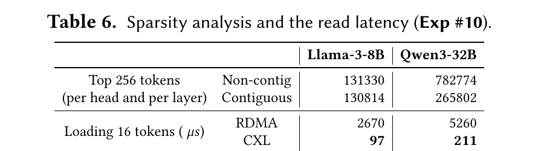

*图 7：稀疏 KVCache 的连续/非连续统计和读取 16 个 Token 的时延。摘自原文 Table 6，PDF p.22。*

- 密集 KVCache：Beluga 相对 MoonCake，写入降低 36.2%，读取降低 38.7%。Fig. 13 同时改变了 Host DRAM 暂存、RDMA 协议、请求组织和拷贝实现，属于完整路径对比，不能把这组差值单独归因于 CXL 直达或单核函数；
- Llama-3-8B 稀疏读取：2,670 μs → 97 μs；
- Qwen3-32B 稀疏读取：5,260 μs → 211 μs，降低 95.9%；
- Qwen3-32B 的 Top-256 选择中，作者统计超过 74% 的高重要度 Token 地址不连续。[实测数据，Exp #9、#10，p.21–22]

#### 代价与局限

核函数需要适配具体 GPU 指令、内存事务合并和 CXL 映射方式。论文只测了 H20 上的 CUDA 实现，没有通过消融把 CXL 内存语义、去 Host 暂存与单核函数合并请求各自的贡献拆开，也没有报告 NPU 的 DMA Scatter-Gather 能力、核函数占用对前台 TPOT 的影响。Table 6 只验证搬运时间，没有给出稀疏选择算法的端到端精度或 TPOT。

#### 对本项目的意义

分类：**改造采用**。本项目不应复制 CUDA 核函数，而应使用连续数据块区间清单描述符和描述符编译器，把跨框架的离散 Block 编译为硬件可消费的 Scatter-Gather 描述符。两者共享一个原则：把离散布局解释从每个网络请求的控制路径中移走。项目需要实测“GPU/NPU 核函数直读”和“硬件 DMA 描述符批量提交”哪条路径更适合不同片段大小。

### 4.4 多内存设备交错

#### 解决的问题

Beluga 的交换机总容量很大，但单个 CXL 内存设备约为 22.5 GB/s。若物理地址集中落到少数设备，设备控制器会先形成热点。

#### 核心方法

把地址以 2 MB 粒度交错到 32 个 CXL 内存设备，避免单设备热点。

#### 实现路径

1. 内存分配器把连续逻辑空间分片到 32 个内存设备；
2. 连续地址以固定轮询方式映射到不同设备；
3. 并发 GPU/CPU 请求由多个设备控制器并行执行；
4. 热点不再集中在第一个内存设备。

#### 为什么有效

单设备 22.5 GB/s 的上限变成多设备聚合带宽，偏斜地址造成的排队被分散。

#### 达到的效果

- 启用内存交错后：cache-hit QPS 8.49 → 11.32，提升 33.2%；
- 16 KB 偏斜访问中，不交错配置出现更低带宽和更高时延。[实测数据，Fig. 6、§7.2，p.15、21]

#### 支撑性的硬件扩展条件：多适配器与 Root Complex

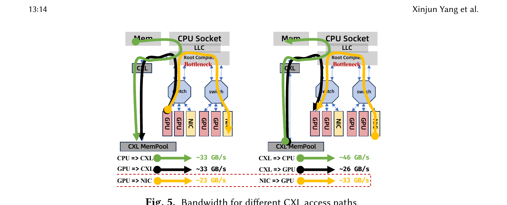

*图 8：不同 CXL 访问路径带宽。作者用跨 PCIe switch 的 GPU-NIC 测试定位 Root Complex 瓶颈。摘自原文 Fig. 5，PDF p.14。*

增加 PCIe/CXL 适配器解决的是主机侧通路容量，不是内存设备热点。Fig. 5 给出的单适配器路径约为 CPU→CXL 33 GB/s、CXL→CPU 46 GB/s、GPU→CXL 33 GB/s、CXL→GPU 26 GB/s；两组 GPU-NIC pair 的聚合带宽约 46 GB/s，接近单 pair 的两倍。作者据此把当前瓶颈定位到 Root Complex 附近。[实测数据与作者分析，§5.3，p.13–14]

Exp #3 的 33.2% QPS 增益来自软件交错开启前后，不能归因于增加适配器；多适配器是系统具备并行物理路径的前提，交错才是本节的核心软件机制。[证据边界]

#### 代价与局限

交错粒度固定为 2 MB，可能与 KVCache 块大小、NUMA 和热点分布不匹配。论文提出 GPU 未来直接连接 CXL switch 以绕过 Root Complex，但 Fig. 15 是未来架构设想，不是当前系统的实测能力。

#### 对本项目的意义

分类：**直接采用拓扑感知原则**。硬件能力矩阵（CapabilityMatrix，即运行时探测各通信链路带宽、时延和队列状态并供调度使用的参数表）应记录每个适配器、交换路径和介质的实测能力。数据条带化必须受拓扑和热点反馈驱动，不能只按固定轮询分布。

### 4.5 CXL 共享内存 RPC

#### 解决的问题

KVCache 命中查询需要访问集中式索引。若每次查询都走 TCP/IP 或 RDMA，64 B 级元数据会承担比正文大得多的协议固定成本。

#### 核心方法

客户端和索引服务在 CXL 内存中预分配定长请求/应答槽，使用状态位和自旋轮询组成用户态生产者与消费者队列。

#### 实现路径

1. 客户端用 non-temporal store 写空闲请求槽；
2. 客户端将状态置为 `REQ_READY`；
3. 服务端读前执行 `CLFLUSH`，轮询并消费请求；
4. 服务端写应答槽并置为 `RESP_READY`；
5. 客户端轮询状态后读取应答；
6. 并发请求批量执行 `mfence`，所有槽按缓存行对齐。

#### 为什么有效

在这个 64 B ping-pong 传输微基准中，请求不再进入内核或 NIC 协议栈，而是被简化为共享内存读写与状态轮询。完整索引查询还会包含哈希查找、并发控制、槽分配和队列等待，Fig. 14 没有测量这些部分。

#### 论文证据

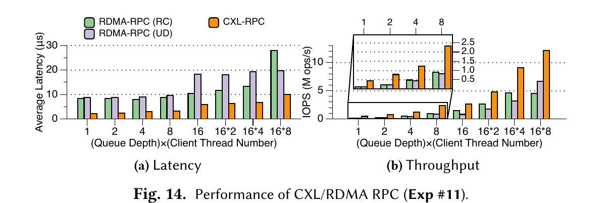

*图 9：CXL-RPC 与 RDMA-RC/UD 的延迟和吞吐。请求、应答均为 64 B。摘自原文 Fig. 14，PDF p.22。*

- QD=1：CXL-RPC 2.11 μs，RDMA-RC 8.39 μs，RDMA-UD 8.83 μs；
- QD=128、单服务线程：CXL-RPC 12.13 Mops，RDMA-RC 4.5 Mops，RDMA-UD 6.65 Mops。[实测数据，Exp #11，p.22–23]

这组数字只证明固定 64 B 请求/应答的共享内存往返传输较快，不能直接写成“KVCache 索引查询为 2.11 μs 或 12.13 Mops”。[证据边界]

#### 代价与局限

论文明确承认 CXL-RPC 的可靠性低于 RDMA transport，依赖上层补足保障。微基准使用两个服务器、单线程服务和 busy polling，没有覆盖服务进程崩溃、请求超时、重复消费、槽泄漏、背压、跨 NUMA 公平性或多租户隔离。忙轮询仍会占用 CPU 核。

#### 对本项目的意义

分类：**只采用轻量共享内存信箱的思路**。项目可在本机或同一共享总线域内使用固定槽与状态位降低目录查询开销，但必须增加请求代次、超时、幂等、取消、租约和故障恢复。跨节点范围仍应保留可靠控制通道，不能用单一共享内存队列替代所有 RPC。

---

## 5. 实验到底证明了什么

### 5.1 实验平台与比较基线

| 项目 | 配置 |
|---|---|
| OS | Ubuntu 22.04，Linux 6.2.0-1015 |
| CPU | 2 × Intel Xeon Platinum 8575C |
| DRAM | 2 TB，32 × DDR5-4800 64 GB |
| GPU | 8 × NVIDIA H20 96 GB / 服务器 |
| NIC | 4 × ConnectX-7 双口 200 Gbps / 服务器 |
| CXL 接口 | 2 × PCIe 5.0 x16 适配器 / 服务器 |
| CXL 内存池 | 8 TB，32 × 256 GB DDR5-4800 |
| 端到端规模 | 2 台服务器，16 个 H20，16 个并发 vLLM 实例 |
| 推理框架 | vLLM V1 v0.8.5，启用 prefix caching |
| 模型 | 默认未量化 Qwen-32B |
| 负载 | LV-Eval，输入均超过 15K Token；另有 2K/4K/8K 变体 |
| 基线 | vLLM、Dynamo v0.4.1、MoonCake v3.2 + LMCache v0.3.1 |
| 公平性控制 | RDMA 与 Beluga 内存池容量都限制为 2 TB |

配置来自 Table 2 和 §7。[论文事实，p.9、18]

### 5.2 逐项主张与证据边界

| 主张 | 实验 | 结果 | 可以支持什么 | 不能支持什么 |
|---|---|---|---|---|
| CXL 单请求时延接近本地内存 | Exp #2 / Fig. 4 | 64 KB CXL→GPU 11.73 μs，本地 CPU→GPU 10.32 μs | 当前平台的 CXL 内存可作为 GPU 数据源 | 所有大小、方向、拥塞和拓扑都等同本地内存 |
| 软件一致性需要按发起者选择方法 | Exp #1 / Table 4 | CPU 不可缓存 load/store 极慢；DSA 与 GPU 更适合不可缓存映射 | 一致性动作的时延差异大，统一使用 UC memory 不是最优策略 | 跨主机发布可见性或通用多写一致协议已经验证正确 |
| Root Complex 与单设备会限制带宽 | Fig. 5、Exp #3 | GPU/CXL 路径 26–33 GB/s；单设备 22.5 GB/s | 端到端瓶颈不在 CXL 交换机标称容量 | Root Complex 是所有平台唯一瓶颈 |
| 交错能降低热点 | Exp #3、§7.2 | cache-hit QPS 提升 33.2% | 当前分配与设备组合受益于条带化 | 固定 2 MB 粒度对所有 KVCache 都最优 |
| CXL 适合细粒度 KVCache 搬运 | Exp #9、#10 | 完整密集路径降低 36.2%/38.7%；稀疏 Qwen 读取降低 95.9% | CXL CopyKernel 组合路径适合离散片段，且离散度越高收益越明显 | CXL 直达、去 Host 暂存和单核函数各自贡献多少；稀疏注意力端到端精度或 TPOT 已验证 |
| 64 B 共享内存往返传输开销低 | Exp #11 | 2.11 μs；QD=128 时 12.13 Mops | 当前机架、单服务线程下的固定槽 ping-pong transport 较快 | 完整 KVCache 索引查询达到该时延或吞吐；它具有 RDMA 等价的可靠性和容错 |
| cache-hit 端到端收益很大 | Exp #5 / Table 5 | 平均 TTFT -89.6%，QPS 7.35× | 全缓存命中、长上下文、closed-loop 下 Beluga 显著优于 MoonCake v3.2 | 初次写入、低命中或所有到达率同样提升 7.35× |

### 5.3 请求率、上下文和软件配置敏感性

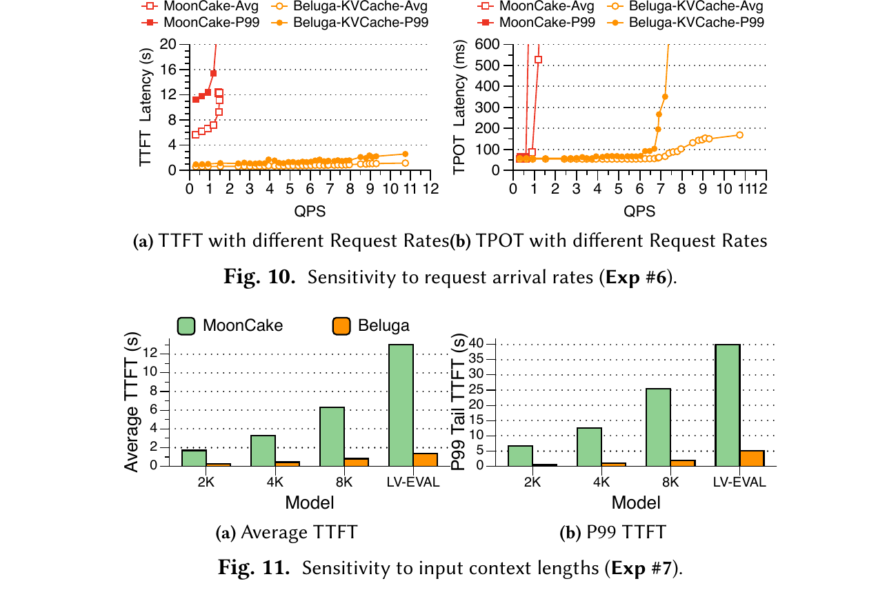

*图 10：请求率对 TTFT/TPOT 的影响，以及输入长度对平均/P99 TTFT 的影响。摘自原文 Fig. 10、11，PDF p.20。*

在第二次运行、全部请求命中缓存时，Beluga 在 0.3–9.0 QPS 区间的 TTFT 和 TPOT 均低于 MoonCake。输入由 2K 增长到原始 LV-Eval 长度时，Beluga 的相对优势扩大，因为 KVCache 读写占端到端时间的比例增加。[实测数据与作者解释，Exp #6、#7，p.20]

这组曲线说明 Beluga 是“缓存与数据搬运占主导时更有效”的架构。它并不自动加速 Decode 算力，也不能改善没有复用的短 Prompt。

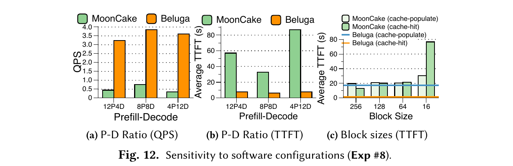

*图 11：不同 Prefill/Decode 配比和 KVCache Block 大小下的 QPS/TTFT。摘自原文 Fig. 12，PDF p.21。*

在 PD 分离（Prefill 与 Decode 计算生成解耦架构，即把输入理解与逐字生成部署在不同计算节点）配置中，Beluga 的 QPS 相对 MoonCake 提升 3.41×–9.47×。MoonCake 采用 256-token 大块时 cache-hit 平均 TTFT 为 13.0 s，改为 vLLM 原生 16-token 块后升到 76.8 s；Beluga 可直接使用 16-token 粒度。[实测数据，Exp #8，p.20–21]

这项结果主要证明 RDMA 的控制开销迫使实现批量化，并没有证明“大块永远不好”。大块是否损害命中率还取决于前缀分布和索引策略。

### 5.4 对端到端结果的再核对

Table 5 中，Beluga 并非在所有首次运行指标上都最好：

- 首次运行 P99 TTFT 为 44.60 s，高于 MoonCake 的 41.65 s 和原始 vLLM 的 40.47 s；
- 首次运行 P99 TPOT 为 16.14 s，优于 MoonCake 的 20.84 s，但高于 Dynamo 的 10.99 s；
- 全缓存命中时，Beluga 在平均和 P99 TTFT、TPOT、QPS 上都明显领先。

因此，论文正文“across all metrics”的概括过强。更准确的说法是：Beluga 在缓存命中主导的读路径上优势很大，在包含缓存创建、30% 命中的首次运行中，平均 TTFT 和 QPS 改善有限，P99 TTFT 还有回退。[分析判断，Table 5，p.19]

基线版本也影响倍数。论文投稿时使用 MoonCake v3.2；脚注补充的 v3.6 达到 4.10 QPS，是 v3.2 的 2.66×，但仍只有 Beluga 11.32 QPS 的约 36%。若按 v3.6 计算，Beluga 的 cache-hit QPS 优势约为 2.76×，不再是 7.35×。[实测数据与派生数据，p.19 脚注]

此外，论文没有给出 Table 5 的请求样本量、独立重复次数、置信区间或误差条。P99 数值可用于指出该次运行中存在回退，不能据此推断长期尾延迟分布已经稳定，也不能比较很小的 P99 差异是否具有统计意义。[证据边界]

---

## 6. 技术亮点与适用边界

### 6.1 用商用 CXL 2.0 硬件测出了真实路径瓶颈

亮点在于论文没有只报告 CXL switch 的标称 2 TB/s 转发能力，而是逐段测 CPU、GPU、Root Complex、适配器和内存设备。结果显示当前 GPU→CXL 路径只有约 33 GB/s，CXL→GPU 约 26 GB/s。硬件数据手册不能替代端到端路径测量。

边界也很清楚：平台只有一种 CXL switch、一代 Intel CPU 和 H20。Root Complex 是该平台的主要瓶颈，未必是未来 GPU 直连 CXL 或其他 CPU 架构的瓶颈。

### 6.2 把一致性成本拆到具体发起者

论文没有用“CXL 有一致性”这句笼统描述掩盖 CXL 2.0 的跨主机缺口，而是把 CPU、DSA、GPU 的读写分别测量。这个拆法比统一关闭缓存实用得多。

限制是论文只测了物理可见性动作的成本，没有验证物理可见性本身在跨主机并发下的正确性。一写多读、静态内存映射和正常完成路径是作者的设计前提；遇到乱序发布、并发写、故障和版本回收，仍缺少正确性测试与对象级状态机。

### 6.3 细粒度随机访问比峰值带宽更能说明 CXL 的价值

密集传输只降低约三成时延，稀疏 Qwen 读取却降低 95.9%。差距来自请求形态：CXL 让一次 GPU 核函数直接完成大量小地址访问，避开了每片段 RDMA 操作。这是论文最有辨识度的系统结果。

它仍是传输微基准。论文没有报告稀疏选择质量、GPU 核函数占用、与前台 Attention 并发时的 TPOT 干扰。

### 6.4 调度简化有价值，但“完全忽略局部性”证据不足

CXL 使远端访问更接近本地，确实可以减轻缓存亲和调度造成的负载倾斜。可论文没有对“局部性感知调度 vs 不感知调度”做独立消融，也没有在多租户和后台拥塞下验证该结论。

Beluga 自己观测到同向后台带宽会推高 P99。生产系统仍需要硬件 QoS 优先级队列与动态拥塞控制，调度器也应读取实时路径成本。

### 6.5 成本数据只能作为样品级参考

Table 1 给出 CX-7 接口卡 1,745 美元、CXL 适配器 210 美元，RoCE switch 16,000 美元、XConn CXL switch 5,800 美元；按 64 GB/s 折算分别为 800 美元和 218.75 美元。[论文事实，p.9]

论文脚注明确说明 XConn switch 使用 B1 样品价，最终价格可能变化。该表没有纳入软件研发、故障域、备件、兼容性和运维成本，不能直接变成本项目 TCO（总体拥有成本，综合硬件采购、算力利用、网络、能耗与有效业务产出的全生命周期成本）结论。

---

## 7. 论文没有解决什么

1. **对象级发布与故障语义**：没有给出 KVCache 正文、索引和 Ready 状态的原子提交顺序，也没有写者崩溃、半写块、读者超时和回收协议。
2. **语义一致性**：只讨论缓存行可见性，没有验证模型架构、Tokenizer、Prompt 模板、LoRA 适配器或 KV 编码版本是否匹配。
3. **多写与多卡协同**：目标模式是一写多读，没有覆盖同一前缀并发生产，也没有讨论张量并行多卡状态同步。
4. **跨机架扩展**：实验是两服务器、单 CXL 内存池。CXL 3.1 多级 fabric 只出现在未来工作中。
5. **多介质分层**：没有 NVMe SSD、持久化、冷数据迁移或容量淘汰策略。
6. **实时路径决策**：论文按静态阈值选 load/store、DSA、cudaMemcpy 和 custom kernel，没有把实时带宽、队列、重算成本与租约风险纳入统一决策。
7. **多租户 QoS**：Exp #4 证明后台同向流量会抬高 P99，却没有给出带宽保留、优先级或自适应退避机制。
8. **CXL-RPC 可靠性**：作者明确承认其保障低于 RDMA，且依赖上层机制；系统没有给出完整补偿协议。
9. **异构加速器可移植性**：CUDA、DDIO、MTRR、CLFLUSH 和 Intel DSA 都是平台相关实现，国产 NPU 不能按接口名平移。
10. **开放环 SLO 与业务达标率**：主结果使用 closed-loop client 测峰值吞吐，没有给出固定到达率下的 SLO 达标请求比例和完整混压尾延迟。
11. **P99 的统计置信度**：Table 5 未交代样本量、重复次数、置信区间或误差条，P99 只能作为单次运行的描述性结果。

---

## 8. 对本项目的启发

### 8.1 可直接采用的原则

| 原则 | 论文依据 | 项目落点 |
|---|---|---|
| 共享地址与数据对象地址解耦 | DAX + `mmap()` + 全局索引 | 目录只返回可验证的全局对象句柄，数据面自行选择路径 |
| 正文传输与元数据控制分离 | CopyKernel 与 CXL-RPC 分开 | CPU 负责下发控制，正文由设备 DMA/总线直达 |
| 按发起者选择一致性动作 | CPU、DSA、GPU 分别调优 | 为 NPU、NIC、SSD 和 CPU 定义各自发布/失效动作 |
| 逻辑小块与物理连续传输解耦 | GPU 离散布局 ↔ CXL 连续块 | 使用连续块描述符编译，保留细粒度索引 |
| 带宽按物理路径测量 | Root Complex 和单设备瓶颈分析 | 运行时硬件能力矩阵必须来自实测，不采用标称带宽 |

### 8.2 需要改造后采用

#### CXL 统一地址空间 → 异构全局对象与多路径访问

Beluga 在单一 CXL 域内可使用裸地址。项目横跨 UBMEM、URMA、NPU HBM、Host DRAM 与 NVMe SSD，不能假设所有介质都共享同一物理地址空间。应把“地址”提升为带设备、介质、版本、租约和权限的对象句柄，再由查询与放置计划决策引擎（QueryPlan，即根据链路状态、算力和上下文长度选择加载或重算路径的决策模块）解析成具体数据路径。

#### 自定义 CUDA 核函数 → 描述符编译与设备原生批量搬运

Beluga 证明细粒度请求控制成本很高，但国产 NPU 未必适合由计算核函数承担全部搬运。项目应比较三条路径：设备核函数直读、硬件 DMA Scatter-Gather、连续块合并后批量 DMA。描述符编译器负责把上层离散 Block 压缩为硬件可消费的连续区间清单。

#### 软件内存交错 → 拓扑感知条带化

2 MB 固定交错能分散 Beluga 的 32 个内存设备，但项目还要考虑多网卡、多 NUMA、多介质和前后台优先级。条带化粒度与并发度应由硬件能力矩阵和队列反馈决定。

#### CXL-RPC → 有代次与租约的快速控制通道

共享槽已证明适合微秒级固定长度往返传输，但完整目录查询是否仍是微秒级尚未验证。项目需要增加 epoch、幂等键、租约、超时、取消和恢复；跨节点控制仍需可靠协议。快路径失败时应安全回退，而不是让读者无限自旋。

### 8.3 不应照搬

- 不应把“cache-oblivious scheduling”理解为永久忽略拓扑和队列。调度应比较拉取与加载总开销和本地重算耗时，只在净收益为正时复用缓存。
- 不应把所有内存统一设为不可缓存。Table 4 已经说明 CPU load/store 会出现两个数量级的回退。
- 不应硬编码 4 KB、16 KB、24 KB、2 MB 等阈值。这些数值只属于论文平台。
- 不应把 busy-poll CXL-RPC 当成可靠控制面。它缺少故障语义，也会占用 CPU 核。
- 不应以 CXL 为唯一主路径。项目面向国产异构硬件，应保留原始直达路径、网络远端直读、拷贝到本地显存和本地重算等多条可降级路径。

---

## 9. 对本项目立项的支持程度

### 9.1 必要性证据

Beluga 独立确认了以下问题真实存在：

- Host 暂存、完成轮询和跨组件同步会显著侵蚀远端 KVCache 复用收益；
- KVCache 的离散布局会把网络请求固定成本放大到不可忽略；
- 单纯看交换机、网卡或总线标称带宽会误判端到端瓶颈；
- 远端内存池若访问代价过高，会迫使调度器牺牲计算负载均衡来维护缓存局部性。

这些证据支持本项目继续做统一数据路径、描述符编译、运行时路径测量和动态调度，而不是只在上层框架增加一个缓存目录。

### 9.2 可行性证据

论文验证了几项底层原则：

- 设备可以直接访问共享扩展内存，且 64 KB CXL→GPU 时延接近本地 CPU→GPU 路径；
- 细粒度 GPU 核函数可以替代大量离散网络请求；
- 作者选用的一写多读缓存绕过与失效动作在 16 KB 操作上处于微秒级，但跨主机发布正确性仍未验证；
- 多设备交错能降低热点；多适配器可增加独立物理通路，两者解决不同瓶颈；
- 共享内存状态槽的 64 B 往返传输可以做到几微秒，完整元数据查询未单独测量。

这些是方向可行性证据，不是本项目国产 NPU/UBMEM/URMA 实现已经可行的证明。

### 9.3 差异化证据

Beluga 留出的空白恰好落在本项目的主范围：

- 跨 CXL、UBMEM、URMA、Host DRAM、NVMe SSD 的统一异构访问；
- Direct-View（远端直读，即跨节点直接读取远端显存 KV 数据而不做本地完整拷贝）、Copy-to-HBM（通过 DMA 将远端 KV 完整搬到本地高带宽显存）与重算之间的动态选路；
- 视图租约、故障回退和多维度语义一致性；
- 张量并行多卡状态同步；
- 前台 TPOT 与后台搬运并发时的 QoS；
- Host CPU 零数据拷贝的可审计测量。

Beluga 的实验支持“共享内存语义能显著改善 KVCache 管理”这一方向，同时也暴露了单一 CXL 域无法覆盖的系统问题。这为项目差异化提供了合理空间。

### 9.4 仍需项目独立证明的主张

| 项目主张 | Beluga 是否支持 | 仍需的证据 |
|---|---|---|
| Host CPU 零数据拷贝 | 只支持方向，不构成证明 | Host Payload Touch Bytes、总线计数器、CPU 带宽与正文指针审计 |
| UBMEM/URMA 跨节点直达 | 不支持 | 分别验证 UBMEM 共享内存语义与 URMA 网络语义；读写带宽、P50/P99、提交/完成/轮询、失败行为和 Host Payload Touch Bytes |
| Direct-View 优于 Copy-to-HBM | 不支持 | 复用次数、片段大小、链路拥塞和 Attention 访存下的边界曲线 |
| 六维语义一致性 | 不支持 | 故意注入模型/词表/模板/LoRA/Ready/租约不匹配 |
| TP=8 多卡状态同步 <100 μs | 不支持 | 多卡命中分歧、故障和集合通信压力下的 P99 |
| NVMe SSD 绕过 Host DDR | 不支持 | SSD↔NPU HBM DMA 路径与 CPU/DDR 计数器 |
| E3 的 TTFT/QPS/TPOT 目标 | 不支持 | 真实双节点前后台混压端到端结果 |

### 9.5 立项判断

从当前证据看，Beluga 对项目的支持是“必要性强、底层可行性中等、目标指标不构成证明”。它清楚说明为什么 KVCache 存储池需要进入软硬件协同层，并实测验证了共享内存语义、细粒度设备访问和拓扑交错在当前平台上的收益。它没有替项目解决异构协议、故障一致性、动态选路和混压 QoS。立项价值正落在这些未闭环问题上。

---

## 10. 建议优先验证

以下实验的结果会直接影响架构选择，不是一般性测试清单。

| 验证项 | 假设 | 变量与基线 | 指标 | 判定含义 |
|---|---|---|---|---|
| 多路径小块/大块传输分界 | 不同发起者和传输引擎存在稳定交叉点 | 64 B–64 MB；CPU copy、设备核函数、DMA、URMA、UBMEM | P50/P99、有效带宽、CPU/SM 占用 | 决定 QueryPlan 的路径候选与阈值模型 |
| 离散块搬运方式 | 描述符批量 DMA 在中等离散度下优于计算核函数直读 | 连续度、片段数、片段大小；逐块 RPC 为基线 | 提交数、传输时延、TPOT 干扰 | 决定描述符编译器是否进入主路径 |
| 正文发布原子性 | 写正文、写屏障、发布索引、读者失效和租约激活可形成无半写读取的状态机 | 跨主机并发 litmus、写者崩溃点、乱序、超时、重复请求、旧版本回收 | 陈旧/半写消费数、可见性时延、恢复时间、泄漏块数 | 决定一致性协议与回退机制 |
| Direct-View/Copy-to-HBM/重算边界 | 路径收益由复用次数、链路与上下文长度共同决定 | 复用 1–N 次、拥塞 0–100%、不同上下文 | TTFT、TPOT、字节数、算力时间 | 决定动态选路成本模型 |
| 拓扑交错与热点 | 固定轮询不如能力矩阵驱动条带化 | 适配器数、NUMA、设备数、Zipf 参数 | 聚合带宽、P99、负载偏差 | 决定分配器条带化策略 |
| KVCache 索引端到端性能与可靠性 | 加入哈希查找、并发控制、epoch、幂等和超时后仍有可接受的微秒级尾延迟 | 变化客户端数、索引规模、热点分布；CXL/共享内存信箱、URMA RPC、TCP 基线 | 查询 P50/P99、Mops、CPU 核占用、丢失/重复、恢复时间 | 决定控制面快慢路径分工，补足 Fig. 14 只测 transport 的缺口 |
| 前后台混压 QoS | 后台搬运可通过优先级与退避把前台 TPOT 干扰压到目标内 | 前台在线推理 + 后台满载读写 | TTFT、QPS、TPOT P99、干扰率 | 决定 E3 是否通过 |
| 调度器局部性权重 | 完全忽略局部性在拥塞和非对称拓扑下会回退 | cache-oblivious、cache-aware、cost-aware 三组 | 达标率、P99、负载偏差 | 决定是否采用动态成本调度而非扁平轮询 |

---

## 附录 A：论文九项硬件优化的作用范围

| 编号 | 论文建议 | 适用对象 | 本项目处理 |
|---|---|---|---|
| O1 | CPU 写用 non-temporal store，读前失效缓存 | CPU load/store | 转化为按发起者发布/失效契约 |
| O2 | DSA 操作不可缓存内存 | Intel DSA | 在国产 DMA 上重测 |
| O3 | GPU 访问不可缓存内存并禁用 DDIO | GPU | 结合 NPU/CPU cache 路径重测 |
| O4 | 小于 4 KB 用 CPU，较大传输用 DSA | CPU | 只保留“运行时分界”原则 |
| O5 | CUDA stream 异步启动并合并任务 | GPU | 映射到计算流与 DMA 流重叠 |
| O6 | 不可缓存源的小于 24 KB 传输用自定义核函数 | GPU | 与设备核函数、DMA 描述符对比 |
| O7 | 未来 GPU 直连 CXL switch | 未来硬件 | 作为方向，不当成当前能力 |
| O8 | 增加 PCIe/CXL 适配器 | 主机链路 | 纳入拓扑与成本约束 |
| O9 | 数据跨多个 CXL 内存设备交错 | 内存池 | 改为能力矩阵驱动的条带化 |

## 附录 B：关键数字核验表

| 数字 | 来源 | 口径 |
|---:|---|---|
| 89.6% | 摘要、Table 5 | cache-hit 第二次运行，平均 TTFT 相对 MoonCake v3.2 |
| 7.35× | 摘要、Table 5 | cache-hit 第二次运行，QPS 11.32 / 1.54 |
| 4.79× | 贡献列表 | 与摘要/Table 5 不一致，原文未解释 |
| 2.76× | 本文派生 | Beluga 11.32 / MoonCake v3.6 4.10，后者来自 p.19 脚注 |
| 12.4% | §7.1 | 首次运行平均 TTFT 相对 MoonCake v3.2 |
| 21.5% | §7.1 | 首次运行 QPS 相对 MoonCake v3.2 |
| 95.9% | Table 6 | Qwen3-32B 稀疏读取 16 Token，5,260 μs → 211 μs |
| 36.2% / 38.7% | Fig. 13 | Beluga CopyKernel+CXL 相对 MoonCake v3.2 CPU 驱动 CopyKernel+RDMA 的密集 KVCache 写/读完整路径差值；不能拆成单机制贡献 |
| 2.11 μs | Fig. 14 | 64 B 请求/应答固定槽 ping-pong transport，QD=1；不是完整索引查询 |
| 33.2% | §7.2 | 32 设备软件交错开启后，QPS 8.49 → 11.32；不能归因于适配器数量变化 |

## 附录 C：全文结论压缩

Beluga 的真正贡献不是一句“CXL 比 RDMA 快”，而是把商用 CXL 2.0 交换内存池放进完整 KVCache 系统，测清了直达路径、一致性、细粒度数据布局、Root Complex、内存设备热点、元数据 RPC 和调度之间的关系。论文最有力的结果出现在全缓存命中和高度离散的数据访问中；首次运行的 P99 并不占优，调度扁平化也缺少独立消融。

对本项目而言，应采用它的三条底层原则：正文数据尽量进入设备直达路径，访问方法必须按发起者和粒度选择，标称带宽必须经过真实拓扑测量。需要继续完成的是 Beluga 没有覆盖的部分：异构多路径、语义一致性、租约故障、动态选路、多卡同步、多介质分层和混压 QoS。
