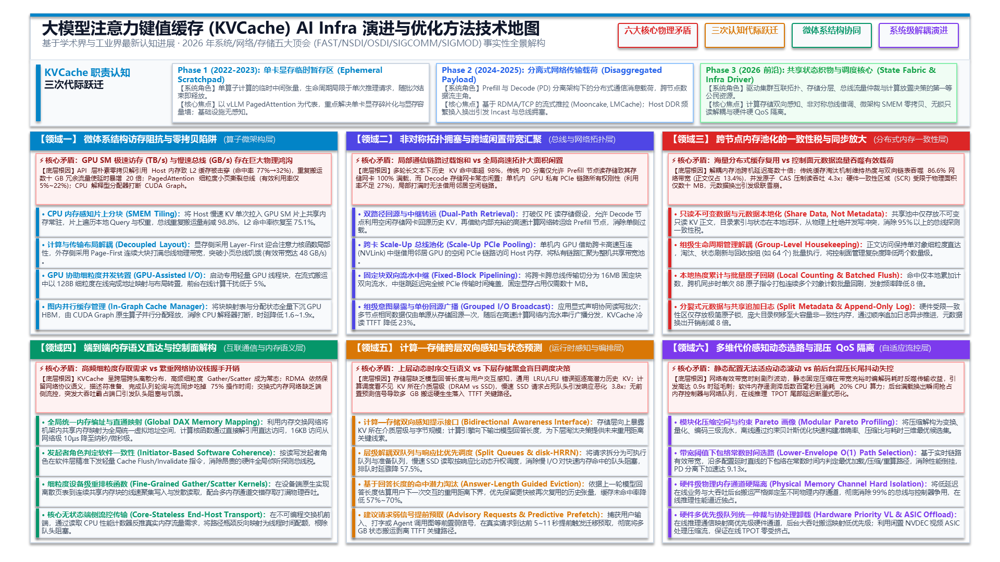

# 大模型注意力键值缓存 (KVCache) AI Infra 演进与优化方法技术地图

> **版本**：V1.0  
> **面向对象**：一线系统研发团队、AI 基础设施架构师、技术评审专家与系统研究人员  
> **基线对齐**：全面吸收 2026 年系统/网络/存储/数据库五大顶会（FAST '26、NSDI '26、OSDI '26、SIGCOMM '26、SIGMOD '26 共 17 篇论文）前沿成果，客观解构 KVCache 职责认知的代际跃迁、底层微架构与网络物理矛盾，以及工业级 AI 基础设施的演进解决手段。



---

## 零、 专有名词与功能释义总览

为了便于跨专业团队统一语境，本项目涉及的关键技术概念与专有名词首次定义如下：

1. **KVCache**（大模型注意力键值缓存）：大模型自回归生成过程中缓存的历史 Key 与 Value 激活状态张量，用于避免后续 Token 生成时重复计算注意力；
2. **Saved-Prefill**（首字生成预计算节省）：利用已缓存的 KV Cache 避免重复计算输入 Prompt，从而显著降低首 Token 延迟（TTFT）；
3. **TTFT**（Time To First Token，首字生成延迟 / 首 Token 响应时间）：从用户发起请求到生成第一个 Token 的端到端耗时；
4. **TPOT**（Time Per Output Token，每个输出 Token 的生成耗时 / 单字生成延迟）：自回归解码阶段逐字生成的平均耗时；
5. **PD 分离**（Prefill 与 Decode 计算生成解耦架构）：将大模型的输入理解 Prefill 阶段与逐字生成 Decode 阶段分别部署在不同的物理硬件节点上，通过高速互联网络流式传输 KVCache；
6. **Host CPU 零数据拷贝**（CPU 仅负责下发控制指令，不参与正文数据搬运，Host Payload Touch Bytes 严格为 0）：数据直接在 NPU HBM、远端显存、共享总线或 NVMe SSD 之间流转，绕过主机内存；
7. **Direct-View**（远端直读）：直接通过高速互联总线跨节点读取远端显存或共享内存中的 KV 数据，不产生本地显存拷贝；
8. **Copy-to-HBM**（拷贝到本地显存）：通过 DMA 通道将远端 KV 数据完整搬运至本地高带宽显存（HBM）中供计算；
9. **ViewGuard**（视图租约安全守卫机制）：负责管理远端直读的生命周期与租约有效性，并在远端崩溃或超时时安全捕获异常并平滑回滚至本地重算；
10. **QueryPlan**（动态选路决策引擎）：在微秒级时间内根据链路状态、算力与上下文长度选择最优数据加载路径或重算路径；
11. **CostEvaluator**（成本预估模型）：在决策前量化预估各加载路径与重算开销的数学模型，确保净收益为正；
12. **ConsumeEligibility**（多维度语义一致性校验）：对命中 KV 的模型架构、Tokenizer 词表哈希、Prompt 模板哈希、LoRA 适配器、就绪位与租约有效性等 6 维语义进行微秒级合法性检查，杜绝错误消费；
13. **RankConsensus**（张量并行多卡状态同步机制）：在 TP=8 多卡并行时，通过共享内存同步各卡命中状态与一致性动作，确保多卡协同，杜绝集合通信死锁；
14. **SemanticQoS**（前后台服务质量保障策略）：通过网络优先级队列映射与应用层微秒级自适应退避，确保后台数据换出与拉取不干扰前台在线推理的 TPOT 尾部延迟；
15. **RCU**（Read-Copy-Update，读-拷贝-更新）：一种无锁读与宽限期延迟释放机制，在后台显存碎片整理与页迁移时保证前台读请求零停顿；
16. **UBMEM**（统一总线内存直通共享协议）：支持跨节点与异构设备间直接共享物理内存地址空间的底层通信协议；
17. **URMA**（通用远程直接内存访问）：用户态的高性能 RDMA 驱动接口与通信协议；
18. **Incast**（多对一突发网络拥塞）：多个发送节点在极短时间内同时向单一接收节点回传数据包，导致交换机出端口缓冲区瞬间耗尽而引发的排队丢包风暴。

---

## 第一部分 职责认知代际跃迁：KVCache 在 AI Infra 中的定位重构

大模型基础设施（AI Infra）的发展史，本质上是一部**计算与存储解耦、互联与拓扑演进的重构史**。在这一演进过程中，KVCache 的系统定位经历了三次深刻的代际跃迁：

```
┌──────────────────────────────────────────────────────────────────────────────────────────────────┐
│                                  KVCache 职责认知的三次代际跃迁                                    │
├──────────────────────────────────────────────────────────────────────────────────────────────────┤
│                                                                                                  │
│  Phase 1 (2022-2023): 单卡显存临时暂存区 (Ephemeral Scratchpad)                                    │
│  ├─ 系统角色：单算子计算过程中的临时张量，生命周期与单次推理请求强绑定，随批次结束即释放。         │
│  ├─ 核心瓶颈：显存容量墙（HBM Wall）引发 OOM，KV 占用膨胀限制并发批大小 (Batch Size)。            │
│  ├─ 治理手段：以 vLLM PagedAttention、RadixAttention 为代表，重点解决单卡显存碎片化与简单前缀复用。  │
│  └─ Infra 认知：KVCache 是计算引擎的私有内部数据结构，基础设施网络与存储无感知。                 │
│                                                                                                  │
│                                              ▼                                                   │
│                                                                                                  │
│  Phase 2 (2024-2025): 解耦式网络传输载荷 (Disaggregated Streaming Payload)                       │
│  ├─ 系统角色：PD 分离（Prefill 与 Decode 解耦）架构下的分布式通信消息载荷，跨节点数据流主角。     │
│  ├─ 核心瓶颈：跨节点通信带宽成为 TTFT 新瓶颈；Host DDR 换入换出引发 CPU 算力与总线争用。          │
│  ├─ 治理手段：Mooncake、LMCache、Splitwise，基于 RDMA/TCP 将 KV 跨节点流式传输或卸载至 Host 内存。│
│  └─ Infra 认知：KVCache 是需要被尽快传输的网络载荷，但仍沿用传统网络 I/O 语义（消息式传输）。     │
│                                                                                                  │
│                                              ▼                                                   │
│                                                                                                  │
│  Phase 3 (2026 最新前沿): 基础设施共享状态织物与调度核心 (Shared State Fabric & Infra Driver)     │
│  ├─ 系统角色：驱动集群拓扑设计、机架级互联、存储分层、流量仲裁与计算放置决策的第一等公民资源。     │
│  ├─ 核心瓶颈：微体系结构访存阻抗、跨域带宽割裂、跨节点同步放大、一致性税与前后台混压尾部抖动。    │
│  ├─ 治理手段：计算-存储双向感知、非对称网络复用、微架构融合核函数、无锁只读分离、流式硬件遥测。    │
│  └─ Infra 认知：KVCache 成为重塑整个 AI 算力与网络拓扑的核心枢纽，推动系统级软硬件深度协同。     │
│                                                                                                  │
└──────────────────────────────────────────────────────────────────────────────────────────────────┘
```

### 1.1 Phase 1：单卡算子临时暂存区（2022 ~ 2023）
在以原始 Transformers 库和早版 TensorRT-LLM 为代表的时代，KVCache 仅仅被视为注意力前向计算的临时中间张量。随着自回归逐字生成推进，显存开销随 Sequence 长度线性暴增。此时基础设施的核心矛盾在于**单卡高带宽显存（HBM）容量极其有限**。这一时期的技术焦点是**算法与单机显存碎片整理**，以 vLLM 提出的 PagedAttention 为代表，通过借鉴操作系统虚拟内存分页机制，消除了显存内部碎片，大幅提升了单卡吞吐。但此时 KVCache 仍是“瞬态的、单进程私有的”。

### 1.2 Phase 2：解耦式网络传输载荷（2024 ~ 2025）
随着大模型参数量扩展至数百上千亿，Prefill（计算密集型，时延受限）与 Decode（内存带宽密集型，吞吐受限）的计算特征严重冲突，业界全面转向 **PD 分离架构**。KVCache 突破了单机边界，成为跨节点流式传输的“网络载荷”。以 Mooncake、LMCache 为代表的系统，利用 RDMA 试图建立两级缓存池。然而，此时的系统设计依然将 KVCache 视为普通的“网络数据包”或“文件对象”，数据流转频繁穿透 Host CPU DDR，引发严重的总线拥塞与 CPU 软中断开销，且跨节点集中拉取极易触发网络 Incast 拥塞风暴。

### 1.3 Phase 3：基础设施共享状态织物与调度核心（2026 最新前沿）
在 2026 年的顶会（FAST、NSDI、OSDI、SIGCOMM、SIGMOD）中，学术界与工业界形成了一个极其深刻的共识：**KVCache 不再是一个被动传输的普通 Payload，而是主导整个 AI 集群资源流向与拓扑设计的“共享状态织物（Shared State Fabric）”**。
- **推动互联重构**：为了服务 KVCache 的细粒度高并发读取，传统的网络协议栈被 CXL 共享内存直达语义（Beluga）与端侧无状态流控（CSFQ/MemChannel）取代；
- **推动拓扑借调**：为了突破单卡 PCIe 带宽瓶颈，系统开始跨卡借调 Scale-Up 高速总线（TurboBus），并在 PD 分离架构中跨节点汇聚 Decode 侧闲置存储网卡（DualPath）；
- **推动微体系结构重构**：消除 Host 介入的“零拷贝”不能只停留在软件 API 层面，必须深入 GPU SM 片上共享内存（SMEM）进行分块循环重排，否则将引发 20 倍的性能暴跌（DirectKV）；
- **推动控制面革命**：分布式缓存维护热度带来的“同步放大”流量已占据总网络带宽的 86.6%，必须从根本上确立“只共享不可变数据，严格本地化可变元数据”的全新原则（FORGE、Duhu、MEGALON）。

---

## 第二部分 六大核心物理矛盾与关键问题域

学术界在将 KVCache 规模化推向长上下文（128K~1M）、Agent 复杂调用与多节点池化部署时，撞上了计算机体系结构的第一性原理物理铁壁。本技术地图将这些痛点系统归纳为**六大核心物理矛盾与关键问题域**：

```
┌──────────────────────────────────────────────────────────────────────────────────────────────────┐
│                               大模型 KVCache AI Infra 六大核心问题域                              │
├──────────────────────────────────────────────────────────────────────────────────────────────────┤
│                                                                                                  │
│   【问题域 1】微体系结构访存阻抗与零拷贝陷阱 (DirectKV, Strata, ECHO)                              │
│   ┌────────────────────────────────────────────────────────────────────────────────────────┐     │
│   │ 矛盾：GPU SM 访存极速 (TB/s) vs 慢速总线 (GB/s)；解引用破坏局部性，L2 击穿导致延时暴增 20x      │     │
│   │ 根因：PagedAttention 细粒度小页打不满总线 (5%~22%)；CPU 控制面频繁打断 CUDA Graph 执行流        │     │
│   └────────────────────────────────────────────────────────────────────────────────────────┘     │
│                                                                                                  │
│   【问题域 2】非对称拓扑拥塞与跨域闲置带宽汇聚 (DualPath, TurboBus, AITurbo)                      │
│   ┌────────────────────────────────────────────────────────────────────────────────────────┐     │
│   │ 矛盾：局部通信链路饱和打满 vs 全局高速拓扑大面积闲置                                   │     │
│   │ 根因：PE 存储网卡 100% 满载而 DE 网卡闲置；单卡 PCIe 利用率不足 27%，单链路绑定无法跨卡借调    │     │
│   └────────────────────────────────────────────────────────────────────────────────────────┘     │
│                                                                                                  │
│   【问题域 3】跨节点内存池化的一致性税与同步放大 (FORGE, MEGALON, Duhu)                           │
│   ┌────────────────────────────────────────────────────────────────────────────────────────┐     │
│   │ 矛盾：海量跨节点缓存复用 vs 分布式同步控制流量压垮正文传输                               │     │
│   │ 根因：传统淘汰策略控制面占 86.6% 流量，原子 CAS 压低读吞吐 4.3x；硬件一致性区 (SCR) 物理容量受限 │     │
│   └────────────────────────────────────────────────────────────────────────────────────────┘     │
│                                                                                                  │
│   【问题域 4】端到端内存语义直达与控制面解构 (Beluga, MemChannel/CSFQ)                            │
│   ┌────────────────────────────────────────────────────────────────────────────────────────┐     │
│   │ 矛盾：细粒度离散 KV 高频存取 vs 繁重网络协议栈握手开销                                  │     │
│   │ 根因：RDMA 依然保留网络语义 (SQ/CQ 轮询/软中断占 75% 耗时)；CXL 交换缺乏端侧流控引发拥塞饥饿     │     │
│   └────────────────────────────────────────────────────────────────────────────────────────┘     │
│                                                                                                  │
│   【问题域 5】计算—存储跨层双向感知与状态预测 (Bidaw, SYMPHONY)                                   │
│   ┌────────────────────────────────────────────────────────────────────────────────────────┐     │
│   │ 矛盾：在线生成业务动态时序 vs 存储系统下层决策黑盒                                      │     │
│   │ 根因：存储不知模型回答长度与重用距离致错误淘汰；计算调度不知 KV 介质层致队头阻塞；请求滞后搬运  │     │
│   └────────────────────────────────────────────────────────────────────────────────────────┘     │
│                                                                                                  │
│   【问题域 6】多维代价感知动态选路与混压 QoS 隔离 (KVServe, Finding NEMO, RamRyder, KVCodec)     │
│   ┌────────────────────────────────────────────────────────────────────────────────────────┐     │
│   │ 矛盾：静态策略无法应对动态带宽波动 vs 前后台混压尾部抖动击穿 SLO                        │     │
│   │ 根因：编解码算力开销侵蚀传输收益；软件遥测滞后消耗 20% CPU；后台换出突发抢占内存控制器与总线 │     │
│   └────────────────────────────────────────────────────────────────────────────────────────┘     │
│                                                                                                  │
└──────────────────────────────────────────────────────────────────────────────────────────────────┘
```

### 2.1 问题域 1：微体系结构访存阻抗与零拷贝陷阱
- **物理矛盾**：现代 GPU 片上 HBM 带宽高达 3~8 TB/s，片上 L2 Cache 与 SM 共享内存（SMEM）具有极高局部性；而外部互联（PCIe 5.0 单向 64 GB/s，NVLink-C2C 900 GB/s）在带宽与延迟上存在数倍至数十倍的物理落差。
- **深层根因**：
  1. **朴素零拷贝（Naïve Zero-Copy）的 L2 击穿陷阱**：DirectKV 实测指出，若仅在软件层面让 GPU SM 直接解引用页锁定（Pinned）Host 内存，由于注意力外层循环反复跨总线抓取相同数据，导致 GPU L2 Cache 命中率由 77% 断崖式崩塌至 **32.3%**，PCIe 总线上充斥着高达数十 GB 的重复冗余流量，计算耗时反向暴增 **20 倍**；
  2. **细粒度分页对物理总线的饥饿撕裂**：Strata 揭示，为了提高缓存命中率，现代框架采用 16/32 Tokens 的离散小页，导致 PCIe/NVLink 总线有效利用率仅为 **5% ~ 22%**；而若强行增大 Page 大小以打满总线，缓存命中率急剧恶化，TTFT 劣化 2.9 倍；
  3. **解释型控制面打断硬件计算流水**：ECHO 证明，在原生稀疏注意力（如 DeepSeek-V3）下，Host CPU 侧运行的 Python 块分配器高频介入生命周期管理，不仅引入 1.6~1.9 倍延迟，更强行打断了 CUDA Graph 的静态捕获，使 GPU 计算核心频繁发生同步停顿。

### 2.2 问题域 2：非对称拓扑拥塞与跨域闲置带宽汇聚
- **物理矛盾**：集群物理互联具备高度非对称性（Scale-Up 计算卡间互联高达数 TB/s，Scale-Out 计算网络数百 Gbps，存储网络仅数十至上百 Gbps）。但在现行架构下，数据流被僵硬地绑定在单一固定路径上。
- **深层根因**：
  1. **PD 分离架构中的存储网卡单向过载**：DualPath 实测揭露，在多轮 Agent 推理中，历史 KV 命中率高达 98.7%。传统架构仅允许 Prefill Engine（PE）从外部存储读取 KV，导致 PE 节点的存储网卡 100% 持续饱和，成为全链路首要瓶颈；而与此同时，负责生成的 Decode Engine（DE）节点的存储网卡处于几乎完全闲置状态；
  2. **单机内部 PCIe 链路的所有权壁垒**：TurboBus 测量显示，单机内各 GPU 的私有 PCIe 链路平均利用率不足 **27%**，超过 60% 的时间内链路带宽低于 2 GB/s。某张 GPU 满载时无法调用同机邻居 GPU 的空闲 PCIe 链路，陷入“局部严重拥塞、整机大面积空闲”的物理荒谬；
  3. **计算网络与存储网络的人工割裂**：AITurbo 指出，多节点读取相同 Checkpoint 或前缀 KV 时，各节点独立向慢速存储网络发起重复拉取，而内部带宽充裕的高速计算网络却被置之度外。

### 2.3 问题域 3：跨节点内存池化的一致性税与同步放大
- **物理矛盾**：分布式解耦内存（Disaggregated Memory）池化虽然打破了单机容量约束，但跨节点的微秒级网络延迟（RDMA ~2µs，CXL ~350ns，远高于本地 DRAM ~50ns）使传统缓存管理开销呈现爆炸式放大。
- **深层根因**：
  1. **控制面同步放大效应（Synchronization Amplification）**：FORGE 首次在顶会上系统量化，传统分布式 LRU 缓存为了维护热度与双向链表一致性，**热度跟踪（57.4%）与淘汰维护（29.2%）合计占用了 86.6% 的跨节点 RDMA 流量，真正的业务数据仅占 13.4%**！更致命的是，并发原子操作（`RDMA_CAS`、`RDMA_FAA`）直接压制正常读吞吐高达 **4.3 倍**；
  2. **硬件缓存一致性税（The Coherence Tax）与容量硬约束**：MEGALON 与 Duhu 揭示，CXL 硬件缓存一致性区域（Selected Coherence Region, SCR）受芯片硅片面积与监听过滤器（Snoop Filter）表项制约，通常只有数十至数百 MB。若将 TB 级 KV 缓存的目录元数据置于其中，将引发剧烈的元数据换出雪崩（Metadata Churns），硬件总线频繁停顿。

### 2.4 问题域 4：端到端内存语义直达与控制面解构
- **物理矛盾**：KVCache 在逻辑上表现为跨层、跨头的细粒度张量块集合，具有高度内存密集型与离散性（Gather/Scatter）特征；而现有的跨节点互联方案普遍沿用传统的网络协议栈抽象。
- **深层根因**：
  1. **网络 RPC 协议栈的软硬件税**：Beluga 在 H20 平台实测显示，一次 16KB GPU 读操作总耗时 10.55µs，其中真正的数据线速传输仅占 2.68µs，**接近 75% 的时间空耗在网卡描述符准备、完成队列轮询、SM 内核启动与 CPU/GPU 同步屏障上**；
  2. **交换式内存池中的无序争用与流控缺失**：MemChannel (CSFQ) 指出，当多台主机通过 CXL 2.0 交换机共享内存池时，硬件层仅有链路级信用流控（Credit-based Flow Control），无法理解应用级流与优先级。突发的大内存访问会霸占交换机端口，导致低延迟小请求发生严重的队头阻塞与带宽饥饿。

### 2.5 问题域 5：计算—存储跨层双向感知与状态预测
- **物理矛盾**：上层大语言模型的自回归推理过程蕴含着极其丰富且确定的时序与交互语义（如 Prompt 共享前缀、多轮对话轮次、用户阅读与输入打字时间、模型生成长度）；而下层存储系统与调度器却长期处于“信息黑盒”状态。
- **深层根因**：
  1. **存储下层看不见计算语义**：Bidaw 揭示，由于存储层不知道上层模型的回答长度，只能盲目套用通用 LRU/LFU，导致大量具有极高重用潜力的历史 KV 被错误驱逐；
  2. **计算调度看不见存储拓扑与位置**：Bidaw 进一步指出，计算调度器不知道各请求的 KV 位于高速 Host 内存还是慢速 SSD，导致耗时极长的 SSD 读取请求占死队头，引发灾难性的队头阻塞（Head-of-Line Blocking），使平均响应延迟恶化 3.8 倍；
  3. **无预测信号导致的被动滞后迁移**：SYMPHONY 证实，传统系统只有等真实推理请求到达后才被动触发跨节点拉取，多 GB 状态搬运硬生生落入 TTFT 关键路径，迫使调度器只能采用有损的“会话节点强行绑定（Session Stickiness）”。

### 2.6 问题域 6：多维代价感知动态选路与混压 QoS 隔离
- **物理矛盾**：在真实生产环境下，集群网络带宽时刻处于剧烈抖动与竞争之中，前台存在对 TTFT/TPOT 极度敏感的在线流式生成，后台同时运行着满载的冷 KV 换出、Checkpoint 写入与跨节点迁移。
- **深层根因**：
  1. **静态压缩与卸载策略的收益倒挂**：KVServe 论证指出，KVCache 压缩技术（量化、稀疏化、熵编码）本身需要消耗宝贵的计算资源。当有效通信带宽足够高时，压缩和解压的计算延迟将超过节省的网络传输时间，固定压缩反而沦为负优化；
  2. **可观测性赤字（Observability Deficit）**：Finding NEMO 证明，现有的软件遥测（如 Linux 页表扫描、PEBS 采样）需要消耗 10%~20% 的 CPU 算力，且存在数百毫秒的时延滞后。调度器基于陈旧信息决策，在生产中引发高达 23% 的延迟恶化与 1.7 倍的吞吐暴跌；
  3. **前后台混压击穿在线 SLO**：RamRyder 与 DualPath 共同指出，当后台突发大流量通过相同的内存控制器或网络虚拟通道时，会瞬间耗尽硬件缓冲区，使前台在线请求的 TPOT 尾部延迟发生十倍级恶化。

---

## 第三部分 17 篇顶会论文优化技术立体解构矩阵

围绕上述六大物理矛盾，2026 年各大顶会涌现出一批极具创新性的软硬件协同优化技术。下表系统归纳了这 17 篇论文的核心贡献、抽象机理与关键量化实测数据：

| 顶会与论文 | 归属问题域 | 核心技术抽象与设计机理 | 关键量化实测成果 (Empirical Benchmarks) | 对 AI Infra 架构的核心启示 |
| :--- | :--- | :--- | :--- | :--- |
| **DirectKV**<br>*(OSDI '26)* | 问题域 1<br>(微架构访存) | ① **CPU 内存感知 SMEM 分块**：将 Host KV 单次拉入 SM 片上共享内存常驻，片上遍历本地 Query 与权重<br>② **Warp 级双缓冲流水**：异步拉取下一个 Tile 与当前 Tensor Core 计算完全掩盖<br>③ **算子融合**：QKV 投影与 Attention 融合，消除临时张量在 HBM 的往返读写 | 慢速总线重复搬运量由 33.5GB **骤降至 0.4GB (减少 98.8%)**；L2 Cache 命中率由 32.3% **恢复至 75.1%**；GH200 下端到端延迟缩减至分离版本的 **1/3~1/2.5** | 彻底证伪了“软件 API 零拷贝即提速”的假象，确立了“必须基于片上 SMEM 重新编排访存循环”的微体系结构底线。 |
| **Strata**<br>*(OSDI '26)* | 问题域 1<br>(布局解耦) | ① **计算与传输布局解耦**：GPU 显存侧采用 **Layer-First**（利于 Attention 计算），Host/SSD 侧采用 **Page-First**（连续大块打满总线）<br>② **GPU-Assisted I/O**：极轻量 GPU Kernel（2 个 Block）以 128B 细粒度并发搬运并转置<br>③ **协同调度**：HiRadixTree 识别 Delay Hit，构建 Load/Compute 平衡批次，用 Decode 填补 I/O 空洞 | 硬件有效带宽达到 **48 GB/s**（打破 PagedAttention 仅 5%~22% 的总线饥饿）；前台 Prefill 干扰 **< 5%**；端到端长上下文服务吞吐**提升最高达 5 倍** | 解决了 PagedAttention 细粒度小页高命中率与硬件物理总线必须大块连续传输之间的经典矛盾。 |
| **ECHO**<br>*(OSDI '26)* | 问题域 1<br>(图内下沉) | ① **Parallel In-Graph Cache Manager**：块映射表与状态元数据全量下沉 GPU HBM，由 CUDA Graph 原生静态算子并行 Allocate/Free<br>② **两级无损预取**：解码期利用 Indexer 中间概率进行**Query 内推测预取**；Prefill 期双流交叠预取 | 稀疏长上下文长文本吞吐**提升最高达 2.1 倍**（DeepSeek-V3）；内存分配释放时延**降低 1.6~1.9 倍**；实现 **100% CUDA Graph 图内闭环** | 彻底斩断了 Python 解释型控制面对 GPU 计算流水的打断，确立了原生稀疏模型下元数据下沉显存的范式。 |
| **DualPath**<br>*(SIGCOMM '26)* | 问题域 2<br>(拓扑复用) | ① **PE/DE 双路径回源**：允许 Decode 节点存储网卡先回源，借由计算网络转运给 Prefill 节点<br>② **硬件优先级隔离**：所有出入流量统一经由计算网卡硬件仲裁，模型通信映射高优先级 VL，KV 流量走低优先级<br>③ **联合调度**：联合平衡计算负载与存储读队列，设置 300ms 计算配额平滑批次 | 存储网卡 Max/Avg 偏斜由 1.53 **降至 1.18**；理论可达峰值利用率提升至 **84.7%**；在 1,152 卡集群上端到端吞吐**提升 1.87~1.96 倍** | 首次打破了 PD 分离架构中“仅 PE 负责读存储”的静态假设，将单侧过载的存储带宽转化为集群可调度的弹性资源池。 |
| **TurboBus**<br>*(SIGCOMM '26)* | 问题域 2<br>(总线池化) | ① **跨卡 PCIe 链路池化**：单机内 GPU 借助高速 NVLink 中继借用邻居 GPU 的空闲 PCIe 链路访问 Host 内存<br>② **固定块流水中继**：16MB 固定块双向流水，显存开销仅需 64MB 且中继延迟完全被 PCIe 传输掩盖<br>③ **动态路径分配**：特权守护进程统一仲裁跨卡跨作业传输 | 打破单卡 PCIe 物理带宽壁垒；将原本利用率不足 27% 的整机空闲 PCIe 资源完全激活，多卡协同聚合吞吐提升数倍 | 证明了在 Scale-Up 高速总线存在的前提下，无需更换主板或硬件，即可通过软件协同将点对点链路重构为共享总线池。 |
| **AITurbo**<br>*(FAST '26)* | 问题域 2<br>(双网协同) | ① **Grouped I/O API**：显式声明协同读写的通信组批次，暴露组级全局读写意图<br>② **两阶段写完成**：`future_0`（DRAM 暂存完成）快速释放计算，`future_1` 后台持久化完成<br>③ **单份回源与计算网广播**：多节点重复数据仅由单源从存储读取一次，随后通过高速计算网流水广播分发 | Checkpoint 写入提速 **3.9~58.8 倍**；Qwen-Bailian 轨迹下 KVCache 冷读取平均 TTFT **降低 23%**；组级透明去重削减高达 47.2% 的 I/O 耗时 | 证明了存储系统不能将计算集群当成孤立节点，必须协同利用计算网络的充裕带宽为受限的存储网络分流。 |
| **FORGE**<br>*(OSDI '26)* | 问题域 3<br>(同步放大) | ① **组级管理与对象级访问解耦**：正文保持单对象细粒度，管理与淘汰按 64 对象组批量执行<br>② **本地计数与批量回刷**：单次 8B `RDMA_FAA` 打包回刷 8 个对象计数（频率降 8 倍）<br>③ **无竞争热度 FIFO + 虚拟分段**：环形数组无锁解耦，可预测淘汰窗口延迟精准同步<br>④ **网卡片上内存 (ICM) 卸载**：同步目标安置在 ConnectX-5 片上，杜绝穿透打扰内存读 | 根除了控制面吞噬 86.6% 流量的弊端；消除了并发原子操作导致读吞吐暴跌 4.3 倍的物理冲突；端到端吞吐提升 **1.4~3.1 倍** | 彻底终结了在分布式内存解耦池中无脑搬用单机细粒度 LRU 的错误路线，确立了“粗粒度组级维护 + 本地计数”铁律。 |
| **MEGALON**<br>*(OSDI '26)* | 问题域 3<br>(一致性税) | ① **分裂式元数据架构**：硬件受限一致性区（SCR）仅存放极简原子锁与共享位图（压缩存储）<br>② **目录索引与数据剥离**：将庞大索引树移出 SCR，置于非一致性大容量内存，通过**共享追加日志**异步回放同步<br>③ **本地只读副本**：各节点在本地维护只读副本，实现零锁高并发读取 | 元数据换出开销**削减 8 倍**；打破了硬件 SCR 仅数十 MB 的物理容量死穴；多机并发共享吞吐**提升 2.5 ~ 14.9 倍** | 厘清了 CXL 硬件一致性的物理边界，提出了“核心极简一致 + 外部无锁日志回放”的大规模共享元数据最优架构。 |
| **Duhu**<br>*(OSDI '26)* | 问题域 3<br>(只读解耦) | ① **Share data, but not metadata**：共享解耦内存池中仅存放不可变只读数据，元数据完全本地化维护<br>② **安全直通指针 (DuhuPtr)**：用户态直接解引用访问，消除 RPC 序列化与上下文切换<br>③ **无锁环形通道 (Duhu-Channel)**：基于内存原子指针构建微秒级进程间通信 | 根除了跨节点总线 Snoop 探测风暴，**消除 95% 以上的总线一致性税**；在无硬件一致性的廉价 CXL 硬件上达成近乎线性的扩展性 | 树立了分布式大模型缓存设计的第一原则：可变元数据跨机共享是万恶之源，唯有“不可变只读正文”才配进入共享池。 |
| **Beluga**<br>*(SIGMOD '26)* | 问题域 4<br>(内存直达) | ① **CXL 2.0 全局 DAX 地址空间**：通过 `mmap()` 将机架内 CXL 内存映射为全局统一地址，GPU 驱动直接访问<br>② **发起者软件一致性**：按读写发起者角色精准插入轻量 Cache Flush/Invalidate，规避硬件一致性总线开销<br>③ **细粒度设备核函数**：GPU 细粒度 Gather/Scatter 算子，多设备 2MB 地址交错打满带宽 | 彻底打破 RDMA 协议栈繁重同步，GPU 16KB 访问从网络级 10µs+ 骤降至**内存级纳秒/亚微秒**；端到端 TTFT 取得数倍性能突破 | 标志着机架级 KVCache 共享从“网络消息传递时代”正式迈入“全局统一内存直通语义时代”。 |
| **MemChannel**<br>*(NSDI '26)* | 问题域 4<br>(端侧流控) | ① **核心无状态端侧流控 (CSFQ-based Transport)**：针对不可编程的 CXL 交换机，将调度完全移至主机端侧<br>② **硬件计数器推导需求**：读取 Off-core 性能计数器反推被缓存掩盖的真实内存带宽需求<br>③ **运行时线程配额映射**：将全局链路最紧瓶颈换算为 CPU 核心调度窗口运行时间配额 | 在完全不修改底层 CXL 硬件交换机的前提下，**消除大请求对小请求的队头阻塞**；高并发多租户内存争用时延降低数倍，保障公平性 | 填补了 CXL 交换内存网络缺乏传输层流控协议的空白，为机架级池化提供了低开销软件公平调度规范。 |
| **Bidaw**<br>*(FAST '26)* | 问题域 5<br>(双向感知) | ① **计算—存储双向提示接口**：存储向上输出 KV 介质位置与大小；计算向下输出上轮模型回答长度<br>② **双队列与 disk-HRRN 排序**：分离可执行队列与准备队列，按响应比优先调度 SSD 读取，消除慢 I/O 队头阻塞<br>③ **回答长度预测重用距离**：依据生成长度估计用户思考与打字时间，淘汰预测命中潜力最低的历史 KV<br>④ **张量成本效益选择**：按 `GFLOPs/MB` 缓存单位空间收益更高的中间激活（如 Tensor 6 达 51.0 GFLOPs/MB，KV 仅 30.5） | 排队延迟**骤降 57.5%**（5.76s $\rightarrow$ 2.45s）；缓存未命中率**降低 57.6%~69.9%**；尾部延迟 P99 **下降 47.0%~56.8%**；服务吞吐提高 1.43~1.83 倍 | 确立了“计算层语义是存储淘汰的黄金线索，存储介质层级是计算编排的前提条件”的双向感知协同准则。 |
| **SYMPHONY**<br>*(NSDI '26)* | 问题域 5<br>(预测调度) | ① **建议请求 (Advisory Request)**：捕获用户打字或上游 Agent 调用等弱信号，在真实请求到达前数秒提前迁移预取<br>② **提示阶段请求级放置**：打破会话与物理节点的静态粘滞，在预取阶段根据集群负载灵活重选计算节点<br>③ **按层优先级保留驱逐**：优先保留/预取较早 Transformer 层，重叠后续层拉取与前向计算<br>④ **协作式弹性 HBM 管理**：仅将空闲显存用作可随时回收的预取缓存，绝不侵占在线推理空间 | 提示提前量平均达 **5.8~11.3 秒**，将跨节点多 GB 状态迁移完全从 TTFT 关键路径剥离；节点间负载不均衡度**降低 3.1 倍**；吞吐提升超 20% | 证明了通过引入微弱的业务先验信号，可以彻底把昂贵的状态迁移从同步阻塞前台转化为异步静默流水。 |
| **KVServe**<br>*(SIGCOMM '26)* | 问题域 6<br>(动态选路) | ① **模块化可插拔压缩空间**：统一表达为变换、量化、编码流水线 `C(Q(T(X)))`<br>② **约束贝叶斯 Pareto 画像**：离线快速构建“准确率—压缩比—编解码时延”三维最优候选集<br>③ **常数时间下包络选路**：根据实时有效带宽 $B$，在下包络直线上做 $O(1)$ 最优配置查表<br>④ **在线残差多臂机校正**：针对运行时 GPU 负载漂移，轻量在线学习残差闭环 | PD 分离下实现最高 **9.13 倍** JCT 加速；远程前缀缓存场景下 TTFT **降低高达 32.8 倍**；在剧烈带宽抖动下时延毛刺由 0.9s **收敛稳定在 0.3s** | 彻底打破了固化单一压缩算法的陈旧思维，将“压缩与传输的权衡”转化为数学上可动态闭环的代数选路问题。 |
| **Finding NEMO**<br>*(OSDI '26)* | 问题域 6<br>(流式遥测) | ① **硬件流式遥测流水线**：在 CXL/内存控制器内嵌入硬件监听逻辑，实现 100% 事务覆盖且 **Host CPU 零开销**<br>② **高表现力原语转换**：亚微秒级输出租约标签、热度分位、偏斜度（Skewness）与实时有效持续带宽<br>③ **消除调度倒挂**：为上层 QueryPlan 提供微秒级精准快照，彻底消灭由于信息滞后导致的负收益盲目拉取 | 相比传统软件采样节省 **10%~20% CPU 算力**；彻底消除因滞后调度引发的 **23% 时延恶化与 1.7 倍吞吐崩塌** | 为上层微秒级调度引擎提供了第一手、无失真、零开销的物理介质实时能力状态表（CapabilityMatrix）。 |
| **RamRyder**<br>*(OSDI '26)* | 问题域 6<br>(物理隔离) | ① **物理内存通道级硬隔离**：摒弃传统跨通道交错，将低延迟前台业务与大吞吐后台任务严格绑定至独立物理 Memory Channel<br>② **毫秒级通道弹性热插拔**：Hypervisor 动态重映射，根据业务负载毫秒级无缝扩缩独占物理通道 | **消除 99% 的跨租户/跨任务内存总线与控制器争用干扰**；使混压状态下敏感在线推理性能逼近物理独占硬件 | 指出仅靠软件优先级排队无法从根本上消除总线拥塞，在硬件物理通道层实现硬切分是保障极端尾部时延的终极底牌。 |
| **KVCodec**<br>*(SIGCOMM '26)* | 问题域 6<br>(独立卸载) | ① **GPU 原生视频编解码器 (NVDEC) 硬件卸载**：调用大模型推理中闲置的视频 ASIC 处理压缩，零侵占 CUDA 核心算力<br>② **Token 连续友好帧布局**：相邻 Token 排在连续帧相同位置，三层映射到 RGB 通道，达成 **12x INT8 编码无损**<br>③ **独立拉取队列与动态分辨率**：`waiting_for_KV` 独立后台解压，动态根据网络带宽选择码流分辨率匹配流水 | 在 1~40Gbps 低带宽网络下，相比 CacheGen 将非复用请求 TTFT **降低 77.1%**；完全避免了压缩解码算力侵占在线推理 | 揭示了“利用芯片内部非核心专用加速单元（ASIC）做数据路径旁路卸载”是打破通用算力争用的有效捷径。 |

---

---

## 第四部分 AI Infra 关键演进脉络与技术手段全景解构

技术地图的核心目标是提炼事实性技术洞察，为 AI 基础设施的持续演进提供扎实的技术依据。根据对 17 篇顶会成果的归纳，围绕 KVCache 优化的 6 大核心领域及其关键解决手段系统整理如下（各解决技术统一采用 **“技术名称：简要技术手段说明”** 规范）：

### 4.1 领域一：微体系结构访存阻抗与零拷贝陷阱（算子微架构层）
- **核心矛盾**：GPU SM 极速访存 (TB/s) 与慢速总线 (GB/s) 存在巨大物理鸿沟。
- **底层根因**：API 层朴素零拷贝解引用 Host 内存，L2 缓存被击穿 (命中率 77%→32%)，重复搬运数十 GB 冗余流量致延时暴增 20 倍；PagedAttention 细粒度小页 (16~32 tokens) 撕裂总线 (有效利用率仅 5%~22%)；CPU 解释型分配器打断 CUDA Graph。
- **关键解决技术**：
  1. **CPU 内存感知片上分块 (SMEM Tiling)**：将 Host 慢速 KV 单次拉入 GPU SM 片上共享内存常驻，片上遍历本地 Query 与权重，总线重复搬运量削减 98.8%，L2 命中率恢复至 75.1%。
  2. **计算与传输布局解耦 (Decoupled Layout)**：显存侧采用 Layer-First 迎合注意力核函数局部性，外存侧采用 Page-First 连续大块打满总线物理带宽，突破小页总线饥饿 (有效带宽达 48 GB/s)。
  3. **GPU 协助细粒度并发转置 (GPU-Assisted I/O)**：启动专用轻量 GPU 线程块，在流式搬运中以 128B 细粒度在线完成地址映射与布局转置，前台在线计算干扰低于 5%。
  4. **图内并行缓存管理 (In-Graph Cache Manager)**：将块映射表与分配状态全量下沉 GPU HBM，由 CUDA Graph 原生算子并行分配释放，消除 CPU 解释器打断，时延降低 1.6~1.9x。

### 4.2 领域二：非对称拓扑拥塞与跨域闲置带宽汇聚（总线与网络拓扑层）
- **核心矛盾**：局部通信链路过载饱和 vs 全局高速拓扑大面积闲置（局部拥塞与整体空闲并存）。
- **底层根因**：长文本多轮下历史 KV 命中率超 98%，传统 PD 分离仅允许 Prefill 节点读存储，Prefill 存储网卡 100% 满载而 Decode 存储网卡闲置；单机内 GPU 私有 PCIe 链路所有权刚性，平均利用率不足 27%，局部打满时无法借用邻居空闲链路。
- **关键解决技术**：
  1. **双路径回源与中继转运 (Dual-Path Retrieval)**：打破仅 PE 读存储假设，允许 Decode 节点利用空闲存储网卡回源历史 KV，再借助内部充裕的高速计算网络转运给 Prefill 节点，消除单侧过载。
  2. **跨卡 Scale-Up 总线池化 (Scale-Up PCIe Pooling)**：单机内 GPU 借助跨卡高速互连 (NVLink) 中继借用邻居 GPU 的空闲 PCIe 链路访问 Host 内存，将私有链路汇聚为整机共享带宽池。
  3. **固定块双向流水中继 (Fixed-Block Pipelining)**：将跨卡跨总线传输切分为 16MB 固定块双向流水，中继跳延迟完全被 PCIe 传输时间掩盖，固定显存占用仅需数十 MB。
  4. **组级意图暴露与单份回源广播 (Grouped I/O Broadcast)**：应用显式声明协同读写批次；多节点相同数据仅由单源从存储回源一次，随后在高速计算网络内流水串行广播分发，KVCache 冷读 TTFT 降低 23%。

### 4.3 领域三：跨节点内存池化的一致性税与同步放大（分布式内存一致性层）
- **核心矛盾**：海量分布式缓存复用 vs 控制面同步元数据流量吞噬有效载荷（反客为主）。
- **底层根因**：解耦内存池跨机延迟高数十倍；传统缓存淘汰机制为了维持热度与双向链表，热度与淘汰维护吞噬 86.6% 的网络带宽 (正文仅占 13.4%)，并发原子 CAS 压制读吞吐 4.3x；硬件一致性区域 (SCR) 受限于物理面积仅数十 MB，引发元数据换出雪崩。
- **关键解决技术**：
  1. **只读不可变数据与元数据本地化 (Share Data, Not Metadata)**：共享池中仅存放不可变只读 KV 正文，目录索引与状态在本地闭环，从物理上杜绝并发写冲突，消除 95% 以上的总线探测一致性税。
  2. **组级生命周期管理解耦 (Group-Level Housekeeping)**：正文访问保持单对象细粒度直达，淘汰、状态刷新与回收按组 (如 64 个) 批量执行，将控制面管理复杂度降低两个数量级。
  3. **本地热度累计与批量原子回刷 (Local Counting & Batched Flush)**：命中仅本地累加计数，跨机同步时单次 8B 原子指令打包连续多个对象计数批量回刷，发射频率降低 8 倍。
  4. **分裂式元数据与共享追加日志 (Split Metadata & Append-Only Log)**：硬件受限一致性区仅存放极简原子锁，庞大目录树移至大容量非一致性内存，通过顺序追加日志异步推进，元数据换出开销削减 8 倍。

### 4.4 领域四：端到端内存语义直达与控制面解构（互联通信与内存语义层）
- **核心矛盾**：细粒度离散高频存取 vs 繁重网络协议栈握手开销（网络语义阻碍内存池化）。
- **底层根因**：KVCache 呈跨层、跨头离散分页特征，天然需要高频细粒度 Gather/Scatter 访问；RDMA 依然保留网络协议语义，描述符准备、完成队列轮询与流同步吃掉 75% 的操作时间；交换式内存网络缺乏端侧流控，突发大吞吐霸占端口引发队头阻塞与饥饿。
- **关键解决技术**：
  1. **全局统一内存编址与直通映射 (Global DAX Memory Mapping)**：利用内存交换网络将机架内共享内存映射为全局统一虚拟地址空间，计算核函数通过直接解引用直达访问，16KB 访问从网络级 10µs 降至纳秒/微秒级。
  2. **发起者角色判定软件一致性 (Initiator-Based Software Coherence)**：按读写发起者角色在软件层精准下发轻量 Cache Flush/Invalidate 指令，消除昂贵的硬件全局侦听探测总线税。
  3. **细粒度设备级重排核函数 (Fine-Grained Gather/Scatter Kernels)**：在设备端原生实现离散页表到连续共享内存块的线速聚集写入与发散读取，配合多内存通道交错存取打满物理吞吐。
  4. **核心无状态端侧流控传输 (Core-Stateless End-Host Transport)**：在不可编程交换机前端，通过读取 CPU 性能计数器反推真实内存流量需求，将路径瓶颈反向映射为线程时间配额，根除队头阻塞。

### 4.5 领域五：计算—存储跨层双向感知与状态预测（运行时感知与编排层）
- **核心矛盾**：上层推理动态时序与丰富交互语义 vs 下层存储黑盒盲目决策（跨层割裂）。
- **底层根因**：存储层看不见模型回答长度与用户思考时间，通用 LRU/LFU 错误驱逐高潜力历史 KV；计算调度看不见 KV 所在介质层级 (DRAM vs SSD)，慢速 SSD 请求占死队头引发响应恶化 3.8x；无预测信号导致多 GB 搬运硬生生落入 TTFT 关键路径。
- **关键解决技术**：
  1. **计算—存储双向感知提示接口 (Bidirectional Awareness Interface)**：存储层向上暴露 KV 所在介质层级与字节规模；计算引擎向下输出模型回答长度，为下层淘汰决策提供未来重用距离关键线索。
  2. **层级解耦双队列与响应比优先调度 (Split Queues & disk-HRRN)**：将请求拆分为可执行队列与准备队列，慢速 SSD 读取按响应比动态升权调度，消除慢 I/O 对快速内存命中的队头阻塞，排队时延骤降 57.5%。
  3. **基于回答长度的命中潜力淘汰 (Answer-Length Guided Eviction)**：依据上一轮模型回答长度估算用户下一次交互的重用距离下界，优先保留更快被再次复用的历史张量，缓存未命中率降低 57%~70%。
  4. **建议请求弱信号提前预取 (Advisory Requests & Predictive Prefetch)**：捕获用户输入、打字或 Agent 调用图等前置弱信号，在真实请求到达前 5~11 秒提前触发迁移预取，彻底将多 GB 状态搬运剥离 TTFT 关键路径。

### 4.6 领域六：多维代价感知动态选路与混压 QoS 隔离（自适应流控层）
- **核心矛盾**：静态配置无法适应动态波动 vs 前后台混压尾部抖动击穿 SLO（长尾失控）。
- **底层根因**：网络有效带宽时刻剧烈波动，静态固定压缩在带宽充裕时编解码耗时反噬传输收益，引发高达 0.9s 的时延毛刺；软件内存遥测滞后数百毫秒且消耗 20% CPU 算力；后台满载换出瞬间抢占内存控制器与网络队列，在线推理 TPOT 尾部延迟断崖式恶化。
- **关键解决技术**：
  1. **模块化压缩空间与约束 Pareto 画像 (Modular Pareto Profiling)**：将压缩解构为变换、量化、编码三级流水，离线通过约束贝叶斯优化快速构建准确率、压缩比与耗时三维最优候选集。
  2. **带宽阈值下包络常数时间选路 (Lower-Envelope O(1) Path Selection)**：基于实时链路有效带宽，沿多配置延时直线的下包络在常数时间内判定最优加载/压缩/重算路径，消除性能倒挂，PD 分离下加速达 9.13x。
  3. **硬件级物理内存通道硬隔离 (Physical Memory Channel Hard Isolation)**：将低延迟在线业务与大吞吐后台搬运严格绑定至不同物理内存通道，彻底消除 99% 的总线与控制器争用，在线推理性能逼近独占。
  4. **硬件多优先级队列统一仲裁与协处理卸载 (Hardware Priority VL & ASIC Offload)**：在线推理通信映射高优先级硬件通道，后台大吞吐搬运映射低优先级；利用闲置 NVDEC 视频 ASIC 处理压缩流，保证在线 TPOT 零受挤占。

---

## 第五部分 技术地图分类维度与决策树

为了便于研发与评审人员进行快速架构选型与技术推演，本技术地图将所有技术手段抽象为**“五维正交技术选型矩阵”**与**“端到端动态决策流”**：

### 5.1 五维正交技术选型矩阵

```
┌──────────────────────────────────────────────────────────────────────────────────────────────────┐
│                             KVCache AI Infra 优化技术五维正交坐标系                              │
├──────────────────────────────────────────────────────────────────────────────────────────────────┤
│                                                                                                  │
│   维度 1：生效层级 (Architectural Layer)                                                         │
│   ├─ 计算微架构层 (SM / Kernel / CUDA Graph) ─────────> DirectKV, Strata, ECHO, KVCodec         │
│   ├─ 互连传输层 (Fabric / Scale-Up / Scale-Out) ─────> TurboBus, DualPath, MemChannel, Beluga    │
│   ├─ 内存协同层 (Pool / Coherence / Memory Controller) -> FORGE, MEGALON, Duhu, RamRyder        │
│   └─ 系统调度层 (Runtime / Engine / Storage) ─────────> Bidaw, SYMPHONY, KVServe, AITurbo, NEMO  │
│                                                                                                  │
│   维度 2：数据通路语义 (Data Path Semantics)                                                     │
│   ├─ 内存语义直达 (Load/Store / Direct Dereference) ──> Beluga, Duhu, DirectKV, MEGALON          │
│   ├─ DMA/RDMA 零拷贝传输 (Zero-Copy P2P DMA) ─────────> 本项目 KPCL, Strata, TurboBus            │
│   └─ 消息流式中转 (Streaming Message Passing) ────────> 早期 Mooncake/LMCache, AITurbo           │
│                                                                                                  │
│   维度 3：元数据与状态一致性 (Metadata & Consistency Model)                                      │
│   ├─ 只读不可变 + 元数据本地化 (Immutable Data) ──────> Duhu, 本项目 ConsumeEligibility         │
│   ├─ 分裂式元数据 + 共享追加日志 (Split & Log Replay) ─> MEGALON, FORGE                          │
│   └─ 图内常驻无锁原子状态 (In-Graph HBM Tables) ───────> ECHO, 本项目 RankConsensus              │
│                                                                                                  │
│   维度 4：感知与协同机制 (Cross-Layer Awareness)                                                 │
│   ├─ 弱信号提前预测 (Predictive Advisory) ────────────> SYMPHONY, Bidaw                          │
│   ├─ 运行时硬件流式遥测 (Streaming Telemetry) ────────> Finding NEMO, 本项目 CapabilityMatrix    │
│   └─ 静态启发式 (Static Heuristics) ──────────────────> 早期基线 (传统 LRU/FIFO, 易倒挂)         │
│                                                                                                  │
│   维度 5：服务质量与容错 (QoS & Resilience)                                                      │
│   ├─ 物理通道与硬件队列硬隔离 (Physical Hard QoS) ────> RamRyder, DualPath (VL), 本项目 SemanticQoS│
│   └─ 视图租约异常回滚 (Lease & Safe Rollback) ────────> 本项目 ViewGuard                         │
│                                                                                                  │
└──────────────────────────────────────────────────────────────────────────────────────────────────┘
```

### 5.2 请求生命周期端到端动态决策流

```
                             [推理请求到达 (Inference Request)]
                                              │
                                              ▼
                             [Step 1: 6 维语义一致性前置检查]
                             (模型 / 词表 / 模板 / LoRA / 就绪 / 租约)
                                              │
                    ┌─────────────────────────┴─────────────────────────┐
                   [通过 (Eligible)]                                [不通过 (Ineligible)]
                    │                                                   │
                    ▼                                                   ▼
       [Step 2: 命中前缀与长度提取]                                   [走本地重算路径]
                    │
                    ▼
       [Step 3: 成本预估模型 (CostEvaluator)]
       (读取 CapabilityMatrix 链路带宽与负载)
                    │
                    ▼
     [拉取与加载总开销 < 本地直接重算耗时 ?]
                    │
         ┌──────────┴──────────┐
      [是 (True)]           [否 (False)] ───────────────────────────────┐
         │                                                              │
         ▼                                                              │
[Step 4: 选路引擎 (QueryPlan)]                                          │
         │                                                              │
   ┌─────┴─────────────────────────┬─────────────────────────┐          │
   ▼                               ▼                         ▼          │
[路径 A: 远端直读]              [路径 B: 本地拷贝]        [路径 C: 分层加载]│
(Direct-View UBMEM)             (Copy-to-HBM URMA)       (Payload Bypass DDR│
   │                               │                         │          │
   ▼                               ▼                         ▼          │
[ViewGuard 视图租约守卫]        [异构描述符编译]          [SSD P2P DMA 直达] │
(遇异常秒级回滚重算)            (ExtentManifest 打满总线) (4KB 对齐异步流水)│
   │                               │                         │          │
   └───────────────────────────────┼─────────────────────────┘          │
                                   │                                    │
                                   ▼                                    ▼
                     [Step 5: TP=8 张量并行多卡同步]              [本地全量 Prefill]
                     (RankConsensus 共享内存无锁原子同步)               │
                                   │                                    │
                                   ▼                                    │
                     [Step 6: 进入 Attention 生成计算] ◄────────────────┘
                     (SemanticQoS 前后台硬件队列隔离保障 TPOT)
                                   │
                                   ▼
                     [输出 Token 流式回传用户 (TTFT 达标)]
```

---

## 第六部分 总结与未来 AI Infra 演进终局前瞻

通过对 2026 年 17 篇顶级学术论文与工业实测成果的深度解构，可以清晰地预见未来 2~3 年 AI Infra 围绕 KVCache 演进的终局蓝图：

1. **“计算与存储”在微架构层全面交织**：单纯靠硬件提升已逼近物理极限。未来的主流方向必将是软件微体系结构协同——计算核函数感知外部存储拓扑（如 DirectKV），调度器感知模型微观生成时序（如 Bidaw、SYMPHONY），内存管理下沉为计算图原生算子（如 ECHO）；
2. **机架级统一内存网络（CXL / 原厂总线）全面替代传统以太网/InfiniBand 存储栈**：对于细粒度、低延迟的 KVCache 共享，传统以太网与通用 RDMA 协议栈的软硬件开销已成为不可承受之重。以 CXL 2.0/3.0 和原厂 UBMEM/URMA 为代表的“全局统一编址、直接内存直读直写、无锁只读解耦”架构将成为机架级标配（Beluga、Duhu、MEGALON）；
3. **前后台绝对硬隔离成为大规模商用的唯一门禁**：在多租户与前后台混压常态化的大背景下，任何缺乏硬件硬隔离的系统都将在长尾延迟（P99）的剧烈抖动中崩溃。通过物理内存通道切分（RamRyder）、网络硬件多优先级队列映射（DualPath、本项目 SemanticQoS）与端侧流控（MemChannel），保障在线服务稳定达标，是所有优化技术能够真正走出实验室、进入生产集群的唯一通行证；
4. **原厂软硬件协同底座的战略必然性**：通用开源软件无法深挖硬件潜力，甚至会因盲目的“朴素零拷贝”导致性能崩塌。只有立足体系结构与网络动力学第一性原理，打通底层芯片、高速总线、驱动运行时到上层引擎的全栈软硬件协同，才能真正构筑起坚不可摧的技术壁垒与扎实的业务净收益。
