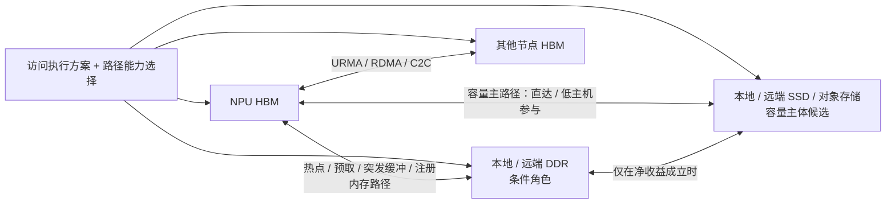
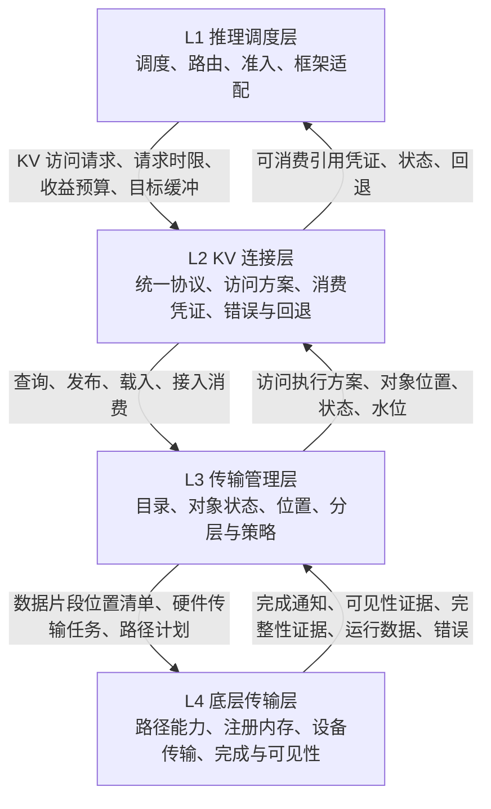
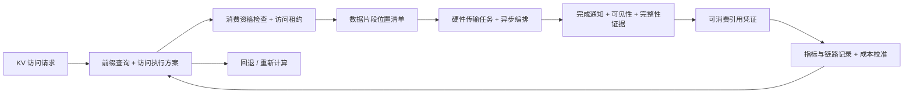
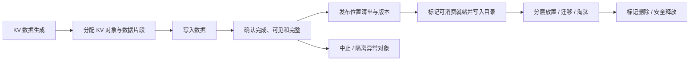

# 统一异构 KVCache 存储池总体架构与 SRS 评审导读

> 文档版本：V2.3.1 需求树与竞争力证据门对齐评审稿  
> 更新日期：2026-08-09  
> 规范基线：《KVCache SRS需求列表 V2.2_传输底座视角_建议修订版.xlsx》  
> 分解基线：《统一异构KVCache存储池_全量需求树_V2.3.1_SR项目贡献补充版.xlsx》  
> 立项前证据基线：《统一异构KVCache存储池_关键技术原型验证清单_V1.6_V2.3.1需求树与竞争力对齐完善版.xlsx》  
> 文档用途：帮助第三方评审专家、技术主管、项目主管和研发负责人统一理解第一方推理状态系统的竞争力目标、架构边界、独立交付 SR、阶段路径、原型门禁与验收逻辑。  
> 状态说明：本文为待评审 Markdown；本轮不生成正式 DOCX。

---

## 0. 执行摘要：本次评审需要先形成的六个共识

本次刷新以 V2.3.1 全量需求树为分解基线，以 V3.2 竞争力论证为最高原则。它不是一次编号替换，而是把“为什么立项、为什么由第一方承担、SR 为什么这样聚合、原型如何证明竞争力”连接成同一条可审计链。评审首先应确认以下六点。

1. **项目定位是面向国产 AI 硬件生态的第一方推理状态系统工程，不是另造一个缓存组件。** KVCache 是首个状态工作负载；项目负责把芯片能力编译为可认证路径，把状态决策转成客户价值，并持续反哺软件和硬件。
2. **Mooncake、LMCache、NIXL 等开源能力是可兼容、可复用、可替换的数据平面和生态基线，不是被贬低的对手。** 本项目的差异在 Day-0 目标硬件使能、非公开微架构信息、跨驱动/固件/运行时协同、跨版本认证、端到端归因与客户结果责任。
3. **竞争力北极星不是原始命中率或峰值带宽。** 在模型质量、业务 SLO 与硬件预算相同的条件下，应完成更多 SLO 合格业务事务，降低单位合格事务的全生命周期成本、尾延迟、容量和正确性风险。
4. **38 条 SR 是可独立构建、发布和验收的功能实体。** 149 条来源需求作为功能、约束、风险和验收输入多对一聚合到 SR；203 条 AR 按真实复杂度拆为 3～6 个工作包。SR 可以先行交付，但允许通过版本化契约、Mock/Stub 或最小兼容基线处理集成依赖。
5. **SR 对项目的贡献必须可解释。** 17 条以模块功能闭包为主，11 条以模块性能优化为主，10 条同时完成能力闭包和性能竞争力；工程测试、观测和发布 SR 也属于独立功能实体，因为它们承担证据、认证和交付责任。
6. **立项前 8 个 PVT 与 3 个 CVT 是 E0–E3 的证据门，不是既有成绩。** 所有比较必须采用同硬件、同模型、同 SLO、同调优预算的公平基线，并包含最佳可行开源组合、关闭状态智能和移除微架构信息等关键消融。

因此，本轮可支持的是“有条件、分阶段立项并用 4～5 周购买事实”。未达到 E3 前不得宣称已经优于开源，未达到 E4 前不得承诺客户 ROI，未达到 E5 前不得宣称形成持续壁垒。

## 1. 文档定位、事实基线与使用方法

### 1.1 本文档回答什么

本文档用于解释三类正式输入之间的关系：

- SRS V2.2 回答“系统必须交付什么、以什么指标和阶段验收”；
- 全量需求树回答“为什么需要、由哪个技术锚点承接、如何拆到系统设计和独立开发任务”；
- 关键技术原型清单回答“立项前必须先用什么证据确认项目成立条件”。

本文档不替代 SRS、详细设计、正式接口定义、测试方案、硬件规格、部署手册或原型报告。涉及需求描述、优先级、阶段和验收字段时，以对应源工作簿为准。

### 1.2 事实优先级

| 优先级 | 文档 | 在本导读中的作用 |
|---:|---|---|
| 1 | SRS V2.2 建议修订基线 | 144 条正式四层需求的唯一语义校准基线 |
| 2 | 全量需求树 V2.3.1 项目贡献补充版 | 将 144 条正式需求与 5 条工程建议多对一聚合为 38 条可独立交付 SR，并拆为 203 条 AR；不改写正式 SRS 语义 |
| 3 | 原型验证清单 V1.6 | 以 8 个 PVT、3 个 CVT、公平开源基线、关键消融和 E0–E3 证据门建立立项前可证伪计划；不预填不存在的实验结论 |
| 4 | V3.2 竞争力分析、立项汇报讲稿与页面调整说明 | 冻结第一方责任、客户价值北极星、公平竞争基线和潜在壁垒的最高叙事原则 |

### 1.3 评审建议路径

1. 先读第 2 章的名词解释，建立统一的中文理解，后文不要求读者记忆英文对象名。
2. 再读第 3—6 章，确认 V2.3.1 分解口径、第一方责任中心、交付边界和关键架构决策。
3. 通过第 7—9 章确认四层架构、六个横向模块、跨层信息和三条主流程是否闭环。
4. 通过第 10—11 章检查 2 条 SF、24 条 IR、144 条正式 SRS、5 条工程建议、38 条 SR 与 203 条 AR 的统计口径和追溯关系。
5. 通过第 12 章审查 P0—P3 阶段，不把 30%/50%/80%/100% 误解为机械的需求完成比例。
6. 通过第 13 章决定 8 个必做原型包是否足以支撑立项，以及 3 个条件项的触发条件是否合理。
7. 最后使用第 14—16 章检查 KPI、证据链和待冻结事项。

### 1.4 能力状态标记

| 状态 | 含义 |
|---|---|
| SRS 明确要求 | 已在 SRS V2.2 中形成正式需求、阶段或验收约束 |
| 建议门槛 | 当前可用于方案和原型审视，必须在固定对照基线和代表硬件上经 P0 或提前验证冻结 |
| 由 SRS 推导 | 为解释需求关系形成的总体架构结论，仍需详细设计定版 |
| 条件能力 | 只有平台能力、正确性和净收益达标才可通过功能开关启用 |
| 非目标/禁入主路径 | 本期不承诺，或明确不得成为默认主路径依赖 |

## 2. 名词解释与中文称谓约定

本章集中解释 SRS、全量需求树、原型验证清单和本导读中反复出现的英文名称。解释重点不是逐字翻译，而是说明该词在本项目里代表什么信息、解决什么问题、由谁使用。后续正文遵循“**中文称谓为主，英文仅在首次出现、需求追溯或接口定版讨论中保留**”的规则。

下表中的“源名称”分为两类：一类是 SRS/需求树/原型清单直接使用的对象、能力或指标名称；另一类是业界通用硬件与推理术语。它们不是新增需求。最终接口字段和代码类名仍由详细设计决定。

| 出现的英文或缩写 | 中文含义解析 |
|---|---|
| KVCache | 大模型推理过程中保存历史 token 的 Key/Value 中间结果。复用它可以减少重复计算，但前提是模型、版本、布局和数据状态完全兼容。本文简称“KV 缓存”。 |
| Prefill | 模型读取整段输入并一次性生成各层 KV 缓存的阶段。公共前缀被重复计算的成本主要发生在这里。本文称“输入预计算阶段”。 |
| Decode | 模型逐个生成输出 token、并反复读取历史 KV 缓存的阶段。它对延迟抖动和远端访问非常敏感。本文称“逐词生成阶段”。 |
| TTFT | Time to First Token，从请求进入到首个输出 token 产生的时间，是衡量前缀复用是否真正节省等待时间的核心指标。 |
| TPOT | Time per Output Token，首 token 之后每生成一个 token 的耗时。后台搬运即使改善 TTFT，也不能明显恶化该指标。 |
| HBM | NPU/GPU 旁的高带宽内存，是逐词生成阶段读取 KV 缓存的主要高速空间，但容量昂贵且有限。 |
| DDR | 主机侧或远端的普通内存。本项目不把它设为所有 KV 数据的必经层，只在热点、远端低时延、预取缓冲、注册内存池或元数据等角色有净收益时使用。 |
| SSD / Object Storage | 大容量、低成本的固态盘或对象存储。本项目把它视为冷/温 KV 缓存的容量主体候选，并重点验证与 HBM 之间的直达或低主机参与路径。 |
| NPU | 执行大模型计算的加速器。本文关注它是否在有效计算，而不是因等待 KV 数据、错误路径或忙等待而空转。 |
| Host | 运行 CPU、操作系统和控制程序的主机侧。本文的“Host Payload touch”专指 CPU 读取、写入、复制、压缩、解压或全量扫描 KV 数据正文，不包括小型控制描述。 |
| UBMEM | 项目底层提供的一类内存访问语义，使合格对象能够按共享/映射方式被访问。它不代表所有 KV 数据都适合直接远端读取，适用范围必须实测。 |
| URMA | 项目底层提供的一类跨设备/跨节点传输语义，负责批量提交、数据搬运、完成通知和错误反馈。它是执行能力，不直接决定上层是否值得复用。 |
| RDMA | 远程直接内存访问，用于节点间高带宽、低 CPU 参与的数据传输。是否可用还取决于内存注册、权限、队列、完成和故障语义。 |
| C2C | 芯片或设备之间的高速互联通道。它可能提供比普通网络更低的访问成本，但必须进入路径能力实测，不能只按名称推定性能。 |
| DPU | 承担网络、存储或数据处理卸载的专用处理器。本项目把它视为条件加速能力，不是统一池成立的前提。 |
| CQ | Completion Queue，硬件完成队列。传输任务提交后，软件从这里得知任务是否完成、失败或超时；“队列有完成项”仍需与数据可见性规则共同判断。 |
| RAS | Reliability、Availability、Serviceability 的合称，指硬件错误发现、隔离、恢复和可维护能力。本文主要关心硬件错误如何阻止坏数据进入推理。 |
| Raw Hit | 目录中找到了一个可能匹配的 KV 对象，只说明“候选存在”，尚未证明它正确、可加载或值得加载。本文称“原始命中”。 |
| Usable Hit | 候选对象通过模型语义、版本、布局、数据就绪、访问租约、路径、时限和成本校验后，能够安全且有收益地使用。本文称“可消费命中”。 |
| Abandoned Hit | 已经命中候选，但因收益为负、超时、拥塞、迁移、版本或加载失败而主动放弃，转用其他副本或重新计算。本文称“放弃命中”。 |
| load-vs-recompute | 比较“把已有 KV 载入”与“本地重新计算”的总成本。它不是固定规则，而是根据请求时限、路径负载和预计收益做出的逐请求判断。本文称“载入与重算决策”。 |
| KVAccessIntent | SRS/需求树中的源对象名。它是框架交给统一池的一张“访问申请单”，说明谁要哪段 KV、何时要、目标设备在哪里、预计重算能省多少时间。正文称“KV 访问请求”。 |
| QueryPlan | SRS/需求树中的源对象名。它是统一池返回的一份“访问执行方案”，说明是否使用已有 KV、从哪个副本取、走哪条路径、预计多久、失败后怎么办。正文称“访问执行方案”。 |
| AttachHandle | SRS/需求树中的源对象名。数据通过校验并可被框架读取后，系统返回的“可消费引用凭证”，用于约束可读地址/块、有效期、释放方式和失效处理。正文称“可消费引用凭证”。 |
| KVObject | 需求树中的统一对象概念。它把一段 KV 缓存的语义身份、版本、状态、位置和生命周期组合为可管理实体，不等同于某一块物理内存。正文称“KV 对象”。 |
| PrefixDirectory | SRS/需求树中的源组件名。它记录哪些前缀对应哪些 KV 对象及副本位置，用于快速发现候选；目录命中不等于可以直接消费。正文称“前缀目录”。 |
| KVSemanticIdentity | SRS/需求树中的源概念。它把模型、权重、分词器、提示模板、适配器、租户等共同组成“是否语义相同”的判断条件。正文称“KV 语义身份”。 |
| Placement | SRS/需求树中的源概念。它不是简单的 HBM/DDR/SSD 标签，而是对象所在节点、设备、物理片段、副本、健康状态及到目标 NPU 的路径代价。正文称“对象位置”。 |
| Extent | SRS/需求树中的底层存储单位，表示一段连续或可独立寻址的数据片段。一个逻辑 KV 对象可以由多个数据片段组成。正文称“数据片段”。 |
| ExtentManifest | SRS/需求树中的源对象名。它是一张“数据片段位置清单”，记录一个 KV 对象被拆成哪些片段、各片段位于哪里、长度与对齐要求是什么，以及如何校验和访问。正文称“数据片段位置清单”。 |
| Descriptor | SRS/需求树中的源对象名。它是交给某个硬件/软件传输后端执行的一条或一批“传输任务说明”，明确源、目标、长度、队列、完成通知和失败处理。正文称“硬件传输任务”。 |
| SG / Scatter-Gather | 把多个离散数据片段组合成一次批量传输的方式，目的是减少逐块提交和小 I/O 放大。正文称“离散片段批量列表”。 |
| MR / rkey | RDMA 等路径中的已注册内存区域及其远端访问凭证。它们共同限定远端设备能访问哪段内存，不能跨租户或越界使用。正文称“注册内存区域/访问凭证”。 |
| CapabilityMatrix | SRS/需求树中的源概念。它不是功能勾选表，而是记录每条硬件路径是否支持、能传多大、性能如何、是否触碰 CPU、如何完成和失败的实测矩阵。正文称“路径能力矩阵”。 |
| Registered Pool | 预先完成内存注册并可被 RDMA/URMA 等路径直接使用的内存池，用于减少每次传输前临时注册的成本。正文称“注册内存池”。 |
| Completion | 传输后端报告“任务执行结束”的事件。它必须与可见性和完整性条件合并判断，不能单凭完成通知就让框架读取数据。正文称“完成通知”。 |
| Fence | 约束读写顺序和数据可见性的同步规则，用于保证“先写完数据，再发布可读状态”。正文称“可见性屏障”。 |
| Ready | 表示对象或片段已经满足完成、可见性、版本和完整性要求，可以进入消费资格检查。正文称“可消费就绪”。 |
| Lease | 消费者在使用 KV 对象期间取得的临时访问权，用于防止对象同时被迁移、覆盖或释放。正文称“访问租约”。 |
| Refcount | 记录仍有多少消费者持有对象。只有引用归零且其他条件满足时，对象才可回收。正文称“引用计数”。 |
| Direct view | 不先把数据复制到本地 HBM，而是通过受控的内存映射/共享语义直接访问。它只适用于被实验证明安全且有收益的对象和访问模式。正文称“直接访问”。 |
| Staged path | 数据先经过中间内存或 CPU 再到目标设备的分段路径。它可以是回退手段，但必须计量额外拷贝、CPU 和时延，不能伪装成直达路径。正文称“中转路径”。 |
| Fallback | 主路径不满足正确性、时限、成本或可用性时，切到备用副本、本地缓存、部分重算、完全重算或关闭能力。正文称“回退”。 |
| Feature flag | 控制某项能力是否启用的配置开关，用于小流量验证、快速关闭条件能力和故障止损。正文称“功能开关”。 |
| Telemetry | 系统自动采集的路径时延、带宽、队列、CPU、状态和错误等运行数据，用来校准成本估计和解释收益。正文称“运行观测数据”。 |
| Trace | 把一次请求从查找、决策、搬运、消费到回退串起来的事件记录，用于回答“为什么命中、为什么慢、为什么回退”。正文称“链路记录”。 |
| Baseline | 在固定模型、数据、并发、拓扑和软硬件版本下得到的对照结果。没有同口径基线，提升比例没有可比性。正文称“对照基线”。 |
| P50 / P95 / P99 | 指标分布的中位数、95 分位和 99 分位，用于同时观察典型情况和尾部慢请求，不能只报告平均值或峰值。 |
| SLO | 面向在线业务的服务目标，例如首 token 时延、逐 token 时延、错误率和可用性边界。本文称“服务目标”。 |
| QoS | 对不同租户、前后台任务和流量等级进行资源隔离、排队和限流，以防后台搬运影响前台生成。本文称“服务质量控制”。 |
| SF / IR / SR / AR | 需求树四级：SF 是全局系统能力；IR 是来自用户/上游初始诉求经架构归一化后的技术锚点；SR 是可独立构建、发布和验收的功能实体；AR 是实现 SR 的可认领工作包。详见第 11 章。 |
| PVT / CVT | PVT 是立项前必做验证包；CVT 是满足触发条件后才开展的条件/证伪验证项。两者都必须输出可复现证据，而不是演示结论。 |
| Go / Conditional / No-Go / Not Supported | 四类评审结论：可按冻结边界推进；仅限定条件成立；核心假设不成立；当前平台不具备必要能力。 |

**正文标注约定：** 普通叙述优先使用中文；当某个概念需要与 SRS/需求树中的对象名或字段名直接对照时，采用“中文称谓（英文源名称）”形式。英文源名称主要保留在总体能力、核心对象定义和评审导航等关键位置，不要求评审者在连续阅读时反复记忆。数值门槛统一使用“≥、≤、＞、＜”等正式数学符号，避免 ASCII 符号被排版工具误识别为表情或标签。

## 3. V2.3.1 相对上一分解口径的关键变化

| 维度 | 旧口径或易产生的理解 | V2.3.1 刷新 | 评审影响 |
|---|---|---|---|
| SR 定义 | SR 容易退化为单条来源需求的容器 | 38 条 SR 按组件、服务、SDK、插件、工具或功能纵切聚合，每条可独立构建、发布、验收和回滚 | 评审对象从“需求行”升级为“可交付功能实体” |
| 来源关系 | 来源需求与 SR 一一对应 | 144 条正式 SRS + 5 条工程建议多对一映射 38 条 SR；来源仍逐条保留 | 既保留全量追溯，又避免功能碎片化 |
| AR 分解 | 每 SR 固定三类任务 | 203 条 AR 按真实复杂度拆为 3～6 个工作包并建立依赖链 | 支持真实排期、并行开发和责任认领 |
| 独立交付 | 依赖容易被理解为不可独立交付 | 允许集成依赖，但必须有最小兼容基线或桩件，且依赖不得阻断本 SR 独立验收 | 部分 SR 可先行发布并形成阶段价值 |
| 项目贡献 | SR 只描述“做什么” | 新增“对项目的贡献定位”，区分模块功能闭包、模块性能优化和功能与性能协同 | 能解释每个独立实体对总体交付和竞争力的增量 |
| 容量路径 | 容易推导为 HBM→DDR→SSD 固定三级迁移 | HBM↔SSD 直达/低主机参与作为容量主路径，DDR 按持续净收益承担条件角色 | 必须提前证明真实路径、可服务容量、主机触碰（Host Touch） 和回退 |
| 竞争基线 | 只与重算或框架默认配置比较 | 加入最佳可行开源组合与同等调优，并对状态智能、微架构信息做消融 | 区分“系统真实增量”与“基线过弱/硬件禀赋” |
| 证据阶段 | 目标门槛容易被误读为既有成绩 | E0 立项充分性、E1 能力路径、E2 决策优越性、E3 系统净收益、E4 客户价值、E5 持续壁垒 | 当前文档只设计 E0–E3；E4/E5 由后续交付关闭 |
| 条件硬件 | DPU、Codec、多播、原子迁移可能被写成成立前提 | 继续作为 CVT 条件/证伪对象，未证明增量时关闭 | 避免过早采购和架构套牢 |

> SRS V2.2 仍是 144 条正式需求的规范语义基线；V2.3.1 改变的是 SR/AR 的工程分解与交付解释，不改写正式 SRS。所有数值目标在代表硬件和冻结工作负载上实测前仍是建议门槛。

## 4. 项目背景与需求设置初衷

大模型在线推理中的输入预计算阶段会为输入 token 计算各层 Key/Value 状态，逐词生成阶段则持续读取历史 KV 缓存。随着 RAG、长上下文、多轮对话、智能体工作流和两个阶段的分离部署普及，KV 缓存已从框架内部临时缓冲区演变为具有以下属性的系统级资源：

- 语义身份：模型、权重、分词器、提示模板、参数适配器、租户和安全域；
- 物理身份：介质层、节点、设备、数据片段、副本、数据布局和版本；
- 生命周期：生成、写入、校验、发布、可消费就绪、迁移、访问租约、淘汰、隔离和释放；
- 消费约束：请求时限、目标 HBM、多卡一致性、接入消费方式、回退和收益预算；
- 服务价值：TTFT、TPOT、吞吐、有效容量、NPU 利用率、稳定性和成本。

如果仍由单个框架实例、单台节点或单一介质局部管理，会产生重复输入预计算、资源孤岛、负收益命中、后台流量干扰逐词生成、错误或过期对象被消费，以及“底层带宽很好但业务无收益”等问题。

### 4.1 典型场景

| 场景 | 核心问题 | 统一池响应 | 评审边界 |
|---|---|---|---|
| RAG 公共前缀 | 相同系统提示词、知识片段或工具说明被重复执行输入预计算 | 语义身份、前缀目录、访问执行方案、载入与重算决策 | 只有可消费命中且加载收益为正才复用 |
| 多轮智能体会话 | 会话持续增长导致 HBM 水位、抢占和冷热分化 | 生命周期、分层驻留、按需回迁、容量准入 | 正在逐词生成的活跃数据仍受 HBM 带宽和容量约束 |
| 输入预计算/逐词生成分离 | 输入预计算产生的 KV 需被其他逐词生成节点消费 | 对象位置、远端数据片段、批量传输任务和异步流水 | 跨节点路径必须受请求时限、成本和正确性约束 |
| 长上下文容量压力 | 128K/256K/1M 上下文引发 OOM、碎片和迁移抖动 | HBM↔SSD 容量路径、水位、淘汰、绕过非必要介质层 | 扩展的是满足稳定服务目标的有效容量，不是可寻址字节 |
| SSD/远端回源混流 | 后台回源、预取和迁移与前台逐词生成争用 | 流量等级、服务质量控制、迁移互锁、限流和回退 | TPOT 超门槛必须暂停、降级或重算 |
| 多租户共享 | 相似前缀可能跨安全域碰撞 | 安全域、访问租约、注册内存权限保护、安全释放 | 未满足隔离规则的命中不得消费 |

共同原则是：**原始命中只代表发现候选，只有通过语义、状态、路径、请求时限和成本校验的命中才是可消费命中。**

## 5. 项目宗旨、目标与非目标

### 5.1 项目宗旨

把 UBMEM/URMA 等底层内存语义、传输语义和设备直达能力组织成可运营的 KVCache 存储池，为 AI 集群客户提供跨 HBM、DDR、SSD 和远端资源的统一对象、路径、状态、成本与观测能力。

### 5.2 两条全局系统特性

| SF | 全局技术能力 | 代表性验收目标 |
|---|---|---|
| SF-01 统一池与语义化传输底座 | 以统一 KV 对象、数据片段位置清单（ExtentManifest）、对象位置（Placement）、路径能力矩阵（CapabilityMatrix）和访问执行方案（QueryPlan），统一管理 HBM、本地/远端 DDR、本地/远端 SSD/对象存储；以 HBM↔SSD 直达/低主机参与为容量主路径 | 五类介质纳管覆盖率 100%；至少一条容量主路径闭环；错误/过期 KV 消费为 0；直达路径的主机 KV 正文触碰为 0；代表路径带宽达到线速或设备峰值的 ≥80%；路径故障 ＜200 ms 切换或显式回退 |
| SF-02 集群复用与推理服务目标闭环 | 面向 vLLM/SGLang 建立前缀目录（PrefixDirectory）、KV 语义身份（KVSemanticIdentity）、载入与重算决策、缓存感知路由、分层/预取和全链路观测 | 目标工作负载 p99 首 token 时延降低 ≥20%；后台任务引起的 p99 逐 token 时延回退 ＜3%；可消费命中率提升 ≥20%；HBM 有效容量提升 ≥30%；OOM/抢占降低 ≥50%；NPU 有效利用率提升 ≥10% |

这些数值是当前建议门槛。立项前原型和 P0 对照基线必须给出适用工作负载、统计窗口、置信范围和硬件拓扑，随后才能冻结为项目承诺。

### 5.3 本期目标

1. 统一表达并纳管五类 KV 缓存位置：HBM、本地/远端 DDR、本地/远端 SSD/对象存储。
2. 面向 vLLM/SGLang 提供统一 KV 访问请求（KVAccessIntent）、访问执行方案（QueryPlan）、可消费引用凭证（AttachHandle）、错误码和回退契约。
3. 建立语义身份、目录、对象状态、对象位置、数据片段、版本、可消费就绪、访问租约/引用计数和副本健康模型。
4. 以路径能力、拓扑和运行观测数据驱动载入与重算、直接访问与复制、路径选择、分层驻留与淘汰。
5. 打通 Prefix Hit、Load/Attach、Publish/Lifecycle 三条端到端主链路。
6. 以统一链路记录和 A/B 对照基线证明正确性、收益、干扰、容量与降级行为。
7. 形成跨平台构建、自动化测试、性能基线、长稳、故障注入和灰度回滚的工程交付体系。

### 5.4 非目标与禁止性边界

- 不把所有介质伪装成性能相同的通用内存。
- 不替代推理框架调度器、操作系统虚拟内存、硬件驱动或通用存储系统。
- 不承诺所有模型、上下文、并发、拓扑和工作负载都有正收益。
- 不以原始命中、介质容量或峰值带宽单独证明项目价值。
- 不将 CPU 编解码、CPU 全量 CRC 或隐式 CPU 中转作为直达主路径的默认回退。
- 不把 DPU/硬件编解码、硬件多播、原子地址重映射、硬件页迁移或逐词生成活跃 KV 的直接访问写成项目成立前提。
- 不把一次性演示当作立项证据；通过或条件通过的原型必须形成可迁移到正式仓库的接口、探针、测试框架、标准正确结果用例或薄闭环。


### 5.5 竞争力最高纲领与第一方责任边界

本项目的必要性不建立在“开源能力不足”上，而建立在通用开源不会自动承担目标国产硬件的第一方结果责任。项目应同时守住以下原则：

- **语义先于位置**：目录中存在数据不等于语义相同、状态就绪或允许消费；
- **价值先于容量**：可寻址字节和原始命中必须经过正价值决策才能转为客户收益；
- **重算是一等路径**：加载、直接访问或迁移为负收益时，应主动重算；
- **就绪先于消费**：完成通知、可见性、完整性、版本、租约和 Rank 必须形成消费资格；
- **实际路径先于宣称路径**：所有直达/零拷贝主张必须由计划路径、实际路径、主机触碰（Host Touch） 和回退凭证证明；
- **开放数据平面、自控状态语义**：兼容优秀开源 Provider，把长期差异放在状态决策、认证、生产归因和硬件反馈，而不是封闭接口。

竞争力必须沿“客户价值—可证明指标—可复制壁垒—替代方案边界”表达：

| 层次 | 本项目必须回答的问题 | 可接受证据 |
|---|---|---|
| 客户价值 | 同质量、同 SLO、同预算下是否完成更多合格业务事务或降低单位成本 | TTFT/TPOT/QPS、容量、NPU、功耗、SSD 寿命与单位事务全生命周期成本 |
| 系统增量 | 相对最佳可行开源组合是否仍有净收益 | 同条件 A/B、实际路径凭证（ActualPathReceipt）、主机触碰（Host Touch）、统计置信、失败样本 |
| 因果来源 | 收益是否来自状态智能、目标硬件信息或跨层协同 | 关闭状态智能、移除微架构信息、静态规则等消融 |
| 第一方责任 | 是否能解释、认证、回退并推动硬件/驱动/固件改进 | 跨版本兼容矩阵、故障归因、Day-0 Lead、已关闭硬件反馈项 |
| 持续壁垒 | 优势是否跨客户、工作负载和芯片代际复现 | E4 客户价值凭证、E5 跨代认证、优势半衰期和客户续用 |

当前立项材料证明的是信息权、控制权、数据权、责任权和迭代权等**潜在成功条件**，不是已经形成的结果。只有这些条件通过原型和后续交付形成“信息—行动—学习”闭环，才可以沉淀为产品、平台和生态竞争力。

## 6. V2.3.1 基线下的五项关键架构决策

### 6.1 路径是图，不是固定层级



任何路径都必须明确说明数据从哪里来、送到哪里、使用什么传输方式、是否触碰主机侧 KV 正文、如何确认完成和可见、采用什么完整性证据、怎样限流、失败后如何回退。固定 HBM→DDR→SSD 三级串行搬运不能作为默认架构假设。

### 6.2 SSD 是容量主体，DDR 按角色准入

DDR 的价值不是“总容量越大越好”，而是某个具体角色在固定工作负载下是否持续改善 TTFT、TPOT、SSD 尾延迟、NPU 等待时间或服务容量。建议审查以下角色：

- 热点 KV 的低时延缓存层；
- 远端共享内存或弹性池；
- 预取、突发吸收和 SSD tail buffer；
- 注册内存池或必要的对齐/提交缓冲；
- 前缀目录、框架块表快照等元数据/控制对象。

若角色没有持续净收益，DDR 应退出 KV 正文主路径，只保留元数据、控制信息或必要注册内存池。

### 6.3 CPU 边界必须可测量

默认数据路径要求 CPU 对 KV 正文的触碰为 0，CPU 压缩/解压和全量 CRC 调用为 0。CPU 可以承担控制提交、队列管理、元数据、策略、异常诊断和必要的小型控制结构处理。仅中转路径可用时，只能作为非默认回退，并同时给出：

- CPU 每 GB 处理周期、主机触碰的 KV 正文字节数和端到端中转次数；
- 适用对象大小、并发、请求时限与限流条件；
- 功能开关、告警、禁用入口和不满足门槛时的重新计算路径。

### 6.4 完整性是消费资格，不是固定算法

完整性目标保持必选，但可按路径使用硬件保护、后端校验或端到端硬件校验。只有完成通知、可见性屏障、版本和完整性策略全部满足后，对象才可标记为“可消费就绪”。任何半写、乱序、损坏、过期或越权对象都必须进入拒绝、隔离、备用副本或重算，而不是继续交给框架消费。

### 6.5 直接访问是按对象和访问模式选择的条件能力

UBMEM 优先用于热元数据、只读快照和经验证的安全直接访问。前缀目录查询、框架块表接入/读取与逐词生成阶段对 KV 的高频重读具有完全不同的访问模式。默认假设应是：**逐词生成中的活跃 KV 先复制到 HBM；只有 PVT-03 证明存在稳定安全区后，才对白名单场景启用直接访问。**

## 7. 总体软件架构

### 7.1 四层契约



“L3 传输管理层”不仅负责物理搬运，还承载目录、对象状态、位置、生命周期和策略编排；真实路径执行主要由 L4 和 TM4 完成。评审时应按输入/输出和状态责任划界，不能仅按层名理解职责。

### 7.2 六个横向技术模块

| 模块 | 核心职责 | 主要交付 |
|---|---|---|
| TM1 推理调度与标准接口控制 | 接收框架访问请求、请求时限、水位与优先级；执行准入、路由和回退 | 框架适配、KV 访问请求、载入与重算决策、主流程开关 |
| TM2 分布式前缀索引与元数据平面 | 前缀查找、语义身份、缓存/镜像、无结果缓存、消费资格判断 | 前缀目录、KV 语义身份、批量/范围查询、过期命中拦截 |
| TM3 异构分层存储池与生命周期空间 | 对象状态、位置、数据片段、容量、水位、迁移、淘汰和碎片治理 | KV 对象状态机、数据片段位置清单、分层管理、DDR 角色策略 |
| TM4 硬件加速传输与数据流编排 | 路径能力、批量传输任务、注册内存池、路径执行、完成语义与路径观测 | 传输任务生成、异步任务编排、路径选择、后端适配 |
| TM5 共享协同、安全隔离与服务质量管控 | 访问租约/引用计数、可消费就绪、多卡一致性、租户隔离、迁移互锁和流量等级 | 可消费引用凭证、就绪/租约、队列隔离、异常对象隔离、安全释放 |
| TM6 全路径可观测与容错保障 | 串联请求、计划、对象、路径、状态、成本和失败原因 | 语义指标、路径/回退/状态链路记录、硬件错误映射、检查接口 |

### 7.3 部署原则

前缀目录、策略模块、对象管理模块和传输路径选择模块可以按性能与故障域拆分进程，但必须用请求编号、访问方案编号、对象编号和路径编号串成统一软件实体。部署评审重点不是“有几个服务”，而是：

- 元数据查询是否进入 TTFT 串行路径；
- 目标 HBM 的分配权与设备地址所有权属于谁；
- 目录、对象状态和副本健康如何分片、复制、失效与恢复；
- 跨节点注册内存区域、远端访问凭证和租户安全域如何认证与隔离；
- 路径不可用或估计失准时，是否有有界、可观测的回退。

## 8. 核心设计思想与跨层信息

### 8.1 载入与重算决策

```text
仅当：
  可节省的重新计算时间
    > 目录查询时间 + 数据载入时间 + 框架接入时间 + 多卡同步时间 + 对前台任务的干扰成本
并且语义身份、版本、数据布局、可消费就绪、访问租约、请求时限、完整性与路径条件均满足时，
才选择“直接接入已有数据、载入 HBM、受控直接访问或部分前缀复用”；
否则选择本地缓存、备用副本、等待、部分重算、完全重算或拒绝。
```

估计参数必须来自固定对照基线和动态运行观测数据。发现候选后仍选择重算可能是正确行为，应记录为“放弃命中”，而不是策略失败。

### 8.2 五类跨层信息

| 中文主称谓（SRS 英文源名称） | 它解决的实际问题 | 详细设计需要冻结的内容 |
|---|---|---|
| KV 访问请求（KVAccessIntent） | 让推理框架用统一方式告诉存储池：“哪个租户、哪个模型需要哪段 KV，最晚何时拿到，送到哪个设备，重新计算大约要花多久。” | 请求身份、模型与分词器版本、提示模板、前缀范围、请求时限、目标设备、业务优先级和是否允许部分复用 |
| 访问执行方案（QueryPlan） | 让统一池明确回答：“是否使用已有 KV；如果使用，从哪个副本取、走哪条路径、预计多久；如果失败，改走哪里或是否重算。” | 可安全使用的前缀长度、来源位置、对象/布局/版本、预计查询与载入成本、判断可信度、选择原因和回退动作 |
| 可消费引用凭证（AttachHandle） | 在数据真正满足读取条件后，给框架一份受控凭证，防止框架读取半写、过期、已迁移或已释放的数据。 | 可读地址或块表引用、消费方式、有效期、访问租约、引用计数、失效状态、释放动作和完整性凭据 |
| 数据片段位置清单（ExtentManifest）与硬件传输任务（Descriptor） | 前者说明一个逻辑 KV 被拆成哪些物理片段以及分别在哪里；后者把这些片段整理为具体硬件可以执行的批量搬运任务。 | 介质、节点、设备、地址、偏移、长度、离散片段列表、对齐要求、注册内存权限、传输队列、完成通知、可见性规则和重试条件 |
| 指标（Telemetry）与链路记录（Trace） | 把“为什么命中、为什么选择这条路径、实际是否比重算快、为什么回退”串成可复核证据。 | 请求、访问方案、KV 对象和路径的关联编号；估计与实际成本；命中状态；选择/回退原因；首 token 与逐 token 时延；错误码 |

以上是面向评审者的语义说明，不等同于最终接口定义。具体字段是否必选、默认值是什么、版本如何兼容、多久算超时，应由 P0/P1 详细设计和接口一致性测试定版。源对象名可在第 2 章查阅。

### 8.3 从请求到证据



## 9. 三条主流程与异常闭环

### 9.1 前缀命中快判

1. L1 生成 KV 访问请求，给出语义身份、前缀范围、请求时限、可节省的重算时间和目标设备。
2. L2/TM2 先查本地元数据和“确定无结果”的缓存，再按时间预算批量或分段查询目录。
3. 候选对象经过语义身份、版本、数据布局、可消费就绪、访问租约、副本健康和安全域校验。
4. 策略与成本模块估计目录查询、数据载入、框架接入、多卡同步及干扰成本，生成访问执行方案。
5. L1 根据当前批次、HBM 水位和请求时限选择执行或重算。

### 9.2 KV 载入与接入消费

1. KV 连接层接收访问执行方案和目标缓冲约束，申请访问租约并增加引用计数。
2. 对象位置选择模块确定副本和路径，再根据数据片段位置清单生成可批量提交的硬件传输任务。
3. 传输模块执行复制、受控直接访问或流式载入，并返回完成通知、可见性证据、完整性证据和运行观测数据。
4. 所有消费卡达成最小安全共识后，系统返回可消费引用凭证。
5. 任何超时、元数据过期、半写、多卡不一致或成本超预算，都触发备用副本、本地缓存、部分/完全重算或禁用该路径。

### 9.3 KV 发布与生命周期



迁移、碎片压紧、淘汰和副本更新不能绕过有效访问租约、可消费就绪/版本和发布可见性。后台任务必须服从前台逐词生成的服务质量控制和迁移互锁。

### 9.4 异常处理不变量

- 错误、过期、未达到可消费就绪、越权或完整性证据不足的 KV 被消费次数必须为 0。
- KV 连接层内部不得无界等待；约定故障回退成功率目标为 100%，触发到恢复建议 ＜500 ms。
- 路径故障应在建议 ＜200 ms 内切换或显式回退；两者口径需在详细设计中分别定义。
- 所有回退必须有标准错误码、选择原因、回退原因和关联编号。
- 条件能力失败时默认关闭功能开关，不得迫使主路径依赖其存在。

## 10. 24 条 IR：架构评审的技术锚点

24 条 IR 不是对 144 条 SRS 的重复，而是把两条全局 SF 转为具名组件、机制和数字门槛。评审应先判断 IR 的技术闭环，再下钻对应 SR/SRS。

### 10.1 SF-01：统一池与语义化传输底座

| IR | 功能化描述 | 代表性建议门槛 |
|---|---|---|
| IR-01-01 | 统一纳管 HBM、DDR、SSD 与远端介质，以 HBM↔SSD 构建容量主路径 | 碎片 ＜5%；HBM 有效容量 +30%；OOM/抢占 -50%；SSD 路径 ≥设备峰值 80%；DDR 角色无正收益则退出 KV 正文主路径 |
| IR-01-02 | vLLM/SGLang 跨介质布局适配与批量传输任务生成 | 传输描述数量 -50%；有效带宽 +30%；CPU 提交开销 -40%；布局错误 0 |
| IR-01-03 | 面向 TTFT 与资源成本的访问决策和访问执行方案 | 可消费命中率 +20%；成本误差 ＜20%；策略 ＜5 μs；负收益命中强制放弃 |
| IR-01-04 | 输入预计算/逐词生成分离、流水加载和一对多共享的异步编排 | 两阶段交接 p99 -20%；热点分发 p99 -40%；计算/传输重叠 ≥60% |
| IR-01-05 | 异构介质与拓扑的路径能力探测和动态选路 | 选择准确率 ≥90%；故障切换 ＜200 ms；探测开销 ＜0.5% 带宽 |
| IR-01-06 | 跨节点 HBM/DDR 的 RDMA 高速传输 | 有效带宽 ≥线速 80%；CPU 复制 KV 正文=0；提交 ＜50 μs |
| IR-01-07 | UBMEM/C2C 直接访问、回填与访问保护 | 直接访问时 TPOT p99 回退 ＜3%；主机 KV 正文触碰=0；过期映射访问=0 |
| IR-01-08 | HBM↔SSD 容量读写与条件化 DPU/硬件编解码 | SSD 恢复路径的 TTFT -30%；NPU 等待 -50%；主机触碰 KV 正文=0；硬件卸载相对原始/直达路径有正收益 |
| IR-01-09 | 统一抽象 UB、URMA、RDMA、C2C 与 SSD 并按需路由 | 路径能力覆盖 100%；错误路由 0；路径选择 ＜3 μs；中转路径例外可见且可禁用 |
| IR-01-10 | 多消费者共享、租约引用与故障快速回退 | 过期映射访问=0；重复远端拉取 -50%；回退成功率 100%；恢复 ＜500 ms |
| IR-01-11 | 发布迁移一致性、多租户隔离与前后台服务质量控制 | 数据损坏=0；TPOT p99 回退 ＜3%；租户间干扰 ＜5%；越权 0 |
| IR-01-12 | 按路径提供完整性证据、访问保护与硬件故障恢复 | 错误/过期消费 0；CPU 全量 CRC=0；直接访问撤销 p99 ＜1 ms；故障注入覆盖 100% |

### 10.2 SF-02：集群复用与推理服务目标闭环

| IR | 功能化描述 | 代表性建议门槛 |
|---|---|---|
| IR-02-01 | vLLM/SGLang 统一访问接口与后端插件规范 | 接口一致性测试通过率 100%；接口 ＜5 μs；新后端工期 -50% |
| IR-02-02 | 基于位置、加载收益和水位预算的调度与准入 | p99 TTFT -20%；被放弃的远端载入 -50%；每请求跨节点字节数 -30%；QPS +10% |
| IR-02-03 | vLLM 哈希与 SGLang 前缀树的低时延前缀匹配 | 查询 p99 ＜200 μs；100 并发吞吐 ≥8 倍；可消费命中率 +15% |
| IR-02-04 | 本地元数据缓存、“确定无结果”缓存与批量快判 | 本地命中 ＜10 μs；确定无结果 ＜5 μs；远端查询 QPS -50%；布隆过滤器误报率 ＜0.1% |
| IR-02-05 | 集群前缀目录、位置索引与副本可用性查询 | 远端往返时延 -50%；查询 p99 -30%；可用性 ≥99.99%；过期命中=0 |
| IR-02-06 | 卸载、加载、分层回源和计算—传输流水 | 重叠 ≥60%；换入路径 TTFT -25%；批量传输时延 -50%；额外内存 ≤15% |
| IR-02-07 | 基于趋势和复用概率的投机预取 | 命中率 ≥70%；命中等待 -60%；误预取 ＜20%；额外 HBM ≤10% |
| IR-02-08 | 模型级容量估算、水位准入和生命周期状态管理 | 估算误差 ＜5%；OOM/抢占 -50%；碎片 ＜5% |
| IR-02-09 | 逐词生成活跃 KV、热前缀和冷 KV 的分层驻留与淘汰 | HBM 有效容量 +20%；TPOT p99 回退 ＜3%；每请求的输入预计算量 -15% |
| IR-02-10 | 张量并行/流水并行多卡一致消费及指标治理 | 正确性故障=0；多卡等待 p99 ＜100 μs；字段覆盖 100%；观测开销 ＜1% |
| IR-02-11 | 请求—方案—对象—路径全链路观测与定位 | 成本误差 ＜20%；探针开销 ＜1%；回退原因覆盖 100%；平均修复时间降至分钟级 |
| IR-02-12 | 跨平台构建、测试、性能基线与灰度交付 | 核心覆盖 ＞85%；代码合并请求反馈 ＜15 min；72h 零泄漏；回退 ＜500 ms 且 0 错误；回滚 ＜1 min |

## 11. 全量需求树、统计口径与追溯方式

### 11.1 数量口径

| 层次/集合 | 数量 | 解释 |
|---|---:|---|
| SF | 2 | 全系统对外提供的整体技术能力 |
| IR | 24 | 来自用户/上游初始诉求经架构归一化后的具名组件/机制与 KPI 技术锚点 |
| 正式四层 SRS | 144 | L1 21 + L2 22 + L3 68 + L4 33，是规范语义分母 |
| 同版软件工程建议 | 5 | SE-TEST-001/002、SE-MONITOR-001、SE-PERF-001、SE-CICD-001 |
| SR | 38 | 可独立构建、发布、验收和回滚的功能实体；允许有可替代的集成依赖 |
| AR | 203 | 实现 SR 的可认领工作包；每 SR 3～6 条，按真实复杂度拆分 |
| 全量树节点 | 267 | 2 + 24 + 38 + 203 |

149 条来源需求和 38 条 SR 同时正确，但统计对象不同：前者回答“哪些正式语义和工程约束必须保留”，后者回答“哪些功能实体能够独立交付”。149 条来源逐条映射到唯一 SR；一个 SR 可吸收多条同闭包来源，不再把来源行数当作功能模块数。

### 11.2 SR 的合格门槛与贡献分类

一条 SR 合格，必须同时具备：独立交付物/版本、直接消费者、范围内/外、公开接口或输出契约、主流程闭包、失败/降级/回滚、独立验收环境、SR 专属 KPI、最小兼容基线/桩件、来源追溯与 AR 覆盖。依赖其他 SR 不等于不能独立交付；关键是依赖能被版本化契约或桩件替代，且“阻断独立交付”为否。

新增的“对项目的贡献定位”采用三类口径：

| 分类 | SR 数 | 判定方式 | 典型贡献 |
|---|---:|---|---|
| 模块功能闭包 | 17 | 主要补齐一个可独立使用、认证或交付的能力实体 | 对象池、目录、连接器、可见性、正确性、观测、测试、发布 |
| 模块性能优化 | 11 | 主要在既有闭包上改善性能—成本边界，可通过功能开关或策略回退 | QueryPlan、RDMA、QoS、预取、路由、匹配、分层驻留 |
| 功能与性能协同 | 10 | 既补齐可执行闭包，又直接决定端到端性能能否成立 | 布局编译、异步 DAG、SSD 后端、消费资格、流式加载 |

工程类 SR 仍属于“模块功能闭包”：没有回放基准、真实路径观测、故障注入、制品与灰度，项目无法形成第一方认证、竞争力对账和独立交付责任。

### 11.3 正式 SRS 的层级与优先级

| 层级 | 数量 | 优先级分布 |
|---|---:|---|
| L1 推理调度层 | 21 | P0 5；P1 9；P2 5；P3 2 |
| L2 KVConnector 层 | 22 | P0 9；P1 10；P2 3 |
| L3 传输管理层 | 68 | P0 36；P1 25；P2 6；P3 1 |
| L4 底层传输层 | 33 | P0 17；P1 6；P2 2；P3 8 |
| 合计 | 144 | P0 67；P1 50；P2 16；P3 11 |

优先级分布与“阶段覆盖分布”不是同一个字段。阶段覆盖按首次/完整交付位置统计为：P0 66；P0 子集+P1 完整 5；P1 46；P2 16；P3 11。评审和汇报时不得混用两种口径。

### 11.4 追溯链

    项目宗旨 / 客户价值 / 竞争力假设
      → SF：全局系统能力与顶层服务目标
        → IR：初始诉求归一化后的组件、机制、失败语义和 KPI
          → SR：多条来源输入聚合成可独立交付的功能实体
            → AR：按真实复杂度拆分的实现、契约、异常、性能与验证工作包
              → 代码 / 测试 / 原始证据 / 实际路径凭证（ActualPathReceipt） / 评审签字

每条来源需求必须映射到唯一 SR；每条 SR 归属唯一 IR；每条 AR 归属唯一 SR。跨 SR 的集成关系记录在依赖矩阵中，不得以复制父需求或复用旧编号代替真实依赖。

### 11.5 工作簿质量门禁的正确解读

V2.3.1 需求树当前为 38 条 SR 全部 PASS、203 条 AR 全覆盖；SR 依赖 71 条、AR 依赖 165 条，均无环；38 条 SR 的“阻断独立交付”均为否。V1.6 原型清单保持 8 个必做、3 个条件项、24 条 IR 全覆盖与 K0 全覆盖，并已把需求锚点改为 SR23 编号。

这些 PASS 只证明结构、追溯、独立交付字段和验证计划自洽，**不证明硬件能力、性能收益、客户价值或持续壁垒已经成立**。后者必须依次由 E1—E5 证据关闭。

## 12. P0—P3 阶段交付路径

30%/50%/80%/100% 表示累计功能成熟度与交付状态，不等同于需求条数完成比例。立项前验证与 P0 也不是同一阶段：前者决定是否立项及以什么边界立项，P0 是立项后形成可旁路运行地基的工程阶段。

| 阶段 | 累计目标 | 主流程状态 | 核心交付与退出条件 | 主要风险关闭点 |
|---|---:|---|---|---|
| 立项前 W0—W3 | 决策证据 | 原型/薄闭环 | 完成 8 个必做包的通过/条件通过/不通过结论；形成适用边界、回退、架构/采购/人力影响 | 业务收益、数据路径、对象语义、策略、容量和端到端总门禁 |
| P0 | 30% | 影子/旁车/适配器旁路 | 接收真实框架请求；KV 对象、数据片段、状态、路径能力、注册内存池、批量传输任务、完成/可见性、主机参与度和最小观测指标可运行；验证 HBM↔SSD 容量主路径候选 | 提前暴露框架格式、状态模型、内存注册、数据可见性和硬件路径语义不匹配 |
| P1 | 50% | 受控工作负载可切小流量主流程 | vLLM/SGLang 完成卸载—查询—加载—重用真实闭环；至少一条真实 SSD 容量链和一条 DDR 选择性链；访问执行方案能够选择或放弃路径 | 证明软件骨架、元数据、数据面与回退闭环 |
| P2 | 80% | 选定工作负载有限灰度、可回滚 | 长上下文、多租户、容量压力和链路波动下完成分层、迁移、淘汰、服务质量控制、可消费就绪/访问租约、长稳、故障注入和生产观测 | 关闭容量治理、并发迁移、TPOT 干扰和状态一致性风险 |
| P3 | 100% | 发布候选版本 | 144 条正式需求均有验收或明确“不支持/条件支持”；5 条工程建议形成交付门禁；高级硬件能力按证据启用；完成全量回归、文档和运维 | 不再承担首次软硬件对接，只做收益放大和交付收口 |

P3 的“完成”不意味着所有条件能力必须默认开启。未达净收益或平台不支持的能力，应以“不支持/条件支持”、功能开关、证据和回退完成闭环。

## 13. 立项前关键技术原型验证计划

### 13.1 审阅结论与统一方法

V1.6 的“8 个必做 PVT + 3 个条件/证伪 CVT”结构合理且在 4～5 周共享环境内可执行。它覆盖收益上限、真实硬件路径、布局编译、直接访问边界、决策质量、容量价值、可消费正确性和端到端薄闭环，没有把完整产品开发包装成原型。

本次方法审阅补强四项强制要求：

1. **公平基线**：同模型质量、tokenizer、模板、框架、硬件、拓扑、并发、SLO、调优预算和统计窗口；同时比较重算/原生框架与最佳可行开源组合。
2. **因果消融**：关键项至少包含关闭状态智能、移除非公开微架构信息、静态规则或简单水位策略，避免把硬件禀赋或弱基线误写为系统优势。
3. **实际路径证据**：记录计划路径、实际路径、主机有效载荷触碰（Host Payload Touch）、fallback、失败原因和资源计数；峰值带宽不能替代真实路径。
4. **证据门**：PVT-00 关闭 E0；PVT-01/02/06 关闭 E1；PVT-03/04/05 逐步关闭 E1/E2；PVT-07 关闭 E3。E4/E5 不属于立项前原型结论。

### 13.2 8 个立项前必做原型包

| ID | 证据门 | 决策问题 | 强制方法/对照 | 关键退出判断 |
|---|---|---|---|---|
| PVT-00 | E0 | 目标工作负载是否存在足够自然复用和 输入预计算节省（Saved-Prefill） 上限 | 真实 Trace 与公开/合成双轨；原生开关与最佳可行开源基线；重复实验/置信 | 收益不足或不可复现则 No-Go；收益仅集中于局部场景则白名单 |
| PVT-01 | E1 | 是否存在热路径和不强制经过 DDR 的 HBM↔SSD 容量路径 | microbench + 硬件计数器 + 故障注入；实际路径凭证（ActualPathReceipt） 与 主机触碰（Host Touch）；目标硬件开源 Provider（若可用） | 主路径不可观测、完成/可见性不闭环或错误 KV 可消费则 No-Go |
| PVT-02 | E1 | 两种框架布局能否编译为批量、异步、可取消的传输流水 | 逐块拷贝、单描述符、最佳开源批量实现；固定布局/对象/QD，拆分编译与执行 | 编译开销抵消收益或布局错误不可阻断则 No-Go |
| PVT-03 | E1/E2 | 哪些对象适合 直接访问（Direct View），哪些必须 复制到 HBM（Copy-to-HBM） | 对象类型×访问模式配对 A/B；page size/Rank/重读次数固定；View Guard 故障矩阵 | 逐词生成活跃 KV 默认 直接访问（Direct View） 被优先证伪；边界不稳定则仅开放元数据/快照 |
| PVT-04 | E2 | QueryPlan 能否比静态规则更准确地选择 View/Load/Recompute | 静态优先级、最近副本、总是加载/重算、离线 Oracle；关闭状态智能与移除微架构信息消融 | 决策后悔（Decision Regret）、错误 Load 或复杂度超门槛则回退静态白名单/No-Go |
| PVT-05 | E2/E3 | SSD 容量和 DDR 条件角色能否转成可服务容量与单位成本收益 | 双水位/LRU/LFU/成本策略；同步报告 TPOT、写放大、功耗、SSD 寿命和单位事务成本 | 容量收益被迁移抖动/成本抵消则缩项；DDR 无正收益则退出 Payload 主路径 |
| PVT-06 | E1 | Raw Hit 能否安全转成 Usable Hit 和 Attach/Partial Reuse | Golden/Fault 全矩阵；版本、布局、Ready、Lease、Rank、跨租户；原生/最佳开源连接器回退对照 | 任何错误/过期/越权消费或 Rank 死锁直接 No-Go |
| PVT-07 | E3 | 完整薄闭环能否相对最佳替代形成端到端净收益 | 原生框架、最佳开源组合、关闭状态智能、移除微架构信息、完整方案；同 SLO/hardware/tuning | 以 SLO 合格业务事务、全生命周期成本、TTFT/TPOT/QPS/NPU/容量综合判断 |

### 13.3 3 个条件/证伪项

| ID | 触发问题 | 公平对照 | 默认处理 |
|---|---|---|---|
| CVT-01 | 热点前缀是否真的需要 1→N 硬件多播 | N 次独立拉取、软件 Staging Fanout、硬件多播 | 只有达到 Fanout 交叉点且硬件有稳定增量才启用，否则保留软件扇出 |
| CVT-02 | Atomic Remap/Page Migration 是否优于软件 RCU | Stop-the-world、软件 RCU + Copy-on-Migrate、硬件 Remap | 收益不足、不可回滚或 TLB 代价过大时固定软件 RCU |
| CVT-03 | DPU/CQ/硬件 Codec 是否具有纯增量 | 无 DPU/Codec 的 原始直达（Raw Direct）、硬件卸载、关闭/故障旁路 | 主路径必须在无卸载时成立；禁止以 CPU 软件编解码作为回退 |

组件消息通道全面 UBMEM/URMA 化（原 KTP-05）继续移出立项前范围，由正式项目中的实测瓶颈触发。

### 13.4 实施波次与退出门

| 波次 | 周期 | 验证包 | 证据门与统一退出条件 | 关键决策输出 |
|---|---|---|---|---|
| W0 事实与基线 | 第 1 周 | PVT-00、PVT-01 | E0/E1：收益上限、能力矩阵和实际路径可复现；错误消费=0 | 首发场景、路径白名单、硬件/固件短板 |
| W1 语义与执行链 | 第 2—3 周 | PVT-02、PVT-03、PVT-04 | E1/E2：布局、View/Copy、QueryPlan 与消融形成可判定结论 | 接口字段、直接访问边界、正收益白名单 |
| W2 容量与消费 | 第 3—4 周 | PVT-05、PVT-06 | E2：容量转为服务能力；错误消费=0；DDR 角色可决策 | 容量/采购、协议/回退、P0 范围 |
| W3 薄闭环总门禁 | 第 4—5 周 | PVT-07 | E3：相对最佳开源组合的 TTFT/TPOT/QPS/NPU/容量/成本净收益 | 项目 Go/Conditional/No-Go、人力与里程碑 |
| WC 条件证伪 | 按触发 | CVT-01—03 | 未达净收益或正确性门槛即旁路/关闭 | 多播、Remap、DPU/Codec 是否进入路线 |

### 13.5 立项结论格式

每个 PVT/CVT 必须输出：证据门；Go / Conditional / No-Go / Not Supported；适用工作负载、模型、框架、拓扑和版本；冻结基线与消融；原始数据、P50/P95/P99、置信区间与异常结果；计划/实际路径、主机触碰（Host Touch） 和 fallback；对 IR/SR23、架构、范围、采购、人力和竞争力主张的影响；可迁入正式仓库的资产与评审签字。

当前所有验证项仍为“待启动/待判定”。未达 E3 前不得表述为已经超过 Mooncake/LMCache 等最佳可行开源替代。

## 14. 端到端 KPI、基线与证据

### 14.1 14 项统一 KPI

| KPI | 指标 | 当前建议门槛与评审约束 |
|---|---|---|
| KPI-01 | 首 token 时延收益 | 复用型工作负载 p99 改善 ≥20%，同时报告 P50/P95/P99；不得只报命中请求子集 |
| KPI-02 | 逐 token 时延干扰 | 混流 p99 回退 ＜3%；超门槛即限流/暂停，禁止 CPU 编解码兜底 |
| KPI-03 | 可消费命中率 | 提升 ≥20%；前缀查询 p99 ＜200 μs；原始/可消费/过期/放弃命中的统计分母一致 |
| KPI-04 | 放弃命中率 | 相对基线降低 ≥50%；原因覆盖 100%；负收益命中应放弃 |
| KPI-05 | HBM 有效容量 | 提升 ≥30%；OOM/抢占 -50%；碎片 ＜5%；同时满足 TPOT 与错误率 |
| KPI-06 | NPU 有效利用率 | 提升 ≥10%；每请求的重复输入预计算量 -15%；不能用忙等待抬高利用率 |
| KPI-07 | 分路径带宽与时延 | 有效带宽 ≥理论线速/设备峰值 80%；P0 形成主用/条件/禁用矩阵 |
| KPI-08 | 数据载入 HBM 的端到端时延 | 小于可节省的重算时间且满足请求时限；成本误差 ＜20%；拆解目录查询、数据载入、框架接入和多卡同步 |
| KPI-09 | 过期/完整性故障 | 错误、过期、未达到可消费就绪或越权消费=0；故障注入覆盖 100% |
| KPI-10 | 回退成功率与恢复时间 | 成功率 100%；触发到恢复 ＜500 ms；错误率 0；禁止无界等待 |
| KPI-11 | 目录与元数据快速路径 | 本地命中 ＜10 μs；确定无结果 ＜5 μs；远端往返时延 -50%；过期命中=0 |
| KPI-12 | 批量传输与提交效率 | 传输描述数量 -50%；提交开销 -40%；有效带宽 +30%；不得引入通用 CPU CRC |
| KPI-13 | 租户隔离与服务质量 | 越权=0；租户间干扰 ＜5%；后台干扰 -50%；安全域进入语义身份和注册内存权限保护 |
| KPI-14 | 工程质量、长稳与交付 | 核心覆盖 ＞85%；代码合并请求反馈 ＜15 min；72h 零泄漏；回滚 ＜1 min；P0 门禁失败阻断合并 |

### 14.2 基线冻结要求

所有收益表达必须固定：模型和权重版本、分词器、对话模板、框架版本、提示词/工作负载、并发与到达分布、调度参数、拓扑、硬件/固件、介质配置、前缀缓存/换出开关和统计窗口。

最少建立以下基线：

- 真实匿名业务链路记录；拿不到时使用固定版本 ShareGPT + Zipf 分布的合成请求轨迹双轨替代；
- 4K/32K/128K/256K+，以及阶段验收中的 128K/256K/1M 长上下文压力矩阵；
- vLLM/SGLang 原生前缀缓存/卸载功能关闭与开启对照；
- 最佳可行开源组合：在同一目标硬件 Provider、同等适配与调优预算下配置 Mooncake、LMCache 或其他可行组合；不得只与默认开箱配置比较；
- 因果消融：完整方案关闭状态智能、移除非公开微架构信息，并与静态规则/简单水位对照；
- 实际路径对账：同时保留 Planned Path、实际路径凭证（ActualPathReceipt）、主机有效载荷触碰（Host Payload Touch）、fallback 和失败原因；
- HBM、DDR、SSD、远端介质在不同对象大小、队列深度和并发下的路径能力矩阵；
- UB/UBMEM、URMA、RDMA、C2C、NVMe/SSD 的内存注册、建链、批量传输任务、完成通知、可见性屏障和失败语义；
- 语义身份、KV 对象、数据片段、布局、版本、可消费就绪、访问租约和引用计数的字段基线；
- 请求、访问方案、对象、路径、选择/回退原因、估计/实际成本的链路记录格式；
- 元数据过期、半写、乱序、损坏、超时、断链、迁移冲突、跨租户碰撞和资源耗尽的故障基线。

### 14.3 证据链最小闭环


峰值带宽、单次截图、手工 Excel 或无法复现的 Demo 不构成完整证据。

## 15. 按主流程进行 SRS 评审

| 主流程/横切域 | 重点需求族 | 必查问题 |
|---|---|---|
| 前缀命中 | 前缀判断时间预算、统一访问请求（KVAccessIntent）、批量/范围查询、前缀目录（PrefixDirectory）、语义身份（KVSemanticIdentity）、消费资格 | 查询是否受请求时限约束；原始命中如何转为可消费命中；目录陈旧和高基数如何限额 |
| 载入与接入消费 | 成本判断、访问执行方案（QueryPlan）、目标缓冲契约、可消费引用凭证（AttachHandle）、位置选择（Placement）、批量传输任务（Descriptor）、注册内存池、可见性屏障 | 目标 HBM 权属、布局、版本、可消费就绪、访问租约、路径成本、完成可见性和回退是否闭环 |
| 发布与生命周期 | 发布提交、KV 对象状态机、数据片段位置清单（ExtentManifest）、就绪标记、提交记录、删除标记、引用计数、垃圾回收 | 写入—发布—可见边界是否原子；迁移与正在消费的请求是否互锁 |
| 容量与分层 | 介质绕行策略、DDR 角色策略、水位、成本淘汰、碎片压紧、迁移互锁 | SSD 容量主路径是否真实；DDR 角色是否有退出机制；有效容量是否满足服务目标 |
| 数据路径 | 主机 KV 正文触碰预算、分路径完整性、路径能力矩阵（CapabilityMatrix）、硬件传输任务（Descriptor）、服务质量队列 | CPU 对 KV 正文的触碰是否可测；中转路径是否显式；完整性证据是否按路径闭环 |
| 安全与共享 | KV 语义身份（KVSemanticIdentity）、注册内存权限保护、访问租约/引用计数、多卡一致性、安全释放 | 跨租户、跨版本、跨卡是否可阻断误消费；撤销和释放是否有界 |
| 观测与故障 | 路径链路记录、对象状态记录、回退契约、硬件错误映射、检查接口 | 估计与实际能否对账；错误是否有标准原因；故障是否可恢复且不产生错误 KV |
| 工程交付 | 自动化测试、监控、性能基准、持续集成与交付 | 144 条 SRS 与 5 条工程门禁如何进入流水线、长稳、灰度和发布签字 |

括号中的英文是 SRS/需求树里的源名称，用于快速检索和逐项对照；未在本表重复标注的中文需求族，仍可通过第 2 章名词解释或源工作簿中的英文 ID 完成追溯。

## 16. 待冻结事项与评审结论模板

### 16.1 A 级：立项或 P0 详细设计前必须冻结

1. **首发工作负载与对照基线**：真实请求链路记录的取得方式、替代数据集、模型、框架、硬件和统计口径。
2. **直达/低主机参与的定义**：CPU 对 KV 正文触碰的计数边界；控制结构与 KV 正文的区分；中转路径例外预算。
3. **HBM↔SSD 容量路径**：代表硬件、直达/低主机参与的实现方式、完成通知/可见性屏障、完整性证据和故障回退。
4. **DDR RolePolicy**：每个角色的进入、持续、退出门槛，以及成本和采购结论如何形成。
5. **访问执行方案与接入消费契约**：字段必选性、信息生产者/使用者、请求时限、目标 HBM 所有权、多卡一致性和回退。
6. **对象状态与可见性**：写入、完整性、发布、可消费就绪、访问租约、迁移、删除标记和异常隔离的状态机不变量。
7. **144/5/38/203 口径**：对外正式 SRS、工程建议、独立交付 SR 和开发工作包 AR 在评审报告、看板与验收签字中的分母。
8. **建议门槛冻结流程**：哪些数字由提前验证冻结，哪些由 P0/P1 更新，变更需要谁批准。

### 16.2 B 级：进入小流量主流程或 P2 灰度前必须冻结

1. 前缀目录的分片、复制、缓存一致性、“确定无结果”缓存失效与可用性目标。
2. 多副本 resolver、路径退化、故障切换和成本模型漂移的保护策略。
3. 部分前缀复用、多卡接入消费、租约撤销和迁移互锁的接口一致性测试与标准正确结果用例。
4. 前后台队列、带宽预算、水位、优先级反转和 TPOT 超门槛时的自动动作。
5. 多租户安全域、注册内存区域/访问凭证、缓存哈希加盐、配额、审计和安全释放。
6. 指标分母、统计窗口、估计/实际成本对账与回退原因字典。

### 16.3 C 级：P3 正式交付前必须冻结

1. 支持矩阵：模型、框架、NPU、NIC/DPU、SSD、互联、固件和后端版本。
2. 72 小时长稳、故障注入、容量极限、升级兼容、灰度回滚、运维服务目标和问题分级。
3. 单位有效容量成本、硬件短板、采购建议与条件能力的路线图。
4. 不支持/条件支持能力的用户可见行为、功能开关、告警和替代路径。
5. 最终接口定义、配置、错误码、链路记录格式、部署手册、验收报告和需求签字矩阵。

### 16.4 建议的评审结论

评审不应只有“通过/不通过”二元结果，建议按以下格式输出：

| 结论 | 含义 | 后续动作 |
|---|---|---|
| Go | 核心成立条件和主路径证据满足，边界明确 | 按冻结范围进入 P0，原型资产迁入正式仓库 |
| Conditional | 只在限定工作负载、硬件或路径上成立 | 冻结白名单、功能开关、回退和补证计划，不外推到全场景 |
| No-Go | 核心收益、正确性或路径能力不成立 | 调整架构/范围/采购/人力，保留证据并停止延续实现 |
| Not Supported | 当前平台不具备必要能力 | 写入支持矩阵，提供替代路径或明确不支持，不用 CPU 隐式填补 |

## 17. 总结

V2.3.1 在 SRS V2.2 规范语义上形成了一套可解释、可交付、可验证的第一方推理状态系统工程：

- 以 2 条 SF、24 条 IR、144 条正式 SRS 和 5 条工程建议保留完整问题与约束；
- 以 38 条可独立交付 SR 承载组件、服务、SDK、插件、工具和功能纵切，并以 203 条 AR 表达真实开发工作；
- 以新增贡献定位说明 17 条模块功能闭包、11 条模块性能优化和 10 条功能—性能协同如何共同构成项目；
- 以语义先于位置、价值先于容量、重算为一等路径、Ready 先于消费、实际路径先于宣称路径约束技术品味；
- 以开放数据平面兼容 Mooncake/LMCache 等优秀开源能力，把差异放在状态决策、目标硬件 Day-0、跨层认证、客户结果责任和硬件反馈；
- 以 8 个 PVT、3 个 CVT、公平开源基线、关键消融和 E0–E3 证据门，低成本购买是否继续投入的事实；
- 以 SLO 合格业务事务和单位事务全生命周期成本作为北极星，防止原始命中、峰值带宽或可寻址容量替代客户价值。

因此，本轮建议结论是：**38 条 SR 的 V2.3.1 分解满足“可作为单独功能实体先行交付”的评审定义；V1.6 原型方法经补强后在结构上合理、在 4～5 周内可执行、与项目竞争力方向匹配。** 但所有优势仍属于待验证假设，必须按 E0–E5 逐级关闭，失败时依据既定门槛缩项为 Provider、认证工具、传输编译器、Trace Harness 或专项加速能力。

## 附录 A：源文档一致性校验摘要

| 校验项 | 结果 |
|---|---|
| SRS 四层正式需求 | 144 = 21 + 22 + 68 + 33；规范语义基线保持 V2.2 |
| 工程建议 | 5 条，作为工程交付输入，不混入 144 条正式 SRS 阶段覆盖分母 |
| 需求树 | 2 SF、24 IR、38 SR、203 AR；149 条来源多对一映射 SR；每 SR 3～6 AR |
| SR 独立交付 | 38 条 SR 全部门禁 PASS；均有交付物、消费者、接口、回滚、独立环境、KPI 和最小桩件 |
| SR 项目贡献 | 模块功能闭包 17；模块性能优化 11；功能与性能协同 10 |
| 依赖质量 | SR 依赖 71 条、AR 依赖 165 条，均无环；38 条 SR 的阻断独立交付均为否 |
| 原型清单 | 8 个必做、3 个条件、24 条 IR 全覆盖、K0 全覆盖；锚点全部使用 SR23 编号 |
| 方法审阅 | 公平开源基线、关闭状态智能/移除微架构信息消融、实际路径凭证（ActualPathReceipt）、主机触碰（Host Touch） 和 E0–E3 已显式化 |
| 技术状态 | 原型均待启动/待判定；结构门禁 PASS 不代表硬件能力、系统净收益、客户价值或持续壁垒已经通过 |

