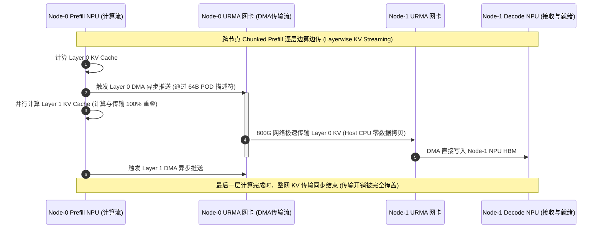
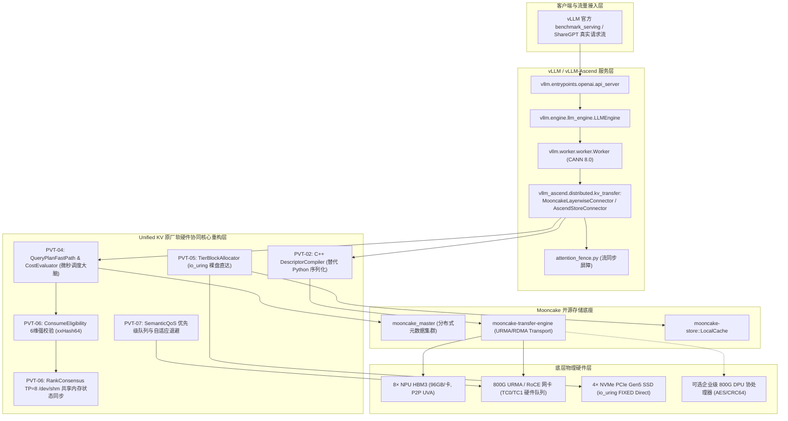

# 统一异构 KVCache 存储池 关键技术原型验证总体实施方案设计
## —— 基于开源生态底座深度重构与架构增强的高性能原厂扩展版实施总纲

> **文档版本**：V4.5 (面向一线开发人员与架构评审落地指导版)  
> **战略基线**：基于开源生态底座（Mooncake 与 vLLM）深度重构与架构增强，注入原厂软硬件协同核心创新内核，突破开源既有框架边界，演进为面向国产 AI 硬件生态的 **Mooncake 高性能原厂扩展版 (Unified KV)**  
> **开源基线版本与代码仓库**：  
> - **Mooncake**：[`https://github.com/kvcache-ai/Mooncake.git`](https://github.com/kvcache-ai/Mooncake.git) (Commit: `f90ae691f109e49a60920e0c8abbf7e572826d8c`，涵盖 `mooncake-transfer-engine`, `mooncake-store`, `mooncake-integration`, `mooncake-common`)  
> - **vLLM**：[`https://github.com/vllm-project/vllm.git`](https://github.com/vllm-project/vllm.git) (Commit: `842dd8fd96650063e1ad32e6075742d457d39773`，涵盖 V1 调度引擎与 KV Connector 体系)  
> - **vLLM-Ascend**：[`https://github.com/vllm-project/vllm-ascend.git`](https://github.com/vllm-project/vllm-ascend.git) (Commit: `424e27e1fd2b1c6e0d7fe659b489b87c1223a33c`，涵盖 `mooncake_layerwise_connector`, `ascend_store_connector`)  
> **需求基线**：  
> - 交付基线：《统一异构KVCache存储池_关键技术原型验证清单_V1.6_V2.3.1需求树与竞争力对齐完善版.xlsx》  
> - 分解基线：《统一异构KVCache存储池_全量需求树_V2.3.1_SR项目贡献补充版.xlsx》  
> - 规范基线：《KVCache SRS需求列表 V2.2_传输底座视角_建议修订版.xlsx》  
> - 总体导读：《统一异构KVCache存储池总体架构与SRS评审导读_V2.3.1评审稿.md》  

---

## 1. 原型验证工程化刷新原则与标准范式

统一异构 KVCache 存储池原型验证体系（包含 **PVT-00 ~ PVT-09 必做验证包** 与 **CVT-01 可行性证伪项**，共 11 项）是系统设计落地前**摸清底层技术边界、获取第一手实测性能数据、保障后续系统顺利落地**的关键工作。

根据立项评审意见与最新技术路线，本项目充分借用 Mooncake 的成熟接口外壳与集群接入生态，在内部深度注入原厂软硬件协同核心观点；随着原厂传输底座、微秒调度大脑、SSD 直达容量主路径、6 维语义一致性校验、多卡原子共识、DPU 硬件安全双轨与组播分发体系的全面重构，系统演进为面向国产 AI 硬件生态的 **Mooncake 高性能原厂扩展版 (Unified KV)**。

### 1.1 穿刺优先级分级原则 (P0 / P1 / P2)
为确保研发兵力压强集中，对 11 项验证任务实施三级穿刺优先级管理：
- **🔴 P0 级（核心决胜项，5 项）**：直面开源代码的核心瓶颈与痛点，必须拿出超越开源基线的代际性能证据（PVT-02 描述符编译、PVT-04 微秒 MLA 决策、PVT-05 裸盘直达、PVT-06 多卡状态同步、PVT-07 混压总门禁）；
- **🟡 P1 级（底座支撑项，4 项）**：筑牢传输底座、零拷贝边界、安全容错与企业级硬件安全卸载（PVT-00 收益上限、PVT-01 零拷贝底座、PVT-03 远端直读边界、PVT-09 DPU 硬件安全双轨）；
- **🟢 P2 级（拓展证伪项，2 项）**：验证高效分发拓扑与架构简化机制，避免外部强依赖（PVT-08 1-to-N 组播分发、CVT-01 软件 RCU 机制）。

### 1.2 九大标准化工程模块
每个 PVT（原型验证，Prototype Verification Test）与 CVT（可行性证伪，Conditional Falsification Test）验证项均严格遵循以下 9 大工程化模块：

```
┌─────────────────────────────────────────────────────────────────────────┐
│ 1. 验证目标与交付结论定义 (待验证核心命题、交付物清单与判定标准)       │
├─────────────────────────────────────────────────────────────────────────┤
│ 2. 基础/对照 Micro-Benchmark 构建方法 (底层驱动、SDK 依赖与基准搭建)   │
├─────────────────────────────────────────────────────────────────────────┤
│ 3. 业务 Benchmark 构造与流量特征编排 (请求构造、前缀重合度、时序时钟)   │
├─────────────────────────────────────────────────────────────────────────┤
│ 4. 软硬件环境与打点插桩方案 (环境拓扑、隔离策略、行级 C/C++ 打点位置)   │
├─────────────────────────────────────────────────────────────────────────┤
│ 5. 分步执行测试操作规程 (Step 1 ~ Step 12 详细动作、命令与容错处置)     │
├─────────────────────────────────────────────────────────────────────────┤
│ 6. 数据采集清单与记录格式 (原始数据表头、采样字段、CSV文件格式)          │
├─────────────────────────────────────────────────────────────────────────┤
│ 7. 数据交叉组合与运算推导逻辑 (原始数据如何组合推导预期收益、交叉比对) │
├─────────────────────────────────────────────────────────────────────────┤
│ 8. 多维扩展与扫参矩阵 (复用率 30%~98%、长上下文 8K~256K、多模型架构)     │
├─────────────────────────────────────────────────────────────────────────┤
│ 9. Go / Conditional / No-Go 判定规则与交付报告模板 (阈值公式与报告输出) │
└─────────────────────────────────────────────────────────────────────────┘
```

---

## 2. 10 个 PVT + 1 个 CVT 全量任务全景图（Mooncake 扩展版定位）

```
┌──────┬────────┬─────────────────────────────────────────────────┬──────────┬────────────────────────────────────────────────────────┐
│ 等级 │ 验证ID │ 验证项标准功能名称                              │ 建议周期 │ 针对开源代码的核心重构命题与验证目标                   │
├──────┼────────┼─────────────────────────────────────────────────┼──────────┼────────────────────────────────────────────────────────┤
│      │ PVT-02 │ 异构框架 Layout 描述符编译器与跨节点异步流水    │ 8 人日   │ 对标 vLLM-Ascend Python-ZMQ 连接器，C++ 描述符开销-40% │
│  🔴  │ PVT-04 │ 微秒级动态决策引擎与 CostEvaluator 成本模型     │ 6 人日   │ 覆盖 DeepSeek MLA (512B) 与 Qwen MHA，负收益率严格<1%  │
│  P0  │ PVT-05 │ HBM-SSD 直达容量主路径与分层存储扩容            │ 6 人日   │ 对标 Mooncake SSD Offload，裸盘 io_uring 直达吞吐提升50%│
│ 核心 │ PVT-06 │ 多维度语义一致性强校验与 TP=8 多卡状态同步      │ 6 人日   │ 6维 xxHash64 杜绝脏读，POSIX 共享内存多卡同步 P99<100µs│
│ 决胜 │ PVT-07 │ 前后台混压全链路端到端总门禁与 SemanticQoS      │ 8 人日   │ 三重消融总门禁：TTFT降幅≥20%，QPS提升≥10%，前台干扰<3%  │
├──────┼────────┼─────────────────────────────────────────────────┼──────────┼────────────────────────────────────────────────────────┤
│      │ PVT-00 │ 业务流量 Saved-Prefill 收益上限与加速边界评估   │ 5 人日   │ 测定 MLA/MHA 在 30%~98% 复用率下的 Saved-Prefill 净收益 │
│  🟡  │ PVT-01 │ Host CPU 零数据拷贝传输底座与硬件能力矩阵       │ 6 人日   │ 打通 CANN P2P Pinning，eBPF 探针确立 CPU 零数据拷贝基线│
│  P1  │ PVT-03 │ 远端直读 vs 显存拷贝适用边界与 ViewGuard 容错   │ 5 人日   │ 实测证伪 Decode 活跃 KV 直读；ViewGuard 实现 SIGBUS 恢复│
│ 底座 │ PVT-09 │ DPU 硬件安全与算力卸载加速 vs Raw Direct 双轨验证│ 5 人日   │ 测定 DPU 线速 AES/CRC 卸载增益；验证 500µs 降级无缝回退 │
├──────┼────────┼─────────────────────────────────────────────────┼──────────┼────────────────────────────────────────────────────────┤
│  🟢  │ PVT-08 │ 1-to-N 组播式 KV 分发：硬件多播 vs 软件分层中继 │ 4 人日   │ 覆盖热点提示词广播、Multi-Agent 与 1P-to-ND 组播效能   │
│  P2  │ CVT-01 │ 显存整理软件 RCU 机制 vs 硬件 AtomicRemap 验证  │ 3 人日   │ 证明软件 RCU 停顿<1ms，免除专用硬件 AtomicRemap 芯片依赖│
└──────┴────────┴─────────────────────────────────────────────────┴──────────┴────────────────────────────────────────────────────────┘
```

---

## 3. 核心架构设计与工程机制

### 3.1 DPU 硬件安全加速与 Raw Direct 软硬双轨协同体系 (PVT-09)
针对企业级生产客户对网络传输安全（AES-256-GCM / 国密 SM4）、数据完整性校验（CRC64 / T10-DIF）以及未来高阶 **Fly-in-line 流式在途数据处理（量化/反量化、压缩/解压缩、CRC校验）** 的诉求，系统确立软硬双轨协同架构：
1. **公有云/可信 VPC 路径 (Raw Direct 纯软 + NPU 协同主路径)**：
   - 依托 NPU HBM ↔ RoCE/URMA DMA 直达，Host CPU 仅负责 64B 描述符提交，Payload 零拷贝，TCO 极优；
   - **流式量化/压缩替代手段**：严格杜绝由 Host CPU 承担全量数据转换，采用 **NPU 算子融合 (Fused Dequant-Attention Kernel)** 与 **结构化稀疏路由 (Sparse KV Routing)**，结合 Layerwise 边算边传隐藏转换开销。
2. **企业级高安全专线路径 (DPU 硬件加速路径)**：
   - 由 DPU 协处理器在硬件线速（800Gbps）下内联流水线级执行 AES 加解密、硬件 INT4 $\leftrightarrow$ FP16 反量化、硬件 Codec 与 CRC64 校验；
   - 全程严格绕过 Host CPU 与 DDR5，NPU 算力与内存带宽开销严格为 0。
3. **高可用无缝回退**：若 DPU 发生控制超时或驱动异常，系统在 $< 1\text{ms}$ 内自动回退至 Raw Direct 裸机直达路径，保障推理业务连续不中断。
*(注：Fly-in-line 量化与压缩作为重要场景扩展在架构设计中提前布局，本次提前验证重点穿刺基础传输与降级闭环，不强制要求输出全部衍生量化实测数据)*。

### 3.2 1-to-N 组播式 KV 分发的三大业务场景 (PVT-08)
1. **热点系统提示词广播 (Hot System Prompt Broadcast)**：超长通用 System Prompt (32K~64K) 更新时，向 16~64 个 Decode 节点瞬间分发；
2. **Multi-Agent 协同共享上下文分发 (Multi-Agent Shared Context Fanout)**：主调度 Agent 生成庞大环境状态 (100K tokens)，并行广播给 8 个工作子 Agent；
3. **PD 分离架构下的 1P-to-ND 分叉 (1-Prefill to Multi-Decode)**：针对 Best-of-N 或推测验证，单个 Prefill 实例生成的 KV 并行推送给多个 Decode 副本。

### 3.3 多模型架构（MLA vs MHA）双轨参数网格
在 PVT-00、PVT-02、PVT-04 与 PVT-07 中全面固化多模型参数覆盖：

```
┌──────────────────────┬────────────────────────┬────────────────────────┬────────────────────────────────────────────┐
│ 模型架构类别         │ 代表模型               │ 单 Token KV 显存占用   │ 核心测试关注点与成本交叉函数               │
├──────────────────────┼────────────────────────┼────────────────────────┼────────────────────────────────────────────┤
│ **MLA 潜在注意力**   │ DeepSeek-V3 / R1 (FP8) │ **512 字节 / token**   │ 通信量暴降 600 倍，重点考核微秒调度决策     │
│ **MHA 多头注意力**   │ Qwen2.5-72B (FP16)     │ **320 KB / token**     │ 通信数据量大，重点考核 800G 网络带宽利用率 │
│ **GQA 分组查询注意** │ LLaMA-3-70B (FP16)     │ **80 KB / token**      │ 介于两者之间，考核描述符批量合并与分层流水 │
└──────────────────────┴────────────────────────┴────────────────────────┴────────────────────────────────────────────┘
```

### 3.4 跨节点分布式物理拓扑与逐层流式传输 (Layerwise KV Streaming)
在 2 节点分布式物理环境下（Node-0 Prefill 实例，Node-1 Decode 实例，800G URMA/RDMA 直连），全面穿刺跨节点分块预计算 *(Chunked Prefill)* 与逐层边算边传时序：



---

## 4. 开源软件基线集成架构、代码插桩与调用拓扑

本项目**以 vLLM、vLLM-Ascend 与 Mooncake 开源生态为坚实底座**，其真实代码调用关系与原厂软硬件协同重构插桩点如下拓扑所示：



### 4.1 开源模块代码修改与插桩映射表
1. **`vllm/vllm/worker/worker.py`**：
   - 插入行级微秒探针 `clock_gettime(CLOCK_MONOTONIC)`，在 `Worker.step()` 起止处打点记录 `T_prefill_start`, `T_prefill_end`, `T_first_token`；
   - 挂接 `SemanticQoS` 事件回调 `on_foreground_step_begin()` 与 `on_foreground_step_end()`。
2. **`vllm_ascend/distributed/kv_transfer/kv_p2p/mooncake_layerwise_connector.py`**：
   - 将原 Python 字典构造替换为 C++ `DescriptorCompiler` 生成 64B POD 紧凑结构体；
   - 接入跨节点逐层边算边传异步 DAG 流水。
3. **`Mooncake/mooncake-transfer-engine/`**：
   - 在 `TransportEngine` 中打通 `TransportType::URMA` 与 `TransportType::UBMEM` 零拷贝直达通道；
   - 在 `mooncake-store/` 中接入 `TierBlockAllocator`，实现 Linux 6.6+ `io_uring` FIXED I/O 裸盘直达，替代原生文件系统 offload。
4. **`Mooncake/mooncake-store/`**：
   - 在对象查询前置增加 `ConsumeEligibility` 6 维语义校验（模型/词表/模板/LoRA/租约/Ready），杜绝错误消费。

---

## 5. 开源基线端到端物理集群部署、在线打流与 Benchmark 压测标准 SOP

全量穿刺实验均基于开源部署与在线打流套件（存放在 `./原型验证代码/deploy_and_bench_e2e/`）标准执行：

### Step 1：启动 Mooncake 元数据 Master 服务
```bash
# 启动 Mooncake 分布式 Master (端口 10001)
nohup mooncake_master --port 10001 > ./logs/master.log 2>&1 &
```

### Step 2：部署 Prefill 与 Decode 实例（配置 KV Connector）
```bash
# Node-0 启动 Prefill 实例 (kv_role: kv_producer)
export MOONCAKE_CONFIG_PATH="./mooncake.config"
export VLLM_WORKER_MULTIPROC_METHOD=spawn
export VLLM_ASCEND_ENABLE_LAYERWISE=1

python3 -m vllm.entrypoints.openai.api_server \
    --model Qwen/Qwen2.5-72B-Instruct \
    --port 8100 \
    --tensor-parallel-size 8 \
    --max-model-len 32768 \
    --gpu-memory-utilization 0.85 \
    --kv-transfer-config '{"kv_connector":"MooncakeLayerwiseConnector","kv_role":"kv_producer"}' \
    > ./logs/prefill.log 2>&1 &

# Node-1 启动 Decode 实例 (kv_role: kv_consumer)
python3 -m vllm.entrypoints.openai.api_server \
    --model Qwen/Qwen2.5-72B-Instruct \
    --port 8200 \
    --tensor-parallel-size 8 \
    --max-model-len 32768 \
    --gpu-memory-utilization 0.85 \
    --kv-transfer-config '{"kv_connector":"MooncakeLayerwiseConnector","kv_role":"kv_consumer"}' \
    > ./logs/decode.log 2>&1 &
```

### Step 3：启动 PD 分离调度代理 (Proxy Demo)
```bash
python3 -m mooncake_integration.proxy_demo \
    --prefill-ports 8100 \
    --decode-ports 8200 \
    --proxy-port 8000 \
    > ./logs/proxy.log 2>&1 &
```

### Step 4：使用 vLLM benchmark_serving 发起在线打流压测
```bash
# 采用 ShareGPT 真实数据集，以 10~50 req/s 并发打流
python3 -m vllm.benchmarks.benchmark_serving \
    --backend vllm \
    --model Qwen/Qwen2.5-72B-Instruct \
    --dataset-name sharegpt \
    --dataset-path ./ShareGPT_V3_unfiltered_cleaned_split.json \
    --num-prompts 500 \
    --request-rate 20 \
    --port 8000 \
    --save-result \
    --result-filename ./results/bench_sharegpt_rate_20.json
```

### Step 5：自动解析指标并产出三重消融对账表
```bash
python3 ./parse_benchmark_metrics.py --results-dir ./results --output ./results/e2e_summary.csv
```

---

## 6. 实验硬件环境与公共 Harness 拓扑

验证集中在 **2 节点（Node-0, Node-1）** 标准硬件环境上执行：
- **算力与显存**：每节点 8× NPU（单卡 96GB HBM3 高带宽显存），单机显存总计 768GB；支持 CANN 驱动与 P2P 显存锁定；
- **网络互联**：800G URMA（通用远程直接内存访问）/ RDMA 双端口网卡，支持 UBMEM 共享内存协议，驱动库为 `/usr/lib64/liburma.so` 与 `/usr/lib64/libubmem.so`；
- **存储介质**：每节点 4× NVMe PCIe Gen5 SSD 阵列（顺序读标称 28GB/s），挂载支持 `io_uring` + `O_DIRECT`；
- **安全与协处理**：可选配置企业级 800G DPU 智能网卡（集成硬件 AES-256-GCM / SM4 加密与 CRC64 校验引擎）；
- **宿主算力**：64 Cores Host CPU, 512GB DDR5（仅供控制面、元数据与 Telemetry 线程使用，不参与正文 Payload 搬运）。

---

## 7. 原型验证代码库与工程构建规范全量索引

所有验证项的可运行源码、Makefile、开源集群部署与测试脚本存放在 `./原型验证代码/` 目录下：

```
原型验证代码/
├── deploy_and_bench_e2e/           # 开源基线集群一键部署与在线打流压测全套套件
│   ├── deploy_cluster.sh          # 启动 mooncake_master + vLLM Prefill/Decode 实例 + 代理
│   ├── run_online_benchmark.sh    # 驱动 vLLM 官方 benchmark_serving 发送在线多并发流量
│   ├── parse_benchmark_metrics.py # 自动清洗 JSON 结果并输出 TTFT/TPOT/QPS 汇总表格
│   └── mooncake.config            # 标准 Mooncake 集群配置文件
├── PVT-00/
│   ├── proto_bench.cc              # URMA 与 UBMEM 底层通信协议微基准压测工具
│   ├── Makefile                   # 编译 proto_bench 的工程构建文件 (make -j16)
│   ├── make_workload.py           # 构造覆盖 MLA (512B) 与 MHA (320KB) 的受控测试数据集生成脚本
│   └── traffic_generator.py       # 受控发包与 TTFT/首 Token 时延采集驱动脚本
├── PVT-01/
│   ├── raw_trans_bench.cc         # URMA/UBMEM/io_uring Direct 零拷贝 vs CPU memcpy 压测工具
│   ├── Makefile                   # 编译 raw_trans_bench 的工程构建文件
│   ├── host_touch_monitor.py      # 基于 Linux eBPF CPU 零数据拷贝监控脚本
│   └── export_capability_matrix.py# 自动解析实测吞吐并导出 capability_matrix.json 的工具脚本
├── PVT-02/
│   ├── descriptor_compiler.h      # 64B POD 连续物理块贪心合并与 Scatter-Gather 描述符编译器头文件
│   ├── descriptor_compiler.cc     # 描述符贪心合并与硬件描述符生成的 C++ 核心算法实现
│   ├── async_dag_bench.cc         # 跨节点 Layerwise 边算边传异步 DAG 重叠流水压测工具
│   ├── Makefile                   # 编译 async_dag_bench 的工程构建文件
│   └── make_manifests.py          # 生成不同碎片离散度 (10%~100%) Block Table Manifest 脚本
├── PVT-03/
│   ├── view_vs_copy_bench.cc      # 测量不同重读次数下 Direct-View 与 Copy-to-HBM 耗时的压测工具
│   ├── view_guard.h               # ViewGuard 租约管理与 SIGBUS 异常恢复头文件
│   ├── view_guard.cc              # ViewGuard 租约校验与 siglongjmp 安全回滚实现
│   ├── Makefile                   # 编译 view_vs_copy_bench 的工程构建文件
│   └── benchmark_serving_view.py  # 在推理服务中测试并证伪 Decode 阶段 View 模式的压测脚本
├── PVT-04/
│   ├── query_plan_fastpath.h      # 微秒级动态决策引擎与 MLA/MHA CostEvaluator 成本预估头文件
│   ├── query_plan_fastpath.cc     # 实时链路感知、5 维成本预估与微秒级剪枝决策算法实现
│   ├── query_plan_bench.cc        # 决策引擎 100K QPS 吞吐压测与反事实决策对账 Harness
│   └── Makefile                   # 编译 query_plan_bench 的工程构建文件
├── PVT-05/
│   ├── tier_storage_bench.cc      # NVMe SSD io_uring Direct I/O 与 Mooncake 文件级 Offload 对比工具
│   ├── Makefile                   # 编译 tier_storage_bench 的工程构建文件
│   └── benchmark_tiering.py       # 150%~200% HBM 显存超载下分层扩容与 OOM 统计驱动脚本
├── PVT-06/
│   ├── consume_eligibility.h      # 6 维语义强校验 (xxHash64) 与部分前缀拼接计划头文件
│   ├── consume_eligibility.cc     # 模型/Tokenizer/模板/LoRA/Ready/Lease 6 维匹配算法实现
│   ├── rank_consensus_bench.cc    # TP=8 多卡 POSIX 共享内存状态同步耗时测量与协同 Fallback 工具
│   ├── Makefile                   # 编译 rank_consensus_bench 的工程构建文件
│   └── test_correctness.py        # 注入 8 类语义冲突与验证输出 Token 100% 正确性的测试脚本
├── PVT-07/
│   ├── mixed_workload_bench.py    # 前台在线 Decode 流与后台高吞吐 I/O 混压驱动脚本
│   ├── semantic_qos_controller.py # 前台高优先级保证 (RoCE TC0) 与后台微秒级自适应退避流控器
│   └── run_mixed_bench.py         # 自动化执行三重消融最小闭环并计算 TPOT 干扰率与 TTFT 降幅脚本
├── PVT-08/ (原 CVT-01)
│   ├── multicast_fanout_bench.cc  # 1-to-N 单播 vs 软件 Staging 树状分层组播 vs 硬件多播对比压测工具
│   ├── Makefile                   # 编译 multicast_fanout_bench 的工程构建文件
│   └── test_fanout_scenarios.py   # 模拟系统提示词广播、Multi-Agent 与 1P-to-ND 场景测试脚本
├── PVT-09/ (原 CVT-03)
│   ├── offload_fallback_bench.cc  # DPU 硬件 AES/CRC 卸载 vs CPU 软算吞吐及 500µs 无缝降级测试工具
│   ├── Makefile                   # 编译 offload_fallback_bench 的工程构建文件
│   └── inject_dpu_fault.py        # DPU 控制通道断连与超时故障注入脚本
└── CVT-01/ (原 CVT-02)
    ├── rcu_migration_bench.cc     # 32 并发 Reader 下锁表 vs 软件 RCU 迁移停顿与 Jitter 对比工具
    └── Makefile                   # 编译 rcu_migration_bench 的工程构建文件
```
