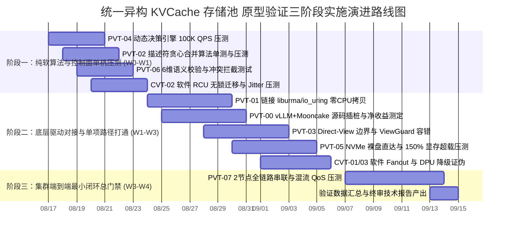

# 统一异构 KVCache 存储池 关键技术原型验证总体实施方案设计

> **文档版本**：V2.2 (面向一线开发人员指导版)  
> **基线对齐**：  
> - 交付基线：《统一异构KVCache存储池_关键技术原型验证清单_V1.6_V2.3.1需求树与竞争力对齐完善版.xlsx》  
> - 分解基线：《统一异构KVCache存储池_全量需求树_V2.3.1_SR项目贡献补充版.xlsx》  
> - 规范基线：《KVCache SRS需求列表 V2.2_传输底座视角_建议修订版.xlsx》  
> - 总体导读：《统一异构KVCache存储池总体架构与SRS评审导读_V2.3.1评审稿.md》  
> - 研发反馈基线：《统一异构KVCache存储池_提前验证方案可实施性评估报告.md》  

---

## 1. 原型验证工程化刷新原则与标准范式

统一异构 KVCache 存储池原型验证体系（包含 PVT-00 ~ PVT-07 核心验证包与 CVT-01 ~ CVT-03 可行性证伪项）是系统设计落地前**摸清技术边界、获取第一手实测性能数据、保障后续系统顺利落地**的关键工作。

本套方案旨在为一线开发人员提供一套清晰、务实、可落地的技术指导手册，明确底层驱动接口、测试数据集构造、行级打点位置与量化判定标准，**全面对齐研发评估报告反馈，系统性闭环 4 大维度 18 项工程约束**。

### 1.1 九大标准化工程模块
每个 PVT（原型验证，Prototype Verification Test）与 CVT（可行性证伪，Conditional Falsification Test）验证项均严格遵循以下 9 大工程化模块，开发人员无需全面了解整个系统的顶层全景图，即可按步骤独立完成测试并输出量化结论：

```
┌─────────────────────────────────────────────────────────────────────────┐
│ 1. 验证目标与交付结论定义 (待验证核心命题、交付物清单与判定标准)       │
├─────────────────────────────────────────────────────────────────────────┤
│ 2. 基础/对照 Micro-Benchmark 构建方法 (底层驱动、SDK 依赖与基准搭建)   │
├─────────────────────────────────────────────────────────────────────────┤
│ 3. 业务 Benchmark 构造与流量特征编排 (请求构造、前缀重合度、时序时钟)   │
├─────────────────────────────────────────────────────────────────────────┤
│ 4. 软硬件环境与打点插桩方案 (环境拓扑、隔离策略、行级 C/C++ 打点位置)   │
├─────────────────────────────────────────────────────────────────────────┤
│ 5. 分步执行测试操作规程 (Step 1 ~ Step 12 详细动作、命令与容错处置)     │
├─────────────────────────────────────────────────────────────────────────┤
│ 6. 数据采集清单与记录格式 (原始数据表头、采样字段、CSV文件格式)          │
├─────────────────────────────────────────────────────────────────────────┤
│ 7. 数据交叉组合与运算推导逻辑 (原始数据如何组合推导预期收益、交叉比对) │
├─────────────────────────────────────────────────────────────────────────┤
│ 8. 多维扩展与扫参矩阵 (复用率 30%~98%、长上下文 8K~256K、多模型架构)     │
├─────────────────────────────────────────────────────────────────────────┤
│ 9. Go / Conditional / No-Go 判定规则与交付报告模板 (阈值公式与报告输出) │
└─────────────────────────────────────────────────────────────────────────┘
```

### 1.2 研发落地工程化对齐与 4 大维度 18 项约束总则

根据核心研发团队的评估反馈，本方案在全套 12 份文档中统一确立并落地以下 **4 大维度、18 项核心技术对齐标准**：

```
┌──────────────────────────────────────────────────────────────────────────────────────────────────┐
│                            研发反馈 18 项核心对齐标准与落地规范全景图                            │
├─────────────────────┬────────────────────────────────────────────────────────────────────────────┤
│ 维度一：硬件与底层  │ 1. URMA/UBMEM: 统一包含 <urma.h>, <ubmem.h>，链接 -lurma -lubmem -lpthread │
│ 驱动 API 标准化     │ 2. NPU P2P Pinning: CANN aclrtMalloc(..., ACL_MEM_MALLOC_HUGE_FIRST_P2P)   │
│                     │ 3. NVMe Direct: 主路径采用 Linux 6.6+ io_uring FIXED I/O + O_DIRECT 绕过 DDR│
├─────────────────────┼────────────────────────────────────────────────────────────────────────────┤
│ 维度二：数据结构与  │ 4. ExtentManifest: 64B POD 头 + 共享内存 (/dev/shm) 零拷贝传递, 零 Protobuf│
│ 协议格式标准化      │ 5. 6维语义 Tag: 统一采用 xxHash64 (XXH64) 算法，模型命名小写下划线正则化  │
│                     │ 6. Telemetry 遥测: 后台 100Hz EWMA 守护线程采集，原子结构加 alignas(64) 隔离│
│                     │ 7. QoS 队列: 网络层映射 RoCE TC0(CoS 3 无丢包)/TC1(CoS 0)，应用层自适应退避│
├─────────────────────┼────────────────────────────────────────────────────────────────────────────┤
│ 维度三：异常处理与  │ 8. Direct-View SIGBUS: 信号捕获 + aclrtStreamAbort + siglongjmp 恢复重算   │
│ 容错状态机闭环      │ 9. TP=8 共识分歧: Bitmap 共享内存预判，分歧时 8 卡全部分支进入 Recompute   │
│                     │ 10. RCU Grace Period: Host 侧 Epoch 计数 + NPU Stream 事件屏障双重确认     │
│                     │ 11. DPU 熔断: 硬件看门狗 500us 超时熔断降级至 Raw Direct，异步上报告警     │
├─────────────────────┼────────────────────────────────────────────────────────────────────────────┤
│ 维度四：测试基线、  │ 12. 模型权重: Qwen2.5-72B (FP16, 320KB/tok) 与 DeepSeek-V3 (FP8 MLA, 512B)│
│ 分支与环境标准      │ 13. vLLM/Mooncake: 锁定 vLLM v0.6.3+ 与 Mooncake v0.2.0-rc1，行级时钟打点 │
│                     │ 14. 硬件多播: 支持交换机 RDMA 多播与软件 Staging 树状分层双轨制验证与证伪  │
└─────────────────────┴────────────────────────────────────────────────────────────────────────────┘
```

---

## 2. 8 个 PVT + 3 个 CVT 全量任务全景图

| 验证 ID | 验证包名称 | 验证核心命题 | 对应验证阶段 (E0~E3) | 关联核心文档 |
|---|---|---|---|---|
| **PVT-00** | 业务流量 Saved-Prefill 收益上限评估 | 30%~98% 复用率下 TTFT（首字生成延迟）净收益与 UBMEM（统一总线内存直通协议）加速实测 | **E0 业务收益前提确认** | [01_PVT-00.md](./01_PVT-00_业务流量Saved-Prefill收益上限评估实施方案设计.md) |
| **PVT-01** | Host CPU 零数据拷贝传输底座与硬件能力矩阵 | UBMEM/URMA 及 SSD 直达中 Host CPU 零数据拷贝（CPU 仅负责下发控制指令，不参与正文搬运），有效线速 $\ge 80\%$ | **E1 核心数据路径打通** | [02_PVT-01.md](./02_PVT-01_零HostTouch极速传输底座与CapabilityMatrix验证实施方案设计.md) |
| **PVT-02** | 异构框架 Layout 编译器与异步 DAG 流水 | 描述符提交开销下降 $\ge 40\%$，NPU 计算流与 DMA 传输流重叠率 $\ge 60\%$ | **E1 核心数据路径打通** | [03_PVT-02.md](./03_PVT-02_异构框架Layout描述符编译器与异步DAG流水验证实施方案设计.md) |
| **PVT-03** | Direct-View 与 Copy-to-HBM 边界及 ViewGuard | 实测 Crossover 临界点；**证伪“Decode 活跃 KV 适合 Direct-View”**；ViewGuard 租约隔离 0 崩溃 | **E1/E2 路径选择与安全隔离** | [04_PVT-03.md](./04_PVT-03_DirectView与Copy-to-HBM适用边界与ViewGuard验证实施方案设计.md) |
| **PVT-04** | QueryPlan 微秒级动态决策与 CostEvaluator | 决策耗时 $P99 < 5\mu s$，准确率 $\ge 90\%$，负收益发生率严格 $< 1\%$ | **E2 动态调度决策准确性** | [05_PVT-04.md](./05_PVT-04_QueryPlan微秒级动态决策引擎与CostEvaluator验证实施方案设计.md) |
| **PVT-05** | HBM-SSD 直达容量主路径与 DDR 条件角色 | 150% 超载下服务容量提升 $\ge 30\%$，OOM 下降 $\ge 50\%$，数据直接进显存绕过 DDR | **E2/E3 分层存储扩容收益** | [06_PVT-05.md](./06_PVT-05_HBM-SSD直达容量主路径与DDR条件角色Tiering验证实施方案设计.md) |
| **PVT-06** | ConsumeEligibility 与 RankConsensus 多卡同步 | 8 类冲突下 0 错误消费、0 越界；张量并行 ($TP=8$) 多卡状态同步耗时 $P99 < 100\mu s$ | **E1 多卡状态同步与消费正确性** | [07_PVT-06.md](./07_PVT-06_ConsumeEligibility与RankConsensus0错误消费验证实施方案设计.md) |
| **PVT-07** | 前后台混压最小闭环与 SemanticQoS 服务质量 | 全链路 P99 TTFT 降低 $\ge 20\%$，QPS 提升 $\ge 10\%$，前台 TPOT（单字生成延迟）干扰 $< 3\%$ | **E3 全链路前后台混压总门禁** | [08_PVT-07.md](./08_PVT-07_前后台混压端到端薄闭环与SemanticQoS干扰包络验证实施方案设计.md) |
| **CVT-01** | 热点前缀 1-N 硬件多播与 Staging Fanout 对比 | **证伪硬件多播必需性**；$N \le 8$ 规模下软件分层转发 (Staging Fanout) 时延差距 $< 10\%$ | **条件证伪阶段 (架构简化)** | [09_CVT-01.md](./09_CVT-01_热点前缀1-N硬件多播与StagingFanout对比证伪实施方案设计.md) |
| **CVT-02** | PageMigration 软件 RCU 与硬件 AtomicRemap | **证伪硬件 Remap 必需性**；软件 RCU（读-拷贝-更新）迁移停顿 $< 1\text{ms}$，TPOT 抖动 $< 5\%$ | **条件证伪阶段 (架构简化)** | [10_CVT-02.md](./10_CVT-02_PageMigration软件RCU与硬件AtomicRemap必要性证伪实施方案设计.md) |
| **CVT-03** | DPU-Codec 卸载与 RawDirect 无缝降级 | **证伪 DPU/专用压缩硬件必需性**；Raw Direct 原始直达主路径独立成立，DPU 故障 $< 1\text{ms}$ 降级 | **条件证伪阶段 (架构简化)** | [11_CVT-03.md](./11_CVT-03_DPU-Codec-CQ卸载必要性与RawDirect无缝Fallback证伪实施方案设计.md) |

---

## 3. 实验硬件环境与公共 Harness 拓扑

验证集中在 **2 节点（Node-0, Node-1）** 标准硬件环境上执行：
- **算力与显存**：每节点 8× NPU（单卡 96GB HBM3 高带宽显存），单机显存总计 768GB；支持 CANN 驱动与 P2P 显存锁定；
- **网络互联**：800G URMA（通用远程直接内存访问）/ RDMA 双端口网卡，支持 UBMEM 共享内存协议，驱动库为 `/usr/lib64/liburma.so` 与 `/usr/lib64/libubmem.so`；
- **存储介质**：每节点 4× NVMe PCIe Gen5 SSD 阵列（顺序读标称 28GB/s），挂载支持 `io_uring` + `O_DIRECT`；
- **宿主算力**：64 Cores Host CPU, 512GB DDR5（仅供控制面、元数据与 Telemetry 线程使用，不参与正文 Payload 搬运）。

---

## 4. 软件研发实施演进路线图（三阶段递进规划）

测试验证总历时建议为 **4~5 周**，划分为 3 个递进阶段：



### 阶段一：纯软算法与控制面单机压测（第 1 周，无需真实物理集群）
- **目标**：在标准 Linux 开发机上完成纯软逻辑验证，确保算法无 Bug、吞吐与时延满足微秒级指标。
- **核心任务**：
  1. 编译并运行 `PVT-04`，验证 `QueryPlanFastPath` 在 100K QPS 下决策耗时 $P99 < 5\mu s$ 及负收益拦截率；
  2. 编译并运行 `PVT-02`，验证 `DescriptorCompiler` 连续块贪心合并压缩率 $\ge 50\%$；
  3. 编译并运行 `PVT-06`，针对 8 大语义冲突注入运行单测，验证 100% 拦截率；
  4. 编译并运行 `CVT-02`，在 32 线程高并发 Reader 下验证软件 RCU 停顿 $< 1\text{ms}$。

### 阶段二：底层驱动对接与单项路径实测（第 2~3 周，2 节点环境）
- **目标**：链接第一方硬件 SDK 与驱动库（`liburma.so`, `libubmem.so`, Linux 6.6+ `io_uring`），替换单机 Mock 代码，获取真实的物理硬件基准数据。
- **核心任务**：
  1. 对接 `liburma`/`libubmem`，在 `PVT-01` 中实测 800G 线速达成率与 eBPF 监控 Host CPU 零数据拷贝；
  2. 在 vLLM + Mooncake 源码中植入微秒打点，执行 `PVT-00` 测量 Saved-Prefill 净收益；
  3. 接入 `io_uring` Direct I/O，在 `PVT-05` 中运行 150% 显存超载压测，证明容量提升 $\ge 30\%$；
  4. 执行 `PVT-03`，测定 Direct-View（远端直读）与 Copy-to-HBM（拷贝到显存）的 Crossover 临界点，证伪 Decode 阶段 View 模式；
  5. 执行 `CVT-01` 与 `CVT-03`，完成条件证伪项证据采集。

### 阶段三：集群端到端最小闭环总门禁（第 4~5 周，系统级验收）
- **目标**：串联全链路流程，执行前后台混压，产出立项终审交付件。
- **核心任务**：
  1. 部署 2 节点真实推理集群，全链路串联 `Prefix Lookup -> QueryPlan -> Descriptor -> UBMEM Transfer -> Attach`；
  2. 执行 `PVT-07`，在前台 32 并发在线流与后台 400G 满载 I/O 下，验证 P99 TTFT 降低 $\ge 20\%$、QPS 提升 $\ge 10\%$ 且 TPOT 干扰率 $< 3\%$；
  3. 汇总全部 11 份标准交付 Markdown 报告与原始 CSV 数据表，形成完整技术验证报告包。

---

## 5. 原型验证代码库与工程构建规范全量索引

所有验证项的可运行源码、Makefile 与测试脚本存放在 `./原型验证代码/` 目录下，构建与运行遵循标准工业级 C++17 规范：

```
原型验证代码/
├── PVT-00/
│   ├── proto_bench.cc              # URMA 与 UBMEM 底层通信协议微基准压测工具 (链接 -lurma -lubmem)
│   ├── Makefile                   # 编译 proto_bench 的工程构建文件 (make -j16)
│   ├── make_workload.py           # 构造具备 50%~98% 前缀复用率的受控 R1/R2 请求数据集生成脚本
│   └── traffic_generator.py       # 受控发包与 TTFT/首 Token 时延采集的客户端驱动脚本
├── PVT-01/
│   ├── raw_trans_bench.cc         # URMA/UBMEM/io_uring Direct 零拷贝 vs CPU memcpy 性能压测工具
│   ├── Makefile                   # 编译 raw_trans_bench 的工程构建文件
│   ├── host_touch_monitor.py      # 基于 eBPF (内核 kprobe/tracepoint + glibc uprobe) CPU 零拷贝监控脚本
│   └── export_capability_matrix.py# 自动解析实测吞吐并导出 capability_matrix.json 的工具脚本
├── PVT-02/
│   ├── descriptor_compiler.h      # 跨框架离散物理 Block 连续性合并与 Scatter-Gather 描述符编译器头文件
│   ├── descriptor_compiler.cc     # 描述符贪心合并与硬件描述符生成的核心算法实现
│   ├── async_dag_bench.cc         # NPU 计算流与 DMA 传输流异步 DAG 重叠流水压测工具 (支持 CANN/CUDA Stream)
│   ├── Makefile                   # 编译 async_dag_bench 的工程构建文件
│   └── make_manifests.py          # 生成不同碎片离散度 (10%~100%) Block Table Manifest 的脚本
├── PVT-03/
│   ├── view_vs_copy_bench.cc      # 测量不同重读次数下 Direct-View 与 Copy-to-HBM 累积耗时的 C++ 压测工具
│   ├── view_guard.h               # ViewGuard 租约管理、时效校验与 SIGBUS 恢复状态机头文件
│   ├── view_guard.cc              # ViewGuard 租约校验、siglongjmp 恢复与故障安全回滚的核心实现
│   ├── Makefile                   # 编译 view_vs_copy_bench 的工程构建文件
│   └── benchmark_serving_view.py  # 在推理服务中测试并证伪 Decode 阶段 View 模式的压测脚本
├── PVT-04/
│   ├── query_plan_fastpath.h      # 微秒级动态决策引擎与 CostEvaluator 成本预估头文件 (alignas(64) 隔离)
│   ├── query_plan_fastpath.cc     # 实时链路感知、5 维成本预估与微秒级剪枝决策算法实现
│   ├── query_plan_bench.cc        # 决策引擎 100K QPS 吞吐压测与反事实决策对账 Harness
│   └── Makefile                   # 编译 query_plan_bench 的工程构建文件
├── PVT-05/
│   ├── tier_storage_bench.cc      # NVMe SSD io_uring Direct I/O 与 DDR 中转吞吐对比压测工具
│   ├── Makefile                   # 编译 tier_storage_bench 的工程构建文件
│   └── benchmark_tiering.py       # 150%~200% HBM 显存超载下分层扩容与 OOM 统计驱动脚本
├── PVT-06/
│   ├── consume_eligibility.h      # 6 维语义强校验 (xxHash64) 与部分前缀拼接计划头文件
│   ├── consume_eligibility.cc     # 模型/Tokenizer/模板/LoRA/Ready/Lease 6 维匹配算法实现
│   ├── rank_consensus_bench.cc    # TP=8 多卡 POSIX 共享内存状态同步耗时测量与协同 Fallback 压测工具
│   ├── Makefile                   # 编译 rank_consensus_bench 的工程构建文件
│   └── test_correctness.py        # 注入 8 类语义冲突与验证输出 Token 100% 正确性的测试脚本
├── PVT-07/
│   ├── mixed_workload_bench.py    # 前台在线 Decode 流与后台高吞吐 I/O 混压驱动脚本
│   ├── semantic_qos_controller.py # 前台高优先级保证 (RoCE TC0) 与后台微秒级自适应退避流控器
│   └── run_mixed_bench.py         # 自动化执行全套混流最小闭环并计算 TPOT 干扰率与 TTFT 降幅的脚本
├── CVT-01/
│   ├── multicast_fanout_bench.cc  # N 次单播 vs 软件 Staging 树状 Fanout vs 硬件多播完成时延对比工具
│   └── Makefile                   # 编译 multicast_fanout_bench 的工程构建文件
├── CVT-02/
│   ├── rcu_migration_bench.cc     # 32 并发 Reader 下 Stop-the-world 锁表 vs 软件 RCU 迁移停顿对比工具
│   └── Makefile                   # 编译 rcu_migration_bench 的工程构建文件
└── CVT-03/
    ├── offload_fallback_bench.cc  # Raw Direct 直达 vs DPU 硬件卸载 vs CPU 软件压缩对比工具
    ├── Makefile                   # 编译 offload_fallback_bench 的工程构建文件
    └── inject_fault.py            # DPU 控制通道断连与 500us 超时故障注入脚本
```
