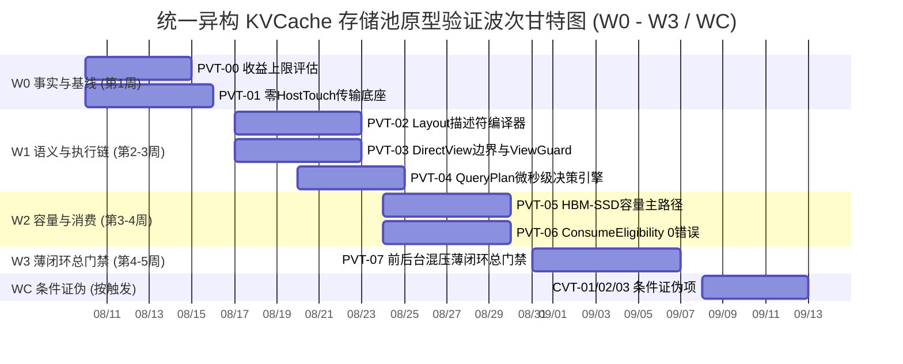

# 统一异构 KVCache 存储池 关键技术原型验证总体实施方案设计

> **文档版本**：V2.0 (工程落地标准刷新版)  
> **基线对齐**：  
> - 交付基线：《统一异构KVCache存储池_关键技术原型验证清单_V1.6_V2.3.1需求树与竞争力对齐完善版.xlsx》  
> - 分解基线：《统一异构KVCache存储池_全量需求树_V2.3.1_SR项目贡献补充版.xlsx》  
> - 规范基线：《KVCache SRS需求列表 V2.2_传输底座视角_建议修订版.xlsx》  
> - 总体导读：《统一异构KVCache存储池总体架构与SRS评审导读_V2.3.1评审稿.md》  

---

## 1. 原型验证工程化刷新原则与标准范式

统一异构 KVCache 存储池原型验证体系（PVT-00 ~ PVT-07 必做包，CVT-01 ~ CVT-03 条件证伪项）是立项前**“购买硬核工程事实”**的决定性门禁。

为了彻底解决“方案设计过于偏向架构理论、描述抽象、开发人员不知道具体做什么和如何计算数据”的痛点，全套方案已**全面刷新为以 PVT-00 标准工程路线为基准的落地执行手册**。

### 1.1 九大标准化工程模块
每个 PVT/CVT 验证项均严格遵循以下 9 大工程化模块，开发人员无需了解整个项目全景，即可按步骤独立完成测试并输出量化结论：

```
┌─────────────────────────────────────────────────────────────────────────┐
│ 1. 验证目标与交付结论定义 (待验证核心命题、交付物清单与判定标准)       │
├─────────────────────────────────────────────────────────────────────────┤
│ 2. 基础/对照 Micro-Benchmark 构建方法 (裸机/单组件/底层协议基准搭建)    │
├─────────────────────────────────────────────────────────────────────────┤
│ 3. 业务 Benchmark 构造与流量特征编排 (请求构造、前缀重合度、时序时钟)   │
├─────────────────────────────────────────────────────────────────────────┤
│ 4. 软硬件环境与打点插桩方案 (环境拓扑、隔离策略、微秒级打点位置)        │
├─────────────────────────────────────────────────────────────────────────┤
│ 5. 分步执行测试操作规程 (Step 1 ~ Step 12 详细动作、命令与依赖)         │
├─────────────────────────────────────────────────────────────────────────┤
│ 6. 数据采集清单与记录格式 (原始数据表头、采样字段、CSV文件格式)          │
├─────────────────────────────────────────────────────────────────────────┤
│ 7. 数据交叉组合与运算推导逻辑 (原始数据如何组合推导预期收益、交叉比对) │
├─────────────────────────────────────────────────────────────────────────┤
│ 8. 多维扩展与扫参矩阵 (复用率 30%~98%、长上下文 8K~256K、多模型架构)     │
├─────────────────────────────────────────────────────────────────────────┤
│ 9. Go / Conditional / No-Go 判定规则与交付报告模板 (阈值公式与报告输出) │
└─────────────────────────────────────────────────────────────────────────┘
```

---

## 2. 8 个 PVT + 3 个 CVT 全量任务全景图

| 验证 ID | 验证包名称 | 验证核心命题 | 对应证据门 | 关联核心文档 |
|---|---|---|---|---|
| **PVT-00** | 业务流量 Saved-Prefill 收益上限评估 | 30%~98% 复用率下 TTFT 净收益与 UBMEM 加速实测 | **E0 立项充分性** | [01_PVT-00.md](./01_PVT-00_业务流量Saved-Prefill收益上限评估实施方案设计.md) |
| **PVT-01** | 零 Host Touch 传输底座与 CapabilityMatrix | UBMEM/URMA 及 SSD 直达 Host CPU 触碰严格为 0，线速 $\ge 80\%$ | **E1 能力路径** | [02_PVT-01.md](./02_PVT-01_零HostTouch极速传输底座与CapabilityMatrix验证实施方案设计.md) |
| **PVT-02** | 异构框架 Layout 编译器与异步 DAG 流水 | 描述符提交开销下降 $\ge 40\%$，计算-传输重叠率 $\ge 60\%$ | **E1 能力路径** | [03_PVT-02.md](./03_PVT-02_异构框架Layout描述符编译器与异步DAG流水验证实施方案设计.md) |
| **PVT-03** | DirectView 与 Copy-to-HBM 边界及 ViewGuard | 实测 Crossover 临界点；**证伪 Decode 活跃 KV 适合 View**；ViewGuard 0 崩溃 | **E1/E2 路径决策** | [04_PVT-03.md](./04_PVT-03_DirectView与Copy-to-HBM适用边界与ViewGuard验证实施方案设计.md) |
| **PVT-04** | QueryPlan 微秒级动态决策与 CostEvaluator | 决策耗时 $P99 < 5\mu s$，准确率 $\ge 90\%$，负收益发生率严格 $< 1\%$ | **E2 决策优越性** | [05_PVT-04.md](./05_PVT-04_QueryPlan微秒级动态决策引擎与CostEvaluator验证实施方案设计.md) |
| **PVT-05** | HBM-SSD 直达容量主路径与 DDR 条件角色 | 150% 超载下服务容量提升 $\ge 30\%$，OOM 下降 $\ge 50\%$，Payload 绕过 DDR | **E2/E3 容量收益** | [06_PVT-05.md](./06_PVT-05_HBM-SSD直达容量主路径与DDR条件角色Tiering验证实施方案设计.md) |
| **PVT-06** | ConsumeEligibility 与 RankConsensus 共识 | 8 类冲突下 0 错误消费、0 越界；$TP=8$ 共识时延 $P99 < 100\mu s$ | **E1 可消费正确性** | [07_PVT-06.md](./07_PVT-06_ConsumeEligibility与RankConsensus0错误消费验证实施方案设计.md) |
| **PVT-07** | 前后台混压薄闭环与 SemanticQoS 干扰包络 | 全链路 P99 TTFT 降低 $\ge 20\%$，QPS 提升 $\ge 10\%$，TPOT 干扰 $< 3\%$ | **E3 系统总门禁** | [08_PVT-07.md](./08_PVT-07_前后台混压端到端薄闭环与SemanticQoS干扰包络验证实施方案设计.md) |
| **CVT-01** | 热点前缀 1-N 硬件多播与 Staging Fanout 对比 | **证伪硬件多播必需性**；$N \le 8$ 规模下软件 Staging Fanout 时延差距 $< 10\%$ | **条件证伪门** | [09_CVT-01.md](./09_CVT-01_热点前缀1-N硬件多播与StagingFanout对比证伪实施方案设计.md) |
| **CVT-02** | PageMigration 软件 RCU 与硬件 AtomicRemap | **证伪硬件 Remap 必需性**；软件 RCU 迁移停顿 $< 1\text{ms}$，TPOT 抖动 $< 5\%$ | **条件证伪门** | [10_CVT-02.md](./10_CVT-02_PageMigration软件RCU与硬件AtomicRemap必要性证伪实施方案设计.md) |
| **CVT-03** | DPU-Codec-CQ 卸载与 RawDirect 无缝 Fallback | **证伪 DPU 必需性**；Raw Direct 主路径独立成立，DPU 故障 $< 1\text{ms}$ 降级 | **条件证伪门** | [11_CVT-03.md](./11_CVT-03_DPU-Codec-CQ卸载必要性与RawDirect无缝Fallback证伪实施方案设计.md) |

---

## 3. 实验硬件环境与公共 Harness 拓扑

验证集中在 **2 节点（Node-0, Node-1）** 标准硬件环境上执行：
- **算力与显存**：每节点 8× NPU (96GB HBM3)，单机显存总计 768GB；
- **网络互联**：800G URMA / RDMA 双端口网卡，支持 UBMEM 共享内存协议；
- **存储介质**：每节点 4× NVMe PCIe Gen5 SSD 阵列（顺序读标称 28GB/s）；
- **宿主算力**：64 Cores Host CPU, 512GB DDR5（仅供控制面与元数据使用）。

---

## 4. 实施波次 (W0 ~ W3) 编排与退出逻辑

测试验证总历时建议为 **4~5 周**，划分为 4 个主递进波次与 1 个条件证伪波次。



开发人员针对每个验证项：
1. **构建 Benchmark**：按照方案第 2、3 节搭建底层微基准与业务请求流量；
2. **执行测试**：按照方案第 5 节运行 Step 1 至 Step 12 操作规程；
3. **记录与计算**：按照方案第 6、7 节导出原始数据表并进行公式交叉比对；
4. **输出结论**：按照方案第 9 节交付标准 Markdown 报告与判定结论。

---

## 5. 原型验证代码库与工程脚本全量索引

所有验证项的可运行源码、Makefile 与测试脚本均存放在当前设计文档目录下的 `./原型验证代码/` 相对路径中：

```
原型验证代码/
├── PVT-00/
│   ├── proto_bench.cc              # 测量 URMA 与 UBMEM 底层通信协议带宽与时延的 C++ 微基准压测工具
│   ├── Makefile                   # 编译 proto_bench 的工程构建文件 (make -j16)
│   ├── make_workload.py           # 构造具备 50%~98% 前缀复用率的受控 R1/R2 请求数据集生成脚本
│   └── traffic_generator.py       # 受控发包与 TTFT/首 Token 时延采集的客户端驱动脚本
├── PVT-01/
│   ├── raw_trans_bench.cc         # 测量 URMA/UBMEM/NVMe Direct 零拷贝 vs CPU memcpy 性能的 C++ 压测工具
│   ├── Makefile                   # 编译 raw_trans_bench 的工程构建文件
│   ├── host_touch_monitor.py      # 基于 Linux eBPF (bpftrace) 监控 Host CPU 内存拷贝事件的内核探针脚本
│   └── export_capability_matrix.py# 自动解析实测吞吐并导出 capability_matrix.json 的工具脚本
├── PVT-02/
│   ├── descriptor_compiler.h      # 跨框架离散物理 Block 连续性合并与 Scatter-Gather 描述符编译器头文件
│   ├── descriptor_compiler.cc     # 描述符贪心合并与硬件描述符生成的核心算法实现
│   ├── async_dag_bench.cc         # NPU 计算流与 DMA 传输流异步 DAG 重叠流水压测工具
│   ├── Makefile                   # 编译 async_dag_bench 的工程构建文件
│   └── make_manifests.py          # 生成不同碎片离散度 (10%~100%) Block Table Manifest 的脚本
├── PVT-03/
│   ├── view_vs_copy_bench.cc      # 测量不同重读次数下 Direct-View 与 Copy-to-HBM 累积耗时的 C++ 压测工具
│   ├── view_guard.h               # ViewGuard 租约管理、时效校验与异常捕获头文件
│   ├── view_guard.cc              # ViewGuard 租约校验与故障安全回滚的核心实现
│   ├── Makefile                   # 编译 view_vs_copy_bench 的工程构建文件
│   └── benchmark_serving_view.py  # 在推理服务中测试并证伪 Decode 阶段 View 模式的压测脚本
├── PVT-04/
│   ├── query_plan_fastpath.h      # 微秒级动态决策引擎与 CostEvaluator 成本预估头文件
│   ├── query_plan_fastpath.cc     # 实时链路感知、5 维成本预估与微秒级剪枝决策算法实现
│   ├── query_plan_bench.cc        # 决策引擎 100K QPS 吞吐压测与反事实决策对账 Harness
│   └── Makefile                   # 编译 query_plan_bench 的工程构建文件
├── PVT-05/
│   ├── tier_storage_bench.cc      # NVMe SSD Direct I/O (Bypass DDR) 与 DDR 中转吞吐对比的 C++ 压测工具
│   ├── Makefile                   # 编译 tier_storage_bench 的工程构建文件
│   └── benchmark_tiering.py       # 150%~200% HBM 显存超载下分层扩容与 OOM 统计驱动脚本
├── PVT-06/
│   ├── consume_eligibility.h      # 6 维语义强校验引擎与部分前缀拼接计划头文件
│   ├── consume_eligibility.cc     # 模型/Tokenizer/模板/LoRA/Ready/Lease 6 维匹配算法实现
│   ├── rank_consensus_bench.cc    # TP=8 多卡空间共识耗时测量与协同 Fallback 压测工具
│   ├── Makefile                   # 编译 rank_consensus_bench 的工程构建文件
│   └── test_correctness.py        # 注入 8 类语义冲突与验证输出 Token 100% 正确性的测试脚本
├── PVT-07/
│   ├── mixed_workload_bench.py    # 前台在线 Decode 流与后台高吞吐 I/O 混压驱动脚本
│   ├── semantic_qos_controller.py # 前台高优先级保证与后台微秒级自适应退避流控器
│   └── run_mixed_bench.py         # 自动化执行全套混流薄闭环并计算 TPOT 干扰率与 TTFT 降幅的脚本
├── CVT-01/
│   ├── multicast_fanout_bench.cc  # N 次单播 vs 软件 Staging Fanout vs 硬件多播完成时延对比工具
│   └── Makefile                   # 编译 multicast_fanout_bench 的工程构建文件
├── CVT-02/
│   ├── rcu_migration_bench.cc     # 32 并发 Reader 下 Stop-the-world 锁表 vs 软件 RCU 迁移停顿对比工具
│   └── Makefile                   # 编译 rcu_migration_bench 的工程构建文件
└── CVT-03/
    ├── offload_fallback_bench.cc  # Raw Direct 直达 vs DPU 硬件卸载 vs CPU 软件压缩对比工具
    ├── Makefile                   # 编译 offload_fallback_bench 的工程构建文件
    └── inject_fault.py            # DPU 控制通道与硬件超时故障注入脚本
```

