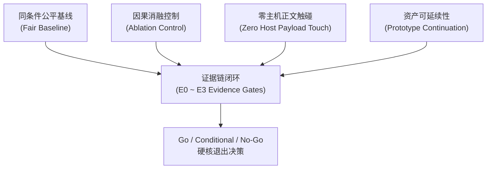
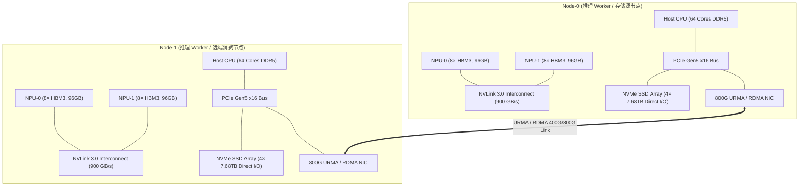
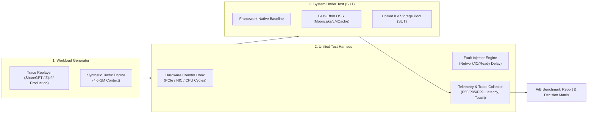
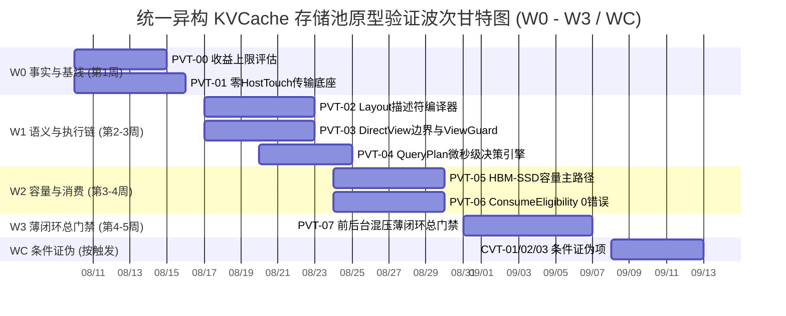

# 统一异构 KVCache 存储池 关键技术原型验证总体实施方案设计

> **文档版本**：V1.0  
> **基线对齐**：  
> - 交付基线：《统一异构KVCache存储池_关键技术原型验证清单_V1.6_V2.3.1需求树与竞争力对齐完善版.xlsx》  
> - 分解基线：《统一异构KVCache存储池_全量需求树_V2.3.1_SR项目贡献补充版.xlsx》  
> - 规范基线：《KVCache SRS需求列表 V2.2_传输底座视角_建议修订版.xlsx》  
> - 总体导读：《统一异构KVCache存储池总体架构与SRS评审导读_V2.3.1评审稿.md》  
> - 竞争力基线：《V3.2 竞争力分析报告》、《立项汇报大纲与页面调整说明》  
> - 量化模型：《开源 LLM 推理框架 KV Cache 架构与量化建模分析》  

---

## 1. 总体验证目标与设计原则

统一异构 KVCache 存储池原型验证体系（Prototype Verification Task, PVT / Conditional Verification Task, CVT）是立项前**“购买事实”**的关键证据门禁。其核心宗旨是：**以可重复、可证伪、同条件公平对比的硬核工程证据，判定第一方 AI Infra 推理状态系统的核心假设是否成立**。

### 1.1 总体验证目标

1. **确定收益上限（PVT-00）**：验证真实业务流量中 Saved-Prefill 的物理上限与正价值边界。
2. **确认物理能力（PVT-01 ~ PVT-03）**：证明 UBMEM/URMA、RDMA、C2C、NVMe/SSD 硬件介质能否形成零主机正文触碰（Zero Host Payload Touch）的极速传输底座，且逻辑 Block/Page 能够高效编译为描述符 DAG。
3. **确认决策优越性（PVT-04 ~ PVT-05）**：证明微秒级 QueryPlan 动态决策与 HBM↔SSD 直达容量主路径能够转化为业务 QPS 与单位 SLO 合格事务成本（TCO）的净收益。
4. **确认正确性安全底线（PVT-06）**：证明 ConsumeEligibility 6 维判定与 RankConsensus 多 Rank 空间共识能够实现 **“0 错误消费、0 过期消费”**。
5. **确认系统净收益与干扰包络（PVT-07）**：在真实前后台混压下完成纵向切片（Vertical Slice）总门禁，证明 TTFT 降低 ≥20%、TPOT 混流干扰 <3%。
6. **条件证伪关键硬件依赖（CVT-01 ~ CVT-03）**：对硬件多播、硬件 Atomic Remap、DPU/硬件 Codec 卸载开展“条件证伪”，确保主路径在没有非成熟硬件依赖时完全独立成立。

### 1.2 五大硬核工程设计原则



1. **同条件公平基线（Fair Baseline）**：所有实验必须固定相同的模型权重、Tokenizer、Chat Template、并发到达分布、SLO 门槛、硬件拓扑与调优预算。对比对象必须包含：
   - 框架原生基线（vLLM / SGLang 原生 Prefix Cache / Swap）；
   - 最佳可行开源组合基线（Mooncake / LMCache 在目标硬件 Provider 下同等调优版本）。
2. **因果消融控制（Ablation Control）**：关键验证必须包含：
   - **关闭状态智能（State Intelligence）**：退化为简单静态规则或双水位策略；
   - **移除非公开微架构信息**：退化为标准通用硬件接口。
   防止将硬件禀赋或弱基线误写为第一方系统优势。
3. **零主机正文触碰（Zero Host Payload Touch）**：Host CPU 仅承担控制面描述符提交与 CQ 完成轮询，严格禁止 CPU 深度参与 KV 正文的拷贝、编解码或全量 CRC 校验。
4. **资产可延续性（Prototype Continuation）**：原型代码严禁写成一次性脚本。验证输出的 Descriptor Compiler、QueryPlan FastPath、DirectViewGuard、ConsumeEligibility Engine 等必须能够直接作为模块子系统迁入正式项目仓库（演进为 AR 认领任务）。
5. **硬核退出决策（Go/No-Go Standard）**：每一项验证均明确定义 Go、Conditional（限定场景白名单）、No-Go（终止止损）与 Not Supported（显式写出支持矩阵）四类结果。

---

## 2. 8 个 PVT + 3 个 CVT 结构总览与证据门映射

原型验证清单包含 **8 个必做包（PVT-00 ~ PVT-07）** 与 **3 个条件/证伪项（CVT-01 ~ CVT-03）**，全量覆盖 24 条 IR 与 38 条 SR23 锚点。

### 2.1 整体验证包追溯矩阵

| 验证 ID | 验证包名称 | 对应证据门 | 主关联 IR | 核心 SR23 锚点 | 预估周期 | 证伪标记 |
|---|---|---|---|---|---|---|
| **PVT-00** | 业务流量 Saved-Prefill 收益上限评估 | **E0 立项充分性** | IR-02-11, IR-02-12 | SR23-02-11-01, SR23-02-12-01 | 4~6 人日 | 否 |
| **PVT-01** | 零 Host Touch 传输底座与 CapabilityMatrix 探针 | **E1 能力路径** | IR-01-06, IR-01-08, IR-01-09, IR-01-12 | SR23-01-06-01, SR23-01-08-01, SR23-01-09-01 | 10~14 人日 | 否 |
| **PVT-02** | 异构框架 Layout 描述符编译器与异步 DAG 流水 | **E1 能力路径** | IR-01-02, IR-01-04 | SR23-01-02-01, SR23-01-04-01, SR23-02-06-01 | 10~12 人日 | 否 |
| **PVT-03** | Direct-View 与 Copy-to-HBM 边界及 ViewGuard 验证 | **E1/E2 路径与决策** | IR-01-07, IR-02-04, IR-02-05 | SR23-01-07-01, SR23-01-10-01, SR23-02-04-01 | 10~14 人日 | **是 (证伪 decode-active 默认 view)** |
| **PVT-04** | QueryPlan 微秒级动态决策引擎与 Cost Evaluator | **E2 决策优越性** | IR-01-03, IR-01-05 | SR23-01-03-01, SR23-01-05-01, SR23-02-02-01 | 8~10 人日 | 否 |
| **PVT-05** | HBM-SSD 直容量主路径与 DDR 条件角色 Tiering | **E2/E3 决策与净收益** | IR-01-01, IR-02-08, IR-02-09 | SR23-01-01-01, SR23-01-08-01, SR23-02-08-01 | 10~14 人日 | 否 |
| **PVT-06** | ConsumeEligibility 与 RankConsensus 0 错误消费验证 | **E1 可消费正确性** | IR-01-10, IR-01-11, IR-02-01, IR-02-05 | SR23-01-10-01, SR23-01-11-01, SR23-02-01-01 | 10~12 人日 | 否 |
| **PVT-07** | 前后台混压端到端薄闭环与 SemanticQoS 干扰包络 | **E3 系统净收益** | IR-01-04, IR-01-11, IR-02-06 | SR23-01-04-01, SR23-02-02-02, SR23-02-06-01 | 12~15 人日 | 否 |
| **CVT-01** | 热点前缀 1-N 硬件多播与 Staging Fanout 对比证伪 | **条件证伪门** | IR-01-04, IR-01-10 | SR23-01-04-02, SR23-01-10-01 | 6~8 人日 (按触发) | **是 (证伪多播非必需)** |
| **CVT-02** | Page Migration 软件 RCU 与硬件 Atomic Remap 证伪 | **条件证伪门** | IR-01-01, IR-01-11, IR-01-12 | SR23-01-01-03, SR23-01-11-01, SR23-01-12-02 | 8~12 人日 (按触发) | **是 (优先证伪硬件原语依赖)** |
| **CVT-03** | DPU / Codec / CQ 卸载必要性与 Raw Direct 路径证伪 | **条件证伪门** | IR-01-08, IR-01-09 | SR23-01-08-01, SR23-01-08-02, SR23-01-09-01 | 5~8 人日 (按触发) | **是 (证伪 DPU/Codec 必需性)** |

---

## 3. 实验硬件环境、网络拓扑与通用 Test Harness 架构

### 3.1 实验硬件集群拓扑

验证集中在 **2 节点（Node-0, Node-1）** 标准集群环境开展，硬件配置如下：



### 3.2 通用 Unified Prototype Test Harness 软件架构

全量 PVT / CVT 共享同一套轻量级 Python/C++ **Test Harness** 框架：



---

## 4. 实施波次 (W0 ~ W3) 编排与退出逻辑

测试验证总历时建议为 **4~5 周**，划分为 4 个主递进波次与 1 个条件证伪波次。



### 4.1 各波次进入与统一退出门禁

1. **W0 事实与基线（第 1 周）**：
   - **包**：PVT-00, PVT-01。
   - **退出门**：E0 收益上限与 E1 CapabilityMatrix 可复现；错误 KV 消费 = 0；实际路径可严格对账。
2. **W1 语义与执行链（第 2~3 周）**：
   - **包**：PVT-02, PVT-03, PVT-04。
   - **退出门**：E1 描述符/Direct-View 路径成立；E2 QueryPlan 相对静态规则与消融版本形成可判定结论。
3. **W2 容量与消费（第 3~4 周）**：
   - **包**：PVT-05, PVT-06。
   - **退出门**：E2 容量/消费决策闭环；可寻址容量转为服务能力；错误消费 = 0；DDR 条件角色明确。
4. **W3 薄闭环总门禁（第 4~5 周）**：
   - **包**：PVT-07。
   - **退出门**：**【E3 系统净收益】** 相对最佳开源替代形成 TTFT/TPOT/QPS/TCO 综合净收益。
5. **WC 条件证伪波次（按触发条件）**：
   - **包**：CVT-01, CVT-02, CVT-03。
   - **退出门**：未达净收益或正确性门槛即旁路/关闭，并写回路线图。

---

## 5. 统一数据记录规范与立项证据包（Evidence Package）模板

所有验证包在运行结束后，必须向技术主管、项目主管与架构师提交统一格式的**立项证据包（Evidence Package）**。证据包格式模板如下：

```markdown
# [PVT/CVT ID] 原型验证立项证据包

## 1. 验证基本信息
- **验证 ID与名称**：PVT-XX / CVT-XX
- **对应证据门**：E0 / E1 / E2 / E3 / 条件证伪门
- **评审结论**：[ Go / Conditional / No-Go / Not Supported ]
- **测试时间与环境**：2026-XX-XX, Node-0 & Node-1 (NPU 8× HBM, PCIe Gen5, 800G URMA)
- **软件与模型版本**：vLLM v0.6.x / SGLang v0.3.x, DeepSeek-V3 / Qwen2.5-72B

## 2. 公平基线与因果消融对账
- **原生框架 Baseline**：[数据及说明]
- **最佳可行开源组合 (Mooncake/LMCache)**：[数据及说明]
- **关闭 State Intelligence 消融**：[数据及说明]
- **移除非公开微架构信息消融**：[数据及说明]

## 3. 关键测量指标与 Go 门槛对账
| KPI 指标 | 测算基线 | 本项目实测 | 目标 Go 门槛 | 门槛达成判定 |
|---|---|---|---|---|
| P99 TTFT (ms) | ... | ... | 降低 ≥ 20% | PASS / FAIL |
| Host Touch Payload (Bytes) | ... | 0 | 必须 = 0 | PASS |
| 错误/过期 KV 消费数 | ... | 0 | 必须 = 0 | PASS |

## 4. 路径凭证与硬件计数器对账
- **计划路径 (Planned Path)**：HBM -> URMA -> Remote HBM
- **实际路径凭证 (ActualPathReceipt)**：`Receipt#10923: URMA_Direct_ZeroCopy, Latency 18.2us`
- **Host CPU Payload Counter**：`0 bytes read/written by CPU`

## 5. 架构决策与资产迁移规划
- **影响的 IR / SR23**：SR23-XX-XX
- **延续的代码资产**：`src/transfer/descriptor_compiler.cc` -> 迁入 SR23-01-02-01
- **评审签字**：架构师 [  ], 性能负责人 [  ], 研发主管 [  ]
```

---

## 6. 总体总结与后续子文档导航

本总体实施方案设计为后续 11 个专项 PVT/CVT 实施方案确立了统一的理论基础、硬件拓扑、Harness 架构、消融规范与证据门决策逻辑。

后文 11 份 Markdown 将针对每一项原型验证任务给出深度详尽的实施方案：
- [`01_PVT-00_业务流量Saved-Prefill收益上限评估实施方案设计.md`](file:///d:/codes/reports/kvcache/unified_kv_memory/验证计划方案设计/01_PVT-00_业务流量Saved-Prefill收益上限评估实施方案设计.md)
- [`02_PVT-01_零HostTouch极速传输底座与CapabilityMatrix验证实施方案设计.md`](file:///d:/codes/reports/kvcache/unified_kv_memory/验证计划方案设计/02_PVT-01_零HostTouch极速传输底座与CapabilityMatrix验证实施方案设计.md)
- [`03_PVT-02_异构框架Layout描述符编译器与异步DAG流水验证实施方案设计.md`](file:///d:/codes/reports/kvcache/unified_kv_memory/验证计划方案设计/03_PVT-02_异构框架Layout描述符编译器与异步DAG流水验证实施方案设计.md)
- [`04_PVT-03_DirectView与Copy-to-HBM适用边界与ViewGuard验证实施方案设计.md`](file:///d:/codes/reports/kvcache/unified_kv_memory/验证计划方案设计/04_PVT-03_DirectView与Copy-to-HBM适用边界与ViewGuard验证实施方案设计.md)
- [`05_PVT-04_QueryPlan微秒级动态决策引擎与CostEvaluator验证实施方案设计.md`](file:///d:/codes/reports/kvcache/unified_kv_memory/验证计划方案设计/05_PVT-04_QueryPlan微秒级动态决策引擎与CostEvaluator验证实施方案设计.md)
- [`06_PVT-05_HBM-SSD直达容量主路径与DDR条件角色Tiering验证实施方案设计.md`](file:///d:/codes/reports/kvcache/unified_kv_memory/验证计划方案设计/06_PVT-05_HBM-SSD直达容量主路径与DDR条件角色Tiering验证实施方案设计.md)
- [`07_PVT-06_ConsumeEligibility与RankConsensus0错误消费验证实施方案设计.md`](file:///d:/codes/reports/kvcache/unified_kv_memory/验证计划方案设计/07_PVT-06_ConsumeEligibility与RankConsensus0错误消费验证实施方案设计.md)
- [`08_PVT-07_前后台混压端到端薄闭环与SemanticQoS干扰包络验证实施方案设计.md`](file:///d:/codes/reports/kvcache/unified_kv_memory/验证计划方案设计/08_PVT-07_前后台混压端到端薄闭环与SemanticQoS干扰包络验证实施方案设计.md)
- [`09_CVT-01_热点前缀1-N硬件多播与StagingFanout对比证伪实施方案设计.md`](file:///d:/codes/reports/kvcache/unified_kv_memory/验证计划方案设计/09_CVT-01_热点前缀1-N硬件多播与StagingFanout对比证伪实施方案设计.md)
- [`10_CVT-02_PageMigration软件RCU与硬件AtomicRemap必要性证伪实施方案设计.md`](file:///d:/codes/reports/kvcache/unified_kv_memory/验证计划方案设计/10_CVT-02_PageMigration软件RCU与硬件AtomicRemap必要性证伪实施方案设计.md)
- [`11_CVT-03_DPU-Codec-CQ卸载必要性与RawDirect无缝Fallback证伪实施方案设计.md`](file:///d:/codes/reports/kvcache/unified_kv_memory/验证计划方案设计/11_CVT-03_DPU-Codec-CQ卸载必要性与RawDirect无缝Fallback证伪实施方案设计.md)
