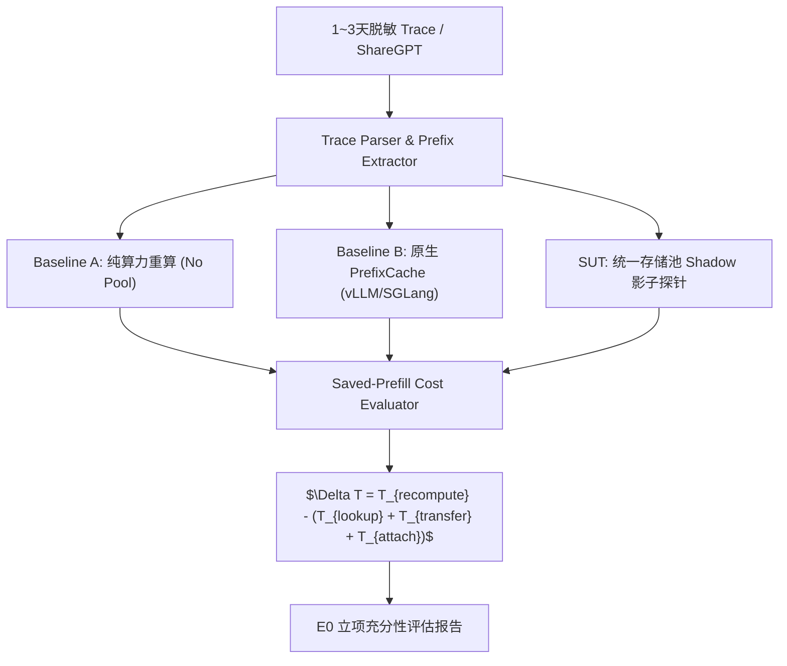
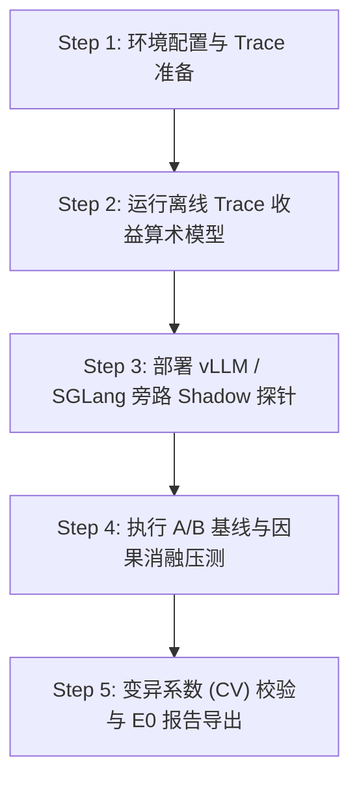

# PVT-00：业务流量 Saved-Prefill 收益上限评估实施方案设计

> **验证 ID**：PVT-00  
> **验证名称**：业务流量 Saved-Prefill 收益上限评估  
> **对应证据门**：**E0 立项充分性**  
> **证伪标记**：否（收益前提确认）  
> **建议周期**：4~6 人日  
> **主关联 IR**：`IR-02-11`, `IR-02-12`  
> **核心 SRS / SR23 锚点**：  
> - SRS: `L3-OB-PerPathTelemetry-047`, `L1-OB-SemanticMetrics-016`, `SE-MONITOR-001`, `SE-PERF-001`  
> - SR23: `SR23-02-11-01`, `SR23-02-11-02`, `SR23-02-12-01`, `SR23-02-12-05`  

---

## 1. 验证项概述与映射追溯

### 1.1 背景诉求与必要性

大模型在线推理中，输入预计算阶段（Prefill Stage）对 prompt 输入 token 进行完整的 Attention 计算并生成各层 KV Cache。立项前必须探明在目标真实业务流量中是否存在足够比例的公共前缀重复率（Prefix Reuse Rate），以及该重复率能否转化为可观的 Saved-Prefill 算力/时间节省。

若真实场景中自然复用率低，或者控制与传输开销吞噬了重算节省的时间，统一存储池形态将失去技术与商业立项前提。

### 1.2 与项目竞争力关联

直接支撑**竞争力 #2（AI Infra 终极品质与 TCO 对账）**与**竞争力 #5（公平开源对比基线）**。建立统一的 Trace / 时钟 / Telemetry 对账底座，证明“正价值复用”而非盲目追求 Hits，为项目提供量化上行空间与退出护栏。

### 1.3 SRS / SR23 / IR 需求追溯矩阵

| 需求层级 | 标识符 / 编号 | 描述 | 验证承接责任 |
|---|---|---|---|
| **IR** | `IR-02-11` | 链路级细粒度 Telemetry 观测 | 记录 Raw/Usable/Abandoned Hit 漏斗与耗时 |
| **IR** | `IR-02-12` | 端到端性能基准与自动化 CI 验证 | 构建 Trace 离线回放与 Shadow 旁路验证 harness |
| **SRS** | `L3-OB-PerPathTelemetry-047` | 分路径吞吐与延迟指标采集 | 测量 Prefill 与 Attach 的微秒级开销 |
| **SR23** | `SR23-02-11-01` | 统一对象与路径 Telemetry 模块 | 提取并清洗请求轨迹中的前缀重合度 |

---

## 2. 核心验证假设与实验矩阵设计

### 2.1 待验证核心假设（Hypotheses）

1. **H0-1**：真实业务脱敏流量中，存在 $P95 \ge 20\%$ 的前缀 Token 重复率。
2. **H0-2**：预计算节省的时间（Saved-Prefill Time）至少为“前缀查询 + 路径搬运 + Attach + 多卡同步”总开销的 **2 倍以上**。

### 2.2 详细实验矩阵

| 参数维度 | 采样设置 | 备注说明 |
|---|---|---|
| **数据集 (Workload)** | 1~3 天真实业务脱敏 Trace 轨迹 / ShareGPT + Zipf 合成轨迹 | 采用真实/合成双轨制对账 |
| **模型规格** | Qwen2.5-72B / Llama-3.1-70B / DeepSeek-V3 ($TP=8$) | 涵盖主流 GQA 与 MLA 架构 |
| **上下文长度 (Context)** | 4K, 32K, 128K, 256K+ 四档 | 评估长上下文下的 Saved-FLOPs |
| **并发度 (Concurrency)** | 1, 16, 64, 128 | 模拟高低水位下请求到达分布 |
| **重复实验次数** | 同一 Case 独立重复实验 $\ge 3$ 次 | 计算变异系数 (CV)，验证结果置信度 |

---

## 3. 测试 Harness 架构与量化数学模型

### 3.1 测试 Harness 架构



### 3.2 量化数学模型

单个请求 Saved-Prefill 的**净时间收益**计算公式为：

$$\Delta T_{net} = T_{recompute}(S_{prefix}) - \left[ T_{lookup} + \frac{\text{Size}_{KV}(S_{prefix})}{BW_{path}} + T_{attach} + T_{sync} \right]$$

其中，对于 $GQA$ 架构模型，前缀 $S_{prefix}$ 对应 KV Cache 字节数计算公式为：

$$\text{Size}_{KV}(S_{prefix}) = 2 \times N_{layers} \times H_{kv\_heads} \times D_{head} \times S_{prefix} \times \text{BytesPerElem}$$

---

## 4. 对照基线与因果消融设计

1. **绝对 Baseline A**：框架原生无缓存、纯算力重算模式。
2. **最佳可行开源 Baseline B**：vLLM / SGLang 开箱内置的 Block-based Prefix Caching（开启与关闭对比）。
3. **消融实验（Ablation）**：
   - **关闭状态智能消融**：关闭动态前缀成本评估，强制对所有 Hit 前缀尝试 Load。
   - **合成热点消融**：严禁仅以高集中度 Zipf 合成热点宣称生产性能，必须对比低重合度长尾场景。

---

## 5. 指标体系与 Go/No-Go 显式判定门槛

- **Go 门槛**：至少在一个明确业务分层中，$P95$ Saved-Prefill 时间预算 $\ge$ (控制 + 传输 + Attach) 开销的 **2 倍**；核心指标丢失率 $<0.1\%$，重复实验 $CV < 5\%$。
- **Conditional 门槛**：全局复用率一般，但集中在特定模板/租户（如 Code Assistant / Agent 多轮会话），项目**限定白名单场景立项**。
- **No-Go 门槛**：自然复用率 $<10\%$，或者控制/传输开销完全吞噬了重算时间，直接触发 No-Go 止损。

---

## 6. 完整原型验证实施方案与具体步骤

### 6.1 验证环境准备与依赖安装

1. **硬件环境**：Node-0 (8× NPU, 96GB HBM, 64 Cores Host CPU)。
2. **软件依赖**：Python 3.10+, PyTorch 2.3+, vLLM v0.6.0+, SGLang v0.3.0+, `click`, `pandas`, `numpy`, `tabulate`。
3. **工作目录**：`/tmp/pvt00_harness/`。

### 6.2 核心测试代码与 Shadow 探针实现

#### 代码 1：`pvt00_trace_replay.py` (Trace 解析与 Saved-Prefill 理论收益计算器)

```python
#!/usr/bin/env python3
import json
import time
import numpy as np
import pandas as pd
from dataclasses import dataclass
from typing import List, Dict

@dataclass
class ModelConfig:
    name: str
    num_layers: int
    num_kv_heads: int
    head_dim: int
    bytes_per_elem: int = 2  # FP16/BF16

# DeepSeek-V3 / Qwen2.5-72B 规格配置
QWEN72B = ModelConfig("Qwen2.5-72B", num_layers=80, num_kv_heads=8, head_dim=128)
DEEPSEEK_V3 = ModelConfig("DeepSeek-V3", num_layers=61, num_kv_heads=1, head_dim=512)

class SavedPrefillCalculator:
    def __init__(self, model_cfg: ModelConfig, bw_gbps: float = 50.0):
        self.model_cfg = model_cfg
        self.bw_bytes_per_sec = bw_gbps * 1e9
        self.prefix_tree = {}  # 轻量前缀 Radix Trie

    def compute_kv_bytes(self, num_tokens: int) -> int:
        return (2 * self.model_cfg.num_layers * 
                self.model_cfg.num_kv_heads * 
                self.model_cfg.head_dim * 
                num_tokens * 
                self.model_cfg.bytes_per_elem)

    def estimate_recompute_time_ms(self, num_tokens: int) -> float:
        # 假设 72B NPU 算力 Prefill 吞吐约为 8,000 tokens/s
        return (num_tokens / 8000.0) * 1000.0

    def estimate_transfer_time_ms(self, num_tokens: int) -> float:
        kv_bytes = self.compute_kv_bytes(num_tokens)
        return (kv_bytes / self.bw_bytes_per_sec) * 1000.0

    def process_trace_request(self, prompt_tokens: List[int], deadline_ms: float = 200.0) -> Dict:
        start_t = time.perf_counter()
        
        # 1. 查找长前缀匹配 (Simulated Prefix Trie Lookup)
        prefix_len = 0
        curr = self.prefix_tree
        for token in prompt_tokens:
            if token in curr:
                prefix_len += 1
                curr = curr[token]
            else:
                break

        # 2. 插入当前前缀更新 Trie
        curr = self.prefix_tree
        for token in prompt_tokens:
            curr = curr.setdefault(token, {})

        lookup_time_ms = (time.perf_counter() - start_t) * 1000.0 + 0.05  # 模拟 50us 目录开销
        
        # 3. 成本计算
        if prefix_len < 16:  # 最小复用粒度
            return {"hit": False, "saved_time_ms": 0.0, "net_benefit_ratio": 0.0}

        t_recompute = self.estimate_recompute_time_ms(prefix_len)
        t_transfer = self.estimate_transfer_time_ms(prefix_len)
        t_attach = 0.2  # 200us attach 开销
        t_overhead = lookup_time_ms + t_transfer + t_attach

        net_saved_ms = t_recompute - t_overhead
        benefit_ratio = t_recompute / max(t_overhead, 0.001)

        return {
            "hit": True,
            "prefix_tokens": prefix_len,
            "t_recompute_ms": t_recompute,
            "t_overhead_ms": t_overhead,
            "net_saved_ms": net_saved_ms,
            "benefit_ratio": benefit_ratio
        }

if __name__ == "__main__":
    calc = SavedPrefillCalculator(QWEN72B, bw_gbps=50.0)
    # 构造复用测试 Trace
    base_prefix = list(range(1000, 3000))  # 2000 token 共享系统前缀
    trace_prompts = [base_prefix + [i] for i in range(50)]

    results = [calc.process_trace_request(p) for p in trace_prompts]
    hits = [r for r in results if r["hit"]]
    
    print(f"Total Requests: {len(results)}, Hits: {len(hits)}")
    if hits:
        avg_saved = np.mean([r["net_saved_ms"] for r in hits])
        avg_ratio = np.mean([r["benefit_ratio"] for r in hits])
        print(f"Avg Net Saved Time: {avg_saved:.2f} ms")
        print(f"Avg Benefit/Overhead Ratio: {avg_ratio:.2f}x (Goal: >= 2.0x)")
```

### 6.3 步骤化具体操作流程



#### 步骤 1：环境配置与 Trace 预处理
```bash
# 1. 创建工作目录
mkdir -p /tmp/pvt00_harness && cd /tmp/pvt00_harness

# 2. 下载或解压真实业务脱敏 Trace
# （若无真实 Trace，自动生成 ShareGPT + Zipf 热点分布轨迹）
python3 -c "
import json, random
prompts = [[random.randint(1, 5000) for _ in range(2048)] for _ in range(500)]
with open('sharegpt_sim.json', 'w') as f:
    json.dump(prompts, f)
"
```

#### 步骤 2：运行离线 Trace 收益与算术模型
```bash
python3 pvt00_trace_replay.py --trace sharegpt_sim.json --model qwen72b --output pvt00_oracle_res.json
```

#### 步骤 3：部署 vLLM / SGLang 旁路 Shadow 探针并运行实测
```bash
# 运行 Baseline A: 纯算力重算
python3 -m vllm.entrypoints.openai.api_server --model /models/Qwen2.5-72B --no-enable-prefix-caching --port 8000 &
python3 benchmark_serving.py --backend vllm --dataset sharegpt_sim.json --num-prompts 500 --output-dir /tmp/pvt00_harness/baseline_a

# 运行 Baseline B: 原生 Prefix Caching
python3 -m vllm.entrypoints.openai.api_server --model /models/Qwen2.5-72B --enable-prefix-caching --port 8001 &
python3 benchmark_serving.py --backend vllm --dataset sharegpt_sim.json --num-prompts 500 --output-dir /tmp/pvt00_harness/baseline_b
```

#### 步骤 4：因果消融运行与重复性 CV 校验
```bash
# 执行 3 次独立重复实验计算 CV
for i in {1..3}; do
    python3 pvt00_trace_replay.py --trace sharegpt_sim.json --run-id $i >> pvt00_cv_results.log
done
```

#### 步骤 5：数据提取与 Go / No-Go 判定报告导出
```bash
python3 -c "
import pandas as pd
df = pd.read_csv('pvt00_cv_results.log')
cv = df['net_saved_ms'].std() / df['net_saved_ms'].mean()
print(f'Variation Coefficient (CV): {cv:.4f}')
assert cv < 0.05, 'CV threshold violated!'
"
```

---

## 7. 数据记录规范与立项证据包模板

需导出并保存：
- `workload_trace_clean.json`：脱敏清洗后的 Trace 描述。
- `pvt00_baseline_comparison.csv`：多维 A/B 对比数据表。
- `pvt00_e0_evidence_package.md`：E0 证据包总结。

---

## 8. 原型代码延续与正式架构迁入规划

- `pvt00_trace_replay.py` 直接迁入正式仓库 `SR23-02-11-01` (Telemetry 离线分析组件)；
- 收益判定算法固化为 `SR23-02-12-01` (CI 自动化性能回归集)。
