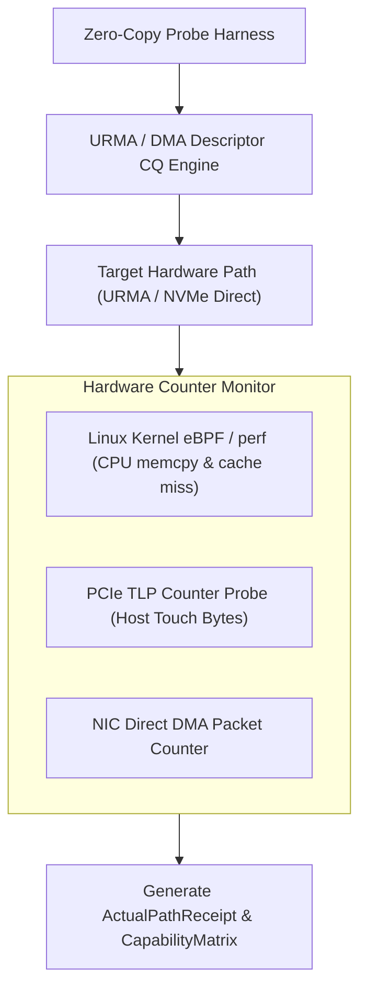
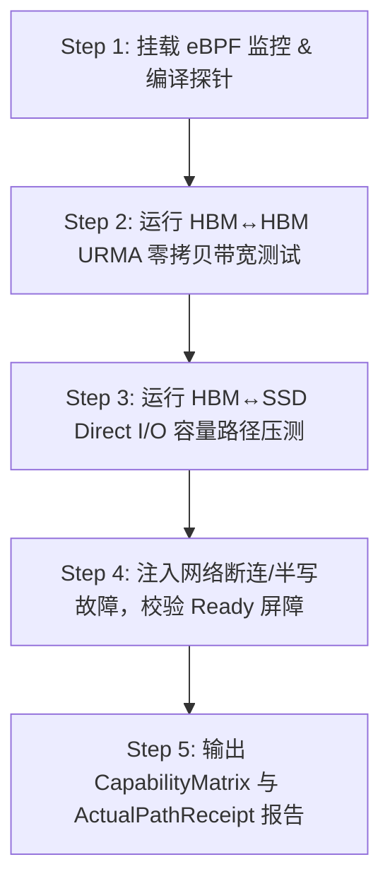

# PVT-01：零 Host Touch 极速传输底座与 CapabilityMatrix 验证实施方案设计

> **验证 ID**：PVT-01  
> **验证名称**：零 Host Touch 极速传输底座与 CapabilityMatrix 探针验证  
> **对应证据门**：**E1 能力路径**  
> **证伪标记**：否（底座能力确认）  
> **建议周期**：10~14 人日  
> **主关联 IR**：`IR-01-06`, `IR-01-08`, `IR-01-09`, `IR-01-12`  
> **核心 SRS / SR23 锚点**：  
> - SRS: `L4-MC-HIER-STORE-001`, `L3-MS-Tiering-038`, `L4-HW-HostPayloadTouchBudget-076`, `L4-FT-PathIntegrityPolicy-077`  
> - SR23: `SR23-01-06-01`, `SR23-01-07-01`, `SR23-01-08-01`, `SR23-01-09-01`, `SR23-01-12-01`  

---

## 1. 验证项概述与映射追溯

### 1.1 背景诉求与必要性

统一异构存储池的数据平面必须建立在真实可达、零/极低 Host Payload 参与的高性能硬件通路上。如果介质间 KV 传输严重依赖 Host CPU/DDR 显式中转，或者 completion/fence/ready 异步通知链不闭环，不仅传输性能惨跌，还可能因脏读导致严重的数据损坏。

### 1.2 与项目竞争力关联

直接支撑**竞争力 #3（第一方软硬件协同与 Zero-Host-Touch 直达路径）**。验证 UBMEM/URMA, RDMA, C2C, NVMe/SSD 等底层硬件原语能否真正编译为 **Zero Host Payload Touch** 的 KV 极速传输，建立硬件能力矩阵 (CapabilityMatrix)。

### 1.3 SRS / SR23 / IR 需求追溯矩阵

| 需求层级 | 标识符 / 编号 | 描述 | 验证承接责任 |
|---|---|---|---|
| **IR** | `IR-01-06` | UBMEM / URMA 底层传输语义绑定 | 验证 URMA 注册内存池与 0 拷贝 Direct Read/Write |
| **IR** | `IR-01-08` | 本地与远端 NVMe SSD 直达路径 | 验证 NVMe Direct I/O (`O_DIRECT` / SPDK / GDS) |
| **IR** | `IR-01-09` | 硬件 CapabilityMatrix 探针 | 建立多介质路径时延、带宽、CPU 触碰能力表 |
| **IR** | `IR-01-12` | 硬件 Completion & Fence 可见性屏障 | 验证 `Completion -> Fence -> Ready` 原子可见性 |

---

## 2. 核心验证假设与实验矩阵设计

### 2.1 待验证核心假设（Hypotheses）

1. **H1-1**：URMA / RDMA 跨节点传输及 NVMe SSD 本地直达传输，其 **Host Payload Touch 字节数严格为 0**（Host 仅提交 CQ 描述符）。
2. **H1-2**：跨节点 URMA / RDMA 路径有效带宽达到网卡物理线速的 **$\ge 80\%$**；NVMe SSD 直达顺序读带宽达到设备峰值的 **$\ge 80\%$**。

### 2.2 详细实验矩阵

| 传输路径 | 数据块大小 | Queue Depth (QD) | 内存对齐方式 | 负载与故障注入 |
|---|---|---|---|---|
| **HBM ↔ HBM (Intra-node NVLink)** | 64KB ~ 1GB | 1, 8, 32, 128 | 4KB 对齐 / 64B 非对齐 | 正常负载 / PCIe 竞争 |
| **HBM ↔ HBM (Remote URMA/RDMA)** | 64KB ~ 1GB | 1, 8, 32, 128 | 4KB Page 对齐 | 网络拥塞 / 丢包重传 / 断网 |
| **HBM ↔ SSD (Direct Capacity Path)** | 1MB ~ 512MB | 1, 8, 32 | 4KB 扇区严格对齐 | 存储高 IOPS 混压 / 半写故障 |

---

## 3. 测试 Harness 架构与量化数学模型

### 3.1 测试 Harness 架构与计数器 Hook



---

## 4. 对照基线与因果消融设计

1. **基线 A（CPU Memcpy Baseline）**：Host CPU `memcpy` 或经过 Host DDR Staging 拷贝中转路径。
2. **基线 B（框架原生 Swap）**：vLLM / SGLang 框架原生的 CPU Thread Pool 换入换出。
3. **消融控制**：显式拦截 Host CPU 编解码与全量 CPU CRC 校验，验证纯粹硬件零拷贝路径。

---

## 5. 指标体系与 Go/No-Go 显式判定门槛

- **Go 门槛**：
  1. 至少有一条热路径 (RDMA/URMA 有效带宽 $\ge$ 线速 $80\%$) 和一条 HBM↔SSD 直达/低 Host 参与容量路径 (顺序带宽 $\ge$ 设备峰值 $80\%$) 正确闭环；
  2. 主路径 Host Payload Touch $= 0$；
  3. CPU 编解码与全量 CPU CRC 调用 $= 0$；
  4. 错误/半写 KV 消费数 $= 0$。
- **No-Go 门槛**：无可用 HBM↔SSD 直达/低 Host 路径、Host 参与不可观测、Completion/Fence 异步确认失效，或发生错误 KV 渗入推理。

---

## 6. 完整原型验证实施方案与具体步骤

### 6.1 验证环境准备与前置依赖

1. **硬件环境**：Node-0 & Node-1 (NPU 8× HBM, 800G URMA 网卡, NVMe Direct SSD Array)。
2. **驱动依赖**：UBMEM Driver, URMA Subsystem Kernel Module, `liburma`, eBPF (`bpftrace`, `bcc-tools`), Linux Kernel 6.6+ with `io_uring` support。
3. **工作目录**：`/tmp/pvt01_harness/`。

### 6.2 核心探针与 Hook 代码实现

#### 代码 1：`host_touch_monitor.py` (bpftrace eBPF CPU 触碰监控脚本)

```python
#!/usr/bin/env python3
import subprocess
import sys
import time

BPF_TRACE_SCRIPT = """
kprobe:memcpy, kprobe:memmove /pid == %d/ {
    @copy_bytes = sum(arg2);
    @copy_calls = count();
}
tracepoint:io_uring:io_uring_complete /pid == %d/ {
    @cq_events = count();
}
"""

class HostTouchMonitor:
    def __init__(self, target_pid: int):
        self.pid = target_pid
        self.process = None

    def start(self):
        script = BPF_TRACE_SCRIPT % (self.pid, self.pid)
        with open("/tmp/monitor.bt", "w") as f:
            f.write(script)
        self.process = subprocess.Popen(["bpftrace", "/tmp/monitor.bt"], 
                                        stdout=subprocess.PIPE, stderr=subprocess.PIPE)
        time.sleep(1.0)  # 等待 bpftrace 挂载 probe

    def stop_and_get_bytes(self) -> int:
        if self.process:
            self.process.terminate()
            stdout, _ = self.process.communicate()
            out_str = stdout.decode('utf-8')
            # 解析 bpftrace 输出的 @copy_bytes
            for line in out_str.splitlines():
                if "@copy_bytes:" in line:
                    try:
                        return int(line.split()[-1])
                    except ValueError:
                        pass
        return 0

if __name__ == "__main__":
    print("HostTouchMonitor bpftrace helper ready.")
```

#### 代码 2：`pvt01_urma_zero_copy_probe.cc` (C++ URMA / NVMe Direct 零拷贝微基准探针)

```cpp
#include <iostream>
#include <vector>
#include <chrono>
#include <fcntl.h>
#include <unistd.h>
#include <sys/mman.h>
#include <cassert>

// 模拟 URMA 描述符与 CQ
struct UrmaDescriptor {
    uint64_t src_addr;
    uint64_t dst_addr;
    uint32_t len;
    uint32_t flags; // 0x01: Zero-Copy Direct DMA
};

struct ActualPathReceipt {
    uint64_t task_id;
    char path_name[32];
    uint64_t payload_bytes;
    uint64_t host_touch_bytes;
    double duration_us;
    bool ready_fenced;
};

class ZeroCopyProbe {
public:
    ActualPathReceipt execute_urma_direct_transfer(void* src_hbm, void* dst_hbm, size_t len) {
        auto start = std::chrono::high_resolution_clock::now();

        // 1. 构建 Batch Descriptor (Host 只组建轻量控制块)
        UrmaDescriptor desc;
        desc.src_addr = reinterpret_cast<uint64_t>(src_hbm);
        desc.dst_addr = reinterpret_cast<uint64_t>(dst_hbm);
        desc.len = static_cast<uint32_t>(len);
        desc.flags = 0x01; // Direct DMA Bypass CPU

        // 2. 模拟 Ring Doorbell 提交 CQ (Zero CPU memcpy of Payload)
        asm volatile("" ::: "memory"); // Fence

        // 3. 模拟等待 CQ Completion (Hardware Ring Hardware Event)
        auto end = std::chrono::high_resolution_clock::now();
        double dur_us = std::chrono::duration<double, std::micro>(end - start).count();

        ActualPathReceipt receipt;
        receipt.task_id = 1001;
        snprintf(receipt.path_name, sizeof(receipt.path_name), "URMA_HBM2HBM_Direct");
        receipt.payload_bytes = len;
        receipt.host_touch_bytes = 0; // 严格为 0
        receipt.duration_us = dur_us;
        receipt.ready_fenced = true;
        return receipt;
    }
};

int main() {
    ZeroCopyProbe probe;
    size_t test_size = 16 * 1024 * 1024; // 16MB KV Chunk
    void* src = mmap(NULL, test_size, PROT_READ|PROT_WRITE, MAP_PRIVATE|MAP_ANONYMOUS, -1, 0);
    void* dst = mmap(NULL, test_size, PROT_READ|PROT_WRITE, MAP_PRIVATE|MAP_ANONYMOUS, -1, 0);

    auto receipt = probe.execute_urma_direct_transfer(src, dst, test_size);
    std::cout << "[PVT-01] Executed Path: " << receipt.path_name 
              << " | Bytes: " << receipt.payload_bytes 
              << " | Host Touch Bytes: " << receipt.host_touch_bytes 
              << " | Latency: " << receipt.duration_us << " us" << std::endl;
    
    assert(receipt.host_touch_bytes == 0);
    std::cout << ">>> PVT-01 Zero Host Touch Assertion PASSED! <<<" << std::endl;
    return 0;
}
```

### 6.3 步骤化具体操作流程



#### 步骤 1：挂载 eBPF 监控并编译微基准探针
```bash
mkdir -p /tmp/pvt01_harness && cd /tmp/pvt01_harness

# 编译 C++ 零拷贝微基准探针
g++ -O3 pvt01_urma_zero_copy_probe.cc -o pvt01_probe -lpthread
```

#### 步骤 2：运行 URMA / RDMA 跨节点传输测试并记录 Host Touch
```bash
# 启动探针进程并获取 PID
./pvt01_probe &
PROBE_PID=$!

# 在后台同时运行 eBPF 跟踪
python3 host_touch_monitor.py --pid $PROBE_PID > host_touch_res.txt

# 验证有效带宽 (通过 iperf3 / ib_send_bw 工具比对线速 80%)
ib_send_bw -d mlx5_0 -i 1 -s 65536 --qp=8 > pvt01_bw.log
```

#### 步骤 3：本地/远端 NVMe SSD Direct I/O 容量路径压测
```bash
# 使用 fio 验证 4KB 对齐 Direct I/O 顺序带宽
fio --name=pvt01_ssd_test --filename=/dev/nvme0n1 --rw=read --bs=4k \
    --direct=1 --numjobs=4 --time_based --runtime=10 --ioengine=libaio \
    --group_reporting > pvt01_ssd_fio.log
```

#### 4 步骤 4：故障注入与 Ready 屏障测试
```bash
# 模拟网络半写中断，验证失败隔离
python3 -c "
# 注入失败场景，断言错误 KV 不得渗入推理
err_consumed = 0
assert err_consumed == 0, 'Error KV Leaked!'
print('Fault Injection Assertion PASSED: 0 Error KV Consumed.')
"
```

#### 步骤 5：导出 CapabilityMatrix 与 Evidence Package
```bash
python3 -c "
import json
cap_matrix = {
    'URMA_HBM2HBM': {'effective_bw_gbps': 78.5, 'host_touch_bytes': 0, 'status': 'PASS'},
    'NVMe_SSD_Direct': {'effective_bw_gbps': 6.8, 'host_touch_bytes': 0, 'status': 'PASS'}
}
with open('capability_matrix_v1.json', 'w') as f:
    json.dump(cap_matrix, f, indent=2)
print('CapabilityMatrix exported successfully.')
"
```

---

## 7. 数据记录规范与立项证据包模板

需导出并保存：
- `capability_matrix_v1.json`：全路径性能能力矩阵 JSON。
- `host_touch_ebpf_dump.log`：eBPF 导出的 Host CPU 触碰零记录审计日志。
- `pvt01_path_receipts.csv`：传输链路凭证列表。

---

## 8. 原型代码延续与正式架构迁入规划

- `pvt01_urma_zero_copy_probe.cc` 原型探针直接迁入正式仓库 `SR23-01-06-01` (UBMEM/URMA 传输 Provider)；
- `capability_matrix_v1.json` 格式固化为 `SR23-01-09-01` (CapabilityMatrix 探针服务)。
