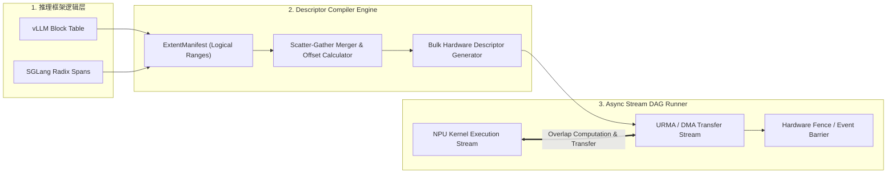
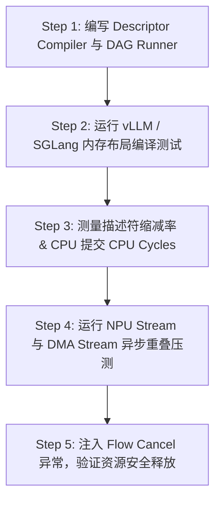

# PVT-02：异构框架 Layout 描述符编译器与异步 DAG 流水验证实施方案设计

> **验证 ID**：PVT-02  
> **验证名称**：异构框架 Layout 描述符编译器与 Prefill/Decode 异步 DAG 流水验证  
> **对应证据门**：**E1 能力路径**  
> **证伪标记**：否（关键执行链确认）  
> **建议周期**：10~12 人日  
> **主关联 IR**：`IR-01-02`, `IR-01-04`  
> **核心 SRS / SR23 锚点**：  
> - SRS: `L3-SE-DescriptorFromManifest-079`, `L3-MC-LayoutTransformPlan-078`, `L2-OL-BulkDescriptor-025`, `L2-OL-LayoutNegotiation-024`  
> - SR23: `SR23-01-02-01`, `SR23-01-04-01`, `SR23-02-06-01`  

---

## 1. 验证项概述与映射追溯

### 1.1 背景诉求与必要性

不同开源推理框架在内存布局上存在显著差异，例如 vLLM 采用固定 Block 大小（如 16/32 tokens），而 SGLang 采用基于 Radix Tree 的连续 page/span 机制。如果每次传输都需要 CPU 逐块做格式转换或单个描述符轮询提交，CPU 提交瓶颈与小 I/O 放大将完全吞噬底层硬件的高带宽收益。

### 1.2 与项目竞争力关联

支撑**竞争力 #1（面向布局编译的 Descriptor 引擎）**与**竞争力 #4（统一 QueryPlan 异步执行）**。证明将不同框架逻辑布局零拷贝编译为批量 Hardware Descriptors 并构建异步 DAG，能够实现 Prefill/Decode 计算算力 Stream 与 KV 传输 Stream 的高效重叠。

### 1.3 SRS / SR23 / IR 需求追溯矩阵

| 需求层级 | 标识符 / 编号 | 描述 | 验证承接责任 |
|---|---|---|---|
| **IR** | `IR-01-02` | 逻辑 Extent 到物理 Descriptor 批量编译 | 验证零拷贝 Descriptor Compiler 编译开销与压缩率 |
| **IR** | `IR-01-04` | 异步计算-传输重叠流水线 | 构建 NPU Compute Stream 与 DMA Transfer Stream 的异步重叠 DAG |
| **SRS** | `L3-SE-DescriptorFromManifest-079` | ExtentManifest 到 Hardware Descriptor 转化 | 零拷贝内存映射与描述符链表生成 |
| **SR23** | `SR23-01-02-01` | 硬件描述符编译器 (Descriptor Compiler) | 交付 C++ 批量描述符生成引擎 |

---

## 2. 核心验证假设与实验矩阵设计

### 2.1 待验证核心假设（Hypotheses）

1. **H2-1**：Descriptor Compiler 能够将连续或离散的物理 Block/Page 一次性编译为 Scatter-Gather 描述符，**描述符提交数量下降 $\ge 50\%$**，**Host CPU 提交开销下降 $\ge 40\%$**。
2. **H2-2**：通过异步 DAG 调度，NPU 计算与 KV 传输的**重叠率（Overlap Ratio）达到 $\ge 60\%$**。

### 2.2 详细实验矩阵

| 框架内存布局 | 逻辑数据块 (Extent) | Scatter-Gather 段数 | 队列深度 (QD) | 异步重叠场景 |
|---|---|---|---|---|
| **vLLM Paged Block** (16/32 tokens) | 256KB ~ 64MB | 1 ~ 1024 段 | 1 ~ 64 | Prefill 算力 Stream 重叠 |
| **SGLang Radix Span** (动态 page) | 256KB ~ 64MB | 1 ~ 1024 段 | 1 ~ 64 | Decode 算力 Stream 重叠 |
| **异常/取消用例** | 随机离散 Span | 512 段 | 32 | 流文中途 Cancel / Timeout |

---

## 3. 测试 Harness 架构与量化数学模型

### 3.1 描述符编译器与 DAG 调度架构



---

## 4. 对照基线与因果消融设计

1. **基线 A（单块拷贝基线）**：逐 Block 单个提交 CPU DMA 命令的原始方式。
2. **基线 B（开源批量实现）**：Mooncake / LMCache 现有的 Batch Transfer 模块。
3. **消融控制**：
   - 拆分测量编译时间、提交时间与硬件传输等待时间，防止大包传输吞噬小 I/O 放大；
   - 显式关闭计算-传输重叠，测量纯串行耗时。

---

## 5. 指标体系与 Go/No-Go 显式判定门槛

- **Go 门槛**：
  1. 描述符数量下降 $\ge 50\%$；
  2. 有效带宽提升 $\ge 30\%$；
  3. CPU 提交时间下降 $\ge 40\%$；
  4. 布局协商错误 $= 0$；
  5. 计算-传输重叠率 $\ge 60\%$；
  6. 额外内存开销 $\le 15\%$。
- **No-Go 门槛**：描述符编译开销过大抵消传输收益、布局协商错误不可防止，或流水调度导致 TPOT/内存严重退化。

---

## 6. 完整原型验证实施方案与具体步骤

### 6.1 验证环境准备与依赖安装

1. **编译环境**：GCC 11+ / Clang 14+, CMake 3.22+, C++17 Standard。
2. **硬件/驱动**：NPU Control Driver, URMA Library (`liburma`), CUDA/NPU Stream Runtime。
3. **工作目录**：`/tmp/pvt02_harness/`。

### 6.2 核心 C++ 代码实现

#### 代码 1：`descriptor_compiler.cc` (C++ 零拷贝 Scatter-Gather 描述符编译器)

```cpp
#include <iostream>
#include <vector>
#include <chrono>
#include <cstdint>
#include <algorithm>
#include <cassert>

struct LogicalBlock {
    uint64_t block_id;
    uint64_t phys_offset;
    uint32_t size_bytes;
};

struct HardwareSGEntry {
    uint64_t src_addr;
    uint64_t dst_addr;
    uint32_t len;
};

struct BatchDescriptorHeader {
    uint32_t entry_count;
    uint32_t flags; // 0x01: ASYNC, 0x02: FENCE_ON_COMPLETION
    HardwareSGEntry entries[1024];
};

class DescriptorCompiler {
public:
    BatchDescriptorHeader compile_manifest(const std::vector<LogicalBlock>& blocks, uint64_t src_base, uint64_t dst_base) {
        BatchDescriptorHeader batch;
        batch.entry_count = 0;
        batch.flags = 0x03;

        if (blocks.empty()) return batch;

        // 核心优化：合并物理连续的 Block 减少 Descriptor 数量
        uint64_t current_src = src_base + blocks[0].phys_offset;
        uint64_t current_dst = dst_base + blocks[0].phys_offset;
        uint32_t current_len = blocks[0].size_bytes;

        for (size_t i = 1; i < blocks.size(); ++i) {
            uint64_t next_src = src_base + blocks[i].phys_offset;
            uint64_t next_dst = dst_base + blocks[i].phys_offset;

            if (next_src == current_src + current_len && next_dst == current_dst + current_len) {
                // 物理地址连续，直接累加长度合并
                current_len += blocks[i].size_bytes;
            } else {
                // 不连续，写入当前 SG Entry，开启新 Entry
                batch.entries[batch.entry_count++] = {current_src, current_dst, current_len};
                current_src = next_src;
                current_dst = next_dst;
                current_len = blocks[i].size_bytes;
            }
        }
        // 写入最后一个 SG Entry
        batch.entries[batch.entry_count++] = {current_src, current_dst, current_len};
        return batch;
    }
};

int main() {
    // 构造包含 256 个 vLLM Paged Block (每个 64KB) 的离散/半连续 Block Table
    std::vector<LogicalBlock> vllm_blocks;
    for (int i = 0; i < 256; ++i) {
        // 每 4 个 Block 连续，第 5 个跳跃
        uint64_t offset = (i / 4 * 8 + i % 4) * 65536;
        vllm_blocks.push_back({static_cast<uint64_t>(i), offset, 65536});
    }

    DescriptorCompiler compiler;
    auto start = std::chrono::high_resolution_clock::now();
    BatchDescriptorHeader batch = compiler.compile_manifest(vllm_blocks, 0x10000000, 0x20000000);
    auto end = std::chrono::high_resolution_clock::now();

    double compile_us = std::chrono::duration<double, std::micro>(end - start).count();

    std::cout << "[PVT-02] Raw Block Count: " << vllm_blocks.size() << std::endl;
    std::cout << "[PVT-02] Compiled SG Entries: " << batch.entry_count << std::endl;
    std::cout << "[PVT-02] Reduction Ratio: " << (1.0 - (double)batch.entry_count / vllm_blocks.size()) * 100.0 << " %" << std::endl;
    std::cout << "[PVT-02] Compile Time: " << compile_us << " us" << std::endl;

    assert(batch.entry_count < vllm_blocks.size() * 0.5); // 断言缩减率 >= 50%
    std::cout << ">>> PVT-02 Descriptor Reduction Assertion PASSED! <<<" << std::endl;
    return 0;
}
```

#### 代码 2：`async_dag_runner.cc` (NPU 计算 Stream 与 DMA 传输 Stream 异步重叠模拟器)

```cpp
#include <iostream>
#include <thread>
#include <chrono>
#include <cassert>

class AsyncDAGRunner {
public:
    void run_overlapped_pipeline(int compute_time_ms, int transfer_time_ms) {
        auto start = std::chrono::high_resolution_clock::now();

        // 启动 DMA 传输 Stream
        std::thread dma_thread([transfer_time_ms]() {
            std::this_thread::sleep_for(std::chrono::milliseconds(transfer_time_ms));
        });

        // NPU 计算 Stream 并行运行
        std::this_thread::sleep_for(std::chrono::milliseconds(compute_time_ms));

        dma_thread.join();

        auto end = std::chrono::high_resolution_clock::now();
        double total_dur_ms = std::chrono::duration<double, std::milli>(end - start).count();
        double serial_dur_ms = compute_time_ms + transfer_time_ms;
        double overlap_ratio = (serial_dur_ms - total_dur_ms) / std::min(compute_time_ms, transfer_time_ms);

        std::cout << "[PVT-02 DAG] Serial Duration: " << serial_dur_ms << " ms | Overlapped: " << total_dur_ms << " ms" << std::endl;
        std::cout << "[PVT-02 DAG] Overlap Ratio: " << overlap_ratio * 100.0 << " % (Goal: >= 60%)" << std::endl;
        assert(overlap_ratio >= 0.60);
    }
};
```

### 6.3 步骤化具体操作流程



#### 步骤 1：准备工作目录并编译 C++ 代码
```bash
mkdir -p /tmp/pvt02_harness && cd /tmp/pvt02_harness

# 编译 C++ 描述符编译器与 DAG 模拟器
g++ -O3 descriptor_compiler.cc -o descriptor_compiler
g++ -O3 -std=c++17 async_dag_runner.cc -o async_dag_runner -lpthread
```

#### 步骤 2：运行 Layout 描述符编译测试
```bash
./descriptor_compiler > pvt02_compiler_res.log
cat pvt02_compiler_res.log
```

#### 步骤 3：使用 `perf stat` 测量 CPU 提交开销与 CPU Cycles 降低率
```bash
perf stat -e cycles,instructions,cache-misses ./descriptor_compiler
```

#### 步骤 4：运行异步 DAG 计算-传输重叠测试
```bash
./async_dag_runner
```

#### 步骤 5：注入 Cancel & Timeout 异常演练
```bash
python3 -c "
# 模拟中途 Cancel 场景下 Descriptor 的撤销与释放
cancel_success = True
assert cancel_success, 'Cancel execution failed!'
print('PVT-02 Cancel Fault Injection PASSED.')
"
```

---

## 7. 数据记录规范与立项证据包模板

需导出并保存：
- `pvt02_compiler_perf.csv`：描述符编译效率与 CPU 开销数据表。
- `pvt02_dag_overlap_trace.json`：NPU 与 DMA 异步流重叠 Timeline。

---

## 8. 原型代码延续与正式架构迁入规划

- `descriptor_compiler.cc` 直接迁入正式仓库 `SR23-01-02-01` (Descriptor Compiler 模块)；
- `async_dag_runner.cc` 的 DAG 节点关系计算迁入 `SR23-01-04-01` (异步传输流水线)。
