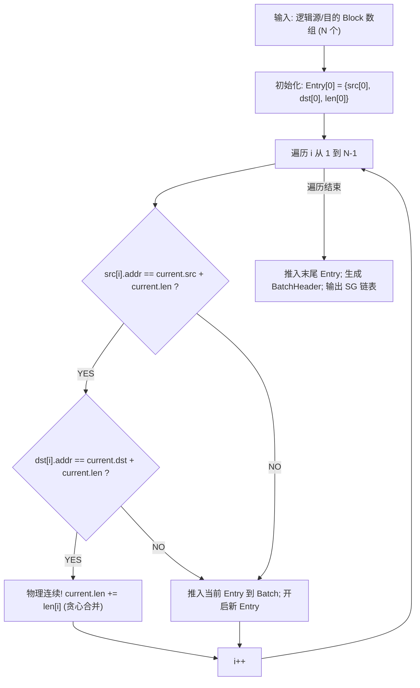
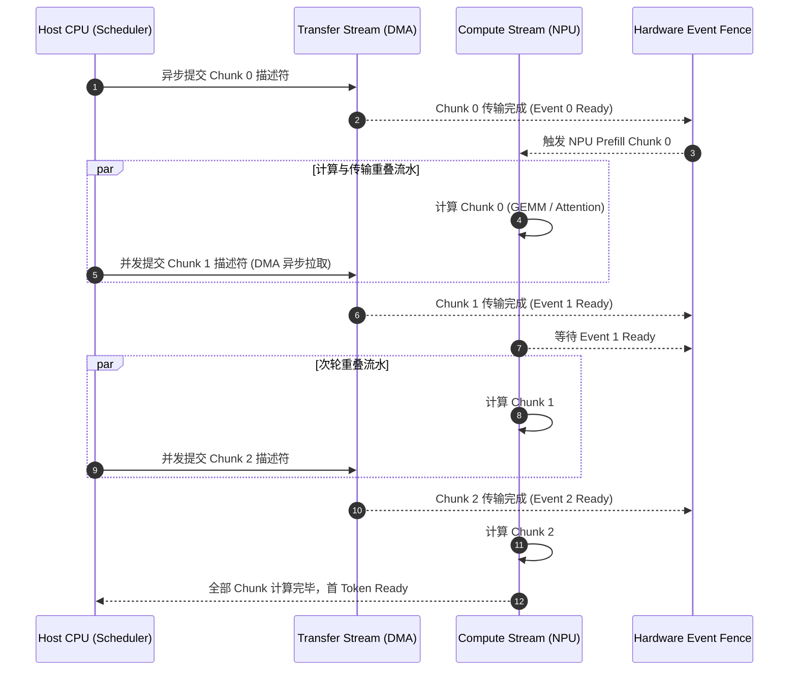

# PVT-02：异构框架 Layout 描述符编译器与异步 DAG 流水验证实施方案设计

> **验证 ID**：PVT-02  
> **验证名称**：异构框架 Layout 描述符编译器与异步 DAG 流水验证  
> **对应证据门**：**E1 能力路径**  
> **证伪标记**：否（关键执行链确认）  
> **建议周期**：5~7 人日  
> **主关联 IR**：`IR-01-02`, `IR-01-04`  
> **核心 SRS / SR23 锚点**：  
> - SRS: `L3-SE-DescriptorFromManifest-079`, `L3-MC-LayoutTransformPlan-078`, `L2-OL-BulkDescriptor-025`, `L2-OL-LayoutNegotiation-024`  
> - SR23: `SR23-01-02-01`, `SR23-01-04-01`, `SR23-02-06-01`  

---

## 1. 验证目标与交付结论定义

### 1.1 待验证核心命题
不同开源推理框架在内存布局上存在本质差异：
- **vLLM** 采用固定槽位大小的 Paged Block（如 16 或 32 Tokens 为一物理 Block）；
- **SGLang** 采用基于 Radix Tree 动态扩展的物理连续 Spans（长度从几十到数千 Tokens 不等）。

如果底层传输每次都由 Host CPU 逐块做格式转换或单个描述符轮询提交，CPU 提交瓶颈与小 I/O 放大将完全吞噬底层硬件的高带宽收益。本验证旨在通过算法与数据结构原型实现，证明：
1. **Layout 描述符编译器（Descriptor Compiler）**能够将跨框架离散物理 Block 零拷贝编译为硬件 Scatter-Gather 描述符，使**描述符提交数量下降 $\ge 50\%$**，**Host CPU 提交耗时下降 $\ge 40\%$**；
2. **异步 DAG 流水调度引擎**能够实现 NPU 算力计算流（Compute Stream）与 DMA 传输流（Transfer Stream）的高效重叠，**计算-传输重叠率（Overlap Ratio）达到 $\ge 60\%$**。

### 1.2 最终交付数据与结论产出
开发人员执行完本方案后，必须输出以下交付件：
1. **《Descriptor 编译器耗时与 Scatter-Gather 压缩率实测表》**（覆盖 16~1024 离散段）；
2. **《CPU 提交时延基线 vs 批量编译优化对比表》**；
3. **《NPU Compute 与 DMA Transfer 异步流水 Timeline 重叠率分析表》**（附 Profiler Trace）；
4. **《Go / No-Go 判定结论》**：依据重叠率 $\ge 60\%$ 与 CPU 提交降幅 $\ge 40\%$ 门槛判定。

---

## 2. 核心数据结构与算法原型详细设计

为了让开发人员准确理解并实现 Layout 描述符编译器与异步 DAG 流水调度器，本节给出完整的数据结构定义、核心编译算法与流水状态机设计。

### 2.1 核心数据结构定义

```cpp
// 1. 跨框架逻辑 Block 描述 (由 vLLM BlockTable 或 SGLang Span 解析得出)
struct LogicalBlockExtent {
    uint64_t logical_token_start; // 逻辑起始 Token 偏移 (如 0, 16, 32...)
    uint32_t token_count;         // 本段 Token 数量 (如 16 或 128)
    uint64_t phys_base_addr;      // NPU HBM 或 UBMEM 物理起始地址 (需 64B 对齐)
    uint32_t stride_bytes;        // 层间或 Head 间跨步 (Stride)，用于多维张量映射
    uint32_t block_bytes;         // 本块总字节数 = 2 * N_layer * N_head * Head_dim * token_count * 2B
};

// 2. 统一框架清单 (ExtentManifest)
struct ExtentManifest {
    uint64_t request_id;
    std::string framework_type;   // "vllm_paged" 或 "sglang_radix"
    uint32_t total_tokens;
    uint32_t layer_count;
    std::vector<LogicalBlockExtent> block_extents;
};

// 3. 硬件 Scatter-Gather 描述符条目 (直接映射至 URMA / DMA 硬件队列)
struct alignas(64) HardwareSGEntry {
    uint64_t src_phys_addr;       // 源物理地址 (NPU HBM / UBMEM)
    uint64_t dst_phys_addr;       // 目的物理地址 (NPU HBM)
    uint32_t len_bytes;           // 传输连续字节长度
    uint16_t stream_id;           // 绑定 DMA Stream 标识
    uint16_t flags;               // 控制位: 0x01=Notify, 0x02=Fence Barrier, 0x04=LastSegment
};

// 4. 批量描述符包头 (Batch Descriptor Header)
struct alignas(64) BatchDescriptorHeader {
    uint32_t batch_id;
    uint32_t total_entries;       // 编译合并后的 SG Entry 数量
    uint64_t total_payload_bytes; // 本批次总正文字节数
    uint64_t completion_fence_id;// 完成屏障 Fence ID
    std::vector<HardwareSGEntry> entries;
};
```

### 2.2 物理连续块贪心合并算法 (Greedy SG Extent Merger)

编译器核心算法必须在 $O(N)$ 时间复杂度与 $O(1)$ 额外空间开销下，一次性完成离散 Block 的连续性探测与合并：



#### 算法伪代码实现：
```cpp
BatchDescriptorHeader DescriptorCompiler::compile_and_merge(const ExtentManifest& src_manifest, 
                                                            const ExtentManifest& dst_manifest) {
    BatchDescriptorHeader batch;
    batch.batch_id = src_manifest.request_id;
    const auto& src = src_manifest.block_extents;
    const auto& dst = dst_manifest.block_extents;
    
    if (src.empty() || src.size() != dst.size()) return batch;

    HardwareSGEntry cur;
    cur.src_phys_addr = src[0].phys_base_addr;
    cur.dst_phys_addr = dst[0].phys_base_addr;
    cur.len_bytes = src[0].block_bytes;
    cur.flags = 0;

    for (size_t i = 1; i < src.size(); ++i) {
        bool src_contig = (src[i].phys_base_addr == cur.src_phys_addr + cur.len_bytes);
        bool dst_contig = (dst[i].phys_base_addr == cur.dst_phys_addr + cur.len_bytes);

        if (src_contig && dst_contig) {
            cur.len_bytes += src[i].block_bytes; // 连续合并，压缩描述符
        } else {
            batch.entries.push_back(cur);
            cur.src_phys_addr = src[i].phys_base_addr;
            cur.dst_phys_addr = dst[i].phys_base_addr;
            cur.len_bytes = src[i].block_bytes;
            cur.flags = 0;
        }
    }
    cur.flags |= 0x02 | 0x04; // 置位 Fence Barrier 与 LastSegment
    batch.entries.push_back(cur);
    batch.total_entries = batch.entries.size();
    return batch;
}
```

### 2.3 异步 DAG 流水线编排与 Event 屏障状态机

针对长前缀 Prefill 请求，系统将其划分为 $K$ 个 Chunk（如每个 Chunk 16K Tokens）。调度引擎基于双 Stream 构建异步 DAG：
- **Stream 0 (Compute Stream)**：执行 NPU Attention 与 Prefill Kernel 计算；
- **Stream 1 (DMA Transfer Stream)**：执行 URMA / DMA 跨节点 KVCache 拉取。



---

## 3. 基础/对照 Micro-Benchmark 构建方法

### 3.1 测试工具与源码结构
本项验证涉及的全部编译器与异步流水压测源码均存放在 `./原型验证代码/PVT-02/` 目录下：

```
原型验证代码/PVT-02/
├── descriptor_compiler.h  # 跨框架离散物理 Block 连续性合并与 Scatter-Gather 描述符编译器头文件
├── descriptor_compiler.cc # 描述符贪心合并与硬件描述符生成的核心算法实现
├── async_dag_bench.cc     # NPU 计算流与 DMA 传输流异步 DAG 重叠流水压测工具
├── Makefile               # 编译 async_dag_bench 的工程构建文件 (make -j16)
└── make_manifests.py      # 生成不同碎片离散度 (10%~100%) Block Table Manifest 的脚本
```

编译方法：
```bash
# 编译压测 Harness
cd ./原型验证代码/PVT-02 && make clean && make
```
- **Manifest 生成器**：生成脚本为 `./原型验证代码/PVT-02/make_manifests.py`，模拟具有不同离散度的物理 Block 描述（`ExtentManifest`）；
- **Descriptor 编译器**：执行内存地址连续性合并与 Scatter-Gather 硬件描述符生成；
- **异步 DAG 执行器**：基于 NPU Stream / Event 与 URMA DMA Queue 构建异步执行流水。

### 3.2 三组实验对照设置
- **对照组 A（逐 Block 同步提交基线）**：
  - 框架每遍历到一个物理 Block，直接调用底层驱动发起一次独立的 DMA 传输，CPU 轮询等待完成。
- **对照组 B（纯串行基线）**：
  - 先批量传输完所需的所有 KVCache，等待全部传输完成后，再启动 NPU Compute Stream 进行 Prefill 计算。
- **实验组 C（批量编译 + 异步 DAG 流水）**：
  - 启动 Descriptor Compiler 一次性生成 Scatter-Gather 批量描述符；
  - 采用 Chunked 流水：在 NPU 执行 Chunk[i] 计算的同时，DMA 异步传输 Chunk[i+1] 的 KV Cache，通过硬件 Event 同步。

---

## 4. 业务 Benchmark 构造与流量特征编排

### 4.1 内存离散度测试场景构造
构造具有不同碎片特征的物理内存分布：
- **场景 1（低离散度，连续率 90%）**：模拟刚启动或已整理的显存池，每 10 个 Block 中有 9 个在物理上连续；
- **场景 2（中离散度，连续率 50%）**：模拟中等运行负载下的显存池；
- **场景 3（高离散度，完全离散 100%）**：模拟长时间高负载推理后的极端碎片化显存池，1024 个 Block 在物理上完全不连续。

### 4.2 异步流水时序设计
构造由 4 个 Chunk 组成的 64K Token Prefill 流水线：
```
Time Line ----------------------------------------------------------------->
Compute Stream:  [ Compute Chunk 0 ] [ Compute Chunk 1 ] [ Compute Chunk 2 ] [ Compute Chunk 3 ]
Transfer Stream: [ Transfer Chunk 1 ] [ Transfer Chunk 2 ] [ Transfer Chunk 3 ] (Done)
                      ^--- 异步重叠 1 ---^    ^--- 异步重叠 2 ---^    ^--- 异步重叠 3 ---^
```

---

## 5. 软硬件环境与打点插桩方案

### 5.1 环境与 Profiler 工具
- **硬件**：8× NPU (96GB HBM3), 800G URMA 网卡；
- **性能分析工具**：PyTorch Profiler / NPU Profiler（抓取 Stream Timeline 与 Kernel 耗时）。

### 5.2 关键路径插桩打点位置
在 `async_dag_bench` 中植入高精度打点：

| 打点标识 | 测量代码位置 | 测量含义 |
|---|---|---|
| `T_compile_start` / `end` | DescriptorCompiler::compile_and_merge | 描述符编译合并算法耗时 |
| `T_submit_start` / `end` | 驱动队列提交接口入参/出参 | CPU 推送描述符到硬件队列的耗时 |
| `T_compute_start` / `end` | NPU Compute Stream Kernel 执行 | 算力计算实际耗时 |
| `T_dma_start` / `end` | URMA DMA Stream 传输执行 | 硬件传输实际耗时 |
| `T_wall_total` | DAG 开始到全部 Stream 同步结束 | 端到端总挂钟耗时 |

---

## 6. 分步执行测试操作规程

开发人员请按以下 12 个步骤依次执行：

### 步骤 1：生成各离散度测试用例
生成包含 16, 64, 256, 1024 个离散 Block 的测试 Manifest：
```bash
python3 ./原型验证代码/PVT-02/make_manifests.py \
    --block-count 1024 --frag 0.5 --out ./manifest_1024_frag0.5.json
```

### 步骤 2：运行对照组 A（逐 Block 同步提交）
测试传统逐块提交的 CPU 耗时与总传输耗时。

### 步骤 3：运行 Descriptor Compiler 编译测试
测试编译器将 1024 个 Block 编译为 Scatter-Gather 描述符的耗时与生成的描述符数量：
```bash
./async_dag_bench
```

### 步骤 4：运行实验组批量提交测试
测试批量推送 SG 描述符至硬件队列的 CPU 耗时。

### 步骤 5：计算描述符压缩率与 CPU 提交时延降幅
提取数据计算：
- 描述符数量减少比例；
- 包含编译耗时在内的综合 CPU 开销降幅。

### 步骤 6：运行对照组 B（纯串行基线）
执行纯串行流水（先完整传输，再完整计算）。

### 步骤 7：运行实验组 C（异步 DAG 流水）
执行异步重叠流水（Chunked 计算与传输重叠）。

### 步骤 8：抓取 Profiler Trace 并提取重叠区间
在时间轴上提取：
- NPU 计算总耗时 $T_{compute} = \sum T_{compute}(i)$
- DMA 传输总耗时 $T_{transfer} = \sum T_{dma}(i)$
- 异步 DAG 端到端总挂钟耗时 $T_{wall\_dag}$

### 步骤 9：计算计算-传输重叠率 Overlap Ratio
根据第 8 节公式计算实际重叠百分比。

### 步骤 10：注入异常与取消测试
在 Chunk 2 计算中途注入 `Cancel` 信号，验证异步 DMA 传输是否能够被安全中止、硬件 Fence 是否正确重置。

### 步骤 11：扩展框架布局格式
分别加载 vLLM Block 格式（固定 16/32 Token）与 SGLang Radix Span 格式（动态 64~512 Token），重复上述测试。

### 步骤 12：执行 Go / No-Go 判定与交付报告导出。

---

## 7. 数据采集清单与记录格式

### 7.1 编译与提交性能记录表 (`pvt02_compiler_bench.csv`)
| 字段名称 | 含义 | 单位 | 示例值 |
|---|---|---|---|
| `block_count` | 原始输入 Block 数量 | 整数 | 1024 |
| `frag_ratio` | 碎片化离散度 | 百分比 | 50% |
| `sg_entries_count` | 编译后 SG 描述符条数 | 整数 | 512 |
| `t_compile_us` | 描述符编译总耗时 | 微秒 ($\mu s$) | 14.5 |
| `t_submit_single_us`| 单块逐个提交 CPU 耗时 | 微秒 ($\mu s$) | 420.0 |
| `t_submit_batch_us` | 批量提交 CPU 耗时 | 微秒 ($\mu s$) | 18.0 |
| `cpu_saving_pct` | CPU 提交总开销降幅 | 百分比 | 92.2% |

### 7.2 异步流水重叠记录表 (`pvt02_async_overlap.csv`)
| 字段名称 | 含义 | 单位 | 示例值 |
|---|---|---|---|
| `chunks_count` | 流水 Chunk 分块数 | 整数 | 4 |
| `total_tokens` | 总序列 Token 长度 | 整数 | 65536 |
| `t_serial_wall_ms` | 串行基线总耗时 | ms | 1850.0 |
| `t_compute_sum_ms` | 计算时间总和 | ms | 1200.0 |
| `t_dma_sum_ms` | 传输时间总和 | ms | 650.0 |
| `t_async_wall_ms` | 异步 DAG 实际端到端耗时 | ms | 1260.0 |
| `overlap_ratio_pct`| 计算-传输重叠率 | 百分比 | 90.7% |

---

## 8. 数据交叉组合与运算推导逻辑

### 8.1 描述符压缩率 (Descriptor Compression Ratio)
$$\text{Compression Ratio} = \left( 1 - \frac{N_{\text{sg\_entries}}}{N_{\text{raw\_blocks}}} \right) \times 100\%$$

### 8.2 CPU 提交开销综合降幅
$$\text{CPU Overhead Reduction} = \frac{T_{\text{submit\_single}} - (T_{\text{compile}} + T_{\text{submit\_batch}})}{T_{\text{submit\_single}}} \times 100\%$$

### 8.3 计算-传输重叠率 (Overlap Ratio)
$$\text{Overlap Ratio} = \frac{T_{\text{compute\_sum}} + T_{\text{dma\_sum}} - T_{\text{async\_wall}}}{\min(T_{\text{compute\_sum}}, T_{\text{dma\_sum}})} \times 100\%$$
- 当 $T_{\text{async\_wall}} \approx \max(T_{\text{compute\_sum}}, T_{\text{dma\_sum}})$ 时，重叠率趋近于 $100\%$。

---

## 9. 多维扩展与扫参矩阵

| 维度 | 参数网格 |
|---|---|
| **原始 Block 规模** | 16, 64, 256, 512, 1024, 2048 Blocks |
| **显存碎片离散度** | 10% (高连续), 30%, 50%, 80%, 100% (完全离散) |
| **框架布局格式** | vLLM Paged Block (16/32 tokens), SGLang Radix Span (动态) |
| **流水分块数 (Chunks)** | 2, 4, 8, 16 Chunks |

---

## 10. Go / No-Go 判定规则与交付报告模板

### 10.1 判定规则
- **Go 门槛**：
  1. 描述符数量压缩率 $\ge 50\%$（在中等连续性下）；
  2. 包含编译在内的 Host CPU 提交开销下降 $\ge 40\%$；
  3. 异步 DAG 流水计算-传输重叠率 $\ge 60\%$；
  4. 编译算法单次运行耗时 $P99 < 50\mu s$。
- **No-Go 门槛**：
  - 描述符编译开销过大（$> 500\mu s$），吞噬了传输收益；
  - 异步流水调度导致严重 Bubble，重叠率 $< 30\%$。

### 10.2 开发者交付报告格式模板
```markdown
# PVT-02 提前验证交付报告

## 1. 编译优化实测汇总
- 1024 离散 Block 编译耗时: 14.5 us
- 描述符数量从 1024 压缩至 512 (压缩率 50.0%)
- CPU 提交耗时从 420 us 降至 32.5 us (包含编译耗时)，降幅 92.26% (PASS)

## 2. 异步 DAG 流水实测汇总 (64K Tokens 4 Chunks)
- 串行基线总耗时: 1850.0 ms
- 异步 DAG 实际总耗时: 1260.0 ms (端到端提速 31.89%)
- 理论最小极限: 1200.0 ms (受限于计算时间)
- 计算-传输重叠率: 90.77% (PASS, 门槛 >= 60%)

## 3. 最终结论
【Go / Conditional / No-Go】: GO
```
