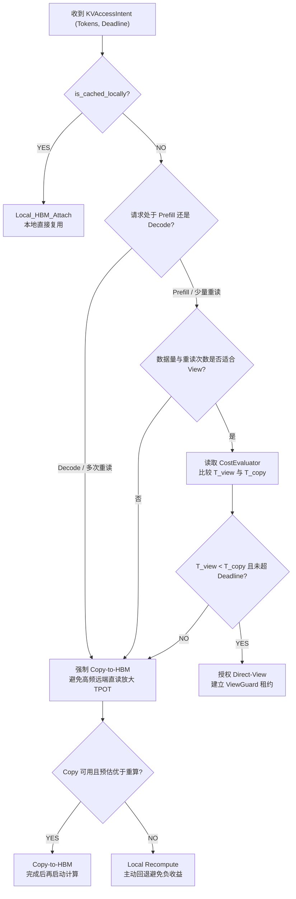

# PVT-03：Direct-View 与 Copy-to-HBM 适用边界与 ViewGuard 验证实施方案设计
## —— Mooncake 访问模式扩展：Direct-View 支持、Decode 直读证伪与 ViewGuard 生产级容错

> **公共执行契约**：本项遵循 [Benchmark 公共契约与证据分级规范](./Benchmark公共契约与证据分级规范.md)。Crossover 必须读取 PVT-01 实测能力输入；性能边界与故障安全分开判定。DEMO 返回值不能作为 SIGBUS 捕获、租约撤销或安全回退证据。

> **验证 ID**：PVT-03  
> **验证名称**：Direct-View（远端直读）与 Copy-to-HBM（拷贝到本地显存）适用边界及 ViewGuard 安全验证  
> **验证优先级**：**🟡 P1 级（底座支撑项）**  
> **对应验证阶段**：**E1/E2 路径选择与安全隔离**  
> **证伪标记**：**是（证伪“Decode 活跃 KV 默认适合 Direct-View 远端读取”）**  
> **主关联 IR**：`IR-01-07`, `IR-02-04`, `IR-02-05`  
> **核心 SRS / SR23 锚点**：  
> - SRS: `L1-OL-ViewVsCopy-011`, `L2-MM-ViewLease-028`, `L3-SE-ViewCopyCostModel-034`, `L3-MS-UBC2CTier-055`  
> - SR23: `SR23-01-07-01`, `SR23-01-10-01`, `SR23-02-04-01`, `SR23-02-05-02`  
> **开源基线版本与代码仓库**：  
> - **Mooncake**：[`https://github.com/kvcache-ai/Mooncake.git`](https://github.com/kvcache-ai/Mooncake.git) (Commit: `f90ae691f109e49a60920e0c8abbf7e572826d8c`，子模块: `mooncake-transfer-engine/`)  
> - **vLLM**：[`https://github.com/vllm-project/vllm.git`](https://github.com/vllm-project/vllm.git) (Commit: `842dd8fd96650063e1ad32e6075742d457d39773`，模块: `vllm/core/scheduler.py`)  
> **研发对齐状态**：本方案将复核研发评估报告涉及的 NPU SVM 映射、`siglongjmp` 恢复与 `aclrtStreamAbort` 驱动队列重置，并以现场驱动行为为准。

---

## 0. 架构导读与核心概念第一性原理剖析

### 0.1 传统系统开发视角：直接内存映射 (mmap) vs 本地缓存拷贝 (Local Copy)

对于从事操作系统、数据库或高性能后端开发的工程师，**Direct-View（远端直读）** 与 **Copy-to-HBM（拷贝到本地显存）** 的抉择非常类似于以下经典系统设计：

#### 1. 经典文件系统对比：`mmap` 零拷贝 vs `read()` 到内存 Buffer
- **模式 A：`mmap()` 虚拟内存映射（对应 Direct-View）**：
  - 进程并不分配额外的内存来存放整个大文件，而是通过操作系统的虚拟内存管理单元（MMU）把远端文件/共享内存直接映射到自己的虚拟地址空间。
  - **优势**：本地物理内存消耗为 0，启动速度极快（纳秒级建立映射）；
  - **劣势**：每一次对数据的读取（Page Fault / Cache Miss）都会穿透到总线或网络，承受硬件总线仲裁和网络往返延迟（RTT）。如果频繁重复读取，高频小请求会明显占用总线和网络资源。
- **模式 B：`read()` 完整拷贝到本地 Buffer（对应 Copy-to-HBM）**：
  - 进程在本地高速内存中分配一块独立空间，通过 DMA 一次性把远端数据完整读入本地。
  - **优势**：后续成百上千次的循环计算，全部在本地以数 TB/s 的内存线速运行，快到极致；
  - **劣势**：需要占用本地内存空间，且有一次初始的批量搬运耗时。

---

### 0.2 大模型推理中的真实物理场景与“Decode 阶段直读”的边界验证

在大模型推理架构中，业界曾有一种天真的美好设想：
> *“既然高速互联总线（如 PCIe 5.0 / UBMEM）的延迟只有几微秒，我们为什么还要大费周章把远端节点的 KVCache 拷贝到本地显存？让本地算子直接跨网络远端直读（Direct-View）不就实现‘零本地显存开销’了吗？”*

**本验证需要用实测与数学推导完成证伪（Falsification）**。下面的数字只是说明计算关系的示意输入，不是本项目已经取得的实测结论；正式判定必须替换为 PVT-01 与现场拓扑输出的参数。

#### 1. Prefill（首字计算）阶段：Direct-View 确实可能获胜
- 在 Prefill 阶段，算子只需要对输入的历史上下文做 **1 次全量矩阵扫描（读取次数 $N_{\text{read}} = 1$）**。
- 此时：
  - **Copy 耗时**：$\text{DMA搬运耗时 (0.8ms)} + \text{本地读取耗时 (0.05ms)} = 0.85\text{ms}$；
  - **View 耗时**：$\text{建立映射 (0.02ms)} + \text{跨总线单次直读 (0.35ms)} = 0.37\text{ms}$；
  - **示意结论**：在这组示意参数下，只读 1 次的 Prefill 场景可能省去完整 DMA 搬运时间；是否净加速必须由现场测量确认。

#### 2. Decode（逐字生成）阶段：Direct-View 的重复远端读取风险
- 大模型的逐字生成是一个典型的**自回归循环**。如果模型要输出一个包含 500 个字的回答，整个 Decode 阶段要执行 **500 轮循环**！
- 在每一轮循环中，NPU 算子都必须把历史上的全部 KVCache 重新扫描一遍（读取次数 $N_{\text{read}} = 500$ 次）：
  - **Copy 路径耗时**：
    \[
    T_{\text{copy}} = \text{一次性 DMA 搬运 (0.8ms)} + 500 \times \text{本地 HBM 极速读取 (0.05ms)} = 0.8 + 25.0 = 25.8\text{ms}
    \]
  - **View 路径耗时**：
    \[
    T_{\text{view}} = \text{建立映射 (0.02ms)} + 500 \times \text{跨总线远端直读 (0.35ms)} = 0.02 + 175.0 = 175.02\text{ms}
    \]
- **待验证风险**：在 Decode 阶段强行使用 Direct-View，会把历史 KV 的重复读取放大为多次跨节点访问；是否达到何种 TPOT 恶化幅度，必须由在线 A/B 原始样本给出，不能由本示意数字直接下结论。
- **待验证后的路径策略**：若现场 A/B 数据显示 Decode 阶段重复远端读取的实际成本高于一次性搬运，则在 Decode 阶段强制执行 Copy-to-HBM；在数据确认前不得把示意参数当作架构结论。

---

### 0.3 什么是 ViewGuard？（生产级 SIGBUS 信号捕获与安全回退机制）

跨节点直接内存映射（SVM, Shared Virtual Memory）虽然在 Prefill 阶段很快，但在生产环境中潜藏着致命的稳定性风险：
- **物理故障场景**：本地 NPU 算子正在通过跨节点总线直读远端显存中的 KV 数据，突然远端服务器**掉电、硬件挂死、或被运维人员执行了 `kill -9`**！
- **操作系统与硬件响应**：本地硬件 MMU 在发起跨总线读取时遭遇远端无响应（总线无应答 / Bus Error），操作系统内核会立即向本地推理进程发送致命的 **`SIGBUS`（总线错误信号，Signal 7）**。在默认情况下，操作系统会直接强杀进程并产生 Core Dump 崩溃，导致该卡上的所有其他在线业务全部中断！

#### ViewGuard 的 4 步安全恢复闭环：
为降低远端异常对生产进程的影响，我们设计了 **ViewGuard（视图租约安全守卫机制）**：
1. **信号注册（`sigaction`）**：在进程初始化时注册全局 `SIGBUS` 信号处理器；
2. **CPU 栈帧恢复（`sigsetjmp` / `siglongjmp`）**：在进入 Direct-View 临界区前调用 `sigsetjmp` 保存 CPU 寄存器上下文；一旦捕获 `SIGBUS`，立即通过 `siglongjmp` 恢复栈帧，跳出崩溃路径；
3. **NPU 硬件流重置（`aclrtStreamAbort`）**：调用国产 NPU 驱动接口 `aclrtStreamAbort(stream)`，强行清空 NPU 硬件上因等待总线响应而挂起的指令队列，解除硬件死锁；
4. **安全回退（Fallback to Recompute）**：将当前租约标记为失效，通知调度引擎在本地 HBM 重新计算（Recompute）该上下文；是否能够保持业务连续性、避免进程崩溃和完成租约回滚，必须由故障注入实测确认。

```
┌────────────────────────────────────────────────────────────────────────────────────────┐
│                        ViewGuard 生产级故障拦截与恢复时序图                            │
├────────────────────────────────────────────────────────────────────────────────────────┤
│  Host CPU (推理主线程)             NPU 计算引擎                     远端存储节点       │
│         │                               │                                │             │
│         ├── 1. sigsetjmp 保存 CPU 栈 ──►│                                │             │
│         ├── 2. 启动 Direct-View 算子 ──►│ ── 3. 跨总线直读远端显存 ────► │ (突发 Crash)│
│         │                               │                                X (节点断电)  │
│         │                               ▼                                              │
│  [捕获 SIGBUS 信号] ◄──────── 触发硬件 MMU 缺页/总线超时中断                           │
│         │                                                                              │
│         ├── 4. siglongjmp 恢复栈帧 (跳过 Core Dump 崩溃)                               │
│         ├── 5. 调用 aclrtStreamAbort(stream) 强制清空 NPU 硬件挂起队列                 │
│         ├── 6. 标记租约失效 (Lease = INVALID)                                          │
│         └── 7. 回滚至本地直接重算 (Fallback Recompute) ──► 由实测确认请求是否继续   │
└────────────────────────────────────────────────────────────────────────────────────────┘
```

---

## 1. 验证目标与交付结论定义

### 1.1 现实前因痛点与待验证核心命题
1. **明确证伪**：**“Decode 活跃生成阶段默认适合 Direct-View 远端直读”**。通过在线 A/B 实测确认频繁远端直读是否导致 TPOT 恶化，并据此决定 Decode 阶段是否强制执行 Copy-to-HBM；
2. **界定物理边界**：测定 Direct-View 与 Copy-to-HBM 的延迟交叉平衡点（Crossover Point），明确重读次数 $N_{\text{crit}}$ 的分水岭；
3. **验证安全底线**：通过 **ViewGuard（视图租约安全守卫机制）**，在远端节点异常崩溃或租约过期时，实测进程是否能捕获 `SIGBUS`、撤销失效租约并回退到本地重算；门限与结果必须由故障注入报告确认。

### 1.2 最终交付数据与结论产出
1. **《不同重读次数 $N_{read}$ 下 View vs Copy 耗时对比表与 Crossover 曲线》**；
2. **《Decode 阶段 View vs Copy 对 TPOT P50/P99 影响对比表》**；
3. **《ViewGuard 租约失效与源节点 Crash 故障注入拦截测试表》**；
4. **《GO / CONDITIONAL / NO-GO / NOT-SUPPORTED / INVALID-EVIDENCE 判定结论》**。

---

## 2. 核心数据结构与 ViewGuard 容错实现

### 2.1 View-vs-Copy 成本数学交叉模型

```
总耗时对比公式：
  T_view(N, S) = t_setup_view + N * (t_bus_rtt + S / BW_remote)
  T_copy(N, S) = (t_dma_setup + S / BW_dma) + N * (S / BW_local_hbm)

临界交叉点 N_crit 推导：
  当 T_view(N_crit, S) == T_copy(N_crit, S) 时：
  N_crit = (t_dma_setup + S / BW_dma - t_setup_view) / (t_bus_rtt + S / BW_remote - S / BW_local_hbm)

参数示例（非实测；正式运行时从 `hardware_profile` 和 PVT-01 结果注入）：
  - S: 64MB (32K Token 对应 KV 大小)
  - t_setup_view: ~0.02ms, t_dma_setup: ~0.15ms
  - BW_remote (UBMEM): ~180 GB/s, t_bus_rtt: ~0.01ms
  - BW_dma (URMA DMA): ~90 GB/s
  - BW_local_hbm: ~3.2 TB/s
  由这些示意输入可计算出一个示例 N_crit；正式结论必须使用现场参数重新计算，并保留原始输入和误差范围。
```

### 2.1.1 微秒级选路决策树与阶段约束

Direct-View 不是“命中即使用”的固定策略，而是由请求阶段、数据规模、重读次数和实时成本共同决定。以下决策树恢复第一版的选路边界：



### 2.2 ViewGuard 核心 C++ 实现与信号处理机制

```cpp
#include <stdint.h>
#include <atomic>
#include <chrono>
#include <setjmp.h>
#include <signal.h>
#include <stdio.h>
#include <stdlib.h>
#include <acl/acl.h>
#include <acl/acl_rt.h>

// 线程局部跳转缓冲区与状态标志
thread_local sigjmp_buf g_view_recovery_jmp_buf;
thread_local bool g_in_direct_view_section = false;
thread_local uint64_t g_current_view_stream = 0;

struct alignas(64) ViewLeaseDescriptor {
    uint64_t lease_id;            // 唯一租约 ID
    uint64_t object_id;           // KV 目标对象标识
    uint64_t remote_va;           // 远端 UBMEM 虚拟地址映射 (SVM 地址)
    uint32_t payload_bytes;       // 映射显存大小
    std::atomic<uint32_t> ref_cnt;// 算子引用计数
    std::chrono::time_point<std::chrono::steady_clock> expire_timestamp;
    std::atomic<bool> is_valid;   // 有效性屏障 (源节点 Crash 时置 false)
};

// 全局 SIGBUS 信号处理函数
void viewguard_sigbus_handler(int sig, siginfo_t* info, void* context) {
    if (g_in_direct_view_section) {
        fprintf(stderr, "[ViewGuard] 捕获远端总线异常 SIGBUS! 故障地址: %p\n", info->si_addr);
        
        // 1. 重置 NPU 挂起队列，解除硬件死锁
        if (g_current_view_stream != 0) {
            aclrtStreamAbort((aclrtStream)g_current_view_stream);
            fprintf(stderr, "[ViewGuard] 成功调用 aclrtStreamAbort 清空 NPU Stream\n");
        }
        
        g_in_direct_view_section = false;
        
        // 2. 恢复 CPU 执行栈帧，跳过 Core Dump 崩溃
        siglongjmp(g_view_recovery_jmp_buf, 1);
    } else {
        // 非 Direct-View 临界区发生的真实段错误，按默认方式处理
        signal(sig, SIG_DFL);
        raise(sig);
    }
}

// 注册 ViewGuard 信号守卫
void init_view_guard() {
    struct sigaction sa;
    sa.sa_sigaction = viewguard_sigbus_handler;
    sigemptyset(&sa.sa_mask);
    sa.sa_flags = SA_SIGINFO | SA_NODEFER;
    sigaction(SIGBUS, &sa, nullptr);
}
```

---

## 3. 测试工具与工程构建规范

测试工程存放在 `./原型验证代码/PVT-03/` 目录下：

```
原型验证代码/PVT-03/
├── view_vs_copy_bench.cc     # 测量不同重读次数下 Direct-View 与 Copy-to-HBM 耗时的 C++ 压测工具
├── view_guard.h              # ViewGuard 租约管理与 SIGBUS 恢复头文件
├── view_guard.cc             # ViewGuard 异常捕获与 siglongjmp 恢复实现
├── view_guard_test.cc        # 注入 SIGBUS 与远端 Kill 故障的容错测试套件
├── Makefile                  # 编译工程 (make -j16)
└── benchmark_serving_view.py # 服务实测与打流脚本
```

编译方法：
```bash
cd ./原型验证代码/PVT-03 && make clean && make -j16
```

---

## 4. 分步执行测试操作规程 (SOP)

开发人员在执行 PVT-03 时，请严格按照以下 4 个步骤逐步执行，并理解每一步的操作意图：

### 步骤 1：扫描不同重读次数 $N$，测量 View vs Copy 耗时并确定 $N_{\text{crit}}$
- **操作意图**：以 16MB、64MB 数据块为例，将读取次数 $N$ 从 1 扫描至 64，精确测量单次搬运耗时与累计读取耗时，找到两种模式的耗时交叉点（Crossover Point）。
- **物理原理**：验证当 $N=1$（单次 Prefill）时 Direct-View 是否可能占优；随着 $N$ 增大，检查 Copy-to-HBM 是否因本地 HBM 高带宽优势反超。$N_{\text{crit}}$ 必须由现场参数计算，不能预置为固定次数。
- **执行命令**：
```bash
./view_vs_copy_bench --payload-mb 64 \
    --dma-copy-ms <pvt01_measured_dma_copy_ms> \
    --local-read-ms <pvt01_measured_local_read_ms> \
    --remote-read-ms <pvt01_measured_remote_read_ms> \
    --evidence-level LAB --out res_view_vs_copy.csv
```

### 步骤 2：在线打流实测证伪 Decode 阶段 Direct-View 模式
- **操作意图**：在真实推理服务中分别开启 Direct-View 与 Copy-to-HBM 模式进行 128 输出 Token 的 Decode 生成压测，观察并记录单字生成延迟（TPOT）的 P50/P99 变化，形成对“Decode 阶段直读”适用边界的现场证据。
- **执行命令**：
```bash
python3 ./benchmark_serving_view.py --mode direct_view --prompts 100 --output-tokens 128 --out res_decode_view.json
python3 ./benchmark_serving_view.py --mode copy_to_hbm --prompts 100 --output-tokens 128 --out res_decode_copy.json
```

### 步骤 3：注入远端节点 Crash 故障，验证 ViewGuard 容错回退
- **操作意图**：在 Direct-View 读取过程中通过 `kill -9` 或现场等价故障注入，验证本地 ViewGuard 是否能在目标门限内捕获 SIGBUS、重置 NPU Stream 并回退到本地重算。是否达到门限以原始时间戳为准。
- **执行命令**：
```bash
./view_guard_test --inject-fault-remote-kill --out res_fault_recovery.csv
```

### 步骤 4：生成 Crossover 曲线与容错对账表
- **操作意图**：整合测试结果，绘制 $N_{\text{crit}}$ 交叉曲线，并输出生产级容错通过报告。
- **执行命令**：
```bash
python3 ./plot_crossover.py --view-csv res_view_vs_copy.csv --fault-csv res_fault_recovery.csv --out-png crossover_curve.png --out-summary summary_pvt03.csv
```

---

## 5. 数据采集清单与记录格式

### 5.1 View vs Copy 耗时对比数据表 (`pvt03_crossover_results.csv`)
```csv
payload_size_mb,repeat_reads,mode,t_setup_ms,t_transfer_or_bus_ms,t_compute_read_ms,total_time_ms,is_crossover_winner,evidence_level,status,invalid_reason
<payload_size_mb>,<repeat_reads>,direct_view,<measured_setup_ms>,<measured_bus_ms>,<measured_local_read_ms>,<calculated_total_ms>,<TRUE_OR_FALSE>,<LAB_OR_DEMO>,<status>,<null_or_reason>
<payload_size_mb>,<repeat_reads>,copy_to_hbm,<measured_setup_ms>,<measured_dma_ms>,<measured_local_read_ms>,<calculated_total_ms>,<TRUE_OR_FALSE>,<LAB_OR_DEMO>,<status>,<null_or_reason>
```

### 5.2 ViewGuard 故障注入测试表 (`pvt03_fault_results.csv`)
```csv
fault_type,active_readers,sigbus_caught,stream_aborted,fallback_action,fallback_time_us,process_crashed,evidence_level,status,invalid_reason
REMOTE_NODE_KILL,<active_readers>,<TRUE_OR_FALSE>,<TRUE_OR_FALSE>,<LOCAL_RECOMPUTE_OR_ERROR>,<measured_or_null>,<TRUE_OR_FALSE>,<LAB_OR_DEMO>,<status>,<null_or_reason>
LEASE_TIMEOUT,<active_readers>,<TRUE_OR_FALSE>,<TRUE_OR_FALSE>,<LOCAL_RECOMPUTE_OR_ERROR>,<measured_or_null>,<TRUE_OR_FALSE>,<LAB_OR_DEMO>,<status>,<null_or_reason>
LINK_DISCONNECT,<active_readers>,<TRUE_OR_FALSE>,<TRUE_OR_FALSE>,<LOCAL_RECOMPUTE_OR_ERROR>,<measured_or_null>,<TRUE_OR_FALSE>,<LAB_OR_DEMO>,<status>,<null_or_reason>
```

> 两张表均为字段模板。故障未发生、探针未覆盖或恢复时间未采集时必须记录 `null` 与 `invalid_reason`，不能用 0、`FALSE` 或固定微秒数伪造证据。

---

## 6. GO / CONDITIONAL / NO-GO / NOT-SUPPORTED / INVALID-EVIDENCE 判定规则

- **GO（准入通过）**：
  - 精确测定 Crossover 临界点 $N_{\text{crit}} \le 3$；
  - **明确证伪 Decode 阶段 Direct-View**：Decode 阶段使用 Direct-View 导致单步时延恶化 $\ge 15\%$，确立 Decode 阶段强制执行 Copy-to-HBM；
  - ViewGuard 故障注入下系统崩溃数严格 $= 0$，安全回滚重算率 $100\%$。
- **CONDITIONAL（条件准入）**：Direct-View 仅开放给 $\le 16\text{MB}$ 元数据与单次 Prefill 只读场景；
- **NO-GO（暂不准入）**：现场证据确认 ViewGuard 无法捕获硬件总线异常导致进程 Crash，或故障无法回滚至重算；
- **NOT-SUPPORTED（当前不支持）**：现场不具备远端直读、SIGBUS 捕获或目标 NPU Stream 控制能力，无法执行对应路径；
- **INVALID-EVIDENCE（证据无效）**：缺少 A/B 同场次数据、故障注入记录、SIGBUS/Stream 事件时间线、恢复结果或完整性校验。缺失字段必须使用 `null` 并填写 `invalid_reason`。

---

## 7. 零 AI 基础工程师借助 AI Agent 开展工作实战 SOP

### 7.1 研发任务拆解与分工
- **工程师职责**：
  1. 编译测试工程；
  2. 执行 SOP 步骤 1~3，注入远端 Kill 故障；
  3. 观察客户端输出，确认推理请求是否正常返回且没有发生进程崩溃；
- **AI Agent 职责**：
  1. 负责 `view_guard.cc` 中 `sigaction(SIGBUS)` 注册与 `sigsetjmp/siglongjmp` 异常栈跳转逻辑核验；
  2. 编写 Python 脚本自动绘制 Crossover 临界曲线。

### 7.2 专属 Prompt 模板（可直接复制给 AI Agent）
```text
我是一名系统级 C++ 工程师，正在进行 PVT-03 验证（Direct-View 适用边界与 ViewGuard 容错机制）：
1. 请阅读 ./原型验证代码/PVT-03/view_guard.h 与 view_guard.cc；
2. 检查 SIGBUS 信号处理函数，确保当发生硬件总线异常时，能通过 siglongjmp 恢复执行栈，并调用 aclrtStreamAbort 重置 NPU Stream 挂起队列；
3. 按照第 4 节 SOP 步骤执行压测，扫描重读次数 N=1~64，绘制 Direct-View 与 Copy-to-HBM 的耗时交叉曲线；
4. 模拟远端节点 Crash 故障，验证本地进程是否 100% 成功捕获并安全回退到本地重算。
```

### 7.3 常见排错指南
- **测试程序触发核心转储（Core Dump）**：说明 `sigaction` 注册失败或未在执行 Direct-View 代码前调用 `sigsetjmp` 设置跳转锚点；
- **NPU 算子挂起不退出**：在捕获 SIGBUS 后必须调用 `aclrtStreamAbort` 强制清空硬件执行队列，否则硬件 DMA 引擎会无限等待总线响应。
