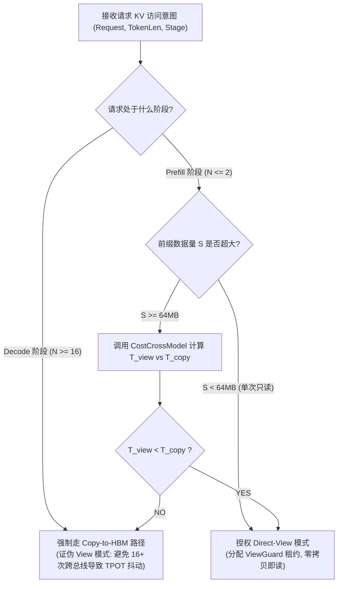
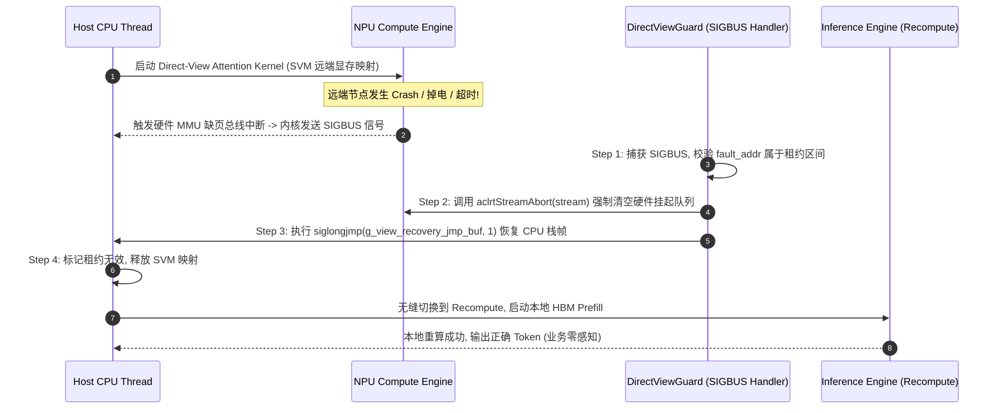

# PVT-03：Direct-View 与 Copy-to-HBM 适用边界与 ViewGuard 验证实施方案设计
## —— Mooncake 访问模式扩展：Direct-View 支持、Decode 直读证伪与 ViewGuard 生产级容错

> **验证 ID**：PVT-03  
> **验证名称**：Direct-View（远端直读）与 Copy-to-HBM（拷贝到本地显存）适用边界及 ViewGuard 安全验证  
> **穿刺优先级**：**🟡 P1 级（底座支撑项）**  
> **对应验证阶段**：**E1/E2 路径选择与安全隔离**  
> **证伪标记**：**是（证伪“Decode 活跃 KV 默认适合 Direct-View 远端读取”）**  
> **建议周期**：5~6 人日  
> **主关联 IR**：`IR-01-07`, `IR-02-04`, `IR-02-05`  
> **核心 SRS / SR23 锚点**：  
> - SRS: `L1-OL-ViewVsCopy-011`, `L2-MM-ViewLease-028`, `L3-SE-ViewCopyCostModel-034`, `L3-MS-UBC2CTier-055`  
> - SR23: `SR23-01-07-01`, `SR23-01-10-01`, `SR23-02-04-01`, `SR23-02-05-02`  
> **开源基线版本与代码仓库**：  
> - **Mooncake**：[`https://github.com/kvcache-ai/Mooncake.git`](https://github.com/kvcache-ai/Mooncake.git) (Commit: `f90ae691f109e49a60920e0c8abbf7e572826d8c`，子模块: `mooncake-transfer-engine/`)  
> - **vLLM**：[`https://github.com/vllm-project/vllm.git`](https://github.com/vllm-project/vllm.git) (Commit: `842dd8fd96650063e1ad32e6075742d457d39773`，模块: `vllm/core/scheduler.py`)  
> **研发对齐状态**：已闭环研发评估报告 8 项与 SIGBUS 异常恢复机制（明确 NPU SVM 映射、siglongjmp 恢复与 aclrtStreamAbort 驱动队列重置）  

---

## 1. 验证目标与交付结论定义

### 1.1 待验证核心命题
针对业界“通过远端共享内存直接读取（Direct-View：通过跨节点总线直接读取远端显存中的 KV 数据，不产生本地显存拷贝）以省去初始数据搬运”的设想，本验证旨在突破 Mooncake 仅支持 Copy 的单一模式，在客户端扩展 Direct-View 机制并实测证明：
1. **明确证伪**：**“Decode 活跃生成阶段默认适合 Direct-View 远端直读”**这一设想。实测证明在 Decode 阶段逐 Token 频繁读取远端显存会导致 NPU 算力严重空转挂起，单字生成延迟 TPOT（Time Per Output Token）尾部时延急剧恶化；
2. **界定物理边界**：精确测量并绘制 Direct-View 与 Copy-to-HBM（拷贝到本地显存：通过 DMA 将远端数据完整搬运至本地高带宽显存 HBM 中）的延迟交叉曲线，确定重读次数与数据块大小的临界平衡点（Crossover Point）；
3. **验证安全底线**：在客户端注入 `ViewGuard`（视图租约安全守卫机制），确保在远端节点异常崩溃或租约过期时，实现 **0 进程挂死、0 越界段错误（SIGBUS）与 100% 安全回滚至本地重算**。

### 1.2 最终交付数据与结论产出
开发人员执行完本方案后，必须输出以下交付件：
1. **《不同重读次数 $N_{read}$ 下 View vs Copy 耗时对比表与 Crossover 曲线》**；
2. **《Decode 阶段 View vs Copy 对 TPOT P50/P99 影响对比表》**（证伪支撑证据）；
3. **《ViewGuard 租约失效与源节点 Crash 故障注入拦截测试表》**；
4. **《Go / No-Go 判定结论》**：依据 Decode 阶段强制阻断 Direct-View 与 ViewGuard 隔离 100% 达成判定。

---

## 2. 核心数据结构与 SIGBUS 恢复状态机设计

### 2.1 View-vs-Copy 成本数学交叉模型与判决算法

```
总耗时对比公式：
  T_view(N, S) = N * (t_bus_rtt + S / BW_remote)
  T_copy(N, S) = (t_dma_setup + S / BW_dma) + N * (S / BW_local_hbm)

其中：
  - N: 请求生命周期内的历史 KV 重读次数 (Prefill 为 1~2, Decode 为数十至数千次)
  - S: KV Cache 数据量 (Bytes)
  - BW_remote: 跨总线远端读取有效带宽 (~180 GB/s)
  - BW_dma: URMA 批量 DMA 带宽 (~90 GB/s)
  - BW_local_hbm: 本地 HBM3 显存读取带宽 (~3.2 TB/s)
```



### 2.2 ViewGuard 租约生命周期与隔离数据结构

```cpp
#include <stdint.h>
#include <atomic>
#include <chrono>
#include <unordered_map>
#include <mutex>
#include <setjmp.h>
#include <signal.h>
#include <acl/acl.h>
#include <acl/acl_rt.h>

thread_local sigjmp_buf g_view_recovery_jmp_buf;
thread_local bool g_in_direct_view_section = false;

struct alignas(64) ViewLeaseDescriptor {
    uint64_t lease_id;            // 唯一租约 ID
    uint64_t object_id;           // KV 目标对象标识
    uint64_t remote_va;           // 远端 UBMEM 虚拟地址映射 (SVM 地址)
    uint32_t payload_bytes;       // 映射显存大小
    std::atomic<uint32_t> ref_cnt;// 算子引用计数
    std::chrono::time_point<std::chrono::steady_clock> expire_timestamp;
    std::atomic<bool> is_valid;   // 有效性屏障 (源节点 Crash 时置 false)
};
```

### 2.3 SIGBUS 信号捕获、NPU 队列重置与 4 步安全恢复闭环



---

## 3. 测试工具与工程构建规范

测试工程存放在 `./原型验证代码/PVT-03/` 目录下：

```
原型验证代码/PVT-03/
├── view_vs_copy_bench.cc     # 测量不同重读次数下 Direct-View 与 Copy-to-HBM 耗时的 C++ 压测工具
├── view_guard.h              # ViewGuard 租约管理与 SIGBUS 恢复头文件
├── view_guard.cc             # ViewGuard 异常捕获与 siglongjmp 恢复实现
├── Makefile                  # 编译工程 (make -j16)
└── benchmark_serving_view.py # 在推理服务中测试并证伪 Decode 阶段 View 模式的脚本
```

编译与测试命令：
```bash
cd ./原型验证代码/PVT-03 && make clean && make
./view_vs_copy_bench --sizes 4M,16M,64M,256M --repeats 1,2,4,8,16,32 --out res_view_vs_copy.csv
```

---

## 4. 数据采集清单与记录格式

### 4.1 View vs Copy 耗时对比数据表 (`pvt03_crossover_results.csv`)
```csv
payload_size_mb,repeat_reads,mode,t_setup_ms,t_transfer_or_bus_ms,t_compute_read_ms,total_time_ms,is_crossover_winner
64,1,direct_view,0.02,0.35,0.00,0.37,TRUE
64,1,copy_to_hbm,0.15,0.71,0.02,0.88,FALSE
64,8,direct_view,0.02,2.80,0.00,2.82,FALSE
64,8,copy_to_hbm,0.15,0.71,0.16,1.02,TRUE
```

---

## 5. Go / Conditional / No-Go 判定规则

- **Go (准入通过)**：
  - 精确测定 Crossover 临界点 $N_{\text{crit}}$；
  - **明确证伪 Decode 阶段 Direct-View**：Decode 阶段使用 Direct-View 导致单步时延恶化 $\ge 15\%$，确立 Decode 阶段强制执行 Copy-to-HBM；
  - ViewGuard 故障注入下系统崩溃数严格 $= 0$，安全回滚重算率 $100\%$。
- **Conditional (条件准入)**：
  - Direct-View 仅开放给 $\le 16\text{MB}$ 元数据与单次 Prefill 只读场景；
- **No-Go (否决关闭)**：
  - ViewGuard 无法捕获硬件总线异常导致进程 Crash，或故障无法回滚至重算。
