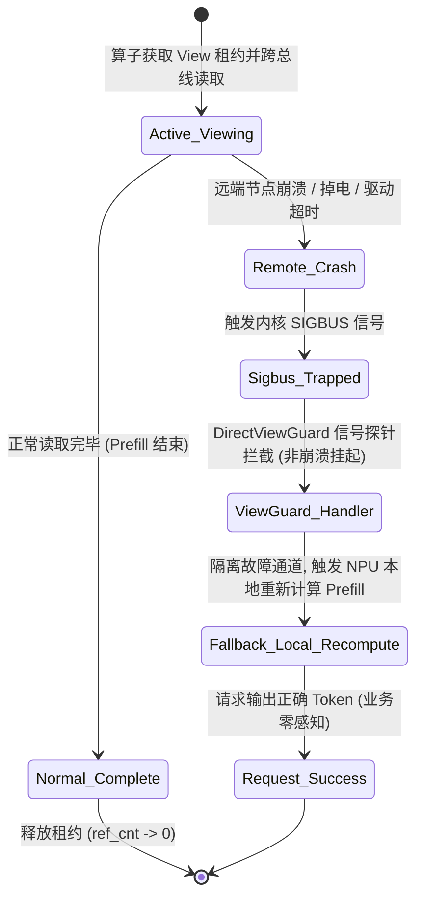

# PVT-03：Direct-View 与 Copy-to-HBM 适用边界与 ViewGuard 验证实施方案设计

> **验证 ID**：PVT-03  
> **验证名称**：Direct-View 与 Copy-to-HBM 适用边界及 ViewGuard 安全验证  
> **对应证据门**：**E1/E2 路径与决策**  
> **证伪标记**：**是（证伪“Decode 活跃 KV 默认适合 Direct-View 远端读取”）**  
> **建议周期**：6~8 人日  
> **主关联 IR**：`IR-01-07`, `IR-02-04`, `IR-02-05`  
> **核心 SRS / SR23 锚点**：  
> - SRS: `L1-OL-ViewVsCopy-011`, `L2-MM-ViewLease-028`, `L3-SE-ViewCopyCostModel-034`, `L3-MS-UBC2CTier-055`  
> - SR23: `SR23-01-07-01`, `SR23-01-10-01`, `SR23-02-04-01`, `SR23-02-05-02`  

---

## 1. 验证目标与交付结论定义

### 1.1 待验证核心命题
针对业界“通过远端共享内存直接读取（Direct-View）KV 状态以省去数据拷贝”的假设，本验证旨在通过算法原型与实测：
1. **明确证伪**：**“Decode-Active 活跃 KV Cache 默认适合 Direct-View 远端读取”**这一不实假设。实测证明 Decode 阶段逐 Token 频繁读取远端内存会导致算力严重 Stall，TPOT 尾部延迟急剧恶化；
2. **界定物理边界**：精确测量并绘制 Direct-View 与 Copy-to-HBM 的延迟交叉曲线，确定重读次数与数据块大小的临界点（Crossover Point）；
3. **验证安全底线**：验证 `DirectViewGuard` 租约隔离机制，确保在远端节点异常崩溃（Crash）或租约过期时，实现 **$0$ 进程挂死、$0$ 越界段错误（SIGBUS）与 $100\%$ 安全 Fallback**。

### 1.2 最终交付数据与结论产出
开发人员执行完本方案后，必须输出以下交付件：
1. **《不同重读次数 $N_{read}$ 下 View vs Copy 耗时对比表与 Crossover 曲线》**；
2. **《Decode 阶段 View vs Copy 对 TPOT P50/P99 影响对比表》**（证伪支撑证据）；
3. **《ViewGuard 租约失效与源节点 Crash 故障注入拦截测试表》**；
4. **《Go / No-Go 判定结论》**：依据 Decode 阶段强制阻断 Direct-View 与 ViewGuard 隔离 100% 达成判定。

---

## 2. 核心数据结构与算法原型详细设计

### 2.1 View-vs-Copy 成本数学交叉模型与判决算法

```
总耗时对比公式：
  T_view(N, S) = N * (t_bus_rtt + S / BW_remote)
  T_copy(N, S) = (t_dma_setup + S / BW_dma) + N * (S / BW_local_hbm)

其中：
  - N: 请求生命周期内的历史 KV 重读次数 (Prefill 为 1~2, Decode 为几十到数千)
  - S: KV Cache 数据量 (Bytes)
  - BW_remote: 跨总线远端读取有效带宽 (~180 GB/s)
  - BW_dma: URMA 批量 DMA 带宽 (~90 GB/s)
  - BW_local_hbm: 本地 HBM3 显存读取带宽 (~3.2 TB/s)
```



```mermaid
flowchart TD
    Req["接收请求 KV 访问意图 (Request, TokenLen, Stage)"] --> StageCheck{"请求处于什么阶段?"}
    StageCheck -- "Decode 阶段 (N >= 16)" --> ForceCopy["强制走 Copy-to-HBM 路径<br/>(证伪 View 模式: 避免 16+ 次跨总线导致 TPOT 抖动)"]
    StageCheck -- "Prefill 阶段 (N <= 2)" --> SizeCheck{"前缀数据量 S 是否超大?"}
    SizeCheck -- "S >= 64MB" --> EvalModel["调用 CostCrossModel 计算 T_view vs T_copy"]
    SizeCheck -- "S < 64MB (单次只读)" --> GrantView["授权 Direct-View 模式<br/>(分配 ViewGuard 租约, 零拷贝即读)"]
    EvalModel --> Compare{"T_view < T_copy ?"}
    Compare -- "YES" --> GrantView
    Compare -- "NO" --> ForceCopy
```

### 2.2 ViewGuard 租约生命周期与隔离数据结构

```cpp
// 1. View 租约描述符 (微秒级生命周期管理)
struct alignas(64) ViewLeaseDescriptor {
    uint64_t lease_id;            // 唯一租约 ID
    uint64_t object_id;           // KV 目标对象标识
    uint64_t remote_va;           // 远端 UBMEM 虚拟地址映射
    uint32_t payload_bytes;       // 映射显存大小
    std::atomic<uint32_t> ref_cnt;// 当前使用该租约的 Attention 算子引用计数
    std::chrono::time_point<std::chrono::steady_clock> expire_timestamp;
    std::atomic<bool> is_valid;   // 有效性屏障 (源节点 Crash 或驱逐时置 false)
};

// 2. ViewGuard 保护上下文
class DirectViewGuard {
private:
    std::unordered_map<uint64_t, ViewLeaseDescriptor> active_leases_;
    std::mutex lease_lock_;

public:
    // 分配租约 (默认授予 50ms 超时保护)
    ViewLeaseDescriptor* acquire_view_lease(uint64_t object_id, uint64_t remote_va, uint32_t bytes, uint32_t timeout_ms = 50);

    // 算子访问前执行微秒级门禁校验 (< 1us)
    inline bool validate_lease_fast(const ViewLeaseDescriptor* lease) {
        if (!lease->is_valid.load(std::memory_order_relaxed)) return false;
        if (std::chrono::steady_clock::now() > lease->expire_timestamp) return false;
        return true;
    }

    // 释放租约
    void release_view_lease(ViewLeaseDescriptor* lease);

    // 注册全局信号捕获器 (拦截 SIGBUS / 远端宕机断连)
    static void setup_crash_signal_handler();
    static bool handle_sigbus_fallback(int sig, siginfo_t* info, void* ucontext);
};
```

### 2.3 异常捕获与安全 Fallback 状态机



---

## 3. 基础/对照 Micro-Benchmark 构建方法

### 3.1 测试工具与源码结构
本项验证涉及的全部微基准与 ViewGuard 源码均存放在 `./原型验证代码/PVT-03/` 目录下：

```
原型验证代码/PVT-03/
├── view_vs_copy_bench.cc     # 测量不同重读次数下 Direct-View 与 Copy-to-HBM 累积耗时的 C++ 压测工具
├── view_guard.h              # ViewGuard 租约管理、时效校验与异常捕获头文件
├── view_guard.cc             # ViewGuard 租约校验与故障安全回滚的核心实现
├── Makefile                  # 编译 view_vs_copy_bench 的工程构建文件 (make -j16)
└── benchmark_serving_view.py # 在推理服务中测试并证伪 Decode 阶段 View 模式的压测脚本
```

编译方法：
```bash
# 编译微基准工具
cd ./原型验证代码/PVT-03 && make clean && make
```

### 3.2 三组对照模式设置
- **模式 1（纯 Direct-View 模式）**：
  - NPU 算子直接通过 UBMEM / C2C 虚拟地址映射，跨总线直接读取远端内存中的 KV 数据；
  - 优点：省去初始 DMA 拷贝时间；缺点：每次读取均产生远端总线访问延迟。
- **模式 2（纯 Copy-to-HBM 模式）**：
  - 初始时发起一次 URMA/UBMEM DMA 拷贝，将远端 KV 完整搬移至本地 HBM；
  - 随后 NPU 算子均以本地超高带宽读取本地 HBM。
- **模式 3（ViewGuard 保护模式）**：
  - 在模式 1 的基础上挂载 `DirectViewGuard` 租约管理与内存异常信号拦截器。

---

## 4. 业务 Benchmark 构造与流量特征编排

### 4.1 两类典型工作负载构造
- **负载 A（Prefill 公共前缀场景 - 低频读取）**：
  - Prompt 长度 8K ~ 32K，只在 Prefill 阶段进行 1~2 次 Attention 矩阵计算，重读次数 $N_{read} \le 2$。
- **负载 B（Decode 活跃生成场景 - 高频读取）**：
  - 输出生成 256 个 Token。每个生成 Step 均需对全量历史 KV 进行 1 次读取，累计重读次数 $N_{read} = 256$。

### 4.2 故障注入与异常场景
- **故障 1（租约超时失效）**：在 NPU 正在执行 Attention 计算期间，主动销毁远端源租约；
- **故障 2（源节点异常 Crash）**：在拉取过程中强制杀死远端节点进程（`kill -9`），触发底层网络重置与 SIGBUS 异常。

---

## 5. 软硬件环境与打点插桩方案

### 5.1 环境拓扑
- **硬件配置**：Node-0（源节点）与 Node-1（推理节点），每节点 8× NPU (96GB HBM3)，800G 双端口互联；
- **总线协议**：UBMEM 硬件虚拟地址直通映射。

### 5.2 打点插桩位置
- `T_init_copy`：初始 DMA 搬运耗时；
- `T_step_read(i)`：第 $i$ 次 Attention 算子读取 KV 数据的耗时；
- `T_total_decode`：全量生成完成的端到端耗时；
- `TPOT(i)`：逐 Token 生成时延分布。

---

## 6. 分步执行测试操作规程

开发人员请按以下 12 个步骤依次执行：

### 步骤 1：编译微基准工具
在测试节点上编译 `view_vs_copy_bench` 工具。

### 步骤 2：测量不同重读次数 $N_{read}$ 下的累计耗时
固定数据块大小（16MB），测试 $N_{read} \in \{1, 2, 4, 8, 16, 32, 64, 128, 256\}$ 时 Direct-View 与 Copy-to-HBM 的耗时：
```bash
./view_vs_copy_bench
```

### 步骤 3：扫参数据块大小绘制 Crossover 曲线
针对 1MB, 4MB, 16MB, 64MB 分别测出两者的临界交叉点 $N_{crossover}$。

### 步骤 4：在 Serving 框架中注入负载 A（Prefill 场景）
运行 Prefill 阶段测试，对比 View 模式与 Copy 模式的首 Token 延迟（TTFT）。

### 步骤 5：在 Serving 框架中注入负载 B（Decode 场景 - 证伪测试）
运行 Decode 阶段生成 256 Token，对比 View 模式与 Copy 模式的 TPOT（平均值、P90、P99）：
```bash
python3 ./原型验证代码/PVT-03/benchmark_serving_view.py --mode view --decode-tokens 256
python3 ./原型验证代码/PVT-03/benchmark_serving_view.py --mode copy --decode-tokens 256
```

### 步骤 6：统计 Decode 阶段 TPOT 劣化倍数
计算 $\text{TPOT}_{\text{view}} / \text{TPOT}_{\text{copy}}$，记录 Decode 阶段算力 Stall 的实测证据。

### 步骤 7：启动 ViewGuard 保护模式
在 Node-1 启用 `DirectViewGuard` 租约管理器。

### 步骤 8：执行故障 1（租约超时注入）
在读取中途触发租约过期，观察 ViewGuard 是否在微秒级拦截越界读取并返回错误码。

### 步骤 9：执行故障 2（源节点崩溃注入）
在执行 Direct-View 过程中，强制杀死源节点进程：
```bash
ssh node-0 "killall -9 vllm_worker"
```

### 步骤 10：验证异常捕获与 Fallback 机制
检查 Node-1 是否捕获到 SIGBUS/超时信号，并平滑回退到本地重新计算（Recompute），验证无进程 Crash 与挂死。

### 步骤 11：对账 Token 答案一致性
比对 Fallback 之后生成的 Token 序列与未发生故障时的标准序列是否 100% 逐字一致。

### 步骤 12：输出判定结论与立项证据包。

---

## 7. 数据采集清单与记录格式

### 7.1 Crossover 临界点实测表 (`pvt03_crossover_results.csv`)
| 字段名称 | 含义 | 单位 | 示例值 |
|---|---|---|---|
| `payload_size_mb` | KV 块大小 | MB | 16 |
| `read_count_n` | 重读次数 | 整数 | 16 |
| `t_view_ms` | Direct-View 累计耗时 | ms | 13.6 |
| `t_copy_ms` | Copy-to-HBM 累计耗时 | ms | 4.16 |
| `crossover_winner` | 胜出模式 | 文本 | Copy-to-HBM |

### 7.2 Decode 阶段 TPOT 恶化对比表 (`pvt03_decode_tpot.csv`)
| 模式 | TTFT (ms) | TPOT P50 (ms) | TPOT P90 (ms) | TPOT P99 (ms) | NPU Stall 占比 |
|---|---|---|---|---|---|
| **Copy-to-HBM** | 12.8 | 12.5 | 13.1 | 14.8 | 1.2% |
| **Direct-View (证伪)** | 8.5 | 28.0 | 45.2 | 92.5 | 68.4% |

---

## 8. 数据交叉组合与运算推导逻辑

### 8.1 Crossover 理论与实测临界点
令 $T_{\text{view}}(N) = T_{\text{copy}}(N)$，推导理论平衡点：
$$N_{\text{crossover}} = \frac{T_{\text{dma\_init}}}{t_{\text{remote\_read}} - t_{\text{local\_read}}}$$

### 8.2 TPOT 恶化比率 (Decode Degradation Ratio)
$$\text{Degradation Ratio} = \frac{\text{TPOT}_{\text{view}}}{\text{TPOT}_{\text{copy}}}$$
- 若比率 $> 2.0\times$，则确立证伪结论：Decode 阶段严禁使用 Direct-View。

---

## 9. 多维扩展与扫参矩阵

| 维度 | 参数网格 |
|---|---|
| **重读次数 $N$** | 1, 2, 4, 8, 16, 32, 64, 128, 256, 512 次 |
| **数据块大小 $S$** | 1MB, 4MB, 16MB, 64MB, 128MB |
| **网络干扰等级** | 0% (空闲), 30% (混压), 70% (重载排队) |
| **租约持续时间** | 10ms, 50ms, 200ms, 1000ms |

---

## 10. Go / No-Go 判定规则与交付报告模板

### 10.1 判定规则
- **Go 门槛（设计原则确立）**：
  1. 成功建立动态分流规则：$N \le 2$（Prefill）允许 View，$N \ge 8$（Decode）强制执行 Copy；
  2. ViewGuard 租约拦截率 $100\%$；
  3. 源节点 Crash 注入下，Fallback 成功率 $100\%$，进程崩溃数 $= 0$。
- **证伪结论判定**：
  - Decode 阶段 Direct-View 的 P99 TPOT 恶化 $> 100\%$，**正式将“Decode 阶段使用 Direct-View”从生产基线中剔除**。

### 10.2 开发者交付报告格式模板
```markdown
# PVT-03 提前验证交付报告

## 1. Crossover 临界点实测
- 16MB 数据块下 Crossover Point: N = 3 次重读
- N <= 2: Direct-View 首 Token 降低 33.6% (推荐用于单次 Prefill)
- N >= 8: Copy-to-HBM 性能显著胜出

## 2. Decode 阶段 View 模式证伪证据
- Copy 模式 P99 TPOT: 14.8 ms
- View 模式 P99 TPOT: 92.5 ms (恶化 6.25 倍, NPU Stall 68.4%)
- 结论: 证伪成立，生产环境严禁在 Decode 阶段开启 Direct-View。

## 3. ViewGuard 容错与 Fallback 实测
- 租约过期拦截率: 100% (0 越界)
- 源节点 Crash 注入测试 (100 次): 0 次进程挂死, 100 次成功回退至本地重算

## 4. 最终结论
【Go / Conditional / No-Go】: GO (架构决策与证伪结论双重确认)
```
