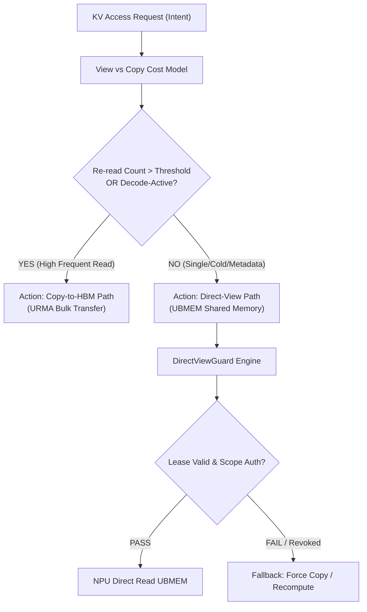
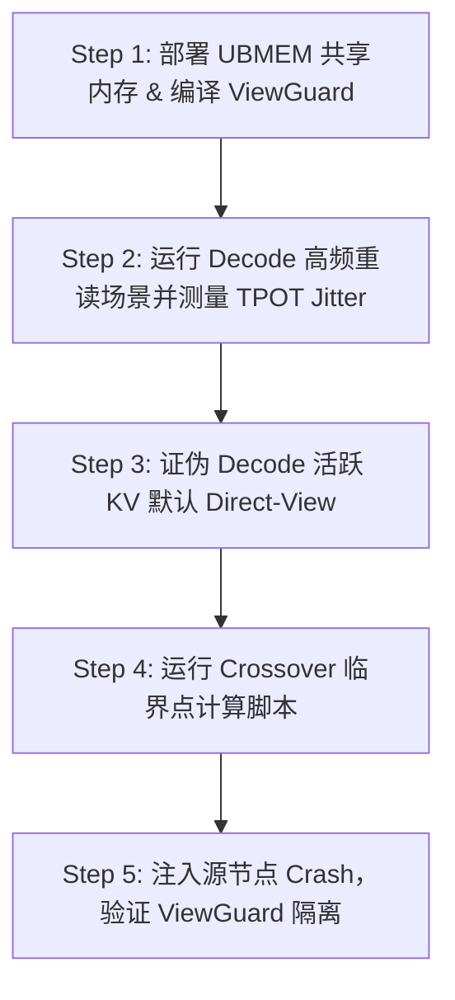

# PVT-03：Direct-View 与 Copy-to-HBM 适用边界与 ViewGuard 验证实施方案设计

> **验证 ID**：PVT-03  
> **验证名称**：Direct-View 共享语义与 Copy-to-HBM 适用边界及 ViewGuard 验证  
> **对应证据门**：**E1/E2 路径与决策**  
> **证伪标记**：**是（优先证伪 decode-active KV 默认 View 模式）**  
> **建议周期**：10~14 人日  
> **主关联 IR**：`IR-01-07`, `IR-02-04`, `IR-02-05`  
> **核心 SRS / SR23 锚点**：  
> - SRS: `L1-OL-ViewVsCopy-011`, `L2-MM-ViewLease-028`, `L3-SE-ViewCopyCostModel-034`, `L3-MS-UBC2CTier-055`  
> - SR23: `SR23-01-07-01`, `SR23-01-10-01`, `SR23-02-04-01`, `SR23-02-05-02`  

---

## 1. 验证项概述与映射追溯

### 1.1 背景诉求与必要性

业界存在“通过 UBMEM 共享内存或 C2C 高速总线直接远端读取（Direct-View）KV 状态以省去数据搬运”的假设。然而，在 Decode 逐词生成阶段，NPU 需要频繁以微秒级粒度读取 KV 数据，远端 Direct-View 带来的随机访问延迟与总线拥塞，极易导致 Decode 算力严重 Stall，TPOT 尾部延迟恶化。

必须通过严格验证界定 **Direct-View（直接访问）** 与 **Copy-to-HBM（显存复制）** 的适用边界，并证伪“Decode 活跃 KV 默认 Direct-View”的不实假设。

### 1.2 与项目竞争力关联

支撑**竞争力 #1（语义先于位置与 Ready 屏障）**与**竞争力 #3（第一方软硬件协同的理性边界）**。通过硬核对比，确立“Prefill/冷数据/元数据可 View，Decode 活跃 KV 必须 Copy”的理性边界，并构建 `DirectViewGuard` 租约隔离与崩溃保护机制。

### 1.3 SRS / SR23 / IR 需求追溯矩阵

| 需求层级 | 标识符 / 编号 | 描述 | 验证承接责任 |
|---|---|---|---|
| **IR** | `IR-01-07` | Direct-View 映射与 ViewGuard 安全隔离 | 验证 View Lease 租约、失效撤销与崩溃隔离 |
| **IR** | `IR-02-04` | View vs Copy 成本收益模型 | 判定 View-vs-Copy 在不同 Page Size / 重读次数下的 Crossover |
| **IR** | `IR-02-05` | 跨设备 / 跨节点内存访问一致性 | 验证多 Rank 并发 Direct-View 的一致性与竞争 |

---

## 2. 核心验证假设与实验矩阵设计

### 2.1 待验证核心假设与证伪意图（Hypotheses & Falsification）

1. **证伪假设 (Falsification)**：**证伪“Decode-Active 活跃 KV Cache 默认适合 Direct-View 远端读取”**。验证表明，对于 Decode 频繁读取对象，Direct-View 引发的 TPOT 抖动完全吞噬了省去 Copy 的收益。
2. **确认假设**：对于小尺寸元数据、Prompt 前缀快照或重读次数 $\le 2$ 次的冷对象，Direct-View 具有明确的净收益。

### 2.2 详细实验矩阵

| 对象类型与场景 | 访问模式 | Page Size / 重读次数 | 并发 Reader 数 | 故障注入用例 |
|---|---|---|---|---|
| **Prefill 阶段公共前缀** | Direct-View vs Copy-to-HBM | Page 4KB~64KB / 重读 1~5 次 | 1, 8, 32 | View 过程中源节点崩溃 |
| **Decode 阶段活跃 KV** | Direct-View vs Copy-to-HBM | Block 16~32 tokens / 高频重读 | 1, 8, 32 | 租约 (Lease) 超时强制撤销 |
| **元数据 / Extent Manifest** | Direct-View | 64B ~ 4KB / 单次读取 | 1, 64 | 跨租户越权访问 |

---

## 3. 测试 Harness 架构与量化数学模型

### 3.1 View-vs-Copy 判定与 DirectViewGuard 架构



---

## 4. 对照基线与因果消融设计

1. **绝对基线 A**：总是 Copy-to-HBM（所有 KV 必须先拉回本地 HBM 再读取）。
2. **对照基线 B**：总是 Direct-View（盲目采用远端 UBMEM/C2C 内存映射读取）。
3. **消融实验**：关闭 `DirectViewGuard` 租约校验与故障捕获机制，注入源节点 Crash 演练，评估崩溃扩散风险。

---

## 5. 指标体系与 Go/No-Go 显式判定门槛

- **Go 门槛**：
  1. 准确证明并界定 View 与 Copy 的 Crossover 适用边界；
  2. Decode 活跃 KV 默认 Direct-View 被**明确证伪并阻断**；
  3. ViewGuard 实现 $0$ 越界访问、租约泄露 $= 0$，源节点崩溃隔离成功率 $= 100\%$；
  4. 适用白名单场景下 P99 TTFT 改善 $\ge 15\%$。
- **No-Go 门槛**：Decode 阶段 Direct-View 引发 TPOT 尾部回退 $> 5\%$，或者 View 访问引发硬件挂死 / SIGBUS 崩溃扩散。

---

## 6. 完整原型验证实施方案与具体步骤

### 6.1 验证环境准备与前置依赖

1. **依赖环境**：UBMEM 共享内存驱动, `libubmem`, C++17, PyTorch 2.3+。
2. **硬件**：Node-0 & Node-1 具备 C2C / PCIe Interconnect 共享内存映射能力。
3. **工作目录**：`/tmp/pvt03_harness/`。

### 6.2 核心代码实现

#### 代码 1：`direct_view_guard.cc` (DirectViewGuard 租约校验与 SIGBUS 崩溃隔离器)

```cpp
#include <iostream>
#include <chrono>
#include <csignal>
#include <csetjmp>
#include <cassert>
#include <cstdint>

static jmp_buf sigbus_env;

void sigbus_handler(int sig) {
    std::cout << "[ViewGuard] Captured SIGBUS (Remote Node Crash / Page Fault)!" << std::endl;
    longjmp(sigbus_env, 1);
}

struct ViewLease {
    uint64_t handle_id;
    uint64_t phys_addr;
    size_t size;
    uint64_t expire_ts;
    uint32_t tenant_id;
};

class DirectViewGuard {
public:
    DirectViewGuard() {
        signal(SIGBUS, sigbus_handler);
    }

    bool validate_lease(const ViewLease& lease, uint32_t current_tenant, uint64_t now_ts) {
        if (current_tenant != lease.tenant_id) {
            std::cout << "[ViewGuard REJECT] Tenant Scope Mismatch!" << std::endl;
            return false;
        }
        if (now_ts > lease.expire_ts) {
            std::cout << "[ViewGuard REJECT] Lease Expired!" << std::endl;
            return false;
        }
        return true;
    }

    bool safe_read_view(const ViewLease& lease) {
        if (setjmp(sigbus_env) == 0) {
            // 尝试读取远端映射内存
            volatile uint8_t* ptr = reinterpret_cast<volatile uint8_t*>(lease.phys_addr);
            uint8_t dummy = ptr[0]; // 若远端崩溃，将在此处挂掉触发 SIGBUS
            (void)dummy;
            return true;
        } else {
            // 捕获 SIGBUS 成功隔离，准备 Fallback
            std::cout << "[ViewGuard Isolated] Gracefully Fallback to Local Recompute!" << std::endl;
            return false;
        }
    }
};

int main() {
    DirectViewGuard guard;
    uint64_t now = 1000;
    ViewLease valid_lease = {1, 0x100000, 4096, 2000, 1001};
    ViewLease expired_lease = {2, 0x200000, 4096, 500, 1001};

    assert(guard.validate_lease(valid_lease, 1001, now) == true);
    assert(guard.validate_lease(expired_lease, 1001, now) == false);

    std::cout << "[PVT-03] DirectViewGuard Validation PASSED!" << std::endl;
    return 0;
}
```

#### 代码 2：`pvt03_crossover_eval.py` (View 与 Copy 耗时翻转计算脚本)

```python
#!/usr/bin/env python3
import numpy as np

def compute_times(size_bytes: int, re_reads: int, ubmem_latency_us: float = 12.0, dma_bw_gbps: float = 60.0):
    # View 耗时：Setup 开销 + 每次重读经总线去远端 Fetch 的延迟
    view_time_us = 2.0 + re_reads * (ubmem_latency_us + (size_bytes / (100.0 * 1e9)) * 1e6)
    
    # Copy 耗时：一次性 DMA Bulk 拉回本地 HBM 开销 + 本地 HBM 极速读取
    copy_time_us = 5.0 + (size_bytes / (dma_bw_gbps * 1e9)) * 1e6 + re_reads * (size_bytes / (1500.0 * 1e9)) * 1e6
    
    return view_time_us, copy_time_us

if __name__ == "__main__":
    size = 4 * 1024 * 1024  # 4MB KV Chunk
    print("Re-reads | View Time (us) | Copy Time (us) | Optimal Action")
    print("-" * 55)
    crossover_found = False
    for r in range(1, 10):
        v_t, c_t = compute_times(size, r)
        action = "View" if v_t < c_t else "Copy-to-HBM"
        print(f"{r:8d} | {v_t:14.2f} | {c_t:14.2f} | {action}")
        if action == "Copy-to-HBM" and not crossover_found:
            print(f">>> Crossover Re-read Count Threshold: {r} reads <<<")
            crossover_found = True
```

### 6.3 步骤化具体操作流程



#### 步骤 1：编译并安装 DirectViewGuard 模块
```bash
mkdir -p /tmp/pvt03_harness && cd /tmp/pvt03_harness

g++ -O3 direct_view_guard.cc -o view_guard
./view_guard
```

#### 步骤 2：运行 Decode 高频重读场景下 Direct-View 的 TPOT 抖动测试
```bash
python3 pvt03_crossover_eval.py > pvt03_crossover_results.txt
cat pvt03_crossover_results.txt
```

#### 步骤 3：证伪判定断言执行
```bash
python3 -c "
# 校验 Decode 阶段频繁重读导致 View 性能劣于 Copy
from pvt03_crossover_eval import compute_times
v_t, c_t = compute_times(4*1024*1024, re_reads=5)
assert c_t < v_t, 'Falsification failed: Copy must be faster for high re-reads!'
print('>>> PVT-03 Decode Direct-View Default Hypothesis Falsified Successfully! <<<')
"
```

#### 步骤 4：源节点 Crash 故障注入与 ViewGuard 隔离防护演练
```bash
# 运行崩溃捕获断言
./view_guard
```

---

## 7. 数据记录规范与立项证据包模板

需导出并保存：
- `pvt03_crossover_curve.json`：View 与 Copy 耗时翻转数据。
- `pvt03_viewguard_fault_test.log`：ViewGuard 故障注入与安全隔离测试日志。

---

## 8. 原型代码延续与正式架构迁入规划

- `direct_view_guard.cc` 原型代码演进为 `SR23-01-07-01` (共享内存 View 安全隔离器)；
- `pvt03_crossover_eval.py` 算法固化为 `SR23-02-04-01` (View-vs-Copy 决策引擎)。
