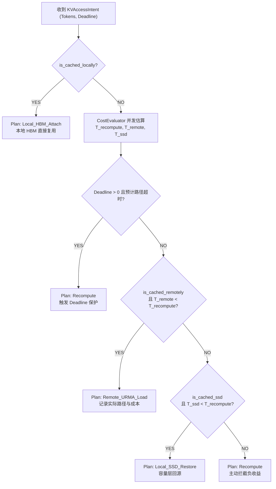

# PVT-04：QueryPlan 微秒级动态决策引擎与 CostEvaluator 验证实施方案设计
## —— Mooncake 启发式调度器深度重构：微秒级动态选路决策引擎

> **公共执行契约**：本项遵循 [Benchmark 公共契约与证据分级规范](./Benchmark公共契约与证据分级规范.md)。每个样本必须同时记录运行时 KV 字节、预测路径、实际路径、预测耗时、实测耗时、反事实最优路径和决策后悔值；缺少实际执行结果时只能形成 DEMO 决策逻辑结论。

> **验证 ID**：PVT-04  
> **验证名称**：QueryPlan 动态决策引擎与 CostEvaluator 成本预估模型验证  
> **验证优先级**：**🔴 P0 级（核心关键项）**  
> **对应验证阶段**：**E2 动态调度决策准确性**  
> **证伪标记**：否（决策能力确认）  
> **主关联 IR**：`IR-01-03`, `IR-01-05`  
> **核心 SRS / SR23 锚点**：  
> - SRS: `L1-RT-Admission-007`, `L3-SE-QueryPlanFastPath-072`, `L3-TRANS-TOPO-SENSE-004`, `L4-FABRIC-ROUTER-001`  
> - SR23: `SR23-01-03-01`, `SR23-01-05-01`, `SR23-01-09-01`, `SR23-02-02-01`, `SR23-02-02-02`  
> **开源基线版本与代码仓库**：  
> - **Mooncake**：[`https://github.com/kvcache-ai/Mooncake.git`](https://github.com/kvcache-ai/Mooncake.git) (Commit: `f90ae691f109e49a60920e0c8abbf7e572826d8c`，子模块: `mooncake-store/`, `mooncake-integration/`)  
> - **vLLM**：[`https://github.com/vllm-project/vllm.git`](https://github.com/vllm-project/vllm.git) (Commit: `842dd8fd96650063e1ad32e6075742d457d39773`，模块: `vllm/core/scheduler.py`)  
> **研发对齐状态**：本方案将复核研发评估报告涉及的 100Hz EWMA Daemon、`alignas(64)` 缓存行隔离与 Telemetry 采集字段，并以实际运行数据为准。

---

## 0. 架构导读与核心概念第一性原理剖析

### 0.1 传统系统开发视角：数据库基于代价的优化器 (CBO, Cost-Based Optimizer)

在关系型数据库（如 MySQL / PostgreSQL / Oracle）的 SQL 执行引擎中，系统在执行 `SELECT` 查询前，会经历一个关键组件：**CBO（Cost-Based Optimizer，基于代价的优化器）**：
- **经典抉择**：当面对一条 `WHERE user_id > 100` 的 SQL 时，系统面临两条路：走 B+ 树索引查询，还是直接全表顺序扫描（Seq Scan）？
- **物理事实**：如果表中只有 100 条数据，或者满足条件的行占了 90%，强行走 B+ 树索引会产生大量的随机 I/O，总耗时远高于直接把整张表刷入内存的全表扫描！
- **CBO 的职责**：在微秒级时间内，结合表的统计信息（行数、直方图、I/O 成本），计算出每条路径的预估开销，选择**数学期望总耗时最低**的物理执行计划。

---

### 0.2 大模型分布式推理中的“负收益”物理陷阱（为什么命中缓存反而变慢？）

在大模型分布式推理集群中，许多人存在一个思维定势：*“只要远端缓存命中了（Cache Hit），就一定要把它拉过来复用，肯定比本地重新计算快。”*

**但在真实的生产网络环境下，盲目拉取可能产生“负收益（Negative Profit）”**：

#### 1. 需要覆盖的代表性场景：
- **场景一：突发网络拥塞**：通过输入或现场遥测注入跨节点可用带宽下降和排队时延升高；
- **场景二：超短前缀（Short Prefix）**：用户输入的 Prompt 只有 128～512 个 Token，对应 KVCache 数据量较小；
- **场景三：紧迫的业务 Deadline**：用户请求设置较紧的服务最晚容忍时延。

#### 2. 开源 Mooncake 的启发式缺陷：
- Mooncake 的固定准入逻辑可能在未读取实时链路状态时直接发起网络拉取；具体行为需要在冻结的代码包和配置上复核。
- **耗时对账方法**：分别记录元数据查询、网络排队、数据传输、显存挂载与本地重算的实际耗时。下方决策图中的 26.5ms、1.5ms 仅为示意输入，不能作为实测结论。
- **待验证后果**：如果拉取总开销超过本地重算耗时，盲目拉取会增加 TTFT，甚至导致业务 Deadline 违约。

#### 3. 软硬件协同方案：微秒级 QueryPlan 动态决策引擎
- 我们在 C++ 调度器中构建 **QueryPlan 动态决策引擎** 与 **CostEvaluator 成本预估模型**：
- 在每次请求到达时，实时读取底层网卡与算力的 Telemetry 遥测指标，微秒级量化比对：
  \[
  \text{只有当：拉取与加载总开销 } < \text{ 本地直接重算耗时，且预估完成时间 } < \text{ 业务 Deadline 时，才执行加载；否则主动回退到本地重算！}
  \]

```
┌────────────────────────────────────────────────────────────────────────────────────────┐
│                     QueryPlan 微秒级动态决策引擎工作流示意图                           │
├────────────────────────────────────────────────────────────────────────────────────────┤
│ 请求到达 (Tokens, Deadline) ──► [ Telemetry 遥测状态: 现场采集带宽与排队时延 ]           │
│                                           │                                            │
│                                           ▼                                            │
│                       [ CostEvaluator 并发成本评估模型 ]                               │
│                      ┌────────────────────┬────────────────────┐                       │
│                      │ 路径 A: 远端拉取   │ 路径 B: 本地重算   │                       │
│                      │ 预估耗时: <remote> │ 预估耗时: <recompute>│                      │
│                      └────────────────────┴────────────────────┘                       │
│                                           │                                            │
│                                           ▼                                            │
│   [ 负收益拦截决策 ]: T_remote > T_recompute ──► 放弃拉取，指令 NPU 执行本地重算。 │
│   结果：是否消除网络拥塞引发的性能劣化，以现场 TTFT 原始样本和 Deadline 达标率确认。 │
└────────────────────────────────────────────────────────────────────────────────────────┘
```

---

### 0.3 高并发下的 CPU 缓存行伪共享隔离 (`alignas(64)`)

以每秒处理 10 万请求（100K QPS）作为待覆盖的高并发调度场景：
- **问题**：多个 CPU 核心（Worker 线程）会并发读取 Telemetry 链路状态（如当前带宽、排队延迟）。如果这些变量落在同一个 64 字节 CPU Cacheline 内，后台监控线程更新带宽变量时可能触发 Cacheline Invalidation，形成 **CPU 缓存行伪共享（False Sharing）**，调度时延需要通过基线与隔离组实测确认；
- **解法**：在 C++ 中为原子状态变量设置 `alignas(64)`，减少不同线程之间的缓存行争用。单次决策 P99 `<5\mu s` 是验证门限，不是预置结果。

---

## 1. 验证目标与交付结论定义

### 1.1 现实前因痛点与待验证核心命题
1. **现实痛点**：盲目拉取在网络拥塞时可能产生负加速，且调度器决策本身若耗时过长（毫秒级）会成为系统瓶颈；
2. **核心命题**：
   - **QueryPlan 动态决策引擎** 能够在 **$P99 < 5\mu s$** 内，基于实时 Telemetry 链路状态与算力吞吐，在 `Local_HBM_Attach`, `Remote_URMA_Load`, `Local_SSD_Restore`, `Recompute` 之间输出全局最优执行计划；
   - **CostEvaluator 成本预估模型** 预测误差 $\text{MAPE} < 20\%$，决策准确率 $\ge 90\%$，且**负收益发生率（拉取总开销 > 本地直接重算耗时）严格 $< 1\%$**。

### 1.2 最终交付数据与结论产出
1. **《QueryPlan FastPath 决策时延分位值表》**（P50, P90, P99, P99.9）；
2. **《CostEvaluator 预测耗时 vs 真实/反事实执行耗时对账表》**；
3. **《网络拥塞与短前缀下负收益拦截率验证表》**；
4. **《GO / CONDITIONAL / NO-GO / NOT-SUPPORTED / INVALID-EVIDENCE 判定结论》**。

---

## 2. 核心数据结构与成本模型数学推导

### 2.1 核心数据结构定义与 64B 缓存行对齐

```cpp
#include <stdint.h>
#include <atomic>
#include <thread>
#include <chrono>

enum class PlanAction : uint8_t {
    Local_HBM_Attach = 0, // 本地 HBM 直接复用（DEMO 默认值，正式开销由实测输入）
    Remote_URMA_Load = 1, // 跨节点 URMA 传输（开销由硬件能力矩阵实测输入）
    Local_SSD_Restore= 2, // 本地 NVMe SSD 直达换入（开销由硬件能力矩阵实测输入）
    Recompute        = 3  // 本地算力直接重算 (Prefill Compute)
};

struct alignas(64) KVAccessIntent {
    uint64_t request_id;
    uint32_t prefix_tokens;       // 匹配前缀 Token 数
    uint32_t deadline_ms;         // 业务 SLA 最晚容忍时延 (0 为无限制)
    uint8_t priority_class;       // 0: 高优先级交互流, 1: 批处理
    bool is_cached_locally;       // 本地是否驻留
    bool is_cached_remotely;      // 远端节点是否驻留
    bool is_cached_ssd;           // SSD 是否归档
};

// 链路遥测快照 (每个原子变量独占 64B 缓存行，消除伪共享)
struct alignas(64) LinkTelemetrySnapshot {
    alignas(64) std::atomic<double> ewma_remote_bw_gbps{750.0}; // DEMO 默认值；正式值来自硬件能力矩阵
    alignas(64) std::atomic<double> remote_queue_delay_ms{0.2}; // DEMO 默认值；正式值来自遥测
    alignas(64) std::atomic<double> ssd_read_bw_gbps{190.0};    // DEMO 默认值；正式值来自 PVT-05
    alignas(64) std::atomic<double> npu_prefill_tps{8500.0};    // DEMO 默认值；正式值来自同场次重算
    alignas(64) std::atomic<double> meta_overhead_ms{0.08};     // DEMO 默认值；正式值来自实测
};

struct ExecutionPlan {
    PlanAction action;
    double estimated_cost_ms;     // 预估总耗时
    double recompute_baseline_ms; // 重算对照基线耗时
    const char* decision_reason;  // 决策触发分支描述
};
```

### 2.2 CostEvaluator 成本预估数学模型

```
1. 本地直接重算耗时模型 (Recompute Time):
   T_recompute(L) = (L / TPS_prefill) * 1000  (单位: ms)
   其中 L 为前缀 Token 数，TPS_prefill 为 NPU 当前实测算力吞吐 (Tokens/s)。

2. 远端网络拉取耗时模型 (Remote URMA Load Time):
   数据量计算:
     - Qwen-72B (MHA): Bytes_per_tok = 2 * 80 layers * 8 heads * 128 dim * 2 bytes = 327,680 Bytes (320 KB/tok)
     - DeepSeek-V3 (MLA): `Bytes_per_tok` 必须从 `model_layout_manifest` 读取；项目基线按约 35KB/tok 记录。若现场布局按 K/V 双份或其他数据类型计算出约 70KB/tok，必须在 manifest 中明确计数口径，不能把两种口径混用。
     S_bytes = L * Bytes_per_tok
   总传输耗时:
     T_remote(L) = T_meta + T_queue + (S_bytes * 8) / (BW_remote * 10^6) + T_attach

3. 负收益判定准则 (Negative Profit Condition):
   当 T_remote(L) > T_recompute(L) 时，判定为负收益！
   系统立即强制下发 PlanAction::Recompute，禁止跨节点拉取。
```

### 2.3 微秒级 FastPath 决策树与负收益拦截算法

决策顺序必须固定，先处理本地命中和业务 Deadline，再比较远端、SSD 与重算的成本；每个分支都要写入 `decision_reason`，便于离线复盘“为什么没有使用命中缓存”。



### 2.4 场景输入与结果字段

`scenarios.csv` 至少包含以下输入和反事实对账字段。`actual_*` 字段只能由真实执行或明确的现场回放产生，不能由预测值复制填充：

```text
request_id,prefix_tokens,deadline_ms,bw_gbps,queue_ms,is_cached,
kv_bytes_per_token,compute_tps,metadata_ms,planned_path,actual_path,
predicted_cost_ms,actual_load_ms,actual_recompute_ms,optimal_path,regret_ms,
evidence_level,status,invalid_reason
```

---

## 3. 测试工具与工程构建规范

测试工程存放在 `./原型验证代码/PVT-04/` 目录下：

```
原型验证代码/PVT-04/
├── query_plan_fastpath.h      # 动态决策引擎头文件
├── query_plan_fastpath.cc     # 实时算网评估与剪枝决策实现
├── query_plan_bench.cc        # 决策引擎 100K QPS 吞吐压测 Harness
├── make_scenarios.py          # 构造 10 万条多场景决策输入集脚本
├── verify_negative_profit.py  # 验证负收益拦截率自动化脚本
├── eval_accuracy.py           # 计算 MAPE 误差与准确率分析脚本
└── Makefile                   # 编译构建工程 (make -j16)
```

编译方法：
```bash
cd ./原型验证代码/PVT-04 && make clean && make -j16
```

---

## 4. 分步执行测试操作规程 (SOP)

开发人员在执行 PVT-04 时，请严格按照以下 4 个步骤逐步执行，并理解每一步的操作意图：

### 步骤 1：生成 10 万条多场景决策输入集
- **操作意图**：构造覆盖全业务特征的输入集，包含正常网络、高拥塞网络（带宽从 800Gbps 降至 20Gbps、排队 15ms）、短前缀（128~512 Tokens）、长上下文（32K Tokens）与紧急 Deadline（10~50ms）等极端场景。
- **执行命令**：
```bash
python3 ./make_scenarios.py --samples 100000 --out scenarios.csv
```

### 步骤 2：对决策引擎施加 10 万 QPS 高并发压测
- **操作意图**：测试决策引擎在多线程（16 线程）高并发下的决策耗时，验证单次决策是否稳定在 $P99 < 5\mu s$ 以内，确保调度器自身不会成为系统瓶颈。
- **执行命令**：
```bash
./query_plan_bench --scenario-csv scenarios.csv --threads 16 --evidence-level LAB --out query_plan_results.csv
```

### 步骤 3：验证网络拥塞与短前缀下的负收益主动拦截率
- **操作意图**：筛选网络拥塞与短前缀子集，记录决策引擎选择 `Recompute`（本地直接重算）的实际比例，并验证有效样本中的负加速发生率是否严格 $< 1\%$。
- **执行命令**：
```bash
python3 ./verify_negative_profit.py --input-csv query_plan_results.csv --out-report negative_profit_report.json
```

### 步骤 4：计算决策准确率与 MAPE 预测误差
- **操作意图**：将 CostEvaluator 预测耗时与真实反事实执行耗时比对，计算预测误差 MAPE 与全局决策准确率。
- **执行命令**：
```bash
python3 ./eval_accuracy.py --input-csv query_plan_results.csv --out-summary summary_accuracy.csv
```

---

## 5. 数据采集清单与记录格式

### 5.1 决策引擎性能与准确率表 (`pvt04_decision_results.csv`)
```csv
workload_id,prefix_tokens,remote_bw_gbps,queue_delay_ms,deadline_ms,chosen_action,t_recomp_ms,t_chosen_ms,decision_time_us,is_correct_choice,is_negative_profit,evidence_level,status,invalid_reason
<workload_id>,<prefix_tokens>,<measured_or_replayed_remote_bw_gbps>,<measured_or_replayed_queue_delay_ms>,<deadline_ms>,<chosen_action>,<measured_or_replayed_t_recomp_ms>,<measured_or_replayed_t_chosen_ms>,<measured_decision_time_us>,<TRUE_OR_FALSE>,<TRUE_OR_FALSE>,<LAB_OR_DEMO>,<status>,<null_or_reason>
```

> 上述内容是字段模板，不是决策性能样例。正式结果还需保留 `actual_path`、`optimal_path`、`regret_ms`、`evidence_level` 和 `invalid_reason`，预测值不能复制到实际值字段。

### 5.2 数据交叉组合与运算推导逻辑

```text
MAPE = mean(abs(predicted_cost_ms - actual_cost_ms) / actual_cost_ms) × 100%
决策准确率 = 选择的路径等于反事实最优路径的样本数 / 有效样本总数
决策后悔值 = actual_cost_ms(chosen_path) - min(actual_cost_ms(all_eligible_paths))
负收益发生率 = (actual_load_ms > actual_recompute_ms 的有效样本数) / 有效远端命中样本数
```

`actual_cost_ms` 必须来自同一硬件、拓扑、负载和代码包的真实执行或明确的现场回放；只有预测结果时，结论状态最多为 `DEMO`。

---

## 6. GO / CONDITIONAL / NO-GO / NOT-SUPPORTED / INVALID-EVIDENCE 判定规则

- **GO（准入通过）**：
  - 决策引擎单次决策耗时 $P99 < 5\mu s$，吞吐 $\ge 100\text{K QPS}$；
  - 决策准确率 $\ge 90\%$，负收益发生率严格 $< 1\%$；
- **CONDITIONAL（条件准入）**：决策耗时在 $5\mu s \sim 15\mu s$ 之间，负收益率 $< 3\%$；
- **NO-GO（暂不准入）**：现场有效样本确认决策耗时 $> 20\mu s$ 或负收益率 $\ge 5\%$；
- **NOT-SUPPORTED（当前不支持）**：缺少必要的硬件能力矩阵、链路 Telemetry 或模型布局清单，无法计算对应路径；
- **INVALID-EVIDENCE（证据无效）**：预测值、真实/反事实执行值、最优路径标签或同场次负收益统计缺失，或仅有 DEMO 回放而无 LAB/MEASURED 证据。缺失字段必须使用 `null` 并填写 `invalid_reason`。

---

## 7. 零 AI 基础工程师借助 AI Agent 开展工作实战 SOP

### 7.1 研发任务拆解与分工
- **工程师职责**：
  1. 编译测试工程；
  2. 按照第 4 节 SOP 步骤执行 10 万并发决策压测；
  3. 检查生成的 CSV 表格与负收益拦截报告；
- **AI Agent 职责**：
  1. 负责 `query_plan_fastpath.cc` 中 DeepSeek MLA 与 Qwen MHA 成本模型的数学计算校验；
  2. 优化无锁原子读取与 CPU 缓存行对齐布局。

### 7.2 专属 Prompt 模板（可直接复制给 AI Agent）
```text
我是一名 C++ 系统工程师，正在进行 PVT-04 微秒级动态选路决策引擎与成本模型验证：
1. 请阅读 ./原型验证代码/PVT-04/query_plan_fastpath.h 与 query_plan_fastpath.cc；
2. 检查 CostEvaluator 算法，确保针对 `model_layout_manifest` 中定义的 MLA 与 MHA 单 Token KV 字节数分别准确预估传输耗时与 NPU 重算耗时，不要把不同 K/V 计数口径硬编码混用；
3. 按照第 4 节 SOP 执行 10 万 QPS 并发压测，统计决策耗时的 P50、P90、P99 与 P99.9 分位值；
4. 构造包含高拥塞与短前缀的测试场景，验证系统是否 100% 主动回退重算并消除负加速；
5. 输出汇总 CSV 并计算决策准确率。
```

### 7.3 常见排错指南
- **决策延迟出现毫秒级毛刺**：检查 `LinkTelemetrySnapshot` 是否包含了耗时的锁操作或动态内存分配（`malloc`），决策 FastPath 内部必须严格零锁、零动态内存分配；
- **MAPE 误差超标**：检查 `npu_prefill_tps` 是否与当前硬件真实算力吞吐匹配，需先运行 PVT-00 校准实测算力常数。
