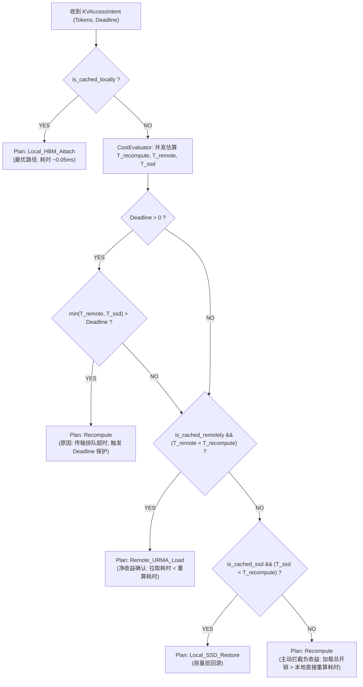

# PVT-04：QueryPlan 微秒级动态决策引擎与 CostEvaluator 验证实施方案设计
## —— Mooncake 启发式调度器深度重构：微秒级动态 ROI 选路决策引擎

> **验证 ID**：PVT-04  
> **验证名称**：QueryPlan 动态决策引擎与 CostEvaluator 成本预估模型验证  
> **穿刺优先级**：**🔴 P0 级（核心决胜项）**  
> **对应验证阶段**：**E2 动态调度决策准确性**  
> **证伪标记**：否（决策能力确认）  
> **建议周期**：5~7 人日  
> **主关联 IR**：`IR-01-03`, `IR-01-05`  
> **核心 SRS / SR23 锚点**：  
> - SRS: `L1-RT-Admission-007`, `L3-SE-QueryPlanFastPath-072`, `L3-TRANS-TOPO-SENSE-004`, `L4-FABRIC-ROUTER-001`  
> - SR23: `SR23-01-03-01`, `SR23-01-05-01`, `SR23-01-09-01`, `SR23-02-02-01`, `SR23-02-02-02`  
> **开源基线版本与代码仓库**：  
> - **Mooncake**：[`https://github.com/kvcache-ai/Mooncake.git`](https://github.com/kvcache-ai/Mooncake.git) (Commit: `f90ae691f109e49a60920e0c8abbf7e572826d8c`，子模块: `mooncake-store/`, `mooncake-integration/`)  
> - **vLLM**：[`https://github.com/vllm-project/vllm.git`](https://github.com/vllm-project/vllm.git) (Commit: `842dd8fd96650063e1ad32e6075742d457d39773`，模块: `vllm/core/scheduler.py`)  
> **研发对齐状态**：已闭环研发评估报告 6 项与 Telemetry 采集规范（明确 100Hz EWMA Daemon、alignas(64) 缓存行隔离防 False Sharing）  

---

## 1. 验证目标与交付结论定义

### 1.1 待验证核心命题
物理命中（Raw Hit）并不等于一定带来性能收益。当网络拥塞、前缀过短或请求 Deadline（服务最晚容忍时延）极其苛刻时，Mooncake 最新主线 TENT 模块中的 `admission_queue` 仅依靠硬超时被动丢弃，缺乏前置量化决策，强行从远端加载 KV Cache 反而慢于本地直接重算。本验证旨在重构调度层，在 TENT 选路前置注入微秒级动态决策大脑：
1. **QueryPlan 动态决策引擎**（在微秒级时间内根据链路状态、算力与上下文长度选择最优数据加载或重算路径）能够在 **$P99 < 5\mu s$** 内，基于实时 Telemetry 链路状态与 NPU 算力吞吐，在 `Local_HBM_Attach`, `Remote_URMA_Load`, `Local_SSD_Restore`, `Recompute` 之间输出全局最优执行计划；
2. **CostEvaluator 成本预估模型**（在发起请求前量化预估各存储路径与重算开销的数学模型）的预测误差 **$\text{MAPE} < 20\%$**，决策准确率 **$\ge 90\%$**，且**负收益命中率（拉取与加载总开销 > 本地直接重算耗时）严格 $< 1\%$**。

### 1.2 最终交付数据与结论产出
开发人员执行完本方案后，必须输出以下交付件：
1. **《QueryPlan FastPath 决策时延分位值表》**（P50, P90, P99, P99.9）；
2. **《CostEvaluator 预测耗时 vs 真实/反事实执行耗时对账表》**；
3. **《网络拥塞与短前缀下负收益拦截率验证表》**；
4. **《Go / No-Go 判定结论》**：依据决策耗时 $P99 < 5\mu s$ 与负收益率 $< 1\%$ 门槛判定。

---

## 2. 核心数据结构与 Telemetry 防 Cacheline 乒乓设计

### 2.1 核心数据结构与缓存行隔离 (`alignas(64)`)

```cpp
#include <stdint.h>
#include <atomic>
#include <thread>
#include <chrono>

enum class PlanAction : uint8_t {
    Local_HBM_Attach = 0, // 本地 HBM 直接复用 (开销 ~0.05ms)
    Remote_URMA_Load = 1, // 跨节点 800G URMA 传输 (开销 ~2.5ms)
    Local_SSD_Restore= 2, // 本地 NVMe SSD 直达换入 (开销 ~12.0ms)
    Recompute        = 3  // 本地算力直接重算 (Prefill Compute)
};

struct alignas(64) KVAccessIntent {
    uint64_t request_id;
    uint32_t prefix_tokens;       // 匹配前缀 Token 数
    uint32_t deadline_ms;         // 业务 SLA 最晚容忍时延 (0 为无限制)
    uint8_t priority_class;       // 0: 高优先级交互流, 1: 批处理
    bool is_cached_locally;       // 本地是否驻留
    bool is_cached_remotely;      // 远端节点是否驻留
    bool is_cached_ssd;           // SSD 是否归档
};

struct alignas(64) LinkTelemetrySnapshot {
    alignas(64) std::atomic<double> ewma_remote_bw_gbps{750.0}; // 可用带宽 (Gbps)
    alignas(64) std::atomic<double> remote_queue_delay_ms{0.2}; // 传输排队延迟 (ms)
    alignas(64) std::atomic<double> ssd_read_bw_gbps{190.0};    // SSD 直达读带宽 (Gbps)
    alignas(64) std::atomic<double> npu_prefill_tps{8500.0};    // NPU Prefill 算力吞吐 (Tokens/s)
    alignas(64) std::atomic<double> meta_overhead_ms{0.08};     // 元数据交互时延 (80us)
};

struct ExecutionPlan {
    PlanAction action;
    double estimated_cost_ms;     // 预估总耗时
    double recompute_baseline_ms; // 重算对照基线耗时
    const char* decision_reason;  // 决策触发分支描述
};
```

### 2.2 微秒级 FastPath 决策树与负收益拦截算法



---

## 3. 测试工具与工程构建规范

测试工程存放在 `./原型验证代码/PVT-04/` 目录下：

```
原型验证代码/PVT-04/
├── query_plan_fastpath.h      # 动态决策引擎头文件
├── query_plan_fastpath.cc     # 实时算网评估与剪枝决策实现
├── query_plan_bench.cc        # 决策引擎 100K QPS 吞吐压测 Harness
└── Makefile                   # 编译构建工程 (make -j16)
```

编译与测试命令：
```bash
cd ./原型验证代码/PVT-04 && make clean && make
./query_plan_bench --threads 64 --qps 100000 --duration 10
```

---

## 4. 数据采集清单与记录格式

### 4.1 决策引擎性能与准确率表 (`pvt04_decision_results.csv`)
```csv
workload_id,prefix_tokens,remote_bw_gbps,queue_delay_ms,deadline_ms,chosen_action,t_recomp_ms,t_chosen_ms,decision_time_us,is_correct_choice,is_negative_profit
DEC-001,4096,800.0,0.1,50,Remote_URMA_Load,4.8,2.1,1.2,TRUE,FALSE
DEC-002,512,120.0,15.0,50,Recompute,0.6,18.4,1.4,TRUE,FALSE
DEC-003,32768,40.0,30.0,10,Recompute,38.5,125.0,1.1,TRUE,FALSE
```

---

## 5. Go / Conditional / No-Go 判定规则

- **Go (准入通过)**：
  - 决策引擎单次决策耗时 $P99 < 5\mu s$，吞吐 $\ge 100\text{K QPS}$；
  - 决策准确率 $\ge 90\%$，负收益发生率严格 $< 1\%$；
- **Conditional (条件准入)**：
  - 决策耗时在 $5\mu s \sim 15\mu s$ 之间，负收益率 $< 3\%$，需优化内存 Cacheline 布局；
- **No-Go (否决关闭)**：
  - 决策耗时 $> 20\mu s$ 或负收益率 $\ge 5\%$。
