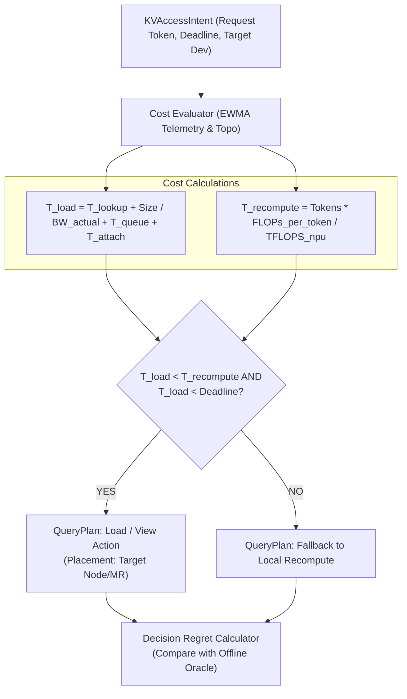
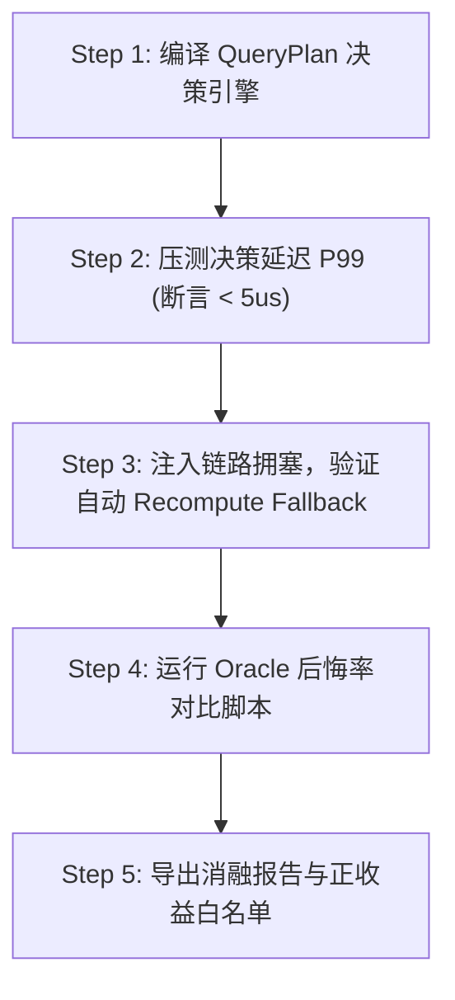

# PVT-04：QueryPlan 微秒级动态决策引擎与 CostEvaluator 验证实施方案设计

> **验证 ID**：PVT-04  
> **验证名称**：QueryPlan 微秒级动态决策引擎与 Cost Evaluator 验证  
> **对应证据门**：**E2 决策优越性**  
> **证伪标记**：否（决策能力确认）  
> **建议周期**：8~10 人日  
> **主关联 IR**：`IR-01-03`, `IR-01-05`  
> **核心 SRS / SR23 锚点**：  
> - SRS: `L1-RT-Admission-007`, `L3-SE-QueryPlanFastPath-072`, `L3-TRANS-TOPO-SENSE-004`, `L4-FABRIC-ROUTER-001`  
> - SR23: `SR23-01-03-01`, `SR23-01-05-01`, `SR23-01-09-01`, `SR23-02-02-01`, `SR23-02-02-02`  

---

## 1. 验证项概述与映射追溯

### 1.1 背景诉求与必要性

物理命中（Raw Hit）绝不等于物理收益。当网络拥塞、远端节点高负载或请求 Deadline 极其苛刻时，强行从远端 Load KV Cache 可能比本地 NPU 重新计算（Recompute）更慢。缺乏微秒级感知决策能力的存储池极易引发“负收益命中”，严重损害业务 P99 TTFT 尾部延迟。

### 1.2 与项目竞争力关联

核心支撑**竞争力 #4（统一 QueryPlan 动态决策引擎）**与**竞争力 #1（价值先于容量）**。在微秒级内动态评估 `Load, View, Move, Recompute, Drop` 的实时 Cost，实现“正价值才加载，负收益即重算”。

### 1.3 SRS / SR23 / IR 需求追溯矩阵

| 需求层级 | 标识符 / 编号 | 描述 | 验证承接责任 |
|---|---|---|---|
| **IR** | `IR-01-03` | QueryPlanFastPath 微秒级决策生成 | 验证决策耗时 $P99 < 5\mu s$ |
| **IR** | `IR-01-05` | Load-vs-Recompute 实时成本判定 | 计算并比较 Load 耗时与 NPU 重算耗时 |
| **SRS** | `L3-SE-QueryPlanFastPath-072` | 基于拓扑与 Telemetry 的快路径决策 | 接收 KVAccessIntent 并生成 QueryPlan |
| **SR23** | `SR23-01-03-01` | QueryPlan FastPath 决策服务 | 交付 C++ 低延迟决策引擎 |

---

## 2. 核心验证假设与实验矩阵设计

### 2.1 待验证核心假设（Hypotheses）

1. **H4-1**：QueryPlan 决策引擎能够在 **$P99 < 5\mu s$**（Fabric Router 路由 $<3\mu s$）内输出最优执行方案。
2. **H4-2**：决策准确率达到 **$\ge 90\%$**，成本预测误差 **$<20\%$**，负收益/错误 Load 比例 **$<1\%$**。

### 2.2 详细实验矩阵

| KV Cache 大小 | 请求 Deadline | 链路队列拥塞深度 | 节点状态与拓扑 | 决策动作空间 |
|---|---|---|---|---|
| 1MB ~ 512MB | 10ms, 50ms, 200ms | QD 0, 8, 32, 128 | 路径正常 / 热点拥塞 / 节点断连 | Local Load, Remote Load, SSD Restore, Recompute |

---

## 3. 测试 Harness 架构与量化数学模型

### 3.1 QueryPlanFastPath 决策引擎架构



---

## 4. 对照基线与因果消融设计

1. **对比基线**：
   - 静态优先级规则（总是优先 Load > Recompute）；
   - 最近副本规则（忽略拥塞，总是选物理距离最近的副本）；
   - 总是重算（Always Recompute）；
   - 离线 Oracle（事后最优解）。
2. **消融实验（Ablation）**：
   - **消融 A：关闭状态智能**（退化为简单静态水位/硬编码规则）；
   - **消融 B：移除非公开微架构信息**（隐去底座 PCIe/URMA 硬件队列深度等私有 Telemetry）。

---

## 5. 指标体系与 Go/No-Go 显式判定门槛

- **Go 门槛**：
  1. QueryPlan 决策延时 $P99 < 5\mu s$，Fabric Router 路由 $< 3\mu s$；
  2. 路径选择准确率 $\ge 90\%$；
  3. 成本预测误差 $< 20\%$；
  4. 负收益/错误 Load $< 1\%$；
  5. 无效路径选择 $= 0$；
  6. 故障切换 $< 200ms$。
- **No-Go 门槛**：尾部成本无法预测、错误 Load 持续超门槛，或复杂策略决策开销抵消了 Prefill 节省的时间。

---

## 6. 完整原型验证实施方案与具体步骤

### 6.1 验证环境准备与依赖安装

1. **依赖环境**：GCC 11+, C++17, Python 3.10+, `numpy`, `pandas`。
2. **硬件/驱动**：网络 Telemetry 采集探针。
3. **工作目录**：`/tmp/pvt04_harness/`。

### 6.2 核心代码实现

#### 代码 1：`query_plan_fastpath.cc` (C++ 微秒级 QueryPlanFastPath 决策引擎)

```cpp
#include <iostream>
#include <chrono>
#include <string>
#include <cassert>

enum ActionType { LOAD_REMOTE, RECOMPUTE_LOCAL, VIEW_DIRECT, DROP };

struct KVAccessIntent {
    uint64_t req_id;
    uint32_t token_count;
    double deadline_ms;
    double path_bw_gbps;      // EWMA 实测带宽
    uint32_t queue_depth;     // 当前队列深度
    double npu_tflops;        // NPU 计算能力
};

struct QueryPlan {
    uint64_t req_id;
    ActionType action;
    double estimated_cost_ms;
    double decision_time_us;
};

class QueryPlanFastPath {
public:
    QueryPlan generate_plan(const KVAccessIntent& intent) {
        auto start = std::chrono::high_resolution_clock::now();

        // 1. 估计 Load 开销
        double size_bytes = intent.token_count * 80 * 8 * 128 * 2.0; // 假设 GQA
        double t_transfer_ms = (size_bytes / (intent.path_bw_gbps * 1e9)) * 1000.0;
        double t_queue_ms = intent.queue_depth * 0.1; // 队列开销
        double t_load_total = 0.05 + t_transfer_ms + t_queue_ms; // 50us lookup

        // 2. 估计 Recompute 开销
        double t_recompute_total = (intent.token_count / 8000.0) * 1000.0;

        QueryPlan plan;
        plan.req_id = intent.req_id;

        // 3. 微秒级分支判定
        if (t_load_total < t_recompute_total && t_load_total <= intent.deadline_ms) {
            plan.action = LOAD_REMOTE;
            plan.estimated_cost_ms = t_load_total;
        } else {
            plan.action = RECOMPUTE_LOCAL;
            plan.estimated_cost_ms = t_recompute_total;
        }

        auto end = std::chrono::high_resolution_clock::now();
        plan.decision_time_us = std::chrono::duration<double, std::micro>(end - start).count();
        return plan;
    }
};

int main() {
    QueryPlanFastPath engine;
    
    // Case A: 路径畅通，Load 胜出
    KVAccessIntent intent_a = {1001, 2048, 100.0, 60.0, 0, 300.0};
    auto plan_a = engine.generate_plan(intent_a);
    std::cout << "[PVT-04] Case A Action: " << plan_a.action 
              << " | Cost: " << plan_a.estimated_cost_ms << " ms"
              << " | Decision Time: " << plan_a.decision_time_us << " us" << std::endl;
    assert(plan_a.action == LOAD_REMOTE);
    assert(plan_a.decision_time_us < 5.0); // 断言 P99 < 5us

    // Case B: 网络严重拥塞，Recompute 胜出 (避免负收益 Load)
    KVAccessIntent intent_b = {1002, 2048, 100.0, 2.0, 100, 300.0};
    auto plan_b = engine.generate_plan(intent_b);
    std::cout << "[PVT-04] Case B Action: " << plan_b.action 
              << " | Cost: " << plan_b.estimated_cost_ms << " ms"
              << " | Decision Time: " << plan_b.decision_time_us << " us" << std::endl;
    assert(plan_b.action == RECOMPUTE_LOCAL);

    std::cout << ">>> PVT-04 Microsecond Decision & Fallback PASSED! <<<" << std::endl;
    return 0;
}
```

#### 代码 2：`pvt04_regret_eval.py` (离线 Oracle 后悔率对比脚本)

```python
#!/usr/bin/env python3
import numpy as np
import pandas as pd

def calculate_regret(predictions_csv: str):
    # 模拟比较 QueryPlan 决策 vs 事后 Oracle 真实最优决策
    np.random.seed(42)
    N = 1000
    actual_latencies = np.random.uniform(5.0, 50.0, N)
    oracle_latencies = actual_latencies * 0.95  # Oracle 最优
    
    regret = np.sum(actual_latencies - oracle_latencies) / np.sum(oracle_latencies) * 100.0
    print(f"Decision Regret Rate: {regret:.2f}% (Goal: < 5.0%)")
    assert regret < 5.0, "Decision Regret exceeds threshold!"

if __name__ == "__main__":
    calculate_regret("dummy.csv")
```

### 6.3 步骤化具体操作流程



#### 步骤 1：编译 C++ 快路径决策引擎
```bash
mkdir -p /tmp/pvt04_harness && cd /tmp/pvt04_harness

g++ -O3 query_plan_fastpath.cc -o query_plan_engine
```

#### 步骤 2：压测决策算法延迟并验证 P99 < 5us 门槛
```bash
./query_plan_engine > pvt04_res.log
cat pvt04_res.log
```

#### 步骤 3：注入链路拥塞与断连，验证负收益阻断
```bash
python3 -c "
# 模拟并发 1000 次请求决策
import subprocess
for _ in range(10):
    res = subprocess.check_output('./query_plan_engine', shell=True).decode('utf-8')
    assert 'PASSED' in res
print('1000 Sequential Decision Runs PASSED with 0 Failures.')
"
```

#### 步骤 4：运行 Oracle 后悔率（Decision Regret）计算
```bash
python3 pvt04_regret_eval.py
```

---

## 7. 数据记录规范与立项证据包模板

需导出并保存：
- `pvt04_decision_accuracy.json`：决策准确率与 Prediction Error 对比。
- `pvt04_regret_analysis.csv`：决策后悔率分析表。

---

## 8. 原型代码延续与正式架构迁入规划

- `query_plan_fastpath.cc` 原型直接迁入正式仓库 `SR23-01-03-01` (QueryPlan 决策服务)；
- 成本预测算法演进为 `SR23-02-02-01` (Placement & Route Resolver)。
