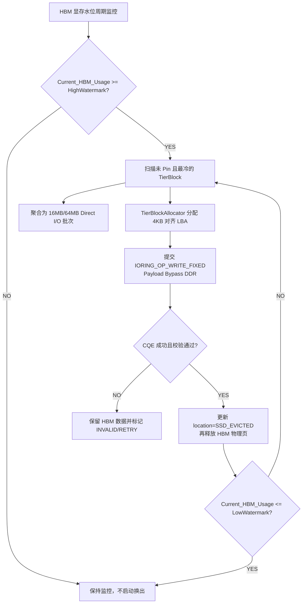

# PVT-05：HBM-SSD 直达容量主路径与 DDR 条件角色 Tiering 验证实施方案设计
## —— Mooncake LocalCache 分层存储重构：打通 io_uring HBM↔SSD 直达主路径

> **公共执行契约**：本项遵循 [Benchmark 公共契约与证据分级规范](./Benchmark公共契约与证据分级规范.md)。固定样例只用于展示流程；正式对照包含纯 HBM、原生 Mooncake SSD Offload、DDR 中转和 SSD 直达四组。容量按实际可服务 Token/请求计算，Host DDR 触碰来自探针。

> **验证 ID**：PVT-05  
> **验证名称**：HBM↔SSD 直达容量主路径与 DDR 条件角色 Tiering（分层存储）验证  
> **验证优先级**：**🔴 P0 级（核心关键项）**  
> **对应验证阶段**：**E2/E3 分层存储扩容收益**  
> **证伪标记**：否（容量扩展价值确认）  
> **主关联 IR**：`IR-01-01`, `IR-02-08`, `IR-02-09`  
> **核心 SRS / SR23 锚点**：  
> - SRS: `L3-MS-Tiering-038`, `L3-MC-HIER-STORE-002`, `L3-MS-DDRRolePolicy-092`, `L3-SE-TierBypassPolicy-091`  
> - SR23: `SR23-01-01-01`, `SR23-01-01-02`, `SR23-01-01-03`, `SR23-01-08-01`, `SR23-02-08-01`, `SR23-02-09-01`  
> **开源基线版本与代码仓库**：  
> - **Mooncake 存储引擎**：[`https://github.com/kvcache-ai/Mooncake.git`](https://github.com/kvcache-ai/Mooncake.git) (Commit: `f90ae691f109e49a60920e0c8abbf7e572826d8c`，子模块: `mooncake-store/`)  
> **研发对齐状态**：本方案将复核研发评估报告涉及的 `io_uring` 裸盘直达、4KB LBA 扇区分配器与 DDR 绕行条件，并以现场设备行为为准。

---

## 0. 架构导读与核心概念第一性原理剖析

### 0.1 传统系统开发视角：操作系统多级存储分层 (Tiering) 与异步 I/O 进化史

在操作系统内存管理、虚拟内存 Swap 以及数据库 Buffer Pool 的经典架构中，分层存储（Tiering）是解决“内存昂贵且容量有限”的标准解法：
- **物理分层金字塔**：
  - 一级（SRAM / HBM）：带宽和时延通常优于外部存储，但容量受单卡规格限制、单位容量成本较高；
  - 二级（Host DDR）：容量和带宽介于设备显存与 SSD 之间，具体能力按服务器规格记录；
  - 三级（NVMe SSD）：容量较大、单位容量成本较低，但访问时延和带宽受介质、PCIe 拓扑与队列深度影响。上述量级只能作为背景说明，不能替代 `hardware_profile` 的实测字段。
- **异步淘汰机制（Watermark LRU）**：
  - 当一级内存使用率达到高水位线（High Watermark，如 85%）时，后台守护线程异步启动扫描，将最久未被访问的冷数据页（LRU Cold Pages）刷写到大容量 NVMe SSD 中并释放显存；
  - 当显存占用回落至低水位线（Low Watermark，如 65%）时，后台停止换出；
  - 当某个请求再次需要冷数据时，按需从 SSD 异步加载（Page Fault / Restore）。

---

### 0.2 为什么必须使用 Linux 6.6+ `io_uring` FIXED Direct I/O？

为了测量并尽量利用 NVMe SSD 的硬件顺序读写能力，传统文件 I/O 方式需要重点核对以下开销：

#### 1. 传统 POSIX `read/write` 的瓶颈：
- 每次读写都要经历两次 CPU 用户态/内核态上下文切换（Context Switch）；
- 数据必须经过 Linux 内核的 Page Cache，导致 Host CPU 产生沉重的 `memcpy` 拷贝开销，并严重污染系统内存。

#### 2. Linux `io_uring` FIXED Direct I/O 的路径设计：
- **提交与完成环形队列（SQ / CQ）**：应用程序在用户态组织提交队列（Submission Queue），内核异步拉取并执行，完成后填入完成队列（Completion Queue）。批量提交可减少每个 I/O 的系统调用次数，但并不意味着系统调用开销为 0；
- **固定缓冲区注册 (`IORING_REGISTER_BUFFERS`)**：提前将 NPU HBM 或内存地址 Pin 锁定在内核中，消除每次 I/O 时的页表锁定开销；
- **Direct I/O (`O_DIRECT`) 裸盘直达**：目标是绕过 Linux Page Cache，并在设备支持 P2P DMA 且探针覆盖完整时，使数据在 SSD 物理扇区（LBA）与 NPU HBM 之间流转；**Payload Bypass DDR（绕过主机内存，正文不经 Host DDR）** 是否实现，必须由设备完成量和 Host 探针共同确认。

```
┌────────────────────────────────────────────────────────────────────────────────────────┐
│                   io_uring FIXED Direct I/O 裸盘直达数据流通路                         │
├────────────────────────────────────────────────────────────────────────────────────────┤
│                                                                                        │
│   [ NPU HBM 显存 (冷 KVCache) ]                                                        │
│                 │                                                                      │
│                 ▼ (PCIe P2P DMA 直达, 严格绕过 Host DDR)                               │
│   [ NVMe SSD 裸块设备 (/dev/nvme0n1, 4KB 对齐物理扇区 LBA) ]                            │
│                 ▲                                                                      │
│                 │ (用户态 SQ 批量提交, 减少每次 I/O 的系统调用次数)                     │
│   [ io_uring 用户态提交队列 (Submission Queue Ring) ]                                  │
│                                                                                        │
│ 待验证门限：顺序读写达标率与 Host DDR 触碰字节由现场设备和探针结果确认。             │
└────────────────────────────────────────────────────────────────────────────────────────┘
```

---

### 0.3 4KB 物理扇区对齐 (`posix_memalign`) 的工程要求

- **硬件约束**：NVMe 固态硬盘底层的物理读写单元是 4KB（4096 字节）逻辑块地址（LBA, Logical Block Address）。
- **Direct I/O 铁律**：当使用 `O_DIRECT` 与 `io_uring` 直接操作裸盘块设备时，Linux 内核要求：
  1. 内存缓冲区的物理起始地址必须按 **4096 字节严格对齐**；
  2. 磁盘文件/设备的偏移量（Offset）必须是 **4096 的整数倍**；
  3. 单次读写的字节长度（Length）必须是 **4096 的整数倍**。
- 如果违反上述任意一条，内核会立即返回 `-EINVAL`（Invalid Argument 22）错误！因此在代码中必须使用 `posix_memalign` 分配对齐内存，并在 `TierBlockAllocator` 中按 4KB 扇区管理 LBA 空间。

---

## 1. 验证目标与交付结论定义

### 1.1 现实前因痛点与待验证核心命题
1. **现实痛点**：显存容量极度昂贵匮乏，开源文件系统 Offload 极慢且严重抢占 CPU 资源；
2. **核心命题**：
   - **HBM ↔ SSD 直达容量主路径** 有效读写带宽达到 NVMe 物理设备顺序峰值的 **$\ge 80\%$**；
   - 在 130% ~ 200% HBM 额定容量的超载压力下，通过分层存储换入换出，实现**可服务有效 Token 容量提升 $\ge 30\%$**，**OOM 内存溢出率下降 $\ge 50\%$**；
   - 验证 **Payload 路径严格 Bypass Host DDR**（数据直接在 SSD 与 NPU HBM 间流转，Host DDR 触碰字节严格为 0）。

### 1.2 最终交付数据与结论产出
1. **《HBM ↔ SSD 裸盘与直达读写带宽达成率实测表》**；
2. **《超载压力下 纯 HBM vs DDR 中转 vs SSD 直达扩容与 OOM 对比表》**；
3. **《Payload Bypass DDR vs DDR 软中转 CPU 开销与时延对账表》**；
4. **《GO / CONDITIONAL / NO-GO / NOT-SUPPORTED / INVALID-EVIDENCE 判定结论》**。

---

## 2. 核心数据结构与 TierBlockAllocator 驱动设计

### 2.1 核心数据结构定义

```cpp
#include <stdint.h>
#include <atomic>
#include <vector>
#include <unordered_map>
#include <mutex>
#include <liburing.h>

enum class TierLocation : uint8_t {
    HBM_ACTIVE = 0,    // 驻留在一级 NPU HBM
    SSD_EVICTED = 1,   // 已换出至 NVMe SSD 阵列
    MIGRATING = 2      // 正在异步换入/换出中
};

struct alignas(64) TierBlockDescriptor {
    uint64_t block_id;
    uint32_t token_count;
    TierLocation location;
    uint64_t hbm_phys_addr;       // HBM 物理基址
    uint64_t ssd_lba_offset;      // NVMe 块设备物理 LBA 扇区偏移 (4KB 严格对齐)
    uint32_t size_bytes;          // 块字节大小 (如 2MB Extent)
    std::atomic<uint64_t> last_access_epoch; // LRU 访问热度时间戳
    std::atomic<uint16_t> pin_count;         // 活跃推理 Pin 计数 (禁止驱逐)
};

class TierBlockAllocator {
private:
    uint64_t total_lba_sectors_;
    std::atomic<uint64_t> free_sector_head_{0};
    const uint32_t sector_size_bytes_ = 4096; // 4KB 扇区

public:
    TierBlockAllocator(uint64_t disk_size_bytes) 
        : total_lba_sectors_(disk_size_bytes / sector_size_bytes_) {}

    uint64_t allocate_lba_extent(uint32_t bytes) {
        uint64_t sectors_needed = (bytes + sector_size_bytes_ - 1) / sector_size_bytes_;
        uint64_t start_sector = free_sector_head_.fetch_add(sectors_needed, std::memory_order_relaxed);
        return start_sector * sector_size_bytes_;
    }
};

struct WatermarkConfig {
    double high_watermark_pct = 0.85; // 85% 显存占用触发异步换出
    double low_watermark_pct = 0.65;  // 降至 65% 停止换出
    uint32_t max_concurrent_ios = 32; // io_uring 最大并发 QD
};
```

### 2.2 水位线驱动的冷 KV 异步换出与 `io_uring` Direct I/O 流程

水位线只负责触发后台动作，不能阻塞前台请求。被 `pin_count` 保护的活跃块不得驱逐；每次写盘完成后，必须先确认 CQE、校验数据和元数据状态，再释放 HBM 物理页。



---

## 3. 测试工具与工程构建规范

测试工程存放在 `./原型验证代码/PVT-05/` 目录下：

```
原型验证代码/PVT-05/
├── tier_storage_bench.cc      # NVMe SSD 直达压测工具
├── tier_allocator.h           # 4KB 对齐 LBA 块分配器
├── Makefile                   # 编译构建工程 (make -j16)
├── benchmark_tiering.py       # 150%~200% HBM 显存超载下分层扩容压测脚本
└── eval_tiering.py            # 四组模式对账与扩容收益分析脚本
```

编译方法：
```bash
cd ./原型验证代码/PVT-05 && make clean && make -j16
```

### 3.1 单元存储基准

```bash
./tier_storage_bench --device <nvme_block_device> --block-size 16M \
    --qd 32 --loops 100 --evidence-level LAB --out res_ssd_direct.csv
```

该步骤只测裸盘顺序读写和字段输出；`<nvme_block_device>`、块大小、队列深度和结果必须绑定到 `hardware_profile`。未接入真实 `io_uring`/SPDK 完成量时，只能验证 Schema，不能宣称 SSD 直达带宽达标。

### 3.2 原生 Mooncake SSD Offload 对照与四组模式对账

原生对照应使用固定的 Mooncake 代码包和配置，并与以下模式保持相同模型、请求集、超载比例、并发度和统计口径：`pure_hbm`、`mooncake_native_ssd`、`hbm_ddr_tier`、`hbm_ssd_direct`。

```bash
# 仅示意启动参数；实际路径和连接器配置按现场代码包替换。
export MOONCAKE_CONFIG_PATH="<mooncake_ssd_native_config>"
python3 -m vllm.entrypoints.openai.api_server \
    --model <model_path> --tensor-parallel-size 8 \
    --gpu-memory-utilization 0.50 \
    --kv-transfer-config '{"kv_connector": "MooncakeStoreConnector", "kv_role": "kv_both"}' \
    --port <native_port> &

python3 -m vllm.benchmarks.benchmark_serving \
    --backend vllm --model <model_path> --dataset-name sharegpt \
    --num-prompts 500 --request-rate 30 --port <native_port> \
    --save-result --result-filename ./res_tiering_native.json

# W0/DEMO 只核对结果 Schema；正式 LAB/MEASURED 必须由现场适配器提供实际 I/O。
python3 ./benchmark_tiering.py --mode hbm_ssd_direct --concurrency 64 \
    --overcommit 1.5 --out tiering_results_demo.json --evidence-level DEMO

# 现场适配器示意：四组模式都要写入同一套 manifest 和实际结果。
<site_tiering_runner> --mode <pure_hbm_or_mooncake_native_ssd_or_hbm_ddr_tier_or_hbm_ssd_direct> \
    --manifest <manifest.json>
```

> `tier_storage_bench` 当前若仍是字段脚手架，必须在结果中保留 `DEMO` 标识；正式测试需要实际设备提交量、完成量和 Host CPU 探针，不能以固定值替代。

---

## 4. 分步执行测试操作规程 (SOP)

开发人员在执行 PVT-05 时，请严格按照以下 6 个步骤逐步执行，并理解每一步的操作意图：

### 步骤 1：测试 NVMe 裸盘直接顺序读写带宽
- **操作意图**：通过 `io_uring` FIXED Direct I/O 对 NVMe 裸盘进行 16MB、64MB 大块读写压测，测量裸盘能够达到的最大硬件顺序吞吐，验证是否达到标称值的 80% 以上。
- **执行命令**：
```bash
./tier_storage_bench --device /dev/nvme0n1 --block-size 16M --qd 32 --loops 100 --out res_ssd_direct.csv
```

### 步骤 2：启动纯 HBM 基线在 150% 超载下的打流压测
- **操作意图**：在不开启分层存储的情况下，向集群打入 150% 额定显存容量的并发请求，记录 OOM 崩溃次数与被驱逐丢弃的请求数，作为对照基线。
- **执行命令**：
```bash
python3 ./benchmark_tiering.py --mode pure_hbm --concurrency 64 --overcommit 1.5 --out res_pure_hbm.json
```

### 步骤 3：启动原生 Mooncake SSD Offload 对照压测
- **操作意图**：在相同模型、请求集和超载比例下运行原生 Mooncake SSD Offload，记录换入换出路径、有效 Token、OOM/驱逐和 Host DDR 触碰，作为四组对账中的原生基线。
- **执行命令模板**：
```bash
python3 ./benchmark_tiering.py --mode mooncake_native_ssd --concurrency 64 --overcommit 1.5 --out res_mooncake_native.json --evidence-level LAB
```

### 步骤 4：启动 DDR 中转分层对照压测
- **操作意图**：保持模型、请求集、并发度和超载比例不变，显式启用 Host DDR 中转，测量 DDR 触碰字节、吞吐和前台影响；不得把该组结果与 SSD 直达路径混写。
- **执行命令模板**：
```bash
python3 ./benchmark_tiering.py --mode hbm_ddr_tier --concurrency 64 --overcommit 1.5 --out res_ddr_staging.json --evidence-level LAB
```

### 步骤 5：启动 SSD 直达分层存储在 150%~200% 超载下的打流压测
- **操作意图**：开启 `TierBlockAllocator` 与 `io_uring` 换出换入，在相同超载压力下打流，验证 OOM 发生率是否下降 50% 以上、可服务有效 Token 是否提升 30% 以上。
- **执行命令**：
```bash
python3 ./benchmark_tiering.py --mode hbm_ssd_direct --concurrency 64 --overcommit 1.5 --out res_ssd_tiering.json
```

### 步骤 6：生成四组模式对账表与扩容图表
- **操作意图**：汇总纯 HBM、Mooncake 原生 SSD Offload、DDR 软中转与 SSD 直达四组数据，输出对比表格。
- **执行命令**：
```bash
python3 ./eval_tiering.py \
    --pure-hbm res_pure_hbm.json \
    --mooncake-native res_mooncake_native.json \
    --ddr-staging res_ddr_staging.json \
    --ssd-tiering res_ssd_tiering.json \
    --out summary_tiering.csv
```

---

## 5. 数据采集清单与记录格式

### 5.1 分层存储超载压测数据表 (`pvt05_tiering_results.csv`)
```csv
test_case,overcommit_pct,mode,active_requests,served_tokens_total,oom_count,preempt_count,ssd_write_bw_gbps,ssd_read_bw_gbps,host_ddr_touch_bytes,evidence_level,status,invalid_reason
<test_case>,<overcommit_pct>,pure_hbm,<active_requests>,<served_tokens_total>,<measured_oom_count>,<measured_preempt_count>,<null>,<null>,<measured_host_ddr_touch_bytes>,<LAB_OR_DEMO>,<status>,<null_or_reason>
<test_case>,<overcommit_pct>,mooncake_native_ssd,<active_requests>,<served_tokens_total>,<measured_oom_count>,<measured_preempt_count>,<measured_or_null>,<measured_or_null>,<measured_host_ddr_touch_bytes>,<LAB_OR_DEMO>,<status>,<null_or_reason>
<test_case>,<overcommit_pct>,ddr_staging,<active_requests>,<served_tokens_total>,<measured_oom_count>,<measured_preempt_count>,<measured_or_null>,<measured_or_null>,<measured_host_ddr_touch_bytes>,<LAB_OR_DEMO>,<status>,<null_or_reason>
<test_case>,<overcommit_pct>,hbm_ssd_direct,<active_requests>,<served_tokens_total>,<measured_oom_count>,<measured_preempt_count>,<measured_ssd_write_bw_gbps>,<measured_ssd_read_bw_gbps>,<measured_host_ddr_touch_bytes>,<LAB_OR_DEMO>,<status>,<null_or_reason>
```

> 表中为结果字段模板，不是预置实测结果。没有真实 I/O 完成量、OOM/驱逐日志或 Host Touch 探针时，状态必须为 `INVALID-EVIDENCE`；设备不支持该路径时记录 `NOT-SUPPORTED`。

---

## 6. GO / CONDITIONAL / NO-GO / NOT-SUPPORTED / INVALID-EVIDENCE 判定规则

- **GO（准入通过）**：
  - 在 150% 显存超载下，系统支持的可服务 Token 容量提升 $\ge 30\%$；
  - OOM 错误与请求驱逐发生率降低 $\ge 50\%$；
  - SSD 直达主路径全程 Bypass Host DDR（`Host Payload Touch Bytes` 严格为 0）。
- **CONDITIONAL（条件准入）**：容量提升在 $20\% \sim 30\%$ 之间，且前台时延与数据完整性仍满足约束；
- **NO-GO（暂不准入）**：现场证据确认 SSD 换入换出导致前台长尾超出门限，或无法绕过 Host DDR；
- **NOT-SUPPORTED（当前不支持）**：SSD、P2P DMA 或目标直达驱动能力不具备；DDR 中转对照仍可单独记录，但不能据此宣称 SSD 直达成立；
- **INVALID-EVIDENCE（证据无效）**：缺少纯 HBM 对照、四种模式的同场次记录、I/O 完成事件、Host 探针或完整性校验。缺失字段必须使用 `null` 并填写 `invalid_reason`。

---

## 7. 零 AI 基础工程师借助 AI Agent 开展工作实战 SOP

### 7.1 研发任务拆解与分工
- **工程师职责**：
  1. 准备 NVMe 测试盘或裸分区；
  2. 按照第 4 节 SOP 步骤执行超载打流；
  3. 观察 `dmesg` 是否有 I/O 错误，检查 OOM 记录；
- **AI Agent 职责**：
  1. 负责 `tier_storage_bench.cc` 中 `io_uring` FIXED 缓冲区注册逻辑；
  2. 编写 Python 脚本自动计算超载容量提升率与 OOM 降低率。

### 7.2 专属 Prompt 模板（可直接复制给 AI Agent）
```text
我是一名存储/Linux 系统工程师，正在进行 PVT-05 HBM-SSD 直达分层存储扩容验证：
1. 请阅读 ./原型验证代码/PVT-05/tier_storage_bench.cc 与 benchmark_tiering.py；
2. 检查 io_uring 提交逻辑，确保使用了 IORING_OP_READ_FIXED / IORING_OP_WRITE_FIXED，且缓冲区使用 posix_memalign 进行了 4096 字节对齐；
3. 按照第 4 节 SOP 步骤执行压测，测试 NVMe 裸盘在 16MB、64MB 块大小下的顺序读写带宽；
4. 运行 benchmark_tiering.py 模拟 150% 与 200% 的显存超载流量，统计纯 HBM vs SSD 直达下的 OOM 发生次数与可服务 Token 提升比例；
5. 输出对比 CSV 表格。
```

### 7.3 常见排错指南
- **`io_uring` 报 `EFAULT` 错误**：检查显存指针是否成功通过 `io_uring_register_buffers` 进行了内核固定缓冲注册；
- **磁盘写入吞吐远低于预期**：检查是否开启了文件系统日志（Ext4/XFS），直达测试必须使用裸块设备分区并设置 `O_DIRECT`。
