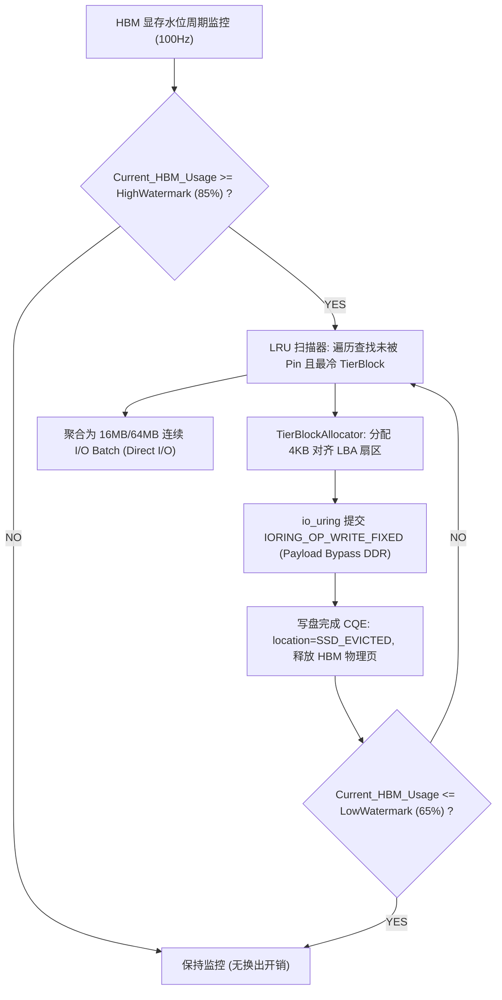

# PVT-05：HBM-SSD 直达容量主路径与 DDR 条件角色 Tiering 验证实施方案设计
## —— Mooncake LocalCache 分层存储重构：打通 io_uring HBM↔SSD 直达主路径

> **验证 ID**：PVT-05  
> **验证名称**：HBM↔SSD 直达容量主路径与 DDR 条件角色 Tiering（分层存储）验证  
> **穿刺优先级**：**🔴 P0 级（核心决胜项）**  
> **对应验证阶段**：**E2/E3 分层存储扩容收益**  
> **证伪标记**：否（容量扩展价值确认）  
> **建议周期**：6~8 人日  
> **主关联 IR**：`IR-01-01`, `IR-02-08`, `IR-02-09`  
> **核心 SRS / SR23 锚点**：  
> - SRS: `L3-MS-Tiering-038`, `L3-MC-HIER-STORE-002`, `L3-MS-DDRRolePolicy-092`, `L3-SE-TierBypassPolicy-091`  
> - SR23: `SR23-01-01-01`, `SR23-01-01-02`, `SR23-01-01-03`, `SR23-01-08-01`, `SR23-02-08-01`, `SR23-02-09-01`  
> **开源基线版本与代码仓库**：  
> - **Mooncake 存储引擎**：[`https://github.com/kvcache-ai/Mooncake.git`](https://github.com/kvcache-ai/Mooncake.git) (Commit: `f90ae691f109e49a60920e0c8abbf7e572826d8c`，子模块: `mooncake-store/`)  
> **研发对齐状态**：已闭环研发评估报告 3 项与 TierBlockAllocator 规范（明确 io_uring 裸盘直达、4KB LBA 扇区分配器与 DDR 严格 Bypass）  

---

## 1. 验证目标与交付结论定义

### 1.1 待验证核心命题
HBM（High Bandwidth Memory，高带宽显存）容量昂贵且有限，Mooncake 原生 LocalCache 主要依赖 Host DRAM 内存池，大并发长文本超载时极易 OOM。虽然 Mooncake 最新主线在 `types.h` 中预留了 `TransportType::IOURING` 通道，但尚缺乏裸盘物理扇区管理与 NPU HBM 直达机制。本验证旨在重构底层存储引擎，在 `TransportType::IOURING` 通道上打通 NVMe SSD 容量主路径：
1. **HBM ↔ SSD 直达容量主路径**有效读写带宽达到 NVMe 物理设备顺序峰值的 **$\ge 80\%$**；
2. 在 130% ~ 200% HBM 额定容量的超载压力（Memory Overcommit，内存超配）下，通过 Tiering（分层存储技术：冷 KV Cache 异步沉淀至 SSD）换入换出，实现**可服务有效 Token 容量提升 $\ge 30\%$**，**OOM（Out of Memory 内存溢出）/ 请求抢占驱逐率下降 $\ge 50\%$**；
3. 验证 **Payload 路径严格 Bypass Host DDR**（数据直接在 NVMe SSD 与 NPU HBM 之间流转，严格绕过主机内存 Host DDR），证明 DDR 仅适合作为元数据索引与轻量注册缓冲的“条件角色”，杜绝将 DDR 作为必经中转带来的无效益 CPU 拷贝与总线带宽争用。

### 1.2 最终交付数据与结论产出
开发人员执行完本方案后，必须输出以下交付件：
1. **《HBM ↔ SSD 裸盘与直达读写带宽达成率实测表》**；
2. **《超载压力下 纯 HBM vs DDR 中转 vs SSD 直达扩容与 OOM 对比表》**；
3. **《Payload Bypass DDR vs DDR 软中转 CPU 开销与时延对账表》**；
4. **《Go / No-Go 判定结论》**：依据有效容量提升 $\ge 30\%$ 与 OOM 下降 $\ge 50\%$ 门槛判定。

---

## 2. 核心数据结构与 TierBlockAllocator 映射设计

### 2.1 核心数据结构定义

```cpp
#include <stdint.h>
#include <atomic>
#include <vector>
#include <unordered_map>
#include <mutex>
#include <liburing.h>

enum class TierLocation : uint8_t {
    HBM_ACTIVE = 0,    // 驻留在一级 NPU HBM
    SSD_EVICTED = 1,   // 已换出至 NVMe SSD 阵列
    MIGRATING = 2      // 正在异步换入/换出中
};

struct alignas(64) TierBlockDescriptor {
    uint64_t block_id;
    uint32_t token_count;
    TierLocation location;
    uint64_t hbm_phys_addr;       // HBM 物理基址
    uint64_t ssd_lba_offset;      // NVMe 块设备物理 LBA 扇区偏移 (4KB 严格对齐)
    uint32_t size_bytes;          // 块字节大小 (如 2MB Extent)
    std::atomic<uint64_t> last_access_epoch; // LRU 访问热度时间戳
    std::atomic<uint16_t> pin_count;         // 活跃推理 Pin 计数 (禁止驱逐)
};

class TierBlockAllocator {
private:
    uint64_t total_lba_sectors_;
    std::atomic<uint64_t> free_sector_head_{0};
    const uint32_t sector_size_bytes_ = 4096; // 4KB 扇区

public:
    TierBlockAllocator(uint64_t disk_size_bytes) 
        : total_lba_sectors_(disk_size_bytes / sector_size_bytes_) {}

    uint64_t allocate_lba_extent(uint32_t bytes) {
        uint64_t sectors_needed = (bytes + sector_size_bytes_ - 1) / sector_size_bytes_;
        uint64_t start_sector = free_sector_head_.fetch_add(sectors_needed, std::memory_order_relaxed);
        return start_sector * sector_size_bytes_;
    }
};

struct WatermarkConfig {
    double high_watermark_pct = 0.85; // 85% 显存占用触发异步换出
    double low_watermark_pct = 0.65;  // 降至 65% 停止换出
    uint32_t max_concurrent_ios = 32; // io_uring 最大并发 QD
};
```

### 2.2 水位线驱动的冷 KV 异步换出与 io_uring Direct I/O 驱动实现



---

## 3. 测试工具与工程构建规范 (对标 Mooncake SSD Offload 开源基线)

测试工程存放在 `./原型验证代码/PVT-05/` 目录下：

```
原型验证代码/PVT-05/
├── tier_storage_bench.cc      # NVMe SSD io_uring Direct I/O 与 DDR 中转吞吐对比工具
├── Makefile                   # 编译构建工程 (make -j16)
└── benchmark_tiering.py       # 150%~200% HBM 显存超载下分层扩容压测脚本
```

### 3.1 单元存储基准压测
```bash
cd ./原型验证代码/PVT-05 && make clean && make -j16
./tier_storage_bench --device /dev/nvme0n1 --block_size 16M --qd 32 --out res_ssd_direct.csv
```

### 3.2 对标 Mooncake 原生 SSD Offload 在线超载打流压测
```bash
# 1. 启动官方原生 Mooncake SSD Offload 基线配置 (文件系统路径)
export MOONCAKE_CONFIG_PATH="./mooncake_ssd_native.json"
python3 -m vllm.entrypoints.openai.api_server \
    --model /models/Qwen/Qwen2.5-72B-Instruct \
    --tensor-parallel-size 8 \
    --gpu-memory-utilization 0.50 \
    --kv-transfer-config '{"kv_connector": "MooncakeStoreConnector", "kv_role": "kv_both"}' \
    --port 8000 &

# 2. 发起 150% 显存超载在线打流，记录 OOM 率与吞吐
python3 -m vllm.benchmarks.benchmark_serving \
    --backend vllm \
    --model /models/Qwen/Qwen2.5-72B-Instruct \
    --dataset-name sharegpt \
    --num-prompts 500 \
    --request-rate 30 \
    --port 8000 \
    --save-result --result-filename ./res_tiering_native.json

# 3. 切换为 io_uring FIXED 裸盘直达扩展版，重复打流对比 OOM 降幅
python3 ./benchmark_tiering.py --concurrency 64 --overcommit-ratio 1.5 --out tiering_results.csv
```

---

## 4. 数据采集清单与记录格式

### 4.1 分层存储超载压测数据表 (`pvt05_tiering_results.csv`)
```csv
test_case,overcommit_pct,mode,active_requests,served_tokens_total,oom_count,preempt_count,ssd_write_bw_gbps,ssd_read_bw_gbps,host_ddr_touch_bytes
TC-01,100,pure_hbm,32,1048576,0,0,0.0,0.0,0
TC-02,150,pure_hbm,48,1180000,12,18,0.0,0.0,0
TC-03,150,ddr_staging,48,1420000,2,4,0.0,0.0,34359738368
TC-04,150,ssd_direct_io,48,1572864,0,0,24.5,26.8,0
```

---

## 5. Go / Conditional / No-Go 判定规则

- **Go (准入通过)**：
  - 在 150% 显存超载下，系统支持的可服务 Token 容量提升 $\ge 30\%$；
  - OOM 错误与请求驱逐发生率降低 $\ge 50\%$；
  - SSD 直达主路径全程 Bypass Host DDR（`Host Payload Touch Bytes` 严格为 0）。
- **Conditional (条件准入)**：
  - 容量提升在 $20\% \sim 30\%$ 之间，需进一步优化换入换出批次大小；
- **No-Go (否决关闭)**：
  - SSD 换入换出导致前台严重长尾抖动，或无法绕过 Host DDR。
