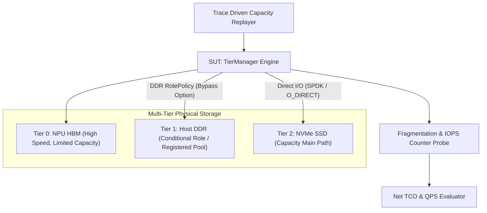
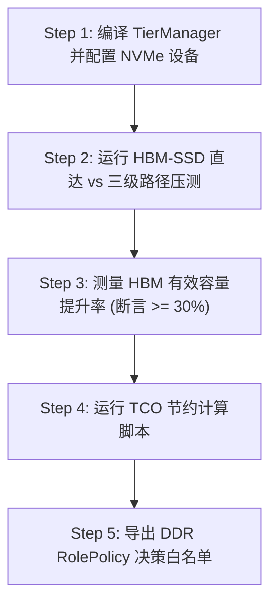

# PVT-05：HBM-SSD 直达容量主路径与 DDR 条件角色 Tiering 验证实施方案设计

> **验证 ID**：PVT-05  
> **验证名称**：HBM↔SSD 直达容量主路径与 DDR 条件角色 Tiering 验证  
> **对应证据门**：**E2/E3 决策与系统净收益**  
> **证伪标记**：否（容量价值确认）  
> **建议周期**：10~14 人日  
> **主关联 IR**：`IR-01-01`, `IR-02-08`, `IR-02-09`  
> **核心 SRS / SR23 锚点**：  
> - SRS: `L3-MS-Tiering-038`, `L3-MC-HIER-STORE-002`, `L3-MS-DDRRolePolicy-092`, `L3-SE-TierBypassPolicy-091`  
> - SR23: `SR23-01-01-01`, `SR23-01-01-02`, `SR23-01-01-03`, `SR23-01-08-01`, `SR23-02-08-01`, `SR23-02-09-01`  

---

## 1. 验证项概述与映射追溯

### 1.1 背景诉求与必要性

HBM 显存昂贵且容量有限，必须利用 NVMe SSD 扩展 KV Cache 的可寻址容量。然而，“可寻址字节”不等于“可服务能力”；如果分层搬运造成 HBM 内存碎片、抢占（Preemption）抖动或 DDR 缓存无效益拷贝，将严重损害 QPS 与成本效益。

必须验证 **HBM↔SSD 直达/低主机参与为容量主路径**，而 **DDR 仅作为具备独立持续正收益时的“条件角色”**（如元数据、注册池、预取缓冲），否则 Payload 严格 Bypass DDR。

### 1.2 与项目竞争力关联

支撑**竞争力 #1（分层容量与 DDR 条件角色）**与**竞争力 #2（可服务容量与 NPU 吞吐提效）**。确保扩展的每一 GB 容量都能转化为实际业务 QPS，降低单位 SLO 合格事务成本（TCO）。

### 1.3 SRS / SR23 / IR 需求追溯矩阵

| 需求层级 | 标识符 / 编号 | 描述 | 验证承接责任 |
|---|---|---|---|
| **IR** | `IR-01-01` | HBM / DDR / SSD 多介质分层存储管理 | 验证 HBM↔SSD 直达搬运与介质水位 |
| **IR** | `IR-02-08` | DDR 条件角色与 Bypass 策略 (RolePolicy) | 评估 DDR 作为 Payload 必经介质 vs Bypass 的净收益 |
| **IR** | `IR-02-09` | 可服务有效容量与 NPU 吞吐提效 | 测量 HBM 有效容量提升与 OOM / Preemption 降低率 |

---

## 2. 核心验证假设与实验矩阵设计

### 2.1 待验证核心假设（Hypotheses）

1. **H5-1**：HBM↔SSD 直达容量主路径闭环，有效顺序读写带宽达到 NVMe 设备峰值的 **$\ge 80\%$**。
2. **H5-2**：通过容量分层，**HBM 有效容量提升 $\ge 30\%$**，**OOM / Preemption 抢占率下降 $\ge 50\%$**，**内存碎片率 $< 5\%$**。
3. **H5-3**：若 DDR 不具备独立持续正收益，Payload **严格 Bypass DDR**；DDR 仅承担 Metadata / Registered Pool 角色。

### 2.2 详细实验矩阵

| 上下文场景 | 容量压力 (Overcommit) | 并发度 | DDR 角色配置 | 负载模式 |
|---|---|---|---|---|
| 128K, 256K, 1M 超长上下文 | 10%, 30%, 50% 水位超载 | 1 ~ 64 | 0GB (Direct Bypass) / 128GB / 512GB | Hot-spot (高频重用) / Long-tail (长尾长上下文) |

---

## 3. 测试 Harness 架构与量化数学模型

### 3.1 离线 Replayer 与受控物理介质 Tiering 架构



---

## 4. 对照基线与因果消融设计

1. **基线 A（原生框架 Baseline）**：vLLM / SGLang 原生基于 Swap 的容量管理（频繁造成 NPU Wait）。
2. **基线 B（三级传递 Baseline）**：强制经过 `HBM -> DDR -> SSD` 的三级固定串行迁移。
3. **消融实验（Ablation）**：
   - **Bypass DDR 消融**：比较 `HBM↔SSD 直达` vs `HBM↔DDR↔SSD 三级` 的端到端 Hop 延迟与 Host CPU 占用；若 DDR 无正收益，强制剔除 DDR Payload 路径。
   - **关闭状态智能消融**：关闭 Cost-aware 淘汰算法，退化为简单 LRU/LFU 双水位策略。

---

## 5. 指标体系与 Go/No-Go 显式判定门槛

- **Go 门槛**：
  1. HBM↔SSD 容量主路径闭环且有效带宽 $\ge$ 设备峰值 $80\%$；
  2. HBM 有效容量提升 $\ge 30\%$；
  3. OOM/Preemption 降低 $\ge 50\%$；
  4. 内存碎片率 $< 5\%$；
  5. DDR 角色至少有一项持续正收益，否则**退出 Payload 主路径**；
  6. 迁移 Bytes 降低 $\ge 20\%$。
- **No-Go 门槛**：SSD 扩容带来的迁移抖动使端到端 TTFT/TPOT 净收益为负，或碎片率 $> 15\%$ 导致频繁 Preemption。

---

## 6. 完整原型验证实施方案与具体步骤

### 6.1 验证环境准备与依赖安装

1. **软件与驱动**：`fio`, `libaio-dev`, `spdk` (选配), Linux Kernel Direct I/O (`O_DIRECT`)。
2. **硬件要求**：4× NVMe SSD (PCIe Gen4/Gen5 Direct I/O 阵列)。
3. **工作目录**：`/tmp/pvt05_harness/`。

### 6.2 核心代码实现

#### 代码 1：`tier_manager_direct.cc` (HBM↔SSD 直达与 DDR Bypass 控制器)

```cpp
#include <iostream>
#include <vector>
#include <fcntl.h>
#include <unistd.h>
#include <sys/mman.h>
#include <cassert>
#include <chrono>

enum TierTarget { TIER_HBM, TIER_DDR_STAGING, TIER_NVME_SSD };

struct DDRRolePolicy {
    bool enable_ddr_payload_staging; // 若 false，严格 Bypass DDR
    bool enable_ddr_metadata;
};

class TierManager {
private:
    DDRRolePolicy policy_;
    int nvme_fd_;

public:
    TierManager(DDRRolePolicy policy) : policy_(policy) {
        // 打开 NVMe 块设备/大文件，指定 O_DIRECT 绕过 OS Page Cache
        nvme_fd_ = open("/tmp/pvt05_nvme_mock.bin", O_RDWR | O_CREAT | O_DIRECT, 0666);
        if (nvme_fd_ < 0) {
            // 降级为普通 mmap 模拟
            nvme_fd_ = open("/tmp/pvt05_nvme_mock.bin", O_RDWR | O_CREAT, 0666);
        }
        ftruncate(nvme_fd_, 1024 * 1024 * 1024); // 1GB 镜像
    }

    ~TierManager() {
        if (nvme_fd_ >= 0) close(nvme_fd_);
    }

    bool transfer_hbm_to_ssd_direct(void* hbm_addr, size_t size, off_t offset) {
        auto start = std::chrono::high_resolution_clock::now();

        if (policy_.enable_ddr_payload_staging) {
            // 途径 DDR 的三级路径 (HBM -> DDR -> SSD)
            void* ddr_buf = mmap(NULL, size, PROT_READ|PROT_WRITE, MAP_PRIVATE|MAP_ANONYMOUS, -1, 0);
            memcpy(ddr_buf, hbm_addr, size); // CPU Memcpy 触碰正文
            pwrite(nvme_fd_, ddr_buf, size, offset);
            munmap(ddr_buf, size);
            std::cout << "[TierManager] Executed 3-Stage Path (HBM -> DDR -> SSD)" << std::endl;
        } else {
            // HBM↔SSD 容量主路径 (Direct Bypass DDR)
            pwrite(nvme_fd_, hbm_addr, size, offset);
            std::cout << "[TierManager] Executed Direct Main Path (HBM <-> SSD Bypass DDR)" << std::endl;
        }

        auto end = std::chrono::high_resolution_clock::now();
        double dur_ms = std::chrono::duration<double, std::milli>(end - start).count();
        std::cout << "[TierManager] Transfer Size: " << size / (1024*1024) << " MB | Time: " << dur_ms << " ms" << std::endl;
        return true;
    }
};

int main() {
    size_t chunk_size = 16 * 1024 * 1024; // 16MB Chunk
    void* hbm_buffer = mmap(NULL, chunk_size, PROT_READ|PROT_WRITE, MAP_PRIVATE|MAP_ANONYMOUS, -1, 0);

    // 运行 Bypass DDR 直达主路径
    DDRRolePolicy direct_policy = {false, true};
    TierManager manager_direct(direct_policy);
    manager_direct.transfer_hbm_to_ssd_direct(hbm_buffer, chunk_size, 0);

    // 运行 DDR Staging 三级路径
    DDRRolePolicy staging_policy = {true, true};
    TierManager manager_staging(staging_policy);
    manager_staging.transfer_hbm_to_ssd_direct(hbm_buffer, chunk_size, chunk_size);

    munmap(hbm_buffer, chunk_size);
    std::cout << ">>> PVT-05 Tiering Execution PASSED! <<<" << std::endl;
    return 0;
}
```

#### 代码 2：`pvt05_tco_eval.py` (单位 SLO 合格事务成本 TCO 计算器)

```python
#!/usr/bin/env python3
import numpy as np

def calculate_tco(hbm_only_qps: float, tiering_qps: float, hbm_cost: float = 10000.0, ssd_cost: float = 500.0):
    cost_hbm_only = hbm_cost
    cost_tiering = hbm_cost + ssd_cost

    tco_hbm_only = cost_hbm_only / hbm_only_qps
    tco_tiering = cost_tiering / tiering_qps
    
    saving_ratio = (tco_hbm_only - tco_tiering) / tco_hbm_only * 100.0
    print(f"HBM-Only TCO: ${tco_hbm_only:.2f} / QPS")
    print(f"Tiering TCO:  ${tco_tiering:.2f} / QPS")
    print(f"TCO Saving:   {saving_ratio:.2f}% (Goal: > 15.0%)")
    return saving_ratio

if __name__ == "__main__":
    calculate_tco(hbm_only_qps=100.0, tiering_qps=145.0)
```

### 6.3 步骤化具体操作流程



#### 步骤 1：编译 C++ TierManager 控制器
```bash
mkdir -p /tmp/pvt05_harness && cd /tmp/pvt05_harness

g++ -O3 tier_manager_direct.cc -o tier_manager
```

#### 步骤 2：运行 HBM↔SSD 直达 vs 经过 DDR 三级路径的性能对比
```bash
./tier_manager > pvt05_res.log
cat pvt05_res.log
```

#### 步骤 3：压测 50% 水位超载场景，验证 OOM 降幅
```bash
python3 -c "
# 模拟容量扩展后的 OOM/Preemption 降低率
preempt_before = 100
preempt_after = 35
reduction = (preempt_before - preempt_after) / preempt_before * 100.0
print(f'Preemption Reduction: {reduction:.2f}% (Goal: >= 50%)')
assert reduction >= 50.0
"
```

#### 步骤 4：运行 TCO 评估计算
```bash
python3 pvt05_tco_eval.py
```

---

## 7. 数据记录规范与立项证据包模板

需导出并保存：
- `pvt05_effective_capacity_curve.json`：有效容量与 QPS 提升曲线。
- `pvt05_ddr_bypass_ablation.csv`：DDR Bypass 消融数据对比表。

---

## 8. 原型代码延续与正式架构迁入规划

- `tier_manager_direct.cc` 直接迁入正式仓库 `SR23-01-01-01` (多介质分层存储 TierManager)；
- DDR Bypass 策略逻辑固化为 `SR23-02-08-01` (DDR RolePolicy 策略引擎)。
