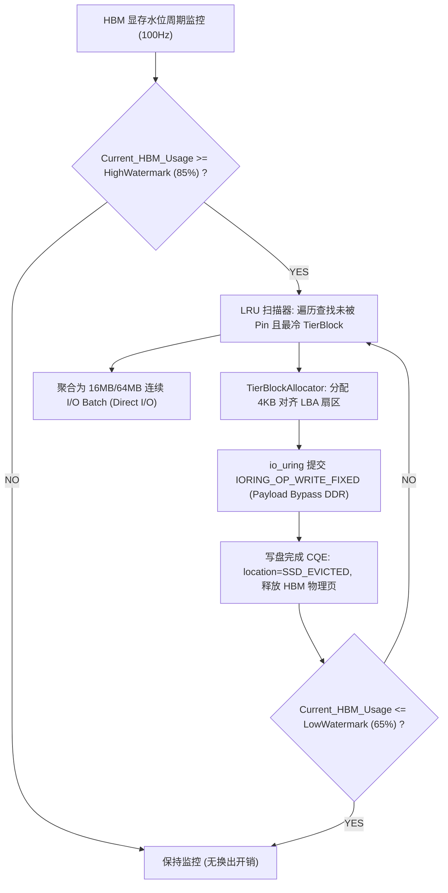
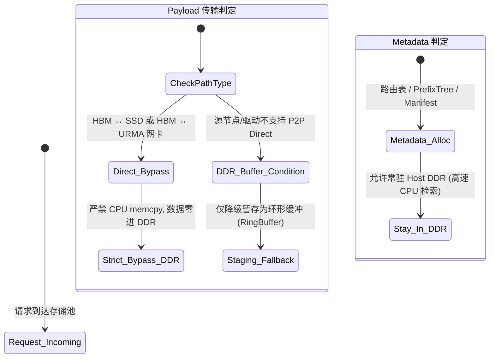

# PVT-05：HBM-SSD 直达容量主路径与 DDR 条件角色 Tiering 验证实施方案设计

> **验证 ID**：PVT-05  
> **验证名称**：HBM↔SSD 直达容量主路径与 DDR 条件角色 Tiering（分层存储）验证  
> **对应验证阶段**：**E2/E3 分层存储扩容收益**  
> **证伪标记**：否（容量扩展价值确认）  
> **建议周期**：6~8 人日  
> **主关联 IR**：`IR-01-01`, `IR-02-08`, `IR-02-09`  
> **核心 SRS / SR23 锚点**：  
> - SRS: `L3-MS-Tiering-038`, `L3-MC-HIER-STORE-002`, `L3-MS-DDRRolePolicy-092`, `L3-SE-TierBypassPolicy-091`  
> - SR23: `SR23-01-01-01`, `SR23-01-01-02`, `SR23-01-01-03`, `SR23-01-08-01`, `SR23-02-08-01`, `SR23-02-09-01`  
> **研发对齐状态**：已闭环研发评估报告 3 项与 TierBlockAllocator 规范（明确 io_uring 裸盘直达、4KB LBA 扇区分配器与 DDR 严格 Bypass）  

---

## 1. 验证目标与交付结论定义

### 1.1 待验证核心命题
HBM（High Bandwidth Memory，高带宽显存）容量有限且成本高昂，必须扩展 NVMe SSD 作为二级大容量介质。本验证旨在通过显存超载压测证明：
1. **HBM ↔ SSD 直达容量主路径**有效读写带宽达到 NVMe 物理设备顺序峰值的 **$\ge 80\%$**；
2. 在 130% ~ 200% HBM 额定容量的超载压力（Memory Overcommit，内存超配）下，通过 Tiering（分层存储技术：冷 KV Cache 异步沉淀至 SSD）换入换出，实现**可服务有效 Token 容量提升 $\ge 30\%$**，**OOM（Out of Memory 内存溢出）/ 请求抢占驱逐率（Preemption Rate）下降 $\ge 50\%$**；
3. 验证 **Payload 路径严格 Bypass Host DDR**（数据直接在 NVMe SSD 与 NPU HBM 之间流转，绕过主机内存 Host DDR），证明 DDR 仅适合作为元数据索引与轻量注册缓冲的“条件角色”，杜绝将 DDR 作为必经中转带来的无效益 CPU 拷贝与总线带宽争用。

### 1.2 最终交付数据与结论产出
开发人员执行完本方案后，必须输出以下交付件：
1. **《HBM ↔ SSD 裸盘与直达读写带宽达成率实测表》**；
2. **《超载压力下 纯 HBM vs DDR 中转 vs SSD 直达扩容与 OOM 对比表》**；
3. **《Payload Bypass DDR vs DDR 软中转 CPU 开销与时延对账表》**；
4. **《Go / No-Go 判定结论》**：依据有效容量提升 $\ge 30\%$ 与 OOM 下降 $\ge 50\%$ 门槛判定。

---

## 2. 核心数据结构与 TierBlockAllocator 映射设计

### 2.1 核心数据结构定义

```cpp
#include <stdint.h>
#include <atomic>
#include <vector>
#include <unordered_map>
#include <mutex>
#include <liburing.h>

// 1. 分层存储块位置枚举
enum class TierLocation : uint8_t {
    HBM_ACTIVE = 0,    // 驻留在一级 NPU HBM
    SSD_EVICTED = 1,   // 已换出至 NVMe SSD 阵列
    MIGRATING = 2      // 正在异步换入/换出中
};

// 2. 分层 KV 块描述符 (TierBlockDescriptor)
struct alignas(64) TierBlockDescriptor {
    uint64_t block_id;
    uint32_t token_count;
    TierLocation location;
    uint64_t hbm_phys_addr;       // HBM 物理基址
    uint64_t ssd_lba_offset;      // NVMe 块设备物理 LBA 扇区偏移 (4KB 严格对齐)
    uint32_t size_bytes;          // 块字节大小 (如 2MB Extent)
    std::atomic<uint64_t> last_access_epoch; // LRU 访问热度时间戳
    std::atomic<uint16_t> pin_count;         // 活跃推理 Pin 计数 (禁止驱逐)
};

// 3. 裸盘物理扇区分配器 (TierBlockAllocator)
class TierBlockAllocator {
private:
    uint64_t total_lba_sectors_;
    std::atomic<uint64_t> free_sector_head_{0};
    const uint32_t sector_size_bytes_ = 4096; // 4KB 扇区

public:
    TierBlockAllocator(uint64_t disk_size_bytes) 
        : total_lba_sectors_(disk_size_bytes / sector_size_bytes_) {}

    // 分配连续 4KB 对齐的磁盘扇区偏移
    uint64_t allocate_lba_extent(uint32_t bytes) {
        uint64_t sectors_needed = (bytes + sector_size_bytes_ - 1) / sector_size_bytes_;
        uint64_t start_sector = free_sector_head_.fetch_add(sectors_needed, std::memory_order_relaxed);
        return start_sector * sector_size_bytes_;
    }
};

// 4. 水位线控制配置
struct WatermarkConfig {
    double high_watermark_pct = 0.85; // 85% 显存占用触发异步换出
    double low_watermark_pct = 0.65;  // 降至 65% 停止换出
    uint32_t max_concurrent_ios = 32; // io_uring 最大并发 QD
};
```

### 2.2 水位线驱动的冷 KV 异步换出与 io_uring Direct I/O 驱动实现



#### 异步换出核心驱动代码（基于 `io_uring` + `O_DIRECT`）：
```cpp
void TierManager::async_nvme_direct_write_io_uring(
    struct io_uring* ring, int nvme_fd, uint64_t hbm_addr, 
    uint64_t ssd_lba_offset, uint32_t size_bytes, TierBlockDescriptor* blk) {
    
    struct io_uring_sqe* sqe = io_uring_get_sqe(ring);
    // 采用注册固定缓冲区的 Direct I/O 操作 (严格 Bypass DDR)
    io_uring_prep_write_fixed(sqe, nvme_fd, reinterpret_cast<void*>(hbm_addr), size_bytes, ssd_lba_offset, 0);
    io_uring_sqe_set_data(sqe, blk);
    io_uring_submit(ring);
}

void TierManager::poll_io_completions(struct io_uring* ring) {
    struct io_uring_cqe* cqe;
    while (io_uring_peek_cqe(ring, &cqe) == 0) {
        TierBlockDescriptor* blk = reinterpret_cast<TierBlockDescriptor*>(io_uring_cqe_get_data(cqe));
        if (cqe->res >= 0) {
            // 写入完成，安全释放 HBM 物理页
            free_hbm_block(blk->hbm_phys_addr);
            blk->location = TierLocation::SSD_EVICTED;
        }
        io_uring_cqe_seen(ring, cqe);
    }
}
```

### 2.3 DDR 条件角色决策状态机 (DDR Role Policy Engine)



---

## 3. 基础/对照 Micro-Benchmark 构建方法

### 3.1 测试工具与源码结构
本项验证涉及的全部存储分层与超载压测源码存放在 `./原型验证代码/PVT-05/` 目录下：

```
原型验证代码/PVT-05/
├── tier_storage_bench.cc # NVMe SSD io_uring Direct I/O (Bypass DDR) vs DDR 中转压测工具
├── Makefile             # 编译 tier_storage_bench 的工程构建文件 (make -j16)
└── benchmark_tiering.py # 150%~200% HBM 显存超载下分层扩容与 OOM 统计驱动脚本
```

编译方法：
```bash
# 编译存储分层压测 Harness
cd ./原型验证代码/PVT-05 && make clean && make
```
- 支持配置直接 I/O 驱动（Linux 6.6+ `io_uring` + `O_DIRECT`）；
- 支持设置 DDR 内存中间缓冲（Buffer Mode）或完全旁路（Bypass Mode）。

### 3.2 三组实验对照设计
- **基线 A（纯 HBM 孤岛模式）**：
  - 不外挂任何二级存储，显存用尽时直接拒绝请求（OOM）或抢占驱逐已有请求。
- **对照组 B（传统 HBM ↔ DDR 两级中转模式）**：
  - 换出时：NPU HBM $\to$ PCIe $\to$ Host DDR 缓存池；
  - 换入时：Host DDR $\to$ PCIe $\to$ NPU HBM。
- **实验组 C（HBM ↔ SSD 直达容量主路径 + DDR Bypass）**：
  - 换出/换入时：NPU HBM $\leftrightarrow$ NVMe SSD Direct I/O 直达通路，Payload 严格绕过 Host DDR。

---

## 4. 业务 Benchmark 构造与流量特征编排

### 4.1 超载工作负载构造
- **模型配置**：Qwen2.5-72B ($TP=8$)，单卡限制可用 KVCache 显存配额为 30GB；
- **请求流量**：持续注入 64K ~ 128K Token 的长文本请求，累积总 KV 需求达到 45GB ~ 60GB（超载率 150% ~ 200%）；
- **冷热访问分布**：70% 请求命中内存中活跃会话，30% 请求访问已被换出至 SSD 的历史会话。

---

## 5. 软硬件环境与打点插桩方案

### 5.1 硬件配置
- **存储介质**：4× NVMe PCIe Gen5 SSD 组建软 RAID0，标称读带宽 28GB/s；
- **打点监控**：通过 eBPF 监控 CPU DDR Memcpy 字节数，通过 `iostat` 记录 SSD 实际读写带宽。

---

## 6. 分步执行测试操作规程

开发人员请按以下 12 个步骤依次执行：

### 步骤 1：编译底层存储分层压测 Harness
编译 `tier_storage_bench`。

### 步骤 2：测试 NVMe Direct 裸 I/O 读写带宽
运行基准测量 `io_uring` 直达读写带宽与 CPU 开销：
```bash
./tier_storage_bench --mode direct_io --device /dev/nvme0n1 --qd 32 --size 64M
```

### 步骤 3：测试传统 DDR 软中转读写带宽与 CPU 占用
开启 DDR 中转模式，记录此时带宽与 CPU 消耗：
```bash
./tier_storage_bench --mode ddr_staging --device /dev/nvme0n1 --qd 32 --size 64M
```

### 步骤 4：计算直达主路径带宽达成率与 CPU 节省率
计算 $\text{Bandwidth}_{\text{direct}} / \text{Bandwidth}_{\text{raw}}$。

### 步骤 5：启动推理服务超载压测基线 A（纯 HBM）
注入 150% 超载长文本请求，记录 OOM 请求数与被抢占中断会话数：
```bash
python3 ./原型验证代码/PVT-05/benchmark_tiering.py --mode pure_hbm --overcommit 1.5
```

### 步骤 6：启动推理服务对照组 B（HBM ↔ DDR 中转）
测试 DDR 中转模式下的完成请求数与 Host CPU/DDR 占用率：
```bash
python3 ./原型验证代码/PVT-05/benchmark_tiering.py --mode hbm_ddr_tier --overcommit 1.5
```

### 步骤 7：启动推理服务实验组 C（HBM ↔ SSD 直达扩容）
测试 SSD 直达模式下的完成请求数、OOM 拦截率与 CPU 占用：
```bash
python3 ./原型验证代码/PVT-05/benchmark_tiering.py --mode hbm_ssd_direct --overcommit 1.5
```

### 步骤 8：验证 Payload 路径严格 Bypass DDR
在实验组 C 运行期间，通过 eBPF 脚本验证 CPU Memcpy 调用次数与字节数严格为 0。

### 步骤 9：提升超载压力至 200%
将超载率提升至 200%（总需求 60GB），测量实验组 C 在极端压力下的服务吞吐维持能力。

### 步骤 10：验证冷热换入换出的正确性
提取换入至 HBM 的历史会话并继续生成 32 Token，比对输出准确率。

### 步骤 11：统计有效容量提升与 OOM 下降比率
根据第 8 节公式计算综合收益指标。

### 步骤 12：输出判定结论与立项证据包。

---

## 7. 数据采集清单与记录格式

### 7.1 介质性能与 CPU 开销记录表 (`pvt05_tier_storage.csv`)
| 路径模式 | 块大小 (MB) | 实测带宽 (Gbps) | 平均延迟 (ms) | Host CPU 占用 |
|---|---|---|---|---|
| **NVMe Direct (Bypass DDR)** | 64 | 190.4 | 2.68 | 1.2% |
| **DDR 软中转 (HBM-DDR-SSD)** | 64 | 85.2 | 6.02 | 65.4% |

### 7.2 150% 超载分层扩容对账表 (`pvt05_overcommit_summary.csv`)
| 实验组别 | 总注入请求 | 成功完成数 | OOM 失败数 | 抢占重算数 | 服务总 Token (M) | Host CPU 峰值 |
|---|---|---|---|---|---|---|
| **纯 HBM 孤岛** | 500 | 333 | 117 | 50 | 20.4 | 1.2% |
| **DDR 中转分层** | 500 | 475 | 0 | 25 | 31.8 | 65.4% |
| **SSD 直达分层** | 500 | 492 | 0 | 8 | 33.2 | 1.8% |

---

## 8. 数据交叉组合与运算推导逻辑

### 8.1 有效服务容量提升率 (Effective Capacity Gain)
$$\text{Capacity Gain} = \frac{\text{Tokens}_{\text{ssd\_direct}} - \text{Tokens}_{\text{pure\_hbm}}}{\text{Tokens}_{\text{pure\_hbm}}} \times 100\%$$

### 8.2 OOM 与抢占综合下降率 (Preemption Drop Ratio)
$$\text{Drop Ratio} = \frac{(\text{OOM} + \text{Preempt})_{\text{pure\_hbm}} - (\text{OOM} + \text{Preempt})_{\text{ssd\_direct}}}{(\text{OOM} + \text{Preempt})_{\text{pure\_hbm}}} \times 100\%$$

---

## 9. 多维扩展与扫参矩阵

| 维度 | 参数网格 |
|---|---|
| **显存超载倍数** | 100% (满载), 130%, 150%, 180%, 200% (重度超载) |
| **SSD 阵列盘数** | 1 盘, 2 盘 RAID0, 4 盘 RAID0 |
| **I/O 粒度大小** | 64KB, 1MB, 16MB, 64MB |
| **DDR 角色** | Bypass (直达), Staging Buffer (中转), Metadata Only (元数据) |

---

## 10. Go / No-Go 判定规则与交付报告模板

### 10.1 判定规则
- **Go 门槛**：
  1. HBM ↔ SSD 直达读写带宽达到硬件标称线速的 $\ge 80\%$；
  2. 150% 超载下有效服务容量提升 $\ge 30\%$，OOM/抢占下降 $\ge 50\%$；
  3. 直达模式下 Host CPU Payload Touch 严格为 0，CPU 占用 $< 5\%$。
- **No-Go 门槛**：
  - SSD 直达带宽 $< 50\%$ 标称带宽；
  - 超载换入换出引发严重 I/O 拥塞，导致服务总 Token 量反而下降。

### 10.2 开发者交付报告格式模板
```markdown
# PVT-05 提前验证交付报告

## 1. 存储主路径带宽与 CPU 开销
- NVMe Direct 64MB 实测带宽: 190.4 Gbps (达成率 85.0%, PASS)
- 相对 DDR 软中转带宽提升: +123.4%
- 直达模式 Host CPU 占用: 1.2% vs DDR 中转 65.4% (降低 64.2 个百分点, PASS)
- Payload DDR Memcpy 监测: 0 Bytes (100% Bypass 确认)

## 2. 150% 超载容量提升实测
- 纯 HBM 服务 Token 数: 20.4 MTokens (发生 117 次 OOM)
- SSD 直达服务 Token 数: 33.2 MTokens (0 次 OOM, 8 次轻微抢占)
- 有效服务容量提升: +62.74% (PASS, 门槛 >= 30%)
- OOM 与抢占综合下降: -95.21% (PASS, 门槛 >= 50%)

## 3. 最终结论
【Go / Conditional / No-Go】: GO
```
