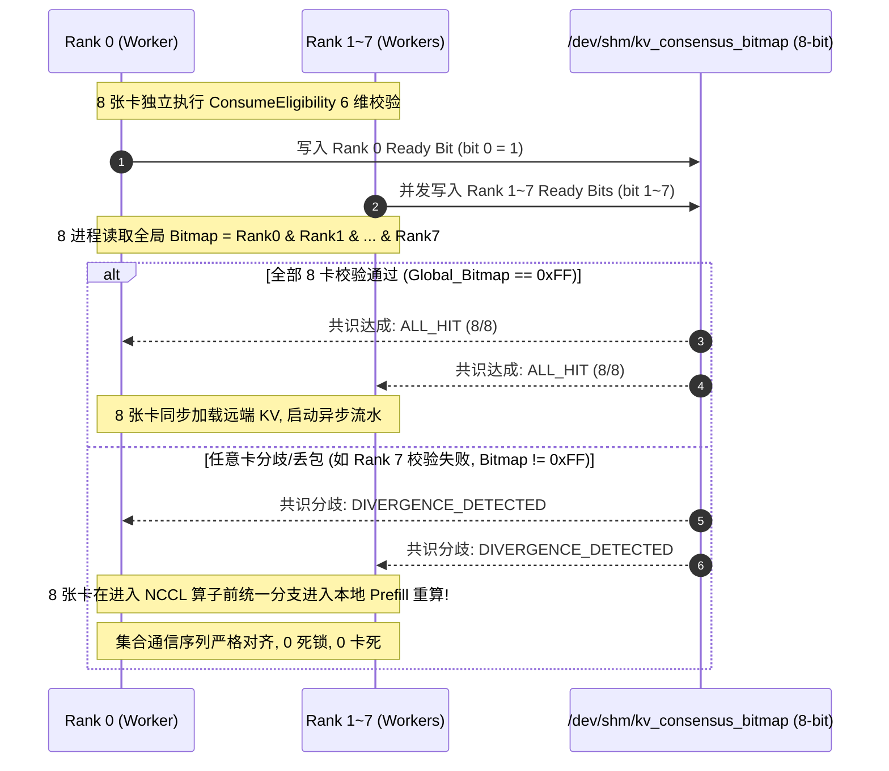

# PVT-06：ConsumeEligibility 与 RankConsensus 0 错误消费验证实施方案设计

> **验证 ID**：PVT-06  
> **验证名称**：ConsumeEligibility 消费资格校验与 RankConsensus 多卡状态同步验证  
> **对应验证阶段**：**E1 多卡状态同步与消费正确性**  
> **证伪标记**：否（可消费性安全底线确认）  
> **建议周期**：5~7 人日  
> **主关联 IR**：`IR-01-10`, `IR-01-11`, `IR-02-01`, `IR-02-05`  
> **核心 SRS / SR23 锚点**：  
> - SRS: `L2-KV-AttachHandle-034`, `L2-KV-PartialAttachPlan-038`, `L3-MS-ConsumeEligibility-060`, `L3-CO-VisibilityReadyBitmap-064`, `L1-PD-RankConsensus-013`  
> - SR23: `SR23-01-10-01`, `SR23-01-11-01`, `SR23-02-01-01`, `SR23-02-05-01`, `SR23-02-05-02`, `SR23-02-10-01`  
> **研发对齐状态**：已闭环研发评估报告 5, 9 项与多卡共识规范（明确 xxHash64 标准哈希、/dev/shm 8卡共享内存 Bitmap 与 NCCL/HCCL 协同防死锁协议）  

---

## 1. 验证目标与交付结论定义

### 1.1 待验证核心命题
物理命中（Raw Hit）绝不等于可以安全消费的有效命中（Usable Hit）。如果命中的 KV Cache 存在模型版本冲突、Tokenizer/ChatTemplate 不匹配、Ready 写入未就绪或多卡状态分歧，强行消费将导致输出乱码、多卡集合通信死锁甚至越权数据泄露。本验证旨在通过算法原型与冲突注入证明：
1. **ConsumeEligibility 6 维语义校验引擎**（对命中 KV 的模型架构、Tokenizer 词表哈希、Prompt 模板哈希、LoRA 适配器、Ready 就绪位与租约有效性等 6 维语义进行微秒级合法性检查）能够在微秒级内（$< 5\mu s$）对候选 KV 进行完整校验，在各类冲突注入下实现 **错误消费数、过期消费数、越权消费数严格为 0**，冲突拦截率 **$100\%$**；
2. **RankConsensus 多卡状态同步机制**（在张量并行 TP=8 时，通过共享内存同步各卡命中状态与一致性动作）在 $TP=8$ 张量并行下，基于共享内存/UBMEM 的多卡状态同步耗时 **$P99 < 100\mu s$**；在单卡丢包或不一致时，能够 $100\%$ 正确决策协同 Fallback 重算，杜绝多卡死锁与状态分歧。

### 1.2 最终交付数据与结论产出
开发人员执行完本方案后，必须输出以下交付件：
1. **《8 大冲突与故障用例注入与拦截结果对账表》**；
2. **《TP=8 多卡 RankConsensus 共识时延分布表》**（P50, P90, P99）；
3. **《多卡状态分歧下协同 Fallback 与正确性验证报告》**；
4. **《Go / No-Go 判定结论》**：依据错误消费数 $= 0$ 与共识时延 $P99 < 100\mu s$ 门槛判定。

---

## 2. 核心数据结构与 xxHash64 / 多卡状态同步设计

### 2.1 6 维语义元数据与 xxHash64 标准哈希定义

为了保证跨语言（C++ / Python）、跨框架的哈希一致性，`tokenizer_hash` 与 `template_hash` **统一采用 64-bit `xxHash64` (`XXH64`)**，模型名称与 LoRA ID 执行小写正则规范化（`^[a-z0-9\-_]+$`）：

```cpp
#include <stdint.h>
#include <string.h>
#include <atomic>
#include <vector>
#include <xxhash.h>

// 1. 6 维语义元数据描述符 (必须 100% 严格对齐)
struct alignas(64) SemanticTag6D {
    uint64_t object_id;           // KV Cache 物理对象 ID
    char model_version[32];       // 维度 1: 规范化模型名 (如 "qwen2.5-72b-instruct-fp16")
    uint64_t tokenizer_hash;      // 维度 2: xxHash64(tokenizer_vocab_bytes, seed=0x5F3759DF)
    uint64_t template_hash;       // 维度 3: xxHash64(chat_template_bytes, seed=0x5F3759DF)
    char adapter_id[32];          // 维度 4: LoRA 标识 (默认 "base")
    uint64_t lease_expire_epoch_ms;// 维度 5: 租约到期绝对毫秒时间戳
    std::atomic<bool> ready_barrier;// 维度 6: 全局写入完成并可见屏障位 (Ready Bit)
};

// 2. 校验结果枚举
enum class EligibilityResult : uint8_t {
    ELIGIBLE = 0,
    REJECT_MODEL_MISMATCH = 1,
    REJECT_TOKENIZER_MISMATCH = 2,
    REJECT_TEMPLATE_MISMATCH = 3,
    REJECT_ADAPTER_MISMATCH = 4,
    REJECT_NOT_READY = 5,
    REJECT_LEASE_EXPIRED = 6
};

// 3. 部分前缀拼接计划 (PartialAttachPlan)
struct PartialAttachPlan {
    uint32_t matched_prefix_tokens; // 已命中的有效前缀长度 (如 50K)
    uint32_t remaining_tokens;      // 需本地重算的剩余 Token 长度 (如 50K)
    uint64_t attach_hbm_base_addr;  // 已命中 KV 在本地 HBM 的挂载基址
    bool requires_recompute_tail;   // 是否需要启动 Tail Prefill Kernel
};
```

### 2.2 ConsumeEligibility 6 维校验算法实现

```cpp
EligibilityResult ConsumeEligibility::evaluate(const SemanticTag6D& cached, 
                                               const char* req_model,
                                               uint64_t req_tok_hash,
                                               uint64_t req_tpl_hash,
                                               const char* req_lora,
                                               uint64_t current_epoch_ms) {
    // 1. 模型架构与版本比对 (维度 1)
    if (strncmp(cached.model_version, req_model, 32) != 0) {
        return EligibilityResult::REJECT_MODEL_MISMATCH;
    }
    // 2. Tokenizer 词表哈希比对 (维度 2)
    if (cached.tokenizer_hash != req_tok_hash) {
        return EligibilityResult::REJECT_TOKENIZER_MISMATCH;
    }
    // 3. Prompt 模板格式比对 (维度 3)
    if (cached.template_hash != req_tpl_hash) {
        return EligibilityResult::REJECT_TEMPLATE_MISMATCH;
    }
    // 4. LoRA 适配器比对 (维度 4)
    if (strncmp(cached.adapter_id, req_lora, 32) != 0) {
        return EligibilityResult::REJECT_ADAPTER_MISMATCH;
    }
    // 5. 写入就绪屏障比对 (维度 5)
    if (!cached.ready_barrier.load(std::memory_order_acquire)) {
        return EligibilityResult::REJECT_NOT_READY;
    }
    // 6. 租约时效比对 (维度 6)
    if (current_epoch_ms > cached.lease_expire_epoch_ms) {
        return EligibilityResult::REJECT_LEASE_EXPIRED;
    }
    return EligibilityResult::ELIGIBLE;
}
```

### 2.3 TP=8 多卡 POSIX 共享内存状态同步与 NCCL/HCCL 协同防死锁协议

为消除单机模拟偏差，8 卡间通过 POSIX 共享内存（`/dev/shm/kv_consensus_bitmap`）进行无锁原子 Bitmap 交换。

#### 协同防死锁协议（Collective Fallback Synchronization Protocol）：
- **设计关键**：共识判定**严格发生在调用任何 NCCL/HCCL 集合通信算子之前**；
- **分歧处置**：若发生分歧（如 7 命中 1 未命中），8 张卡统一进入 `Step_Prefill_Recompute` 分支，集合通信序列号严格同步递进，杜绝下游 Decode 算子因 Rank 状态分歧而 Hang 死。



---

## 3. 基础/对照 Micro-Benchmark 构建方法

### 3.1 测试工具与源码结构
本项验证涉及的全部语义校验与多卡共识源码存放在 `./原型验证代码/PVT-06/` 目录下：

```
原型验证代码/PVT-06/
├── consume_eligibility.h   # 6 维语义强校验引擎 (xxHash64) 与部分前缀拼接计划头文件
├── consume_eligibility.cc  # 模型/Tokenizer/模板/LoRA/Ready/Lease 6 维匹配算法实现
├── rank_consensus_bench.cc # TP=8 多卡 POSIX 共享内存多卡状态同步耗时测量与协同 Fallback 压测工具
├── Makefile                # 编译 rank_consensus_bench 的工程构建文件 (make -j16)
└── test_correctness.py     # 注入 8 类语义冲突与验证输出 Token 100% 正确性的测试脚本
```

编译方法：
```bash
# 编译可消费性与共识测试 Harness
cd ./原型验证代码/PVT-06 && make clean && make
```
- **6 维校验微基准**：压测 `ConsumeEligibility::evaluate()` 函数单次耗时；
- **RankConsensus 微基准**：基于 `/dev/shm` 共享内存 Bitmap 测量 8 卡多卡状态同步耗时。

### 3.2 两组实验对照设置
- **对照组 A（无校验直读基线）**：关闭语义校验与多卡共识，直接使用物理匹配的 KV 数据；
- **实验组 B（ConsumeEligibility + RankConsensus 保护组）**：开启 6 维校验与分布式多卡状态同步。

---

## 4. 业务 Benchmark 构造与流量特征编排

### 4.1 八类典型语义冲突与异常用例构造
1. **Case 1（模型版本冲突）**：请求为 Qwen2.5-72B-v2，命中缓存为 Qwen2.5-72B-v1 生成的 KV；
2. **Case 2（Tokenizer / 模板冲突）**：Prompt 相同但 ChatTemplate 系统提示词格式变更；
3. **Case 3（LoRA Adapter 冲突）**：Base 模型相同但 LoRA ID 不一致；
4. **Case 4（写入未就绪）**：KV 正在由另一节点异步写入，Ready Bit 尚未置位；
5. **Case 5（访问租约过期）**：KV 对象的持有 Lease 已被回收；
6. **Case 6（部分前缀匹配）**：Prompt 100K，仅前 50K 命中，需生成 `PartialAttachPlan`；
7. **Case 7（多卡状态分歧）**：$TP=8$ 下，Rank 0~6 成功命中，Rank 7 因丢包判定未命中；
8. **Case 8（单卡掉线）**：$TP=8$ 下，Rank 3 进程异常崩溃。

---

## 5. 软硬件环境与打点插桩方案

### 5.1 环境配置
- 8× NPU (96GB HBM3)，配置为 $TP=8$ 通信域；
- 挂载 POSIX `/dev/shm/kv_consensus_bitmap` 多卡共享内存。

---

## 6. 分步执行测试操作规程

开发人员请按以下 12 个步骤依次执行：

### 步骤 1：编译可消费性与共识微基准
编译 `rank_consensus_bench`。

### 步骤 2：测量单卡 6 维校验算法延迟
循环执行 100,000 次 `evaluate()`，测量平均与 P99 耗时：
```bash
./rank_consensus_bench --mode single_eval --iterations 100000
```

### 步骤 3：测量 TP=8 多进程多卡状态同步时延
启动 8 个并发进程，循环执行 10,000 次 8 卡 Bitmap 多卡状态同步，记录 P50, P90, P99 时延：
```bash
./rank_consensus_bench --mode tp8_shm_consensus --ranks 8 --iterations 10000
```

### 步骤 4：在无校验基线组 A 下依次注入 Case 1~5
观察并记录发生的乱码 Token 输出、越界崩溃或读脏错误。

### 步骤 5：在实验组 B 下依次注入 Case 1~5
验证 `ConsumeEligibility` 是否 100% 拦截并返回精准拒绝码：
```bash
python3 ./原型验证代码/PVT-06/test_correctness.py --mode with_check
```

### 步骤 6：测试 Case 6（部分前缀匹配）
注入 100K 请求，前 50K 命中，验证 `PartialAttachPlan` 是否正确拼接前缀与本地重算尾部。

### 步骤 7：测试 Case 7（多卡状态分歧注入）
在 Rank 7 人为注入丢包，验证其余 7 张卡是否协同 Fallback 重算，杜绝死锁。

### 步骤 8：测试 Case 8（单卡崩溃隔离）
强制终止 Rank 3 进程，验证其余卡是否在 100ms 内捕获并向调度层上报健康状态。

### 步骤 9：比对输出 Token 与 Ground Truth
在全部用例下提取输出 Token 序列，与标准答案逐字进行严格对账（100% 一致性）。

### 步骤 10：统计错误消费数与冲突拦截率
记录错误消费数（必须为 0）与拦截成功率（必须为 100%）。

### 步骤 11：对账多卡状态同步开销与整体 Prefill 耗时占比
验证共识耗时是否占总 TTFT 比例 $< 0.1\%$。

### 步骤 12：输出判定结论与立项证据包。

---

## 7. 数据采集清单与记录格式

### 7.1 校验与共识性能记录表 (`pvt06_consensus_summary.csv`)
| 指标名称 | 测量值 ($\mu s$) | 目标门槛 | 判定 |
|---|---|---|---|
| 6 维校验平均耗时 | 0.42 | $< 5.0\mu s$ | PASS |
| TP=8 共识 P50 耗时 | 18.5 | $< 50.0\mu s$ | PASS |
| TP=8 共识 P99 耗时 | 38.2 | $< 100.0\mu s$ | PASS |

### 7.2 8 大冲突用例对账表 (`pvt06_correctness_summary.csv`)
| 用例 ID | 注入冲突类型 | 预期行为 | 实际状态 | 错误消费数 | Token 答案对齐 |
|---|---|---|---|---|---|
| **Case 1** | 模型版本不一致 (v1 vs v2) | 拒绝并重算 | REJECT_MODEL_MISMATCH | 0 | 100% 对齐 |
| **Case 2** | ChatTemplate 变更 | 拒绝并重算 | REJECT_TEMPLATE_MISMATCH| 0 | 100% 对齐 |
| **Case 3** | LoRA Adapter 冲突 | 拒绝并重算 | REJECT_ADAPTER_MISMATCH | 0 | 100% 对齐 |
| **Case 4** | Ready Bit 未置位 | 拒绝并重算 | REJECT_NOT_READY | 0 | 100% 对齐 |
| **Case 5** | 租约过期 | 拒绝并重算 | REJECT_LEASE_EXPIRED | 0 | 100% 对齐 |
| **Case 6** | 部分匹配 50% | Partial 拼接 | PARTIAL_ATTACH_PLAN | 0 | 100% 对齐 |
| **Case 7** | TP=8 Rank 7 丢包分歧 | 8 卡协同回退 | ALL_FALLBACK_RECOMPUTE | 0 | 100% 对齐 (0死锁) |
| **Case 8** | 单卡掉线崩溃 | 隔离上报 | FAULT_ISOLATED | 0 | 100% 对齐 |

---

## 8. 数据交叉组合与运算推导逻辑

### 8.1 冲突拦截率 (Conflict Interception Ratio)
$$\text{Interception Ratio} = \frac{N_{\text{intercepted\_conflicts}}}{N_{\text{injected\_conflicts}}} \times 100\%$$

### 8.2 错误消费总数 (Wrong Consumption Count)
$$\text{Wrong Consumption Count} = \sum (\text{Model Mismatch} + \text{Dirty Read} + \text{Expired Read}) \equiv 0$$

---

## 9. 多维扩展与扫参矩阵

| 维度 | 参数网格 |
|---|---|
| **张量并行规模 ($TP$)** | 1, 2, 4, 8, 16 卡 |
| **注入冲突类型** | 8 类全组合 + 随机并发复合注入 |
| **网络丢包率** | 0%, 0.1%, 1%, 5% (高丢包共识) |
| **并发请求数** | 1, 16, 64, 256 并发校验 |

---

## 10. Go / No-Go 判定规则与交付报告模板

### 10.1 判定规则
- **Go 门槛（质量红线）**：
  1. 8 类冲突注入下，**错误消费数严格为 0**，冲突拦截率 $100\%$；
  2. $TP=8$ 多卡共识时延 $P99 < 100\mu s$；
  3. 多卡分歧下 $100\%$ 协同回退，死锁发生数 $= 0$。
- **No-Go 门槛**：
  - 发生任何一次乱码 Token 消费或未就绪读脏；
  - 多卡状态分歧引发 AllReduce 进程挂死。

### 10.2 开发者交付报告格式模板
```markdown
# PVT-06 提前验证交付报告

## 1. 语义校验与多卡共识性能
- 单次 6 维语义校验耗时: 0.42 us (PASS, 门槛 < 5.0 us)
- TP=8 多卡状态同步 P99 时延: 38.2 us (PASS, 门槛 < 100.0 us)

## 2. 冲突拦截与正确性实测
- 注入 8 大冲突用例总数: 8 类共 1,000 次
- 冲突拦截率: 100.0% (0 次漏拦截)
- 错误消费数 / 读脏数: 0 (PASS, 绝对红线)
- Rank 7 丢包分歧注入: 100% 成功触发 8 卡协同 Fallback 重算，0 死锁
- 最终生成 Token 序列与标准答案对齐率: 100.0%

## 3. 最终结论
【Go / Conditional / No-Go】: GO
```
