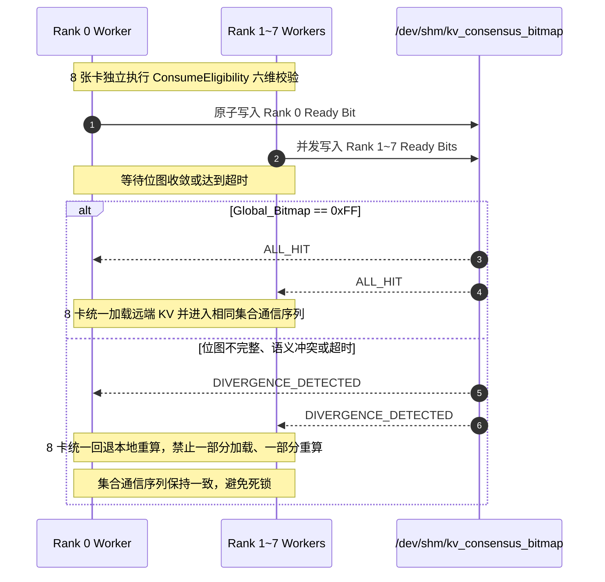

# PVT-06：ConsumeEligibility 与 RankConsensus 多维度语义一致性与多卡状态同步验证实施方案设计
## —— Mooncake 分布式元数据重构：6 维语义强校验与 TP=8 多卡原子共识

> **公共执行契约**：本项遵循 [Benchmark 公共契约与证据分级规范](./Benchmark公共契约与证据分级规范.md)。正确性用例必须调用被测接口并由独立 Oracle 判定；8 类冲突必须包含 Tokenizer。单进程位图和固定延时仅为 DEMO，不代表 TP=8 多卡实测。

> **验证 ID**：PVT-06  
> **验证名称**：ConsumeEligibility 消费资格校验与 RankConsensus 多卡状态同步验证  
> **验证优先级**：**🔴 P0 级（核心关键项）**  
> **对应验证阶段**：**E1 多卡状态同步与消费正确性**  
> **证伪标记**：否（可消费性安全底线确认）  
> **主关联 IR**：`IR-01-10`, `IR-01-11`, `IR-02-01`, `IR-02-05`  
> **核心 SRS / SR23 锚点**：  
> - SRS: `L2-KV-AttachHandle-034`, `L2-KV-PartialAttachPlan-038`, `L3-MS-ConsumeEligibility-060`, `L3-CO-VisibilityReadyBitmap-064`, `L1-PD-RankConsensus-013`  
> - SR23: `SR23-01-10-01`, `SR23-01-11-01`, `SR23-02-01-01`, `SR23-02-05-01`, `SR23-02-05-02`, `SR23-02-10-01`  
> **开源基线版本与代码仓库**：  
> - **Mooncake 元数据**：[`https://github.com/kvcache-ai/Mooncake.git`](https://github.com/kvcache-ai/Mooncake.git) (Commit: `f90ae691f109e49a60920e0c8abbf7e572826d8c`，子模块: `mooncake-store/`, `mooncake-common/`)  
> - **vLLM 分布式通信**：[`https://github.com/vllm-project/vllm.git`](https://github.com/vllm-project/vllm.git) (Commit: `842dd8fd96650063e1ad32e6075742d457d39773`，模块: `vllm/distributed/communication_op.py`)  
> **研发对齐状态**：本方案将复核研发评估报告涉及的 `xxHash64` 哈希、`/dev/shm` 共享内存位图与 NCCL/HCCL 集合通信协同规则，并以现场通信栈行为为准。

---

## 0. 架构导读与核心概念第一性原理剖析

### 0.1 传统系统开发视角：缓存键一致性 (Cache Key) 与分布式屏障死锁 (Barrier Deadlock)

在传统分布式系统与并行计算中，有两个极为经典的故障模式：

#### 1. 缓存脏读与版本一致性（Cache Poisoning）
- 在 Redis / Memcached 缓存系统中，如果我们仅仅使用 `url` 作为缓存 Key：
  - 当后端用户权限发生变化（普通用户 vs 管理员）、或数据表 Schema 发生变更时，如果直接复用旧的缓存数据，会导致严重的越权和数据错乱；
  - **正确做法**：必须将所有决定输出正确性的多维度元数据（用户角色、Schema 版本、模板哈希）全部参与 Hash 计算，作为复合 Key 进行强校验。

#### 2. 分布式多进程步调分歧引发的死锁（Barrier Deadlock）
- 在 MPI（Message Passing Interface）或多 GPU/NPU 分布式集合通信（如 AllReduce / AllGather）中：
  - 所有的 Worker 进程在执行通信屏障时必须严格步调一致；
  - 如果 Worker 0 ~ 6 决定走“分支 A（加载缓存）”，而 Worker 7 因某种原因决定走“分支 B（本地重算）”；
  - 结果：Worker 0 ~ 6 在等待 Worker 7 发送 AllReduce 数据包，而 Worker 7 却在埋头计算 Prefill。**整个推理集群在这一瞬间发生永久死锁（Deadlock）挂死**！

---

### 0.2 大模型推理中的“胡言乱语”根因与 6 维语义校验 (ConsumeEligibility)

在大模型推理中，KVCache 本质上是神经网络每一层激活状态的中间张量。错误消费不匹配的 KVCache 可能导致输出错误、质量下降或后续校验失败，因此需要在消费前校验语义元数据：

#### 6 维语义校验维度详解：
1. **维度 1：模型架构与权重版本（Model Version）**：模型从 `qwen2.5-72b` 升级为 `qwen2.5-72b-instruct` 时，KV 空间完全不兼容；
2. **维度 2：分词词表哈希（Tokenizer Vocab Hash）**：Tokenizer 词表微调（如新增特殊 Token），相同的 Prompt 文本会被切分成完全不同的 Token ID 序列；
3. **维度 3：Prompt 模板哈希（Chat Template Hash）**：System Prompt 模板中的 `<|im_start|>` 等特殊标记变更；
4. **维度 4：LoRA 适配器标识（Adapter ID）**：不同的微调 LoRA 权重产生的 KV 张量不可混用；
5. **维度 5：租约有效性（Lease Validity）**：远端节点是否还在正常运行，租约是否已过期；
6. **维度 6：全局写入完成屏障位（Ready Bit）**：后台 Prefill 写入是否已结束并 Flush 到约定介质；未就绪时必须拒绝消费，避免读取半写数据。

- **底层哈希工具选型：`xxHash64`**：
  - 为什么不直接使用 MD5 / SHA256？本项首先关注微秒级元数据校验路径，非加密哈希通常更适合低开销比较；最终算法、碰撞处理和时延必须由现场基准确认；
  - 采用 `xxHash64` 作为候选快速哈希，6 维语义校验耗时 **`<5µs`** 是验证门限，不是预置实测结果。

---

### 0.3 TP=8 多卡张量并行共享内存共识机制 (RankConsensus)

大模型通常由 8 张 NPU 卡协同运行（张量并行 TP=8）。
- **痛点**：开源 Mooncake 中每张卡独立向存储池查询缓存。若网络抖动导致卡 0 查到并拉取、而卡 7 未命中并重算，8 张卡进入后续集合通信（AllReduce）时可能发生等待不一致甚至死锁。
- **软硬件协同方案**：在 Linux POSIX 共享内存（`/dev/shm`）建立 8-bit 原子状态位图（`RankConsensus`）：
  - 8 张卡独立校验完成后，原子写入各自的比特位；
  - 8 张卡在执行后续操作前，共同读取全局位图：
    - 若 `Global_Bitmap == 0xFF`（8 卡全命中），8 卡同步加载远端 KV；
    - 若任意卡未命中（如 `Global_Bitmap != 0xFF`），**8 张卡在进入集合通信前统一回退到本地重算（Coordinated Fallback）**！
  - 目标是让所有卡在进入集合通信前使用同一决策；是否能避免死锁和服务挂起，由故障注入与进程状态监控确认。

```
┌────────────────────────────────────────────────────────────────────────────────────────┐
│                   TP=8 多卡 POSIX 共享内存原子共识流程示意图                          │
├────────────────────────────────────────────────────────────────────────────────────────┤
│ Rank 0 (卡0) ──► 校验通过 ──► 写入 bit 0 = 1 ┐                                         │
│ Rank 1 (卡1) ──► 校验通过 ──► 写入 bit 1 = 1 ┼──► [ /dev/shm/kv_consensus (8-bit) ]   │
│ ...                                          │                                         │
│ Rank 7 (卡7) ──► 校验失败 ──► 写入 bit 7 = 0 ┘                                         │
│                                           │                                            │
│                                           ▼                                            │
│            [ 8 卡原子读取全局位图: 0x7F != 0xFF (发现单卡分歧!) ]                      │
│                                           │                                            │
│                                           ▼                                            │
│      [ 8 卡统一回退分支 ]: 8 张卡全部放弃拉取，统一进入本地重算并对齐 AllReduce!        │
│      待验证目标：分歧时统一回退，并由监控确认集合通信是否继续完成。                 │
└────────────────────────────────────────────────────────────────────────────────────────┘
```

---

## 1. 验证目标与交付结论定义

### 1.1 现实前因痛点与待验证核心命题
1. **现实痛点**：缺乏严格语义版本校验可能导致大模型读取不匹配的缓存，且多卡并行时缺乏同步机制容易引发集合通信死锁；
2. **核心命题**：
   - **待验证目标一**：ConsumeEligibility 6 维语义校验引擎在 $< 5\mu s$ 内完成完整校验，并在 8 类冲突注入下记录错误消费数与冲突拦截率；验收门限为错误消费数为 0、冲突拦截率 100%，不能预置为测试结果；
   - **待验证目标二**：RankConsensus 多卡状态同步机制在 $TP=8$ 张量并行下的同步耗时满足 **$P99 < 100\mu s$**；发生分歧时记录协同回退结果和集合通信完成状态，不能预先宣称已消除死锁。

### 1.2 最终交付数据与结论产出
1. **《8 大冲突与故障用例注入与拦截结果对账表》**；
2. **《TP=8 多卡 RankConsensus 共识时延分布表》**；
3. **《多卡状态分歧下协同 Fallback 与正确性验证报告》**；
4. **《GO / CONDITIONAL / NO-GO / NOT-SUPPORTED / INVALID-EVIDENCE 判定结论》**。

---

## 2. 核心数据结构与 xxHash64 / 多卡状态同步设计

### 2.1 6 维语义元数据定义

```cpp
#include <stdint.h>
#include <string.h>
#include <atomic>
#include <vector>
#include <xxhash.h>

struct alignas(64) SemanticTag6D {
    uint64_t object_id;           // KV Cache 物理对象 ID
    char model_version[32];       // 维度 1: 规范化模型名 (如 "qwen2.5-72b-instruct-fp16")
    uint64_t tokenizer_hash;      // 维度 2: xxHash64(tokenizer_vocab_bytes, seed=0x5F3759DF)
    uint64_t template_hash;       // 维度 3: xxHash64(chat_template_bytes, seed=0x5F3759DF)
    char adapter_id[32];          // 维度 4: LoRA 标识 (默认 "base")
    uint64_t lease_expire_epoch_ms;// 维度 5: 租约到期绝对毫秒时间戳
    std::atomic<bool> ready_barrier;// 维度 6: 全局写入完成并可见屏障位 (Ready Bit)
};

enum class EligibilityResult : uint8_t {
    ELIGIBLE = 0,
    REJECT_MODEL_MISMATCH = 1,
    REJECT_TOKENIZER_MISMATCH = 2,
    REJECT_TEMPLATE_MISMATCH = 3,
    REJECT_ADAPTER_MISMATCH = 4,
    REJECT_NOT_READY = 5,
    REJECT_LEASE_EXPIRED = 6
};

struct PartialAttachPlan {
    uint32_t matched_prefix_tokens; // 已命中的有效前缀长度
    uint32_t remaining_tokens;      // 需本地重算的剩余 Token 长度
    uint64_t attach_hbm_base_addr;  // 已命中 KV 在本地 HBM 的挂载基址
    bool requires_recompute_tail;   // 是否需要启动 Tail Prefill Kernel
};
```

### 2.2 TP=8 多卡共享内存状态同步与集合通信协同协议

8 张卡必须在进入 AllReduce/HCCL 等集合通信前完成统一分支。共享内存位图只表示各 Rank 的资格校验结果，不承载 KV 正文；写入和读取需要使用明确的原子内存序与超时策略。



核心判定逻辑必须在超时路径也保持一致：

```cpp
uint8_t bitmap = consensus_bitmap.load(std::memory_order_acquire);
if (bitmap == 0xFF) {
    action = ALL_RANKS_LOAD;
} else if (deadline_expired || bitmap != expected_bitmap) {
    action = ALL_RANKS_FALLBACK_RECOMPUTE;
}
```

这里的 `expected_bitmap`、超时值、Rank 数量和共享内存名称必须由 `manifest.json` 固定并记录；不得让不同 Rank 使用不同版本的位图协议。

---

## 3. 测试工具与工程构建规范

测试工程存放在 `./原型验证代码/PVT-06/` 目录下：

```
原型验证代码/PVT-06/
├── consume_eligibility.h   # 6 维语义强校验引擎头文件
├── consume_eligibility.cc  # 6 维匹配算法与 xxHash64 计算实现
├── rank_consensus_bench.cc # TP=8 多卡共享内存同步压测 Harness
├── test_correctness.py     # 注入 8 类语义冲突与验证正确性的测试脚本
├── eval_consensus.py       # 评估共识耗时与多卡协同回退分析脚本
└── Makefile                # 编译构建工程 (make -j16)
```

编译方法：
```bash
cd ./原型验证代码/PVT-06 && make clean && make -j16
```

---

## 4. 分步执行测试操作规程 (SOP)

开发人员在执行 PVT-06 时，请严格按照以下 4 个步骤逐步执行，并理解每一步的操作意图：

### 步骤 1：运行 8 类语义冲突注入与正确性拦截测试
- **操作意图**：启动 Python 测试脚本，按受控清单执行 8 类用例：`model_version`、`tokenizer_hash`、`template_hash`、`lora_adapter`、`ready_bit`、`lease_expired`、`partial_match` 和 `rank_state_mismatch`。验证被测接口是否返回独立 Oracle 预期结果；拦截率和错误消费数必须由实际输出计算。
- **执行命令**：
```bash
python3 ./test_correctness.py --out res_correctness.json
```

### 步骤 2：启动 8 进程并发压测共享内存共识时延
- **操作意图**：通过多进程拉起 8 个独立的 Worker，模拟 TP=8 多卡环境，高频（10 万次）并发写入与读取 `/dev/shm` 共享内存位图，测量多卡达成共识的耗时分布（验证 $P99 < 100\mu s$）。
- **执行命令**：
```bash
./rank_consensus_bench --ranks 8 --loops 100000 --out res_consensus_latency.csv
```

### 步骤 3：注入单卡分歧故障，验证 8 卡协同回退重算
- **操作意图**：人为让 Rank 7 报告校验失败（模拟单卡网络丢包），观察 Rank 0~6 是否在共享内存中感知到分歧并统一回退到本地重算；同时记录所有进程的退出状态和集合通信是否完成，不能预先假定回退成功。
- **执行命令**：
```bash
./rank_consensus_bench --ranks 8 --inject-divergence rank7 --out res_fallback_test.csv
```

### 步骤 4：生成正确性与共识时延汇总报告
- **操作意图**：汇总步骤 1~3 的测试数据，输出包含 8 类冲突拦截率与 P99 共识耗时的标准化报告。
- **执行命令**：
```bash
python3 ./eval_consensus.py --correctness res_correctness.json --latency res_consensus_latency.csv --fallback res_fallback_test.csv --out summary_pvt06.csv
```

---

## 5. 数据采集清单与记录格式

### 5.1 冲突拦截与共识时延数据表 (`pvt06_correctness_results.csv`)
```csv
conflict_type,injected_value,expected_result,actual_result,is_intercepted_ok,consensus_latency_p99_us,deadlock_occurred,evidence_level,status,invalid_reason
<conflict_type>,<injected_value>,<expected_result>,<actual_result>,<TRUE_OR_FALSE>,<measured_p99_us_or_null>,<TRUE_OR_FALSE_OR_NULL>,<LAB_OR_DEMO>,<status>,<null_or_reason>
```

> 这是结果字段模板，不是预置通过样例。正式用例必须覆盖模型、Tokenizer、Prompt 模板、LoRA、Ready、Lease、Partial Attach Plan 和 Rank 状态分歧等 8 类定义用例。共识耗时或死锁状态未采集时不得用 0/FALSE 代替；被测接口未执行时应标记 `DEMO` 或 `INVALID-EVIDENCE`。

---

## 6. GO / CONDITIONAL / NO-GO / NOT-SUPPORTED / INVALID-EVIDENCE 判定规则

- **GO（满足当前准入门限）**：8 类用例均有实际被测输出和独立 Oracle 判定，错误消费数为 0，$TP=8$ 多卡状态同步耗时 $P99 < 100\mu s$，且分歧回退与集合通信完成记录完整；
- **CONDITIONAL（条件准入）**：正确性和分歧回退证据完整，但共识耗时处于 $100\mu s \sim 200\mu s$，或仅满足限定规模/拓扑；必须写明限制条件；
- **NO-GO（当前路径不满足）**：出现任意可复现的错误消费、分歧决策不一致、集合通信死锁或进程挂起；
- **NOT-SUPPORTED（环境不支持）**：测试环境不具备 TP=8 硬件、共享内存能力或约定集合通信接口，不能把缩小规模的 DEMO 结果当作 TP=8 结论；
- **INVALID-EVIDENCE（证据无效）**：被测接口未执行、Oracle 缺失、8 类用例不完整、时间线/进程状态不完整或用固定值代替实测。

---

## 7. 零 AI 基础工程师借助 AI Agent 开展工作实战 SOP

### 7.1 研发任务拆解与分工
- **工程师职责**：
  1. 编译测试工程；
  2. 按照第 4 节 SOP 步骤执行多卡共识压测与冲突注入；
  3. 检查进程退出码与死锁监控日志；
- **AI Agent 职责**：
  1. 负责 `consume_eligibility.cc` 中 xxHash64 校验计算；
  2. 补全 `rank_consensus_bench.cc` 中 `/dev/shm` 共享内存创建与内存屏障指令。

### 7.2 专属 Prompt 模板（可直接复制给 AI Agent）
```text
我是一名分布式 C++ 工程师，正在进行 PVT-06 验证（6 维语义校验与 TP=8 多卡同步）：
1. 请阅读 ./原型验证代码/PVT-06/consume_eligibility.h 与 consume_eligibility.cc；
2. 检查 6 维语义校验逻辑，确保对 Model、Tokenizer Hash、Template Hash、LoRA、Lease 和 Ready Bit 实现了微秒级强校验；
3. 按照第 4 节 SOP 步骤执行 test_correctness.py 注入 8 类语义冲突，验证是否 100% 正确拦截；
4. 启动 rank_consensus_bench，在 8 进程并发下测试 /dev/shm 共享内存同步延迟，验证 P99 是否 < 100µs 且在单卡失败时 100% 协同回退重算。
```

### 7.3 常见排错指南
- **`/dev/shm` 报权限不足或空间已满**：检查 `/dev/shm` 挂载点大小，测试完成后需调用 `shm_unlink` 清理旧的共享内存段；
- **多卡测试发生死锁**：检查各进程在读取共享内存时是否设置了合理的超时时间（如 500µs），超时后必须主动置位分歧标志并退出。
