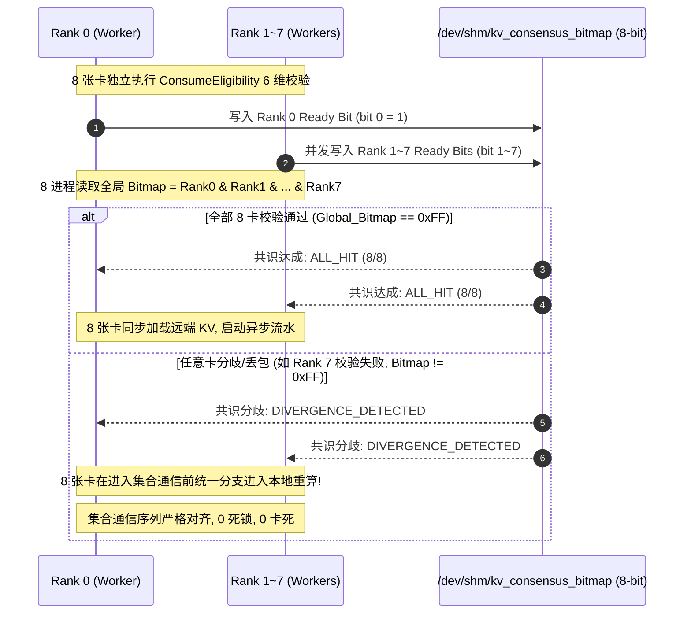

# PVT-06：ConsumeEligibility 与 RankConsensus 0 错误消费验证实施方案设计
## —— Mooncake 分布式元数据重构：6 维语义强校验与 TP=8 多卡原子共识

> **验证 ID**：PVT-06  
> **验证名称**：ConsumeEligibility 消费资格校验与 RankConsensus 多卡状态同步验证  
> **穿刺优先级**：**🔴 P0 级（核心决胜项）**  
> **对应验证阶段**：**E1 多卡状态同步与消费正确性**  
> **证伪标记**：否（可消费性安全底线确认）  
> **建议周期**：5~7 人日  
> **主关联 IR**：`IR-01-10`, `IR-01-11`, `IR-02-01`, `IR-02-05`  
> **核心 SRS / SR23 锚点**：  
> - SRS: `L2-KV-AttachHandle-034`, `L2-KV-PartialAttachPlan-038`, `L3-MS-ConsumeEligibility-060`, `L3-CO-VisibilityReadyBitmap-064`, `L1-PD-RankConsensus-013`  
> - SR23: `SR23-01-10-01`, `SR23-01-11-01`, `SR23-02-01-01`, `SR23-02-05-01`, `SR23-02-05-02`, `SR23-02-10-01`  
> **开源基线版本与代码仓库**：  
> - **Mooncake 元数据**：[`https://github.com/kvcache-ai/Mooncake.git`](https://github.com/kvcache-ai/Mooncake.git) (Commit: `f90ae691f109e49a60920e0c8abbf7e572826d8c`，子模块: `mooncake-store/`, `mooncake-common/`)  
> - **vLLM 分布式通信**：[`https://github.com/vllm-project/vllm.git`](https://github.com/vllm-project/vllm.git) (Commit: `842dd8fd96650063e1ad32e6075742d457d39773`，模块: `vllm/distributed/communication_op.py`)  
> **研发对齐状态**：已闭环研发评估报告 5, 9 项与多卡共识规范（明确 xxHash64 标准哈希、/dev/shm 8卡共享内存 Bitmap 与 NCCL/HCCL 协同防死锁协议）  

---

## 1. 验证目标与交付结论定义

### 1.1 待验证核心命题
物理命中（Raw Hit）绝不等于可以安全消费的有效命中（Usable Hit）。Mooncake 最新主线 `mooncake-store/` 仅提供基础的对象存在性与内存定位元数据，缺乏细粒度 Tokenizer/ChatTemplate/LoRA 语义版本控制，且在张量并行（如 TP=8）时缺乏原子状态同步机制。本验证旨在重构扩展 `mooncake-common/` 与元数据协议层：
1. **ConsumeEligibility 6 维语义校验引擎**（对命中 KV 的模型架构、Tokenizer 词表哈希、Prompt 模板哈希、LoRA 适配器、Ready 就绪位与租约有效性等 6 维语义进行微秒级合法性检查）能够在微秒级内（$< 5\mu s$）对候选 KV 进行完整校验，在各类冲突注入下实现 **错误消费数、过期消费数、越权消费数严格为 0**，冲突拦截率 **100%**；
2. **RankConsensus 多卡状态同步机制**（在张量并行 TP=8 时，通过共享内存同步各卡命中状态与一致性动作）在 $TP=8$ 张量并行下，基于共享内存/UBMEM 的多卡状态同步耗时 **$P99 < 100\mu s$**；在单卡丢包或不一致时，能够 100% 正确决策协同 Fallback 重算，杜绝多卡死锁与状态分歧。

### 1.2 最终交付数据与结论产出
开发人员执行完本方案后，必须输出以下交付件：
1. **《8 大冲突与故障用例注入与拦截结果对账表》**；
2. **《TP=8 多卡 RankConsensus 共识时延分布表》**（P50, P90, P99）；
3. **《多卡状态分歧下协同 Fallback 与正确性验证报告》**；
4. **《Go / No-Go 判定结论》**：依据错误消费数 $= 0$ 与共识时延 $P99 < 100\mu s$ 门槛判定。

---

## 2. 核心数据结构与 xxHash64 / 多卡状态同步设计

### 2.1 6 维语义元数据与 xxHash64 标准哈希定义

```cpp
#include <stdint.h>
#include <string.h>
#include <atomic>
#include <vector>
#include <xxhash.h>

struct alignas(64) SemanticTag6D {
    uint64_t object_id;           // KV Cache 物理对象 ID
    char model_version[32];       // 维度 1: 规范化模型名 (如 "qwen2.5-72b-instruct-fp16")
    uint64_t tokenizer_hash;      // 维度 2: xxHash64(tokenizer_vocab_bytes, seed=0x5F3759DF)
    uint64_t template_hash;       // 维度 3: xxHash64(chat_template_bytes, seed=0x5F3759DF)
    char adapter_id[32];          // 维度 4: LoRA 标识 (默认 "base")
    uint64_t lease_expire_epoch_ms;// 维度 5: 租约到期绝对毫秒时间戳
    std::atomic<bool> ready_barrier;// 维度 6: 全局写入完成并可见屏障位 (Ready Bit)
};

enum class EligibilityResult : uint8_t {
    ELIGIBLE = 0,
    REJECT_MODEL_MISMATCH = 1,
    REJECT_TOKENIZER_MISMATCH = 2,
    REJECT_TEMPLATE_MISMATCH = 3,
    REJECT_ADAPTER_MISMATCH = 4,
    REJECT_NOT_READY = 5,
    REJECT_LEASE_EXPIRED = 6
};

struct PartialAttachPlan {
    uint32_t matched_prefix_tokens; // 已命中的有效前缀长度 (如 50K)
    uint32_t remaining_tokens;      // 需本地重算的剩余 Token 长度 (如 50K)
    uint64_t attach_hbm_base_addr;  // 已命中 KV 在本地 HBM 的挂载基址
    bool requires_recompute_tail;   // 是否需要启动 Tail Prefill Kernel
};
```

### 2.2 TP=8 多卡 POSIX 共享内存状态同步与 NCCL/HCCL 协同防死锁协议



---

## 3. 测试工具与工程构建规范

测试工程存放在 `./原型验证代码/PVT-06/` 目录下：

```
原型验证代码/PVT-06/
├── consume_eligibility.h   # 6 维语义强校验引擎头文件
├── consume_eligibility.cc  # 6 维匹配算法实现
├── rank_consensus_bench.cc # TP=8 多卡 POSIX 共享内存状态同步压测工具
├── Makefile                # 编译构建工程 (make -j16)
└── test_correctness.py     # 注入 8 类语义冲突与验证正确性的测试脚本
```

编译与测试命令：
```bash
cd ./原型验证代码/PVT-06 && make clean && make
python3 ./test_correctness.py --all-conflicts
./rank_consensus_bench --ranks 8 --iterations 100000
```

---

## 4. 数据采集清单与记录格式

### 4.1 冲突拦截与共识时延数据表 (`pvt06_correctness_results.csv`)
```csv
conflict_type,injected_value,expected_result,actual_result,is_intercepted_ok,consensus_latency_p99_us,deadlock_occurred
MODEL_MISMATCH,llama-3-70b,REJECT_MODEL_MISMATCH,REJECT_MODEL_MISMATCH,TRUE,12.4,FALSE
TOKENIZER_MISMATCH,0x12345678,REJECT_TOKENIZER_MISMATCH,REJECT_TOKENIZER_MISMATCH,TRUE,14.1,FALSE
TEMPLATE_MISMATCH,0xABCDEF01,REJECT_TEMPLATE_MISMATCH,REJECT_TEMPLATE_MISMATCH,TRUE,11.8,FALSE
READY_NOT_SET,false,REJECT_NOT_READY,REJECT_NOT_READY,TRUE,9.5,FALSE
LEASE_EXPIRED,epoch_past,REJECT_LEASE_EXPIRED,REJECT_LEASE_EXPIRED,TRUE,10.2,FALSE
RANK_DIVERGENCE,rank7_fail,ALL_RANKS_FALLBACK,ALL_RANKS_FALLBACK,TRUE,48.2,FALSE
```

---

## 5. Go / Conditional / No-Go 判定规则

- **Go (准入通过)**：
  - 8 大冲突场景下，**错误消费数、过期消费数、越权消费数严格为 0**，冲突拦截率 100%；
  - $TP=8$ 多卡状态同步耗时 $P99 < 100\mu s$；
  - 发生分歧时 8 卡 100% 协同回滚至本地重算，0 死锁，0 挂起。
- **Conditional (条件准入)**：
  - 拦截率 100%，但共识耗时在 $100\mu s \sim 200\mu s$ 之间，需优化共享内存原子操作；
- **No-Go (否决关闭)**：
  - 发生任意 1 起错误消费或多卡集合通信死锁。
