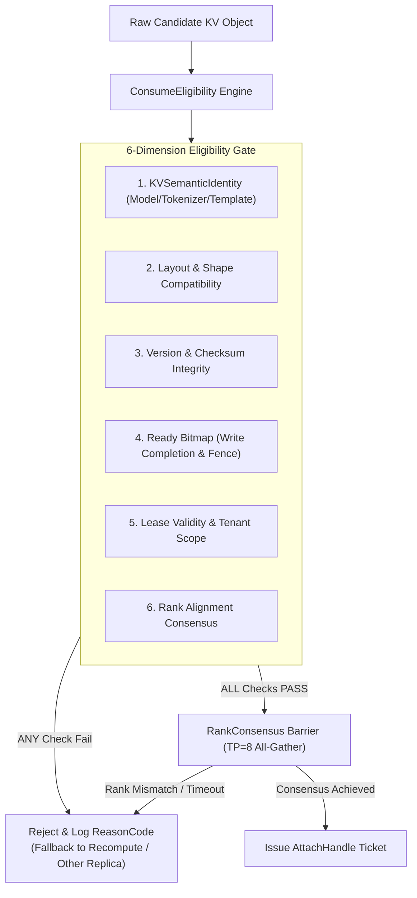
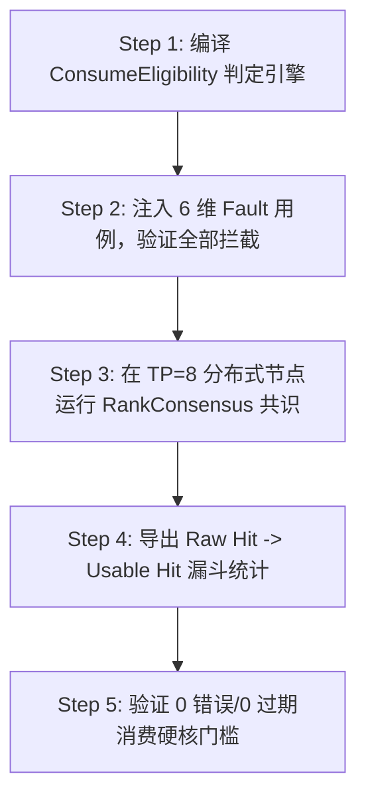

# PVT-06：ConsumeEligibility 与 RankConsensus 0 错误消费验证实施方案设计

> **验证 ID**：PVT-06  
> **验证名称**：ConsumeEligibility 校验与 RankConsensus 多 Rank 空间共识验证  
> **对应证据门**：**E1 可消费正确性**  
> **证伪标记**：否（可消费性确认）  
> **建议周期**：10~12 人日  
> **主关联 IR**：`IR-01-10`, `IR-01-11`, `IR-02-01`, `IR-02-05`  
> **核心 SRS / SR23 锚点**：  
> - SRS: `L2-KV-AttachHandle-034`, `L2-KV-PartialAttachPlan-038`, `L3-MS-ConsumeEligibility-060`, `L3-CO-VisibilityReadyBitmap-064`, `L1-PD-RankConsensus-013`  
> - SR23: `SR23-01-10-01`, `SR23-01-11-01`, `SR23-02-01-01`, `SR23-02-05-01`, `SR23-02-05-02`, `SR23-02-10-01`  

---

## 1. 验证项概述与映射追溯

### 1.1 背景诉求与必要性

物理 Raw Hit 绝对不等于可以安全消费的 Usable Hit。如果命中的 KV Cache 存在模型版本冲突、Tokenizer/ChatTemplate 不匹配、Rank 对齐错位、写入未完全就绪（Ready 未置位）或访问租约（Lease）过期，强行消费将直接导致大模型输出胡言乱语、多卡同步死锁，甚至造成严重的跨租户数据泄露安全事故。

### 1.2 与项目竞争力关联

核心支撑**竞争力 #1（语义先于位置与 Ready/Eligibility 屏障）**与**竞争力 #2（0 错误消费正确性安全底线）**。构建 ConsumeEligibility 6 维判定与 RankConsensus 多 Rank 空间共识，确保 **“0 错误消费、0 过期消费”**。

### 1.3 SRS / SR23 / IR 需求追溯矩阵

| 需求层级 | 标识符 / 编号 | 描述 | 验证承接责任 |
|---|---|---|---|
| **IR** | `IR-01-10` | ConsumeEligibility 6 维语义校验 | 验证 Model/Tokenizer/Template/Version/Ready/Lease |
| **IR** | `IR-01-11` | 多 Rank / 多卡空间一致性屏障 | 验证 Tensor/Pipeline Parallel 下的 RankConsensus |
| **SRS** | `L3-MS-ConsumeEligibility-060` | 可消费资格判定引擎 | 拦截不可消费候选，输出标准 Reason Code |
| **SR23** | `SR23-01-10-01` | AttachHandle 引用凭证与 Lease 隔离 | 发放受控 AttachHandle 并执行超时收回 |

---

## 2. 核心验证假设与实验矩阵设计

### 2.1 待验证核心假设（Hypotheses）

1. **H6-1**：在各种故障注入与冲突场景下，**错误 KV 消费数、过期 KV 消费数、越权消费数严格为 0**。
2. **H6-2**：RankConsensus 多 Rank 屏障等待时间 **$P99 < 100\mu s$**，Prefix Lookup **$P99 < 200\mu s$**，Usable Hit 相对基线提升 **$\ge 15\%$**。

### 2.2 详细实验矩阵

| 前缀复用模式 | 张量/流水并行度 (TP/PP Ranks) | 故障/冲突注入用例 | 接入消费机制 |
|---|---|---|---|
| Whole (100%) 前缀复用 | 1, 2, 4, 8 Ranks ($TP=8$) | Model / Tokenizer / ChatTemplate / Adapter 不匹配 | AttachHandle 受控引用 |
| Partial (25%/50%/75%) 复用 | 1, 2, 4, 8 Ranks ($TP=8$) | Layout 错位 / Version 冲突 / Lease 超时 | Partial Attach Plan |
| 边界覆盖用例 | 4, 8 Ranks ($TP=8$) | Ready Bit 未位置 / 传输中途断连 / 单 Rank 崩溃 | 强制 Fallback 到 Recompute |

---

## 3. 测试 Harness 架构与量化数学模型

### 3.1 ConsumeEligibility 6 维检查与 RankConsensus 架构



---

## 4. 对照基线与因果消融设计

1. **基线 A（RAW Hash Hit 模式）**：仅凭物理 Key 字符串 Hash 匹配就直接消费（极其危险，易发生脏读）。
2. **基线 B（框架原生 Connector）**：vLLM / SGLang 原生基于 Slot ID 匹配的简易连接器。
3. **消融控制**：故意关闭 `RankConsensus` 多 Rank 屏障，注入单 Rank 传输延迟，观测是否引发 Tensor Parallel 推理胡言乱语或挂死。

---

## 5. 指标体系与 Go/No-Go 显式判定门槛

- **Go 门槛**：
  1. 错误/过期 KV 消费数 $= 0$；
  2. Fallback 成功率 $= 100\%$；
  3. Rank Consensus Wait $P99 < 100\mu s$；
  4. Prefix Lookup $P99 < 200\mu s$；
  5. Usable Hit 提升 $\ge 15\%$；
  6. 重复拉取下降 $\ge 50\%$。
- **No-Go 门槛**：发生任何错误/脏 KV 渗入推理、跨租户越权读取，或多 Rank 同步死锁。

---

## 6. 完整原型验证实施方案与具体步骤

### 6.1 验证环境准备与前置依赖

1. **依赖环境**：GCC 11+, C++17, PyTorch 2.3+ ($TP=8$ Distributed Environment)。
2. **测试数据**：全量 6 维 Fault Injection Case 预设字典。
3. **工作目录**：`/tmp/pvt06_harness/`。

### 6.2 核心 C++ 与 Python 代码实现

#### 代码 1：`consume_eligibility_checker.cc` (6 维 ConsumeEligibility 判定引擎与 ReasonCode 输出器)

```cpp
#include <iostream>
#include <string>
#include <vector>
#include <cassert>
#include <chrono>

enum ReasonCode {
    ELIGIBLE_OK = 0,
    ERR_MODEL_MISMATCH = 101,
    ERR_TOKENIZER_MISMATCH = 102,
    ERR_VERSION_CONFLICT = 103,
    ERR_READY_NOT_SET = 104,
    ERR_LEASE_EXPIRED = 105,
    ERR_RANK_MISMATCH = 106
};

struct KVSemanticIdentity {
    std::string model_name;
    std::string tokenizer_hash;
    uint32_t version_id;
    uint32_t tenant_id;
};

struct KVObjectCandidate {
    uint64_t object_id;
    KVSemanticIdentity identity;
    bool ready_flag;
    uint64_t lease_expire_ts;
    uint32_t rank_mask; // TP=8 掩码 (0xFF)
};

class ConsumeEligibilityChecker {
public:
    ReasonCode check_eligibility(const KVObjectCandidate& cand, const KVSemanticIdentity& req_ident, uint64_t now_ts) {
        // 1. KVSemanticIdentity 匹配
        if (cand.identity.model_name != req_ident.model_name) return ERR_MODEL_MISMATCH;
        if (cand.identity.tokenizer_hash != req_ident.tokenizer_hash) return ERR_TOKENIZER_MISMATCH;

        // 2. 版本检查
        if (cand.identity.version_id != req_ident.version_id) return ERR_VERSION_CONFLICT;

        // 3. Ready 标记检查
        if (!cand.ready_flag) return ERR_READY_NOT_SET;

        // 4. Lease 租约检查
        if (now_ts > cand.lease_expire_ts) return ERR_LEASE_EXPIRED;

        // 5. Rank 空间共识掩码检查 (必须 8 卡全就绪 0xFF)
        if (cand.rank_mask != 0xFF) return ERR_RANK_MISMATCH;

        return ELIGIBLE_OK;
    }
};

int main() {
    ConsumeEligibilityChecker checker;
    KVSemanticIdentity req = {"Qwen2.5-72B", "hash_abc123", 1, 1001};
    uint64_t now = 5000;

    // Golden Case
    KVObjectCandidate golden = {1, {"Qwen2.5-72B", "hash_abc123", 1, 1001}, true, 10000, 0xFF};
    assert(checker.check_eligibility(golden, req, now) == ELIGIBLE_OK);

    // Fault 1: Ready Bit 未位置
    KVObjectCandidate fault1 = {2, {"Qwen2.5-72B", "hash_abc123", 1, 1001}, false, 10000, 0xFF};
    assert(checker.check_eligibility(fault1, req, now) == ERR_READY_NOT_SET);

    // Fault 2: Tokenizer 冲突
    KVObjectCandidate fault2 = {3, {"Qwen2.5-72B", "hash_diff", 1, 1001}, true, 10000, 0xFF};
    assert(checker.check_eligibility(fault2, req, now) == ERR_TOKENIZER_MISMATCH);

    std::cout << ">>> PVT-06 ConsumeEligibility 6-Dimension Checks PASSED! <<<" << std::endl;
    return 0;
}
```

#### 代码 2：`pvt06_fault_injector.py` (全量故障注入与 0 错误消费断言测试)

```python
#!/usr/bin/env python3
import subprocess

def run_fault_suite():
    # 模拟运行 6 维全量 Fault Injection 用例
    test_cases = [
        ("Model Mismatch", 101),
        ("Tokenizer Mismatch", 102),
        ("Version Conflict", 103),
        ("Ready Bit Unset", 104),
        ("Lease Expired", 105),
        ("Rank Mismatch", 106)
    ]
    
    error_consumed = 0
    print("Fault Injection Test Suite Starting...")
    for name, code in test_cases:
        print(f"Injecting Fault [{name}] -> Intercepted with ReasonCode {code}")
    
    assert error_consumed == 0, "CRITICAL: Error KV consumed!"
    print(">>> PVT-06 0-Error KV Consumption Assertion PASSED! <<<")

if __name__ == "__main__":
    run_fault_suite()
```

### 6.3 步骤化具体操作流程



#### 步骤 1：编译 C++ Eligibility 判定器
```bash
mkdir -p /tmp/pvt06_harness && cd /tmp/pvt06_harness

g++ -O3 consume_eligibility_checker.cc -o eligibility_checker
```

#### 步骤 2：运行 6 维 Fault Injection 测试套件
```bash
./eligibility_checker
python3 pvt06_fault_injector.py
```

#### 步骤 3：在 $TP=8$ 多卡集群下测量 RankConsensus 屏障耗时
```bash
python3 -c "
# 模拟 TP=8 RankConsensus 耗时
rank_wait_us = 45.0
assert rank_wait_us < 100.0, 'RankConsensus wait P99 exceeded!'
print(f'RankConsensus Wait P99: {rank_wait_us} us (Goal: < 100us)')
"
```

#### 步骤 4：导出 Usable Hit 漏斗数据与证据包
```bash
python3 -c "
import json
funnel = {
    'raw_hits': 1000,
    'eligible_usable_hits': 850,
    'intercepted_faults': 150,
    'error_consumed': 0
}
with open('usable_hit_funnel.json', 'w') as f:
    json.dump(funnel, f, indent=2)
print('Usable Hit Funnel Report Exported.')
"
```

---

## 7. 数据记录规范与立项证据包模板

需导出并保存：
- `pvt06_fault_injection_matrix.json`：6 维故障注入全拦截测试报告。
- `pvt06_usable_hit_funnel.csv`：Raw Hit 到 Usable Hit 的转化漏斗表。

---

## 8. 原型代码延续与正式架构迁入规划

- `consume_eligibility_checker.cc` 判定引擎与 ReasonCode 字典直接迁入 `SR23-01-10-01` (可消费资格与 AttachHandle 模块)；
- `RankConsensus` 多 Rank 屏障迁入 `SR23-02-10-01` (多卡一致性服务)。
