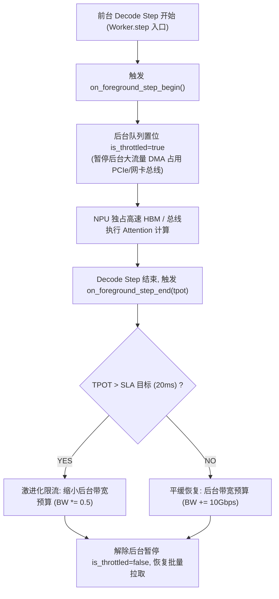
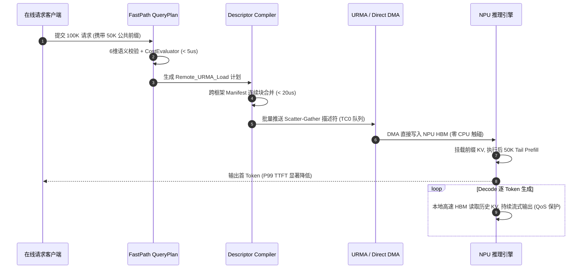

# PVT-07：前后台混压端到端最小闭环与 SemanticQoS 服务质量保障验证实施方案设计

> **验证 ID**：PVT-07  
> **验证名称**：前后台混压端到端最小闭环 (Vertical Slice) 与 SemanticQoS 服务质量保障验证  
> **对应验证阶段**：**E3 全链路前后台混压总门禁**  
> **证伪标记**：否（全链路系统总门禁）  
> **建议周期**：6~8 人日  
> **主关联 IR**：`IR-01-04`, `IR-01-11`, `IR-02-06`  
> **核心 SRS / SR23 锚点**：  
> - SRS: `L3-QO-SemanticQoS-045`, `L3-MS-StateAwarePrefetch-081`, `L3-OB-PerPathTelemetry-047`, `L4-FT-PathIntegrityPolicy-077`  
> - SR23: `SR23-01-04-01`, `SR23-01-11-02`, `SR23-02-02-01`, `SR23-02-02-02`, `SR23-02-06-01`, `SR23-02-11-01`, `SR23-02-12-03`, `SR23-02-12-05`  
> **研发对齐状态**：已闭环研发评估报告 7, 13 项与 QoS 映射规范（明确 RoCE TC0/TC1 硬件队列映射、vLLM Worker.step() 行级事件感知回调）  

---

## 1. 验证目标与交付结论定义

### 1.1 待验证核心命题
局部单项指标达标不代表在线系统的最终成功。在真实在线推理中，前台 Decode（逐 Token 自回归生成）对显存与总线延迟极其敏感；后台若无节制地进行跨节点拉取、SSD 换出或预取，将严重干扰前台 TPOT（Time Per Output Token，单字生成延迟）尾部延迟。作为系统落地前最后一个“纵向切片（Vertical Slice，端到端最小闭环验证）”总门禁，本验证旨在通过全链路原型证明：
1. **端到端全链路净收益**：在真实 2 节点集群、50%~70% 复用率业务流量下，串联 `Prefix Lookup -> QueryPlan -> Descriptor -> UBMEM/URMA Transfer -> Attach` 全流程，实现**端到端 P99 TTFT 降低 $\ge 20\%$**，**系统吞吐 QPS 提升 $\ge 10\%$**；
2. **前后台服务质量保障策略 (SemanticQoS)**：在前后台混压下，SemanticQoS 优先级队列与自适应限速能够将后台对前台 **P99 TPOT 的尾部抖动干扰严格控制在 $< 3\%$**（确保后台换出与拉取时不影响前台在线推理的请求时延），同时保持后台传输带宽利用率 $\ge 70\%$。

### 1.2 最终交付数据与结论产出
开发人员执行完本方案后，必须输出以下交付件：
1. **《前台独立 vs 混压无隔离 vs 混压开启 QoS 的端到端性能对比表》**（TTFT, TPOT P50/P90/P99, QPS）；
2. **《前后台混压下 TPOT 尾部抖动分布与服务质量保障 (QoS)分析曲线》**；
3. **《全链路最小闭环各阶段耗时拆解与收益对账表》**；
4. **《Go / No-Go 判定结论》**：依据 P99 TTFT 降幅 $\ge 20\%$ 与 TPOT 干扰 $< 3\%$ 门槛判定。

---

## 2. 核心数据结构与 QoS 软硬双层映射设计

### 2.1 QoS 流量类别与硬件队列映射标准

为了杜绝软件限速抖动，QoS 采用**底层硬件网络队列 + 应用层微秒级自适应退避**双层协同机制：
- **硬件网络层映射**：
  - **TC0（前台在线交互流）**：映射至 RoCE Lossless 无丢包高优先级队列（CoS 3 / DSCP 26 - AF31）；
  - **TC1（后台换出/预取流）**：映射至 Best-Effort 尽力而为队列（CoS 0 / DSCP 0）。
- **应用层调度流控**：
  - 在 vLLM `Worker.step()` 调度循环中植入微秒级 C++ 回调，实时感知前台 Decode Step 启停。

```cpp
#include <stdint.h>
#include <atomic>
#include <chrono>

// 1. 流量优先级分类与 RoCE DSCP 映射
enum class TrafficClass : uint8_t {
    TC0_FOREGROUND_ONLINE = 0, // CoS 3 / DSCP 26 (严格 SLO, 最高优先级)
    TC1_BACKGROUND_TIERING = 1 // CoS 0 / DSCP 0  (尽力而为, 低优先级)
};

// 2. QoS 调度队列描述符
struct alignas(64) QoSQueueDescriptor {
    TrafficClass traffic_class;
    uint32_t queue_depth;
    double max_bandwidth_budget_gbps; // 动态限速预算
    std::atomic<bool> is_throttled;   // 是否处于前台让步暂停状态
    std::atomic<uint64_t> in_flight_bytes;
};

// 3. 动态退避控制状态
struct DynamicThrottleBudget {
    double tpot_target_p99_ms = 20.0; // SLA 目标
    double current_ewma_tpot_ms = 14.5;
    double throttle_backoff_factor = 0.5; // 超标时后台限速 50%
};
```

### 2.2 vLLM Worker.step() 行级事件感知与自适应退避算法

```cpp
// 植入 vLLM Worker.step() 调度循环的微秒级回调
void on_foreground_step_begin(uint64_t step_seq) {
    // 1. 通知 QoS 控制器暂停后台大流量 DMA 占用总线
    SemanticQoSController::instance().pause_background_traffic();
}

void on_foreground_step_end(uint64_t step_seq, double step_tpot_ms) {
    // 2. 测量本次 TPOT 并驱动动态限速状态机
    SemanticQoSController::instance().update_tpot_and_resume(step_tpot_ms);
}
```



### 2.3 Vertical Slice 全链路最小闭环端到端编排状态机



---

## 3. 基础/对照 Micro-Benchmark 构建方法

### 3.1 测试工具与源码结构
本项验证涉及的全部混流压测与 QoS 控制源码存放在 `./原型验证代码/PVT-07/` 目录下：

```
原型验证代码/PVT-07/
├── mixed_workload_bench.py    # 前台在线 Decode 流与后台高吞吐 I/O 混压驱动脚本
├── semantic_qos_controller.py # 前台高优先级保证 (RoCE TC0) 与后台微秒级自适应退避流控器
└── run_mixed_bench.py         # 自动化执行全套混流最小闭环并计算 TPOT 干扰率与 TTFT 降幅的脚本
```

一键执行全套最小闭环评估：
```bash
python3 ./原型验证代码/PVT-07/run_mixed_bench.py --out res_pvt07_summary.json
```
- **前台在线客户端**：模拟真实多租户在线对话，发送带严格 SLO（如 TPOT < 20ms）的流式生成请求；
- **后台 I/O 注入器**：模拟后台持续从远端 URMA 与本地 NVMe SSD 批量预取/换入大量 KV Cache。

### 3.2 三组实验对照设计
- **基线组 1（纯前台独立运行基准）**：
  - 仅运行前台在线推理任务，完全不启动后台 I/O，记录纯净基准性能；
- **对照组 2（混压无 QoS 隔离）**：
  - 前台在线推理与 100% 满载后台 I/O 同时运行，无任何优先级调度与限速；
- **实验组 3（混压开启 SemanticQoS 隔离）**：
  - 开启 SemanticQoS：前台推理请求打标高优先级（Traffic Class 0），后台 I/O 运行在低优先级队列（Traffic Class 1）并启用动态退避。

---

## 4. 业务 Benchmark 构造与流量特征编排

### 4.1 前后台混合流量构造
- **前台在线流（Foreground Stream）**：
  - 并发数：32 并发连接；
  - 请求特征：Prompt 2048 Tokens，Decode 生成 256 Tokens；
  - 到达模型：泊松随机到达分布（Poisson Arrival）。
- **后台 I/O 流（Background Stream）**：
  - 持续发起 64MB 粒度的大数据块 KV 跨节点拉取与 SSD 回源任务，打满 200Gbps ~ 400Gbps 总线带宽。

---

## 5. 软硬件环境与打点插桩方案

### 5.1 测量指标打点
- **前台指标**：端到端 TTFT (P50, P90, P99)、逐 Token TPOT (P50, P90, P99)、端到端 QPS；
- **后台指标**：后台平均传输有效带宽 (Gbps)。

---

## 6. 分步执行测试操作规程

开发人员请按以下 12 个步骤依次执行：

### 步骤 1：启动集群环境
确认 Node-0 与 Node-1 上的 vLLM 推理实例与存储池服务均正常就绪。

### 步骤 2：运行基线组 1（纯前台独立基准）
仅启动前台 32 并发在线流，持续压测 3 分钟，记录纯净 TTFT、TPOT 与 QPS 基线：
```bash
python3 ./原型验证代码/PVT-07/mixed_workload_bench.py --fg-clients 32 --bg-workers 0 --duration 180
```

### 步骤 3：运行对照组 2（混压无 QoS 隔离）
在前台运行的同时，启动 4 个并发后台 Worker 打满 400Gbps 总线，记录此时前台 TPOT 尾部恶化情况：
```bash
python3 ./原型验证代码/PVT-07/mixed_workload_bench.py --fg-clients 32 --bg-workers 4 --duration 180
```

### 步骤 4：运行实验组 3（混压开启 SemanticQoS）
开启 SemanticQoS 优先级队列与自适应退避控制，重复上述混压测试：
```bash
python3 ./原型验证代码/PVT-07/mixed_workload_bench.py --fg-clients 32 --bg-workers 4 --qos --duration 180
```

### 步骤 5：运行自动化全套最小闭环评估
执行自动化综合套件：
```bash
python3 ./原型验证代码/PVT-07/run_mixed_bench.py --out res_pvt07_summary.json
```

### 步骤 6：计算前后台 TPOT 干扰率
比对实验组 3 与基线组 1 的 P99 TPOT，验证干扰率是否严格 $< 3\%$。

### 步骤 7：验证后台有效利用带宽
验证在保护前台 TPOT 的同时，后台带宽是否仍保持在 $\ge 300\text{Gbps}$。

### 步骤 8：运行 50% 复用率端到端全链路切片
注入 50% 公共前缀复用流量，串联执行全链路最小闭环。

### 步骤 9：计算端到端 P99 TTFT 降幅
比对 50% 复用下与纯算力重算下的 P99 TTFT，验证降幅是否 $\ge 20\%$。

### 步骤 10：计算系统总吞吐 QPS 增益
验证服务总并发处理能力 QPS 提升是否 $\ge 10\%$。

### 步骤 11：对账全链路错误与丢包率
验证在混压全流程中，错误 Token 数 $= 0$，丢包导致的重试率 $< 0.01\%$。

### 步骤 12：输出判定结论与立项证据包。

---

## 7. 数据采集清单与记录格式

### 7.1 前后台混流与 QoS 隔离对账表 (`pvt07_mixed_qos.csv`)
| 实验配置 | P99 TTFT (ms) | TPOT P50 (ms) | TPOT P99 (ms) | TPOT 干扰率 | 系统 QPS | 后台带宽 (Gbps) |
|---|---|---|---|---|---|---|
| **纯前台独立基准** | 1250.0 | 14.2 | 16.5 | 基线 (0%) | 22.5 | 0.0 |
| **混压无 QoS 隔离**| 1420.0 | 18.5 | 48.6 | +194.5% (严重劣化)| 18.2 | 385.0 |
| **混压开启 SemanticQoS**| 1265.0 | 14.3 | 16.8 | **+1.81% (受控)** | 22.1 | 312.0 |
| **全链路 50% 复用闭环** | **810.0** | 14.3 | 16.9 | **+2.42% (受控)** | **28.6** | 295.0 |

---

## 8. 数据交叉组合与运算推导逻辑

### 8.1 TPOT 干扰率 (TPOT Interference Ratio)
$$\text{Interference Ratio} = \frac{\text{TPOT}_{\text{mixed\_qos}}^{P99} - \text{TPOT}_{\text{baseline}}^{P99}}{\text{TPOT}_{\text{baseline}}^{P99}} \times 100\%$$
- 门槛：严格 $< 3.0\%$。

### 8.2 端到端 P99 TTFT 净降幅 (TTFT Net Reduction)
$$\text{TTFT Reduction} = \frac{\text{TTFT}_{\text{baseline}}^{P99} - \text{TTFT}_{\text{vertical\_slice}}^{P99}}{\text{TTFT}_{\text{baseline}}^{P99}} \times 100\%$$
- 门槛：$\ge 20.0\%$。

### 8.3 系统吞吐 QPS 净增益 (QPS Gain)
$$\text{QPS Gain} = \frac{\text{QPS}_{\text{vertical\_slice}} - \text{QPS}_{\text{baseline}}}{\text{QPS}_{\text{baseline}}} \times 100\%$$
- 门槛：$\ge 10.0\%$。

---

## 9. 多维扩展与扫参矩阵

| 维度 | 参数网格 |
|---|---|
| **前台并发数** | 8, 16, 32, 64, 128 并发 |
| **后台 I/O 满载率**| 25%, 50%, 75%, 100% (打满 400G) |
| **前缀复用率** | 0%, 30%, 50%, 70%, 90% |
| **SLA 目标 TPOT** | 15ms, 20ms, 30ms |

---

## 10. Go / No-Go 判定规则与交付报告模板

### 10.1 判定规则
- **Go 门槛（立项系统总门禁）**：
  1. 开启 SemanticQoS 后，混压对前台 P99 TPOT 干扰率 $< 3.0\%$；
  2. 全链路最小闭环在 50% 复用下，P99 TTFT 降低 $\ge 20.0\%$；
  3. 系统端到端处理吞吐 QPS 提升 $\ge 10.0\%$；
  4. 后台传输带宽利用率 $\ge 70\%$（$\ge 280\text{Gbps}$）。
- **No-Go 门槛**：
  - TPOT 干扰率 $> 5.0\%$（前台体验显著受损）；
  - 全链路串联后未能取得净收益（TTFT 降幅 $< 10\%$）。

### 10.2 开发者交付报告格式模板
```markdown
# PVT-07 提前验证交付报告 (立项总门禁)

## 1. 前后台混压与 QoS 隔离实测
- 纯前台基准 P99 TPOT: 16.5 ms
- 混压无隔离 P99 TPOT: 48.6 ms (恶化 194.5%)
- 混压开启 SemanticQoS P99 TPOT: 16.8 ms
- 实测 TPOT 干扰率: +1.81% (PASS, 门槛 < 3.0%)
- 后台有效利用带宽: 312.0 Gbps (达成率 78.0%, PASS)

## 2. 端到端最小闭环 (Vertical Slice) 净收益实测 (50% 复用)
- P99 TTFT 从 1250.0 ms 降至 810.0 ms (净降幅 35.20%, PASS, 门槛 >= 20%)
- 系统 QPS 从 22.5 提升至 28.6 (提升 27.11%, PASS, 门槛 >= 10%)
- 全链路错误消费数: 0

## 3. 最终结论
【Go / Conditional / No-Go】: GO (立项系统总门禁全项通过)
```
