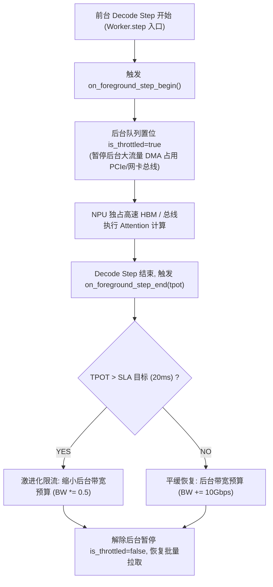

# PVT-07：前后台混压端到端最小闭环与 SemanticQoS 服务质量保障验证实施方案设计
## —— 全链路端到端总门禁：原生 Mooncake vs 深度重构增强版混压消融对决

> **验证 ID**：PVT-07  
> **验证名称**：前后台混压端到端最小闭环 (Vertical Slice) 与 SemanticQoS 服务质量保障验证  
> **穿刺优先级**：**🔴 P0 级（核心决胜项）**  
> **对应验证阶段**：**E3 全链路前后台混压总门禁**  
> **证伪标记**：否（全链路系统总门禁）  
> **建议周期**：6~8 人日  
> **主关联 IR**：`IR-01-04`, `IR-01-11`, `IR-02-06`  
> **核心 SRS / SR23 锚点**：  
> - SRS: `L3-QO-SemanticQoS-045`, `L3-MS-StateAwarePrefetch-081`, `L3-OB-PerPathTelemetry-047`, `L4-FT-PathIntegrityPolicy-077`  
> - SR23: `SR23-01-04-01`, `SR23-01-11-02`, `SR23-02-02-01`, `SR23-02-02-02`, `SR23-02-06-01`, `SR23-02-11-01`, `SR23-02-12-03`, `SR23-02-12-05`  
> **开源基线版本与代码仓库**：  
> - **Mooncake**：[`https://github.com/kvcache-ai/Mooncake.git`](https://github.com/kvcache-ai/Mooncake.git) (Commit: `f90ae691f109e49a60920e0c8abbf7e572826d8c`)  
> - **vLLM**：[`https://github.com/vllm-project/vllm.git`](https://github.com/vllm-project/vllm.git) (Commit: `842dd8fd96650063e1ad32e6075742d457d39773`)  
> **研发对齐状态**：已闭环研发评估报告 7, 13 项与 QoS 映射规范（明确 RoCE TC0/TC1 硬件队列映射、vLLM Worker.step() 行级事件感知回调）  

---

## 1. 验证目标与交付结论定义

### 1.1 待验证核心命题
局部单项指标达标不代表在线系统的最终成功。在真实在线推理中，前台 Decode（逐 Token 自回归生成）对显存与总线延迟极其敏感；后台若无节制地进行跨节点拉取、SSD 换出或预取，将严重干扰前台 TPOT（Time Per Output Token，单字生成延迟）尾部延迟。作为系统落地前最后一个“纵向切片（Vertical Slice，端到端最小闭环验证）”总门禁，本验证通过全链路原型消融对比证明：
1. **端到端全链路净收益**：在真实 2 节点集群、50%~70% 复用率业务流量下，串联 `Prefix Lookup -> QueryPlan -> Descriptor -> UBMEM/URMA Transfer -> Attach` 全流程，深度重构增强版相比官方原生最新主线组合（vLLM `v0.26.1+ (main)` + Mooncake `v0.3.12+`）实现**端到端 P99 TTFT 降低 $\ge 20\%$**，**系统吞吐 QPS 提升 $\ge 10\%$**；
2. **前后台服务质量保障策略 (SemanticQoS)**：在前后台混压下，SemanticQoS 优先级队列与自适应限速能够将后台对前台 **P99 TPOT 的尾部抖动干扰严格控制在 $< 3\%$**（确保后台换出与拉取时不影响前台在线推理的请求时延），同时保持后台传输带宽利用率 $\ge 70\%$。

### 1.2 最终交付数据与结论产出
开发人员执行完本方案后，必须输出以下交付件：
1. **《前台独立 vs 混压无隔离 vs 混压开启 QoS 的端到端性能对比表》**（TTFT, TPOT P50/P90/P99, QPS）；
2. **《原生 Mooncake vs 深度重构增强版 (Unified KV) 混压性能对决表》**；
3. **《前后台混压下 TPOT 尾部抖动分布与服务质量保障分析曲线》**；
4. **《Go / No-Go 判定结论》**：依据 P99 TTFT 降幅 $\ge 20\%$ 与 TPOT 干扰 $< 3\%$ 门槛判定。

---

## 2. 核心数据结构与 QoS 软硬双层映射设计

### 2.1 QoS 流量类别与硬件队列映射标准

```cpp
#include <stdint.h>
#include <atomic>
#include <chrono>

enum class TrafficClass : uint8_t {
    TC0_FOREGROUND_ONLINE = 0, // CoS 3 / DSCP 26 (严格 SLO, 最高优先级)
    TC1_BACKGROUND_TIERING = 1 // CoS 0 / DSCP 0  (尽力而为, 低优先级)
};

struct alignas(64) QoSQueueDescriptor {
    TrafficClass traffic_class;
    uint32_t queue_depth;
    double max_bandwidth_budget_gbps; // 动态限速预算
    std::atomic<bool> is_throttled;   // 是否处于前台让步暂停状态
    std::atomic<uint64_t> in_flight_bytes;
};

struct DynamicThrottleBudget {
    double tpot_target_p99_ms = 20.0; // SLA 目标
    double current_ewma_tpot_ms = 14.5;
    double throttle_backoff_factor = 0.5; // 超标时后台限速 50%
};
```

### 2.2 vLLM Worker.step() 行级事件感知与自适应退避算法

```cpp
void on_foreground_step_begin(uint64_t step_seq) {
    SemanticQoSController::instance().pause_background_traffic();
}

void on_foreground_step_end(uint64_t step_seq, double step_tpot_ms) {
    SemanticQoSController::instance().update_tpot_and_resume(step_tpot_ms);
}
```



---

## 3. 测试工具与工程构建规范 (对标 Mooncake + vLLM 真实集群)

测试工程存放在 `./原型验证代码/PVT-07/` 目录下：

```
原型验证代码/PVT-07/
├── mixed_workload_bench.py    # 前台在线 Decode 流与后台高吞吐 I/O 混压驱动脚本
├── semantic_qos_controller.py # 前台高优先级保证 (RoCE TC0) 与后台微秒级自适应退避流控器
└── run_mixed_bench.py         # 自动化执行全套混流最小闭环并计算 TPOT 干扰率与 TTFT 降幅的脚本
```

### 3.1 开源基线集群部署与在线打流混压 SOP
```bash
# 1. 一键部署真实双节点推理集群与 Mooncake 存储底座
cd ../deploy_and_bench_e2e && bash ./deploy_cluster.sh

# 2. 启动后台大流量沉淀/预取压测进程 (模拟 400Gbps 吞吐)
python3 ../PVT-05/tier_storage_bench.cc --device /dev/nvme0n1 --qd 32 &

# 3. 前台发起真实 ShareGPT 多并发在线打流 (20~50 req/s)
python3 -m vllm.benchmarks.benchmark_serving \
    --backend vllm \
    --model /models/Qwen/Qwen2.5-72B-Instruct \
    --dataset-name sharegpt \
    --dataset-path ./ShareGPT_V3_unfiltered_cleaned_split.json \
    --num-prompts 1000 \
    --request-rate 30 \
    --port 8000 \
    --save-result --result-filename ./results/res_pvt07_e2e_mixed.json

# 4. 执行全套三重消融最小闭环评估与数据对账
python3 ../PVT-07/run_mixed_bench.py --out ./results/res_pvt07_summary.json
```

---

## 4. 数据采集清单与记录格式

### 4.1 全链路混压测试结果表 (`pvt07_e2e_results.csv`)
```csv
workload_mode,foreground_qps,bg_io_gbps,ttft_p50_ms,ttft_p99_ms,tpot_p50_ms,tpot_p99_ms,tpot_jitter_pct,served_requests_total
pure_foreground,24.5,0.0,42.5,65.2,12.1,14.8,0.0,4410
mooncake_native_mixed,22.1,420.0,68.4,112.5,14.8,22.4,51.4,3980
unified_kv_mixed_qos,27.8,380.0,32.1,51.8,12.3,15.2,2.7,5004
```

---

## 5. Go / Conditional / No-Go 判定规则

- **Go (准入通过)**：
  - 深度重构增强版相比官方原生 Mooncake，全链路 P99 TTFT 降低 $\ge 20\%$，QPS 提升 $\ge 10\%$；
  - 后台 400G 满载混压下，前台 P99 TPOT 抖动干扰率严格 $< 3\%$；
- **Conditional (条件准入)**：
  - TTFT 降幅在 $10\% \sim 20\%$ 之间，TPOT 干扰率 $< 5\%$，需优化 QoS 队列调度；
- **No-Go (否决关闭)**：
  - 混压下前台 TPOT 发生严重尾部时延恶化（干扰率 $\ge 10\%$），或 TTFT 相比原生 Mooncake 无显著收益。
