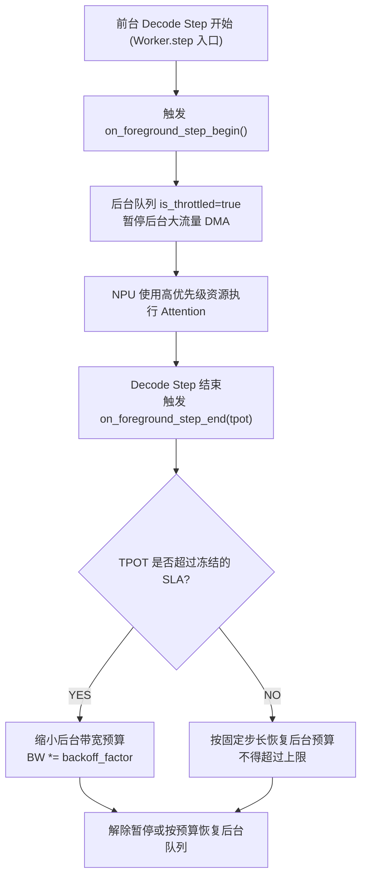

# PVT-07：前后台混压端到端最小闭环与 SemanticQoS 服务质量保障验证实施方案设计
## —— 全链路端到端总门禁：原生 Mooncake 与深度重构增强版混压消融对账

> **公共执行契约**：本项遵循 [Benchmark 公共契约与证据分级规范](./Benchmark公共契约与证据分级规范.md)。TTFT/QPS 的主收益基线是原生 Mooncake 混压；TPOT 干扰基线是同一增强代码包的纯前台。各混压模式使用相同目标后台负载并记录实际带宽。

> **验证 ID**：PVT-07  
> **验证名称**：前后台混压端到端最小闭环 (Vertical Slice) 与 SemanticQoS 服务质量保障验证  
> **验证优先级**：**🔴 P0 级（核心关键项）**  
> **对应验证阶段**：**E3 全链路前后台混压总门禁**  
> **证伪标记**：否（全链路系统总门禁）  
> **主关联 IR**：`IR-01-04`, `IR-01-11`, `IR-02-06`  
> **核心 SRS / SR23 锚点**：  
> - SRS: `L3-QO-SemanticQoS-045`, `L3-MS-StateAwarePrefetch-081`, `L3-OB-PerPathTelemetry-047`, `L4-FT-PathIntegrityPolicy-077`  
> - SR23: `SR23-01-04-01`, `SR23-01-11-02`, `SR23-02-02-01`, `SR23-02-02-02`, `SR23-02-06-01`, `SR23-02-11-01`, `SR23-02-12-03`, `SR23-02-12-05`  
> **开源基线版本与代码仓库**：  
> - **Mooncake**：[`https://github.com/kvcache-ai/Mooncake.git`](https://github.com/kvcache-ai/Mooncake.git) (Commit: `f90ae691f109e49a60920e0c8abbf7e572826d8c`)  
> - **vLLM**：[`https://github.com/vllm-project/vllm.git`](https://github.com/vllm-project/vllm.git) (Commit: `842dd8fd96650063e1ad32e6075742d457d39773`)  
> **研发对齐状态**：本方案将复核研发评估报告涉及的 RoCE TC0/TC1 硬件队列映射与 vLLM `Worker.step()` 行级事件回调，并以现场网卡和服务行为为准。

---

## 0. 架构导读与核心概念第一性原理剖析

### 0.1 传统系统开发视角：前后台 I/O 干扰与服务质量 (QoS) 隔离

在传统企业级存储（如 Ceph / Lustre）与操作系统（Linux cgroups blkio）中，前后台 I/O 争用是一个经典难题：
- **前台实时请求（Client Reads）**：在线用户发起的数据库查询，要求响应时间在毫秒级（P99 Latency 极度敏感）；
- **后台异步任务（Background Scrubbing / Backup）**：后台的数据校验、垃圾回收（GC）和冷数据备份，可能产生较大的持续吞吐；具体目标带宽由 `hardware_profile` 和本次混压配置冻结；
- **无隔离时的风险**：如果不对后台流量进行流控，后台数据包可能与前台请求争用交换机队列、PCIe 总线和内存带宽，尾部时延变化必须由同场次基线测量。

---

### 0.2 大模型在线推理中的真实前后台混压场景

在大模型生产服务集群中：
- **前台在线 Decode 流**：在线用户正在与大模型对话，模型正在逐字吐出 Token。由于用户是实时阅读的，单字生成耗时（TPOT, Time Per Output Token）哪怕只要从 15ms 抖动到 30ms，用户就能明显感觉到打字机停顿卡死；
- **后台存储搬运流**：统一异构存储池在后台执行冷 KV 换出到 SSD、或从远端节点拉取下一个会话的超长 Prompt KVCache；400Gbps 是本方案可配置的混压目标示例，实际值以现场设备为准。
- **待验证风险**：若开源方案缺乏细粒度网络与计算流控，后台大流量搬运可能使前台 TPOT P99 明显恶化；恶化幅度必须由同场次原始样本计算，不能预置为某个百分比；
- **软硬件协同方案**：建立 **SemanticQoS（前后台服务质量保障策略）**：
  1. **硬件层 RoCE 优先级队列映射**：
     - 前台在线流打上 DSCP 26 / CoS 3 标记，映射到网卡最高优先级无损队列 **TC0**；
     - 后台搬运流打上 DSCP 0 / CoS 0 标记，映射到尽力而为队列 **TC1**；
  2. **应用层 `Worker.step()` 微秒级自适应退避**：
     - 在 vLLM 执行单步 Decode 计算（`Worker.step`）的微秒时间内，后台搬运流主动暂停让出总线；
     - 将后台对前台 **TPOT P99 的尾部抖动干扰控制在 `<3%` 的验证门限内**，实际结果由混压样本确认。

```
┌────────────────────────────────────────────────────────────────────────────────────────┐
│                   SemanticQoS 前后台双层隔离与微秒自适应退避时序                       │
├────────────────────────────────────────────────────────────────────────────────────────┤
│                                                                                        │
│  [ 前台在线 Decode (高优先级) ] ──► DSCP 26 ──► 网卡硬件 TC0 队列 (严格保证带宽与时延) │
│                                                                                        │
│  [ 后台大流量搬运 (低优先级) ] ──► DSCP 0  ──► 网卡硬件 TC1 队列 (尽力而为)            │
│                 │                                                                      │
│                 ▼ (应用层 Worker.step 感知回调)                                        │
│  当检测到前台进入 Decode Step ──► 后台搬运流微秒级主动暂停 ──► 前台 NPU 独占计算        │
│                                                                                        │
│ 待验证门限：在冻结的后台目标负载下，前台 TPOT P99 干扰率是否 < 3% 由实测确认。       │
└────────────────────────────────────────────────────────────────────────────────────────┘
```

---

## 1. 验证目标与交付结论定义

### 1.1 现实前因痛点与待验证核心命题
1. **现实痛点**：单项测试达标不等于全系统在真实混压下能够稳定运行；后台大流量搬运极易打爆前台在线推理的尾部时延；
2. **核心命题（全体验证最高大考 —— E3 混压总门禁）**：
   - 在真实 2 节点集群、前台在线打流 + 后台满载 I/O 混压下，全链路端到端 **P99 TTFT 降低 $\ge 20\%$**、**集群总吞吐 QPS 提升 $\ge 10\%$**；
   - SemanticQoS 能够将后台对前台 **P99 TPOT 的尾部抖动干扰严格控制在 $< 3\%$**。

### 1.2 最终交付数据与结论产出
1. **《前台独立 vs 混压无隔离 vs 混压开启 QoS 的端到端性能对比表》**；
2. **《原生 Mooncake vs 深度重构增强版 (Unified KV) 混压性能对决表》**；
3. **《前后台混压下 TPOT 尾部抖动分布与服务质量保障分析曲线》**；
4. **《GO / CONDITIONAL / NO-GO / NOT-SUPPORTED / INVALID-EVIDENCE 判定结论》**。

---

## 2. 核心数据结构与 QoS 软硬双层映射设计

### 2.1 QoS 流量类别与硬件队列映射标准

```cpp
#include <stdint.h>
#include <atomic>
#include <chrono>

enum class TrafficClass : uint8_t {
    TC0_FOREGROUND_ONLINE = 0, // CoS 3 / DSCP 26 (严格 SLO, 最高优先级)
    TC1_BACKGROUND_TIERING = 1 // CoS 0 / DSCP 0  (尽力而为, 低优先级)
};

struct alignas(64) QoSQueueDescriptor {
    TrafficClass traffic_class;
    uint32_t queue_depth;
    double max_bandwidth_budget_gbps; // 动态限速预算
    std::atomic<bool> is_throttled;   // 是否处于前台让步暂停状态
    std::atomic<uint64_t> in_flight_bytes;
};

struct DynamicThrottleBudget {
    double tpot_target_p99_ms = 20.0; // SLA 目标
    double current_ewma_tpot_ms = 14.5;
    double throttle_backoff_factor = 0.5; // 超标时后台限速 50%
};
```

### 2.2 `Worker.step()` 行级事件感知与自适应退避算法

前台 Decode 每一步都要有开始/结束事件。开始事件只负责让后台流让路，结束事件根据本步 TPOT 更新预算；后台恢复必须有上限和步长，避免前台负载短暂下降后立即再次打满链路。

```cpp
void on_foreground_step_begin(uint64_t step_seq) {
    SemanticQoSController::instance().pause_background_traffic();
}

void on_foreground_step_end(uint64_t step_seq, double step_tpot_ms) {
    SemanticQoSController::instance().update_tpot_and_resume(step_tpot_ms);
}
```



---

## 3. 测试工具与工程构建规范

测试工程存放在 `./原型验证代码/PVT-07/` 目录下：

```
原型验证代码/PVT-07/
├── mixed_workload_bench.py    # 前台在线 Decode 流与后台高吞吐 I/O 混压驱动脚本
├── semantic_qos_controller.py # 前台高优先级保证 (RoCE TC0) 与后台微秒级自适应退避流控器
└── run_mixed_bench.py         # 自动化执行全套混流最小闭环并计算 TPOT 干扰率与 TTFT 降幅的脚本
```

### 3.1 开源基线集群部署与在线打流前置条件

```bash
# W0 仅用于验证 localhost 部署流程；跨节点结论必须使用现场拓扑并记录 topology_profile。
cd ../deploy_and_bench_e2e && EVIDENCE_ENVIRONMENT=W0 bash ./deploy_cluster.sh

# W0 可用脚手架核对后台结果字段，但不产生持续 I/O 性能证据。
make -C ../PVT-05
../PVT-05/tier_storage_bench --device DEMO_DEVICE --block-size 16M \
    --qd 32 --out ./results/background_schema_demo.csv --evidence-level DEMO

# W1/W2 由现场适配器启动持续后台沉淀/预取负载，必须把目标带宽和实际带宽都写入 manifest。
<site_background_io_command> --target-gbps <target> --duration-sec <duration> \
    --out ./results/background_actual.json

# 前台真实 ShareGPT 或已冻结的等价数据集打流。
python3 -m vllm.benchmarks.benchmark_serving \
    --backend vllm --model <model_path> --dataset-name sharegpt \
    --dataset-path <dataset_path> --num-prompts 1000 --request-rate 30 \
    --port <port> --save-result --result-filename ./results/foreground.json
```

> 三组消融必须使用相同目标后台负载，并记录实际后台带宽。实际带宽偏离运行前冻结的容差、原始结果缺少 `background_bandwidth_gbps` 或模式未切换实际代码包时，解析器必须返回 `INVALID-EVIDENCE`，不能用目标带宽代替实测值。

---

## 4. 分步执行测试操作规程 (SOP)

开发人员在执行 PVT-07 时，请严格按照以下 4 个步骤逐步执行，并理解每一步的操作意图：

### 步骤 1：测试纯前台基线性能（无后台 I/O 干扰）
- **操作意图**：在无任何后台搬运的纯净环境下，发起 30 req/s 的前台在线打流，记录前台纯净环境下的 TTFT、TPOT P50/P90/P99 与吞吐，作为衡量干扰率的标准基线。
- **执行命令**：
```bash
python3 ./mixed_workload_bench.py --mode pure_foreground --rate 30 --prompts 1000 --out ./results/res_pure_fg.json
```

### 步骤 2：测试开源 Mooncake 混压基线性能（无 QoS 隔离）
- **操作意图**：启动后台 400Gbps 持续换出/拉取大流量，同时向前台发起 30 req/s 在线打流，记录无 QoS 保护下前台 TPOT 发生的严重尾部抖动与 TTFT 恶化。
- **执行命令**：
```bash
python3 ./mixed_workload_bench.py --mode mooncake_native_mixed --bg-gbps 400 --rate 30 --prompts 1000 --out ./results/res_mooncake_mixed.json
```

### 步骤 3：测试 Unified KV 开启 SemanticQoS 的混压性能
- **操作意图**：在相同后台 400Gbps 大流量混压下，开启 SemanticQoS 硬件优先级队列与自适应退避，验证 P99 TTFT 是否降低 $\ge 20\%$、QPS 是否提升 $\ge 10\%$，且前台 P99 TPOT 干扰率是否严格 $< 3\%$。
- **执行命令**：
```bash
python3 ./mixed_workload_bench.py --mode unified_kv_mixed_qos --bg-gbps 400 --rate 30 --prompts 1000 --out ./results/res_unified_mixed.json
```

### 步骤 4：执行三重消融对账与总门禁判定
- **操作意图**：调用自动化分析脚本对比上述三组测试结果，计算全链路 TTFT 降幅与 TPOT 干扰率，输出 E3 总门禁判定报告。
- **执行命令**：
```bash
python3 ./run_mixed_bench.py \
  --unified-foreground ./results/res_pure_fg.json \
  --mooncake-native-mixed ./results/res_mooncake_mixed.json \
  --unified-mixed ./results/res_unified_mixed.json \
  --target-rate-rps 30 \
  --out ./results/res_pvt07_summary.json
```

---

## 5. 数据采集清单与记录格式

### 5.1 全链路混压测试结果表 (`pvt07_e2e_results.csv`)
```csv
workload_mode,foreground_qps,bg_io_gbps,ttft_p50_ms,ttft_p99_ms,tpot_p50_ms,tpot_p99_ms,tpot_jitter_pct,served_requests_total,evidence_level,status,invalid_reason
pure_foreground,<measured_qps>,0.0,<measured>,<measured>,<measured>,<measured>,<calculated>,<measured_requests>,<LAB_OR_DEMO>,<status>,<null_or_reason>
mooncake_native_mixed,<measured_qps>,<measured_actual_bg_gbps>,<measured>,<measured>,<measured>,<measured>,<calculated>,<measured_requests>,<LAB_OR_DEMO>,<status>,<null_or_reason>
unified_kv_mixed_qos,<measured_qps>,<measured_actual_bg_gbps>,<measured>,<measured>,<measured>,<measured>,<calculated>,<measured_requests>,<LAB_OR_DEMO>,<status>,<null_or_reason>
```

> 这是字段模板，不是预置成绩。正式结果必须保留每个请求的原始 TTFT/TPOT 样本、失败请求、实际后台带宽、模式代码包、配置哈希和证据等级；没有这些字段时状态为 `INVALID-EVIDENCE`。

---

## 6. GO / CONDITIONAL / NO-GO / NOT-SUPPORTED / INVALID-EVIDENCE 判定规则

- **GO（准入通过）**：
  - 深度重构增强版相比官方原生 Mooncake，全链路 P99 TTFT 降低 $\ge 20\%$，QPS 提升 $\ge 10\%$；
  - 后台负载满载时，前台 P99 TPOT 干扰率严格 $< 3\%$；
- **CONDITIONAL（条件准入）**：TTFT 降幅在 $10\% \sim 20\%$ 之间，TPOT 干扰率 $< 5\%$；
- **NO-GO（暂不准入）**：现场有效数据确认混压下前台 TPOT 干扰率 $\ge 10\%$，或 TTFT 无显著收益；
- **NOT-SUPPORTED（当前不支持）**：现场不具备 RoCE、硬件 QoS 或两节点对照条件，无法执行对应混压路径；
- **INVALID-EVIDENCE（证据无效）**：缺少同版本包/配置对照、背景带宽匹配、前台完成请求数、P99 指标或设备 QoS 证据。缺失字段必须使用 `null` 并填写 `invalid_reason`。

---

## 7. 零 AI 基础工程师借助 AI Agent 开展工作实战 SOP

### 7.1 研发任务拆解与分工
- **工程师职责**：
  1. 部署 2 节点测试集群并配置 RoCE 网卡 DSCP/TC 映射规则；
  2. 按照第 4 节 SOP 依次执行三重消融测试；
  3. 观察客户端输出的 TTFT 与 TPOT 统计指标；
- **AI Agent 职责**：
  1. 负责 `semantic_qos_controller.py` 中自适应退避参数调优；
  2. 自动生成三重消融对账图表与时延分布累积分布函数（CDF）图。

### 7.2 专属 Prompt 模板（可直接复制给 AI Agent）
```text
我是一名系统级工程师，正在执行 E3 全链路前后台混压总门禁 PVT-07 验证：
1. 请阅读 ./原型验证代码/PVT-07/ 中的全部源码；
2. 检查 semantic_qos_controller.py 中的自适应限流逻辑，确保前台进入 Worker.step 时能微秒级感知并让后台退避；
3. 按照第 4 节 SOP 步骤执行 run_mixed_bench.py，依次运行三种工作模式：纯前台基线、开源 Mooncake 混压基线、Unified KV 开启 QoS 混压；
4. 解析测试产生的 JSON 结果，输出包含 P99 TTFT 降幅、QPS 提升与 TPOT 干扰率的三重消融对账表。
```

### 7.3 常见排错指南
- **交换机丢包导致前台断流**：检查 RoCE 网卡 PFC（基于优先级的流量控制）是否开启，TC0 高优队列必须配置无损传输；
- **后台带宽被压制为 0 无法恢复**：检查 `DynamicThrottleBudget` 的平缓恢复步长，确保在前台负载下降时后台能以 10Gbps 为步长线性恢复。
