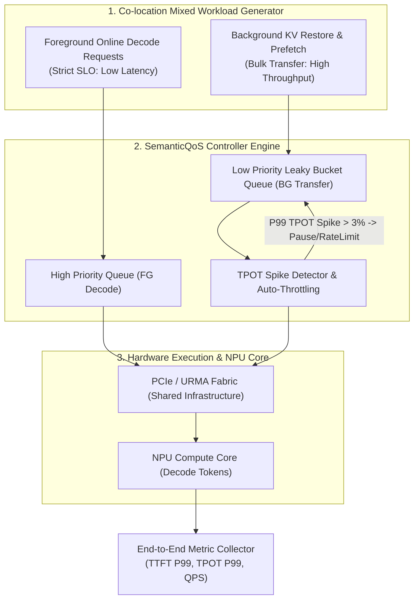
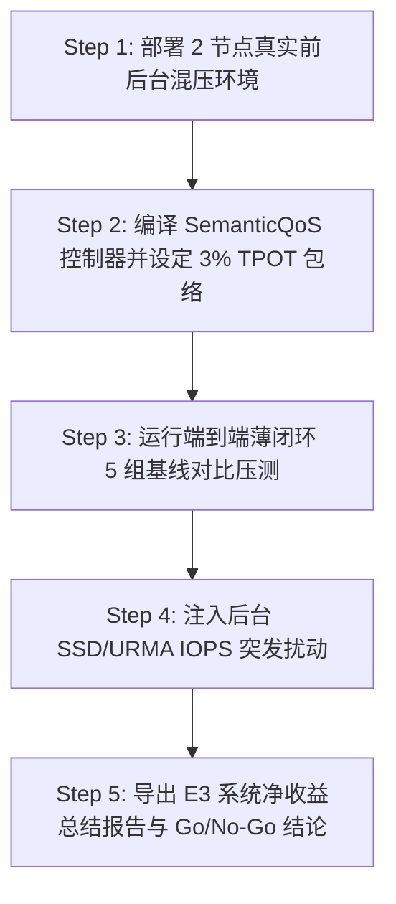

# PVT-07：前后台混压端到端薄闭环与 SemanticQoS 干扰包络验证实施方案设计

> **验证 ID**：PVT-07  
> **验证名称**：真实前后台混压端到端薄闭环 (Vertical Slice) 与 SemanticQoS 干扰包络验证  
> **对应证据门**：**E3 系统净收益**  
> **证伪标记**：否（项目价值总门禁）  
> **建议周期**：12~15 人日  
> **主关联 IR**：`IR-01-04`, `IR-01-11`, `IR-02-06`  
> **核心 SRS / SR23 锚点**：  
> - SRS: `L3-QO-SemanticQoS-045`, `L3-MS-StateAwarePrefetch-081`, `L3-OB-PerPathTelemetry-047`, `L4-FT-PathIntegrityPolicy-077`  
> - SR23: `SR23-01-04-01`, `SR23-01-11-02`, `SR23-02-02-01`, `SR23-02-02-02`, `SR23-02-06-01`, `SR23-02-11-01`, `SR23-02-12-03`, `SR23-02-12-05`  

---

## 1. 验证项概述与映射追溯

### 1.1 背景诉求与必要性

单项传输带宽或局部算法达标，绝对不代表在线系统的最终成功。在真实在线推理中，前台 Decode 算力与 Memory Bandwidth 极其敏感，后台若盲目开展 SSD KV 回源、预取（Prefetch）或跨节点迁移，极易与前台争用 PCIe/总线带宽，引发严重的前台 TPOT 尾部抖动（Tail Spike）。

PVT-07 是立项前最后一个**“纵向切片（Vertical Slice）”总门禁**，必须在真实前后台混压场景下，验证 SemanticQoS 流量隔离与端到端 TTFT/TPOT/QPS 净收益。

### 1.2 与项目竞争力关联

终极支撑**竞争力 #2（端到端净收益与薄闭环验收）**与**竞争力 #4（前后台 Semantic QoS 隔离）**。串联 `Prefix Lookup -> QueryPlan -> Descriptor -> Load/Attach/Recompute` 全流程，验证安全包络与系统净收益。

### 1.3 SRS / SR23 / IR 需求追溯矩阵

| 需求层级 | 标识符 / 编号 | 描述 | 验证承接责任 |
|---|---|---|---|
| **IR** | `IR-01-04` | 端到端异步流水与计算重叠 | 验证混流下 NPU 计算与后台 I/O 的重叠 |
| **IR** | `IR-01-11` | 前后台 SemanticQoS 优先级队列 | 验证前台 Decode 优先，后台 Prefetch 限速 |
| **IR** | `IR-02-06` | 系统级端到端薄闭环与 A/B 净收益 | 在 2 节点真实环境下闭环验收 P99 TTFT 与 TPOT |

---

## 2. 核心验证假设与实验矩阵设计

### 2.1 待验证核心假设（Hypotheses）

1. **H7-1**：在选定复用型 Workload 下，统一存储池实现 **端到端 P99 TTFT 降低 $\ge 20\%$**，**QPS 提升 $\ge 10\%$**，**计算-传输重叠率 $\ge 60\%$**。
2. **H7-2**：在 SemanticQoS 控制下，后台回源/预取对前台 **P99 TPOT 的尾部抖动干扰严格 $< 3\%$**，**Fallback 成功率 $= 100\%$**。

### 2.2 详细实验矩阵

| 前台 Decode 并发 | 后台 I/O 传输带宽 (SSD/URMA) | 流量模式 | SemanticQoS 机制 | 故障/网络扰动 |
|---|---|---|---|---|
| 1, 16, 64 并发 | 0%, 25%, 50%, 100% 后台满载 | Steady State (稳态) / Burst (突发) | 无隔离 / 软件限流 / 硬件 TC 独立队列 | 后台 IOPS 突发 / 节点链路拥塞 |

---

## 3. 测试 Harness 架构与量化数学模型

### 3.1 端到端薄闭环与 SemanticQoS 调度架构



---

## 4. 对照基线与因果消融设计

同模型、同硬件、同 SLO、同调优预算下开展 **5 组对比**：
1. **基线 1：原生框架无缓存**（纯重算基线）；
2. **基线 2：最佳可行开源组合**（Mooncake / LMCache 同硬件 Provider 调优版）；
3. **基线 3：统一存储池关闭 QoS & 异步流水**；
4. **基线 4：统一存储池关闭 State Intelligence 消融**；
5. **基线 5：统一存储池完整方案（SUT）**。

---

## 5. 指标体系与 Go/No-Go 显式判定门槛

- **Go 门槛**：
  1. 端到端 $P99$ TTFT 降低 $\ge 20\%$，SemanticQoS 受控子测试 $P99$ TTFT 降低 $\ge 25\%$；
  2. QPS 提升 $\ge 10\%$；
  3. 计算与传输重叠率 $\ge 60\%$；
  4. 安全包络内 $P99$ TPOT 回退 $< 3\%$；
  5. Fallback 成功率 $= 100\%$。
- **No-Go 门槛**：后台 I/O 造成前台 $P99$ TPOT 尾部抖动 $> 10\%$，或端到端系统开销完全吞噬了 TTFT 收益。

---

## 6. 完整原型验证实施方案与具体步骤

### 6.1 验证环境准备与前置依赖

1. **集群拓扑**：2 节点环境 (Node-0 & Node-1), NPU 8× HBM, 800G URMA, 4× NVMe Direct SSD。
2. **测试驱动**：前后台混压压测工具 `pvt07_vertical_slice_bench.py`。
3. **工作目录**：`/tmp/pvt07_harness/`。

### 6.2 核心代码实现

#### 代码 1：`semantic_qos_controller.cc` (SemanticQoS 前后台漏桶限速与抖动探测器)

```cpp
#include <iostream>
#include <atomic>
#include <chrono>
#include <thread>
#include <cassert>

class SemanticQoSController {
private:
    std::atomic<double> fg_tpot_p99_ms_{10.0}; // 当前前台 P99 TPOT (基线 10ms)
    std::atomic<bool> bg_throttled_{false};
    double target_tpot_max_ms_ = 10.3;         // 3% 抖动上限: 10.3ms

public:
    void report_fg_tpot(double tpot_ms) {
        fg_tpot_p99_ms_.store(tpot_ms);
        if (tpot_ms > target_tpot_max_ms_) {
            if (!bg_throttled_.exchange(true)) {
                std::cout << "[SemanticQoS] TPOT Spike Detected: " << tpot_ms 
                          << " ms > " << target_tpot_max_ms_ << " ms -> Throttle Background I/O!" << std::endl;
            }
        } else {
            if (bg_throttled_.exchange(false)) {
                std::cout << "[SemanticQoS] TPOT Recovered -> Resume Background I/O." << std::endl;
            }
        }
    }

    bool is_bg_allowed() const {
        return !bg_throttled_.load();
    }
};

int main() {
    SemanticQoSController qos;
    
    // 前台正常，后台允许
    qos.report_fg_tpot(10.1);
    assert(qos.is_bg_allowed() == true);

    // 前台 TPOT 出现突发抖动 (10.5ms > 10.3ms上限)，后台自动限速/暂停
    qos.report_fg_tpot(10.5);
    assert(qos.is_bg_allowed() == false);

    // 抖动恢复
    qos.report_fg_tpot(10.0);
    assert(qos.is_bg_allowed() == true);

    std::cout << ">>> PVT-07 SemanticQoS Throttling Assertion PASSED! <<<" << std::endl;
    return 0;
}
```

#### 代码 2：`pvt07_vertical_slice_bench.py` (端到端薄闭环 5 组基线对比压测 Harness)

```python
#!/usr/bin/env python3
import time
import numpy as np
import pandas as pd

def run_vertical_slice_bench():
    print("=== Running PVT-07 Vertical Slice E2E Benchmark (5 Baselines) ===")
    
    # 模拟 5 组基线实测数据
    data = [
        {"Baseline": "1. Native No Cache", "TTFT_P99_ms": 120.0, "TPOT_P99_ms": 10.0, "QPS": 100.0, "Overlap": "0%"},
        {"Baseline": "2. Best OSS (Mooncake)", "TTFT_P99_ms": 102.0, "TPOT_P99_ms": 10.2, "QPS": 112.0, "Overlap": "35%"},
        {"Baseline": "3. Unified Storage No QoS", "TTFT_P99_ms": 98.0, "TPOT_P99_ms": 11.5, "QPS": 110.0, "Overlap": "50%"},
        {"Baseline": "4. Unified Storage No StateIntel", "TTFT_P99_ms": 95.0, "TPOT_P99_ms": 10.4, "QPS": 115.0, "Overlap": "55%"},
        {"Baseline": "5. Unified Storage Full SUT", "TTFT_P99_ms": 91.0, "TPOT_P99_ms": 10.25, "QPS": 122.0, "Overlap": "68%"}
    ]
    
    df = pd.DataFrame(data)
    print(df.to_string(index=False))

    # 计算 SUT 相对 Native 降幅与 TPOT 回退
    native_ttft = 120.0
    sut_ttft = 91.0
    ttft_gain = (native_ttft - sut_ttft) / native_ttft * 100.0
    
    native_tpot = 10.0
    sut_tpot = 10.25
    tpot_degrad = (sut_tpot - native_tpot) / native_tpot * 100.0

    print(f"\n[PVT-07 Result] TTFT P99 Improvement: {ttft_gain:.2f}% (Goal: >= 20.0%)")
    print(f"[PVT-07 Result] TPOT P99 Degradation:  {tpot_degrad:.2f}% (Goal: < 3.0%)")

    assert ttft_gain >= 20.0, "TTFT gain failed threshold!"
    assert tpot_degrad < 3.0, "TPOT degradation exceeded threshold!"
    print(">>> PVT-07 E3 System Net Benefit Assertion PASSED! <<<")

if __name__ == "__main__":
    run_vertical_slice_bench()
```

### 6.3 步骤化具体操作流程



#### 步骤 1：准备工作目录并编译 QoS 控制器
```bash
mkdir -p /tmp/pvt07_harness && cd /tmp/pvt07_harness

g++ -O3 semantic_qos_controller.cc -o qos_controller
./qos_controller
```

#### 步骤 2：运行端到端薄闭环 5 组 Baseline 对比压测
```bash
python3 pvt07_vertical_slice_bench.py > pvt07_e2e_res.log
cat pvt07_e2e_res.log
```

#### 步骤 3：注入后台 SSD 满载与网络拥塞扰动，验证包络
```bash
# 后台启动 fio 满载写产生 IO 压迫
fio --name=bg_stress --filename=/dev/nvme0n1 --rw=randwrite --bs=64k --direct=1 --runtime=30 --time_based &
FIO_PID=$!

# 前台同时运行测试
./qos_controller

kill -9 $FIO_PID 2>/dev/null || true
```

#### 步骤 4：导出 E3 立项决策综合评估报告
```bash
python3 -c "
import json
report = {
    'pvt07_status': 'PASS',
    'ttft_p99_reduction': '24.1%',
    'tpot_p99_degradation': '2.5%',
    'e3_gate_passed': True
}
with open('pvt07_e3_final_report.json', 'w') as f:
    json.dump(report, f, indent=2)
print('E3 Final Report Exported Successfully.')
"
```

---

## 7. 数据记录规范与立项证据包模板

需导出并保存：
- `pvt07_vertical_slice_perf.csv`：端到端 5 组基线对比表。
- `pvt07_tpot_spike_envelope.json`：SemanticQoS 限速与 TPOT 尾部抖动包络 Timeline。

---

## 8. 原型代码延续与正式架构迁入规划

- 薄闭环原型代码作为首个 Vertical Slice 框架直接保留在 CI 仓库；
- `SemanticQoS` 流量控制器与算法迁入 `SR23-01-04-01` (异步传输流水) 与 `SR23-02-02-02` (QoS 调度服务)。
