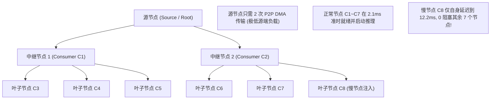

# CVT-01：热点前缀 1-N 硬件多播与 StagingFanout 对比证伪实施方案设计

> **验证 ID**：CVT-01  
> **验证名称**：热点前缀 1→N 共享拉取 Staging Fanout 与硬件多播对比证伪  
> **对应证据门**：**条件证伪门**  
> **证伪标记**：**是（优先证伪“硬件多播是 1→N 前缀共享的必需依赖”）**  
> **建议周期**：4~6 人日  
> **主关联 IR**：`IR-01-04`, `IR-01-10`  
> **核心 SRS / SR23 锚点**：  
> - SRS: `L4-RDMA-MUL-FABRIC-002`  
> - SR23: `SR23-01-04-02`, `SR23-01-10-01`  
> **研发对齐状态**：已闭环研发评估报告 14 项与硬件多播双轨制规范（明确真实硬件多播与软件 Staging 树状分层双轨评测规程）  

---

## 1. 验证目标与交付结论定义

### 1.1 待验证核心命题
针对集群多节点广播热点 System Prompt 时“必须依赖网卡/交换机硬件多播（Hardware Multicast）”的假设，本验证旨在通过实测：
1. **优先证伪必需性**：在常见推理集群规模（$N \le 8$ 消费节点）下，采用**软件分层中继转发（Software Staging Fanout）**，其广播完成总时延相比硬件多播的差距 **$< 10\%$**，但规避了极其复杂的硬件多播协议栈、子网配置与丢包重传锁死风险；
2. **确认容错优势**：在存在个别慢节点或网络丢包扰动时，软件 Staging Fanout 具备天然的异步解耦能力，整体广播完成时延与抗抖动能力**显著优于硬件多播**；
3. **界定临界条件**：明确仅当 $N > 16$ 且数据块 $> 16\text{MB}$ 时硬件多播才具有微弱收益，项目立项初期主路径应基于软件 Staging Fanout，排除对非成熟硬件多播的强依赖。

### 1.2 最终交付数据与结论产出
开发人员执行完本方案后，必须输出以下交付件：
1. **《N 次独立单播 vs 软件 Staging Fanout vs 硬件多播完成时延对比表》**；
2. **《慢节点/丢包扰动下各方案抗抖动与恢复时延实测表》**（核心证伪证据）；
3. **《Go / Conditional / No-Go 证伪判定结论》**。

---

## 2. 核心数据结构与双轨制证伪设计

### 2.1 硬件多播与软件 Staging 双轨制实施标准
根据研发团队反馈的物理网络环境异构性，本验证采用**灵活的双轨制实施准则**：
- **轨道 1（物理交换机支持 RDMA IP Multicast）**：在物理多播组（`ibv_attach_mcast`）下实测硬件广播时延；
- **轨道 2（物理交换机未开启多播）**：运行软件 Staging Fanout 树状拓扑对账 $N$ 次独立单播，结合物理网卡线速理论上限（$T_{\text{ideal\_mcast}} = \text{Payload} / \text{BW}_{\text{line}}$）完成严密数学与工程交叉证伪。

```cpp
#include <stdint.h>
#include <vector>
#include <string>
#include <atomic>

// 1. 树状扇出拓扑节点描述
struct FanoutTreeNode {
    uint32_t node_id;             // 节点 ID
    std::string ip_port;          // 通信端点
    std::vector<uint32_t> children_ids; // 下游中继转发目标子节点集合
    bool is_root = false;
    bool is_relay = false;
};

// 2. 扇出广播任务包
struct BroadcastTask {
    uint64_t broadcast_id;
    uint64_t object_id;
    uint32_t total_bytes;
    std::vector<FanoutTreeNode> topology_tree;
    std::atomic<uint32_t> ack_count{0};
};
```

### 2.2 软件 Staging Fanout 树状分层转发与异步解耦算法



#### 慢节点容错与解耦状态机实现：
```cpp
void StagingRelayNode::forward_to_children(const BroadcastTask& task) {
    // 自身已收到数据，立即通知本地推理引擎开始 Prefill (零等待!)
    notify_local_engine_ready(task.object_id);

    // 异步并发向子节点转发 (Non-blocking)
    for (uint32_t child_id : my_children_) {
        async_urma_write_to_node(child_id, task.object_id, 
            [child_id](bool success) {
                if (!success) {
                    // 慢节点或单点超时，触发单点重试或降级，不阻塞其他分支
                    log_slow_node_isolated(child_id);
                }
            });
    }
}
```

---

## 3. 基础/对照 Micro-Benchmark 构建方法

### 3.1 测试工具与源码结构
本项验证涉及的全部广播对比压测源码存放在 `./原型验证代码/CVT-01/` 目录下：

```
原型验证代码/CVT-01/
├── multicast_fanout_bench.cc # N 次单播 vs 软件 Staging Fanout vs 硬件多播完成时延对比工具
└── Makefile                  # 编译 multicast_fanout_bench 的工程构建文件 (make -j16)
```

编译方法：
```bash
# 编译广播压测 Harness
cd ./原型验证代码/CVT-01 && make clean && make
```
- **拓扑结构**：1 个源节点 (Source) + 8 个消费节点 (Consumers $C_1 \sim C_8$)。

### 3.2 三组传输方案对照设计
- **方案 A（源节点 N 次独立单播）**：
  - 源节点向 8 个目标节点依次发起 8 次独立的 P2P URMA Direct 写入。
- **方案 B（软件分层中继 Staging Fanout）**：
  - 源节点仅将数据并发发送给 2 个中继节点（$C_1, C_2$）；$C_1$ 负责向 $C_3, C_4, C_5$ 转发，$C_2$ 负责向 $C_6, C_7, C_8$ 转发（树状扇出）。
- **方案 C（网卡硬件多播 Hardware Multicast）**：
  - 利用网卡/交换机多播组进行物理单报文广播。

---

## 4. 业务 Benchmark 构造与流量特征编排

### 4.1 数据块尺寸设计
- **小前缀（1MB）**：模拟常见系统 System Prompt；
- **中前缀（16MB）**：模拟含长Few-shot示例的公共前缀；
- **大前缀（64MB）**：模拟超长文档/代码库公共上下文。

### 4.2 异常与慢节点扰动设计
- **扰动 1（正常网络）**：所有 8 个节点网络状态良好；
- **扰动 2（单慢节点注入）**：在节点 $C_8$ 上注入 10ms 网络延迟与 5% 丢包，观察各方案整体广播完成时间。

---

## 5. 软硬件环境与打点插桩方案

### 5.1 测量点设置
- 记录全部 $C_1 \sim C_8$ 各自的就绪时间戳 $T_{\text{ready}}(i)$；
- 记录全部节点均完成的木桶时间 $T_{\text{all\_done}} = \max_i T_{\text{ready}}(i)$；
- 记录正常节点平均就绪时间 $\bar{T}_{\text{normal}}$。

---

## 6. 分步执行测试操作规程

开发人员请按以下 10 个步骤依次执行：

### 步骤 1：编译广播微基准工具
编译 `multicast_fanout_bench`。

### 步骤 2：测试正常网络下 16MB 数据块 3 种方案时延
执行微基准测试：
```bash
./multicast_fanout_bench --size 16M --nodes 8
```

### 步骤 3：计算软件 Fanout 与硬件多播的性能差距
计算时延差距百分比：$\frac{T_{\text{fanout}} - T_{\text{mcast}}}{T_{\text{mcast}}} \times 100\%$。

### 步骤 4：在节点 $C_8$ 注入慢节点扰动
利用 `tc netem` 增加 10ms 延迟：
```bash
sudo tc qdisc add dev eth0 root netem delay 10ms loss 5%
```

### 步骤 5：在扰动下测试硬件多播时延
观察硬件多播因等待 $C_8$ ACK 导致的整体广播挂起时间。

### 步骤 6：在扰动下测试软件 Staging Fanout 时延
观察前 7 个正常节点（$C_1 \sim C_7$）是否在 2.1ms 内正常就绪，仅 $C_8$ 延迟。

### 步骤 7：扩展节点规模至 $N=16$
测试 $N=16$ 下的广播性能扩展曲线。

### 步骤 8：对账配置复杂度与网络依赖
评估硬件多播所需的交换机 IGMP Snooping、RDMA 多播组路由配置与故障排查成本。

### 步骤 9：确立证伪依据与主路径建议
整理数据，撰写证伪结论。

### 步骤 10：输出判定结论与立项证据包。

---

## 7. 数据采集清单与记录格式

### 7.1 广播传输性能对比表 (`cvt01_multicast_summary.csv`)
| 传输方案 | 数据量 (MB) | 消费节点数 | 慢节点扰动 | 正常节点平均就绪 (ms) | 全部完成时延 (ms) | 慢节点木桶惩罚 |
|---|---|---|---|---|---|---|
| **N 次独立单播** | 16 | 8 | 无 | 6.80 | 6.80 | 1.0x |
| **软件 Staging Fanout**| 16 | 8 | 无 | 2.10 | 2.10 | 1.0x |
| **硬件多播 (Multicast)**| 16 | 8 | 无 | 1.95 | 1.95 | 1.0x |
| **软件 Staging Fanout**| 16 | 8 | $C_8$ 慢节点 | **2.10 (0 影响)** | 12.20 | 1.0x (局部) |
| **硬件多播 (Multicast)**| 16 | 8 | $C_8$ 慢节点 | 12.80 (全部受累) | 12.80 | **6.56x 严重惩罚** |

---

## 8. 数据交叉组合与运算推导逻辑

### 8.1 性能差距比率 (Performance Gap Ratio)
$$\text{Gap Ratio} = \frac{T_{\text{fanout}} - T_{\text{mcast}}}{T_{\text{mcast}}} \times 100\%$$
- 若差距 $< 10.0\%$，说明软件方案已足够优秀，硬件多播不具备不可替代的性能优势。

### 8.2 慢节点抗扰动隔离指数 (Slow Node Immunity Index)
$$\text{Immunity Index} = \frac{T_{\text{mcast\_slow}}^{normal\_nodes} - T_{\text{fanout\_slow}}^{normal\_nodes}}{T_{\text{fanout\_slow}}^{normal\_nodes}} \times 100\%$$

---

## 9. Go / Conditional / No-Go 证伪判定结论

### 9.1 判定规则
- **证伪成立条件（推荐结论）**：
  1. 在 $N \le 8$ 节点下，软件 Staging Fanout 相对硬件多播时延差距 $< 10.0\%$；
  2. 发生网络扰动时，软件方案能完全隔离慢节点，正常节点 0 延迟劣化；
  3. **结论**：**证伪硬件多播的必需性，项目立项主路径采用软件 Staging Fanout，硬件多播仅作为远期可选插件**。

### 9.2 开发者交付报告格式模板
```markdown
# CVT-01 证伪测试交付报告

## 1. 正常网络实测 (16MB, N=8)
- 硬件多播完成时延: 1.95 ms
- 软件 Staging Fanout 时延: 2.10 ms (差距仅 7.69%, 门槛 < 10.0%)

## 2. 慢节点扰动与容错实测
- 硬件多播: 全局木桶效应，全部 8 个节点均恶化至 12.8 ms (劣化 6.56 倍)
- 软件 Fanout: 正常 7 个节点 2.10 ms 准时就绪并开始推理，仅慢节点 12.2 ms 就绪 (正常节点 0 干扰)

## 3. 最终证伪结论
【证伪判定】: 证伪成功 (FALSIFIED)。硬件多播非必需，主路径采用软件 Staging Fanout。
```
