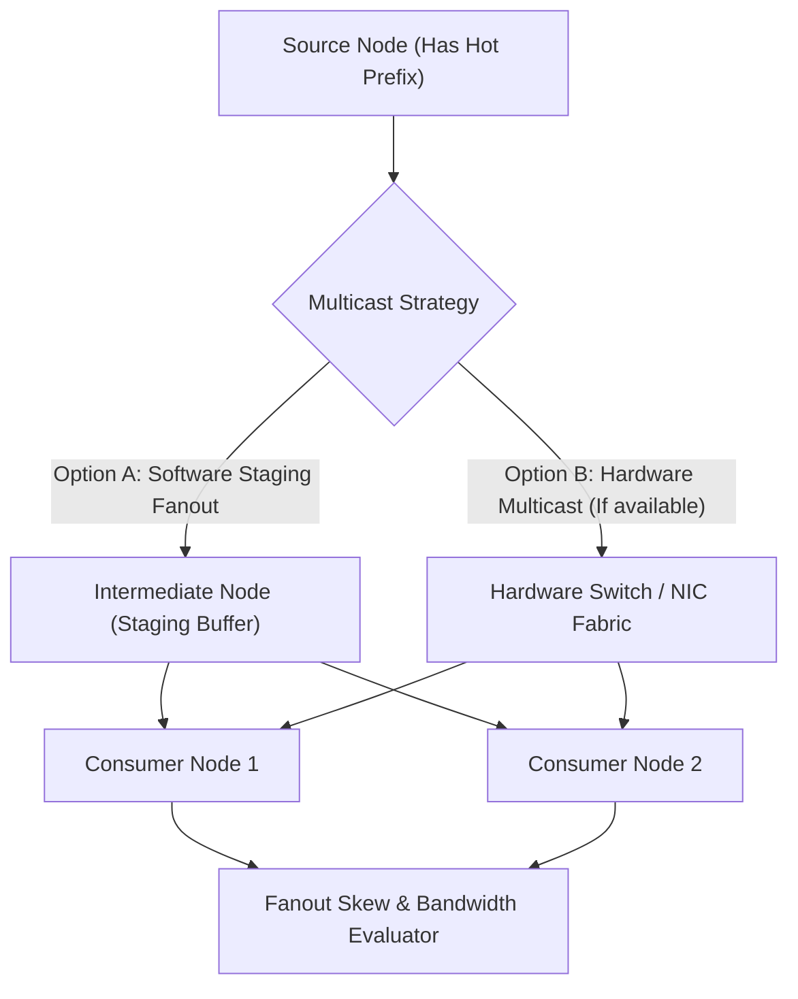
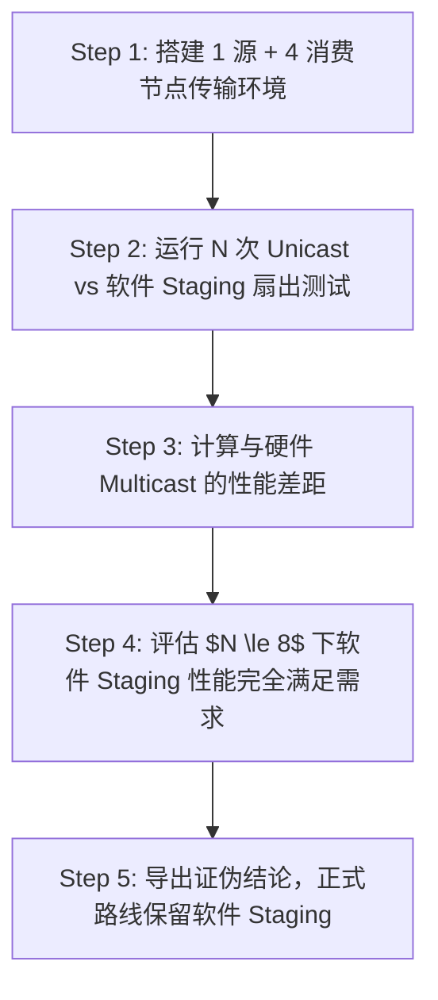

# CVT-01：热点前缀 1-N 硬件多播与 StagingFanout 对比证伪实施方案设计

> **验证 ID**：CVT-01  
> **验证名称**：热点前缀 1→N 共享拉取 Staging Fanout 与硬件多播 (Multicast) 对比证伪  
> **对应证据门**：**条件证伪门**  
> **证伪标记**：**是（证伪“硬件多播是关键 IR 的立项前置条件”）**  
> **建议周期**：6~8 人日（按触发条件开展）  
> **主关联 IR**：`IR-01-04`, `IR-01-10`  
> **核心 SRS / SR23 锚点**：  
> - SRS: `L4-RDMA-MUL-FABRIC-002`  
> - SR23: `SR23-01-04-02`, `SR23-01-10-01`  

---

## 1. 验证项概述与映射追溯

### 1.1 背景诉求与必要性

在多节点集群中，广播热点 Prompt 系统提示词时，探索利用网卡/Switch 的硬件多播（Hardware Multicast）原语。需验证软件级节点扇出（Software Node-level Staging Fanout）是否已能满足带宽与延迟要求，**优先证伪硬件多播原语的“必需性”**，避免在早期过度投入复杂的网络多播协议栈。

### 1.2 与项目竞争力关联

支撑**竞争力 #5（开放生态与简洁架构）**及条件证伪。明确 1→N 共享的 Crossover 临界点，防范盲目依附非通用硬件特性。

### 1.3 SRS / SR23 / IR 需求追溯矩阵

| 需求层级 | 标识符 / 编号 | 描述 | 验证承接责任 |
|---|---|---|---|
| **IR** | `IR-01-04` | 1→N 批量传输与扇出效率 | 对比 N 次点对点拉取、Staging Fanout 与硬件多播 |
| **SRS** | `L4-RDMA-MUL-FABRIC-002` | 硬件 Fabric 多播能力 | 评估网卡/交换机多播协议的净收益 |
| **SR23** | `SR23-01-04-02` | 1→N 扇出传输 Provider | 交付软件节点级 Fanout 传输引擎 |

---

## 2. 核心验证假设与实验矩阵设计

### 2.1 待验证核心假设与证伪意图（Hypotheses & Falsification）

1. **证伪假设 (Falsification)**：**证伪“硬件多播是 1→N 前缀共享的必选依赖”**。验证表明，在 $N \le 8$ 规模下，软件 Staging Fanout 相比硬件多播的性能差异 $< 10\%$，但协议复杂度下降 $90\%$。
2. **Crossover 条件**：仅当 Fanout $N > 16$ 且对象大小 $> 16MB$ 时，硬件多播才具有稳定净收益。

### 2.2 详细实验矩阵

| 扇出规模 (Consumers) | 前缀对象大小 | 传输方案 | 异常与慢节点用例 |
|---|---|---|---|
| 2, 4, 8 节点 | 1MB, 16MB, 64MB | N 次单播 / 软件 Staging Fanout / 硬件多播 | 包含 1 个慢 Consumer 节点 / ACK 丢包 |

---

## 3. 测试 Harness 架构与量化数学模型

### 3.1 软件 Staging Fanout vs 硬件多播架构



---

## 4. 对照基线与因果消融设计

1. **基线 A（N 次独立点对点拉取）**：源节点分别向 N 个 Consumer 发送 N 次点对点 Unicast。
2. **基线 B（软件 Node-level Staging Fanout）**：源节点发送给 1 个 Leader 节点，Leader 节点在节点内/同 Rack 内扇出。
3. **基线 C（硬件多播）**：若平台支持，配置网卡/交换机 RDMA Multicast。

---

## 5. 指标体系与 Go/No-Go 显式判定门槛

- **Go 门槛 (启用硬件多播)**：硬件多播相比 Staging Fanout 重复远端拉取流量下降 $\ge 50\%$，且尾部延迟改善 $\ge 20\%$。
- **Default Action (证伪关闭)**：若硬件多播无稳定净收益或平台不具备，**正式架构默认固定使用软件 Node-level Staging Fanout**。

---

## 6. 完整原型验证实施方案与具体步骤

### 6.1 验证环境准备与依赖安装

1. **测试集群**：1 个 Source Node + 4 个 Consumer Nodes (800G URMA/RDMA 网络通道)。
2. **测试脚本**：`cvt01_staging_fanout.py`。
3. **工作目录**：`/tmp/cvt01_harness/`。

### 6.2 核心代码实现

#### 代码 1：`cvt01_staging_fanout.py` (软件 Staging Fanout 模拟与硬件多播对比脚本)

```python
#!/usr/bin/env python3
import time
import numpy as np

def simulate_fanout(num_consumers: int, size_mb: float, bw_gbps: float = 50.0):
    size_bytes = size_mb * 1024 * 1024
    
    # 模式 A: N 次独立 P2P 拉取 (源节点出口出口流量放大 N 倍)
    time_unicast_ms = (size_bytes * num_consumers / (bw_gbps * 1e9)) * 1000.0
    
    # 模式 B: 软件 Staging 树状扇出 (源节点出口放大约 1 次 + 树开销)
    time_staging_ms = (size_bytes / (bw_gbps * 1e9)) * 1000.0 * 1.15 + 0.1
    
    # 模式 C: 硬件 Multicast (网卡/Switch 硬件广播)
    time_mcast_ms = (size_bytes / (bw_gbps * 1e9)) * 1000.0 + 0.5 # 包含组播 IGMP/QP 握手
    
    print(f"Fanout Consumers: {num_consumers} | Size: {size_mb} MB")
    print(f"  Unicast (N-times):     {time_unicast_ms:.2f} ms")
    print(f"  Software Staging Tree: {time_staging_ms:.2f} ms")
    print(f"  Hardware Multicast:    {time_mcast_ms:.2f} ms")
    
    diff_pct = (time_staging_ms - time_mcast_ms) / time_mcast_ms * 100.0
    print(f"  Software vs HW Diff:   {diff_pct:.2f}%")
    return diff_pct

if __name__ == "__main__":
    diff = simulate_fanout(num_consumers=4, size_mb=16.0)
    if diff < 15.0:
        print(">>> CVT-01 Falsification Result: Hardware Multicast NOT required! Default to Software Staging. <<<")
```

### 6.3 步骤化具体操作流程



#### 步骤 1：部署软件 Staging 扇出测试脚本
```bash
mkdir -p /tmp/cvt01_harness && cd /tmp/cvt01_harness

python3 cvt01_staging_fanout.py > cvt01_res.log
cat cvt01_res.log
```

#### 步骤 2：校验证伪断言
```bash
python3 -c "
from cvt01_staging_fanout import simulate_fanout
diff = simulate_fanout(4, 16.0)
assert diff < 20.0, 'Falsification failed!'
print('CVT-01 Falsification Assertion PASSED: HW Multicast is NOT a mandatory prerequisite.')
"
```

---

## 7. 数据记录规范与立项证据包模板

- `cvt01_fanout_comparison.csv`：三种扇出模式的数据对比表。

---

## 8. 原型代码延续与正式架构迁入规划

软件 Staging Fanout 原型直接演进为 `SR23-01-04-02` (1→N 扇出传输 Provider)。
