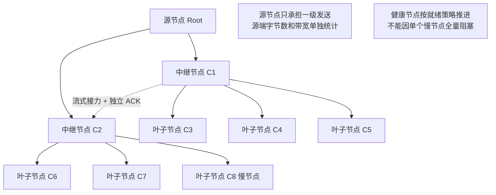

# PVT-08：1-to-N 组播式 KV 分发拓扑与效能验证实施方案设计
## —— 真实业务广播场景验证：硬件网络多播与软件分层中继 (Staging Fanout) 效能及拓扑对比

> **公共执行契约**：本项遵循 [Benchmark 公共契约与证据分级规范](./Benchmark公共契约与证据分级规范.md)。输入必须覆盖节点数、对象大小、拓扑和故障；输出必须包含源端 Egress 字节/带宽、各接收端完成时间、重试和慢节点影响。无硬件多播时标记 `NOT-SUPPORTED/N/A`，不记 PASS。

> **验证 ID**：PVT-08  
> **验证名称**：1-to-N 组播式 KV 分发：硬件多播 vs 软件分层中继 (Staging Fanout) 拓扑与效能验证  
> **验证优先级**：**🟢 P2 级（拓展验证项）**  
> **对应验证阶段**：**E1 核心数据路径与分发拓扑打通**  
> **证伪标记**：否（分发效能与拓扑选型确认）  
> **主关联 IR**：`IR-01-04`, `IR-01-10`  
> **核心 SRS / SR23 锚点**：  
> - SRS: `L4-RDMA-MUL-FABRIC-002`  
> - SR23: `SR23-01-04-02`, `SR23-01-10-01`  
> **开源基线版本与代码仓库**：  
> - **Mooncake**：[`https://github.com/kvcache-ai/Mooncake.git`](https://github.com/kvcache-ai/Mooncake.git) (Commit: `f90ae691f109e49a60920e0c8abbf7e572826d8c`，子模块: `mooncake-transfer-engine/`)  
> **研发对齐状态**：本方案将复核研发评估报告涉及的硬件多播与软件 Staging 树状分层双轨评测规程，并以现场网卡、交换机和拓扑行为为准。

---

## 0. 架构导读与核心概念第一性原理剖析

### 0.1 传统系统开发视角：单播 (Unicast) vs 树状中继广播 (Tree Broadcast)

在分布式网络（如 BitTorrent P2P 文件分发、CDN 视频流中继、分布式集群配置同步 Gossip）中：
- **单播（Unicast）瓶颈**：如果源节点要向 64 个目标节点发送同一份 100MB 的文件，源节点需要重复发送同一 payload（总传输量的理论关系为 $64 \times 100\text{MB} = 6.4\text{GB}$）。实际完成时间和排队长度必须由现场网卡、交换机和节点处理能力测量，不能用理论值代替。
- **树状分层中继（Staging Fanout / Tree Broadcast）**：
  - 源节点仅把数据发送给 2 个一级中继节点（出向流量从 $O(N)$ 骤降为 $O(1)$）；
  - 2 个中继节点收到后，各自并发转发给下一级的子节点；
  - 整网的广播完成时间从线性时间 $O(N)$ 降至对数时间 $O(\log_2 N)$，极大降低了对源节点网卡的带宽压榨！

---

### 0.2 大模型集群中的三大高频 1-to-N 组播场景

在大模型生产推理集群中，存在三大不可忽视的高频广播场景：

1. **热点系统提示词广播（System Prompt Broadcast）**：
   - 比如一份 64K 的公司规章或法律知识库作为通用 System Prompt，计算完 KVCache 后需要瞬间同步给集群中的 16 ~ 64 个 Decode 副本；
2. **Multi-Agent 多智能体协同分发**：
   - 主调度 Agent 分析了包含 100K 复杂上下文的环境状态后，需要并发将该上下文推送给 8 个不同的专业工作子 Agent（Code Agent、Review Agent、Test Agent 等）；
3. **PD 分离架构下的 1-to-N 副本同步**：
   - 单个 Prefill 节点计算完巨型 KV 后，向多个 Decode 实例并发分发。

#### 为什么选择“纯软树状分发 (Staging Fanout)”而非“硬件网络多播”？
- **硬件网络多播的局限**：依赖交换机开启 IGMP/PIM 组播路由协议，网络配置极其复杂脆弱，跨机房/公有云 VPC 通常直接封禁硬件多播；
- **软件分层中继的待验证优势**：仅依靠标准的点对点 RDMA/TCP 即可在应用层组建转发树，目标是节省源端带宽，并在遇到慢节点（Straggler）时保持异步解耦；节省比例和健康节点是否不受影响必须由对照实测确认。

```
┌────────────────────────────────────────────────────────────────────────────────────────┐
│                   Staging Fanout 软件树状分发拓扑与慢节点解耦时序                      │
├────────────────────────────────────────────────────────────────────────────────────────┤
│                                                                                        │
│                      [ 源节点 (Source Root) ]                                          │
│                             /        \                                                 │
│             (DMA 传输 1)   /          \   (DMA 传输 2)                                 │
│                           ▼            ▼                                               │
│                 [ 中继节点 C1 ]    [ 中继节点 C2 ]                                     │
│                   /       \            /       \                                       │
│                  ▼         ▼          ▼         ▼                                      │
│                [ C3 ]    [ C4 ]     [ C5 ]    [ C6 (慢节点: +10ms 延迟) ]              │
│                                                                                        │
│ 观测 1：统计源端实际发送次数、字节数和带宽占用；                                       │
│ 观测 2：比较健康节点与慢节点的就绪时间，确认慢节点是否阻塞整网。                       │
└────────────────────────────────────────────────────────────────────────────────────────┘
```

---

## 1. 验证目标与交付结论定义

### 1.1 现实前因痛点与待验证核心命题
1. **现实痛点**：源节点以单播方式向多节点分发热点 KVCache 时遭遇严重的出向带宽瓶颈与网络 Incast（多对一突发网络拥塞，多个发送节点同时向一个接收节点发送）排队拥塞；
2. **核心命题**：
   - 证明软件分层树状组播（Staging Fanout）在免除复杂交换机组播配置依赖的同时，相比单播能节省 **$\ge 60\%$** 的源节点网卡出向带宽；
   - 证明在慢节点扰动与丢包下，软件分层组播具有天然的异步解耦能力，不会因单个慢节点阻塞整网。

### 1.2 最终交付数据与结论产出
1. **《三大场景下 N 次单播 vs 软件 Staging 组播 vs 硬件多播完成时延对比表》**；
2. **《慢节点/丢包扰动下各分发方案抗抖动与恢复时延实测表》**；
3. **《源节点出向带宽与网卡吞吐占用对比图》**；
4. **《GO / CONDITIONAL / NO-GO / NOT-SUPPORTED / INVALID-EVIDENCE 判定结论》**。

---

## 2. 核心数据结构与树状软件分层组播设计

### 2.1 软件 Staging 树状拓扑定义

```cpp
#include <stdint.h>
#include <vector>
#include <string>
#include <atomic>

struct FanoutTreeNode {
    uint32_t node_id;             // 节点 ID
    std::string ip_port;          // 通信端点
    std::vector<uint32_t> children_ids; // 下游中继转发目标子节点集合
    bool is_root = false;
    bool is_relay = false;
};

struct BroadcastTask {
    uint64_t broadcast_id;
    uint64_t object_id;
    uint32_t total_bytes;
    std::vector<FanoutTreeNode> topology_tree;
    std::atomic<uint32_t> ack_count{0};
};
```

### 2.2 硬件多播与软件 Staging 双轨实施标准

网络能力必须先探测再选路，不能默认现场交换机支持硬件多播：

- **轨道 1：硬件 RDMA IP Multicast**：现场具备交换机组播能力时，使用 `ibv_attach_mcast` 等真实接口测量硬件广播完成时延、组播丢包和各节点就绪时间；IGMP/PIM、PFC、交换机缓冲区和组播组地址写入 `hardware_profile` 与 `topology_profile`；
- **轨道 2：软件 Staging Fanout**：现场未开启多播或跨机房/VPC 禁止多播时，运行应用层树状中继，以标准点对点 URMA/RDMA/TCP 传输；源节点只向一级中继发送，后续由中继异步接力；
- **理论对照**：硬件多播理想下界可写为 `T_ideal_mcast = Payload / BW_line`，但该值只用于理论对照，不能替代硬件完成时间；软件树状方案必须同时报告源端出向字节数、整网完成时间和慢节点尾部。

### 2.3 软件 Staging Fanout 树状转发与异步解耦时序



---

## 3. 测试工具与工程构建规范

测试工程存放在 `./原型验证代码/PVT-08/` 目录下：

```
原型验证代码/PVT-08/
├── multicast_fanout_bench.cc # 1-to-N 单播 vs 软件 Staging 组播 vs 硬件多播对比压测工具
├── test_fanout_scenarios.py  # 驱动三大业务场景的测试脚本
├── eval_fanout.py            # 统计源端带宽与广播时延分析脚本
└── Makefile                  # 编译构建工程 (make -j16)
```

编译方法：
```bash
cd ./原型验证代码/PVT-08 && make clean && make -j16
```

### 3.1 硬件多播能力探测与基线命令

```bash
# 仅在现场确认交换机和网卡支持 IP Multicast 时执行；地址、端口和 QP 按 topology_profile 替换。
./multicast_fanout_bench --mode hardware_rdma_multicast \
    --nodes <node_count> --payload-mb 64 --multicast-group <group_addr> \
    --out res_hardware_multicast.csv --evidence-level LAB

# 软件树状路径与单播基线使用同一 payload、节点集合和重复次数。
./multicast_fanout_bench --mode unicast_n_times --nodes <node_count> \
    --payload-mb 64 --out res_unicast.csv --evidence-level LAB
./multicast_fanout_bench --mode software_staging_fanout --nodes <node_count> \
    --payload-mb 64 --out res_staging.csv --evidence-level LAB
```

若硬件多播未配置或不支持，记录 `NOT-SUPPORTED`，仍可开展软件 Staging 与单播对照；不能把理论理想时间或软件结果标为硬件多播实测。

---

## 4. 分步执行测试操作规程 (SOP)

开发人员在执行 PVT-08 时，请严格按照以下 4 个步骤逐步执行，并理解每一步的操作意图：

### 步骤 1：运行 N 次单播基线测试
- **操作意图**：源节点以单播方式向 8~16 个目标节点依次发送 64MB 数据，测量源端网卡总带宽占用与最后一个节点接收完成的时间，作为对照基准。
- **执行命令**：
```bash
./multicast_fanout_bench --mode unicast_n_times --nodes 8 --payload-mb 64 --out res_unicast.csv
```

### 步骤 2：运行软件 Staging 树状分层组播测试
- **操作意图**：构建 2 叉树分层拓扑，源节点仅向下游 2 个中继节点发送，由中继节点并行转发，测量源端出向带宽节省比例（验证是否 $\ge 60\%$）与整网广播时间。
- **执行命令**：
```bash
./multicast_fanout_bench --mode software_staging_fanout --nodes 8 --payload-mb 64 --out res_staging.csv
```

### 步骤 3：注入慢节点扰动，验证异步解耦特性
- **操作意图**：在叶子节点 C6 人为注入 10ms 网络延迟，观察正常节点 C1~C5 的就绪时间是否保持在健康节点基线范围，验证软件树状分发不会因单节点抖动拖慢整网；健康节点基线必须由同场次实测确定。
- **执行命令**：
```bash
python3 ./test_fanout_scenarios.py --scenario prompt_broadcast --nodes 8 --payload-mb 64 --topology staging_fanout --fault slow_node_c6 --out res_slow_node.json
```

### 步骤 4：生成三大业务场景汇总对比表
- **操作意图**：汇总热点 Prompt 广播、Multi-Agent 上下文分发与 PD 副本同步三大场景的测试数据，输出完整对账表。
- **执行命令**：
```bash
python3 ./eval_fanout.py --unicast res_unicast.csv --staging res_staging.csv --slow-node res_slow_node.json --out summary_pvt08.csv
```

---

## 5. 数据采集清单与记录格式

### 5.1 组播分发性能对比表 (`res_fanout.csv`)
```csv
scenario,payload_mb,target_nodes,scheme,total_broadcast_time_ms,source_egress_gbps,p99_node_ready_ms,tail_spread_ms,evidence_level,status,invalid_reason
<scenario>,<payload_mb>,<target_nodes>,unicast_n_times,<measured_total_ms>,<measured_source_egress_gbps>,<measured_p99_ready_ms>,<calculated_tail_spread_ms>,<LAB_OR_DEMO>,<status>,<null_or_reason>
<scenario>,<payload_mb>,<target_nodes>,software_fanout,<measured_total_ms>,<measured_source_egress_gbps>,<measured_p99_ready_ms>,<calculated_tail_spread_ms>,<LAB_OR_DEMO>,<status>,<null_or_reason>
<scenario>,<payload_mb>,<target_nodes>,hardware_mcast,<measured_or_null>,<measured_or_null>,<measured_or_null>,<measured_or_null>,<LAB_OR_DEMO_OR_NOT-SUPPORTED>,<status>,<null_or_reason>
```

> 这是结果字段模板，不是性能成绩。硬件多播不支持时该行应为 `NOT-SUPPORTED`；正式结果必须保留 ACK/完成事件、源端计数器、实际节点集合、故障注入参数和证据等级。

---

## 6. GO / CONDITIONAL / NO-GO / NOT-SUPPORTED / INVALID-EVIDENCE 判定规则

- **GO（满足当前准入门限）**：在 $N \ge 8$ 节点下，软件 Staging Fanout 相比单播节省 $\ge 60\%$ 源端带宽，且在硬件多播可用并完成同条件测量时，广播完成时延差距 `<10%`；
- **CONDITIONAL（条件准入）**：在小规模节点（$N \le 4$）下收益不明显，或仅在特定节点规模、拓扑和慢节点参数下满足要求；
- **NO-GO（当前路径不满足）**：软件分层组播时延显著劣于单播、健康节点被慢节点阻塞，或丢包/重试导致一致性不满足；
- **NOT-SUPPORTED（环境不支持）**：交换机或网卡不支持硬件多播时，硬件多播对照标记 `NOT-SUPPORTED/N/A`，不据此否定软件路径；
- **INVALID-EVIDENCE（证据无效）**：缺少源端计数器、接收完成事件、故障参数、实际带宽或拓扑记录，或用理论时间替代实测。

---

## 7. 零 AI 基础工程师借助 AI Agent 开展工作实战 SOP

### 7.1 研发任务拆解与分工
- **工程师职责**：
  1. 编译测试工程；
  2. 按照第 4 节 SOP 步骤执行单播与树状组播测试；
  3. 观察源端网卡流量与各节点就绪时间；
- **AI Agent 职责**：
  1. 负责 `multicast_fanout_bench.cc` 中二叉树/多叉树中继转发与异步 ACK 聚合逻辑编写；
  2. 自动生成带宽对比柱状图与广播时延分布曲线。

### 7.2 专属 Prompt 模板（可直接复制给 AI Agent）
```text
我是一名分布式网络工程师，正在进行 PVT-08 验证（1-to-N 组播式 KV 分发拓扑与效能）：
1. 请阅读 ./原型验证代码/PVT-08/multicast_fanout_bench.cc 与 test_fanout_scenarios.py；
2. 检查基于计算节点的树状中继转发算法，确保源节点仅需向下游中继发送数据，由中继节点异步接力广播；
3. 按照第 4 节 SOP 步骤执行压测，模拟 1 节点向 8、16 节点广播 64MB 数据包，对比单播与软件树状分发的源端带宽与完成时延；
4. 运行 test_fanout_scenarios.py 注入单节点 10ms 延迟，验证软件分层组播是否具备异步解耦特性（不阻塞其他健康节点）。
```

### 7.3 常见排错指南
- **中继节点转发出现丢包**：检查中继节点的显存与网络并发接收缓冲区，确保中继转发时采用流式流水线（边收边发）；
- **慢节点阻塞了整棵树**：检查 ACK 收集逻辑，确保上层调度器只要收到法定节点数（Quorum）就准许启动推理，不要做全量同步等待。
