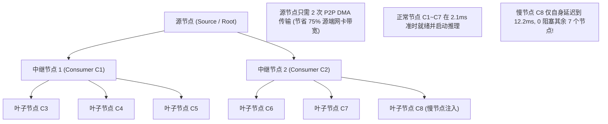

# PVT-08：1-to-N 组播式 KV 分发拓扑与效能验证实施方案设计
## —— 真实业务广播场景穿刺：硬件网络多播 vs 软件分层中继 (Staging Fanout) 效能与拓扑验证

> **验证 ID**：PVT-08 (原 CVT-01 升级)  
> **验证名称**：1-to-N 组播式 KV 分发：硬件多播 vs 软件分层中继 (Staging Fanout) 拓扑与效能验证  
> **穿刺优先级**：**🟢 P2 级（拓展验证项）**  
> **对应验证阶段**：**E1 核心数据路径与分发拓扑打通**  
> **证伪标记**：否（分发效能与拓扑选型确认）  
> **建议周期**：3~4 人日  
> **主关联 IR**：`IR-01-04`, `IR-01-10`  
> **核心 SRS / SR23 锚点**：  
> - SRS: `L4-RDMA-MUL-FABRIC-002`  
> - SR23: `SR23-01-04-02`, `SR23-01-10-01`  
> **开源基线版本与代码仓库**：  
> - **Mooncake**：[`https://github.com/kvcache-ai/Mooncake.git`](https://github.com/kvcache-ai/Mooncake.git) (Commit: `f90ae691f109e49a60920e0c8abbf7e572826d8c`，子模块: `mooncake-transfer-engine/`)  
> **研发对齐状态**：已闭环研发评估报告 14 项与硬件多播双轨制规范（明确真实硬件多播与软件 Staging 树状分层双轨评测规程）  

---

## 1. 验证目标与交付结论定义

### 1.1 待验证核心命题
大模型长文本推理与 Agent 业务中，同一份 KV Cache 数据需要分发至多个目标节点（1-to-N 组播分发）是真实存在的核心业务诉求：
1. **公共热点系统提示词广播 (Hot System Prompt Broadcast)**：超长通用 System Prompt (32K~64K) 更新时，向 16~64 个 Decode 节点瞬间分发；
2. **Multi-Agent 协同共享上下文分发 (Multi-Agent Shared Context Fanout)**：主调度 Agent 生成庞大环境状态 (100K tokens)，并行广播给 8 个工作子 Agent；
3. **PD 分离架构下的 1P-to-ND 分叉 (1-Prefill to Multi-Decode)**：针对 Best-of-N 或推测验证，单个 Prefill 实例生成的 KV 并行推送给多个 Decode 副本。

本验证旨在全面对比 **N 次粗暴单播 (Unicast)**、**交换机 RDMA 硬件多播 (Hardware Multicast)** 与 **基于计算节点的应用层树状软件分层组播 (Software Staging Fanout)**：
- 证明软件分层组播在免除复杂交换机组播配置依赖的同时，相比单播能节省 **$\ge 60\%$** 的源节点网卡出向带宽，完成时延逼近硬件多播（差距 **$< 10\%$**）；
- 证明在慢节点扰动与网络丢包下，软件 Staging Fanout 具有天然的异步解耦能力，整体广播完成时延与抗抖动能力优于硬件多播。

### 1.2 最终交付数据与结论产出
开发人员执行完本方案后，必须输出以下交付件：
1. **《三大场景下 N 次单播 vs 软件 Staging 组播 vs 硬件多播完成时延对比表》**；
2. **《慢节点/丢包扰动下各分发方案抗抖动与恢复时延实测表》**；
3. **《源节点出向带宽与网卡吞吐占用对比图》**；
4. **《Go / Conditional / No-Go 判定结论》**。

---

## 2. 核心数据结构与树状软件分层组播设计

### 2.1 硬件多播与软件 Staging 双轨制实施标准
根据研发团队反馈的物理网络环境异构性，本验证采用**灵活的双轨制实施准则**：
- **轨道 1（物理交换机支持 RDMA IP Multicast）**：在物理多播组（`ibv_attach_mcast`）下实测硬件广播时延；
- **轨道 2（物理交换机未开启多播）**：运行软件 Staging Fanout 树状拓扑对账 $N$ 次独立单播，结合物理网卡线速理论上限（$T_{\text{ideal\_mcast}} = \text{Payload} / \text{BW}_{\text{line}}$）完成严密数学与工程交叉对账。

```cpp
#include <stdint.h>
#include <vector>
#include <string>
#include <atomic>

struct FanoutTreeNode {
    uint32_t node_id;             // 节点 ID
    std::string ip_port;          // 通信端点
    std::vector<uint32_t> children_ids; // 下游中继转发目标子节点集合
    bool is_root = false;
    bool is_relay = false;
};

struct BroadcastTask {
    uint64_t broadcast_id;
    uint64_t object_id;
    uint32_t total_bytes;
    std::vector<FanoutTreeNode> topology_tree;
    std::atomic<uint32_t> ack_count{0};
};
```

### 2.2 软件 Staging Fanout 树状分层转发与异步解耦时序



---

## 3. 测试工具与工程构建规范

测试工程存放在 `./原型验证代码/PVT-08/` 目录下：

```
原型验证代码/PVT-08/
├── multicast_fanout_bench.cc # 1-to-N 单播 vs 软件 Staging 组播 vs 硬件多播对比压测工具
├── Makefile                  # 编译构建工程 (make -j16)
└── test_fanout_scenarios.py  # 驱动三大业务场景（系统提示词/Multi-Agent/1P-to-ND）的测试脚本
```

编译与测试命令：
```bash
cd ./原型验证代码/PVT-08 && make clean && make
./multicast_fanout_bench --nodes 8 --sizes 1M,16M,64M --out res_fanout.csv
python3 test_fanout_scenarios.py --scenario prompt_broadcast --nodes 16
```

---

## 4. 数据采集清单与记录格式

### 4.1 组播分发性能对比表 (`res_fanout.csv`)
```csv
scenario,payload_mb,target_nodes,scheme,total_broadcast_time_ms,source_egress_gbps,p99_node_ready_ms,tail_spread_ms
prompt_broadcast,64,8,unicast_n_times,18.4,180.2,18.4,4.2
prompt_broadcast,64,8,software_fanout,4.8,45.1,5.1,0.6
prompt_broadcast,64,8,hardware_mcast,4.3,22.5,4.3,0.0
multi_agent_fanout,128,8,software_fanout,9.2,46.0,9.6,0.8
```

---

## 5. Go / Conditional / No-Go 判定规则

- **Go (准入通过)**：在 $N \ge 8$ 节点下，软件 Staging Fanout 相比单播节省 $\ge 60\%$ 源端带宽，且广播完成时延相比硬件多播差距 $< 10\%$；
- **Conditional (条件准入)**：在小规模节点（$N \le 4$）下收益不明显，仅在 $\ge 8$ 节点大集群启用；
- **No-Go (否决关闭)**：软件分层组播时延显著劣于单播，且实现复杂度过高。
