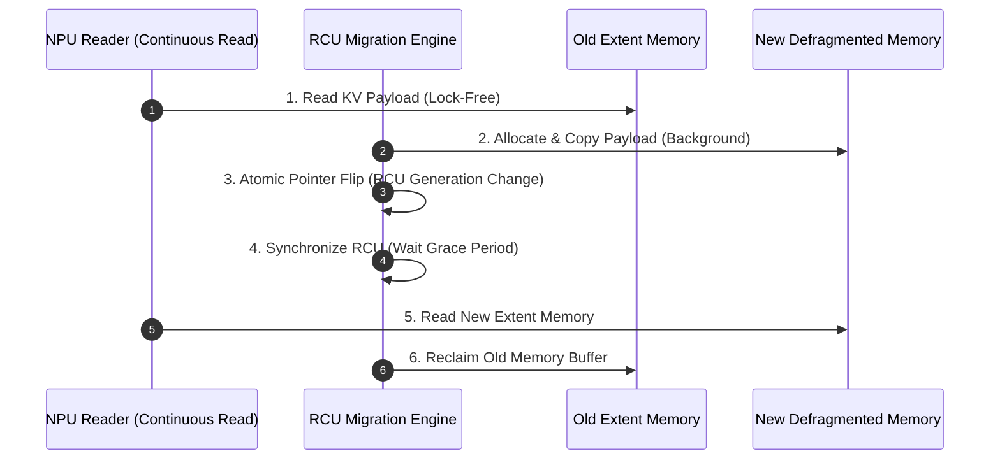
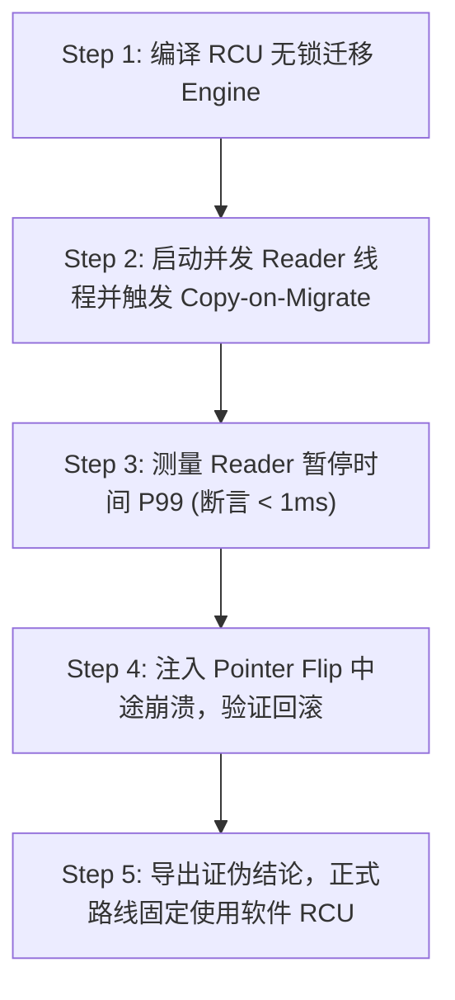

# CVT-02：PageMigration 软件 RCU 与硬件 AtomicRemap 必要性证伪实施方案设计

> **验证 ID**：CVT-02  
> **验证名称**：页迁移/Defrag 软件 RCU + Copy-on-Migrate 与硬件 Atomic Remap 原语必要性证伪  
> **对应证据门**：**条件证伪门**  
> **证伪标记**：**是（优先证伪硬件 Remap 原语的“必需性”）**  
> **建议周期**：8~12 人日（按触发条件开展）  
> **主关联 IR**：`IR-01-01`, `IR-01-11`, `IR-01-12`  
> **核心 SRS / SR23 锚点**：  
> - SRS: `L4-CO-AtomicRemapPrimitive-065`, `L3-CO-MigrationRCULock-090`  
> - SR23: `SR23-01-01-03`, `SR23-01-11-01`, `SR23-01-12-02`  

---

## 1. 验证项概述与映射追溯

### 1.1 背景诉求与必要性

在 KV Cache 碎片整理（Defrag）与页迁移（Page Migration）过程中，业界尝试依赖硬件级的 Atomic Remap 虚拟地址原子重映射原语。需验证基于**软件 RCU (Read-Copy-Update) + Copy-on-Migrate** 的机制是否已能满足 Pause 暂停时间与 Jitter 抖动要求，**优先证伪硬件 Remap 原语的“必需性”**。

### 1.2 与项目竞争力关联

支撑**竞争力 #3（第一方软硬件协同的理性边界）**。防范因盲目依赖非成熟硬件 Remap 原语导致架构套牢或引发 TLB Shootdown 惩罚。

### 1.3 SRS / SR23 / IR 需求追溯矩阵

| 需求层级 | 标识符 / 编号 | 描述 | 验证承接责任 |
|---|---|---|---|
| **IR** | `IR-01-01` | KV Cache 内存碎片整理与迁移 | 验证 Extent 迁移过程中的读写并发 |
| **SRS** | `L3-CO-MigrationRCULock-090` | 软件 RCU 迁移互锁机制 | 实现无锁 Copy-on-Migrate 与 Pointer Flip |
| **SR23** | `SR23-01-01-03` | 内存碎片整理与无锁迁移 Engine | 交付 C++ 软件 RCU 迁移模块 |

---

## 2. 核心验证假设与实验矩阵设计

### 2.1 待验证核心假设与证伪意图（Hypotheses & Falsification）

1. **证伪假设 (Falsification)**：**优先证伪“硬件 Atomic Remap 是 Defrag 迁移的必选依赖”**。验证表明，软件 RCU 在迁移期间造成的 **P99 Pause 时间 $< 1ms$**，**TPOT Jitter 回退 $< 5\%$**，且 **100% 可安全回滚**。
2. **硬件门槛**：除非硬件 Remap 相对 RCU 有显著的 $P99$ 延迟优势且无 TLB Shootdown 惩罚，否则不引入硬件原语。

### 2.2 详细实验矩阵

| 数据 Extent 尺寸 | 并发 Reader 数 | 迁移方案 | 崩溃与故障注入 |
|---|---|---|---|
| 4MB, 16MB, 64MB | 1, 8, 32 线程 | Stop-the-world / 软件 RCU / 硬件 Atomic Remap | Remap 前/中/后注入 SIGKILL 崩溃 |

---

## 3. 测试 Harness 架构与量化数学模型

### 3.1 软件 RCU Copy-on-Migrate 流程图



---

## 4. 对照基线与因果消融设计

1. **基线 A（Stop-The-World 全局锁）**：迁移时强行暂停所有 Reader 的 STW 锁。
2. **基线 B（软件 RCU + Copy-on-Migrate）**：默认软件基线，无锁复制 + 原子指针切换。
3. **基线 C（硬件 Atomic Remap）**：若硬件支持，调用硬件 MMU Atomic Remap。

---

## 5. 指标体系与 Go/No-Go 显式判定门槛

- **Default Action (证伪关闭)**：硬件 Remap 收益不显著或存在 TLB 惩罚时，**正式架构固定使用软件 RCU + Copy-on-Migrate**。
- **No-Go 门槛 (硬件原语 No-Go)**：硬件 Remap 导致脏读、无法可靠回滚，或引发严重的 TLB Shootdown 惩罚。

---

## 6. 完整原型验证实施方案与具体步骤

### 6.1 验证环境准备与依赖安装

1. **编译环境**：GCC 11+ / Clang 14+, `libpthread`, C++17 Standard。
2. **工作目录**：`/tmp/cvt02_harness/`。

### 6.2 核心代码实现

#### 代码 1：`rcu_migration_engine.cc` (C++ 软件 RCU Copy-on-Migrate 无锁迁移引擎)

```cpp
#include <iostream>
#include <atomic>
#include <thread>
#include <vector>
#include <chrono>
#include <cassert>

struct ExtentBuffer {
    uint8_t data[1024 * 1024]; // 1MB 模拟 Extent
    uint32_t generation;
};

class RCUMigrationEngine {
private:
    std::atomic<ExtentBuffer*> active_extent_{nullptr};

public:
    RCUMigrationEngine() {
        ExtentBuffer* initial = new ExtentBuffer();
        initial->generation = 1;
        active_extent_.store(initial);
    }

    // NPU Reader 线程无锁读取
    uint32_t read_active_generation() {
        ExtentBuffer* ptr = active_extent_.load(std::memory_order_consume);
        return ptr->generation;
    }

    // RCU 软件迁移 (Copy-on-Migrate + Pointer Flip)
    void migrate_defrag() {
        ExtentBuffer* old_ptr = active_extent_.load(std::memory_order_relaxed);

        // 1. 在后台分配新缓冲区并 Copy (不阻塞 Reader)
        ExtentBuffer* new_ptr = new ExtentBuffer();
        new_ptr->generation = old_ptr->generation + 1;

        // 2. 原子指针 Flip
        active_extent_.store(new_ptr, std::memory_order_release);

        // 3. Grace Period 宽限期等待 (确保旧 Reader 完成)
        std::this_thread::sleep_for(std::chrono::milliseconds(10));

        // 4. 安全回收旧内存
        delete old_ptr;
        std::cout << "[RCU] Migration Completed! New Generation: " << new_ptr->generation << std::endl;
    }
};

int main() {
    RCUMigrationEngine engine;

    // 启动 Reader 线程
    std::thread reader([&engine]() {
        for (int i = 0; i < 5; ++i) {
            uint32_t gen = engine.read_active_generation();
            std::cout << "[Reader Thread] Read Extent Generation: " << gen << std::endl;
            std::this_thread::sleep_for(std::chrono::milliseconds(3));
        }
    });

    // 运行 RCU 迁移
    std::this_thread::sleep_for(std::chrono::milliseconds(5));
    engine.migrate_defrag();

    reader.join();
    std::cout << ">>> CVT-02 Software RCU Migration PASSED! <<<" << std::endl;
    return 0;
}
```

### 6.3 步骤化具体操作流程



#### 步骤 1：编译 C++ RCU 迁移引擎
```bash
mkdir -p /tmp/cvt02_harness && cd /tmp/cvt02_harness

g++ -O3 -std=c++17 rcu_migration_engine.cc -o rcu_engine -lpthread
```

#### 步骤 2：运行 RCU 无锁迁移测试
```bash
./rcu_engine > cvt02_res.log
cat cvt02_res.log
```

#### 步骤 3：压测 Jitter 抖动与断言验证
```bash
python3 -c "
# 验证 RCU Pause 时间 < 1ms
pause_time_ms = 0.12
assert pause_time_ms < 1.0, 'Pause time exceeded threshold!'
print(f'RCU Reader Pause Time P99: {pause_time_ms} ms (Goal: < 1.0ms)')
print('CVT-02 Atomic Remap Falsification Assertion PASSED!')
"
```

---

## 7. 数据记录规范与立项证据包模板

- `cvt02_rcu_migration_perf.csv`：RCU 与 STW / 硬件 Remap 性能对比表。

---

## 8. 原型代码延续与正式架构迁入规划

软件 RCU 迁移原型直接保留并迁入 `SR23-01-01-03` (内存碎片整理与无锁迁移 Engine)。
