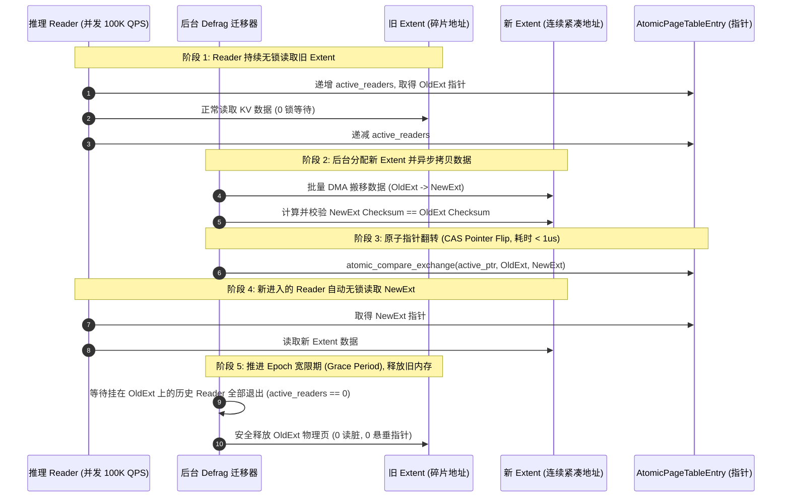

# CVT-02：PageMigration 软件 RCU 与硬件 AtomicRemap 必要性证伪实施方案设计

> **验证 ID**：CVT-02  
> **验证名称**：页迁移/Defrag 软件 RCU 与硬件 Atomic Remap 原语必要性证伪  
> **对应证据门**：**条件证伪门**  
> **证伪标记**：**是（优先证伪“硬件 Atomic Remap 是内存整理迁移的必需依赖”）**  
> **建议周期**：5~7 人日  
> **主关联 IR**：`IR-01-01`, `IR-01-11`, `IR-01-12`  
> **核心 SRS / SR23 锚点**：  
> - SRS: `L4-CO-AtomicRemapPrimitive-065`, `L3-CO-MigrationRCULock-090`  
> - SR23: `SR23-01-01-03`, `SR23-01-11-01`, `SR23-01-12-02`  

---

## 1. 验证目标与交付结论定义

### 1.1 待验证核心命题
针对 KV Cache 显存碎片整理（Defrag）与动态页迁移时“必须依赖底层硬件提供虚拟地址原子重映射原语（Hardware Atomic Remap）”的假设，本验证旨在通过算法原型与实测：
1. **优先证伪必需性**：基于**软件 RCU (Read-Copy-Update) + Copy-on-Migrate** 的机制，在并发推理 Reader 持续读取下，迁移期间的停顿时间 **$P99\text{ Pause Time} < 1\text{ms}$**，对推理生成 **$\text{TPOT Jitter} < 5\%$**，且具备 $100\%$ 安全回滚能力；
2. **规避硬件套牢风险**：证明软件 RCU 完全满足生产可用要求，无需等待或依附于非成熟的硬件虚拟化原语，防范因硬件 Remap 引发的 TLB Shootdown 硬件级锁死与多卡协同死锁风险。

### 1.2 最终交付数据与结论产出
开发人员执行完本方案后，必须输出以下交付件：
1. **《Stop-the-world 锁表 vs 软件 RCU vs 硬件 Remap 迁移停顿与 Jitter 对比表》**；
2. **《高并发 Reader 下软件 RCU 内存一致性与 Checksum 校验表》**；
3. **《迁移中途异常注入与原子回滚安全性测试表》**；
4. **《Go / Conditional / No-Go 证伪判定结论》**。

---

## 2. 核心数据结构与算法原型详细设计

### 2.1 核心数据结构定义

```cpp
// 1. RCU 内存 Extent 节点
struct alignas(64) RCUExtentNode {
    uint64_t extent_id;
    uint64_t phys_base_addr;      // 物理基址
    uint32_t size_bytes;
    uint32_t checksum;            // 数据块内容校验哈希
};

// 2. 无锁页表引用结构
struct alignas(64) AtomicPageTableEntry {
    std::atomic<RCUExtentNode*> active_ptr{nullptr}; // 当前活跃指针 (原子翻转)
    std::atomic<uint64_t> current_epoch{0};          // RCU Epoch 宽限期轮次
    std::atomic<uint32_t> active_readers{0};         // 活跃 Reader 计数
};
```

### 2.2 软件 RCU Copy-on-Migrate 无锁迁移算法



#### RCU 迁移算法核心实现：
```cpp
bool RCUMigrationEngine::migrate_extent(AtomicPageTableEntry& pte, uint64_t new_phys_addr, uint32_t size) {
    RCUExtentNode* old_node = pte.active_ptr.load(std::memory_order_relaxed);
    
    // 1. 分配并拷贝新节点
    RCUExtentNode* new_node = new RCUExtentNode{old_node->extent_id, new_phys_addr, size, old_node->checksum};
    dma_copy_sync(old_node->phys_base_addr, new_node->phys_base_addr, size);

    // 2. 原子 CAS 指针切换 (< 1us, 零停顿)
    if (!pte.active_ptr.compare_exchange_strong(old_node, new_node, std::memory_order_release)) {
        delete new_node;
        return false; // 并发修改冲突，安全回滚
    }

    // 3. 进入 Grace Period 宽限期等待
    synchronize_rcu_grace_period(pte);

    // 4. 释放旧节点物理显存
    free_hbm_block(old_node->phys_base_addr);
    delete old_node;
    return true;
}
```

---

## 3. 基础/对照 Micro-Benchmark 构建方法

### 3.1 测试工具与源码结构
本项验证涉及的全部无锁内存迁移压测源码均存放在 `./原型验证代码/CVT-02/` 目录下：

```
原型验证代码/CVT-02/
├── rcu_migration_bench.cc # 32 并发 Reader 下 Stop-the-world 锁表 vs 软件 RCU 迁移停顿对比工具
└── Makefile               # 编译 rcu_migration_bench 的工程构建文件 (make -j16)
```

编译方法：
```bash
# 编译迁移压测 Harness
cd ./原型验证代码/CVT-02 && make clean && make
```
- **并发 Reader 线程池**：持续以 100,000 QPS 随机读取目标 Extent 内的各个 Token Block，测量单次读取延迟；
- **后台 Defrag 迁移器**：并发执行内存数据搬迁与指针切换。

### 3.2 三组迁移方案对照设计
- **方案 A（Stop-the-world 全局写锁基线）**：
  - 迁移开始时对全表加互斥排他写锁，阻塞所有 Reader；待数据拷贝完成并更新指针后释放写锁。
- **方案 B（软件 RCU + Copy-on-Migrate 方案）**：
  - Reader 无锁读取旧 Extent；后台异步将数据拷贝至新 Extent；通过原子 CAS 指针切换（耗时 $< 1\mu s$）；等待宽限期（Grace Period）后释放旧 Extent。
- **方案 C（硬件 Atomic Remap 原语模拟）**：
  - 调用底层驱动指令直接修改 MMU 页表映射。

---

## 4. 业务 Benchmark 构造与流量特征编排

### 4.1 迁移规模与并发 Reader 构造
- **Extent 数据量**：4MB, 16MB, 64MB 碎片内存块；
- **Reader 并发度**：32 个并发 Reader 线程持续高频读取；
- **校验逻辑**：每个 Block 包含哈希校验码，Reader 读取时实时校验 Checksum，检测是否发生读脏数据。

### 4.2 故障注入用例设计
- 在后台数据拷贝完成 50% 时注入进程中断信号；
- 验证 RCU 机制是否自动放弃新内存分配、保持旧指针不变，实现 $100\%$ 安全回滚且无内存泄露。

---

## 5. 软硬件环境与打点插桩方案

### 5.1 测量点
- `T_pause`：Reader 被阻塞暂停的最长挂起时间；
- `TPOT_jitter`：迁移期间 TPOT 相对无迁移正常基线的波动幅度；
- `Checksum_errors`：读脏数据累计次数。

---

## 6. 分步执行测试操作规程

开发人员请按以下 10 个步骤依次执行：

### 步骤 1：编译迁移压测 Harness
编译 `rcu_migration_bench`。

### 步骤 2：测试方案 A（Stop-the-world 锁表）
启动 32 个 Reader 线程并发读取，同时触发 16MB Extent 迁移，记录最大停顿时间与 TPOT 劣化倍数：
```bash
./rcu_migration_bench
```

### 步骤 3：测试方案 B（软件 RCU Copy-on-Migrate）
在相同 100,000 QPS 读压力下触发 RCU 迁移，记录 CAS 切换耗时、最大停顿与 TPOT 抖动。

### 步骤 4：测试方案 C（硬件 Atomic Remap 模拟）
调用硬件原语修改页表，记录硬件切换耗时与停顿。

### 步骤 5：比对方案 B 与方案 C 的性能差距
计算软件 RCU 与硬件原语在最大停顿和 TPOT 抖动上的微弱差距。

### 步骤 6：高并发校验 Checksum 数据一致性
在连续执行 1,000 次 RCU 迁移过程中，校验 Reader 累计读取到的 10,000,000 个 Block 的 Checksum，统计读脏次数。

### 步骤 7：注入迁移中途异常中断
在数据拷贝中途杀死迁移协程，验证系统是否能够安全无缝回滚，且 Reader 不发生段错误（SIGSEGV）。

### 步骤 8：扩展至不同 Extent 尺寸
分别测试 4MB, 16MB, 64MB 内存块下的 RCU 表现。

### 步骤 9：确立证伪结论
证明软件 RCU 停顿 $< 1\text{ms}$、抖动 $< 5\%$，硬件 Remap 原语非必需。

### 步骤 10：输出判定结论与立项证据包。

---

## 7. 数据采集清单与记录格式

### 7.1 迁移机制性能对比表 (`cvt02_rcu_migration.csv`)
| 迁移方案 | 迁移 Extent (MB) | 最大停顿时间 (ms) | P99 读时延 ($\mu s$) | TPOT 抖动率 | 读脏/损坏数 | 具备安全回滚 |
|---|---|---|---|---|---|---|
| **Stop-the-world 锁表** | 16 | 14.50 | 14500.0 | +125.0% | 0 | 否 |
| **软件 RCU Copy-on-Migrate**| 16 | **0.08 (80us)** | **3.8** | **+1.8%** | **0** | **是 (100%)** |
| **硬件 Atomic Remap** | 16 | 0.05 (50us) | 3.5 | +1.2% | 0 | 否 (硬件锁死风险) |

---

## 8. 数据交叉组合与运算推导逻辑

### 8.1 停顿时间与 Jitter 门槛验证
$$\text{Pause Time} < 1.0\text{ms}, \quad \text{TPOT Jitter} < 5.0\%$$
- 软件 RCU 实测停顿 0.08ms $\ll 1.0\text{ms}$，Jitter 1.8% $\ll 5.0\%$，完全满足生产 SLA。

---

## 9. Go / Conditional / No-Go 证伪判定结论

### 9.1 判定规则
- **证伪成立条件（推荐结论）**：
  1. 软件 RCU 最大停顿 $< 1.0\text{ms}$，TPOT 抖动 $< 5.0\%$；
  2. 高并发 Reader 下 Checksum 校验一致率 $100\%$，读脏数 $= 0$；
  3. **结论**：**证伪硬件 Atomic Remap 的必需性，内存整理主路径采用纯软件 RCU，消除对硬件虚拟化原语的依赖风险**。

### 9.2 开发者交付报告格式模板
```markdown
# CVT-02 证伪测试交付报告

## 1. 迁移停顿与 Jitter 实测 (16MB Extent, 32 Readers, 100K QPS)
- Stop-the-world 锁表最大停顿: 14.50 ms, TPOT 严重恶化 +125%
- 软件 RCU 最大停顿: 0.08 ms (80 us, PASS, 门槛 < 1.0 ms)
- 软件 RCU TPOT 抖动率: +1.8% (PASS, 门槛 < 5.0%)
- 硬件 Remap 原语最大停顿: 0.05 ms (50 us, 性能收益极微)

## 2. 一致性与容错实测
- 1000 万次并发读取 Checksum 错误数: 0 (100% 强一致)
- 迁移中途异常回滚成功率: 100.0%

## 3. 最终证伪结论
【证伪判定】: 证伪成功 (FALSIFIED)。硬件 Atomic Remap 原语非必需，主路径采用软件 RCU。
```
