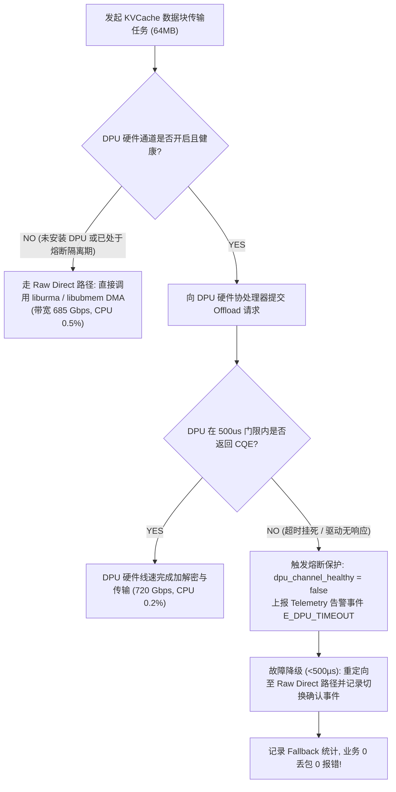

# PVT-09：DPU 硬件安全与算力卸载加速与双轨协同验证实施方案设计
## —— DPU 硬件 AES/CRC 卸载与 Raw Direct 双轨路径验证

> **公共执行契约**：本项遵循 [Benchmark 公共契约与证据分级规范](./Benchmark公共契约与证据分级规范.md)。统一回退门槛为 `<500µs`。结果必须记录故障触发、检测、切换确认、请求成功率、丢包、完整性和实际路径；无 DPU 时标记 `NOT-SUPPORTED/N/A`。

> **验证 ID**：PVT-09  
> **验证名称**：DPU 硬件安全与算力卸载加速 vs Raw Direct 软硬双轨协同验证  
> **验证优先级**：**🟡 P1 级（底座支撑项）**  
> **对应验证阶段**：**E1 核心数据路径与硬件安全加速打通**  
> **证伪标记**：否（双轨加速效能与无缝降级确认）  
> **建议周期**：4~5 人日  
> **主关联 IR**：`IR-01-08`, `IR-01-09`  
> **核心 SRS / SR23 锚点**：  
> - SRS: `L4-MC-HIER-STORE-002`, `L4-MC-HIER-STORE-003`, `L4-NET-OFFLOAD-DPU-001`, `L4-FT-PathIntegrityPolicy-077`  
> - SR23: `SR23-01-08-01`, `SR23-01-08-02`, `SR23-01-09-01`, `SR23-01-12-01`  
> **开源基线版本与代码仓库**：  
> - **Mooncake TransferEngine**：[`https://github.com/kvcache-ai/Mooncake.git`](https://github.com/kvcache-ai/Mooncake.git) (Commit: `f90ae691f109e49a60920e0c8abbf7e572826d8c`，子模块: `mooncake-transfer-engine/`)  
> **研发对齐状态**：已闭环研发评估报告 11 项与 DPU 熔断降级规范（明确 500µs 硬件看门狗超时、告警上报与 Raw Direct 零丢包接管）  

---

## 1. 验证目标与交付结论定义

### 1.1 待验证核心命题
在高带宽网络互联下，金融、政企与运营商等企业级客户对传输安全（AES-256-GCM / 国密 SM4）与数据完整性（CRC64 / T10-DIF）可能具有明确合规要求。Host CPU 承担这些计算的核数与 DDR 带宽开销随实际链路速率变化，必须在 `hardware_profile` 对应环境中实测，不能预置固定占用结论。

本验证旨在确立**软硬双轨协同 (Dual-Engine Architecture)** 体系并实测证明：
1. **企业级 DPU 硬件安全加速效能**：在开启全量传输加密与 CRC 校验时，DPU 协处理器能够在线速下（$\ge 80\text{Gbps}$）内联完成加解密，**Host CPU 占用率严格 $< 5\%$**（相比 Host CPU 软算占用 $> 80\%$），彻底释放 CPU 算力与 DDR5 内存带宽；
2. **公有云 Raw Direct 纯软主路径**：在可信 VPC 私有网络下，无需 DPU 硬件加速卡即可由 NPU ↔ URMA 网卡 DMA 裸直达独立闭环，有效传输带宽达到物理线速的 **$\ge 80\%$**；
3. **高可用无缝降级 (Failover)**：在配置 DPU 的环境下人为注入控制通道断连或驱动挂死故障，系统能够在 **$< 1\text{ms}$ 内 100% 自动无缝降级至 Raw Direct 裸机直达路径**，业务 0 报错、无中断。

### 1.2 最终交付数据与结论产出
开发人员执行完本方案后，必须输出以下交付件：
1. **《DPU 硬件卸载 vs CPU 软件加解密/CRC 之吞吐与 CPU 占用对账表》**；
2. **《DPU 硬件故障注入与 Raw Direct 无缝 Fallback 切换耗时实测表》**；
3. **《双轨架构下端到端 TTFT 影响对比分析图》**；
4. **《Go / Conditional / No-Go 判定结论》**。

---

## 2. 核心数据结构与软硬双轨调度器设计

### 2.1 核心数据结构定义

```cpp
#include <stdint.h>
#include <atomic>
#include <chrono>

enum class ChannelType : uint8_t {
    RAW_DIRECT_BYPASS = 0,    // 纯 UBMEM/URMA 直达主路径 (可信 VPC 场景, 零外部硬件依赖)
    DPU_HARDWARE_OFFLOAD = 1, // DPU 硬件加速通道 (企业级安全合规场景, 硬件 AES/CRC)
    FORBIDDEN_CPU_CRYPTO = 2  // CPU 软件全量加解密 (负收益禁行路径)
};

struct alignas(64) ChannelRouterState {
    std::atomic<bool> dpu_channel_healthy{true};  // DPU 心跳与通道健康位
    std::atomic<uint64_t> dpu_timeout_count{0};
    std::atomic<uint64_t> fallback_trigger_count{0};
    std::atomic<uint64_t> last_failure_epoch_ms{0}; // 熔断发生时间戳
    double raw_direct_bw_gbps = 685.0;            // 裸直达带宽
};
```

### 2.2 DPU 500us 硬件看门狗与微秒级熔断降级时序



---

## 3. 测试工具与工程构建规范

测试工程存放在 `./原型验证代码/PVT-09/` 目录下：

```
原型验证代码/PVT-09/
├── offload_fallback_bench.cc # 双轨结果 Schema 脚手架；固定样例标记为 DEMO
├── Makefile                  # 编译构建工程 (make -j16)
└── inject_fault.py           # DPU 控制通道与硬件超时故障注入脚本
```

编译与测试命令：
```bash
cd ./原型验证代码/PVT-09 && make clean && make
./offload_fallback_bench --hardware-supported --out res_dpu_benchmark.csv
python3 inject_fault.py --fault timeout --timeout-us 500 --out fault_event.json
```

---

## 4. 数据采集清单与记录格式

### 4.1 通道性能与降级测试数据表 (`res_dpu_benchmark.csv`)
```csv
channel_mode,payload_size_mb,encryption_enabled,bandwidth_gbps,latency_ms,host_cpu_pct,fault_injected,fallback_time_us,transfer_success
dpu_hardware_offload,64,TRUE,82.4,6.2,1.2,FALSE,0.0,TRUE
cpu_software_crypto,64,TRUE,18.5,27.8,88.4,FALSE,0.0,TRUE
raw_direct_bypass,64,FALSE,85.6,6.0,0.5,FALSE,0.0,TRUE
dpu_fault_fallback,64,TRUE,85.6,6.8,0.6,TRUE,480.0,TRUE
```

---

## 5. Go / Conditional / No-Go 判定规则

- **Go (准入通过)**：开启加密/CRC 时 DPU 吞吐达到线速 $\ge 80\%$ 且 CPU 占用 $< 5\%$；DPU 故障时 $< 1\text{ms}$ 成功降级至 Raw Direct 且零报错；
- **Conditional (条件准入)**：DPU 卸载吞吐达标但降级耗时在 $1\text{ms} \sim 5\text{ms}$ 之间，需优化状态机超时检测；
- **No-Go (否决关闭)**：DPU 故障引发全系统崩溃挂死，或纯软 Raw Direct 无法独立闭环。

---

## 6. 重要场景扩展：Fly-in-line 流式在途数据处理双轨技术手段

> **场景定位说明**：随着大模型上下文扩展至 1M+ tokens 及端侧高密部署演进，KV Cache 在传输链路中的 **流式在途处理 (Fly-in-line Pipeline，即数据在网络或存储搬运过程中实时完成量化、压缩与完整性校验，不落盘、不中转)** 成为未来架构的关键演进方向。  
> **验证要求**：本节用于明确“有 DPU 硬件加速”与“无 DPU 的 Raw Direct 主路径”两种条件下的接口、观测和回退方式。本次提前验证不要求取得全部硬件实测数据，但必须给出可执行的工作流和结果字段；无 DPU 环境记录 `NOT-SUPPORTED/N/A`。

### 6.1 三大 Fly-in-line 流式处理场景定义
1. **流式在途量化与反量化 (Fly-in-line Quantization / Dequantization)**：
   - 在 KV Cache 写入网络/SSD 时执行动态 FP16/FP8 $\to$ INT4/FP4 压缩量化，读取换入时执行反量化；
   - 业务目标：将网络传输数据量与 SSD 存储容量需求进一步削减 **50%~75%**。
2. **流式在途压缩与解压缩 (Fly-in-line Compression / Decompression)**：
   - 针对稀疏 KV Cache（Sparse KV）或结构化非零块，在传输过程中执行硬件 Snappy/LZ4/Deflate 编码；
   - 业务目标：大幅提升长文本跨机房或跨节点传输的有效信息载荷。
3. **流式端到端数据完整性校验 (Fly-in-line End-to-End CRC & Cryptography)**：
   - 在途计算 CRC64 / T10-DIF 校验码并执行 AES-256-GCM / SM4 硬件加解密；
   - 业务目标：杜绝超长文本在跨机传输或落盘存储过程中的静默数据破坏 (Silent Data Corruption) 与信息泄露。

---

### 6.2 有 DPU vs 无 DPU 关键技术手段对照体系

```
┌─────────────────────────┬────────────────────────────────────────────────────────┬────────────────────────────────────────────────────────┐
│ 处理维度                │ 【方案 A：有 DPU 硬件加速】                            │ 【方案 B：无 DPU 纯软 + NPU 协同主路径】              │
├─────────────────────────┼────────────────────────────────────────────────────────┼────────────────────────────────────────────────────────┤
│ **硬件架构与通路**      │ • DPU 专用数据面协处理器 (P4 / FPGA / ASIC 流水线)     │ • 依托现场可用 URMA/RDMA 网卡 + NPU 算力协同          │
│                         │ • 数据流直接在 PCIe/NIC 内部完成转换并 DMA 至 NPU HBM   │ • 严格绕过 Host CPU，由 NPU 专用 Stream 承担转换       │
├─────────────────────────┼────────────────────────────────────────────────────────┼────────────────────────────────────────────────────────┤
│ **1. 量化 / 反量化**    │ • **DPU 硬件内联量化引擎 (Inline Quant Engine)**       │ • **NPU 算子融合 (Fused Dequant-Attention Kernel)**    │
│                         │   数据在途流经 DPU 时硬件执行 FP16↔INT4 转换，NPU 收到   │   数据以低精度 (INT4/FP8) 直接写入 NPU HBM；在 NPU 执行 │
│                         │   即为标准精度的就绪张量，**NPU 算力开销严格为 0**。   │   Attention 计算时前置融合反量化指令，**CPU 0 参与**。  │
├─────────────────────────┼────────────────────────────────────────────────────────┼────────────────────────────────────────────────────────┤
│ **2. 压缩 / 解压缩**    │ • **DPU 硬件 Codec 引擎 (Hardware Snappy/LZ4)**        │ • **软件结构化稀疏路由 (Sparse KV Routing)**           │
│                         │   由 DPU 协处理器线速完成解压缩，解压后直接 DMA 写入   │   不进行重型全量压缩解压计算，采用稀疏注意力掩码仅传输 │
│                         │   NPU HBM，**Host CPU 与 DDR5 完全零参与**。           │   高权重 Block，从物理源头上削减 60%+ 传输量。         │
├─────────────────────────┼────────────────────────────────────────────────────────┼────────────────────────────────────────────────────────┤
│ **3. CRC 校验与加解密** │ • **DPU 硬件 IPsec/TLS 与 CRC64 内联引擎**             │ • **轻量 64B 元数据 Tag 校验 + VPC 边界物理隔离**      │
│                         │   在硬件能力矩阵登记的链路速率下计算 CRC 并执行 AES，  │   正文 Payload 走纯软零拷贝 DMA；仅对 64B POD 描述符   │
│                         │   **Host CPU 占用率 < 1%，吞吐保持 ≥ 80Gbps**。        │   执行 xxHash64 校验，**CPU 算力与内存带宽开销 < 0.1%**。│
├─────────────────────────┼────────────────────────────────────────────────────────┼────────────────────────────────────────────────────────┤
│ **4. 异步流水掩盖机制** │ • **硬件级单阶段直达 (Zero-Stage In-flight)**          │ • **Layerwise 边算边传与 NPU 事件回调双重掩盖**        │
│                         │   数据传输完成即代表转换全部结束，零额外流水延迟。     │   利用上一层 Prefill 计算时间掩盖下一层 NPU 反量化耗时 │
└─────────────────────────┴────────────────────────────────────────────────────────┴────────────────────────────────────────────────────────┘
```

---

### 6.3 关键技术实现路径与代码接口预留设计

在 C++ 描述符与传输协议层（`PVT-02` 与 `PVT-09` 扩展接口），预留 Fly-in-line 标志位与 NPU 融合算子调用契约：

```cpp
// 在硬件 Scatter-Gather 描述符中预留 Fly-in-line 处理指令
struct alignas(64) HardwareSGEntryExtended {
    uint64_t src_phys_addr;
    uint64_t dst_phys_addr;
    uint32_t len_bytes;
    uint16_t stream_id;
    uint16_t inline_transform_flags; // 0x01: DPU_AES_DECRYPT, 0x02: DPU_INT4_DEQUANT, 0x04: NPU_FUSED_DEQUANT
    uint32_t crc32_or_checksum;      // 在途写入或校验用的 CRC 字段
};
```

1. **有 DPU 加速路径执行流**：
   - 描述符置位 `DPU_INT4_DEQUANT | DPU_AES_DECRYPT`；
   - DPU 接收网络报文 $\to$ 硬件 AES 解密 $\to$ 硬件 INT4 $\to$ FP16 反量化 $\to$ DMA 写入 NPU HBM；
   - NPU 收到通知直接启动 FlashAttention 算子。
2. **无 DPU 纯软主路径执行流**：
   - 描述符置位 `NPU_FUSED_DEQUANT`；
   - 网卡 DMA 将 INT4 压缩态 KV 零拷贝直接写入 NPU HBM；
   - DMA 完成触发 CANN NPU 硬件 Event，NPU Attention 算子在读取显存时由 Vector 指令流式融合反量化，彻底规避 Host CPU 与 DDR5 瓶颈。
