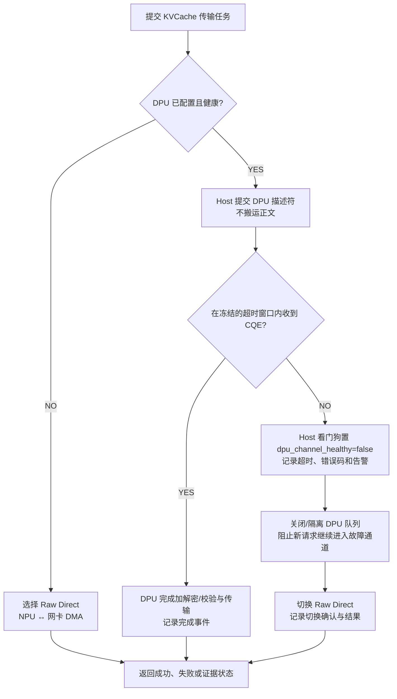

# PVT-09：DPU 硬件安全与算力卸载加速与双轨协同验证实施方案设计
## —— DPU 硬件 AES/CRC 卸载与 Raw Direct 双轨路径验证

> **公共执行契约**：本项遵循 [Benchmark 公共契约与证据分级规范](./Benchmark公共契约与证据分级规范.md)。统一回退门槛为 `<500µs`。结果必须记录故障触发、检测、切换确认、请求成功率、丢包、完整性和实际路径；无 DPU 时标记 `NOT-SUPPORTED/N/A`。

> **验证 ID**：PVT-09  
> **验证名称**：DPU 硬件安全与算力卸载加速 vs Raw Direct 软硬双轨协同验证  
> **验证优先级**：**🟡 P1 级（底座支撑项）**  
> **对应验证阶段**：**E1 核心数据路径与硬件安全加速打通**  
> **证伪标记**：否（双轨加速效能与安全回退确认）
> **主关联 IR**：`IR-01-08`, `IR-01-09`  
> **核心 SRS / SR23 锚点**：  
> - SRS: `L4-MC-HIER-STORE-002`, `L4-MC-HIER-STORE-003`, `L4-NET-OFFLOAD-DPU-001`, `L4-FT-PathIntegrityPolicy-077`  
> - SR23: `SR23-01-08-01`, `SR23-01-08-02`, `SR23-01-09-01`, `SR23-01-12-01`  
> **开源基线版本与代码仓库**：  
> - **Mooncake TransferEngine**：[`https://github.com/kvcache-ai/Mooncake.git`](https://github.com/kvcache-ai/Mooncake.git) (Commit: `f90ae691f109e49a60920e0c8abbf7e572826d8c`，子模块: `mooncake-transfer-engine/`)  
> **研发对齐状态**：本方案将复核研发评估报告涉及的 DPU 看门狗超时、告警上报与 Raw Direct 接管流程，并以现场 DPU、网卡和 NPU 行为为准。

---

## 0. 架构导读与核心概念第一性原理剖析

### 0.1 传统系统开发视角：硬件协处理器卸载 (Offload) 与单点高可用降级 (Fallback)

在企业级安全网关（如 TLS 卸载卡、IPsec VPN 加速芯片、存储 RAID 校验卡）中：
1. **待测硬件卸载收益**：数据加密（AES-256-GCM）与完整性校验（CRC64 / T10-DIF）是高密度的数学计算。在高带宽传输下，如果全由 Host CPU 软算，可能挤占控制面和在线推理资源；具体核心数与 CPU 占用率必须在 `hardware_profile` 对应环境中实测；
2. **高可用降级约束**：不能让系统对专用硬件形成无法绕过的单一故障点依赖。一旦硬件加速卡由于固件问题挂死或响应超时，软件应在冻结的亚毫秒门限（例如 `$<500µs`）内尝试熔断并降级到纯软裸直达路径（Raw Direct）；是否保持业务连续性必须由故障注入确认。

---

### 0.2 大模型分布式存储中的真实安全合规与双轨协同架构

在大模型生产环境中：
- **企业专线高安全合规场景**：金融、政企与医疗行业客户明确要求：跨机架、跨机房传输的大模型 KVCache 必须经过 AES-256 加密防窃听，并附加 CRC64 数据校验码防数据篡改；
- **公有云低成本高吞吐场景**：在物理隔离的可信内部网络中，追求极致 TCO，无需加密；
- **软硬件协同双轨方案**：
  1. **轨道一：DPU 硬件加速通道（DPU Hardware Offload）**：
     - 在配备 DPU 智能网卡的服务器上，由 DPU 硬件引擎尝试在线路有效带宽下内联执行加解密与校验，目标是降低 Host CPU 占用；实际吞吐和 CPU 占用以实测为准；
  2. **轨道二：纯软原始直达路径（Raw Direct）**：
     - 在未安装 DPU 的常规服务器上，直接走 NPU ↔ 网卡 DMA 裸直达传输，零外部硬件依赖，自主可控；
  3. **亚毫秒级看门狗熔断降级**：
     - 当 DPU 通道发生硬件故障（超过冻结的超时门限），系统自动熔断隔离 DPU，将后续请求切换至 Raw Direct 裸直达；是否做到零丢包、零错误和不中断，必须由故障注入结果确认；

```
┌────────────────────────────────────────────────────────────────────────────────────────┐
│                   DPU 硬件加速与 Raw Direct 软硬双轨降级工作流                         │
├────────────────────────────────────────────────────────────────────────────────────────┤
│                                                                                        │
│  [ 发起 64MB KVCache 传输任务 ]                                                        │
│                 │                                                                      │
│                 ▼                                                                      │
│  [ 检查 DPU 状态 ]: 是否已配置且通道健康?                                               │
│        ├── YES ──► [ DPU 硬件内联加速 ]: 执行 AES/CRC, CPU 占用由现场实测              │
│        │                 │                                                             │
│        │                 ▼ (若 500us 超时未返回 CQE)                                   │
│        │           [ 触发硬件看门狗熔断 ]: dpu_healthy = false                         │
│        │                 │                                                             │
│        └── NO / 降级 ────┴─► [ 切换 Raw Direct 裸直达 ]: DMA 直达, 结果由实测确认        │
│                                                                                        │
│ 观测：DPU 通道吞吐、CPU 占用、故障检测与切换时间均由现场实测记录。                     │
└────────────────────────────────────────────────────────────────────────────────────────┘
```

---

## 1. 验证目标与交付结论定义

### 1.1 现实前因痛点与待验证核心命题
1. **现实痛点**：企业级高安全加密需求可能增加 CPU 计算负载或占用 AI 算力，而完全依赖专用 DPU 又存在单点故障风险与硬件绑定限制；实际负载需按现场测量；
2. **核心命题**：
   - 验证 DPU 协处理器在现场能力矩阵允许的速率下是否能内联完成 AES/CRC，并核对吞吐与 Host CPU 占用率门限（例如 `$\ge80\text{Gbps}`、`<5%`）；
   - 验证在公有云可信网络等安全策略允许的场景下，纯软 Raw Direct 路径是否能无需 DPU 独立闭环；
   - 验证注入 DPU 超时故障时，系统是否能在冻结门限（例如 `<500µs`）内切换至 Raw Direct，并核对请求结果、丢包和完整性校验，不能预置为零错误或不中断。

### 1.2 最终交付数据与结论产出
1. **《DPU 硬件卸载 vs CPU 软件加解密/CRC 之吞吐与 CPU 占用对账表》**；
2. **《DPU 硬件故障注入与 Raw Direct 安全回退切换耗时实测表》**；
3. **《GO / CONDITIONAL / NO-GO / NOT-SUPPORTED / INVALID-EVIDENCE 判定结论》**。

---

## 2. 核心数据结构与软硬双轨调度器设计

### 2.1 核心数据结构定义

```cpp
#include <stdint.h>
#include <atomic>
#include <chrono>
#include <optional>

enum class ChannelType : uint8_t {
    RAW_DIRECT_BYPASS = 0,    // 纯 UBMEM/URMA 直达主路径 (零外部硬件依赖)
    DPU_HARDWARE_OFFLOAD = 1, // DPU 硬件加速通道 (企业级安全合规场景)
    FORBIDDEN_CPU_CRYPTO = 2  // CPU 软件全量加解密 (负收益禁行路径)
};

struct alignas(64) ChannelRouterState {
    std::atomic<bool> dpu_channel_healthy{true};  // DPU 心跳与通道健康位
    std::atomic<uint64_t> dpu_timeout_count{0};
    std::atomic<uint64_t> fallback_trigger_count{0};
    std::atomic<uint64_t> last_failure_epoch_ms{0}; // 熔断发生时间戳
    std::optional<double> raw_direct_bw_gbps;     // 运行时从硬件能力矩阵注入；未测得时保持空值
};
```

### 2.2 DPU 看门狗、熔断窗口与 Host 介入边界

Host CPU 在双轨方案中只负责控制面动作：读取 DPU 健康状态、提交描述符、轮询完成队列、记录事件和切换通道；Host 不参与 KVCache 正文的加解密、CRC 计算或字节搬运。DPU 负责的硬件操作必须有独立超时观察者，不能让提交线程无限等待。



超时门限（例如 500µs）是待验证的验收条件，不是预置实测结果。一次完整故障证据至少要包含：故障触发时间、看门狗检测时间、DPU 队列隔离时间、Raw Direct 提交时间、切换确认时间、请求结果、丢包/完整性校验结果以及 Host CPU 是否搬运正文。

---

## 3. 测试工具与工程构建规范

测试工程存放在 `./原型验证代码/PVT-09/` 目录下：

```
原型验证代码/PVT-09/
├── offload_fallback_bench.cc # 双轨压测与降级验证工具
├── inject_fault.py           # DPU 控制通道与硬件超时故障注入脚本
├── eval_dpu_fallback.py      # 分析吞吐达成率与降级耗时报告脚本
└── Makefile                  # 编译构建工程 (make -j16)
```

编译方法：
```bash
cd ./原型验证代码/PVT-09 && make clean && make -j16
```

---

## 4. 分步执行测试操作规程 (SOP)

开发人员在执行 PVT-09 时，请严格按照以下 4 个步骤逐步执行，并理解每一步的操作意图：

### 步骤 1：运行 CPU 软算加密对照测试
- **操作意图**：在没有硬件加速下，由 Host CPU 执行 AES-256-GCM 与 CRC64 计算并传输 64MB 数据，测量 CPU 占用率与有效吞吐，作为对照基线；具体占用率必须以现场实测为准。
- **执行命令**：
```bash
./offload_fallback_bench --mode cpu_software_crypto --payload-mb 64 --out res_cpu_crypto.csv
```

### 步骤 2：运行 DPU 硬件加速通道测试
- **操作意图**：在配置 DPU 的环境下开启硬件内联加密，测量有效吞吐、CPU 占用率、CRC/加密正确性和完成事件；$\ge 80\text{Gbps}$ 与 CPU $<5\%$ 是验收门槛，不是预置结果。
- **执行命令**：
```bash
./offload_fallback_bench --mode dpu_hardware_offload --payload-mb 64 --out res_dpu_bench.csv
```

### 步骤 3：运行纯软 Raw Direct 裸直达主路径测试
- **操作意图**：在无 DPU 环境下，由 NPU ↔ 网卡 DMA 直接直达传输，验证纯软主路径是否能在零外部硬件依赖下达到现场物理线速的验收比例；结果以硬件能力矩阵和设备完成量为准。
- **执行命令**：
```bash
./offload_fallback_bench --mode raw_direct_bypass --payload-mb 64 --out res_raw_direct.csv
```

### 步骤 4：注入 DPU 超时故障，验证亚毫秒级安全回退
- **操作意图**：在 DPU 传输途中由脚本注入驱动超时故障，验证系统是否能在冻结门限内自动熔断并切换至 Raw Direct；同时核对请求结果、丢包、完整性、切换确认与 Host Touch 证据，不能预置为零。
- **执行命令**：
```bash
python3 ./inject_fault.py --fault timeout --timeout-us 500 --sut-cmd "./offload_fallback_bench --mode dpu_fault_fallback" --out res_fallback.json
```

---

## 5. 数据采集清单与记录格式

### 5.1 通道性能与降级测试数据表 (`res_dpu_benchmark.csv`)
```csv
channel_mode,payload_size_mb,encryption_enabled,bandwidth_gbps,latency_ms,host_cpu_pct,fault_injected,fallback_time_us,transfer_success,evidence_level,status,invalid_reason
<dpu_hardware_offload>,<payload_mb>,<TRUE_OR_FALSE>,<measured_bw_gbps>,<measured_latency_ms>,<measured_host_cpu_pct>,<TRUE_OR_FALSE>,<measured_fallback_us_or_null>,<TRUE_OR_FALSE>,<LAB_OR_DEMO_OR_NOT-SUPPORTED>,<status>,<null_or_reason>
<cpu_software_crypto>,<payload_mb>,<TRUE_OR_FALSE>,<measured_bw_gbps>,<measured_latency_ms>,<measured_host_cpu_pct>,<TRUE_OR_FALSE>,<measured_or_null>,<TRUE_OR_FALSE>,<LAB_OR_DEMO>,<status>,<null_or_reason>
<raw_direct_bypass>,<payload_mb>,<TRUE_OR_FALSE>,<measured_bw_gbps>,<measured_latency_ms>,<measured_host_cpu_pct>,<TRUE_OR_FALSE>,<measured_or_null>,<TRUE_OR_FALSE>,<LAB_OR_DEMO>,<status>,<null_or_reason>
<dpu_fault_fallback>,<payload_mb>,<TRUE_OR_FALSE>,<measured_bw_gbps>,<measured_latency_ms>,<measured_host_cpu_pct>,<TRUE_OR_FALSE>,<measured_fallback_us_or_null>,<TRUE_OR_FALSE>,<LAB_OR_DEMO_OR_NOT-SUPPORTED>,<status>,<null_or_reason>
```

> 这是结果字段模板，不是性能成绩。DPU 不存在时记录 `NOT-SUPPORTED/N/A`；故障触发、检测或切换时间未采集时使用 `null` 并填写 `invalid_reason`，不能以 0 或 TRUE 代替。

---

## 6. GO / CONDITIONAL / NO-GO / NOT-SUPPORTED / INVALID-EVIDENCE 判定规则

- **GO（准入通过）**：开启加密/CRC 时 DPU 吞吐达到现场线速的验收比例、Host CPU 占用低于门限，且故障切换在冻结门限内完成；同时请求结果、完整性、设备完成事件和 Host CPU 零正文搬运证据齐全。具体门限沿用本方案第 1 节与公共契约，不把示例门限当作实测结果；
- **CONDITIONAL（条件准入）**：DPU 卸载路径的吞吐与正确性达到要求，但切换时延、可用安全能力或故障覆盖范围仍需限制使用场景或补充验证；
- **NO-GO（暂不准入）**：出现数据完整性错误、请求结果无法闭环、故障切换未按策略隔离，或无 DPU 的 Raw Direct 主路径无法独立完成验证；
- **NOT-SUPPORTED（当前不支持）**：现场没有 DPU，或硬件能力矩阵不包含所需加密/转换能力。该状态表示条件不具备，不等同于性能失败；
- **INVALID-EVIDENCE（证据无效）**：缺少硬件能力矩阵、设备完成事件、故障时间戳、探针覆盖、A/B 配置一致性或完整性校验结果。缺失字段必须填写 `null` 与 `invalid_reason`，不得用 0 或 TRUE 代替。

---

## 7. 重要场景扩展：Fly-in-line 流式在途数据处理双轨技术手段

### 7.1 三大 Fly-in-line 流式处理场景
1. **流式在途量化与反量化**：在数据传输中实时执行 FP16 $\to$ INT4 压缩与反量化；
2. **流式在途压缩与解压缩**：针对稀疏 KV Cache（Sparse KV）执行结构化硬件压缩；
3. **流式端到端完整性校验**：实时计算 CRC64 / T10-DIF 校验码与 AES 加密。

### 7.2 有 DPU vs 无 DPU 技术手段对照（对应版本一 6.2 核心内容）

下面的对照矩阵是本方案必须保留的核心内容。两条轨道的差异不仅在“有没有 DPU”，还在于数据转换由谁执行、Host CPU 负责什么、失败后如何切换：

| 处理维度 | 方案 A：有 DPU 硬件加速 | 方案 B：无 DPU 的 Raw Direct + NPU 协同主路径 |
|---|---|---|
| **硬件架构与数据通路** | DPU 专用数据面协处理器（P4/FPGA/ASIC 等，以现场能力为准）在网卡/PCIe 数据路径内联处理，再由 DMA 写入 NPU HBM；Host CPU 只负责配置、提交描述符、轮询完成队列和记录遥测。 | 依托现场可用 URMA/RDMA 网卡与 NPU Stream，网卡 DMA 将数据直接写入 NPU HBM；Host CPU 同样只负责控制面，不参与 KVCache 正文搬运。 |
| **1. 量化 / 反量化** | 若硬件能力矩阵确认支持，由 DPU 内联量化引擎在途执行 FP16/FP8 ↔ INT4/FP4 转换；转换结果和精度口径必须由校验数据确认，不能仅凭接口名称判定支持。 | 数据以低精度形式直接进入 NPU HBM，由 NPU 的融合反量化与 Attention 算子在读取时完成转换；Host CPU 不执行量化循环，不能把 NPU 算力开销误记为 Host CPU 开销。 |
| **2. 压缩 / 解压缩** | 若 DPU 有对应 Codec，由 DPU 协处理器执行 Snappy/LZ4/Deflate 等在途编码；解压后 DMA 直达 NPU HBM，Host CPU 不参与正文拷贝。 | 不依赖 DPU 重型全量 Codec；可采用软件结构化稀疏路由或 NPU 算子只传输高权重 Block。该路径与完整压缩的压缩率、可逆性和精度必须分开验证，不能混称为同一种压缩。 |
| **3. CRC 校验与加解密** | DPU 内联执行 CRC64/T10-DIF 与 AES-256-GCM/SM4 等硬件安全操作；Host CPU 只配置密钥句柄、策略和完成队列，不能读取并重算 KV 正文。 | Raw Direct 路径可对 64B 描述符和元数据 Tag 做 xxHash64/CRC 校验，正文继续走零拷贝 DMA；该路径只适用于已满足安全策略的可信网络。若业务强制要求正文加密而现场没有 NPU/DPU 加密能力，应标记 `NOT-SUPPORTED`，不能用元数据 Tag 代替机密性。 |
| **4. 异步流水掩盖** | 数据流在 DPU 内完成转换后直接进入 DMA，Host 只等待完成事件；额外转换阶段是否被完全掩盖，以硬件 Timeline 证据为准。 | 利用“Layerwise 边算边传”与 NPU Event 回调掩盖反量化耗时：上一层计算期间传输下一层，Host 只编译/提交描述符和处理事件，不搬运数据。 |
| **故障与回退** | DPU CQE 超时或心跳失效时，Host 看门狗隔离故障队列、置 `dpu_channel_healthy=false`，后续请求切换 Raw Direct；当前请求是否能安全重试由完整性校验与请求状态决定。 | 无 DPU 时直接走 Raw Direct；若网卡/NPU 链路失败，按公共契约回退本地重算或将请求标记失败，不得虚构“硬件卸载已完成”。 |

#### Host CPU 介入边界

两条轨道都必须把 Host CPU 限定在控制面，具体职责如下：

1. **允许介入**：读取 `hardware_profile`、选择通道、注册 Memory Region、编译/提交 DMA 描述符、轮询 CQE、维护租约/看门狗、写入遥测和触发通道切换；
2. **禁止介入**：读取 KVCache Payload 到 Host DDR、执行正文 `memcpy`、在 CPU 上逐字节完成量化/解压/CRC/加密、用 CPU 缓冲区拼接后再发送；
3. **轨道差异**：有 DPU 时 Host 提交 DPU Offload 描述符并消费 DPU 完成事件；无 DPU 时 Host 提交 URMA/UBMEM 描述符并由 NPU Stream 执行允许的转换；两者的 Payload Touch Bytes 均须由探针和设备完成量共同证明。

### 7.3 Fly-in-line 接口预留与两条执行流

在 PVT-02 描述符与 PVT-09 传输协议层预留在途处理标志。该结构只表达硬件/软件执行契约，不代表现场硬件已经支持所有转换：

```cpp
struct alignas(64) HardwareSGEntryExtended {
    uint64_t src_phys_addr;
    uint64_t dst_phys_addr;
    uint32_t len_bytes;
    uint16_t stream_id;
    uint16_t inline_transform_flags;
    // 0x01: DPU_AES_DECRYPT
    // 0x02: DPU_INT4_DEQUANT
    // 0x04: NPU_FUSED_DEQUANT
    uint32_t crc32_or_checksum;
};
```

1. **有 DPU 加速路径**：描述符置位 DPU 支持且已在能力矩阵登记的转换标志；网络报文进入 DPU 后完成硬件安全处理/格式转换，再 DMA 写入 NPU HBM；NPU 收到完成事件后启动 Attention。Host 只提交、轮询和记录，不搬运正文。
2. **无 DPU Raw Direct 路径**：网卡 DMA 将压缩态 KV 直接写入 NPU HBM；DMA 完成触发 NPU Event，Attention 读取显存时由 Vector/融合算子执行反量化；如果所需安全策略无法由该路径满足，必须关闭该模式或标记 `NOT-SUPPORTED`，不能绕过安全要求。

两条路径必须分别记录 `planned_path`、`actual_path`、`inline_transform_flags`、设备完成事件、校验结果、Host Touch 证据和切换原因，便于在无 DPU 环境下证明“没有 DPU”而不是“DPU 测试缺失”。

---

## 8. 零 AI 基础工程师借助 AI Agent 开展工作实战 SOP

### 8.1 研发任务拆解与分工
- **工程师职责**：
  1. 编译测试工程；
  2. 按照第 4 节 SOP 步骤执行软算与 DPU/Raw Direct 压测；
  3. 观察注入故障后系统日志中的熔断与降级时间戳；
- **AI Agent 职责**：
  1. 负责 `offload_fallback_bench.cc` 中看门狗定时器与双轨通道状态机原子切换逻辑补全；
  2. 自动汇总 CSV 表格并生成降级时延柱状图。

### 8.2 专属 Prompt 模板（可直接复制给 AI Agent）
```text
我是一名系统底层工程师，正在进行 PVT-09 验证（DPU 硬件安全加速 vs Raw Direct 软硬双轨与降级）：
1. 请阅读 ./原型验证代码/PVT-09/offload_fallback_bench.cc 与 inject_fault.py；
2. 检查 ChannelRouterState 状态机，确保在 DPU 通道健康时走硬件卸载，并在超时未返回时 500µs 内自动熔断并切换为 Raw Direct 裸直达；
3. 按照第 4 节 SOP 执行压测，对比 CPU 软算加密与 DPU/Raw Direct 的 CPU 利用率与吞吐；
4. 运行 inject_fault.py 注入驱动挂死故障，统计降级切换微秒耗时并输出测试表格。
```

### 8.3 常见排错指南
- **DPU 驱动无响应导致程序永久阻塞**：检查看门狗定时器是否在独立线程中运行，超时后必须直接关闭 DPU 队列句柄并强制切走；
- **纯软 Raw Direct 吞吐不达标**：检查网卡驱动是否开启了巨型帧（Jumbo Frame，MTU=9000）。
