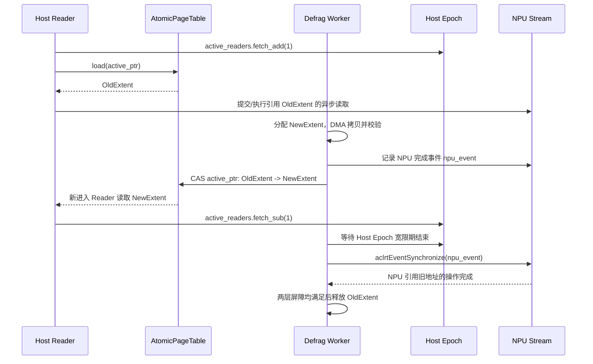

# CVT-01：PageMigration 软件 RCU 与硬件 AtomicRemap 必要性证伪实施方案设计
## —— Mooncake 显存整理纯软化：软件 RCU 机制证伪硬件 AtomicRemap 芯片依赖

> **公共执行契约**：本项遵循 [Benchmark 公共契约与证据分级规范](./Benchmark公共契约与证据分级规范.md)。统一判定量为 Reader 停顿 P99 `<1ms`、TPOT 干扰率 `<3%` 和错误读取为 0；最大值不能替代 P99。无硬件 Atomic Remap 时硬件组标记 `NOT-SUPPORTED/N/A`。

> **验证 ID**：CVT-01  
> **验证名称**：页迁移/Defrag 软件 RCU 与硬件 Atomic Remap 原语必要性证伪  
> **验证优先级**：**🟢 P2 级（拓展证伪项）**  
> **对应验证阶段**：**条件证伪阶段 (架构简化与去依赖)**  
> **证伪标记**：**是（优先证伪“硬件 Atomic Remap 是内存整理迁移的必需依赖”）**  
> **主关联 IR**：`IR-01-01`, `IR-01-11`, `IR-01-12`  
> **核心 SRS / SR23 锚点**：  
> - SRS: `L4-CO-AtomicRemapPrimitive-065`, `L3-CO-MigrationRCULock-090`  
> - SR23: `SR23-01-01-03`, `SR23-01-11-01`, `SR23-01-12-02`  
> **开源基线版本与代码仓库**：  
> - **Mooncake 存储引擎**：[`https://github.com/kvcache-ai/Mooncake.git`](https://github.com/kvcache-ai/Mooncake.git) (Commit: `f90ae691f109e49a60920e0c8abbf7e572826d8c`，子模块: `mooncake-store/`)  
> **研发对齐状态**：本方案将复核研发评估报告涉及的 RCU 宽限期检测机制，重点检查 Host Epoch 计数与 NPU Stream 硬件事件双层同步屏障。

---

## 0. 架构导读与核心概念第一性原理剖析

### 0.1 传统系统开发视角：Linux 内核 RCU (Read-Copy-Update) 无锁并发艺术

在 Linux 内核（如核心路由表更新、文件描述符表扩展）与无锁数据结构中，RCU（Read-Copy-Update，读-拷贝-更新）是一种降低读路径锁竞争的并发更新机制：
- **传统互斥锁的限制**：当大量线程并发读取共享数据时，后台写线程若持锁修改其中一个节点，可能让读线程排队等待（Stop-the-world），放大请求抖动；
- **RCU 的精妙机制**：
  1. **读端（Reader）完全无锁**：读线程直接读取当前的旧节点指针，零锁竞争、零原子开销；
  2. **写端（Writer）后台拷贝更新**：写线程在后台复制一份新节点、完成修改；
  3. **原子指针翻转（Atomic Pointer Flip）**：写线程通过一次极速的 CAS（Compare-And-Swap）原子操作，将全局指针指向新节点；
  4. **宽限期等待（Grace Period）**：写线程等待所有正在读取旧节点的 Reader 全部退出临界区（宽限期结束）后，再异步释放旧节点的内存。

---

### 0.2 大模型显存碎片整理 (Defrag) 与硬件 Remap 芯片依赖的必要性验证

在大模型长时间在线运行中：
- **显存碎片危机**：随着不同长度会话请求的频繁创建与销毁，NPU 显存中会散落大量无法分配的空闲碎片。存储引擎必须在后台将离散的物理页迁移合并为连续的大内存区间（Defragmentation）；
- **业界硬件派的观点（争议痛点）**：有人主张显存迁移时必须依赖底层 ASIC 芯片提供“硬件原子重映射（Hardware Atomic Remap）”原语，否则在迁移途中无法保证前台读线程的数据一致性。这种硬件依赖导致系统架构极度复杂，且受制于特定硬件厂商；
- **本项验证要回答的问题**：
  - 借鉴 Linux 内核 RCU 思想，设计 **软件 RCU 双层同步屏障**（Host Epoch 计数器 + CANN NPU Stream 事件栅栏）；
  - 在 32 并发 Reader 持续读取的统一测试条件下，实测软件 RCU 是否满足 **Reader 停顿 P99 `<1ms`**、**TPOT 干扰率 `<3%`**，且数据读取 Checksum 错误为 0；
  - 只有在迁移停顿、前台干扰、数据一致性和异常回滚均有可追溯实测证据时，才能判断硬件 Atomic Remap 是否仍是必需依赖。本方案本身不预先填写结果。

```
┌────────────────────────────────────────────────────────────────────────────────────────┐
│                   软件 RCU 显存页迁移无锁同步与双层宽限期时序                          │
├────────────────────────────────────────────────────────────────────────────────────────┤
│                                                                                        │
│  [ 前台 32 并发 Reader ] ──► 无锁读取旧 Extent (0 锁等待)                              │
│                                                                                        │
│  [ 后台 Defrag 迁移器 ]                                                                 │
│         ├── 1. 异步分配新连续 Extent 并通过 DMA 拷贝数据                                │
│         ├── 2. 原子 CAS 翻转指针: active_ptr = NewExtent (耗时由实测记录)               │
│         ├── 3. 新 Reader 立即自动读取 NewExtent                                        │
│         └── 4. 双层宽限期检测 (Host Epoch == 0 && aclrtEventSynchronize 硬件完成)       │
│                     │                                                                  │
│                     ▼                                                                  │
│         [ 安全释放旧 Extent 物理内存 ]: 由一致性校验与异常回滚报告确认                 │
└────────────────────────────────────────────────────────────────────────────────────────┘
```

---

## 1. 验证目标与交付结论定义

### 1.1 现实前因痛点与待验证核心命题
1. **现实痛点**：显存碎片整理易引发前台推理停顿，而强依赖硬件 Remap 芯片会带来极高的采购成本与硬件死锁风险；
2. **核心命题**：
   - 证明纯软件 **RCU（Read-Copy-Update）** 与 Copy-on-Migrate 在 32 并发 Reader 持续读取下，迁移停顿 **$P99 < 1\text{ms}$**、TPOT 干扰率 **$< 3\%$**、错误读取为 0；
   - 若上述性能、一致性和回滚证据均满足门限，再判断硬件专用 Atomic Remap 芯片是否不是必需依赖；若证据不完整，只能输出 `INVALID-EVIDENCE`，不能确立纯软主路径。

### 1.2 最终交付数据与结论产出
1. **《Stop-the-world 锁表 vs 软件 RCU vs 硬件 Remap 迁移停顿与 Jitter 对比表》**；
2. **《高并发 Reader 下软件 RCU 内存一致性与 Checksum 校验表》**；
3. **《迁移中途异常注入与原子回滚安全性测试表》**；
4. **《GO / CONDITIONAL / NO-GO / NOT-SUPPORTED / INVALID-EVIDENCE 判定结论》**。

---

## 2. 核心数据结构与 RCU 宽限期双层屏障设计

### 2.1 核心数据结构定义

```cpp
#include <stdint.h>
#include <atomic>
#include <vector>
#include <acl/acl.h>
#include <acl/acl_rt.h>

struct alignas(64) RCUExtentNode {
    uint64_t extent_id;
    uint64_t phys_base_addr;      // 物理显存基址
    uint32_t size_bytes;
    uint32_t checksum;            // 数据块内容校验哈希 (xxHash32)
};

struct alignas(64) AtomicPageTableEntry {
    std::atomic<RCUExtentNode*> active_ptr{nullptr}; // 当前活跃指针 (原子 CAS 翻转)
    std::atomic<uint64_t> current_epoch{0};          // RCU Epoch 宽限期轮次
    std::atomic<uint32_t> active_readers{0};         // 活跃 Host Reader 计数
    aclrtEvent npu_quiescent_event{nullptr};         // NPU 侧静默点硬件事件屏障
};
```

### 2.2 RCU 宽限期双层同步屏障（Host Epoch + NPU Stream Event）

页表指针翻转只保证新进入的 Reader 看到新 Extent，不能单独证明旧 Extent 已经没有被使用。旧 Extent 的释放必须同时满足两个条件：Host 侧活跃 Reader 已经退出临界区，NPU 侧已经完成引用旧地址的异步算子。任一条件缺失，都只能记录为未完成迁移，不能释放旧物理页。



实现与记录要求：

- DMA 拷贝、Checksum 校验和 NPU 完成事件必须发生在 `active_ptr` 翻转之前；
- `active_readers` 只覆盖 Host Reader 临界区，不能替代 NPU Stream 完成事件；
- `active_ptr` 翻转后发生异常时，必须保留旧 Extent 的回滚引用，直到 Host Epoch 与 NPU Event 均安全；
- 记录 `old_extent_id`、`new_extent_id`、`flip_timestamp_ns`、`host_grace_end_ns`、`npu_event_done_ns` 和 `release_timestamp_ns`，用于复核释放顺序。

---

## 3. 测试工具与工程构建规范

测试工程存放在 `./原型验证代码/CVT-01/` 目录下：

```
原型验证代码/CVT-01/
├── rcu_migration_bench.cc    # 32 并发 Reader 下 Stop-the-world 锁表 vs 软件 RCU 迁移停顿对比工具
├── verify_checksum.py        # 验证 100 轮迁移下数据一致性与 Checksum 脚本
├── eval_cvt01.py             # 统计分析迁移停顿与证伪判定报告脚本
└── Makefile                  # 编译构建工程 (make -j16)
```

编译方法：
```bash
cd ./原型验证代码/CVT-01 && make clean && make -j16
```

---

## 4. 分步执行测试操作规程 (SOP)

开发人员在执行 CVT-01 时，请严格按照以下 5 个步骤逐步执行，并理解每一步的操作意图：

### 步骤 1：运行传统全局互斥锁迁移基线测试
- **操作意图**：在 32 线程并发读取下，采用传统 Mutex 锁住整个显存页表执行页迁移，记录读线程停顿与 TPOT 变化，作为对照基线。不得预先把某个停顿数值写入结果表。
- **执行命令**：
```bash
./rcu_migration_bench --mode mutex_lock --readers 32 --migrated-mb 1024 --loops 100 --out res_mutex.csv
```

### 步骤 2：运行纯软件 RCU 无锁页迁移测试
- **操作意图**：在相同 32 线程并发读取下，开启软件 RCU 机制（原子 CAS 指针翻转 + 宽限期延迟释放），测量 Reader 的停顿是否降低至 $P99 < 1\text{ms}$，TPOT 干扰率是否 $< 3\%$。
- **执行命令**：
```bash
./rcu_migration_bench --mode software_rcu --readers 32 --migrated-mb 1024 --loops 100 --out res_rcu.csv
```

### 步骤 3：验证数据一致性与零读脏
- **操作意图**：在设定的迁移轮次全过程中，检查所有 Reader 线程读出的 KVCache Checksum（xxHash32）是否与源数据一致，验证是否有读脏、半写脏块或野指针；缺少任一轮次或任一 Reader 的记录时，结果不能判为通过。
- **执行命令**：
```bash
python3 ./verify_checksum.py --input-csv res_rcu.csv --out-report checksum_report.json
```

### 步骤 4：生成证伪对账表与判定结论
- **操作意图**：对比传统加锁与软件 RCU 的停顿、TPOT、Checksum 和回滚数据，依据实际证据等级给出是否需要硬件 Atomic Remap 的判定报告。
- **执行命令**：
```bash
python3 ./eval_cvt01.py --mutex res_mutex.csv --rcu res_rcu.csv --checksum checksum_report.json --out summary_cvt01.csv
```

### 步骤 5：执行迁移中途异常注入与回滚验证
- **操作意图**：分别在 DMA 拷贝完成前、指针翻转后和 Host/NPU 双层宽限期结束前注入故障，确认旧 Extent 不会被提前释放，且前台 Reader 能回到一致的旧视图或新视图。具体参数名以实际验证工具支持为准，不得用“进程未崩溃”替代回滚证据。
- **执行命令模板**：
```bash
./rcu_migration_bench --mode inject_failure --fault-point <after_copy_before_flip|after_flip_before_grace|before_release> --readers 32 --loops <measured_loops> --out res_rollback_<fault_point>.csv
```

---

## 5. 数据采集清单与记录格式

### 5.1 迁移停顿与 Jitter 测试数据表 (`res_rcu.csv`)
```csv
migration_scheme,reader_threads,migrated_mb,p99_pause_time_us,tpot_jitter_pct,checksum_errors,rollback_success,evidence_level,status,invalid_reason
<migration_scheme>,<reader_threads>,<migrated_mb>,<measured_or_null>,<measured_or_null>,<measured_or_null>,<TRUE_OR_FALSE>,<LAB_OR_DEMO_OR_NOT-SUPPORTED>,<status>,<null_or_reason>
```

字段要求：

- 表格中的数值必须来自原始停顿事件、TPOT 采样和 Checksum 校验报告；演示脚本或固定占位值只能标记为 `DEMO`，不能用于关闭本项验证；
- 无硬件 Atomic Remap 时，硬件组写入 `NOT-SUPPORTED` 或 `N/A`，不得填入模拟性能数据；
- 采集不完整、输入文件不匹配、迁移轮次缺失或回滚结果无法核对时，相关字段使用 `null`，并填写 `invalid_reason`。

### 5.2 迁移中途异常注入与原子回滚安全性测试表 (`res_rollback_<fault_point>.csv`)

```csv
fault_point,old_extent_state,new_extent_state,reader_errors,rollback_action,rollback_time_us,process_crashed,status,invalid_reason
<fault_point>,<state>,<state>,<measured_or_null>,<action>,<measured_or_null>,<TRUE_OR_FALSE>,<GO|CONDITIONAL|NO-GO|INVALID-EVIDENCE>,<reason_or_empty>
```

判定必须能回答：故障发生时旧 Extent 是否仍可读；新 Extent 是否已经对新 Reader 可见；旧 Extent 是否在双层宽限期前被释放；回滚后 Checksum 是否仍一致。无法回答其中任一项时，整条故障记录不得作为“硬件 Atomic Remap 非必需”的证据。

---

## 6. GO / CONDITIONAL / NO-GO / NOT-SUPPORTED / INVALID-EVIDENCE 判定规则

- **GO（满足当前准入门限）**：软件 RCU 的实际 Reader 停顿 P99 `<1ms`、TPOT 干扰率 `<3%`、Checksum 错误数为 0，且异常注入、双层宽限期和回滚记录完整；
- **CONDITIONAL（条件准入）**：主要性能门限未完全满足但数据一致性和回滚安全性证据完整，例如停顿处于 `1ms~3ms`；必须明确后续限制条件，不能直接宣称硬件依赖已被证伪；
- **NO-GO（当前软件路径不满足）**：出现可复现的读脏、提前释放、野指针、回滚失败或不可接受的前台干扰；该结果只能说明当前软件 RCU 实现不满足要求，不能仅凭此证明硬件 Remap 必然必要；
- **NOT-SUPPORTED（无法执行硬件对照）**：测试环境没有可用的硬件 Atomic Remap 能力或驱动接口，硬件组标记 `NOT-SUPPORTED/N/A`；
- **INVALID-EVIDENCE（证据无效）**：缺少原始事件、Checksum 轮次不完整、Host/NPU 时间线无法对齐、A/B 配置不一致、使用固定样例代替实测或字段缺失未说明原因。

---

## 7. 零 AI 基础工程师借助 AI Agent 开展工作实战 SOP

### 7.1 研发任务拆解与分工
- **工程师职责**：
  1. 编译测试工程；
  2. 按照第 4 节 SOP 步骤执行 32 并发压测；
  3. 检查校验报告中的 Checksum 错误数是否严格为 0；
- **AI Agent 职责**：
  1. 负责 `rcu_migration_bench.cc` 中 CAS 无锁指针替换与 NPU Event 同步屏障逻辑；
  2. 自动生成停顿时间对比图表。

### 7.2 专属 Prompt 模板（可直接复制给 AI Agent）
```text
我是一名 C++ 系统级工程师，正在进行 CVT-01 软件 RCU 机制证伪验证：
1. 请阅读 ./原型验证代码/CVT-01/rcu_migration_bench.cc 与 Makefile；
2. 检查 RCU 原子指针翻转（CAS）与 Host Epoch / NPU Stream 宽限期等待逻辑，确保在释放旧页面前所有活跃 Reader 已安全退出；
3. 按照第 4 节 SOP 步骤执行压测程序，在 32 并发 Reader 线程下施加持续读压力，统计页迁移期间 Reader 的 P99 停顿耗时；
4. 输出对比传统互斥锁（Mutex）与软件 RCU 的性能对账表，验证停顿是否严格 < 1ms 且 Checksum 校验 100% 正确。
```

### 7.3 常见排错指南
- **Reader 读取到野指针触发段错误（Segmentation Fault）**：说明旧 Extent 在活跃 Reader 退出前被提前释放了，检查 `active_readers` 原子计数器的递增与递减配对；
- **NPU 算子读取到未迁移完成的半写数据**：检查 `aclrtEventSynchronize` 是否在指针翻转前正确执行了数据写入 Fence。
