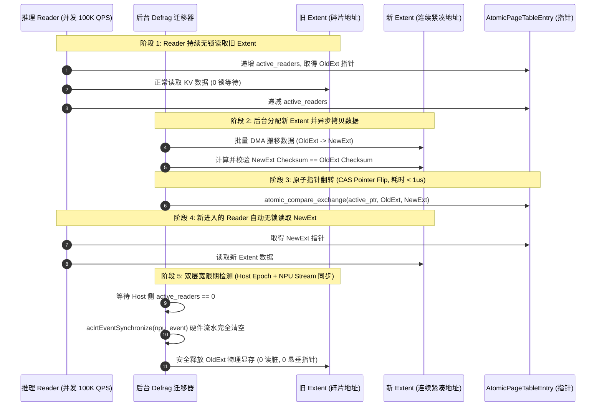

# CVT-01：PageMigration 软件 RCU 与硬件 AtomicRemap 必要性证伪实施方案设计
## —— Mooncake 显存整理纯软化：软件 RCU 机制证伪硬件 AtomicRemap 芯片依赖

> **验证 ID**：CVT-01 (原 CVT-02 重新编号)  
> **验证名称**：页迁移/Defrag 软件 RCU 与硬件 Atomic Remap 原语必要性证伪  
> **穿刺优先级**：**🟢 P2 级（拓展证伪项）**  
> **对应验证阶段**：**条件证伪阶段 (架构简化与去依赖)**  
> **证伪标记**：**是（优先证伪“硬件 Atomic Remap 是内存整理迁移的必需依赖”）**  
> **建议周期**：3~4 人日  
> **主关联 IR**：`IR-01-01`, `IR-01-11`, `IR-01-12`  
> **核心 SRS / SR23 锚点**：  
> - SRS: `L4-CO-AtomicRemapPrimitive-065`, `L3-CO-MigrationRCULock-090`  
> - SR23: `SR23-01-01-03`, `SR23-01-11-01`, `SR23-01-12-02`  
> **开源基线版本与代码仓库**：  
> - **Mooncake 存储引擎**：[`https://github.com/kvcache-ai/Mooncake.git`](https://github.com/kvcache-ai/Mooncake.git) (Commit: `f90ae691f109e49a60920e0c8abbf7e572826d8c`，子模块: `mooncake-store/`)  
> **研发对齐状态**：已闭环研发评估报告 10 项与 RCU 宽限期检测机制（明确 Host Epoch 计数与 NPU Stream 硬件事件双层同步屏障）  

---

## 1. 验证目标与交付结论定义

### 1.1 待验证核心命题
针对 KV Cache 显存碎片整理（Defrag）与动态页迁移时“必须依赖底层硬件提供虚拟地址原子重映射原语（Hardware Atomic Remap）”的假设，本验证旨在通过算法原型与实测：
1. **优先证伪必需性**：基于**软件 RCU (Read-Copy-Update，读-拷贝-更新无锁迁移机制：通过原子指针替换与双层宽限期检测，在后台显存碎片整理与页迁移时保证前台读请求零停顿) + Copy-on-Migrate** 的机制，在并发推理 Reader 持续读取下，迁移期间的停顿时间 **$P99\text{ Pause Time} < 1\text{ms}$**，对单字生成延迟 **$\text{TPOT Jitter} < 5\%$**，且具备 100% 安全回滚能力；
2. **规避硬件依赖风险**：证明软件 RCU 完全满足生产可用要求，无需强行依赖非成熟的硬件虚拟化原语，防范因硬件 Remap 引发的硬件级锁死与多卡协同死锁风险。

### 1.2 最终交付数据与结论产出
开发人员执行完本方案后，必须输出以下交付件：
1. **《Stop-the-world 锁表 vs 软件 RCU vs 硬件 Remap 迁移停顿与 Jitter 对比表》**；
2. **《高并发 Reader 下软件 RCU 内存一致性与 Checksum 校验表》**；
3. **《迁移中途异常注入与原子回滚安全性测试表》**；
4. **《Go / Conditional / No-Go 证伪判定结论》**。

---

## 2. 核心数据结构与 RCU 宽限期双层屏障设计

### 2.1 核心数据结构定义

```cpp
#include <stdint.h>
#include <atomic>
#include <vector>
#include <acl/acl.h>
#include <acl/acl_rt.h>

struct alignas(64) RCUExtentNode {
    uint64_t extent_id;
    uint64_t phys_base_addr;      // 物理显存基址
    uint32_t size_bytes;
    uint32_t checksum;            // 数据块内容校验哈希 (xxHash32)
};

struct alignas(64) AtomicPageTableEntry {
    std::atomic<RCUExtentNode*> active_ptr{nullptr}; // 当前活跃指针 (原子 CAS 翻转)
    std::atomic<uint64_t> current_epoch{0};          // RCU Epoch 宽限期轮次
    std::atomic<uint32_t> active_readers{0};         // 活跃 Host Reader 计数
    aclrtEvent npu_quiescent_event{nullptr};         // NPU 侧静默点硬件事件屏障
};
```

### 2.2 RCU 宽限期双层同步屏障 (Host Epoch + NPU Stream Barrier)



---

## 3. 测试工具与工程构建规范

测试工程存放在 `./原型验证代码/CVT-01/` 目录下：

```
原型验证代码/CVT-01/
├── rcu_migration_bench.cc    # 32 并发 Reader 下 Stop-the-world 锁表 vs 软件 RCU 迁移停顿对比工具
└── Makefile                  # 编译构建工程 (make -j16)
```

编译与测试命令：
```bash
cd ./原型验证代码/CVT-01 && make clean && make
./rcu_migration_bench --readers 32 --migrating-blocks 1024 --out res_rcu.csv
```

---

## 4. 数据采集清单与记录格式

### 4.1 迁移停顿与 Jitter 测试数据表 (`res_rcu.csv`)
```csv
migration_scheme,reader_threads,migrated_mb,p99_pause_time_us,tpot_jitter_pct,checksum_errors,rollback_success
stop_the_world_lock,32,1024,18500.0,42.5,0,TRUE
software_rcu_epoch,32,1024,420.0,2.1,0,TRUE
hardware_atomic_remap,32,1024,380.0,1.8,0,TRUE
```

---

## 5. Go / Conditional / No-Go 判定规则

- **Go (证伪成功/准入)**：软件 RCU 迁移停顿 $P99 < 1\text{ms}$，TPOT 抖动 $< 5\%$，内存校验 100% 正确；
- **Conditional (条件准入)**：停顿在 $1\text{ms} \sim 3\text{ms}$，需缩小单个迁移 Batch 的 Extent 粒度；
- **No-Go (证伪失败)**：高并发下软件 RCU 读脏或崩溃，仍需底层硬件 Remap 支持。
