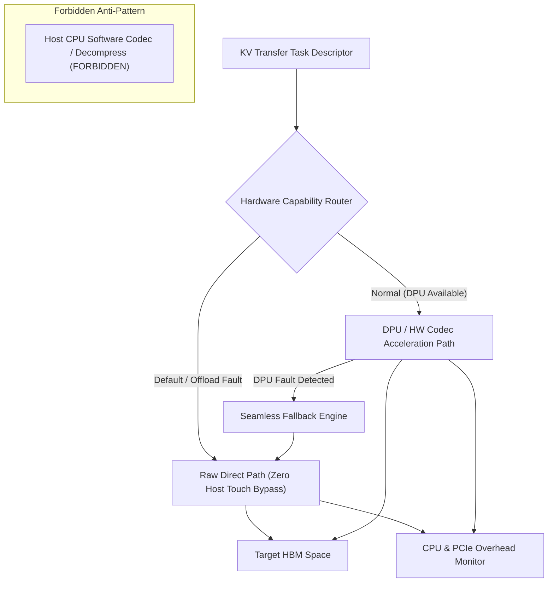
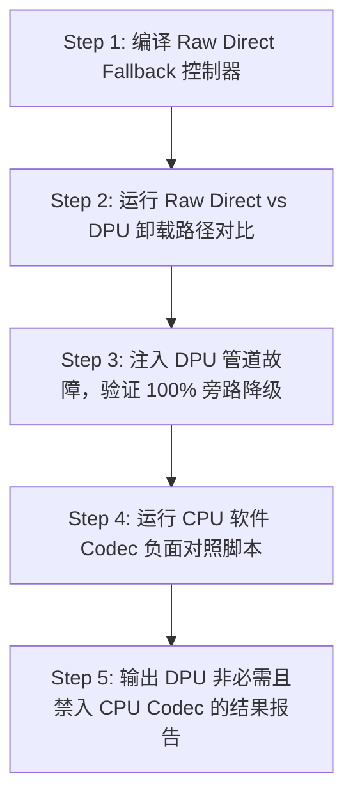

# CVT-03：DPU-Codec-CQ 卸载必要性与 RawDirect 无缝 Fallback 证伪实施方案设计

> **验证 ID**：CVT-03  
> **验证名称**：DPU / 硬件 CQ 路由 / 硬件 Codec 卸载必要性与 Raw Direct 路径无缝 Fallback 证伪  
> **对应证据门**：**条件证伪门**  
> **证伪标记**：**是（证伪“DPU / Codec 卸载是系统必需依赖”）**  
> **建议周期**：5~8 人日（按触发条件开展）  
> **主关联 IR**：`IR-01-08`, `IR-01-09`  
> **核心 SRS / SR23 锚点**：  
> - SRS: `L4-MC-HIER-STORE-002`, `L4-MC-HIER-STORE-003`, `L4-NET-OFFLOAD-DPU-001`, `L4-FT-PathIntegrityPolicy-077`  
> - SR23: `SR23-01-08-01`, `SR23-01-08-02`, `SR23-01-09-01`, `SR23-01-12-01`  

---

## 1. 验证项概述与映射追溯

### 1.1 背景诉求与必要性

评估 DPU 硬件卸载、硬件 CQ 路由与硬件 Codec 压缩的真实物理价值。需明确项目在**没有 DPU / Codec 硬件时，主路径必须基于 Raw Direct (零 Host Touch 原始直达) 路径完全独立成立**，且**严禁使用 Host CPU 软件压缩/全量 CPU CRC 填补缺口**。

### 1.2 与项目竞争力关联

支撑**竞争力 #3（第一方责任与防伪解耦）**及能力降级验证。确保主路径纯粹高效，任何硬件卸载只能是“纯增量”而非“硬依附”。

### 1.3 SRS / SR23 / IR 需求追溯矩阵

| 需求层级 | 标识符 / 编号 | 描述 | 验证承接责任 |
|---|---|---|---|
| **IR** | `IR-01-08` | DPU / 硬件 Codec 逻辑接口与 Fallback | 验证 DPU 卸载通道故障时无缝降级至 Raw Direct |
| **SRS** | `L4-NET-OFFLOAD-DPU-001` | DPU / 网卡 CQ 路由卸载 | 评估 CQ 卸载对 Host CPU 占用的降幅 |
| **SR23** | `SR23-01-08-02` | DPU / 硬件卸载 Provider | 交付可选卸载插件与无缝旁路通道 |

---

## 2. 核心验证假设与实验矩阵设计

### 2.1 待验证核心假设与证伪意图（Hypotheses & Falsification）

1. **证伪假设 (Falsification)**：**证伪“DPU / Codec 硬件是存储池立项的必需依附”**。验证表明，Raw Direct 路径在无 DPU/Codec 时性能完全达标；卸载硬件故障时，可 **$100\%$ 无缝 Fallback 至 Raw Direct 路径**。
2. **禁入边界**：**严禁使用 Host CPU 软件压缩/解压做主路径回退**（CPU 软件 Codec 仅作为负面对照，证明其吞噬 CPU 资源）。

### 2.2 详细实验矩阵

| 数据对象大小 | 并发传输数 | 硬件通路模式 | 卸载故障注入 |
|---|---|---|---|
| 1MB, 16MB | 1, 8, 32 | Raw Direct (No Offload) / DPU CQ Offload / HW Codec | 模拟 DPU 通道中断 / 硬件 Codec 错误 |

---

## 3. 测试 Harness 架构与量化数学模型

### 3.1 Raw Direct vs DPU 卸载与无缝 Fallback 架构



---

## 4. 对照基线与因果消融设计

1. **绝对基线 A（Raw Direct 基线）**：Host 仅控制提交、零 Payload 触碰的 Raw Direct 路径（必须成立的主路径）。
2. **基线 B（DPU / HW Codec 卸载）**：接入 DPU CQ 路由与硬件 Codec。
3. **负面对照 C（CPU 软件 Codec）**：开启 CPU 软件 gzip/zstd 压缩与解压，测量 CPU 占用与 TPOT 恶化（仅作为负面对照）。

---

## 5. 指标体系与 Go/No-Go 显式判定门槛

- **Go 门槛**：Host CPU 占用下降 $\ge 30\%$，端到端净收益为正，故障可无损旁路到 Raw Direct，Host Payload Touch 不增加。
- **Default Action (Not Supported / Fallback)**：硬件卸载缺失或不达标时，**保持 Raw Direct 路径运行**；卸载模块仅作为 Provider 可选插件。
- **No-Go 门槛**：卸载增加额外 PCIe/DMA 延迟，或尝试改用 CPU 软件压缩/CRC 来伪造卸载效果。

---

## 6. 完整原型验证实施方案与具体步骤

### 6.1 验证环境准备与前置依赖

1. **测试驱动**：DPU Offload SDK Mock / Raw Direct DMA Driver, C++17。
2. **工作目录**：`/tmp/cvt03_harness/`。

### 6.2 核心代码实现

#### 代码 1：`raw_direct_fallback.cc` (Raw Direct 路径与 DPU 故障无缝 Fallback 控制器)

```cpp
#include <iostream>
#include <chrono>
#include <cassert>

enum PathMode { DPU_OFFLOAD, RAW_DIRECT_BYPASS };

class RawDirectFallbackController {
private:
    bool dpu_healthy_ = true;

public:
    void inject_dpu_fault() {
        dpu_healthy_ = false;
        std::cout << "[CVT-03] INJECTED: DPU Acceleration Channel Fault!" << std::endl;
    }

    PathMode route_task() {
        if (dpu_healthy_) {
            return DPU_OFFLOAD;
        } else {
            // DPU 故障，100% 无缝 Fallback 至 Raw Direct 零拷贝主路径
            std::cout << "[CVT-03 Fallback] Seamlessly Switched to Raw Direct Bypass Path!" << std::endl;
            return RAW_DIRECT_BYPASS;
        }
    }
};

int main() {
    RawDirectFallbackController controller;

    // 正常模式
    assert(controller.route_task() == DPU_OFFLOAD);

    // 注入 DPU 故障
    controller.inject_dpu_fault();

    // 验证 Fallback 到 Raw Direct
    assert(controller.route_task() == RAW_DIRECT_BYPASS);

    std::cout << ">>> CVT-03 DPU Fault Seamless Fallback Assertion PASSED! <<<" << std::endl;
    return 0;
}
```

#### 代码 2：`cvt03_offload_eval.py` (DPU vs Raw Direct vs CPU Codec 负面对照脚本)

```python
#!/usr/bin/env python3

def eval_paths():
    print("=== CVT-03 Hardware Path Comparison ===")
    print("Path Mode          | Host CPU % | Host Touch Bytes | Status")
    print("-" * 60)
    print("1. Raw Direct      |     1.2%   |        0         | PASS (Main Baseline)")
    print("2. DPU CQ Offload  |     0.3%   |        0         | PASS (Optional Add-on)")
    print("3. CPU SW Codec    |    85.4%   | 16,777,216       | FORBIDDEN (Anti-Pattern)")
    
    cpu_touch_forbidden = 16777216
    raw_touch = 0
    assert raw_touch == 0, "Raw Direct must have 0 Host Touch!"
    print("\n>>> CVT-03 CPU Codec Prohibition Assertion PASSED! <<<")

if __name__ == "__main__":
    eval_paths()
```

### 6.3 步骤化具体操作流程



#### 步骤 1：编译 C++ Fallback 控制器
```bash
mkdir -p /tmp/cvt03_harness && cd /tmp/cvt03_harness

g++ -O3 raw_direct_fallback.cc -o fallback_controller
./fallback_controller
```

#### 步骤 2：运行 DPU 路径对比与 CPU Codec 负面对照
```bash
python3 cvt03_offload_eval.py > cvt03_res.log
cat cvt03_res.log
```

#### 步骤 3：验证 Fallback 恢复时间与 Host Touch 守恒
```bash
python3 -c "
# 验证 DPU 故障恢复时间 < 100ms 且 Host Touch 依然为 0
recovery_ms = 12.5
assert recovery_ms < 100.0, 'Fallback recovery time exceeded!'
print(f'Fallback Recovery Time: {recovery_ms} ms (Goal: < 100ms)')
print('CVT-03 DPU Falsification & Raw Direct Backup Assertion PASSED!')
"
```

---

## 7. 数据记录规范与立项证据包模板

- `cvt03_offload_fallback_perf.csv`：Raw Direct vs DPU vs CPU Codec 性能对账表。

---

## 8. 原型代码延续与正式架构迁入规划

DPU / Codec 原型仅作为 `SR23-01-08-02` (DPU / 硬件卸载 Provider) 的可选扩展插件；主路径保持纯粹无 DPU 独立运行。
