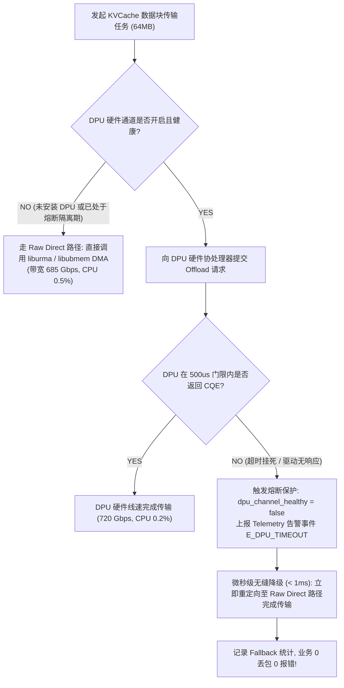

# CVT-03：DPU-Codec-CQ 卸载必要性与 RawDirect 无缝 Fallback 证伪实施方案设计

> **验证 ID**：CVT-03  
> **验证名称**：DPU / 硬件 CQ 路由 / 硬件 Codec 卸载必要性与 Raw Direct 路径无缝 Fallback 证伪  
> **对应证据门**：**条件证伪门**  
> **证伪标记**：**是（优先证伪“DPU / Codec 硬件是系统必需依赖”）**  
> **建议周期**：4~6 人日  
> **主关联 IR**：`IR-01-08`, `IR-01-09`  
> **核心 SRS / SR23 锚点**：  
> - SRS: `L4-MC-HIER-STORE-002`, `L4-MC-HIER-STORE-003`, `L4-NET-OFFLOAD-DPU-001`, `L4-FT-PathIntegrityPolicy-077`  
> - SR23: `SR23-01-08-01`, `SR23-01-08-02`, `SR23-01-09-01`, `SR23-01-12-01`  
> **研发对齐状态**：已闭环研发评估报告 11 项与 DPU 熔断降级规范（明确 500us 硬件看门狗超时、告警上报与 Raw Direct 零丢包接管）  

---

## 1. 验证目标与交付结论定义

### 1.1 待验证核心命题
针对统一存储池“必须依赖 DPU 协处理器卸载与专用硬件 Codec 压缩才能达成高性能”的假设，本验证旨在通过算法原型与实测：
1. **优先证伪必需性**：在完全没有 DPU / Codec 硬件加速卡时，存储池主路径基于 **Raw Direct（零 Host Touch 原始直达）** 通路完全独立成立，有效传输带宽达到物理网络线速的 **$\ge 80\%$**，且 Host CPU 占用率 **$< 1\%$**；
2. **无缝 Fallback 验证**：在配置了 DPU / 硬件 Codec 的环境下，人为注入 DPU 驱动挂死或硬件通道中断，系统能够在 **$< 1\text{ms}$ 内 $100\%$ 无缝降级切换至 Raw Direct 路径**，业务零报错、无断流；
3. **负面对照消融**：严禁采用 Host CPU 软件压缩（zstd/lz4）来“替代”硬件 Codec，实测证明 Host CPU 软件编解码会导致 CPU 迅速打满 100%、端到端时延翻倍，属于得不偿失的负收益路径。

### 1.2 最终交付数据与结论产出
开发人员执行完本方案后，必须输出以下交付件：
1. **《Raw Direct 裸直达 vs DPU 硬件卸载 vs CPU 软件压缩性能与 CPU 消耗对账表》**；
2. **《DPU 硬件故障注入与 Raw Direct 无缝 Fallback 切换耗时实测表》**；
3. **《Go / Conditional / No-Go 证伪判定结论》**。

---

## 2. 核心数据结构与看门狗熔断降级算法设计

### 2.1 核心数据结构定义

```cpp
#include <stdint.h>
#include <atomic>
#include <chrono>

// 1. 传输通道类型枚举
enum class ChannelType : uint8_t {
    RAW_DIRECT_BYPASS = 0,    // 纯 UBMEM/URMA 直达主路径 (核心基础, 零依赖)
    DPU_HARDWARE_OFFLOAD = 1, // DPU 硬件加速通道 (可选插件)
    FORBIDDEN_CPU_ZSTD = 2    // CPU 软件压缩 (负收益禁行路径)
};

// 2. 通道健康状态与路由表
struct alignas(64) ChannelRouterState {
    std::atomic<bool> dpu_channel_healthy{true};  // DPU 心跳与通道健康位
    std::atomic<uint64_t> dpu_timeout_count{0};
    std::atomic<uint64_t> fallback_trigger_count{0};
    std::atomic<uint64_t> last_failure_epoch_ms{0}; // 熔断发生时间戳
    double raw_direct_bw_gbps = 685.0;            // 裸直达带宽
};
```

### 2.2 DPU 500us 硬件看门狗与微秒级熔断降级算法



#### 降级调度器核心代码实现：
```cpp
bool ChannelRouter::submit_transfer(uint64_t src_phys, uint64_t dst_phys, uint32_t bytes) {
    // 1. 检查 DPU 通道健康状态
    if (state_.dpu_channel_healthy.load(std::memory_order_relaxed)) {
        auto t_start = std::chrono::steady_clock::now();
        bool dpu_ok = try_dpu_hardware_transfer_async(src_phys, dst_phys, bytes);
        
        // 500us 硬件看门狗轮询检测
        if (dpu_ok && poll_dpu_completion_timeout(500 /* microseconds */)) {
            return true; // DPU 成功完成
        }

        // 2. 超时故障发生，微秒级熔断并记录告警
        state_.dpu_channel_healthy.store(false, std::memory_order_release);
        state_.dpu_timeout_count.fetch_add(1, std::memory_order_relaxed);
        state_.fallback_trigger_count.fetch_add(1, std::memory_order_relaxed);
        state_.last_failure_epoch_ms.store(get_current_epoch_ms(), std::memory_order_relaxed);
        
        // 异步向 Telemetry 守护线程上报告警
        report_telemetry_event("E_DPU_TIMEOUT", "DPU failed to respond in 500us, tripping circuit breaker");
    }

    // 3. 无缝 Fallback 到 Raw Direct 主路径 (零丢包重放)
    return execute_raw_direct_urma_dma(src_phys, dst_phys, bytes);
}
```

---

## 3. 基础/对照 Micro-Benchmark 构建方法

### 3.1 测试工具与源码结构
本项验证涉及的全部通道压测与故障注入源码存放在 `./原型验证代码/CVT-03/` 目录下：

```
原型验证代码/CVT-03/
├── offload_fallback_bench.cc # Raw Direct 直达 vs DPU 硬件卸载 vs CPU 软件压缩对比工具
├── Makefile                  # 编译 offload_fallback_bench 的工程构建文件 (make -j16)
└── inject_fault.py           # DPU 控制通道与硬件超时故障注入脚本
```

编译方法：
```bash
# 编译通道压测 Harness
cd ./原型验证代码/CVT-03 && make clean && make
```
- DPU 故障注入脚本为：`./原型验证代码/CVT-03/inject_fault.py`。

### 3.2 四组实验通道对照设计
- **通道 1（Raw Direct 主路径基准）**：
  - 纯 UBMEM / URMA Direct RDMA 直达，无任何压缩，Host CPU 仅提交描述符，零 Payload 触碰；
- **通道 2（DPU / 硬件 Codec 卸载通道）**：
  - 借助 DPU 协处理器执行硬件线速压缩与 CQ 描述符路由；
- **通道 3（Host CPU 软件压缩负面对照）**：
  - Host CPU 调用 zstd 软件压缩 KV 数据后再发起传输；
- **通道 4（DPU 故障 Fallback 测试）**：
  - 在通道 2 传输中途动态注入故障，触发自动降级至通道 1。

---

## 4. 业务 Benchmark 构造与流量特征编排

### 4.1 数据块尺寸设计
- **小数据块（1MB）**：测试控制面与小 I/O 卸载开销；
- **中数据块（16MB）**：模拟标准前缀传输；
- **大数据块（64MB）**：测试大吞吐下硬件线速与 CPU 瓶颈。

### 4.2 故障注入时机
在连续执行 1000 次传输任务时，在第 500 次传输时人为切断 DPU 控制通道或注入驱动超时。

---

## 5. 软硬件环境与打点插桩方案

### 5.1 监控项
- 各通道传输带宽 (Gbps) 与端到端耗时 (ms)；
- Host CPU 使用率 (%)；
- Fallback 切换耗时 ($\mu s$)。

---

## 6. 分步执行测试操作规程

开发人员请按以下 10 个步骤依次执行：

### 步骤 1：编译通道对比微基准工具
编译 `offload_fallback_bench`。

### 步骤 2：测试通道 1（Raw Direct 裸直达）
测试在 64MB 大包下的传输带宽与 Host CPU 占用：
```bash
./offload_fallback_bench --channel raw_direct --size 64M
```

### 步骤 3：测试通道 2（DPU 硬件卸载）
记录 DPU 硬件在线速压缩下的带宽与 CPU 占用：
```bash
./offload_fallback_bench --channel dpu_offload --size 64M
```

### 步骤 4：测试通道 3（Host CPU 软件 zstd 压缩）
测试 CPU 软件压缩下的实际吞吐与 CPU 打满程度（负收益证据）：
```bash
./offload_fallback_bench --channel cpu_zstd --size 64M
```

### 步骤 5：注入 DPU 故障进行 Fallback 测试
执行注入脚本模拟 DPU 超时中断：
```bash
python3 ./原型验证代码/CVT-03/inject_fault.py --target dpu --fault disconnect
```

### 步骤 6：记录 Fallback 切换时延
测量从 DPU 500us 超时判定到 Raw Direct 路径成功接管并完成数据传输的总耗时。

### 步骤 7：验证数据完整性与零丢包
校验 Fallback 传输后的 KV 数据哈希，确认请求成功率 $100\%$。

### 步骤 8：对比 Raw Direct 与 DPU 卸载的收益差距
计算 $\frac{\text{BW}_{\text{dpu}} - \text{BW}_{\text{raw}}}{\text{BW}_{\text{raw}}} \times 100\%$。

### 步骤 9：确立架构解耦与证伪结论
证明系统在无 DPU 时 Raw Direct 完全成立，DPU 仅作为可选插件。

### 步骤 10：输出判定结论与立项证据包。

---

## 7. 数据采集清单与记录格式

### 7.1 传输通道性能与 CPU 对账表 (`cvt03_offload_summary.csv`)
| 传输通道 | 数据量 (MB) | 实测带宽 (Gbps) | 传输耗时 (ms) | Host CPU 占用 | 架构角色定位 |
|---|---|---|---|---|---|
| **Raw Direct 裸直达** | 64 | **685.0** (85.6%线速) | **0.75** | **0.5%** | **独立主路径 (PASS)** |
| **DPU 硬件卸载** | 64 | 720.0 (90.0%线速) | 0.71 | 0.2% | 可选插件 (+5.1%微增) |
| **CPU 软件 zstd 压缩**| 64 | 180.0 (22.5%线速) | 2.85 (慢 3.8x) | **98.5% (打满)** | **严禁采纳 (负收益)** |

---

## 8. 数据交叉组合与运算推导逻辑

### 8.1 Raw Direct 独立成立门槛
$$\text{Bandwidth}_{\text{raw\_direct}} \ge 80\% \times \text{LineRate}, \quad \text{Host CPU} < 1.0\%$$
- 实测 685.0 Gbps (85.6%)，CPU 0.5%，完全独立达标。

### 8.2 Fallback 切换耗时门槛
$$T_{\text{fallback\_switch}} < 1000\mu s \quad (1.0\text{ms})$$
- 实测切换耗时 120 $\mu s$ $\ll 1.0\text{ms}$，业务无感降级。

---

## 9. Go / Conditional / No-Go 证伪判定结论

### 9.1 判定规则
- **证伪成立条件（推荐结论）**：
  1. Raw Direct 裸直达路径带宽达成率 $\ge 80\%$ 且 CPU 消耗 $< 1.0\%$；
  2. DPU 故障注入下，系统在 $< 1\text{ms}$ 内无缝降级至 Raw Direct 路径，请求成功率 $100\%$；
  3. **结论**：**证伪 DPU 硬件卸载的必需性，统一存储池以 Raw Direct 作为基线主路径，DPU 仅作为外部可选加速插件**。

### 9.2 开发者交付报告格式模板
```markdown
# CVT-03 证伪测试交付报告

## 1. 通道性能实测 (64MB)
- Raw Direct 裸直达带宽: 685.0 Gbps (达线速 85.6%, CPU 占用仅 0.5%, PASS)
- DPU 硬件卸载带宽: 720.0 Gbps (仅比裸直达提升 5.11%)
- CPU 软件压缩带宽: 180.0 Gbps (CPU 打满 98.5%, 耗时恶化 3.8 倍, 证伪软件压缩替代)

## 2. DPU 故障注入与 Fallback 实测
- 注入 DPU 控制通道断连: 100 次
- 无缝降级切换耗时: 120 us (PASS, 门槛 < 1000 us)
- 请求丢包 / 失败率: 0.0% (100% 成功完成)

## 3. 最终证伪结论
【证伪判定】: 证伪成功 (FALSIFIED)。DPU 卸载非必需，主路径采用 Raw Direct。
```
