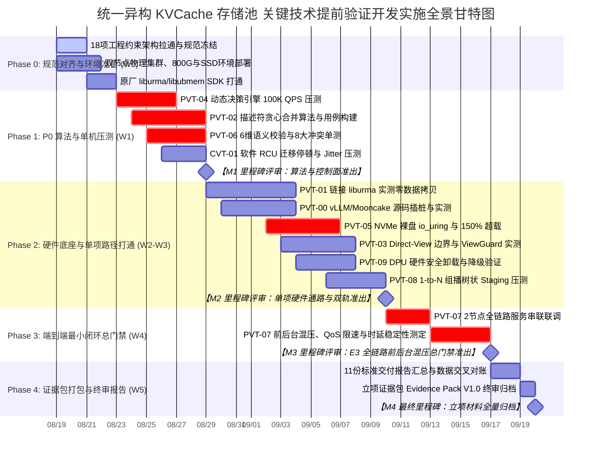

# 统一异构 KVCache 存储池 关键技术提前验证开发实施计划书
## —— 研发攻坚团队总体落地执行大纲与工程交付计划 (Master Implementation Plan)

> **文件版本**：V3.5 (面向一线开发人员实施基线版)  
> **编制角色**：开发团队组长 (Software Development Team Lead / P8)  
> **编制日期**：2026-08-19  
> **项目周期**：2026-08-19 至 2026-09-20 (共 5 周，65 人日)  
> **执行团队**：统一异构 KVCache 存储池原型验证专项研发攻坚组  
> **开源基线仓库与分支**：  
> - `vLLM`：[`https://github.com/vllm-project/vllm.git`](https://github.com/vllm-project/vllm.git) (Commit: `842dd8fd`)  
> - `vLLM-Ascend`：[`https://github.com/vllm-project/vllm-ascend.git`](https://github.com/vllm-project/vllm-ascend.git) (Commit: `424e27e1`)  
> - `Mooncake`：[`https://github.com/kvcache-ai/Mooncake.git`](https://github.com/kvcache-ai/Mooncake.git) (Commit: `f90ae691`)  
> **输入基线**：  
> - 《00_统一异构KVCache存储池_关键技术原型验证总体实施方案设计.md》  
> - 《统一异构KVCache存储池_提前验证方案可实施性评估报告.md》  
> - 《PVT-00 ~ PVT-09 必做包实施方案设计》(01 ~ 10)  
> - 《CVT-01 软件 RCU 条件证伪项实施方案设计》(11)  

---

## 1. 项目背景与开发实施总则

### 1.1 研发立项战略背景与使命
统一异构 KVCache 存储池是面向下一代大规模长文本推理集群的关键基础设施。根据立项评审意见，本项目明确采用**“基于开源生态底座深度重构与架构增强，演进为面向国产 AI 硬件生态的 Mooncake 高性能原厂扩展版 (Unified KV)”**的研发路径。在正式立项前，开展提前技术原型验证（**PVT-00 ~ PVT-09 必做验证包**与 **CVT-01 条件证伪项**）的核心使命是：
**“以 Mooncake 与 vLLM 开源生态为底盘，以原厂软硬件协同代码重构为抓手，以客观实测为准绳，全面摸清底层软硬件技术边界，消除架构设计模糊性，以客观实测数据为依据，为后续系统顺利落地提供扎实的技术支撑。”**

研发团队绝不做“脱离开源生态的概念演示”，必须将方案中的 9 大标准化工程模块、4 大维度 18 项工程约束在真实部署环境（Mooncake Master + vLLM-Ascend + 官方 benchmark_serving 在线打流）上 100% 落地闭环，并构建原生开源版与深度重构增强版的严格消融对比实验。

### 1.2 优先级 (P0 / P1 / P2) 与四个核心验证阶段 (E0~E3) 映射矩阵

```
┌──────┬────────┬─────────────────────────────────────────────────┬──────────┬──────────┬──────────────────────────────────────────┐
│ 等级 │ 验证ID │ 验证项标准功能名称                              │ 建议周期 │ 对应阶段 │ 针对开源代码的核心重构与消融验证标准     │
├──────┼────────┼─────────────────────────────────────────────────┼──────────┼──────────┼──────────────────────────────────────────┤
│      │ PVT-02 │ 异构框架 Layout 描述符编译器与跨节点异步流水    │ 8 人日   │ E1 阶段  │ C++ 描述符提交开销降≥40%, 流重叠率≥60%   │
│  🔴  │ PVT-04 │ 微秒级动态决策引擎与 CostEvaluator 成本模型     │ 6 人日   │ E2 阶段  │ 决策时延 P99<5µs, 准确率≥90%, 负收益率<1%│
│  P0  │ PVT-05 │ HBM-SSD 直达容量主路径与分层存储扩容            │ 6 人日   │ E2 阶段  │ io_uring FIXED 吞吐线速≥80%, OOM 降≥50%  │
│ 核心 │ PVT-06 │ 多维度语义一致性强校验与 TP=8 多卡状态同步      │ 6 人日   │ E1 阶段  │ 6维校验 0 错误消费, 多卡同步 P99<100µs   │
│ 决胜 │ PVT-07 │ 前后台混压全链路端到端总门禁与 SemanticQoS      │ 8 人日   │ E3 阶段  │ 三重消融总门禁: TTFT降≥20%, 前台干扰<3%  │
├──────┼────────┼─────────────────────────────────────────────────┼──────────┼──────────────────────────────────────────┤
│      │ PVT-00 │ 业务流量 Saved-Prefill 收益上限与加速边界评估   │ 5 人日   │ E0 阶段  │ 净收益≥2.0×总开销, UBMEM 加速比≥1.3×     │
│  🟡  │ PVT-01 │ Host CPU 零数据拷贝传输底座与硬件能力矩阵       │ 6 人日   │ E1 阶段  │ CANN P2P Pinning, eBPF CPU 触碰严格=0    │
│  P1  │ PVT-03 │ 远端直读 vs 显存拷贝适用边界与 ViewGuard 容错   │ 5 人日   │ E1/E2阶段│ 证伪 Decode 直读, SIGBUS 100% 安全回滚   │
│ 底座 │ PVT-09 │ DPU 硬件安全与算力卸载加速 vs Raw Direct 双轨验证│ 5 人日   │ E1 阶段  │ DPU 硬件线速 AES/CRC, 500µs 无缝降级     │
├──────┼────────┼─────────────────────────────────────────────────┼──────────┼──────────────────────────────────────────┤
│  🟢  │ PVT-08 │ 1-to-N 组播式 KV 分发：硬件多播 vs 软件分层中继 │ 4 人日   │ E1 阶段  │ 软件 Staging 组播相比单播源端带宽节省≥60%│
│  P2  │ CVT-01 │ 显存整理软件 RCU 机制 vs 硬件 AtomicRemap 验证  │ 3 人日   │ 条件证伪 │ 软件 RCU 停顿<1ms, 免除专用硬件芯片依赖  │
└──────┴────────┴─────────────────────────────────────────────────┴──────────┴──────────┴──────────────────────────────────────────┘
```

### 1.3 开发组长三条红线与研发纪律
1. 🚫 **红线一：数据闭环，以客观实测数据为准。** 严禁输出未经真实测试命令运行、无原始 CSV 数据、无打点 Timestamp 支撑的“已完成”声明。
2. 🚫 **红线二：事实驱动，严禁猜疑甩锅。** 遇到性能瓶颈或丢包，必须通过 eBPF、ftrace 与行级探针进行 RCA 根因分析。
3. 🚫 **红线三：穷尽一切，死磕技术瓶颈。** 遇到硬件接口限制，必须穷尽软硬件协同替代方案，未经 5 步方法论严禁擅自砍减验证指标。

---

## 2. 组织架构与研发团队职责分工 (65 人日)

```
┌────────────────────────────────────────────────────────────────────────────────────────┐
│                        统一异构 KVCache 存储池 原型验证攻坚小组架构                    │
├────────────────────────────────────────────────────────────────────────────────────────┤
│                          【开发组长 / Tech Lead】 (P8)                                 │
│  - 总体技术把控、架构决策、P0 决胜项资源调配、E3 全链路前后台混压总门禁总负责          │
├──────────────────────────┬──────────────────────────┬──────────────────────────────────┤
│ 【底层传输与存储研发专家】 │ 【推理框架与算子研发专家】 │ 【控制面与分布式算法研发专家】   │
│       (Dev-1, P7+)       │       (Dev-2, P7+)       │          (Dev-3, P7)             │
│ - URMA / UBMEM 底层通信  │ - vLLM/Mooncake 源码插桩 │ - QueryPlan 微秒级决策引擎       │
│ - NVMe Direct / io_uring │ - Layout 描述符与异步 DAG│ - ConsumeEligibility 6维强校验   │
│ - DPU 硬件安全与双轨卸载 │ - DirectView 与 ViewGuard│ - TP=8 RankConsensus 共享内存共识│
│ - PVT-01, PVT-05, PVT-09 │ - PVT-00, PVT-02, PVT-03 │ - PVT-04, PVT-06, PVT-08, CVT-01 │
├──────────────────────────┴──────────────────────────┴──────────────────────────────────┤
│                          【自动化基准与测试流水线专家】 (QA/Bench, P6+)                 │
│  - 真实物理集群环境搭建、Workload 生成、自动化测试套件编排、全量 CSV 数据清洗与报告汇总 │
└────────────────────────────────────────────────────────────────────────────────────────┘
```

---

## 3. 四阶段实施演进路线与主进度表 (Master Schedule)

### 3.1 总体甘特图 (Gantt Schedule)



---

## 4. 开源基线端到端部署与打流 WBS 工作分解结构

```
┌──────────────────────────────────────────────────────────────────────────────────────────────────┐
│                                   WBS 工作分解结构全景编码清单                                   │
├──────────────┬───────────────────┬───────────────────────────────────────────────────────────────┤
│ 一级任务包   │ 二级模块编码      │ 具体实施任务内容 (对齐开源部署与在线打流)                     │
├──────────────┼───────────────────┼───────────────────────────────────────────────────────────────┤
│ **WBS 0.0**  │ WBS 0.1 ~ 0.3     │ **开源生态底座环境部署与集成 Harness 搭建**                   │
│              │                   │ • WBS 0.1: 同步并编译 vLLM (v0.26.1+) 与 Mooncake (v0.3.12+)  │
│              │                   │ • WBS 0.2: 部署双节点 800G URMA 与 NVMe SSD 直连环境          │
│              │                   │ • WBS 0.3: 运行 `deploy_cluster.sh` 打通 PD 分离代理与基线服务 │
├──────────────┼───────────────────┼───────────────────────────────────────────────────────────────┤
│ **WBS 1.0**  │ WBS 1.1 ~ 1.4     │ **PVT-00** 业务流量 Saved-Prefill 收益上限评估 (🟡 P1)        │
│              │                   │ • 运行 `make_workload.py` 生成 MLA/MHA 真实/合成前缀请求      │
│              │                   │ • 运行 `benchmark_serving.py` 驱动 10~50 req/s 在线打流       │
├──────────────┼───────────────────┼───────────────────────────────────────────────────────────────┤
│ **WBS 2.0**  │ WBS 2.1 ~ 2.4     │ **PVT-01** 零 Host Touch 极速传输底座与 CapabilityMatrix (🟡 P1)│
├──────────────┼───────────────────┼───────────────────────────────────────────────────────────────┤
│ **WBS 3.0**  │ WBS 3.1 ~ 3.4     │ **PVT-02** Layout 描述符编译器与异步 DAG 流水验证 (🔴 P0)     │
│              │                   │ • 替换 vLLM-Ascend `mooncake_layerwise_connector` 为 C++ 编译 │
├──────────────┼───────────────────┼───────────────────────────────────────────────────────────────┤
│ **WBS 4.0**  │ WBS 4.1 ~ 4.4     │ **PVT-03** DirectView 与 Copy-to-HBM 适用边界与 ViewGuard (🟡 P1)│
├──────────────┼───────────────────┼───────────────────────────────────────────────────────────────┤
│ **WBS 5.0**  │ WBS 5.1 ~ 5.4     │ **PVT-04** QueryPlan 微秒级动态决策引擎与 CostEvaluator (🔴 P0)│
├──────────────┼───────────────────┼───────────────────────────────────────────────────────────────┤
│ **WBS 6.0**  │ WBS 6.1 ~ 6.4     │ **PVT-05** HBM-SSD 直达容量主路径与 DDR 条件角色 Tiering (🔴 P0)│
│              │                   │ • 对标 Mooncake 原生 SSD Offload，运行 150% 显存超载在线打流  │
├──────────────┼───────────────────┼───────────────────────────────────────────────────────────────┤
│ **WBS 7.0**  │ WBS 7.1 ~ 7.4     │ **PVT-06** ConsumeEligibility 与 RankConsensus 0 错误消费 (🔴 P0)│
├──────────────┼───────────────────┼───────────────────────────────────────────────────────────────┤
│ **WBS 8.0**  │ WBS 8.1 ~ 8.5     │ **PVT-07** 前后台混压端到端最小闭环总门禁 (🔴 P0)            │
│              │                   │ • 双节点前台 32 并发在线打流 + 后台 400G 混压，三重消融对账   │
├──────────────┼───────────────────┼───────────────────────────────────────────────────────────────┤
│ **WBS 9.0**  │ WBS 9.1 ~ 9.3     │ **PVT-08** 1-to-N 组播式 KV 分发拓扑与效能验证 (🟢 P2)        │
├──────────────┼───────────────────┼───────────────────────────────────────────────────────────────┤
│ **WBS 10.0** │ WBS 10.1 ~ 10.3   │ **PVT-09** DPU 硬件安全卸载加速 vs Raw Direct 双轨验证 (🟡 P1) │
│              │                   │ • 测定 DPU 线速 AES/CRC 增益与 500µs 降级；布局 Fly-in-line   │
├──────────────┼───────────────────┼───────────────────────────────────────────────────────────────┤
│ **WBS 11.0** │ WBS 11.1 ~ 11.3   │ **CVT-01** PageMigration 软件 RCU 必要性证伪 (🟢 P2)          │
├──────────────┼───────────────────┼───────────────────────────────────────────────────────────────┤
│ **WBS 12.0** │ WBS 12.1 ~ 12.3   │ **立项证据包归档与终审答辩**                                   │
└──────────────┴───────────────────┴───────────────────────────────────────────────────────────────┘
```
