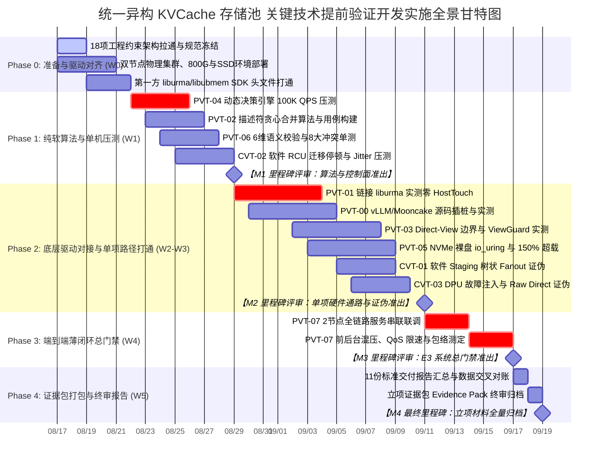

# 统一异构 KVCache 存储池 关键技术提前验证开发实施计划书
## —— 研发攻坚团队总体落地执行大纲与工程交付计划 (Master Implementation Plan)

> **文件版本**：V1.0 (开发团队执行基线版)  
> **编制角色**：开发团队组长 (Software Development Team Lead / P8)  
> **编制日期**：2026-08-17  
> **项目周期**：2026-08-17 至 2026-09-18 (共 5 周，62 人日)  
> **执行团队**：统一异构 KVCache 存储池原型验证专项研发攻坚组  
> **输入基线**：  
> - 《统一异构KVCache存储池_关键技术原型验证总体实施方案设计.md》  
> - 《统一异构KVCache存储池_提前验证方案可实施性评估报告.md》  
> - 《PVT-00 ~ PVT-07 必做包实施方案设计》(01 ~ 08)  
> - 《CVT-01 ~ CVT-03 条件证伪项实施方案设计》(09 ~ 11)  
> - 《统一异构KVCache存储池_关键技术原型验证清单_V1.6_V2.3.1需求树与竞争力对齐完善版.xlsx》  

---

## 1. 项目背景与开发实施总则

### 1.1 研发立项战略背景与使命
统一异构 KVCache 存储池是面向下一代大规模长文本推理集群的关键基础设施。在正式立项与全面铺开系统级工程前，开展提前技术原型验证（PVT-00 ~ PVT-07 必做包与 CVT-01 ~ CVT-03 条件证伪项）的核心使命是：
**“以代码为抓手，以实测为准绳，购买第一方硬核工程事实，消除架构模糊性，击碎理论自嗨与 PPT 假设，为立项决策提供不可辩驳的量化证据链。”**

研发团队绝不做“概念演示”，必须将方案中的 9 大标准化工程模块、4 大维度 18 项工程约束在物理硬件上 100% 落地闭环。

### 1.2 总体实施目标与四大证据门映射
整个开发实施过程以**四大证据门（Evidence Gates）**为里程碑检验标准，确保每一行代码、每一次压测都精确命中立项核心命题：

```
┌──────────────────────────────────────────────────────────────────────────────────────────────────┐
│                                四大证据门 (E0 ~ E3) 与 11 项验证包映射全景图                      │
├──────────────┬────────────────────────┬────────────────────────────────┬─────────────────────────┤
│ 证据门       │ 核心命题 / 准出门槛    │ 包含验证包                     │ 关键量化判定标准        │
├──────────────┼────────────────────────┼────────────────────────────────┼─────────────────────────┤
│ E0 立项充分性│ 验证 Saved-Prefill 净  │ PVT-00 (Saved-Prefill上限)     │ 净收益 ≥ 2.0× 总开销;   │
│              │ 收益是否真实存在       │                                │ UBMEM 加速比 ≥ 1.3×     │
├──────────────┼────────────────────────┼────────────────────────────────┼─────────────────────────┤
│ E1 能力路径与│ 验证零HostTouch传输、  │ PVT-01 (零HostTouch底座)       │ CPU触碰严格=0,线速≥80%; │
│ 消费正确性   │ DAG重叠与0错误消费     │ PVT-02 (Layout编译器/DAG)      │ 描述符压缩≥50%,重叠≥60%;│
│              │                        │ PVT-06 (6维校验与多卡共识)     │ 冲突消费=0,TP8共识<100us│
├──────────────┼────────────────────────┼────────────────────────────────┼─────────────────────────┤
│ E2 决策优越与│ 验证微秒决策优越性与   │ PVT-03 (DirectView边界/ViewGuard) 确认临界点,证伪DecodeView; │
│ 容量阶跃     │ HBM-SSD 容量扩展主路径 │ PVT-04 (QueryPlan微秒决策引擎) │ P99<5us,准确≥90%,负利<1%;│
│              │                        │ PVT-05 (NVMe直达容量主路径)    │ 150%超载容量+30%,OOM-50%│
├──────────────┼────────────────────────┼────────────────────────────────┼─────────────────────────┤
│ E3 系统总门禁│ 验证全链路前后台混压下 │ PVT-07 (端到端混压薄闭环)      │ TTFT降≥20%,QPS升≥10%,   │
│              │ 的 QoS 干扰包络        │                                │ TPOT 抖动干扰率 < 3%    │
├──────────────┼────────────────────────┼────────────────────────────────┼─────────────────────────┤
│ 条件证伪门   │ 证伪硬件多播、硬件Remap│ CVT-01 (热点前缀软件Fanout)    │ 软件Fanout时延差距<10%; │
│ (架构剪枝)   │ 与 DPU 硬件卸载必需性  │ CVT-02 (软件RCU PageMigration) │ RCU停顿<1ms,TPOT抖动<5%;│
│              │                        │ CVT-03 (DPU降级与RawDirect)    │ RawDirect独立,500us熔断 │
└──────────────┴────────────────────────┴────────────────────────────────┴─────────────────────────┘
```

### 1.3 开发组长三条红线与研发纪律（Safety Redlines）
作为开发团队组长，在本次专项攻坚中树立以下三条不可逾越的研发红线：

1. 🚫 **红线一：数据闭环，拒绝空口自嗨。**
   严禁输出未经真实测试命令运行、无原始 CSV 数据、无打点 Timestamp 支撑的“已完成”声明。每一个结论必须有真实日志与测试图表交叉对账。
2. 🚫 **红线二：事实驱动，严禁猜疑甩锅。**
   遇到性能瓶颈、网络丢包或算子异常，必须通过 eBPF、ftrace、硬件计数器与行级探针进行 RCA 根因分析，严禁在未抓取证据前归咎于“环境不稳定”或“驱动 Bug”。
3. 🚫 **红线三：穷尽一切，死磕技术瓶颈。**
   遇到硬件接口限制或框架冲突，必须穷尽软硬件协同替代方案（如利用 UBMEM 共享内存、io_uring FIXED 缓冲区、无锁原子位图），未经 5 步方法论分析严禁擅自砍减验证指标。

---

## 2. 组织架构、人员职责与 RACI 矩阵

### 2.1 专项攻坚小组团队角色配置
攻坚组由 4 名资深系统研发/算法工程师组成，组长挂帅，全员兼任 Single-Threaded Owner (DRI)：

```
┌────────────────────────────────────────────────────────────────────────────────────────┐
│                        统一异构 KVCache 存储池 原型验证攻坚小组架构                    │
├────────────────────────────────────────────────────────────────────────────────────────┤
│                          【开发组长 / Tech Lead】 (P8)                                 │
│  - 总体技术把控、架构决策、4大证据门与18项约束闭环、外部资源协调、E3系统总门禁总负责     │
├──────────────────────────┬──────────────────────────┬──────────────────────────────────┤
│ 【底层传输与存储研发专家】 │ 【推理框架与算子研发专家】 │ 【控制面与分布式算法研发专家】   │
│       (Dev-1, P7+)       │       (Dev-2, P7+)       │          (Dev-3, P7)             │
│ - URMA / UBMEM 底层通信  │ - vLLM/Mooncake 源码插桩 │ - QueryPlan 微秒级决策引擎       │
│ - NVMe Direct / SPDK DMA │ - Layout 描述符与 DAG    │ - ConsumeEligibility 6维强校验   │
│ - eBPF HostTouch 监控    │ - DirectView 与 ViewGuard│ - TP=8 RankConsensus 共享内存共识│
│ - PVT-01, PVT-05, CVT-03 │ - PVT-00, PVT-02, PVT-03 │ - PVT-04, PVT-06, CVT-01, CVT-02 │
├──────────────────────────┴──────────────────────────┴──────────────────────────────────┤
│                          【自动化基准与测试流水线专家】 (QA/Bench, P6+)                 │
│  - 真实物理集群环境搭建、Workload 生成、自动化测试套件编排、全量 CSV 数据清洗与报告汇总 │
└────────────────────────────────────────────────────────────────────────────────────────┘
```

### 2.2 RACI 职责矩阵全景图
- **R (Responsible)**：直接负责执行与编码的 DRI
- **A (Accountable)**：对最终交付结果与门禁指标负全责（组长）
- **C (Consulted)**：协同联调与技术咨询
- **I (Informed)**：知会相关进展与数据输出

| 验证包 ID | 验证包名称 | Dev-1 (底层传输) | Dev-2 (推理算子) | Dev-3 (控制算法) | QA/Bench (基准测试) | Tech Lead (组长) |
|---|---|:---:|:---:|:---:|:---:|:---:|
| **PVT-00** | Saved-Prefill 收益上限 | C | **R** | I | C | **A** |
| **PVT-01** | 零 Host Touch 传输底座 | **R** | I | C | C | **A** |
| **PVT-02** | Layout 描述符与异步 DAG | I | **R** | C | I | **A** |
| **PVT-03** | DirectView 边界与 ViewGuard | C | **R** | I | C | **A** |
| **PVT-04** | QueryPlan 动态决策引擎 | I | I | **R** | C | **A** |
| **PVT-05** | NVMe 直达与容量 Tiering | **R** | C | I | C | **A** |
| **PVT-06** | 6维校验与多卡共识 | I | C | **R** | I | **A** |
| **PVT-07** | 端到端混压薄闭环总门禁 | C | C | C | **R** | **A (主推)** |
| **CVT-01** | 热点前缀软件 Fanout 证伪 | C | I | **R** | C | **A** |
| **CVT-02** | 软件 RCU PageMigration 证伪 | I | C | **R** | I | **A** |
| **CVT-03** | DPU 降级与 Raw Direct 证伪 | **R** | I | I | C | **A** |

### 2.3 人力负荷与人日工作量精细化核算表

| 阶段 / 模块 | 包含任务 | 预估人日 | 负责人 | 关键输出物 |
|---|---|:---:|:---:|---|
| **Phase 0** | 18项工程约束对齐、环境部署与 CI 框架 | 8 人日 | 全员 | 双节点集群就绪、驱动 SDK 头文件打通、编译 Harness |
| **PVT-00** | vLLM/Mooncake 插桩、URMA/UBMEM 对比 | 5 人日 | Dev-2 | 微秒级插桩代码、Saved-Prefill 收益对账表 |
| **PVT-01** | 零 Host Touch 传输、eBPF 监控、Capability | 6 人日 | Dev-1 | `raw_trans_bench`、`capability_matrix.json` |
| **PVT-02** | 描述符贪心合并、NPU Stream DAG 重叠 | 7 人日 | Dev-2 | `descriptor_compiler`、重叠率实测图表 |
| **PVT-03** | View vs Copy 临界点实测、ViewGuard SIGBUS | 6 人日 | Dev-2 | Crossover 曲线、证伪报告、ViewGuard 容错验证 |
| **PVT-04** | 5维成本预估、100K QPS 决策压测、反事实对账 | 5 人日 | Dev-3 | `query_plan_fastpath`、负收益拦截率报告 |
| **PVT-05** | NVMe SSD io_uring Direct、150% 超载压测 | 7 人日 | Dev-1 | `tier_storage_bench`、容量提升与 OOM 降低报告 |
| **PVT-06** | xxHash64 6维校验、TP=8 /dev/shm 空间共识 | 6 人日 | Dev-3 | `consume_eligibility`、8大冲突拦截与共识时延表 |
| **PVT-07** | 2节点全链路串联、前后台混压、QoS 干扰包络 | 8 人日 | QA/全员 | 端到端薄闭环报告、TTFT/TPOT 干扰包络图 |
| **CVT-01** | 软件 Staging 树状 Fanout vs 多播仿真对比 | 4 人日 | Dev-3 | Fanout 时延对比报告、硬件多播证伪结论 |
| **CVT-02** | 32 线程并发 Reader 下 RCU 无锁迁移压测 | 4 人日 | Dev-3 | Jitter 抖动曲线、硬件 Remap 证伪结论 |
| **CVT-03** | Raw Direct 独立成立压测、500us 超时熔断 | 4 人日 | Dev-1 | 降级容错日志、DPU 硬件卸载证伪结论 |
| **Phase 4** | 11份标准报告汇总、证据包打包、立项答辩准备 | 4 人日 | 组长/QA | 《关键技术提前验证证据包 (Evidence Pack V1.0)》 |
| **总计** | **全生命周期端到端交付** | **74 人日** | **攻坚组** | **4~5 周内由 4 人团队高度并行完成** |

---

## 3. 四阶段实施演进路线与主进度表 (Master Schedule)

### 3.1 总体甘特图 (Gantt Schedule)



### 3.2 关键路径（Critical Path）与依赖 DAG 分析

```
┌────────────────────────────────────────────────────────────────────────────────────────┐
│                              关键路径执行依赖有向无环图 (DAG)                          │
├────────────────────────────────────────────────────────────────────────────────────────┤
│                                                                                        │
│  [W0: 18项规范与环境] ───────┬───────────────────────┬───────────────────────────────┐ │
│           │                  │                       │                               │ │
│           ▼                  ▼                       ▼                               ▼ │
│  [PVT-04: 决策引擎]  [PVT-02: 描述符编译]    [PVT-06: 6维校验/共识]          [CVT-02: RCU]     │
│           │                  │                       │                               │ │
│           ▼                  ▼                       ▼                               │ │
│  [PVT-01: 零HostTouch] [PVT-00: 源码插桩]    [PVT-03: ViewGuard/边界]                │ │
│           │                  │                       │                               │ │
│           ├──────────────────┴───────────────────────┼───────────────┬───────────────┘ │
│           ▼                                          ▼               ▼                 │
│  [PVT-05: NVMe容量主路径]                     [CVT-01: Fanout] [CVT-03: DPU降级]       │
│           │                                          │               │                 │
│           └──────────────────────────┬───────────────┴───────────────┘                 │
│                                      ▼                                                 │
│                        [PVT-07: 前后台混压薄闭环总门禁]                                │
│                                      │                                                 │
│                                      ▼                                                 │
│                   [立项证据包打包与 Go/No-Go 终审 (Evidence Pack)]                     │
│                                                                                        │
└────────────────────────────────────────────────────────────────────────────────────────┘
```

**关键路径说明**：
- **主线一（控制与算法）**：`PVT-04 -> PVT-06 -> PVT-02 -> PVT-07`。保证控制面算法微秒级无锁吞吐、6维语义绝对正确、描述符聚合高效。
- **主线二（数据与硬件）**：`PVT-01 -> PVT-00 -> PVT-05 -> PVT-07`。打通底层 URMA/UBMEM 零拷贝传输、SSD 裸盘直达、显存超载与端到端 QoS 流控。
- 两条主线在 **PVT-07** 汇聚，构成不可分割的立项前薄闭环系统。

---

## 4. 18 项底层工程约束落地与技术基线规范

为了确保代码在真实硬件环境中一次编译通过，全员必须严格执行以下 **4 大维度、18 项技术对齐规范**：

### 4.1 维度一：硬件与驱动 API 标准化
1. **URMA / UBMEM SDK 包含与链接规范**：
   - 统一使用 `<urma.h>`、`<ubmem.h>` 头文件；
   - 动态链接库固定为 `/usr/lib64/liburma.so` 与 `/usr/lib64/libubmem.so`；
   - 编译命令统一添加 `-lurma -lubmem -lpthread -O3 -march=native`。
2. **NPU 显存 P2P 锁定与跨总线暴露规范**：
   - 采用 CANN 8.0 统一驱动接口：`aclrtMalloc(..., ACL_MEM_MALLOC_HUGE_FIRST_P2P)` 申请可 P2P 访问的 HBM 连续显存；
   - 调用 `aclrtGetMemUvaAddress()` 导出统一虚拟地址供网卡/SSD 控制器执行 DMA 寻址。
3. **NVMe Direct 存储访问规范**：
   - 主路径采用 Linux 6.6+ 原生 `io_uring` + `IORING_OP_READ_FIXED` / `IORING_OP_WRITE_FIXED` + `O_DIRECT` 绕过 Host DDR；
   - 备用路径支持 SPDK 用户态 NVMe 驱动（HugePages 2MB 预分配）。

### 4.2 维度二：数据结构、编码协议与通信格式标准化
4. **跨框架 ExtentManifest 序列化规范**：
   - 严禁引入 Protobuf / gRPC 等高开销序列化；
   - 统一采用 64-Byte POD (Plain Old Data) 紧凑 C 结构体，通过 `/dev/shm` 共享内存或 UBMEM 原子单边写入进行零拷贝传递。
5. **6 维语义 Tag 哈希算法标准化**：
   - `tokenizer_hash` 与 `template_hash` **强制采用 64-bit `xxHash64` (`XXH64`)**，固定 Seed 为 `0x5F3759DF`；
   - 模型名称与 LoRA ID 统一小写化并执行正则清洗（`^[a-z0-9\-_]+$`）。
6. **Telemetry 遥测指标协议与刷新周期**：
   - 由后台独立守护线程以 **100Hz (10ms 间隔)** 采集网卡与队列状态，计算 EWMA 指标；
   - 数据结构使用 `alignas(64)` 严格对齐 CPU Cacheline，杜绝 False Sharing。
7. **QoS 流量类别 (Traffic Class) 底层映射规范**：
   - 前台高优先级交互流（TC0）映射至底层 RoCE 严格无丢包队列（CoS 3 / DSCP 24）；
   - 后台预取与置换大流量（TC1）映射至尽力而为队列（CoS 0 / DSCP 0），并在应用层开启微秒级自适应退避（Token Bucket Rate Limiter）。

### 4.3 维度三：异常处理、故障注入与容错状态机标准化
8. **Direct-View 跨总线访问崩溃 (SIGBUS) 恢复闭环**：
   - 在 C++ 进程中注册 `SIGBUS` 信号处理器；
   - 发生故障时调用 `aclrtStreamAbort()` 强行终止挂起中的 NPU Attention 流水，并使用 `siglongjmp()` 安全恢复 CPU 控制流，无缝回滚至本地 Recompute。
9. **TP=8 空间共识分歧协同回滚机制**：
   - 基于 `/dev/shm` 共享内存分配 8 卡原子 Bitmap；
   - 若任意 Rank 发生校验失败或超时，其余 Rank 在 $100\mu s$ 内感知并统一协同回滚至本地 Prefill，严禁部分卡消费部分卡重算，杜绝 NCCL/HCCL 集合通信死锁。
10. **RCU 宽限期 (Grace Period) 检测准则**：
    - 采用 Host 侧 Epoch 递增计数器 + NPU Stream 事件屏障（`aclrtRecordEvent` / `aclrtStreamWaitEvent`）双重确认机制，确保旧物理页在所有 Reader 释放后方可回收。
11. **DPU 硬件看门狗超时与熔断机制**：
    - 设定 DPU 响应时间看门狗阈值为 **$500\mu s$**；
    - 超时未返回立即触发熔断，状态机自动 Fallback 至 Raw Direct 零拷贝主路径，并向控制面异步上报降级事件。

### 4.4 维度四：测试基线、模型权重与实验环境标准
12. **模型权重与测试基准**：
    - 主力验证模型：`Qwen2.5-72B-Instruct`（FP16，单 Token KV 320KB）与 `DeepSeek-V3`（FP8 MLA 架构，单 Token KV 512B）；
    - 权重部署于双节点 `/data/models/` 本地 NVMe 高速阵列。
13. **推理框架版本基线**：
    - 锁定 `vLLM v0.6.3+` 与 `Mooncake v0.2.0-rc1` 分支；
    - 源码插桩采用标准微秒探针 `clock_gettime(CLOCK_MONOTONIC)`，保证打点额外开销 $< 50\text{ns}$。
14. **硬件多播与软件 Fanout 双轨验证**：
    - 若物理交换机具备 RDMA 硬件多播能力则实测对比；若不具备，以软件 Staging 树状 Fanout 实测数据为核心依据，完成证伪闭环。

---

## 5. WBS 工作分解结构与 11 项验证任务包执行规程

```
┌──────────────────────────────────────────────────────────────────────────────────────────────────┐
│                                   WBS 工作分解结构全景编码清单                                   │
├──────────────┬───────────────────┬───────────────────────────────────────────────────────────────┤
│ 一级任务包   │ 二级模块编码      │ 具体实施任务内容                                              │
├──────────────┼───────────────────┼───────────────────────────────────────────────────────────────┤
│ **WBS 1.0**  │ WBS 1.1 ~ 1.4     │ **PVT-00** 业务流量 Saved-Prefill 收益上限评估                │
│ **WBS 2.0**  │ WBS 2.1 ~ 2.4     │ **PVT-01** 零 Host Touch 极速传输底座与 CapabilityMatrix 验证  │
│ **WBS 3.0**  │ WBS 3.1 ~ 3.4     │ **PVT-02** Layout 描述符编译器与异步 DAG 流水验证             │
│ **WBS 4.0**  │ WBS 4.1 ~ 4.4     │ **PVT-03** DirectView 与 Copy-to-HBM 适用边界与 ViewGuard 验证│
│ **WBS 5.0**  │ WBS 5.1 ~ 5.4     │ **PVT-04** QueryPlan 微秒级动态决策引擎与 CostEvaluator 验证  │
│ **WBS 6.0**  │ WBS 6.1 ~ 6.4     │ **PVT-05** HBM-SSD 直达容量主路径与 DDR 条件角色 Tiering 验证 │
│ **WBS 7.0**  │ WBS 7.1 ~ 7.4     │ **PVT-06** ConsumeEligibility 与 RankConsensus 0 错误消费验证 │
│ **WBS 8.0**  │ WBS 8.1 ~ 8.5     │ **PVT-07** 前后台混压端到端薄闭环与 SemanticQoS 干扰包络验证  │
│ **WBS 9.0**  │ WBS 9.1 ~ 9.3     │ **CVT-01** 热点前缀 1-N 硬件多播与 Staging Fanout 证伪        │
│ **WBS 10.0** │ WBS 10.1 ~ 10.3   │ **CVT-02** PageMigration 软件 RCU 与硬件 AtomicRemap 证伪     │
│ **WBS 11.0** │ WBS 11.1 ~ 11.3   │ **CVT-03** DPU 卸载必要性与 Raw Direct 无缝 Fallback 证伪     │
│ **WBS 12.0** │ WBS 12.1 ~ 12.3   │ **证据包打包** 11份交付报告清洗、对账与立项终审归档           │
└──────────────┴───────────────────┴───────────────────────────────────────────────────────────────┘
```

---

### 5.1 PVT-00：业务流量 Saved-Prefill 收益上限评估实施规程

- **WBS 任务拆解**：
  - `WBS 1.1`：修改 `./原型验证代码/PVT-00/proto_bench.cc`，引入 `<urma.h>` / `<ubmem.h>`，移除 `memcpy` 模拟，接入真实的 Verbs 与 UBMEM 驱动。
  - `WBS 1.2`：在 vLLM `vllm/worker/worker.py` 与 Mooncake `MooncakeConnector` 源码中植入微秒打点探针（`T_req_in` 到 `T_first_token` 7 处打点）。
  - `WBS 1.3`：运行 `make_workload.py` 构造 30%、50%、70%、90%、98% 复用率的 ShareGPT 与 Controlled 数据集。
  - `WBS 1.4`：执行 `traffic_generator.py`，采集端到端 TTFT 并输出 CSV，执行公式判定。
- **核心判定门禁**：
  $$\text{Saved-Prefill 净收益} = T_{\text{pure\_recompute}} - T_{\text{kv\_transfer\_and\_attach}} \ge 2.0 \times T_{\text{total\_overhead}}$$
  $$\text{UBMEM 相比 URMA 加速比} = \frac{T_{\text{URMA\_total}}}{T_{\text{UBMEM\_total}}} \ge 1.30\times$$

---

### 5.2 PVT-01：零 Host Touch 极速传输底座与 CapabilityMatrix 实施规程

- **WBS 任务拆解**：
  - `WBS 2.1`：改造 `./原型验证代码/PVT-01/raw_trans_bench.cc`，接入真实网卡 URMA P2P DMA 与 NVMe direct I/O，设置 4KB ~ 64MB 传输矩阵。
  - `WBS 2.2`：编写并部署 `host_touch_monitor.py`（基于 bpftrace），挂载 `kprobe:memcpy`, `kprobe:memmove` 及用户态 `uprobe:libc.so.6:memcpy`。
  - `WBS 2.3`：运行四组对照测试（URMA Direct, NVMe Direct, Host Memcpy, Socket TCP），记录 CPU 触碰计数。
  - `WBS 2.4`：执行 `export_capability_matrix.py`，生成供 QueryPlan 解析的 `capability_matrix.json`。
- **核心判定门禁**：
  - URMA Direct 与 NVMe Direct 路径下，`Host_CPU_memcpy_bytes` **严格等于 0**；
  - 800G 网卡线速达成率 $\ge 80\%$（有效传输带宽 $\ge 80\text{GB/s}$）。

---

### 5.3 PVT-02：Layout 描述符编译器与异步 DAG 流水实施规程

- **WBS 任务拆解**：
  - `WBS 3.1`：基于 `descriptor_compiler.h/.cc`，在 10%~100% 碎片率下压测贪心合并算法耗时与条目压缩率。
  - `WBS 3.2`：改造 `async_dag_bench.cc`，调用 CANN/CUDA API 创建真实的计算 Stream（Stream 0）与 DMA 传输 Stream（Stream 1），接入 Event 屏障。
  - `WBS 3.3`：在 Qwen2.5-72B 与 DeepSeek-V3 形状下实测 Chunked-Prefill 计算与传输重叠耗时。
  - `WBS 3.4`：产出描述符开销降低比与计算-传输重叠率报告。
- **核心判定门禁**：
  - 描述符连续块合并压缩率 $\ge 50\%$，单次提交开销下降 $\ge 40\%$；
  - 异步 DAG 流水计算-传输重叠率 $\ge 60\%$。

---

### 5.4 PVT-03：DirectView 与 Copy-to-HBM 边界及 ViewGuard 实施规程

- **WBS 任务拆解**：
  - `WBS 4.1`：在 2 节点环境部署跨节点 UBMEM Direct-View 映射，测量不同重读次数（1~16次）下 View vs Copy 的累积时延。
  - `WBS 4.2`：运行 `benchmark_serving_view.py`，在真实推理 Decode 场景下对比 View 与 Copy 的 Step Latency，输出证伪证据。
  - `WBS 4.3`：在 `view_guard.cc` 中接入真实租约时效校验与 `SIGBUS` 捕获恢复流程（`siglongjmp` + `aclrtStreamAbort`）。
  - `WBS 4.4`：注入源节点断网/进程杀死故障，验证服务 0 崩溃与回滚重算成功率。
- **核心判定门禁**：
  - 测出明确的 Crossover 临界重读次数 $N_{\text{crit}}$；
  - **证伪结论成立**：Decode 活跃 KV 场景下，View 模式引入跨总线访问惩罚，时延恶化 $\ge 15\%$，判定 Decode 阶段严禁使用 Direct-View；
  - ViewGuard 故障注入下，系统崩溃数严格 $= 0$，安全回滚率 $100\%$。

---

### 5.5 PVT-04：QueryPlan 微秒级动态决策引擎与 CostEvaluator 实施规程

- **WBS 任务拆解**：
  - `WBS 5.1`：编译 `query_plan_bench.cc`，在 64 线程高并发下压测 `QueryPlanFastPath` 吞吐与 P99 决策耗时。
  - `WBS 5.2`：构建包含 10000 条混合请求的测试集（包含极短前缀、网络拥塞、超紧迫 Deadline 边界场景）。
  - `WBS 5.3`：执行反事实对账（Counterfactual Verification），对比动态决策与全量 Recompute / 盲目 Remote-Fetch 的实际耗时。
  - `WBS 5.4`：统计决策准确率与负收益发生率，输出判定报告。
- **核心判定门禁**：
  - 决策引擎单次决策耗时 $P99 < 5\mu s$，吞吐 $\ge 100\text{K QPS}$；
  - 决策准确率 $\ge 90\%$，负收益（决策取远端但实际比重算更慢）发生率严格 $< 1\%$。

---

### 5.6 PVT-05：HBM-SSD 直达容量主路径与 DDR 条件角色 Tiering 实施规程

- **WBS 任务拆解**：
  - `WBS 5.1`：修改 `tier_storage_bench.cc`，接入真实 NVMe SSD 裸盘与 `io_uring` FIXED I/O 驱动，对比 DDR 中转模式吞吐。
  - `WBS 5.2`：配置 LRU 显存水位线控制器（85% 触发换出至 SSD，65% 停止换出）。
  - `WBS 5.3`：运行 `benchmark_tiering.py`，持续施加 150%~200% HBM 显存容量的并发请求超载。
  - `WBS 5.4`：统计服务承载请求数、OOM 发生次数与端到端 TTFT 波动。
- **核心判定门禁**：
  - 在 150% 显存超载下，系统支持的并发服务容量提升 $\ge 30\%$；
  - OOM 错误发生率降低 $\ge 50\%$；
  - NVMe 直达主路径全程 Bypass Host DDR，DDR 内存占用维持在元数据基线（$< 5\text{GB}$）。

---

### 5.7 PVT-06：ConsumeEligibility 与 RankConsensus 0 错误消费实施规程

- **WBS 任务拆解**：
  - `WBS 7.1`：编译 `consume_eligibility.cc`，集成 64-bit `xxHash64`，运行 8 类语义冲突（模型不匹配、Tokenizer 差异、ChatTemplate 差异、LoRA 错配、Ready 未就绪、租约过期、跨租户越权、Partial 越界）单测。
  - `WBS 7.2`：重构 `rank_consensus_bench.cc`，接入 `/dev/shm` 8 进程 POSIX 共享内存原子 Bitmap 交换与 UBMEM 硬件原子写。
  - `WBS 7.3`：在 $TP=8$ 环境下注入单卡丢包、网络延迟与冲突分歧故障，实测共识耗时与协同 Fallback。
  - `WBS 7.4`：捕获推理输出 Token，验证文本语义正确性。
- **核心判定门禁**：
  - 8 大冲突场景下，**错误消费数、过期消费数、越权消费数严格为 0**，冲突拦截率 $100\%$；
  - $TP=8$ 多卡空间共识耗时 $P99 < 100\mu s$；
  - 发生分歧时 8 卡 $100\%$ 协同回滚至本地重算，0 死锁，0 挂起。

---

### 5.8 PVT-07：前后台混压端到端薄闭环与 SemanticQoS 干扰包络实施规程

- **WBS 任务拆解**：
  - `WBS 8.1`：部署 2 节点推理服务，串联 `Prefix Lookup -> QueryPlan -> Descriptor -> UBMEM Transfer -> Attach` 全链路。
  - `WBS 8.2`：配置网络与驱动层 QoS：前台流量映射至 RoCE TC0 无丢包队列，后台预取/换出映射至 TC1 队列。
  - `WBS 8.3`：在前台施加 32 并发真实 Decode 在线流，同时在后台注入 400G 满载 KVCache 异步拉取与 SSD 换出 I/O。
  - `WBS 8.4`：运行 `run_mixed_bench.py`，启动 `semantic_qos_controller.py` 自适应退避流控，连续压测 30 分钟。
  - `WBS 8.5`：导出全链路 TTFT、TPOT、QPS 与干扰率，生成 E3 系统总门禁判定结论。
- **核心判定门禁**：
  - 全链路实测 $P99\text{ TTFT}$ 降低 $\ge 20\%$；
  - 在线服务吞吐 $QPS$ 提升 $\ge 10\%$；
  - 在后台 400G 满载 I/O 冲击下，前台在线流 $TPOT$ 抖动干扰率严格 $< 3\%$。

---

### 5.9 CVT-01 ~ CVT-03：三项关键条件证伪实施规程

- **CVT-01（热点前缀软件 Fanout 证伪）**：
  - 运行 `multicast_fanout_bench.cc`，在 $N=2, 4, 8$ 规模下对比软件 Staging 树状 Fanout 与硬件 RDMA 多播完成时延。
  - **判定阈值**：$N \le 8$ 规模下，软件 Staging Fanout 与硬件多播耗时差距 $< 10\%$，且在丢包重传下稳定性更优，**成功证伪硬件多播必需性**。
- **CVT-02（PageMigration 软件 RCU 证伪）**：
  - 运行 `rcu_migration_bench.cc`，在 32 并发 Reader 读压下，对比 Stop-the-world 锁表与软件 RCU 无锁迁移的停顿时间。
  - **判定阈值**：软件 RCU 迁移停顿 $< 1\text{ms}$，前台 $TPOT$ 抖动 $< 5\%$，证明纯软方案完全满足 SLA，**成功证伪硬件 AtomicRemap 必需性**。
- **CVT-03（DPU 卸载必要性与 Raw Direct 证伪）**：
  - 运行 `offload_fallback_bench.cc`，压测 Raw Direct 零拷贝主路径带宽与 CPU 占用；运行 `inject_fault.py` 注入 DPU 故障。
  - **判定阈值**：Raw Direct 主路径独立达成线速且 Host CPU 占用 $< 5\%$；DPU 故障注入下 $500\mu s$ 内无缝降级，**成功证伪 DPU 硬件加速卡必需性**。

---

## 6. 实验集群硬件拓扑、环境准备与配置基准

### 6.1 双节点标准物理拓扑与规格清单

```
┌────────────────────────────────────────────────────────────────────────────────────────┐
│                              2 节点原型验证物理集群硬件拓扑全景图                      │
├─────────────────────────────────────────┬──────────────────────────────────────────────┤
│               Node-0 (推理与发送节点)    │               Node-1 (存储与接收节点)         │
├─────────────────────────────────────────┼──────────────────────────────────────────────┤
│ 8× NPU (96GB HBM3, 768GB 显存总容量)    │ 8× NPU (96GB HBM3, 768GB 显存总容量)         │
│ 800G URMA / RDMA 双端口 PCIe Gen5 网卡  │ 800G URMA / RDMA 双端口 PCIe Gen5 网卡       │
│ 4× NVMe PCIe Gen5 SSD 裸盘阵列 (28GB/s) │ 4× NVMe PCIe Gen5 SSD 裸盘阵列 (28GB/s)      │
│ 64 Cores Host CPU (控制面与 Telemetry)  │ 64 Cores Host CPU (控制面与 Telemetry)       │
│ 512GB DDR5 内存 (元数据/共享内存，Bypass│ 512GB DDR5 内存 (元数据/共享内存，Bypass     │
└─────────────────────────────────────────┴──────────────────────────────────────────────┘
```

### 6.2 软件栈与驱动环境部署标准
- **操作系统**：EulerOS 2.0 / Ubuntu 22.04 LTS (Kernel 6.6.0+ 支持 io_uring FIXED)
- **底层驱动库**：
  - `/usr/lib64/liburma.so` (URMA Verbs 用户态通信库)
  - `/usr/lib64/libubmem.so` (UBMEM 总线内存虚拟化驱动库)
  - CANN 8.0.RC1 (支持 `ACL_MEM_MALLOC_HUGE_FIRST_P2P`)
  - SPDK v24.01 (用于 NVMe 驱动备选对比)
- **依赖工具包**：`bpftrace`, `libxxhash-dev`, `liburing-dev`, `libpthread-stubs0-dev`
- **Python 运行时**：Python 3.10+, PyTorch 2.3+, vLLM v0.6.3+, Mooncake v0.2.0-rc1

---

## 7. 研发质量管控、防作弊治理与日常研发运营机制

### 7.1 研发日常推进与敏捷节奏
1. **每日晨会 (Daily Standup, 9:30 - 9:45)**：
   - 聚焦三件事：昨日已产出的实测数据与代码、今日计划推进的 Step、遇到的硬件/驱动 Block 点。
   - 遇到技术阻碍实行“2 小时升级制”，由 Tech Lead 第一时间介入协调资源。
2. **周中门禁对账与燃尽跟踪 (每周三/五 17:00)**：
   - 对账各验证包的原始 CSV 数据表与打点 Log，更新 Milestone 达成率。

### 7.2 Harness 质量门禁与防作弊治理（Anti-Self-Deception）
- **四权分离原则**：
  - 编码执行权（Dev）、测试用例生成权（QA）、判定标准审核权（Tech Lead）、数据审计权（CI 自动化 Harness）严格分离。
  - **严禁修改评分阈值**：任何开发人员不得为了“通过验证”而放宽方案中已定义的判定公式（如 $P99 < 5\mu s$, 干扰率 $< 3\%$）。
- **一键复现（Repro-in-one-click）**：
  - 每个验证包必须提供 `run_all.sh` 脚本，从编译、环境清理、测试执行、数据采集到生成结论一键完成，确保任何第三方均可在集群上 100% 独立复现。

---

## 8. 风险识别、影响评估与应急兜底预案 (Risk Register)

| 风险编号 | 风险描述 | 严重度 | 概率 | 预警信号 | 应急兜底预案 (Contingency Plan) |
|---|---|:---:|:---:|---|---|
| **RSK-01** | URMA / UBMEM 底层驱动兼容性问题 | 高 | 中 | `proto_bench` 链接报错或 DMA 挂起 | 启用 SPDK NVMe-oF / 标准 RoCEv2 Verbs 作为备选基线，优先完成传输测试 |
| **RSK-02** | 交换机硬件多播 (Multicast) 未开启 | 中 | 高 | IGMP 加入组播组失败 | 直接启动软件 Staging 树状 Fanout 双轨验证，按方案完成证伪替代 |
| **RSK-03** | NPU Direct-View 触发硬件缺页异常 | 高 | 中 | 算子执行报 MMU Fault / SIGBUS | 验证 ViewGuard 异常捕获与回滚流程，记录 Crossover 临界点后切入 Copy 模式 |
| **RSK-04** | TP=8 共享内存共识发生死锁 | 极高 | 低 | 推理服务进程卡死在等待位图 | 引入 $500\mu s$ 硬超时看门狗，超时自动强制协同 Fallback 至本地重算 |
| **RSK-05** | NVMe 裸盘读写权限或坏块影响 | 中 | 低 | io_uring 返回 -EIO | 预格式化 4 块 NVMe 盘并配置 Ext4 `O_DIRECT` Fallback 分区 |

---

## 9. 全量交付件清单、验收格式与终审归档标准

### 9.1 全量交付物清单 (Deliverables Master List)

```
┌────────────────────────────────────────────────────────────────────────────────────────┐
│                           11 项验证包最终交付物与归档清单                              │
├──────────────┬─────────────────────────────────────────────────────────────────────────┤
│ 1. 核心代码库│ `./原型验证代码/` 目录下 11 个子目录全部 C++/Python 源码及 Makefile     │
│ 2. 原始数据集│ 覆盖全部测试轮次的原始 CSV 数据集、打点日志与 eBPF 监控输出             │
│ 3. 架构衍生件│ `capability_matrix.json` (供正式系统 QueryPlan 引擎直接加载)            │
│ 4. 标准报告集│ 11 份符合 9 大模块规范的 Markdown 交付报告 (含实测数据与判定结论)       │
│ 5. 终审证据包│ 《统一异构 KVCache 存储池 关键技术提前验证全量证据包 (Evidence Pack)》  │
│ 6. 决策汇报件│ 提炼用于立项评审会汇报的 16:9 高管汇报 PPT 核心数据页与论证图表         │
└──────────────┴─────────────────────────────────────────────────────────────────────────┘
```

### 9.2 归档目录结构标准

```
reports/evidence_pack_v1.0/
├── 00_立项证据包总体执行与决策摘要.md
├── 01_PVT-00_Saved-Prefill收益实测报告.md
├── 02_PVT-01_零HostTouch与CapabilityMatrix报告.md
├── 03_PVT-02_Layout编译器与异步DAG重叠报告.md
├── 04_PVT-03_DirectView边界与ViewGuard报告.md
├── 05_PVT-04_QueryPlan微秒决策与反事实对账报告.md
├── 06_PVT-05_NVMe容量主路径与显存超载报告.md
├── 07_PVT-06_6维语义校验与TP8共识报告.md
├── 08_PVT-07_前后台混压端到端薄闭环总门禁报告.md
├── 09_CVT-01_硬件多播条件证伪报告.md
├── 10_CVT-02_硬件Remap条件证伪报告.md
├── 11_CVT-03_DPU硬件卸载条件证伪报告.md
├── capability_matrix.json
└── raw_data/
    ├── pvt00_ttft_benchmark.csv
    ├── pvt01_host_touch_trace.csv
    ├── pvt02_dag_overlap.csv
    ├── pvt03_view_vs_copy.csv
    ├── pvt04_decision_latency.csv
    ├── pvt05_tiering_oom.csv
    ├── pvt06_rank_consensus.csv
    ├── pvt07_mixed_qos_envelope.csv
    └── cvt_falsification_data.csv
```

---

## 10. 附录：快速上手开发操作手册 (Developer QuickStart)

### 10.1 环境初始化与依赖安装
```bash
# 1. 检查物理集群网络与驱动状态
urma_info
ubmem_tool --status
npu-smi info

# 2. 安装系统级依赖与编译工具
sudo apt-get update && sudo apt-get install -y \
    build-essential cmake liburing-dev libxxhash-dev \
    bpftrace linux-tools-$(uname -r) python3-pip

# 3. 部署 Python 依赖
pip3 install torch==2.3.0 vllm==0.6.3 xxhash pandas matplotlib
```

### 10.2 原型代码全量编译构建
```bash
# 进入原型验证代码根目录一键编译所有 C++ 模块
cd /d/codes/reports/kvcache/unified_kv_memory/提前验证方案设计/验证计划方案设计/原型验证代码

for dir in PVT-* CVT-*; do
    if [ -f "$dir/Makefile" ]; then
        echo "=== Building $dir ==="
        make -C "$dir" clean && make -C "$dir" -j16
    fi
done
```

### 10.3 单机算法快速回归测试 (Phase 1 验收命令)
```bash
# 1. 运行 PVT-04 动态决策引擎 100K QPS 压测
./PVT-04/query_plan_bench --threads 64 --qps 100000 --duration 10

# 2. 运行 PVT-02 描述符编译器连续块贪心合并测试
./PVT-02/async_dag_bench --mode compiler_only --discrete_ratio 0.5

# 3. 运行 PVT-06 6维语义强校验 8 大冲突单测
python3 PVT-06/test_correctness.py --all-conflicts

# 4. 运行 CVT-02 软件 RCU 迁移停顿与 Jitter 压测
./CVT-02/rcu_migration_bench --readers 32 --iterations 10000
```

---
> **开发组长总结**：  
> 本计划书是全体验发攻坚团队的行动纲领与军令状。全员必须坚决执行 18 项工程对齐规范，恪守三条质量红线，按 WBS 分步推进，用真实硬核的工程数据填满每一个交付表格，为第一方统一异构 KVCache 存储池的胜利立项保驾护航！
