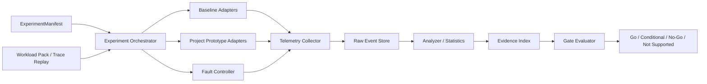

# 公共验证底座与证据规范详细设计

## 1. 设计目标

公共底座必须同时支持微基准、框架旁路、离线回放、故障注入和端到端混压，并保证 11 项计划使用同一组身份、时钟、指标、路径和证据语义。底座本身是 PVT-00 的正式延续资产，也是 PVT-07 纵向切片和后续 P0/P1 CI 的入口。

核心能力：

- 可冻结：软件、硬件、模型、工作负载、feature flag、路径预算全部版本化；
- 可重放：一个 `experiment_id` 可以从 manifest 恢复到相同 case；
- 可对账：计划路径、实际路径、Host Touch、完成/可见性/完整性和客户 SLO 串联；
- 可证伪：基线、消融、故障和 No-Go 样本同等保留；
- 可延续：Provider Probe、Descriptor Compiler、Eligibility、Trace/Fault Suite 不写成一次性脚本。

## 2. 逻辑组件



### 2.1 组件职责

| 组件 | 职责 | 不承担 |
|---|---|---|
| Experiment Orchestrator | 展开矩阵、分配 ID、环境预检、运行/清理、采集退出码 | 不直接计算结论 |
| Workload Pack | 真实/公开/合成轨迹、模型 KV 规格、到达分布、期望前缀 | 不隐藏生成参数 |
| Baseline Adapter | 原生框架、重算、Mooncake/LMCache 等组合的统一启动/停止/探测 | 不替基线做不公平降配 |
| Prototype Adapter | Provider、QueryPlan、Descriptor、Attach、Tier/QoS 的功能开关与接口 | 不把未支持能力伪装成功 |
| Fault Controller | 网络、SSD、进程、Rank、Lease、Ready、版本和数据错误注入 | 不在无恢复措施时修改环境 |
| Telemetry Collector | 业务、框架、Host、NPU/NIC/SSD、路径和故障事件 | 不在关键路径做全量 CPU Payload 扫描 |
| Analyzer | 分位数、置信区间、CV、净收益、回归和异常分类 | 不删除失败样本 |
| Gate Evaluator | 按冻结门槛给出机器预判和缺证项 | 不代替人工架构/风险签字 |

## 3. 建议制品结构

以下结构描述正式实验仓库应具备的制品，不要求在本次文档目录创建代码：

```text
prototype-validation/
  manifests/
    environments/
    workloads/
    experiments/
    baselines/
    faults/
  harness/
    orchestrator/
    adapters/{native,best-oss,project}/
    probes/{host,npu,nic,ssd,path}/
    analyzers/
    gate_rules/
  prototypes/
    providers/
    descriptor_compiler/
    direct_view_guard/
    queryplan/
    tier_policy/
    eligibility_attach/
    semantic_qos/
  tests/{golden,fault,conformance,e2e}/
  evidence/<experiment_id>/
  reports/<validation_id>/
```

任何路径中的 `best-oss` 代表“当前最佳可行开源组合”，具体版本和 Provider 必须由 manifest 冻结，不得把该名称写死为某个项目。

## 4. 核心数据契约

字段名是原型级冻结建议；正式代码命名可在 P0 详细设计调整，但语义和关联关系不得丢失。

### 4.1 ExperimentManifest

```yaml
schema_version: "1.0"
experiment_id: "PVT-04-20260810-qwen72b-c32-r03"
validation_id: "PVT-04"
case_id: "remote-load-congested-q32"
repeat_index: 3
owner: "<DRI>"
evidence_gate: "E2"
environment_ref: "env-target-2node-v1"
workload_ref: "workload-agent-32k-zipf-v2"
baseline: "best_feasible_oss"
ablation: "full|state_intelligence_off|microarch_info_removed"
model:
  name: "<model>"
  weights_digest: "sha256:<digest>"
  tokenizer_digest: "sha256:<digest>"
  chat_template_digest: "sha256:<digest>"
  dtype: "fp8"
  tp: 8
traffic:
  concurrency: 32
  arrival: "poisson"
  context_tokens: 32768
  output_tokens: 256
slo:
  ttft_p99_ms: 200
  tpot_p99_regression_pct: 3
path_policy:
  planned_path: "REMOTE_URMA_TO_HBM"
  allowed_fallbacks: ["LOCAL_SSD_TO_HBM", "RECOMPUTE"]
  forbidden_paths: ["CPU_CODEC", "HIDDEN_DDR_STAGING"]
  host_payload_touch_budget_bytes: 0
fault_ref: "net-latency-spike-50ms"
warmup_seconds: 120
measure_seconds: 600
```

Manifest 在运行开始后只读；任何变化都生成新的 `experiment_id`。临时手工修改但沿用原 ID 的结果一律不进入证据包。

### 4.2 EnvironmentManifest

记录节点、设备、NUMA、NPU/NIC/SSD 亲和性、链路速率、PCIe/C2C 拓扑、内存容量、内核、驱动、固件、runtime、框架、Provider、文件系统和系统调优。附带：

- `environment_digest`：规范化字段的摘要；
- `support_state`：SUPPORTED / STAGED_ONLY / NOT_SUPPORTED / NOT_TESTED；
- `counter_availability`：各硬件 counter 的名称、采样周期、单位和可信边界；
- `clock_calibration`：PTP/NTP 状态、最大偏差和单调时钟映射；
- `background_noise`：空载 CPU/NPU/NIC/SSD 基线。

### 4.3 KVBlockSpec

由模型实际配置计算 KV 数据量，禁止只写“70B”推定大小：

```text
MHA/GQA bytes_per_token = 2 × layers × kv_heads × head_dim × bytes_per_element
per_rank_bytes_per_token = bytes_per_token ÷ tensor_parallel_degree
batch_bytes = batch × context_tokens × bytes_per_token

MLA bytes_per_token = layers × (latent_dim + rope_dim) × bytes_per_element
```

若采用 MLA Leader Rank 外存读取 + 节点内广播，必须分别报告外部链路字节、节点内广播字节和 Rank 0 瓶颈；不能把外部流量下降直接等同于端到端收益。

### 4.4 TraceEvent

```json
{
  "ts_mono_ns": 0,
  "experiment_id": "...",
  "request_id": "...",
  "plan_id": "...",
  "object_id": "...",
  "path_id": "...",
  "rank_id": 0,
  "event": "LOOKUP_START|PLAN_READY|TRANSFER_SUBMIT|CQ_COMPLETE|FENCE_READY|ATTACH|FALLBACK|RECOMPUTE",
  "state_before": "...",
  "state_after": "...",
  "reason_code": "...",
  "estimated_cost_us": 0.0,
  "actual_cost_us": 0.0
}
```

所有事件使用单调时钟；跨机端到端时间需要校准映射。请求链路至少能还原 Lookup、Decision、Load/View、Completion、Fence、Integrity、Rank Consensus、Attach、Fallback/Recompute。

### 4.5 ActualPathReceipt

```json
{
  "receipt_version": "1.0",
  "experiment_id": "...",
  "request_id": "...",
  "plan_id": "...",
  "planned_path": "REMOTE_URMA_TO_HBM",
  "actual_hops": [
    {"src":"remote_ubmem","dst":"nic","engine":"URMA","bytes":16777216},
    {"src":"nic","dst":"target_hbm","engine":"DMA","bytes":16777216}
  ],
  "host_payload_touch_bytes": 0,
  "cpu_copy_count": 0,
  "cpu_cycles_per_gb": 0,
  "cpu_codec_calls": 0,
  "cpu_full_crc_calls": 0,
  "completion_evidence_id": "...",
  "visibility_evidence_id": "...",
  "integrity_evidence_id": "...",
  "fallback_reason": null,
  "provider": "...",
  "provider_version": "..."
}
```

Receipt 必须来自 Provider、驱动 counter、eBPF/ftrace/perf 和设备计数器的组合证据。仅根据配置推断 `actual_hops` 不合格。若平台 counter 不能证明 Payload 是否触碰 Host，应标 `EVIDENCE_INSUFFICIENT`，不能写 0。

### 4.6 QueryPlan 最小字段

```text
plan_id, request_id, semantic_identity_digest, match_span,
consume_action {DIRECT_ATTACH, LOAD, DIRECT_VIEW, PARTIAL_REUSE, RECOMPUTE, MISS},
source_placement, target_placement, layout_version, object_version,
descriptor_ref, attach_requirement, deadline_ns,
estimated_lookup/load/attach/rank_sync/interference/recompute_us,
confidence, selected_reason, fallback_action, forbidden_actions
```

### 4.7 ConsumeEligibilityResult 与 AttachHandle

Eligibility 至少覆盖：Semantic Identity、Version、Layout、Ready/Visibility、Lease、Rank、Security Domain、Deadline/Cost。输出明确 action 和单一主 reason code，可附多个 secondary reasons。

AttachHandle 至少包含：`object_id`、`prefix_span`、`rank_slice`、`layout_version`、`object_version`、`device_ptr/block_table_ref/transfer_plan`、`ready_bitmap`、`visibility_level`、`lease_id`、`placement_id`、`integrity_evidence_id`、`release_callback`。

## 5. Reason Code 字典

建议前缀分类：

| 类别 | 示例 | 默认动作 |
|---|---|---|
| SEMANTIC | MODEL_MISMATCH、TOKENIZER_MISMATCH、TENANT_DENY | RECOMPUTE / MISS；越权告警 |
| VERSION_LAYOUT | OBJECT_STALE、LAYOUT_INCOMPATIBLE | 备用副本、Transform 或 RECOMPUTE |
| READY_INTEGRITY | NOT_READY、FENCE_MISSING、INTEGRITY_FAILED | WAIT（有界）或 RECOMPUTE；禁止 Attach |
| LEASE_RANK | LEASE_EXPIRED、RANK_DISAGREE | Reacquire、Min-Safe Prefix 或 RECOMPUTE |
| COST_SLO | NEGATIVE_BENEFIT、DEADLINE_EXCEEDED | ABANDONED_HIT + RECOMPUTE |
| PATH | PATH_DEGRADED、PATH_NOT_SUPPORTED、CQ_TIMEOUT | 备用路径或 RECOMPUTE |
| RESOURCE | HBM_WATERMARK_HIGH、SSD_QD_HIGH | 限流、排队、旁路或 RECOMPUTE |
| EVIDENCE | COUNTER_UNAVAILABLE、RECEIPT_MISMATCH | 结果不可判定，不得判 Go |

要求 fallback reason 覆盖率 100%；`UNKNOWN` 只能用于开发冒烟，正式证据中必须清零或人工归类。

## 6. 指标与公式

### 6.1 业务与复用

```text
raw_hit_rate = raw_hit_requests / eligible_lookup_requests
usable_hit_rate = consumed_reuse_requests / eligible_lookup_requests
abandoned_hit_rate = positive_candidate_but_not_consumed / raw_hit_requests
effective_reused_tokens = attached_prefix_tokens - later_invalidated_or_recomputed_tokens
saved_prefill_us = measured_recompute_us(effective_reused_tokens, model, load) - residual_compute_us
net_benefit_us = saved_prefill_us - lookup_us - load_or_view_us - attach_us - rank_sync_us - interference_us
```

必须同时报告所有请求、Raw Hit 子集和 Usable Hit 子集，禁止只报告命中成功请求的 TTFT。

### 6.2 路径与提交

```text
effective_bandwidth = verified_payload_bytes / (last_visible_ns - first_submit_ns)
line_rate_ratio = effective_bandwidth / min(link_payload_peak, device_peak, bus_peak)
descriptor_reduction = 1 - compiled_descriptor_count / naive_descriptor_count
submit_reduction = 1 - project_submit_cpu_us / baseline_submit_cpu_us
host_touch_ratio = host_payload_touch_bytes / verified_payload_bytes
overlap_ratio = overlapped_compute_transfer_time / transfer_critical_path_time
```

带宽分母使用有效 Payload 峰值而非标称编码速率，峰值来源和协议开销必须记录。

### 6.3 决策与成本

```text
prediction_error = abs(predicted_cost - actual_cost) / max(actual_cost, epsilon)
wrong_load = selected LOAD and actual_load_total_us >= actual_recompute_us
decision_regret_us = actual_selected_cost_us - min(actual_feasible_action_cost_us)
selection_accuracy = decisions matching offline_oracle / decisions_with_oracle
```

Oracle 只能使用事后可得数据，不能作为在线方案。无法执行的 action 不进入 `feasible_action` 集合。

### 6.4 容量与成本

```text
hbm_effective_capacity = max_stable_working_set_meeting_all_SLOs
capacity_gain = project_hbm_effective_capacity / native_capacity - 1
unit_qualified_transaction_cost = total_lifecycle_cost / SLO_qualified_transactions
migration_amplification = migration_bytes / useful_reused_bytes
ssd_write_amplification = device_bytes_written / logical_kv_bytes_written
```

全生命周期成本至少记录 NPU/CPU/DDR/SSD/NIC/DPU 资源、功耗、SSD 写入寿命代理、运维和额外人力；立项前无法货币化的项保留物理量和敏感性区间。

## 7. 统计设计

### 7.1 运行原则

- 每个正式 case 至少 3 次独立重复；每次包含环境清理、预热和稳定测量窗口；
- P50/P95/P99 基于原始请求分布，不对各次分位数简单取平均；合并样本与逐 run 结果同时保留；
- 报告样本数、缺失率、超时和异常，不删慢请求；
- 核心稳定性指标 CV <5%；不满足时先定位噪声，无法消除则扩大重复并把结论降级；
- 使用 bootstrap 95% CI；比例指标可使用 Wilson 区间；零错误目标同时报告样本量和“在当前样本下未观察到”，不宣称数学上绝对为零；
- 门槛型收益优先用置信区间保守侧判定：收益下界达到 Go 门槛才判 Go，风险指标上界低于门槛才判 Go；
- 多矩阵探索需要标记探索性/确认性 case，确认性 case 使用预注册门槛，避免挑选最好结果。

### 7.2 A/B 顺序与污染控制

Baseline/Project/Ablation 采用轮转或随机顺序，避免温度、缓存、SSD GC 和网络时间漂移偏向某一方案。每次运行记录：

- NPU/CPU 温度与频率、后台进程、NIC error、SSD GC/SMART；
- HBM/DDR/SSD 水位、缓存是否冷启动、对象数和目录状态；
- 前一次故障是否完全恢复；
- 环境摘要是否与 manifest 一致。

## 8. 公平基线与消融

### 8.1 最小基线集

1. 无统一池/强制重算；
2. vLLM/SGLang 原生 prefix cache/offload 关闭与开启；
3. 当前最佳可行开源组合：Mooncake、LMCache 或目标硬件上实际可行的组合，同等 Provider 适配和调优预算；
4. 逐项必要的简单策略：CPU memcpy/TCP/staged、逐块 copy、固定优先级、总是 Load、总是 Recompute、LRU/LFU/双水位；
5. 项目完整方案。

### 8.2 强制因果消融

- State Intelligence Off：去掉动态状态、实时路径质量和逐请求成本，只保留等价静态规则；
- Microarchitecture Info Removed：去掉非公开 counter/拓扑/固件信息，只保留公开能力；
- 按项消融：DDR bypass、QoS off、pipeline off、Direct View off、batch descriptor off。

消融必须保持其他版本、硬件、模型、工作负载和调优时间一致。

## 9. 故障注入

### 9.1 故障域

| 域 | 注入方式 | 必查不变量 |
|---|---|---|
| 网络 | 延迟、抖动、丢包、限速、断链、慢消费者 | 有界切换；无错误路径；reason code 正确 |
| SSD | 高 QD/IOPS、慢盘、短读、超时、介质错误 | 半写不 Ready；限流/回退；无坏 KV 消费 |
| Provider/CQ | CQ timeout、completion 丢失/乱序、句柄失效 | Fence/Integrity 不闭环则禁止 Attach |
| 元数据 | stale record、版本冲突、tombstone、镜像延迟 | stale hit=0；精确查询或重算 |
| 状态 | Ready 位缺失、Lease 过期、迁移/淘汰竞态 | 无 use-after-free；可回滚 |
| Rank | 单 Rank 断网/Crash/Ready 不一致 | min-safe 或全体回退；无死锁 |
| 安全 | tenant/salt/domain 冲突、越界 rkey | 越权消费=0；审计完整 |
| 资源 | HBM 高水位、DDR/SSD 满、descriptor/CQ 饱和 | 平滑拒绝/限流；无 OOM 崩溃 |

### 9.2 注入记录

每次故障生成 `fault_id`、目标、开始/结束时间、强度、预期动作、实际动作、恢复检查和环境清理证据。若无法证明故障实际生效，该 case 不计入覆盖率。

## 10. 一次实验的标准流程

1. `validate-manifest`：schema、依赖、门槛、禁止路径和输出目录检查；
2. `fingerprint-environment`：生成环境摘要并与冻结版本比较；
3. `calibrate`：时钟、空载、监控开销、负载机能力、路径峰值校准；
4. `prepare`：清理对象/队列/缓存，设置 feature flag 和水位；
5. `warmup`：达到稳态但不计入正式窗口；
6. `run`：启动 workload、Provider/框架、Telemetry；
7. `inject`：在声明窗口注入故障或拥塞；
8. `drain`：停止新请求，等待有界完成并回收 Lease/Descriptor；
9. `collect`：原始事件、硬件 counter、日志、ActualPathReceipt、环境尾快照；
10. `verify`：检查样本数、丢失率、路径一致性、故障生效、数据校验；
11. `analyze`：生成统计、基线对比、消融、异常和门槛预判；
12. `review`：DRI、性能、底层、测试、架构签字。

## 11. 证据目录与不可覆盖规则

```text
evidence/<experiment_id>/
  manifest.yaml
  environment.before.json
  environment.after.json
  workload.manifest.yaml
  stdout.log
  stderr.log
  exit_status.json
  raw/
    trace.ndjson.zst
    metrics.parquet
    host_touch.ndjson.zst
    device_counters/
    path_receipts.ndjson.zst
    faults.ndjson.zst
  derived/
    summary.json
    percentiles.csv
    confidence_intervals.csv
    path_reconciliation.csv
    anomaly_samples.ndjson
  figures/
  checksums.sha256
  evidence_index.json
```

原始目录写入后只追加，不由分析脚本修改。重跑生成新 `experiment_id`。汇总报告引用 checksum；分析器版本和命令行写入 `evidence_index.json`。

## 12. 证据包自动门禁

自动检查至少包括：

- manifest/environment/workload/exit status/原始 trace 存在；
- 至少 3 次重复且环境摘要一致；
- 核心指标缺失率 <0.1%，或按该项更严门槛；
- Planned Path 与 Receipt 覆盖率 100%，差异均有 reason；
- `UNKNOWN` fallback reason 为 0；
- 错误/过期/越权消费为 0；
- Host Touch、CPU codec/CRC、ActualPathReceipt 满足该 case 声明；
- 基线、最佳可行开源组合和强制消融存在；
- Go/Conditional/No-Go、边界、回退、延续资产和追溯回写不为空。

任何缺证项使状态保持 `INCOMPLETE`，不能由人工直接改为 Go；确需例外时必须写例外编号、影响和批准人。

