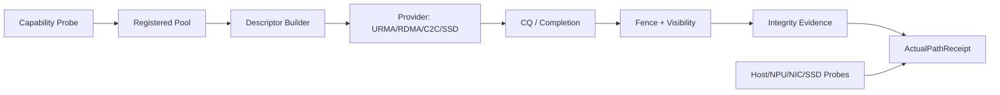

# PVT-00 至 PVT-03 实施方法详细设计

## PVT-00：统一业务基线、收益上限与全链路观测底座

### 1. 要关闭的决策

证明目标业务是否存在足够的自然前缀复用，以及 Saved-Prefill 能否覆盖目录、控制、传输、Attach、Rank 同步和 Decode 干扰成本。该项关闭 E0，并冻结所有后续 PVT 的 workload、时钟、指标分母和公平基线。

主关联：IR-02-11、IR-02-12；延续到 SR23-02-11-01/02、SR23-02-12-01/05 和 SRS `L3-OB-PerPathTelemetry-047`、`L1-OB-SemanticMetrics-016`、`SE-MONITOR-001`、`SE-PERF-001`。

### 2. 原型模块

| 模块 | 设计 |
|---|---|
| Trace Ingestor | 解析请求到达、token、租户/安全域、模型、模板、框架、TTFT/TPOT；脱敏后生成稳定语义摘要 |
| Prefix Analyzer | 在相同 KVSemanticIdentity 内计算最长公共前缀、Reuse Distance、并发可见性和生命周期 |
| Recompute Calibrator | 在无统一池路径下按模型、上下文、并发实测 Prefill 时间和 NPU 资源，不用理论 FLOPs 替代 |
| Path Cost Injector | 以 PVT-01 实测路径包络或预注册模型注入 Lookup/Load/Attach/Sync/Interference 成本 |
| Shadow Probe | 在 vLLM/SGLang 不改变决策的旁路模式下生成候选 QueryPlan 和净收益估计 |
| Baseline Runner | 统一执行强制重算、框架原生开关和当前最佳可行开源组合 |
| Report Builder | 生成分层复用曲线、容量—命中曲线、收益瀑布和 E0 判定所需原始证据索引 |

### 3. 输入与数据处理

#### 3.1 真实 Trace

优先抽取 1～3 天代表性业务，保留场景、租户、模型、模板、输入 token 序列或不可逆 token 摘要、到达时间、上下文长度、输出长度、实际 TTFT/TPOT。用户内容脱敏后仍需保持 token 边界和前缀关系；不能只保留字符串 hash 导致无法计算 Partial Prefix。

按以下维度分层，禁止只看总体均值：业务场景、租户/安全域、模板版本、模型、上下文档位、并发档位、到达分布、峰/谷时段。跨租户前缀即使文本相同也不得计为可消费复用，除非显式 shareable。

#### 3.2 替代双轨

真实 Trace 不可得时，使用固定 ShareGPT 数据版本，并生成至少两类合成轨迹：

- Zipf 热点：验证高复用上限和系统容量，不外推生产；
- 长尾/低复用：验证 No-Go 护栏；
- Agent/RAG 模板：公共 system/tool 前缀 + 会话增量；
- 上下文 4K/32K/128K/256K+，并发至少低/中/高三档。

### 4. 计算方法

对每个请求 `r`：

```text
candidate_prefix_tokens(r) = 在请求到达时已经 Ready、身份相同且允许共享的最长前缀
theoretical_saved_prefill(r) = 实测重算模型中 candidate_prefix_tokens 对应的 Prefill 时间
net_saved(r) = theoretical_saved_prefill
             - lookup - decision - transfer/view - attach - rank_sync - interference
positive_reuse(r) = net_saved(r) > 0 且满足 TTFT deadline
```

`theoretical_saved_prefill` 按真实模型/硬件/并发校准，使用插值表而非只按 token 线性外推。对于 MLA Leader Rank 模式，分别报告外部读取和节点内广播成本。

### 5. 实验矩阵

| 维度 | 取值 |
|---|---|
| 框架 | vLLM、SGLang |
| 主模型 | 1 个首发模型；可加 1 个架构差异模型作敏感性 |
| 上下文 | 4K、32K、128K、256K+ |
| 并发 | 低/中/高三档，建议 1/32/128，受硬件限制时等比例调整 |
| 基线 | 强制重算、原生 prefix/offload 开关、最佳可行开源组合 |
| 轨迹 | 真实脱敏 + ShareGPT/Zipf 双轨 |
| 重复 | 每个确认性 case ≥3 次 |

### 6. 执行步骤

1. 冻结模型、tokenizer、模板、布局、框架、并发、拓扑、SLO 和统计窗口；
2. 校验 Trace 数据授权、脱敏、时间排序、重复请求和缺失字段；
3. 生成 `KVSemanticIdentity`，在安全域内离线构建 Prefix/Reuse Distance 分布；
4. 运行强制重算基线，建立 Prefill 时间、NPU busy/stall 与上下文/并发映射；
5. 运行框架原生和当前最佳可行开源基线，统一采集 TTFT/TPOT、命中漏斗和资源；
6. 以 PVT-01 实测成本；若 PVT-01 尚未完成，先用上/中/下三档成本敏感性，不作最终 E0；
7. 运行 Shadow Probe，对每请求生成候选、成本分解、positive/negative 判定和 abandoned reason；
8. 输出按业务分层的 P50/P95 前缀、复用率、Saved-Prefill、净收益、容量—命中和敏感性曲线；
9. 用不同时间窗复跑，检查复用结构是否稳定；
10. 形成首发白名单、明确 No-Go 场景及后续 PVT 的冻结 workload pack。

### 7. 数据质量与故障检查

- 核心指标缺失率 <0.1%，重复实验 CV <5%；
- Shadow Probe 开启/关闭对主业务 TPOT 影响 <1%；
- 时间戳漂移、tokenizer/template 版本混用、跨租户误聚合均为硬失败；
- 对极端热点、单一模板、重放重复、合成流量单列，避免高估自然复用；
- 报告 `Raw Hit → Identity-valid → Ready-valid → Positive-benefit` 漏斗。

### 8. 判定

- Go：至少一个明确业务分层的 P95 Saved-Prefill 预算 ≥ 控制+传输+Attach 预算的 2 倍；缺失率 <0.1%，CV <5%。
- Conditional：收益仅集中于 Code/Agent/特定模板或租户；冻结白名单、配额和不外推边界。
- No-Go：自然复用率 <10%，或净收益完全被控制/传输成本抵消，或结果不可对账复现。

### 9. 交付与工作量

4～6 人日：性能/数据 2～3 人日，框架探针 1～2 人日，统计/评审 1 人日。必须交付版本化 workload pack、baseline 报告、trace schema、指标字典、原始数据、一键复现入口、E0 评审记录；代码进入 Telemetry/Benchmark 正式候选，不保留为个人 notebook。

---

## PVT-01：HBM/DDR/SSD/远端介质数据路径与完整性能力矩阵

### 1. 要关闭的决策

证明目标平台至少存在一条热路径和一条 HBM↔SSD 直达或低 Host 参与的容量路径；验证内存注册、Descriptor、Completion、Fence、Visibility、Integrity 和错误映射形成闭环，且主路径 Host Payload Touch 为 0。

主关联：IR-01-06、01-08、01-09、01-12；核心 SR 为 RDMA Provider、SSD/Object Provider、Capability Registry、Integrity/RAS；核心 SRS 为 `L4-MC-HIER-STORE-001`、`L4-HW-HostPayloadTouchBudget-076`、`L4-FT-PathIntegrityPolicy-077`。

### 2. 原型架构



#### 2.1 Provider 接口

```text
queryCapability(src_mem, dst_mem, size, alignment) -> ProviderCapability
registerRegion(device, base, length, security_domain) -> RegisteredRegion
submit(descriptors, queue, deadline) -> TransferTicket
poll/wait(ticket) -> CompletionEvidence
cancel(ticket) -> CancelResult
verifyVisibility(ticket, target) -> VisibilityEvidence
mapError(native_error) -> StandardReasonCode
```

每个 Provider 声明 `DIRECT`、`LOW_HOST`、`STAGED_ONLY` 或 `NOT_SUPPORTED`，并给出 Payload Touch、对齐、最大 Descriptor、QD、Completion/Fence、完整性和 fallback 能力。

### 3. 路径矩阵

至少覆盖：

- 本地 HBM↔DDR：校准 staged 和 copy engine 行为；
- 跨节点 HBM↔HBM、HBM↔DDR：URMA/RDMA，若平台有 C2C 则增加；
- HBM↔本地 SSD：NPU Direct Storage/GDS/等价 Direct I/O 或低 Host 路径；
- HBM↔远端 SSD/Object：如平台支持；
- 明确负面对照：CPU memcpy、TCP/staged、框架原生 swap/offload；
- 目标硬件存在 Mooncake/LMCache Provider 时，纳入同等调优对照。

数据大小 64KB～1GB，QD 1/8/32/128，对齐/非对齐，本地/远端，正常/拥塞/SSD 高 IOPS；每条路径同时测试 Read/Write 或说明单向限制。

### 4. Host Touch 证明

组合证据：

- eBPF/ftrace/perf：`memcpy`、copy_to/from_user、page fault、codec/CRC 调用、CPU cycles；
- 驱动/Runtime：DMA engine、注册内存、CQ/SQ、device-to-device copy；
- NIC/PCIe/NPU/SSD counter：实际字节、队列、重试、错误；
- 内存带宽 counter：Host DDR Payload 流量与控制流量分离；
- Provider 内部 receipt：源/目标、engine、byte count、MR/rkey、descriptor 和 completion。

Host 只提交控制描述不算 Payload Touch。若无法区分控制与正文，结论标证据不足而不是 Touch=0。

### 5. 正确性与完整性

每个 Payload 含不可伪造的对象版本、偏移和模式，但主路径不得用 CPU 全量扫描实现校验。按路径使用硬件 E2E、设备/后端 checksum、ECC/RAS、length/layout、Completion、Fence 和 Visibility 组合。故障注入包括：

- 断网、超时、CQ completion 丢失/乱序；
- 半写、短读、错误长度/偏移、句柄/rkey 失效；
- SSD 高 QD、介质错误、错误对齐；
- ECC/RAS 或 Provider 可注入错误；
- 在 Completion 与 Fence 之间尝试消费，必须被 Ready Guard 阻断。

### 6. 执行步骤

1. 枚举硬件拓扑、NUMA、NPU:NIC、PCIe/C2C、SSD，校准链路/设备有效峰值；
2. 为每种介质建立长生命周期 Registered Pool，记录分配/注册/注销成本；
3. 先跑 CPU memcpy、TCP/staged 和框架原生路径，得到负面对照；
4. 对每个 Provider 运行大小×QD×对齐矩阵，记录 P50/P95/P99、有效带宽、CPU cycles/GB；
5. 用 receipt 对账 Planned/Actual hops 和 Host Payload Touch；
6. 执行 Completion→Fence→Integrity→Ready 正常时序测试；
7. 执行故障矩阵，验证错误 KV 不 Ready、不 Attach，且 fallback/恢复有界；
8. 在后台 CPU/网络/SSD 压力下复跑，识别理论峰值与可服务包络；
9. 分类为主用、条件、回退、禁用、Not Supported，输出 CapabilityMatrix；
10. 将 probe、Provider 最小接口和 fault cases 接入硬件 CI 候选。

### 7. 指标与判定

关键指标：P50/P95/P99、effective BW/峰值、CPU cycles/GB、Host Payload bytes、CQ/Fence/Ready 时延、retry/fallback、错误 KV 消费数。

- Go：至少一条热路径有效带宽 ≥线速 80%，且至少一条 HBM↔SSD 直达或低 Host 容量路径顺序带宽 ≥设备峰值 80%；主路径 Host Payload Touch=0，CPU codec/全量 CPU CRC=0，错误/半写消费=0。
- Conditional：只有 staged 路径可用，但 CPU 额外开销 <10%，可显式限速、告警、禁用，并仅作为非默认回退。
- No-Go：无容量路径、Host 参与不可观测、Completion/Fence 失效或错误 KV 可进入消费。
- Not Supported：硬件/驱动无所需能力；明确替代路径，不得把模拟结果当 E1。

定量模型的 400G 单卡 40GB/s/90%+ 可作为 stretch；正式 Go 门槛采用 V1.6 的 80%。

### 8. 交付与工作量

10～14 人日：底层 Provider 5～7、人天；计数器/Receipt 2～3；故障/正确性 2～3；复核 1。交付 CapabilityMatrix、曲线、Host Touch 对账、故障报告、路径白名单/禁用表、Provider/Registered Pool/Probe 代码与硬件回归入口。

---

## PVT-02：vLLM/SGLang 布局—Extent/Descriptor—异步传输流水

### 1. 要关闭的决策

证明 vLLM PagedAttention block 与 SGLang page/radix span 能被编译成目标 Provider 可执行的批量 Descriptor，并形成可取消、可超时、可部分完成和可回退的异步 DAG；避免逐块 CPU 提交、小 I/O 放大和整对象串行等待吞噬路径收益。

主关联：IR-01-02、01-04；锚定 SR23-01-02-01、01-04-01、02-06-01 和 SRS `L2-OL-LayoutNegotiation-024`、`L2-OL-BulkDescriptor-025`、`L3-SE-DescriptorFromManifest-079`、`L3-MC-LayoutTransformPlan-078`。

### 2. 数据结构与模块

```text
FrameworkLayoutManifest
  framework, model, layout_version, dtype, layer_count,
  token_block_size, rank_slices[], logical_blocks[], target_buffer

ExtentManifest
  object_id, object_version, extents[]{placement, offset, length,
  alignment, rank, layer_span, ready_state, security_domain}

BulkDescriptor
  provider, opcode, src/dst region, offsets[], lengths[],
  queue, deadline, completion_group, visibility_requirement
```

模块：

- vLLM Layout Adapter：Block table → logical spans；
- SGLang Layout Adapter：Radix/page spans → logical spans；
- Layout Negotiator：DIRECT、COALESCE、TRANSFORM、RECOMPUTE；
- Descriptor Compiler：对齐、合并、切分、Provider 限制和 Scatter-Gather；
- Async DAG Executor：依赖、submit、completion、fence、layer-ready、cancel/fallback；
- Golden Layout Verifier：生成可比较的标准 KV 张量及边界 case。

### 3. 编译算法

1. 校验 semantic/layout/object version 和 Rank slice；
2. 将 logical block/page 映射到 ExtentManifest；
3. 按 source/destination/provider/security domain 分组；
4. 合并物理连续且 Ready/Version 相同的范围；
5. 应用 `min_transfer_granularity`、alignment、`max_descriptor_count` 和最大单 Descriptor 长度；
6. 非对齐尾部只允许 Provider 声明的 bounce/transform；若会触发隐式 CPU staging 则显式标记或拒绝；
7. 生成 CompletionGroup 和 Fence 依赖；
8. 输出 Descriptor、预期 Payload、临时内存和 fallback；
9. 反向验证 Descriptor 覆盖的逻辑 token/layer/rank 恰好一次，无遗漏、重复、越界。

### 4. 实验矩阵

| 维度 | 取值 |
|---|---|
| 框架布局 | vLLM 16/32-token block；SGLang page/radix span |
| 对象 | 256KB～64MB，4 档 |
| SG 段数 | 1、8、128、1024 |
| QD | 1、8、32、64 |
| 复用 | Whole、25/50/75% Partial |
| 执行 | 单 Descriptor、批量、Layer streaming、整对象后计算 |
| 异常 | Cancel、Timeout、Partial Completion、Provider failure、Layout mismatch |

基线包括逐 block/page copy、单请求单 Descriptor、整对象完成后计算和最佳可行开源批量实现。

### 5. 执行步骤

1. 从两个框架生成固定版本 LayoutManifest 和真实 block table/radix span 样本；
2. 建立 golden tensor，覆盖层、Rank、dtype、对齐、空洞、部分前缀和边界 block；
3. 运行 naive compiler，记录 Descriptor 数、CPU cycles、I/O 大小和执行时延；
4. 运行批量 compiler，拆分 `parse/map/coalesce/emit/submit/execute/wait` 各阶段；
5. 接入 PVT-01 至少一个网络热路径和一个 SSD 容量路径；
6. 模拟 Prefill/Decode compute stream，与 transfer stream 并发，计算重叠率；
7. 在不同 DAG 节点注入 Cancel/Timeout/Partial failure，验证未提交取消、已提交 drain、目标隔离和资源释放；
8. 注入 layout/version/rank 错误，必须输出 Transform 或 Recompute，禁止隐式 Attach；
9. 对比最佳开源实现和所有基线，确认收益不是仅由对象变大造成；
10. 冻结 Compiler/Descriptor/TransferTicket 字段和正式模块迁入清单。

### 6. 正确性检查

- Descriptor 覆盖的 byte range 与 golden tensor 完全一致；
- 不同 security domain 不得合并为同一可越界 Descriptor；
- Partial Prefix 的尾部不得误标 Ready；
- Cancel 后 Registered Region、Descriptor、Ticket、Lease 全部回收；
- Layout mismatch 的错误路径不会返回有效 AttachHandle；
- 任何隐式 transform/staging 都出现在 ActualPathReceipt 和成本中。

### 7. 判定

- Go：Descriptor 数量下降 ≥50%，effective BW 提升 ≥30%，CPU submit 下降 ≥40%，布局错误=0，计算—传输重叠 ≥60%，额外内存 ≤15%。
- Conditional：只有单一框架/布局达标；限定首发范围，不兼容路径显式 Transform 或 Recompute。
- No-Go：Compiler 开销抵消传输收益、布局错误不可阻断，或流水导致 TPOT/内存严重退化。

定量模型中的“128 块编译 ≤5μs”作为针对目标硬件的 stretch case；正式判定以 V1.6 的相对下降、正确性、重叠和内存门槛为准。

### 8. 交付与工作量

10～12 人日：两框架 Adapter 3～4，Compiler 3，DAG/Provider 接入 2～3，golden/fault/perf 2。交付可复用 Compiler、两 Adapter、DAG 薄片、golden cases、性能分解和迁入 Transfer Manager 的接口清单。

---

## PVT-03：UBMEM 元数据、block_table 与 KV Direct View 安全边界

### 1. 要关闭的决策

验证 Direct View 只能按对象类型和访问模式有条件启用，优先证伪“Decode-active KV 默认 Direct View”。目标是找出 Metadata/Read-only Snapshot/短 span 与反复 attention 读取之间稳定的 View-vs-Copy crossover，并通过 Lease/Revoke/Guard 防止 stale、越界和 use-after-free。

主关联：IR-01-07、02-04、02-05；锚定 Direct View Provider、本地元数据快路径、目录和分层驻留 SR；SRS 重点为 `L1-OL-ViewVsCopy-011`、`L2-MM-ViewLease-028`、`L3-SE-ViewCopyCostModel-034`、`L3-MS-UBC2CTier-055`。

### 2. 对象分类

| 类别 | 默认策略 | 需验证内容 |
|---|---|---|
| Prefix metadata / directory mirror | Direct View 或本地 mirror | Lookup P99、stale、revoke |
| block_table / manifest / ready bitmap snapshot | 只读 Direct View 候选 | 一致性、版本、并发更新、attach 前复制需求 |
| Warm KV preview / 单次短读 | Direct View 候选 | first-touch、对象大小、page size、Rank |
| Decode-active KV | 默认 Copy-to-HBM | 多次重读的 TPOT、remote stall、TLB/page fault |
| 可写/跨租户 KV | 禁止 Direct View | 权限和隔离 |

### 3. DirectViewGuard 状态机

```text
CREATED -> LEASED_READONLY -> ACTIVE -> REVOKE_REQUESTED
        -> QUIESCED -> RELEASED
任意阶段证据/版本/权限失败 -> INVALIDATED -> FALLBACK_COPY_OR_RECOMPUTE
```

Guard 校验对象版本、layout、security domain、page mapping、Lease epoch/expiry、refcount、Ready/Visibility 和目标 Rank。Revoke 后先禁止新 Attach，再等待有界 quiesce，随后解除映射；超时则隔离对象并切 Copy/Recompute，不能继续复用旧 view。

### 4. Cost Model

```text
view_cost = map/acquire + first_touch + expected_reads × remote_access
          + expected_tlb_fault + revoke_risk + interference
copy_cost = descriptor/submit + copy_to_hbm + attach + local_reads

选择 View 仅当：view_cost + safety_margin < copy_cost，
且 TPOT 预测满足门槛、Lease/Counter/权限证据完备。
```

本 PVT 先离线生成 crossover 和白名单，不实现在线学习。

### 5. 实验矩阵

- Metadata 64B～64KB；KV span 256KB～64MB；可增加 1MB～10GB stretch；
- 单次读、连续重读、Decode attention 模拟；
- 1/2/4 Rank；
- page size 4KB/64KB/2MB（平台支持范围内）；
- cold first-touch / warm mapping；
- 并发 reader、映射失效、Revoke、对象迁移和版本变化；
- Direct View、Copy-to-HBM、本地 mirror、RPC 精确查询四组对照。

### 6. 执行步骤

1. 实现只读 UBMEM/URMA 映射、ViewHandle 和 Guard，禁止写共享；
2. 为每类对象生成相同内容、版本、布局和访问序列；
3. 运行本地 mirror/RPC/Copy-to-HBM 基线；
4. 按对象大小×访问模式×page size×Rank 运行 Direct View；
5. 同步采集 lookup/attach/每 token 访问、TPOT、remote stall、TLB miss、page fault、copy engine 和 Host Touch；
6. 在 acquire 前、active 中、release 前注入 Lease expiry、Revoke、版本更新和映射失效；
7. 检查 stale/越界/use-after-free、Rank 行为和 fallback；
8. 拟合每种对象/访问模式的 crossover，做留出 case 验证策略准确率；
9. 对 counter 不可用的平台执行可观测性判定：无法建立稳定边界时只允许元数据/快照；
10. 输出 Direct/Copy/Local Mirror/Recompute 决策表和默认 feature flag。

### 7. 故障用例

- Lease 过期后继续访问；
- Revoke 与并发 reader/Attach 竞态；
- ReadyBitmap 或 layout version 变化；
- page mapping 被回收/迁移；
- 单 Rank 仍持旧 view；
- 远端 stall 突增或 page fault storm；
- 不同 tenant/security domain 尝试复用 handle。

所有用例必须无 stale/越界，失败时 Copy-to-HBM 或 Recompute 可完成。

### 8. 判定

- Go：本地快判 <10μs；目标 Direct View 场景 TPOT P99 回退 <3%，stale/越界=0，Revoke P99 <1ms，并形成稳定 Copy-vs-View 安全区。
- Conditional：只允许 metadata/Attach 前只读快照 Direct View；Decode-active KV 一律 Copy-to-HBM。
- No-Go：crossover 不稳定、关键 counter 不可用，或 Direct View 导致不可控 remote stall/TPOT 恶化。

定量模型的 Revoke ≤10μs 作为硬件 stretch，正式门槛是 V1.6 的 P99 <1ms。

### 9. 交付与工作量

10～14 人日：View Provider/Guard 4～5，counter/cost 3～4，fault/concurrency 2～3，框架/Ranks 1～2。交付对象×访问模式决策表、DirectViewGuard、Lease/Revoke tests、crossover 曲线、feature flag 和进入 View/Copy cost model 的接口。

