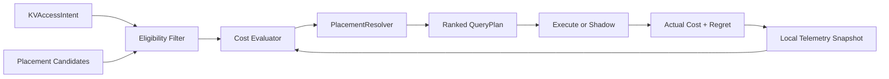
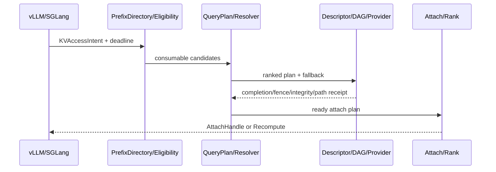

# PVT-04 至 PVT-07 实施方法详细设计

## PVT-04：QueryPlan 的 Load-vs-Recompute、PlacementResolver 与动态路径选择

### 1. 要关闭的决策

证明系统能在微秒级、无需阻塞式远端查询的前提下，根据真实路径和请求 SLO 在 Local Load、Remote Load、SSD Restore、Direct View、Partial/Full Recompute 之间做出正收益选择；在拥塞和故障时有界回退，且优于静态规则。

主关联：IR-01-03、01-05；锚定 SR23-01-03-01、01-05-01、01-09-01、02-02-01/02；核心 SRS 为 `L1-RT-Admission-007`、`L3-SE-QueryPlanFastPath-072`、`L3-TRANS-TOPO-SENSE-004`、`L4-FABRIC-ROUTER-001`。

### 2. 在线架构



在线快路径只读取本地无锁/RCU Telemetry Snapshot，不允许在 5μs 决策预算内发起远端 RPC。后台 100ms 级采样更新 EWMA、P50/P99、健康和置信度；数据过旧或置信度不足时降低 confidence 并回退静态白名单。

### 3. 成本模型

每个候选 action 输出独立分解：

```text
total(LOAD) = lookup + queue_wait + descriptor + transfer + fence/integrity
            + attach + rank_sync + foreground_interference + failure_risk
total(VIEW) = lookup + acquire + expected_remote_reads + stall/tlb
            + revoke_risk + interference
total(RECOMPUTE) = local_queue_wait + predicted_prefill + allocation_risk
```

输入至少包括 KV 大小、有效前缀 token、deadline、目标 HBM 水位、路径 BW/P99/QD、Placement 健康、layout/transform、Rank、NPU Prefill 包络和 fallback 成本。模型先采用分段线性 + EWMA + 安全裕量，原型阶段不做在线学习。

### 4. 基线与 Oracle

- 固定优先级：HBM→本地 DDR→远端 DDR→SSD→Recompute；
- 最近副本、轮询、总是 Load、总是 Recompute；
- 当前最佳可行开源组合的实际决策；
- 离线 Oracle：使用事后真实耗时，在当时实际可行 action 集合中选择最小成本；
- 项目消融：State Intelligence Off、Microarchitecture Info Removed；
- 完整 QueryPlan。

Oracle 不得把当时不可用或未 Ready 的路径当成可行解；执行某 action 所造成的后续干扰应计入实际成本。

### 5. 实验矩阵

| 维度 | 取值 |
|---|---|
| KV 大小 | 1MB、16MB、128MB、512MB |
| Deadline | 紧/中/松三档 |
| QD/拥塞 | 4 档 |
| 路径 | Local Load、Remote Load、SSD Restore、Recompute；有安全白名单时加 View |
| 状态 | 正常、热点拥塞、质量抖动、节点/路径断连 |
| 模式 | Shadow 与实际执行 |

### 6. 执行步骤

1. 从 PVT-00/01 导入 Recompute 和各路径的大小×QD×负载包络；
2. 定义 QueryPlan、PlacementCandidate、TelemetrySnapshot、ReasonCode 和 fallback；
3. 在离线 Trace 上先运行所有基线与 Oracle，校准分段模型和安全裕量；
4. 以 Shadow 模式接入框架：记录本项目建议但不改变真实执行，计算预测误差；
5. 达到基本准确度后，仅对白名单 case 启用实际执行；
6. 按矩阵注入延迟、限速、丢包、高水位、SSD QD 和节点断连；
7. 记录决策 P99、Router P99、选择准确率、错误 Load、abandoned load、净 TTFT、cross-node bytes；
8. 运行静态/最近副本/总是 Load/重算、两组强制消融和完整方案；
9. 按时段、大小、deadline、拥塞分层分析 Decision Regret 和误判；
10. 输出正收益白名单、置信度门槛、Telemetry 过期门槛、默认静态规则和禁止路径。

### 7. 关键故障与保护

- Telemetry Snapshot 过期/丢失：不得继续使用旧低成本，回退静态安全规则；
- 计划后路径突发恶化：执行端二次 deadline check，未提交则切换，已提交则有界 cancel/drain；
- Placement 迁移/失效：重新解析一次或 Recompute，禁止无界重试；
- HBM 水位上升：触发 WatermarkAdmission，阻断远端 Load；
- Provider 返回 Planned/Actual 不一致：记录 `PATH_RECEIPT_MISMATCH`，该结果不能用于 Go；
- 单次决策超预算：直接走已冻结 fallback，不等待完整模型。

### 8. 判定

- Go：QueryPlan 决策 P99 <5μs，Fabric Router <3μs；选择准确率 ≥90%，成本预测误差 <20%，负收益/错误 Load <1%，无效路径选择=0，故障切换 <200ms。
- Conditional：仅对白名单前缀/路径启用；噪声大时使用静态优先级 + feature flag。
- No-Go：尾部成本不可预测、错误 Load 持续超门槛，或策略开销抵消 Saved-Prefill。

### 9. 交付与工作量

8～10 人日：成本/Oracle 3～4，快路径/Resolver 2～3，Shadow/故障/分析 2～3。交付 QueryPlan 冻结稿、cost model、Oracle 对账、正收益白名单、fallback reason、状态智能/微架构消融报告，并迁入 PolicyEngine/PlacementResolver。

---

## PVT-05：统一池分层容量、DDR 角色与 KV 生命周期策略

### 1. 要关闭的决策

证明 HBM↔SSD 直达或低 Host 路径能把低成本介质转化为满足 SLO 的可服务容量，而不是只增加可寻址字节；证明 DDR 只有在热点、远端低时延、预取/突发缓冲、Registered Pool、元数据或显式 fallback 中持续有正收益时才进入 Payload 路径。

主关联：IR-01-01、02-08、02-09；锚定统一对象池、容量策略、生命周期、模型画像和驻留策略 SR；SRS 重点为 `L3-MS-Tiering-038`、`L3-MC-HIER-STORE-002`、`L3-SE-TierBypassPolicy-091`、`L3-MS-DDRRolePolicy-092`。

### 2. 可服务容量定义

`HBM effective capacity` 定义为在固定模型、并发、工作负载和硬件上，同时满足 TTFT、TPOT、错误率、OOM/Preemption 和恢复门槛的最大稳定工作集。以下情况不计容量提升：

- 数据可放 SSD/DDR 但无法在 deadline 内恢复；
- 命中增加但 TPOT、NPU stall 或 SSD tail 超门槛；
- 通过减少并发或改变请求分布获得容量；
- 迁移/写放大、功耗、SSD 寿命或 Host CPU 成本转移未计入。

### 3. 原型模块

| 模块 | 设计 |
|---|---|
| Capacity Profiler | 从模型配置生成 KVBlockSpec、按上下文/TP/PP 计算容量上界 |
| Policy Replayer | 使用 Trace 对 LRU/LFU/双水位/Cost-aware 做离线反事实回放 |
| Tier Controller Thin Slice | HBM/DDR/SSD 水位、迁移 ticket、Ready/Lease 互锁、feature flag |
| DDR Role Evaluator | 分角色记录容量、带宽、命中收益、SSD tail shielding 和成本 |
| Service Capacity Runner | 逐级增加工作集/并发，找到满足全部 SLO 的稳定边界 |

### 4. 策略与对照

至少比较：

1. 框架原生容量、水位和 Preemption；
2. HBM-only/强制重算；
3. SSD-only 容量后端 + 双水位；
4. HBM↔SSD 直达/低 Host + LRU；
5. HBM→DDR→SSD 固定三级路径（负面对照）；
6. SSD + 本地 DDR 各角色；
7. SSD + 远端 DDR 各角色；
8. Cost-aware 策略；
9. 完整策略关闭状态智能消融。

Cost score 至少含 Saved-Prefill、reuse probability、transfer、interference、memory rent、tenant priority；复杂策略若不优于双水位/LRU，正式范围回退简单策略。

### 5. 实验矩阵

- 上下文 128K、256K、1M；
- 容量压力相对原生稳定边界 +10%、+30%、+50%；
- 并发低/中/高三档（清单总范围 1～64）；
- DDR 容量 0、最小 Registered Pool、128/256/512GB 或平台等比例；
- 热点共享前缀与长尾长上下文两类 workload；
- Steady/Burst；正常与 SSD 高 QD、网络拥塞、迁移冲突；
- 每个确认性 case ≥3 次，容量边界附近增加重复。

### 6. 生命周期薄状态机

```text
ALLOCATED -> WRITING -> VERIFIED -> READY
READY -> ACTIVE | WARM | COLD
READY/ACTIVE/WARM/COLD -> MIGRATING -> READY(new placement)
READY -> EVICTING -> TOMBSTONE -> RELEASED
任意证据失败 -> QUARANTINED/FAILED -> rollback or recompute
```

迁移必须尊重 Lease/Refcount；先写目标、完成/可见/完整后发布新 Placement，再经安全期释放旧 Extent。PVT 只实现验证闭环，不实现生产级全量 GC/defrag。

### 7. 执行步骤

1. 为主模型生成 KVBlockSpec，和实际 HBM 分配/框架 block table 对账，误差需 <5%；
2. 在原生框架中逐级增加工作集/并发，确定满足 SLO 的原生可服务容量；
3. 用 PVT-00 Trace 离线回放 LRU/LFU/双水位/Cost-aware，预选参数但保留探索/确认划分；
4. 接入 PVT-01 的 SSD 容量路径，先关闭 DDR Payload，验证 HBM↔SSD 完整卸载/恢复/回退；
5. 逐个启用 DDR 角色，不一次性混合：metadata/control、registered pool、warm KV、remote DDR、prefetch/burst、fallback staging；
6. 对每个角色计算持续净收益、额外 hop、Host Touch、DDR GB/BW 和成本；
7. 运行容量压力矩阵，记录 HBM effective capacity、稳定 QPS、OOM/Preemption、碎片、迁移、SSD tail/write amplification、NPU busy/stall；
8. 注入迁移失败、SSD 慢、DDR 满、水位振荡和 Lease 冲突，验证回滚、滞回和禁止 ping-pong；
9. 比较简单/复杂策略与 State Intelligence Off；
10. 输出 DDR RolePolicy（主用/条件/禁用）、容量/采购建议、水位、hysteresis、fallback 和正式项目范围。

### 8. 防止成本转移

必须同步报告：

- TTFT/TPOT 与 SLO 合格事务，不只报告容量/命中；
- SSD IOPS、P99、逻辑/设备写入、写放大和寿命代理；
- Host DDR bandwidth、Host Payload Touch、CPU cycles；
- NPU busy/stall、传输与计算重叠；
- 功耗和额外硬件容量；
- 迁移 bytes、ping-pong、对象状态转换原因；
- 单位有效容量成本和单位 SLO 合格事务成本。

### 8.1 故障与异常矩阵

- HBM 突破 High/Critical 水位：阻断低优先级 Load，排队、限流或 Recompute，不得 OOM 崩溃；
- SSD QD/尾延迟突增：暂停后台下沉/恢复，验证滞回后再恢复，禁止水位振荡；
- 迁移中 Provider 超时/半写：目标保持 NOT_READY，回滚旧 Placement；
- Lease/Refcount 与迁移冲突：迁移等待或 Copy-on-Migrate，禁止释放活跃 Extent；
- DDR/SSD 容量耗尽：输出标准 Resource reason，保持 HBM↔SSD 或 Recompute 最小闭环；
- 对象版本在回放/物理执行间变化：作废旧决策，不把 stale hit 计为容量收益。

每个异常都需保存状态转换前后、迁移 bytes、ActualPathReceipt、fallback、恢复时间和残留对象检查。

### 9. 判定

- Go：HBM↔SSD 主路径闭环且有效带宽 ≥设备峰值 80%；HBM 有效容量 ≥+30%，OOM/Preemption ≥-50%，碎片 <5%；DDR 至少一项持续正收益，否则退出 Payload；迁移 Bytes ≥-20%。
- Conditional：DDR 无独立正收益，只保留 Metadata/Control/Registered Pool；Payload 走 HBM↔SSD。
- No-Go：SSD 扩容造成 TTFT/TPOT 净收益为负，或碎片 >15% 并频繁 Preemption。

### 10. 交付与工作量

10～14 人日：Profiler/Replayer 3～4，Tier/State 薄片 3～4，物理压测 3～4，分析/评审 1～2。交付容量—服务能力曲线、DDR RolePolicy、策略回放器、KVBlockSpec、水位/回退默认值、采购敏感性和迁入 TierManager 的接口。

---

## PVT-06：Raw Hit→Usable Hit→Attach/Partial Reuse 正确性闭环

### 1. 要关闭的决策

证明候选 KV 在 Semantic Identity、Version、Layout、Ready/Visibility/Integrity、Lease、Rank、Security Domain 和 Deadline/Cost 约束下才能消费；Whole/Partial Prefix、Rank Consensus 和 fallback 在故障下保持错误/过期/越权消费为 0。

主关联：IR-01-10、01-11、02-01、02-05；锚定 KVConnector SDK、Shared Attach、Consistency、Directory Fastpath、Multi-rank SR；SRS 重点为 `L2-KV-AttachHandle-034`、`L2-KV-PartialAttachPlan-038`、`L3-MS-ConsumeEligibility-060`、`L3-CO-VisibilityReadyBitmap-064`、`L1-PD-RankConsensus-013`。

### 2. 语义契约

`ConsumeEligibility(candidate, intent, target)` 按固定顺序短路：

1. Security Domain/Tenant/Cache Salt；
2. Model/Weights/Tokenizer/ChatTemplate/Adapter/Position encoding；
3. Object/Layout/Rank slice/Dtype/Quantization version；
4. Object state、ReadyBitmap、Visibility、IntegrityEvidence；
5. Lease epoch/expiry/refcount/revocation；
6. Rank Consensus 和 min-safe prefix；
7. Deadline、Load-vs-Recompute 和目标 HBM；
8. 输出 CONSUMABLE、WAIT、LOAD、COPY、DIRECT_VIEW、PARTIAL_REUSE、RECOMPUTE、MISS。

正确性检查与成本检查分层：任何安全/身份/状态失败不能被成本收益覆盖。

### 3. Golden 与 Fault 矩阵

#### 3.1 Golden

- Whole Prefix 100%；Partial 25/50/75%；
- 1/2/4/8 TP/PP Rank（按环境至少完成 1/2/4）；
- 同模型/版本/layout，Ready 完整；
- Partial Attach 的连续 prefix、缺失 suffix、recompute boundary 和 block table 拼接；
- Duplicate Pull coalescing：多个消费者共享同一 in-flight load。

#### 3.2 Fault

- Model、weights、tokenizer、template、adapter、position/layout/dtype/version 冲突；
- Ready 未完成、Completion 已到但 Fence/Integrity 缺失；
- Lease 过期/撤销、Refcount/Release 竞态；
- 单 Rank 缺失、prefix length/version/ReadyBitmap 不一致、Rank crash；
- Tombstone/Migrating/Evicting/Stale Directory；
- Tenant/security domain/cache salt 冲突与 rkey 越界；
- Load timeout、Provider failure、Partial completion、重复拉取竞态。

采用全维度单故障 + 高风险 pairwise + 代表性多故障组合；任何漏过错误候选即硬失败。

### 4. Rank Consensus

每个 Rank 提交：`usable_prefix_tokens`、`object_version`、`layout_version`、`ready_bitmap_digest`、`integrity_evidence`、`local_attach_state`。Coordinator 在 deadline 内：

- 全部一致：返回 Whole/Partial Attach；
- prefix 不同但均安全：取 min-safe prefix；
- 版本/layout/integrity 不一致：全体 Recompute；
- Rank 超时/Crash：取消未完成 load，所有 Rank 同一 fallback；
- 不允许部分 Rank Attach、部分 Rank Recompute。

### 5. 执行步骤

1. 冻结 KVConnector/QueryPlan/Eligibility/AttachHandle/ReasonCode schema；
2. 构建可重复的模型小规模 golden tensor，以全量重算输出作正确性基线；
3. 运行 Whole/Partial、1/2/4 Rank 正常闭环，验证 token 输出、block table、release；
4. 逐项运行语义、版本、布局、Ready、Lease、Rank、安全故障；
5. 在 Lookup、Load、Fence、Consensus、Attach、Release 各时点注入竞态；
6. 对比 raw-hash 直接消费负面对照、全量重算、原生/最佳开源 Connector 的兼容与回退；
7. 测量 Lookup/Eligibility/Attach/Rank wait、fallback 恢复和 Duplicate Pull；
8. 输出 Raw→Identity-valid→Ready-valid→Cost-positive→Attached 漏斗和原因覆盖；
9. 执行长循环和资源泄漏检查，保证 Lease/Ticket/Refcount 收敛；
10. 把协议、判定器、golden/fault cases 迁入 Connector/Directory 候选。

### 6. 正确性 Oracle

对于每个 Fault case 预注册唯一安全动作和允许的更保守动作。例如 layout mismatch 的期望为 Transform（若显式支持）或 Recompute；返回 Direct Attach 一律失败。输出 token 需和同模型/同输入全量重算在定义的数值容差内一致，且错误 case 不得到达 attention consumer。

### 6.1 必交证据

- 每个 Candidate 的 Eligibility 输入快照、逐维判定、主/次 ReasonCode 和最终 action；
- QueryPlan、Load/Completion/Fence/Integrity/Ready、AttachHandle 和 Release 的完整时间线；
- 多 Rank 各自结果、共识输入、min-safe prefix 或全体 fallback 结果；
- golden tensor/重算输出摘要、实际消费 prefix、block table/rank slice 和数值对账；
- 故障注入生效记录、错误对象被 Guard 阻断的位置、fallback 恢复时间；
- Raw/Usable/Stale/Abandoned/Fallback 漏斗、reason 覆盖率、资源泄漏检查；
- 涉及物理 Load 时的 ActualPathReceipt 与 Host Touch；纯语义拒绝 case 标明未发生 Payload 传输。

### 7. 判定

- Go：错误/过期 KV 消费=0，Fallback 成功率=100%，Rank Consensus Wait P99 <100μs，Prefix Lookup P99 <200μs，Usable Hit ≥+15%，重复拉取 ≥-50%。
- Conditional：只开放同模型/同版本/同 Layout 的 Whole Prefix 或 Min-Safe Prefix 白名单。
- No-Go：任何错误/脏 KV、跨租户越权、Rank 死锁或 fallback 不一致。

### 8. 交付与工作量

10～12 人日：协议/Eligibility 3～4，Attach/Partial 2～3，Rank 2，fault/golden/soak 3。交付兼容矩阵、Eligibility/AttachHandle、ReasonCode、fault suite、漏斗报告、Conformance Suite 和正式 Connector/Directory 延续清单。

---

## PVT-07：前后台混压下的端到端薄闭环与项目总门禁

### 1. 要关闭的决策

串联 Prefix Lookup→QueryPlan→Descriptor→Load/View/Recompute→Completion/Fence/Ready→Eligibility/Rank→Attach，在前台 Decode 与后台 SSD Restore/Prefetch/Migration 混压下，验证相对原生框架和当前最佳可行开源组合的 TTFT、TPOT、QPS、NPU、容量与单位成本净收益。该项关闭 E3。

主关联：IR-01-04、01-11、02-06；同时消费 PVT-00～06 的所有关键接口；锚定 Async DAG、QoS、Load Pipeline、Telemetry/Monitoring/E2E/Benchmark SR；SRS 重点为 `L3-QO-SemanticQoS-045`、`L3-MS-StateAwarePrefetch-081`、`L3-OB-PerPathTelemetry-047`、`L4-FT-PathIntegrityPolicy-077`。

### 2. 纵向切片



原型允许各服务为进程内模块或最小桩，但实际 Provider、框架请求和目标 HBM 必须真实闭环。任何桩件使用均在结果中标识，不能把桩模拟时延当 E3。

### 3. Semantic QoS 设计

队列至少分为：

1. metadata-critical；
2. TTFT prefix load；
3. decode-critical copy；
4. prefetch；
5. background writeback/migration；
6. cold restore。

执行原则：前台 deadline/TPOT 保护优先；后台按 token bucket/带宽/QD 预算运行；TPOT P99 逼近门槛时减少后台速率，超门槛立即 pause/drain；硬件 traffic class 不可用时用软件队列，但必须记录额外开销。禁止优先级反转和无界后台重试。

### 4. 公平方案组

| 组 | 内容 |
|---|---|
| A | 框架原生路径（缓存/offload 配置冻结） |
| B | 当前最佳可行开源组合，同 Provider 适配、硬件、模型、SLO 和调优预算 |
| C | 统一池关闭 QoS/流水，识别纵向切片基本开销 |
| D | 项目关闭 State Intelligence |
| E | 项目移除非公开 Microarchitecture Info |
| F | 完整方案 |
| G/H | 总是 Load、总是 Recompute，用于解释边界 |

不得把开源组合的开箱默认和本项目深度调优直接比较。每组执行相同 workload 顺序随机化，清理缓存/对象和故障状态。

### 5. 实验矩阵

- 2 节点、1 个首发主模型；可用时增加 MLA/GQA 敏感性但不替代主矩阵；
- 前台并发低/中/高 3 档；后台带宽 0/低/中/饱和 4 档；
- Steady 与 Burst；
- 长上下文与共享前缀两类 workload；
- 正常、网络拥塞、SSD 高 QD、单路径故障；
- 无隔离、软件限流、硬件独立队列/TC 三组；
- 每个确认性 case ≥3 次，门槛附近增加重复和更长窗口。

### 6. 执行步骤

1. 从前序 PVT 导入冻结 workload、CapabilityMatrix、路径白名单、QueryPlan、DDR Role、Eligibility/Attach；
2. 在无后台流量下执行 A～F，测量纵向切片本身的功能和性能开销；
3. 开启前台 Decode 至低/中/高并发，记录稳定基线；
4. 逐档增加 SSD restore、URMA prefetch 和 migration，形成干扰包络；
5. 分别执行无隔离、软件 QoS、硬件 TC，记录队列、带宽、QD 和优先级动作；
6. 执行 A～H 公平组和两组关键消融；
7. 注入路径拥塞/断链、SSD 慢、Telemetry 过期、对象迁移和单 Rank 故障，演练 fallback；
8. 对每个请求关联 QueryPlan、ActualPathReceipt、Host Touch、TTFT/TPOT 和 fallback；
9. 计算 SLO 合格事务、单位成本、TTFT/TPOT/QPS/NPU/容量综合净收益；
10. 输出安全包络：在哪些前台并发、后台带宽、水位和路径状态下允许 restore/prefetch；
11. 复跑门槛附近 case，检查 95% CI；
12. 形成项目级 Go/Conditional/No-Go 及 P0 范围、采购、人力和里程碑建议。

### 7. 指标

- TTFT P50/P95/P99、TPOT P50/P95/P99/Tail Spike、QPS/Tokens/s；
- NPU busy/stall、计算/传输重叠、前后台 BW/QD；
- Raw/Usable/Abandoned、错误 Load、Fallback 成功率/恢复时间；
- HBM effective capacity、OOM/Preemption、碎片；
- Actual Path、Host Payload Touch、CPU/NPU/NIC/SSD 资源；
- SLO qualified transactions 和 unit lifecycle cost。

以所有请求为分母；命中子集、未命中子集和 fallback 子集仅作解释。

### 8. 故障退出不变量

- 错误/过期/越权 KV 消费=0；
- Fallback 成功率=100%，无死锁、无无界等待；
- 后台任务超预算能 pause/drain，前台继续服务或显式 Recompute；
- 实际路径与计划不一致有完整 reason；
- feature flag 关闭后回到原生/重算，不残留 Lease、队列或对象状态。

### 9. 判定

- Go：端到端 P99 TTFT ≥-20%；SemanticQoS 受控子测试 P99 TTFT ≥-25%；QPS ≥+10%；重叠 ≥60%；安全包络内 TPOT P99 回退 <3%；Fallback=100%。
- Conditional：仅低水位/空闲时段允许后台 SSD Restore/Prefetch，或远端 Load 使用严格白名单；冻结包络、告警和关闭动作。
- No-Go：后台 I/O 造成 TPOT 尾抖动 >10%，或系统开销吞噬 TTFT/容量收益；调整主路径、范围和投入。

### 10. 交付与工作量

12～15 人日：纵向集成 4～5，QoS/流量 2～3，基线/消融/统计 3～4，故障/评审 2～3。交付可运行薄闭环、干扰安全包络、性能分解、fallback 演练、项目级结论和可迁入首个 vertical slice 的代码/配置/回归场景。
