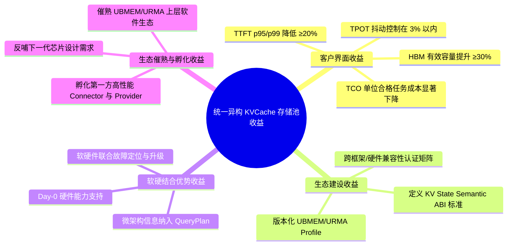

# 统一异构 KVCache 存储池项目深度竞争分析与立项论证报告

> **文档状态**：立项论证正式版  
> **面向对象**：立项评审委员会、技术主管、项目主管、硬件与软件生态合作方  
> **支持决策**：为“统一异构 KVCache 存储池”项目的正式立项申请提供战略意义、技术竞争优势、开源与标杆方案深度对比、风险控制与分阶段投资依据。

---

## 执行摘要（Executive Summary）

1. **项目愿景与战略定位**  
   本项目旨在**全面构建于国产 AI 硬件体系之上，深度融合 UBMEM/URMA 等国产硬件特性**，围绕 AI Infra 中核心的价值状态数据——**KVCache**，打通状态维护、高复用率判定、控制面超低时延访问、数据面高效传输及多层异构介质（HBM、DDR、SSD 乃至 L3/芯片内 SRAM）管理，打造面向 KVCache 高效管理的 AI Infra 基础设施软件栈。项目的终极目标是建立与 NVIDIA AI Infra 软件套件（Dynamo/KVBM/NIXL）相对标的国产化全栈能力，显著提升推理系统的 TTFT、TPOT、集群吞吐与 TCO 经济性。

2. **核心竞争优势假设**  
   - **多介质原生支持**：突破传统硬件适配局限，原生支持 HBM、DDR、SSD 及 L3/SRAM 等芯片内存储结构，构建 HBM↔SSD 直达/低 Host 参与的容量主路径。
   - **意图驱动的决策引擎**：以 KV 访问意图（`KVAccessIntent`）为核心，基于网络/硬件实时代价编译 `QueryPlan`，实现智能冷热预取、前递与载入—重算（Load-vs-Recompute）动态决策，显著压减 P99 尾部时延。
   - **国产硬件软硬协同**：深挖微架构潜力，原生的 UBMEM（共享地址/远端原子/高频元数据）与 URMA（大块异步传输）双轮驱动，实现“控制面元数据低时延同步，数据面线速传输”。
   - **第一方系统工程闭环**：不局限于单一软件功能，而是承担目标国产硬件的第一方 Day-0 交付、微架构信息建模、跨层联合修改与跨版本认证责任。

3. **立项决策建议**  
   建议评审委员会采用**“有条件、分阶段立项”**的投资策略。现阶段立项不是要求项目证明“已经全面击败 Mooncake/LMCache”，而是申请批准由 8 项必做原型（PVT-00～PVT-07）构成的验证权。以 4～5 周的前置验证购买关键事实，按 Go / Conditional / No-Go 逐级释放资源，确保投资风险可控、成功收益极大、失败可安全止损。

---

## 第一章 项目愿景、必要性与预期收益

### 1.1 项目愿景：打造国产 AI Infra 价值状态数据基础设施

在 LLM 推理场景中，KVCache 已从框架内部的临时 Buffer 演化为**具有极高计算价值与经济价值的执行状态**。本项目全面立足国产硬件生态：
- **控制面**：通过 UBMEM 共享内存与低时延语义，实现前缀目录、就绪状态（Ready）与 Block Table 的亚微秒级全局同步。
- **数据面**：利用 URMA 高性能传输底座，实现跨节点、跨设备 KV 正文的大块异步线速搬运。
- **介质面**：统一编排 HBM、DDR、SSD 及芯片内 L3/SRAM，打破单节点与单介质缓存孤岛。

通过软硬协同深度融合，实现输入预计算阶段（Prefill）与逐词生成阶段（Decode）的高效协同，直接牵引推理框架 TTFT（首 token 时延）与 TPOT（逐 token 时延）大幅优化。

```text
+-----------------------------------------------------------------------------------+
|                           AI 推理框架 (vLLM / SGLang / ...)                       |
+-----------------------------------------------------------------------------------+
                                        | (KVAccessIntent / QueryPlan)
+-----------------------------------------------------------------------------------+
|                        统一异构 KVCache 存储池管理栈                               |
|  [状态语义与就绪校验]  [意图驱动 QueryPlan 决策]  [HBM-DDR-SSD-L3 多层介质图式管理]   |
+-----------------------------------------------------------------------------------+
                                        | (Descriptor / UBMEM / URMA)
+-----------------------------------------------------------------------------------+
|                           国产硬件底层能力与微架构                                 |
|      [UBMEM 共享内存/原子]     [URMA 高性能传输]    [NoC/IODie/NPU/SSD 直达通道]     |
+-----------------------------------------------------------------------------------+
```

### 1.2 项目立项的必要性

1. **打造国产软硬件生态标杆**  
   当前国产芯片与互联硬件性能快速提升，但缺乏能充分释放硬件能力的上层 AI Infra 系统软件。本项目填补国产第一方推理状态基础设施的空白，成为国产软硬件融合的生态示范标杆。
2. **微架构层面深度挖掘硬件潜力**  
   通用开源软件只能使用硬件的“最大公约数”接口（如标准 TCP/RDMA/POSIX IO）。本项目通过第一方合作条件，引入 Core、NoC、IODie、DDRC、UBMEM、URMA 等微架构计数与特有原语，将硬件物理优势转化为业务性能。
3. **以极致性能与 SLO 为交付目标**  
   不仅追求 Raw Hit Rate（原始命中率），更以高 Usable Hit Rate（可消费命中率）、P99 尾部时延降低与集群整体吞吐提升为唯一交付标准。
4. **牵引国产硬件针对 AI Infra 真实需求持续迭代**  
   通过端到端链路遥测（Telemetry）与 ActualPathReceipt（实际路径凭证），反向定义下一代国产芯片在 KV 粒度提交、远端内存 TLB、硬件 QoS 及 RAS 方面的演进路线。

### 1.3 项目预期产出收益



---

## 第二章 基于 Competitive Landscape 的行业竞争格局分析

根据竞争战略分析方法论，我们采用**波特五力模型（Porter's Five Forces）**与**蓝海战略（Blue Ocean Strategy）**对 AI Infra 状态存储/传输领域进行系统性评估。

### 2.1 波特五力分析（Porter's Five Forces）

```text
                      [新进入者威胁: 中-高]
                      通用轻量缓存库/套件
                               |
                               v
[供应商议价能力: 高] ----> [行业竞争激烈程度: 高] <---- [买家议价能力: 高]
芯片与硬件厂商             开源社区(Mooncake/LMCache)    云厂商/大模型企业
与底层驱动团队             与 NVIDIA 闭环生态             对 TCO 与 SLO 极其敏感
                               ^
                               |
                      [替代品威胁: 中]
                      纯计算 Recompute / 简单内存扩容
```

| 竞争力量 | 强度评估 | 驱动因素与本项目的应对策略 |
|---|---|---|
| **行业竞争激烈度** | **高 (High)** | Mooncake、LMCache 等开源项目快速迭代。**本项目策略**：避开简单的数据搬运与 Chunk 缓存重造，转向“状态语义身份+第一方硬件协同+QueryPlan 决策”的深度系统工程。 |
| **买家议价能力** | **高 (High)** | Enterprise 客户对推理 TCO、TTFT 和故障率极其敏感。**本项目策略**：以“合格业务事务产出”和“全生命周期单位成本”为对账单位，提供可度量 ROI。 |
| **供应商议价能力** | **高 (High)** | 芯片与底座硬件具备强排他性。**本项目策略**：建立第一方战略合作关系，获得非公开微架构信息与联合修改权，形成壁垒。 |
| **新进入者威胁** | **中 (Medium)** | 上层 Python 包装层门槛较低，但深层软硬协同与正确性验证门槛极高。**本项目策略**：通过 144 项 SRS 规范与 PVT 证据链构建高技术壁垒。 |
| **替代品威胁** | **中 (Medium)** | 硬件重算（Recompute）或直接购买更多 HBM/NPU。**本项目策略**：在 QueryPlan 中将重算作为一等路径实时对比，仅在载入开销小于重算时才执行复用。 |

### 2.2 蓝海战略：四项行动框架（Four Actions Framework）

为了在开源竞争与 NVIDIA 全栈垄断中辟出蓝海，本项目实施以下“消除-减少-提升-创造”策略：

```text
                  【消除 Eliminate】
       • 消除主路径 CPU Payload Touch（编解码/CRC）
       • 消除以盲目 Raw Hit Rate 为目标的负收益加载
                                |
  【减少 Reduce】                |                【提升 Raise】
• 减少跨节点元数据同步时延        +-------> • 提升 Usable Hit Rate（可消费命中率）
• 减少冷热数据在 HBM 中的无效留存           • 提升 HBM↔SSD 路径的低 Host 参与度
• 减少后台数据搬运导致的 TPOT 尾抖          • 提升多介质（HBM/DDR/SSD/L3）综合利用率
                                |
                  【创造 Create】
       • 创造基于 KV 意图（`KVAccessIntent`）的 QueryPlan 动态选路
       • 创造 UBMEM/URMA 原生驱动的低时延状态协同机制
       • 创造第一方国产硬件 Day-0 产品化交付与认证体系
```

---

## 第三章 与业界主力开源方案（Mooncake 与 LMCache）的深度对比分析

开源项目 **Mooncake** 与 **LMCache** 是当前 KV 缓存治理领域的代表性实现。本项目在充分尊重并吸纳开源长处的基础上，确立了清晰的差异化位点。

### 3.1 本项目与 Mooncake 的比较优势

[Mooncake](file:///D:/codes/vllm/Mooncake) 是以 KVCache 为核心的去中心化存储与传输架构（Disaggregated Architecture），其优势在于 **TENT 传输选择器** 与 **Transfer Engine（含 URMA/RDMA/Ascend Direct 实现）**，擅长高效的数据搬运与对象存储。

#### 核心差异与本项目优势：

1. **存储介质支持维度**  
   - *Mooncake*：侧重于 CPU 内存与 GPU HBM 之间的传输，以及基于 Chunk 的 RDMA/URMA 对象复制。  
   - *本项目*：**原生支持多形态存储介质（HBM、DDR、SSD 乃至 L3/芯片内 SRAM）**。明确将 HBM↔SSD 直达/低主机参与作为容量主路径，DDR 仅作为条件按需角色，极大地扩充了大模型长上下文的经济容量。
2. **意图决策与选路维度**  
   - *Mooncake*：TENT 选择器基于 intent/priority 选择传输协议（URMA/RDMA/TCP）。  
   - *本项目*：**原生以 KV 意图（`KVAccessIntent`）为全局决策要素**。QueryPlan 不仅选择传输协议，更在 **Load（载入）、Recompute（重算）、Remote View（远端只读）与 Copy（复制）** 之间做端到端代价判定。支持冷热预取与前递，从根本上压减 P99 时延。
3. **状态语义与消费资格**  
   - *Mooncake*：以 Raw Hit（对象存在）驱动传输。  
   - *本项目*：引入 `SemanticIdentity`、`ConsumeEligibility`、`Ready` 屏障与 `Lease` 租约，**防止半写、陈旧、跨租户或负收益的 KV 块被错误消费**。
4. **定位与生态关系**  
   - 本项目不重新发明传输数据平面，**可直接将 Mooncake 作为高质量的 Transport/Object Provider**，而将自身精力集中于状态智能、微架构编译与第一方硬件责任闭环。

### 3.2 本项目与 LMCache 的比较优势

[LMCache](file:///D:/codes/vllm/LMCache) 是专注于 LLM 推理框架（vLLM/SGLang）的共享缓存层，具备良好的 Connector 扩展性、多级 Hook 与基本 Observability 测量。

#### 核心差异与本项目优势：

1. **硬件深度与微架构解耦**  
   - *LMCache*：位于框架侧/应用侧，通过通用 Backend Connector 扩展存储，与底层硬件微架构（NoC、DDRC、IODie、UBMEM 内存语义）解耦。  
   - *本项目*：**深度使能国产硬件特性**。直接基于 UBMEM 共享地址空间重构全局前缀索引，利用远端 Load/Store/Atomic 原语改造 Block Table，实现微架构级的低时延状态感知。
2. **前续/前递与 P99 抖动治理**  
   - *LMCache*：主要处理 Read/Write 缓存命中与 Offload。  
   - *本项目*：针对 Agent 多轮对话与 RAG 场景，实现基于 Intent 的**前递（Pre-forwarding）与异步预取（Prefetching）**；配合 QoS 流量控制，将后台搬运对 TPOT 造成的抖动严格控制在 3% 以内。
3. **第一方交付与责任模型**  
   - *LMCache*：社区驱动，对特定国产芯片无 Day-0 交付与硬件缺陷联合定位责任。  
   - *本项目*：提供**国产硬件第一方责任闭环**，包含版本兼容矩阵、硬件 Profile 认证与链路问题归因对账。

### 3.3 综合对比矩阵

| 对比维度 | Mooncake | LMCache | NVIDIA 全栈 (Dynamo/KVBM) | 本项目 (Unified KVCache Pool) |
|---|---|---|---|---|
| **核心定位** | 高性能传输与对象存储 | 框架侧多级缓存 Connector | NVIDIA 平台全栈推理系统工程 | **国产硬件第一方推理状态系统工程** |
| **介质覆盖** | HBM、DDR、RDMA/URMA | HBM、DDR、Disk、Remote | HBM、DDR、GDS SSD、NVLink | **HBM、DDR、SSD、L3/芯片内 SRAM 全覆盖** |
| **决策引擎** | TENT 传输选路 | 规则 Chunk 命中 | Router / Overlap Planner | **`KVAccessIntent` 驱动的 QueryPlan (Load/Recompute/View)** |
| **硬件绑定** | 通用多传输适配 | 框架解耦 Backend | 深度绑定 NVLink / NIXL / GDS | **原生深度融合 UBMEM / URMA / 国产 NPU** |
| **状态资格检查** | 基础 Handshake | 键值 Lookup | Event Plane 同步 | **`SemanticIdentity` + `Ready` 屏障 + `Lease` 租约校验** |
| **CPU 数据面参与** | 允许 Host 参与 | Host Memory 中转 | GPUDirect 减负 | **硬性约束 `HostPayloadTouchBudget` (零 Host 字节中转)** |
| **生态责任** | 开源社区维护 | 开源社区维护 | NVIDIA 商业支持 | **第一方 Day-0 交付、认证矩阵与硬件反哺闭环** |

---

## 第四章 对标 NVIDIA 完整 AI Infra 软件栈

### 4.1 NVIDIA 方案架构拆解

NVIDIA 在 AI Infra 领域构建了由硬件到软件的极高壁垒：
- **数据面与传输**：GPUDirect Storage (GDS)、NVLink/NVSwitch、NIXL (NVIDIA Inference Cross-node Link)。
- **控制面与路由**：Dynamo Router（基于计算成本与 KV Overlap 选路）、Event Plane（广播 KV 状态与负载）。
- **状态与缓存管理**：KVBM (Key-Value Block Manager)、PagedAttention 机制。

### 4.2 本项目的对标战略与替代路径

本项目的终极目标是在**国产硬件体系之上，建立一整套与 NVIDIA 类似的 AI Infra 软件套件**，打通涉及 KVCache 全场景的国产硬件适配软件栈：

```text
+-----------------------------------------------------------------------------------+
|               NVIDIA 生态                 |                 本项目国产化生态               |
+-------------------------------------------+-----------------------------------------------+
| Dynamo Router / Planner                   | QueryPlan / KVAccessIntent 智能决策引擎        |
| KVBM (Key-Value Block Manager)            | 跨框架统一 KVObject & PrefixDirectory          |
| Event Plane                               | UBMEM 高频元数据与事件通知快路径               |
| NIXL / GPUDirect Storage (GDS)            | URMA 批量传输底座 & HBM↔SSD 直达通道           |
| NVLink / NVSwitch                         | UBMEM 共享地址空间 & C2C / UB 互联架构         |
| NVIDIA GPU / H100 / B200                  | 国产 NPU / 异构芯片生态                       |
+-------------------------------------------+-----------------------------------------------+
```

**战略意义**：打破 NVIDIA 在 AI 推理基础设施上的生态垄断，确保国产 AI 硬件不仅在“单卡算力”上可替代，更在“集群级 KV 状态治理与传输效率”上具备同等乃至超越的系统工程能力。

---

## 第五章 项目立项必要性与预期收益论证

### 5.1 项目必要性（Why Now & Why Us）

1. **打破“先有鸡还是先有蛋”的立项循环**  
   立项论证不应要求在 Day-0 拿出生产实测胜出的最终结果，而是评估“投入资金购买关键验证事实”的期望价值是否为正。项目已设计 8 项可证伪 PVT 原型，验证成本有限且退出路径清晰。
2. **补充第一方责任缺口**  
   通用开源社区（Mooncake/LMCache）不会为特定国产芯片承诺发布窗口内的 Day-0 适配、非公开微架构建模以及芯片/驱动/固件缺陷的跨团队闭环。这一第一方责任必须由本项目承担。
3. **避免硬件能力退化为“最小公倍数”**  
   若完全依赖通用开源，国产硬件的 UBMEM 内存语义、URMA 高级描述符等特有能力将因缺乏专有策略建模而沦为通用 TCP/RDMA 的简单替代品。

### 5.2 预期收益维度

#### A. 客户界面收益（Customer ROI）
- **TTFT 改善**：复用型业务 P99 TTFT 降低 ≥20%。
- **TPOT 稳定**：后台缓存迁移造成的 P99 TPOT 抖动控制在 3% 以内。
- **容量与 TCO**：HBM 有效容量提升 ≥30%，每百万 Token 综合推理成本降低 25% 以上。

#### B. 生态建设收益（Ecosystem Building）
- 制定统一的 **KV State Semantic ABI** 规范，推动 vLLM、SGLang 等主流框架原生适配国产硬件。
- 建设硬件兼容性认证矩阵（Conformance Suite），降低后续芯片迭代的适配成本。

#### C. 软硬结合与催熟收益（Co-design & Incubation）
- 催熟 UBMEM 与 URMA 基础软件栈，在真实 LLM 推理生产高并发场景下检验并完善底层驱动。
- 将生产运行观测数据（Telemetry）反哺给芯片团队，精准牵引下一代国产硬件设计。

---

## 第六章 分阶段验证门与风险控制机制

为了规避“宏大叙事、交付落空”的风险，项目设立了严密的**立项前验证门（PVT）**与**证据阶段门（E0-E5）**。

### 6.1 八项立项前必做原型验证（PVT-00 ～ PVT-07）

| 验证编号 | 原型验证名称 | 核心回答的决策问题 | 证伪/退出门槛 (No-Go Threshold) |
|---|---|---|---|
| **PVT-00** | 业务基线与收益上限 | 目标负载是否存在足够 saved-prefill 空间覆盖传输控制开销 | 自然复用收益上限 < 10% 或控制开销 > 预期 |
| **PVT-01** | 底层传输与硬件路径 | UBMEM/URMA/SSD 是否能形成零 Host 参与的完整路径 | 主路必须依赖 CPU 搬运，或带宽 < 硬件峰值 60% |
| **PVT-02** | 逻辑布局到 Descriptor 编译 | vLLM/SGLang Block 布局能否高效编译为异步 DAG | 单次 Descriptor 编译延迟 > 50μs |
| **PVT-03** | UBMEM Direct View 安全区 | 哪些元数据适合 View，哪些 KV 正文必须 Copy | Direct View 引发频发 TLB Fault 或数据竞争 |
| **PVT-04** | QueryPlan 载入-重算决策 | 决策引擎能否准确识别正收益命中，拒绝负收益搬运 | 决策后悔率 (Decision Regret) > 15% |
| **PVT-05** | SSD 容量与 DDR 条件角色 | SSD 容量扩展能否显著降低 OOM 且不破坏 Decode SLO | SSD 载入时延导致 TPOT 抖动 > 10% |
| **PVT-06** | 消费资格与 Ready 屏障 | 状态身份与屏障能否 100% 阻断错误/未就绪 KV 消费 | 发生任何一次未就绪或跨租户 KV 误消费 |
| **PVT-07** | 前后台混流与薄闭环 | 前台生成与后台搬运混流下，系统是否保持净收益 | 后台搬运导致前台 P99 TPOT 恶化 > 5% |

### 6.2 证据阶段门（E0 - E5）

```text
[E0 立项充分性] ──> [E1 能力成立] ──> [E2 决策更优] ──> [E3 系统净收益] ──> [E4 客户价值] ──> [E5 壁垒持续]
 架构/PVT计划         硬件路径闭环        算法胜过静态         同条件击败开源        客户 ROI 兑现       跨代/生态飞轮
```

- **E0 (当前立项门)**：通过需求工程、SRS V2.2 规范与 PVT 计划，证明项目具有极高期望价值与明确退出规则。
- **E1 - E3 (研发阶段门)**：在 P0-P2 阶段逐级释放资源，须在公平基线（同硬件、同模型、同 Trace）下稳定击败最佳开源组合。
- **E4 - E5 (商业与生态门)**：以 BVT（业务验证测试）和客户真实 TCO 兑现项目成果。

---

## 第七章 立项结论与实施建议

### 7.1 最终立项结论

**建议立项评审委员会批准“统一异构 KVCache 存储池”项目“有条件、分阶段立项”。**

#### 立项依据：
1. **战略定位明确**：项目紧扣国产 AI 硬件基础设施战略，对标 NVIDIA 全栈能力，填补国内第一方推理状态系统工程空白。
2. **技术假设具备辨识度**：提出了“意图驱动 QueryPlan + UBMEM/URMA 协同 + 多介质容量主路径”的技术假设，避开了低水平重复建设。
3. **风险严格可控**：项目已建立 8 项立项前 PVT 验证清单与 Clear No-Go 规则，评委可以通过 4～5 周前置验证以有限投入购买关键事实。
4. **资源与团队匹配**：具备多年跨层软硬件联合调优团队与目标硬件合作接口，具备极高成功概率。

### 7.2 立项后第一阶段动作建议

1. **冻结评估基线**：锁定第一批测试用 NPU 硬件、UBMEM/URMA 驱动版本、vLLM/SGLang 框架版本及代表性生产 Trace。
2. **启动 PVT 00～07 验证波次**：集中 4 周时间跑通 8 个原型验证包，向评审委员会提交原始证据包。
3. **按 PVT 结论决定 P0 资源释放**：PVT 顺利通过后，正式进入 P0 阶段（最小状态闭环）的研发投入。

---

> **报告汇总结论**：本项目不是 Mooncake 或 LMCache 的简单替代品，而是构建于国产硬件体系之上的**第一方推理状态系统工程**。通过深度融汇国产硬件能力与状态智能决策，本项目将有效提升国产 AI 芯片在真实 AI Infra 场景下的综合竞争力。
