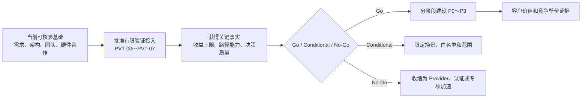

# 统一异构 KVCache 存储池项目竞争力与业界方案深度对比分析报告

## Executive Summary

- **当前需要证明的不是“项目已经优于 Mooncake、LMCache”，而是“项目值得被批准去验证并创造这种优势”。** 项目尚处立项论证期，要求现阶段拿出完整产品和客户实测优势，会形成“未立项所以没有证据、没有证据所以不能立项”的循环。正确的投资问题应是：目标问题是否重要、技术假设是否有辨识度、团队和合作资源是否匹配、成功上行是否足够大、验证成本是否有限、失败能否及时止损。
- **建议采用“有条件、分阶段立项”，而不是无条件相信，也不是等待完整结果。** 现有 SRS 与原型验证清单已经定义统一业务基线、硬件路径、QueryPlan、可消费状态、容量价值、QoS 薄闭环，以及 Go/Conditional/No-Go。评委可先批准 4～5 周立项前验证和最小纵向切片，再根据证据逐级释放 P0—P3 资源，从而用有限投入购买关键信息。
- **项目的潜在竞争优势来自一种第一方系统工程闭环，而不是若干暂时领先的软件功能。** 其核心是：把 KVCache 定义为有身份、版本、消费资格和经济价值的执行状态；把 View、Load、Move、Recompute、Drop 编译为面向客户 SLO 的 QueryPlan；把 Core、NoC、IODie、内存、IO、UBMEM/URMA、网络、SSD、NPU、功耗与 RAS 约束编译为实际可执行路径；再通过生产数据和硬件联合设计持续改善决策。
- **如果项目成功，客户获得的不是“更多缓存”，而是在相同模型质量、业务 SLO 和硬件预算下完成更多合格业务事务，并降低单位成本、尾延迟和运行风险。** 只有当这种收益相对经过目标硬件适配和充分调优的最佳开源组合仍然成立，且能够跨工作负载、客户和芯片代际复现，项目才最终形成竞争壁垒。在此之前，应将其称为“有独特禀赋支撑、可证伪的竞争优势假设”。

---

## 一、文档定位：这是立项投资论证，不是产品验收报告

### 1.1 本报告支持的决策

| 项目 | 本报告口径 |
|---|---|
| 当前阶段 | 立项论证阶段，尚未形成完整产品和客户生产结果 |
| 评委需要决定 | 是否批准分阶段投入，验证并建设这一系统工程能力 |
| 当前能够证明 | 需求问题、架构假设、合作与团队基础、可验证性、上行价值、风险和退出机制 |
| 当前不能证明 | 已经稳定优于 Mooncake、LMCache、Dynamo，已经形成客户 ROI 或持久壁垒 |
| 项目成功后必须证明 | 决策改变、系统净收益、客户价值、竞争增量和跨代持续性 |
| 推荐结论形式 | 有条件立项、分阶段放行、证据驱动扩项、No-Go 时收缩 |

本文的核心结论不是“请评委相信项目一定成功”，而是：

> **请评委批准一项由独特资源禀赋支持、上行价值高、验证路径明确、失败可退出、成功可形成复合壁垒的战略性系统工程投资。**

### 1.2 必须区分四类表述

| 表述类型 | 含义 | 当前是否允许 |
|---|---|---|
| 已验证事实 | 已有材料、代码、协议或实验能够直接支持 | 允许，但必须给出证据来源 |
| 立项基础 | 合作、团队、需求设计和验证条件提高成功概率 | 允许，但需核验条件和责任人 |
| 技术假设 | 项目认为能够改变决策并产生收益的机制 | 允许，必须可证伪 |
| 未来承诺 | 项目完成后应交付的能力、指标和客户结果 | 允许，但不得表述为当前成绩 |

所有“领先”“优于”“形成壁垒”等结果性词语，都必须对应未来 E1—E5 证据门。当前合格表述是“潜在优势”“差异化假设”“预期交付”和“有条件成立”。

---

## 二、如何打破“先有鸡还是先有蛋”的立项循环

### 2.1 立项判断本来就不是事后验收

完整产品验收回答：**项目是否已经创造了价值？**

立项评审回答：**以当前信息看，投入验证和建设是否具有正的概率加权价值？**

可以把立项合理性表达为：

```text
立项期望价值
= 成功概率 × 成功后的客户、平台与生态上行
 － 分阶段研发投入
 － 失败时不可回收成本
 － 等待或完全依赖外部开源演进的机会成本
```

评委不需要在今天知道最终 TTFT 一定降低多少，但应当能够判断：

1. 问题是否真实并且足够重要；
2. 本项目是否提出了比“增加一层缓存”更有解释力的技术假设；
3. 项目团队是否拥有更适合验证该假设的资源；
4. 是否能以有限成本快速得到关键证据；
5. 成功后的收益是否足以覆盖投入；
6. 失败时能否保留 Provider、测试、能力矩阵等可复用资产并及时止损。

### 2.2 正确的破局方式是“批准验证权”，不是提前宣判胜利



这不是降低立项标准，而是把标准从“不可能提前完成的结果证明”，改成“高质量投资应有的假设、资源、门禁和退出纪律”。

### 2.3 本项目已经具备可执行的证伪设计

现有《关键技术原型验证清单 V1.5》已经设计：

- 8 个立项前必做 PVT；
- 3 个条件/证伪 CVT；
- 统一 workload、Trace、时钟和基线；
- 4～5 周建议波次；
- Go、Conditional、No-Go 门槛；
- 原始证据包、Commit 和评审签字；
- 原型直接演进为正式模块的资产路径。

因此，本项目不是要求评委一次性批准一个不可验证的宏大愿景，而是可以按“事实与基线—语义与执行链—容量与消费—薄闭环总门禁”逐步购买信息。

---

## 三、五种关键权利：哪些可以作为基础，哪些必须设为条件

### 3.1 权利不是竞争结果，而是成功概率加速器

| 权利 | 当前建议口径 | 立项前应核验的最低证据 | 项目中的作用 | 边界 |
|---|---|---|---|---|
| 信息权 | 可作为高可信条件假设 | 硬件合作意向、技术接口人、信息开放范围、时间窗口 | 提前获得芯片、固件、驱动、计数器和路线信息 | 获得信息不等于已经形成高性能路径 |
| 控制权 | 可作为有条件基础 | 跨团队 RACI、问题升级通道、修改与验证 SLA | 当瓶颈位于驱动、固件或芯片时能够推动修改 | 能提出需求不等于修改一定进入产品 |
| 数据权 | 部分可获取、分阶段建设 | 数据分类、脱敏方案、客户联创条款、留存和访问控制 | 校准工作负载、成本模型和策略 | 不得把获取客户原始 KV 正文设为首期硬前提 |
| 责任权 | 定义为有边界的产品责任 | 版本兼容矩阵、故障边界、支持接口、联合责任模型 | 对软件自身路径、证据、回退和版本演进负责 | 不替客户对所有业务 SLO 无限兜底 |
| 迭代权 | 定义为联合演进能力 | 版本节奏、回归环境、硬件问题闭环机制 | 持续改进软件、驱动、固件和硬件 | 不是无限服务承诺，也不保证每项硬件建议被采纳 |

### 3.2 数据权不充分，不阻断首期项目成立

建议采用三阶段数据策略：

1. **立项前验证**：客户脱敏 Trace 优先；若暂时拿不到，则使用固定版本的公开数据、ShareGPT 类请求集和版本化 Zipf/长上下文合成轨迹，并明确不能直接外推客户收益。
2. **客户联创**：只采集能够改变状态决策、客户 SLO 或硬件设计的数据，优先使用聚合指标、匿名对象标识、路径和资源遥测，不长期保存客户 KV 正文。
3. **生产演进**：形成 State Operations Data、工作负载画像、性能包络和决策反例库；模型版本、漂移、访问控制、留存和回滚必须纳入治理。

数据权是 State Intelligence 飞轮的增强条件，不应成为 P0 能否跑通状态闭环和硬件路径的先决条件。

### 3.3 责任权应采用“共同责任模型”

项目可以承诺：

- 状态身份、消费资格和 Ready 语义正确；
- 计划路径与实际路径可核验；
- 软件控制开销、失败边界和 fallback 可度量；
- 版本、兼容、回滚和问题归因有明确责任人；
- 驱动、固件和硬件问题能够进入联合闭环。

项目不应承诺：

- 对客户模型质量、业务流量、应用代码和外部依赖承担无限责任；
- 无条件满足所有模型、硬件、上下文和并发组合；
- 在缺少基线、Trace 和可观测性的情况下承诺确定收益。

---

## 四、现有需求已经体现的架构先进性

### 4.1 先进性不在名词，而在是否改变执行动作

现有 SRS 已经把状态理解转化为一组能够改变系统行为的对象：

```text
KVAccessIntent / PrefixBudget
  → SemanticIdentity / PrefixDirectory
  → ConsumeEligibility / Ready / Lease / Rank Consensus
  → CapabilityGraph / Path Cost
  → QueryPlan
  → Descriptor / Fence / AttachHandle
  → Actual Path / Fallback / Telemetry
  → TTFT、TPOT、容量、NPU与客户价值对账
```

这条链比“命中后从某一层读回 KV”多回答了六个问题：

1. 物理命中的对象是否与当前推理语义一致；
2. 对象是否已经完成、可见并可安全消费；
3. 加载、远程 View、迁移还是重算更划算；
4. 哪个副本和哪条硬件路径在当前时刻最优；
5. 计划路径是否真的按预期执行，是否发生隐藏中转；
6. 这次决策最终是否改善客户 SLO 和单位成本。

### 4.2 六条“技术品味”及其可执行含义

| 技术品味 | 对系统动作的影响 | 对客户价值的潜在作用 |
|---|---|---|
| 语义先于位置 | raw hit 不满足版本、布局、租约、Ready 时拒绝消费 | 降低错误输出、死锁和隐蔽正确性风险 |
| 价值先于容量 | 只有正收益状态才准入、保留、加载和复制 | 避免为了 Hit Rate 消耗更多网络、SSD和控制开销 |
| 重算是一等路径 | Load/View/Recompute 在同一 QueryPlan 中比较 | 防止“命中但比重算更慢”，改善 TTFT 尾部 |
| Ready 先于消费 | completion、fence、完整性证据共同形成消费资格 | 防止半写、陈旧和跨 Rank 不一致状态被使用 |
| 实际路径先于宣传路径 | 记录 Direct、Staged、Host Touch 和 fallback | 防止收益被隐性 CPU/DDR 中转抵消 |
| 开放数据平面、自主语义控制 | Mooncake、LMCache、NIXL 等可作为 Provider | 保持生态速度，同时掌握目标平台决策和证据责任 |

### 4.3 现有 PVT 已把品味变成可证伪问题

| 关键假设 | 对应 PVT | 必须回答的问题 |
|---|---|---|
| 目标负载存在状态复用价值 | PVT-00 | 自然复用和 saved-prefill 上限能否覆盖控制、传输和 Attach 成本 |
| 硬件能力能形成真实路径 | PVT-01 | UBMEM/URMA、RDMA、SSD 等能否形成低 Host 参与且完整性闭环的路径 |
| 逻辑布局可编译为硬件执行 | PVT-02 | vLLM/SGLang 布局能否变成批量 Descriptor 和异步 DAG |
| Direct View 有明确安全区 | PVT-03 | 哪些元数据/状态适合 View，哪些 KV 必须 Copy-to-HBM |
| 状态理解能改变决策 | PVT-04 | QueryPlan 能否识别正收益命中并选择副本、路径或重算 |
| 字节容量能转为服务能力 | PVT-05 | SSD 容量和 DDR 条件角色是否提高稳定并发并降低 OOM |
| 物理命中能转为可消费命中 | PVT-06 | SemanticIdentity、Ready、Lease、Rank 是否阻断错误消费 |
| 局部收益能转为在线净收益 | PVT-07 | 前后台混流下 TTFT、TPOT、QPS、NPU 和 fallback 是否形成薄闭环 |

这说明项目的架构先进性不是事后包装，而已经进入需求、对象、接口、实验和退出门。

---

## 五、本项目在立项时可主张的五类潜在优势

### 5.1 架构优势：优化对象从“缓存容量”升级为“状态价值”

Mooncake、LMCache 等项目正在快速增强存储、传输、路由和状态能力，因此任何单一功能都可能收敛。本项目更有辨识度的地方，是把以下对象放入同一决策闭环：

- 状态的语义身份和消费资格；
- 状态已经支付的计算成本和未来复用概率；
- 加载、远程访问、迁移与重算的实时机会成本；
- 客户请求的 deadline、TTFT/TPOT 和业务优先级；
- 芯片、互联、内存、IO、SSD、功耗和 RAS 的能力边界；
- 计划、实际执行和结果之间的可审计凭证。

这套架构的潜在优势不是保证更高 raw hit，而是争取更高的**正价值可消费命中率**。在某些负载上，本项目完全可能主动降低 raw hit，却因为减少负收益加载而获得更好的 TTFT、TPOT 和单位成本。

### 5.2 AI Infra 品味优势：北极星不是 Hit Rate，而是合格业务产出

项目把计算、内存、网络和存储视为获取执行状态的可替代资源，把重算视为一种可调度路径。这意味着系统不为某个局部组件 KPI 服务，而为以下目标服务：

> **在相同模型质量、客户 SLO 和硬件预算下，完成更多 SLO 合格的请求、会话、回答或 Agent 任务。**

Hit Rate、TTFT、TPOT、带宽和容量都是重要指标，但它们分别只是状态资格、服务体验和资源效率的中间变量。项目的“品味”最终必须体现在能够解释局部优化何时有价值、何时应被拒绝。

### 5.3 软硬件协同优势：目标硬件的第一方责任闭环

如果硬件合作条件成立，本项目相对通用开源项目拥有更高概率获得：

- 芯片发布前或发布窗口内的信息；
- Core、Cache、NoC、IODie、DDRC、IO、功耗和 RAS 等微架构计数与限制；
- 驱动、固件和芯片问题的联合定位通道；
- 针对 KV 状态访问模式的性能包络和异常注入环境；
- 新硬件能力进入默认 QueryPlan 的 Day-0 节奏。

这不是“支持 UBMEM/URMA”本身的优势，而是把硬件原语第一时间转成经过认证、可回退、能改善客户指标的产品路径。

### 5.4 组织与人才优势：多年跨层优化经验降低试错成本

立项方提出的多年软硬联合优化人员基础，是项目的重要成功概率加速器。真正有价值的不是简历年限，而是能否证明团队具备以下能力组合：

- 同时理解推理框架、KV 布局、异步流水和 Scheduler；
- 能够定位 CPU、NPU、内存、NoC、PCIe、NIC、SSD 和队列瓶颈；
- 能够把性能现象转化为驱动、固件或芯片需求；
- 能够建设可复现 microbench、Trace、故障注入和长稳环境；
- 能够在收益不足时主动关闭复杂硬件能力，而不是为了技术新颖度扩张范围。

建议在立项材料中用过去项目案例、已关闭的软硬件问题、性能定位报告、专利/Commit、关键岗位覆盖和合作方评价证明这一基础，而不是只使用“经验丰富”的定性描述。

### 5.5 开放生态优势：不重造数据平面，集中投入独立责任

项目可以把 Mooncake 作为高质量传输/对象数据平面，把 LMCache 作为框架侧 Connector 或复用层之一，把 NIXL、GDS、SPDK、io_uring 等作为 Provider。自主投入集中在：

- 状态语义与消费资格；
- CapabilityGraph 与 QueryPlan；
- 目标硬件第一方 Provider 和认证；
- ActualPathReceipt 和客户价值对账；
- State Intelligence 和硬件反馈。

这既降低重复建设成本，也使项目差异不依赖“竞品暂时没有某个 Backend”。

---

## 六、与 Mooncake、LMCache、Dynamo 的公平比较

### 6.1 开源方案不能被弱化为“只会搬数据”

[Mooncake TENT](https://kvcache-ai.github.io/Mooncake/design/tent/transport-selector.html) 已能按 intent、priority、内存类型、位置、大小、设备和 fallback 选择传输；[Kunpeng UB Transport](https://kvcache-ai.github.io/Mooncake/design/transfer-engine/kunpeng_ub_transport.html) 已使用 URMA，[Ascend Direct](https://kvcache-ai.github.io/Mooncake/design/transfer-engine/ascend_direct_transport.html) 也支持相应 NPU 传输能力。

[LMCache Architecture](https://docs.lmcache.ai/developer_guide/architecture.html) 已覆盖 GPU、CPU、磁盘和远端多级存储，具有 Connector、索引、异步 Offload 和 Controller；[LMCache Metrics](https://docs.lmcache.ai/production/observability/metrics.html) 已覆盖 lookup、hit、retrieve/store latency、远端延迟、P2P、生命周期和健康状态；其 [Native Backend](https://docs.lmcache.ai/developer_guide/extending_lmcache/native_connectors.html) 也允许第三方高性能扩展。

[NVIDIA Dynamo Overall Architecture](https://docs.nvidia.com/dynamo/design-docs/overall-architecture) 已把请求、控制、状态/事件、Router、KVBM 和 NIXL 组织为系统工程；[Dynamo Router](https://docs.nvidia.com/dynamo/components/router) 使用 KV overlap 与计算成本路由，[Event Plane](https://docs.nvidia.com/dynamo/dev/design-docs/communication-planes/event-plane) 传播 KV 状态和负载信息。

因此，“我们有状态管理、策略、指标或硬件 Backend”不能作为独特价值。

### 6.2 真正的比较对象是“最佳可行开源组合”

项目至少要面对四组基线：

| 基线 | 用途 | 能证明什么 |
|---|---|---|
| 开源默认配置 | 比较开箱交付和首发速度 | Day-0、集成和易用性优势 |
| 开源＋目标硬件 Provider＋同等调优 | 公平比较系统架构 | 是否存在独立的状态决策与跨层增量 |
| 本项目关闭 State Intelligence | 消融状态价值机制 | 智能决策是否真正贡献收益 |
| 本项目关闭微架构信息 | 消融硬件协同机制 | 深层硬件信息是否改变路径和结果 |

若项目只能击败开源默认配置，可以主张集成和首发优势；只有稳定击败第二组，才能主张独立架构竞争力。

### 6.3 本项目潜在差异是“职责中心”，不是功能数量

| 维度 | Mooncake | LMCache | Dynamo/KVBM/NIXL | 本项目潜在独立责任 |
|---|---|---|---|---|
| 主要设计中心 | 高性能传输、对象存储和多传输选择 | 框架侧复用、多级缓存和 Backend | NVIDIA 平台上的完整推理系统工程 | 国产目标硬件的第一方推理状态系统工程 |
| 状态范围 | Segment、对象、位置、传输意图和 QoS | KV chunk、索引、生命周期和存储操作 | KV block、事件、Router、Planner、存储层 | 语义身份、可消费资格、价值、实际路径和客户结果 |
| 硬件关系 | 广泛适配多种传输 | 通过 Connector/Backend 扩展 | 与 NVIDIA 硬件和软件栈共同演进 | 面向目标国产芯片的非公开信息、共同修改和跨层认证 |
| 优化目标 | 搬运效率、对象可用和传输 QoS | 命中、复用、TTFT 和资源卸载 | NVIDIA 平台吞吐、时延和扩缩容 | 合格业务产出、单位成本、风险和国产硬件能力兑现 |
| 证据责任 | 传输和对象路径证据 | 缓存/存储和运行指标 | NVIDIA 系统指标与平台闭环 | 计划—实际路径—资源—SLO—业务价值全链对账 |

项目不能声称这些责任永远不会被开源吸收。合理主张是：凭借信息、控制、团队和目标平台责任，本项目有机会更早、更深、更持续地完成这一闭环，并把时间差转化为客户价值和代际学习。

---

## 七、为什么不应简单等待开源方案自然演进

### 7.1 等待开源并非零成本方案

如果完全等待 Mooncake、LMCache 等项目演进，可能产生：

- 目标芯片能力只能按通用社区节奏进入，错过客户首发窗口；
- 关键微架构信息无法进入通用策略，硬件能力退化为最小公分母；
- 驱动、固件和芯片问题没有面向 KV 状态价值的量化 Owner；
- 不同框架、Provider 和版本缺少统一认证与客户升级责任；
- 生产负载经验无法沉淀为本方成本模型和下一代硬件需求；
- 客户问题在框架、传输、硬件和存储之间反复转交，缺少端到端归因。

### 7.2 自主项目的必要性来自“第一方责任缺口”

Mooncake、LMCache 可以成为重要组成部分，但它们不会自动为某一目标国产芯片承担：

- 发布窗口内的 Day-0 产品化承诺；
- 非公开微架构信息的决策建模；
- 驱动、固件和芯片修改的跨团队闭环；
- UBMEM/URMA 与 KV 状态语义的跨版本认证；
- 客户工作负载、容量经济性和业务价值的持续运营；
- 下一代国产硬件的量化反向定义。

如果没有主体承担这些责任，硬件原语即使先进，也可能只停留在 microbench、可选 Backend 或特定 Demo 中。

### 7.3 开源最终收敛，不等于当前项目没有价值

竞争优势不要求某个功能永远独有。只要满足以下条件，时间领先也可以形成有效价值：

- 领先窗口长于客户部署和价值兑现周期；
- 首批客户产生的经验能够加速下一轮决策和硬件优化；
- 标准、认证、性能包络和兼容矩阵降低后续客户获取成本；
- 团队的定位、调优和交付速度持续快于社区追赶速度。

应度量的不是“功能会不会最终被复制”，而是**优势半衰期是否足以形成客户、生态和代际资产**。

---

## 八、项目成功后能够带来的高价值收益

### 8.1 客户获得的是业务产能，而不是缓存容量

| 客户价值路径 | 技术机制 | 客户可感知结果 | 最终对账单位示例 |
|---|---|---|---|
| 更快交互 | 正价值复用、流式 Load、路径择优 | TTFT p95/p99 降低，交互更稳定 | SLO 合格回答/会话 |
| 更高吞吐 | 减少重复 Prefill、提高 NPU busy、计算传输重叠 | 相同集群服务更多请求 | 合格请求或 Agent 任务/机架/天 |
| 更低成本 | SSD 承担经济容量、减少无效重算与负收益搬运 | 单位推理任务 TCO 降低 | 元/千次合格任务或元/百万有效 Token |
| 更少扩容 | 提高 HBM 有效容量、降低 OOM/preemption | 延后 NPU、内存和服务器采购 | 避免容量、避免投资 |
| 更稳服务 | ConsumeEligibility、Ready、QoS、fallback | 降低错误消费、尾抖和故障影响 | 违约请求、事故和恢复时间 |
| 更快采用新硬件 | Day-0 Provider、认证矩阵、性能包络 | 缩短新芯片上线和调优周期 | Time-to-Production、迁移成本 |

### 8.2 命中率不能单独作为客户承诺

项目可以追求更高 usable hit，但不能把更高 raw hit 作为必然结果。正确的价值漏斗是：

```text
Raw Hit
→ Semantic Match
→ Consume Eligible
→ Positive-Value Decision
→ Actual Path Success
→ SLO Benefit
→ Qualified Business Transaction
```

如果一次命中加载比重算更慢，拒绝该命中反而是更先进的决策。因此对外应优先承诺 TTFT/TPOT、合格事务、单位成本和正确性，Hit Rate 用于解释原因。

### 8.3 对硬件厂商的价值

项目成功后可把零散的客户性能问题转化为结构化硬件需求：

- 哪类 KV 粒度需要更低的提交和完成开销；
- 哪类 View/Copy crossover 受 page size、TLB、远端 stall 影响；
- 哪类 NoC、IODie、DDRC、PCIe 或 NIC 争用影响 TPOT；
- 哪类 fence、atomic、RAS 和计数器决定 Ready 与故障恢复；
- 哪类 SSD、Direct Storage 或队列机制影响容量路径；
- 哪类功耗和降频约束改变 Load-vs-Recompute 决策。

只有当这些需求进入驱动、固件或芯片版本，并在同一 workload 下改善性能—成本边界，才形成硬件反哺证据。

### 8.4 对国产生态的价值

项目还可以沉淀：

- 稳定的 KV State Semantic ABI；
- 版本化 UBMEM/URMA Profile；
- Capability Schema 与 Hardware Profile；
- Conformance Suite、参考 Provider 和兼容矩阵；
- 可复现 workload、故障和性能包络；
- 面向 Mooncake、LMCache、vLLM/SGLang 的开放 Connector。

开放标准会降低接口独占性，但能扩大目标硬件生态。项目的长期优势应位于更快的实现、认证、生产决策和硬件反馈，而不是封闭 ABI。

---

## 九、从执行动作到客户价值的强逻辑链

### 9.1 每一跳都必须存在可审计对象

| 逻辑跳转 | 项目对象 | 需要证明的因果关系 | 主要证据 |
|---|---|---|---|
| 状态理解 → 消费资格 | SemanticIdentity、Ready、Lease、Rank | 错误或负收益状态被识别 | reason code、故障注入、资格漏斗 |
| 消费资格 → 不同决策 | QueryPlan、Admission、Tier R | 相对静态策略做出不同 View/Load/Recompute | Decision Log、Shadow Plan、Oracle Replay |
| 决策 → 实际路径 | Descriptor、Fence、AttachHandle | 计划能够落到真实硬件路径 | ActualPathReceipt、Host Touch、fallback |
| 路径 → 资源结果 | Capability/Telemetry | 减少 NPU stall、无效搬运、OOM和争用 | BW、QD、NPU busy、功耗、SSD 写放大 |
| 资源结果 → 服务结果 | Request/SLO Trace | 改善 TTFT、TPOT、吞吐和可用性 | 同条件 A/B、p50/p95/p99、故障演练 |
| 服务结果 → 业务结果 | Customer Value Receipt | 完成更多合格业务事务或降低单位成本 | 业务事务、TCO、避免容量、风险损失 |
| 业务结果 → 竞争优势 | Best-OSS Baseline | 增量仍高于最佳开源替代 | 公平基线、同等调优、统计置信和覆盖率 |
| 竞争优势 → 壁垒 | 数据、标准、团队、硬件反馈 | 优势跨客户和芯片代际持续 | 优势半衰期、跨代复现、客户续用 |

### 9.2 “凭证”与“因果证明”必须分开

ActualPathReceipt 能证明发生了什么，但不能单独证明如果换成 Mooncake/LMCache 会发生什么。因果证明仍需要：

- 同硬件、同模型、同 Trace、同 SLO 的 A/B；
- State Intelligence、微架构信息和硬件路径的消融；
- 离线 Oracle 与实际决策后悔率；
- 重复实验、置信区间和异常场景；
- 最佳开源替代的同等适配与调优预算。

---

## 十、潜在竞争壁垒如何形成

### 10.1 单项能力不是壁垒，复合闭环才可能成为壁垒

| 潜在壁垒资产 | 如何形成 | 为什么有复制成本 | 何时不成立 |
|---|---|---|---|
| 目标硬件性能包络 | 多路径、多负载、故障与功耗长期测试 | 需要硬件、计数器、经验和版本积累 | 只做一次 microbench |
| 状态语义与认证体系 | 跨框架、模型、版本、布局和租户验证 | 需要大量 golden/fault cases 与生态采纳 | 只有内部实现使用 |
| 生产决策知识 | Trace、预测—实际对账、Decision Regret | 需要客户合作、治理和持续运营 | 数据只堆积不改变策略 |
| 硬件联合设计闭环 | 生产瓶颈→需求→实现→回归→客户结果 | 需要跨组织修改权和芯片代际时间 | 只有沟通渠道，无已关闭改进 |
| Day-0 交付能力 | 早期信息、Provider、认证和灰度流程 | 需要稳定组织协作和自动化资产 | 社区追平早于客户部署 |
| 跨层问题定位团队 | 框架到芯片的联合调试和证据文化 | 隐性经验、工具和协作关系难以快速复制 | 关键能力依赖少数个人且不可持续 |
| 客户信任与共同责任 | 版本矩阵、回退、问题归因和价值对账 | 需要长期交付记录 | 项目不能解释故障和收益 |

### 10.2 真正的壁垒是“信息—行动—学习”闭环

```text
更早获得硬件与客户信息
→ 做出竞争方案当前无法做出的精细决策
→ 形成可验证客户收益
→ 获得更多客户与生产数据
→ 改善策略和硬件设计
→ 下一代更早、更准确地交付
```

单纯的信息权容易过期，单纯的算法容易被复制，单纯的数据容易变成成本。三者通过控制权、责任权和迭代权形成闭环，才可能产生复合壁垒。

### 10.3 需要区分三种竞争力

| 类型 | 形成的价值 | 是否专有 |
|---|---|---|
| 产品竞争力 | 客户选择本项目软件，因为效果、交付和责任更优 | 可以形成部分专有优势 |
| 平台竞争力 | 目标芯片能力更快进入推理生产路径 | 主要归属于软硬件平台 |
| 生态竞争力 | 标准、Provider 和认证使国产生态更易采用 | 更接近公共生态资产 |

即使部分成果通过开放标准共享，项目仍可能因系统集成、认证、数据决策和硬件共同设计承担者的角色而必要；但报告应准确说明价值归属，不能把生态公共价值全部包装为软件独占壁垒。

---

## 十一、把 E1—E5 从“当前证据”改为“未来交付门”

### 11.1 新增 E0：当前立项充分性

| E0 要素 | 当前应提交的材料 | 评委判断 |
|---|---|---|
| 问题价值 | 典型工作负载、客户访谈、长上下文与复用场景、成本痛点 | 是否值得解决 |
| 架构辨识度 | SRS、对象模型、QueryPlan、ConsumeEligibility、PVT 设计 | 是否不是重复造缓存 |
| 硬件合作基础 | 合作意向、接口人、信息范围、设备和修改通道 | 是否拥有更高成功概率 |
| 团队适配性 | 过往案例、关键角色、工具与跨层定位记录 | 是否是合适团队 |
| 可验证性 | PVT-00～07、基线、门槛、原始证据和退出门 | 是否能低成本买到答案 |
| 上行与止损 | 客户价值链、平台价值、No-Go 后可保留资产 | 风险收益是否合理 |

E0 达标即可支持“批准有限验证和分阶段立项”，不需要提前具备 E3/E4 的客户结果。

### 11.2 E1—E5 的正确阶段含义

| 证据门 | 当前状态 | 项目承诺 | 主要验收证据 | 不通过动作 |
|---|---|---|---|---|
| E1 能力成立 | 硬件原语、合作条件可作为输入基础；KV 路径尚待验证 | 形成可执行、可完成、可回退、可认证的状态路径 | Capability Matrix、Descriptor/Fence/Ready、错误消费为零 | 禁用路径或收缩为 Provider/测试工具 |
| E2 决策更优 | 立项动机和架构假设 | 状态语义与成本模型持续优于静态规则 | Oracle Replay、Decision Regret、错误 Load、消融 | 限定白名单或回退静态策略 |
| E3 系统增益 | 预期目标 | 相对最佳开源基线获得 TTFT/TPOT/容量/NPU/TCO 净收益 | 同条件 A/B、实际路径、Host Touch、前后台混流 | 缩小场景或停止完整平台投入 |
| E4 客户价值 | 对外交付承诺 | 将技术收益转换为合格业务事务和单位成本改善 | BVT、Customer Value Receipt、避免容量和风险 | 不使用客户竞争力宣传，继续技术验证或转专项能力 |
| E5 壁垒持续 | 战略初衷 | 优势跨客户、工作负载和芯片代际复现并形成学习飞轮 | Day-0 Lead、跨代认证、硬件闭环、优势半衰期、客户续用 | 定位为一次性集成或生态公共能力，不宣称持久壁垒 |

### 11.3 对用户提出的 E1 理解需要一处校正

可以假设“硬件基础能力、信息通道和合作条件存在”，但不能假设 E1 全部成立。E1 还包括：

- 能否把 UBMEM/URMA 等原语编译为 KVCache 可执行路径；
- 完成、可见性、完整性和 Ready 是否闭环；
- 主路径是否存在隐性 Host/DDR 中转；
- 故障时能否回退且不消费错误 KV；
- 性能包络是否覆盖代表负载。

这些必须由 PVT-01、PVT-02、PVT-03 和 PVT-06 证明。把底层能力存在与产品路径成立分开，反而使立项论证更可信。

---

## 十二、将预期目标写成项目交付承诺

### 12.1 立项阶段的承诺不是具体商业收益数字，而是交付可判断的证据

项目可以向评委承诺：

1. 所有收益表达使用冻结的模型、框架、Trace、硬件、并发和 SLO 基线；
2. 所有物理命中拆分为 raw、usable、stale、abandoned 和 fallback；
3. 所有路径记录 planned/actual、Host Touch、fallback 和失败原因；
4. 所有智能策略与静态策略、重算和最佳开源基线比较；
5. 所有复杂硬件能力均有 feature flag、适用边界和 No-Go；
6. 所有原型输出进入正式 Provider、测试、Trace 或决策模块，不做一次性 Demo；
7. 未达到 E3 前不宣称优于开源，未达到 E4 前不承诺客户 ROI，未达到 E5 前不宣称持久壁垒。

### 12.2 建议的分阶段授权方式

| 阶段 | 建议授权 | 关键交付 | 评委决策 |
|---|---|---|---|
| 立项预研 | 4～5 周 PVT 资源与代表硬件 | PVT-00～07、统一证据包、Go/Conditional/No-Go | 是否进入正式 P0 |
| P0 最小状态闭环 | 旁路/Shadow、30% 地基 | Intent、消费资格、QueryPlan、至少一条真实路径、Telemetry | 是否具备软件骨架基础 |
| P1 真实主流程闭环 | 受控小流量、50% 骨架 | vLLM/SGLang 卸载—查询—加载—复用、Connector Conformance | 是否进入性能与生产化投入 |
| P2 生产化和调优 | selected workload、80% | 长上下文、多租户、QoS、故障、灰度、容量与净收益 | 是否具备客户联创条件 |
| P3 最终交付与生态 | 100% 交付 | 性能定版、跨版本认证、客户 BVT、标准和 Provider | 是否形成产品和生态投入 |

### 12.3 代表性立项前退出门

现有 PVT 已提供代表性建议门槛，例如：

- PVT-00：至少一个业务分层的 saved-prefill 预算能够覆盖控制、传输和 Attach 预算，并且基线可复现；
- PVT-01：至少一条热路径和一条 SSD 容量路径完成正确性闭环，主路径 Host Payload Touch 可核验；
- PVT-04：QueryPlan 的延迟、选择准确率、成本预测误差和错误 Load 进入可接受包络；
- PVT-06：错误/过期 KV 消费为零，fallback 和 Rank 一致性闭环；
- PVT-07：在前后台混流下，TTFT、TPOT、QPS、NPU 和 fallback 形成项目级净收益结论。

这些门槛是验证计划，不是当前实测成绩；正式执行前仍需由评审冻结硬件、模型、样本和统计口径。

---

## 十三、建议的 KPI 树：让架构、客户价值和竞争比较统一

### 13.1 一级结果指标

建议优先冻结 1～3 个一级指标：

| 一级指标 | 定义 | 为什么重要 |
|---|---|---|
| SLO 合格业务事务产出 | 在模型质量、业务 SLO 和硬件边界内完成的请求、会话、回答或 Agent 任务 | 直接表达客户获得的有效产能 |
| 单位合格业务事务全生命周期成本 | NPU、内存、网络、存储、功耗、软件、集成和运维成本除以合格事务 | 防止把成本转移到 Host、SSD 或运维 |
| 错误状态消费与严重故障率 | wrong/stale/cross-tenant/partial-ready 消费及其影响 | 约束性能优化不能牺牲正确性和安全 |

### 13.2 关键驱动指标

- usable hit / total requests；
- positive-value consumed hit；
- TTFT p50/p95/p99；
- TPOT p50/p95/p99 与 tail spike；
- Decision Regret、错误 Load、abandoned load；
- Actual Path Fidelity、Host Payload Touch、fallback；
- HBM effective capacity、OOM/preemption；
- NPU busy/stall、计算—传输重叠；
- SSD IOPS/BW、写放大和寿命预算；
- Day-0 Enablement Lead Time、Conformance Coverage。

### 13.3 竞争基线和防误导护栏

- 所有比较必须锁定相同模型质量、tokenizer、模板、布局、硬件、并发、上下文、调度参数和 SLO；
- 既比较重算/原生框架，也比较最佳开源组合；
- raw hit 不能替代 usable hit，TTFT 改善不能掩盖 TPOT、功耗和 SSD 寿命恶化；
- 平均值不能替代 p95/p99，合成热点不能外推真实客户；
- 收益必须报告覆盖率，不能只展示少数白名单场景；
- 路径失败和 No-Go 结果必须保留，不能只展示成功样本。

---

## 十四、主要风险与反方观点

| 风险或反方观点 | 对立项结论的影响 | 控制方式 |
|---|---|---|
| 开源快速吸收状态与决策能力 | 静态功能差异缩小 | 比较第一方责任、硬件信息、生产学习和交付速度 |
| 真实复用不足 | 客户价值上限不足 | PVT-00 先测收益上限，必要时限定场景或 No-Go |
| 获取不到客户数据 | State Intelligence 进展慢 | 公开/合成双轨起步，客户联创逐步获取聚合数据 |
| 硬件合作停留在口头 | Day-0 和共同修改权不成立 | 立项前冻结 RACI、接口人、设备、信息范围和 SLA |
| 智能策略不优于静态规则 | 架构复杂度无回报 | Shadow、Oracle、Decision Regret 和快速旁路 |
| 更高 Hit Rate 换来更差 TPOT/TCO | 客户价值为负 | 以正价值命中、合格事务和全生命周期成本为准 |
| 标准没有第三方采用 | 生态壁垒不成立 | 上游参考实现、互操作测试和公开认证注册表 |
| 团队能力依赖少数专家 | 扩展和维护风险高 | 工具化、文档化、轮岗、自动化回归和人才梯队 |
| 项目扩张为通用数据湖 | 范围和隐私失控 | 只采集改变状态决策、SLO或硬件设计的数据 |
| 软硬件共同设计周期过长 | 客户价值兑现慢 | 快循环软件策略与慢循环硬件演进双轨推进 |

### 14.1 必须接受的 No-Go 与缩项条件

若验证显示以下情况，应停止完整平台叙事：

- 代表负载没有足够复用或 saved-prefill 上限；
- usable hit 转化率过低；
- Load/View 大多不优于重算；
- 目标硬件路径无法形成稳定净收益；
- 状态语义和控制开销抵消收益；
- 前后台混流造成不可控 TPOT 尾抖；
- 无法获得硬件信息、联合修改或跨版本认证责任；
- 项目不能相对最佳开源组合形成可测增量；
- 技术收益不能转换为合格业务事务、单位成本或风险改善。

No-Go 后仍可保留 UBMEM/URMA Provider、Capability Probe、Conformance Suite、Descriptor Compiler、Trace Harness 或专项加速库。能够安全收缩，是立项设计质量的一部分。

---

## 十五、面向评委的建议叙事

### 15.1 三分钟逻辑

1. **问题不是缓存不够大，而是昂贵的推理执行状态没有被作为全局资源经营。** 当前框架、传输和硬件各自优化，物理命中不等于可消费，更不等于有客户收益。
2. **开源项目非常优秀，但通用开源不会自动承担目标国产芯片的第一方结果责任。** Mooncake、LMCache 可以复用；本项目负责状态语义、价值决策、目标硬件 Day-0、跨层认证和硬件反馈。
3. **我们不是要求评委提前相信最终性能，而是申请一项可证伪、可止损的分阶段投资。** 现有 8 个 PVT 能在有限周期内回答收益上限、硬件路径、决策质量和薄闭环。
4. **成功后的客户价值清晰。** 相同质量、SLO 和预算下完成更多合格业务事务，降低单位成本、尾延迟、扩容和正确性风险。
5. **成功后的壁垒可积累。** 硬件性能包络、状态认证、生产决策知识、跨层团队、客户信任和下一代硬件反馈形成复合飞轮。

### 15.2 建议的高层开场陈述

> **我们今天不是来证明一套尚未开发的软件已经战胜 Mooncake 或 LMCache，而是来回答这项系统工程是否值得投资。我们的判断是值得有条件、分阶段地投资：项目已经把 KVCache 从缓存字节提升为可识别、可消费、可估值和可验证的执行状态；已经把这种理解落实到 QueryPlan、Ready、实际路径和 8 个可证伪原型；同时具备与目标硬件深度合作和跨层优化团队的潜在禀赋。评委批准的不是一个无法验证的承诺，而是一条用 4～5 周关键验证购买事实、按 Go/Conditional/No-Go 逐级释放资源的路线。若成功，客户将在相同模型质量、SLO 和硬件预算下完成更多有价值的业务事务；项目则通过 Day-0、标准认证、生产决策知识和硬件共同设计形成持续壁垒。**

### 15.3 一句话项目定位

> **本项目是面向国产 AI 硬件生态的第一方推理状态系统工程：以 KVCache 为首个状态工作负载，把芯片能力编译为可认证路径，把状态决策转换为客户价值，并以生产证据持续反哺软件和硬件。**

---

## 十六、评委应当如何作出立项结论

### 16.1 建议结论

**建议有条件、分阶段立项。** 理由不是项目已经形成竞争壁垒，而是：

- 客户价值问题和国产硬件能力兑现问题具有战略意义；
- 架构假设已经进入需求对象、接口、流程和 PVT，不是空泛愿景；
- 硬件合作与跨层团队为项目提供了通用开源适配之外的成功概率加成；
- 项目可以复用 Mooncake、LMCache、NIXL 等数据平面，降低重复建设；
- 4～5 周前置验证能够快速关闭最关键不确定性；
- 成功上行覆盖客户产能、TCO、硬件平台和国产生态；
- 失败时存在明确缩项和资产保留路径。

### 16.2 立项时应冻结的条件

1. 硬件合作范围、早期信息窗口、设备和跨团队 RACI；
2. 首批目标模型、框架、硬件和代表 workload；
3. Mooncake、LMCache、原生框架和重算基线；
4. PVT-00～07 的环境、样本、统计口径和退出门；
5. 数据分类、脱敏、留存和客户联创边界；
6. 项目一级 KPI 与客户业务事务定义；
7. PVT 通过前禁止使用的市场表述；
8. Conditional 和 No-Go 后的人力、范围与资产处理方式。

### 16.3 最终判断

本项目当前拥有的是一组值得投资验证的潜在优势：独特的状态价值架构、面向 AI Infra 全局效率的技术品味、目标硬件第一方合作条件、跨层软硬件优化团队，以及已经成型的可证伪需求与原型设计。

这些基础不能代替未来 E1—E5 证据，却足以打破“必须先证明最终领先才能立项”的错误循环。项目立项后必须兑现的核心承诺是：

> **让对 KVCache 状态的更深理解真实改变执行动作；让改变后的动作产生可归因的系统净收益；让系统净收益转化为客户合格业务产出；让该增量在公平基线下超过最佳开源替代；再通过 Day-0、认证、生产数据和硬件反馈把一次收益沉淀为持续壁垒。**

如果项目完成并成功做到这一点，它就不是 Mooncake 或 LMCache 的重复实现，而是国产 AI 硬件从能力原语走向客户业务价值所缺少的第一方推理状态系统工程。若做不到，项目也必须依据既定证据门及时缩项，而不是依赖愿景继续扩张。

---

## 附录 A：主要依据

### A.1 项目内材料

- 《统一异构KVCache存储池总体架构与SRS评审导读_V2.2评审稿》
- 《KVCache SRS需求列表 V2.2_传输底座视角_建议修订版》
- 《统一异构KVCache存储池_全量需求树_V2.3.1_专属术语中文释义修订版_Excel兼容性修复版》
- 《统一异构KVCache存储池_关键技术原型验证清单_V1.5_SRS-V2.2对齐修订版》
- 《统一异构KVCache存储池_项目竞争力与业界方案深度对比分析报告_V3.1_Day0原生与状态智能视角》

### A.2 本地开源代码基线

- Mooncake：`aa9ec9113d29f43957440174363c3fe23592b8b7`
- LMCache：`3b8093cf8860a39d05937af915adfb5db493a047`

### A.3 官方资料

- [Mooncake TENT Transport Selector](https://kvcache-ai.github.io/Mooncake/design/tent/transport-selector.html)
- [Mooncake Transfer Engine](https://kvcache-ai.github.io/Mooncake/design/transfer-engine/index.html)
- [Mooncake Kunpeng UB Transport](https://kvcache-ai.github.io/Mooncake/design/transfer-engine/kunpeng_ub_transport.html)
- [Mooncake Ascend Direct Transport](https://kvcache-ai.github.io/Mooncake/design/transfer-engine/ascend_direct_transport.html)
- [LMCache Architecture](https://docs.lmcache.ai/developer_guide/architecture.html)
- [LMCache Metrics Reference](https://docs.lmcache.ai/production/observability/metrics.html)
- [LMCache Native Backends](https://docs.lmcache.ai/developer_guide/extending_lmcache/native_connectors.html)
- [NVIDIA Dynamo Overall Architecture](https://docs.nvidia.com/dynamo/design-docs/overall-architecture)
- [NVIDIA Dynamo Router](https://docs.nvidia.com/dynamo/components/router)
- [NVIDIA Dynamo Event Plane](https://docs.nvidia.com/dynamo/dev/design-docs/communication-planes/event-plane)
- [openEuler URMA API Guide](https://docs.openeuler.org/zh/docs/24.03_LTS_SP3/unifiedbus/unifiedbus/urma/URMA%20API%20Guide.ch.html)

---

## 附录 B：立项评审问题清单

1. 是否批准的是有限验证和分阶段投资，而不是一次性无条件平台建设？
2. 哪些客户场景最可能具有足够的自然复用与 saved-prefill 上限？
3. 硬件信息权和控制权由谁确认，开放范围和时间窗口是什么？
4. 哪些团队案例能够证明跨框架、传输、驱动、固件和芯片的联合优化能力？
5. 首批目标硬件、框架、模型和 workload 是什么？
6. 最佳开源替代基线是否包含目标硬件 Provider 和同等调优？
7. 客户数据拿不到时，公开/合成基线如何避免误导？
8. 客户联创需要采集哪些最小状态运营数据，如何脱敏和治理？
9. E0 的当前证据是否足以支持 PVT 投入？
10. E1—E5 每一级的 Owner、环境、门槛和评审人是谁？
11. 哪些指标作为客户结果，哪些只是技术诊断指标？
12. Conditional 和 No-Go 时，项目缩成 Provider、认证还是专项加速？
13. 标准与认证如何争取 Mooncake、LMCache、vLLM/SGLang 或第三方采用？
14. 硬件反馈进入驱动、固件和芯片版本的正式通道是什么？
15. 优势半衰期如何测量，开源追平前能否完成客户价值兑现？

